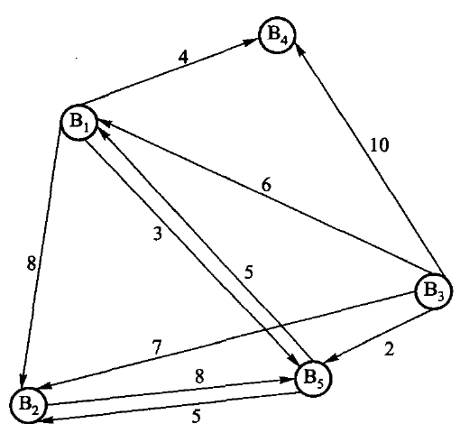
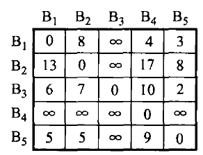
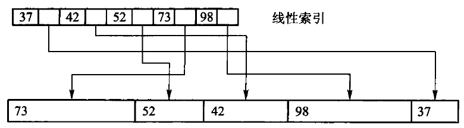
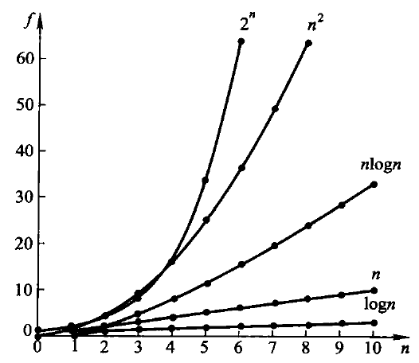

# 第1章 概论

数据结构刻画信息及其关系，算法描述求解过程。二者互相依赖：结构选错了，算法再巧也补不回来。本章先用股市传言把问题说到能写程序，再补回逻辑结构、存储映射、抽象数据类型和渐进分析——这些原书没错，是后面十一章共用的词汇。

## 1.1 问题求解

程序是指令的组合，算法是求解过程的逻辑抽象，数据结构是数据及其关系在计算机里的反映。Wirth 的「程序 = 数据结构 + 算法」说的就是这件事。求解路径通常是：把现实问题抽象成模型，选定逻辑结构与存储方式，再设计算法并写成可运行的程序。

### 1.1.1 问题描述：股市的传言

本章把原书 1.1 的“股市传言”问题写成一个可直接调用的程序。它不是在找“边最多”的经纪人，
而是在找一个起点：从这个人出发能把消息传给**所有**人，并且最慢的那条最短传播路径尽可能短。

### 1.1.2 问题分析和抽象

把 B1 到 B5 看成五个顶点。一条 `Bi -> Bj` 边表示消息能从 `Bi` 直接传给 `Bj`；边权是传播
时间。没有路径就记为 `∞`，表示消息永远传不到那里。B3 是唯一可以到达全部经纪人的起点。

图1.1 经纪人间的消息传递（有向边，时间为权）：

| 起点 | 终点 | 时间 |
| --- | --- | ---: |
| B1 | B4 | 4 |
| B1 | B2 | 8 |
| B1 | B5 | 3 |
| B2 | B5 | 8 |
| B3 | B1 | 6 |
| B3 | B2 | 7 |
| B3 | B4 | 10 |
| B3 | B5 | 2 |
| B5 | B1 | 5 |
| B5 | B2 | 5 |

B3 指出四条边，是唯一能到达其余所有人的起点。原书把这张关系表画成一个有向带权图：



图 1.1　经纪人间的消息传递图。顶点 $\mathrm{B}_i$ 是第 $i$ 个经纪人，有向边 $\langle \mathrm{B}_i,\mathrm{B}_j\rangle$ 表示 $i$ 能把消息传给 $j$，边上的数是所需时间。$\mathrm{B}_i$ 到 $\mathrm{B}_j$ 与 $\mathrm{B}_j$ 到 $\mathrm{B}_i$ 的时间不一定相同——图中 $\mathrm{B}_1\to\mathrm{B}_5$ 是 3，$\mathrm{B}_5\to\mathrm{B}_1$ 是 5。

于是问题变成：在有向带权图里找一个顶点，从它出发能以最短时间把消息送到其余所有顶点。两点之间可以绕道——$\mathrm{B}_5$ 到 $\mathrm{B}_4$ 要经 $\mathrm{B}_1$ 中转，顶点序列 $\mathrm{B}_5\mathrm{B}_1\mathrm{B}_4$ 就是一条路径，路径长度是各边权之和；两点之间最短的那条路径叫最短路径。

本题要算任意两点之间的最短路径，所以图用相邻矩阵存：第 $i$ 行第 $j$ 列是边 $\langle \mathrm{B}_i,\mathrm{B}_j\rangle$ 的权，没有边记 $\infty$。图 1.1 对应的相邻矩阵就是原书的图 1.2。

| | B1 | B2 | B3 | B4 | B5 |
| --- | ---: | ---: | ---: | ---: | ---: |
| **B1** | 0 | 8 | ∞ | 4 | 3 |
| **B2** | ∞ | 0 | ∞ | ∞ | 8 |
| **B3** | 6 | 7 | 0 | 10 | 2 |
| **B4** | ∞ | ∞ | ∞ | 0 | ∞ |
| **B5** | 5 | 5 | ∞ | ∞ | 0 |

图 1.2　经纪人间消息传递的相邻矩阵，即算法的输入。底稿里这张表被 OCR 打坏——**$\infty$ 大量被认成 8**，所以它不能照抄；这里的取值以表 1.1 和图 1.1 为准，并与图 1.3 的结果矩阵逐格对得上。

原书算法 1.1 的工作可以拆成三步：

1. Floyd 算法算出任意两人间的最短传播时间。
2. 对每一个候选起点，找出“从它出发到每个人的最短时间”中最慢的一项。
3. 从这些最大值中选最小的一个；如果某行仍有不可达的 `∞`，该起点不能胜任。

原书中的 `D` 对应现代代码里的 `shortest` 矩阵，`max[i]` 对应每一行的
`largest_distance`，`pos` 对应 `best_source()` 的返回值。下标从 0 开始，因此 B3 的返回值是 2。

### 为什么要取“最慢的一项”

假设从 B3 开始，Floyd 算出的最短传播时间为：到 B1 是 6，到 B2 是 7，到自身是 0，到 B4
是 10，到 B5 是 2。消息要“传遍所有人”，必须等最慢的 B4 收到消息，因此 B3 的完成时间是
这五个数里的最大值 10，而不是它们的和，也不是最小值。

把每个人都当一次起点，结果如下。`∞` 表示至少有一人永远收不到消息，所以这一行没有可用的
完成时间。

| 起点 | 到 B1 | 到 B2 | 到 B3 | 到 B4 | 到 B5 | 最慢的最短时间 | 是否可选 |
| --- | ---: | ---: | ---: | ---: | ---: | ---: | --- |
| B1 | 0 | 8 | ∞ | 4 | 3 | ∞ | 否 |
| B2 | 13 | 0 | ∞ | 17 | 8 | ∞ | 否 |
| B3 | 6 | 7 | 0 | 10 | 2 | **10** | 是 |
| B4 | ∞ | ∞ | ∞ | 0 | ∞ | ∞ | 否 |
| B5 | 5 | 5 | ∞ | 9 | 0 | ∞ | 否 |

这张表就是原书的图 1.3——Floyd 算出的结果矩阵：



图 1.3　Floyd 算完之后的矩阵。每一行是从 $\mathrm{B}_i$ 出发到各点的最短时间；第 3 行最大的一项是 10，其余各行都含 $\infty$。图 1.3 在底稿里是一张图片，没被 OCR 碰过，因此它是核对图 1.2 取值的证据：第 1 行第 2 列印的是 8 而不是 $\infty$，说明 $\mathrm{B}_1\to\mathrm{B}_2$ 确实是一条权为 8 的边。

因此答案是 B3。这个目标常称为“最小化最大距离”：不是选离某一个人最近的起点，而是选让
**最后一个**收到消息的人也尽可能早收到消息的起点。

### 1.1.3 数据结构和算法设计

下面是完整可运行的程序。`RumorNetwork(5)` 创建 B1 至 B5；`add_route(from, to, cost)` 添加一条
**有向**传播路径，三个参数均从 0 开始编号。`best_source()` 返回 `std::optional<std::size_t>`——
可以先理解成一个「可能装着下标的盒子」：有解时盒子里是起点下标，无解时盒子是空的
（`std::nullopt`）。取值前必须先判断盒子空不空，所以「无解」这种情况不可能被漏掉。
为什么不用「返回 `bool` + 引用参数带出下标」的老写法，第 2.2.2 节有完整对照。

源码文件在这里：[可运行示例](../code/ch01/adt/demo.cpp)、
[数据结构实现](../code/ch01/adt/modern.hpp)、[测试用例](../code/ch01/adt/test.cpp)。
`demo.cpp` 负责输入/输出；`modern.hpp` 只负责数据和计算，这就是把“怎么展示”与“怎么算”分开。

```cpp file=code/ch01/adt/demo.cpp
#include "modern.hpp"

#include <iostream>

int main() {
    // B1 ... B5 对应下标 0 ... 4。
    dsa::adt::RumorNetwork network(5);
    network.add_route(0, 3, 4);   // B1 -> B4，耗时 4
    network.add_route(0, 4, 3);   // B1 -> B5，耗时 3
    network.add_route(0, 1, 8);   // B1 -> B2，耗时 8
    network.add_route(1, 4, 8);   // B2 -> B5，耗时 8
    network.add_route(2, 0, 6);   // B3 -> B1，耗时 6
    network.add_route(2, 1, 7);   // B3 -> B2，耗时 7
    network.add_route(2, 3, 10);  // B3 -> B4，耗时 10
    network.add_route(2, 4, 2);   // B3 -> B5，耗时 2
    network.add_route(4, 0, 5);   // B5 -> B1，耗时 5
    network.add_route(4, 1, 5);   // B5 -> B2，耗时 5

    const auto source = network.best_source();
    if (source) {
        std::cout << "最佳传播起点是 B" << *source + 1 << '\n';
    } else {
        std::cout << "不存在能到达全部经纪人的起点\n";
    }
}
```

在仓库根目录运行：

```bash
c++ -std=c++17 -Wall -Wextra -Werror -Icode/ch01/adt code/ch01/adt/demo.cpp -o /tmp/rumor-demo
/tmp/rumor-demo
```

第一行是“编译”，第二行是“运行刚刚编译出的程序”。逐项解释如下：

| 片段 | 含义 |
| --- | --- |
| `c++` | C++ 编译器命令。在 macOS 上通常指 Clang；Linux 上也可能指 GCC。 |
| `-std=c++17` | 按 C++17 语言规则编译；本教程的 `std::optional` 需要 C++17。 |
| `-Wall -Wextra` | 打开常见和额外的编译器警告，例如未使用变量或可疑转换。 |
| `-Werror` | 把警告当作错误；用于学习时可及早发现问题。初学调试时可暂时去掉它。 |
| `-Icode/ch01/adt` | 加一个头文件搜索目录，因此 `#include "modern.hpp"` 能找到 `code/ch01/adt/modern.hpp`。 |
| `code/ch01/adt/demo.cpp` | 要编译的源文件。它包含 `main()`，所以可以成为可执行程序。 |
| `-o /tmp/rumor-demo` | 指定输出文件名为 `/tmp/rumor-demo`。`/tmp` 是临时目录，重启后文件可能消失。 |
| `/tmp/rumor-demo` | 运行该可执行文件，打印程序结果。 |

如果系统提示 `c++: command not found`，需要先安装 C++ 编译器；如果想把程序留在当前目录，
可以把 `-o /tmp/rumor-demo` 改成 `-o rumor-demo`，再运行 `./rumor-demo`。

输出是：

```console
最佳传播起点是 B3
```

如果删除 B3 的某条出边，例如 `network.add_route(2, 1, 7)`，B3 将无法到达 B2；当不存在任何
能覆盖全部顶点的起点时，`best_source()` 返回空值，程序会输出“不存在能到达全部经纪人的起点”。

可以先只改边和权值，再运行同一条命令观察结果。例如把 `B3 -> B4` 的时间从 10 改为 1，答案
仍是 B3，只是它的最慢传播时间从 10 缩短为 7。

### 实现导读

先只关注三个公开操作：构造函数建立距离矩阵，`add_route` 填入直接边，`best_source` 计算答案。
`best_source` 内部复制一份矩阵，因而多次调用不会改变原始网络。下面按代码出现顺序解释。

#### 预处理、头文件与命名空间

`#pragma once` 告诉编译器：同一个头文件即使被间接包含多次，也只处理一次，避免类定义重复。

| 头文件 | 本程序用它做什么 |
| --- | --- |
| `<cstddef>` | 提供 `std::size_t`，表示非负的大小或下标。 |
| `<limits>` | 提供 `std::numeric_limits<int>::max()`，取得 `int` 可表示的最大值。 |
| `<optional>` | 提供 `std::optional`，表达“可能没有答案”。 |
| `<stdexcept>` | 提供 `std::invalid_argument`，用于报告非法参数。 |
| `<vector>` | 提供动态数组 `std::vector`，这里用它保存二维距离矩阵。 |

`namespace dsa::adt { ... }` 把名字放入 `dsa::adt` 命名空间。完整类名因此是
`dsa::adt::RumorNetwork`，可避免项目中另一个人也定义 `RumorNetwork` 时发生重名。
代码块中的 `// >>> adt` 与 `// <<< adt` 只是本书稿的同步标记，不参与 C++ 逻辑。

#### 类、常量和构造函数

`class RumorNetwork` 定义一种新类型。`public:` 以下是调用者可以使用的接口；`private:` 以下是
实现细节，调用者不能直接改写。

```text
static constexpr int infinity = std::numeric_limits<int>::max() / 4;
```

`static` 表示 `infinity` 属于类本身，而不是每个对象各存一份；`constexpr` 表示编译期常量。
取最大值的四分之一而非最大值，是为了计算 `a + b` 时仍留有余量，避免整数溢出。

```text
explicit RumorNetwork(std::size_t people)
    : distance_(people, std::vector<int>(people, infinity)) { ... }
```

这是构造函数：`RumorNetwork network(5)` 会调用它。冒号后的部分叫**成员初始化列表**，先创建
`distance_`，再进入花括号。它构造一个 5 行、每行 5 列的整数矩阵，初始全为 `infinity`。随后
循环把对角线改为 0，因为一个人到自己不需要传播时间。矩阵的第 `from` 行、第 `to` 列总是表示
从 `from` 到 `to` 的当前已知最短时间。

#### 添加一条边

```text
void add_route(std::size_t from, std::size_t to, int cost)
```

这三个参数分别是起点编号、终点编号和直接传播时间。第一段 `if` 检查编号是否越界、时间是否为
负；不满足题目定义时抛出 `std::invalid_argument`，调用者可用 `try/catch` 处理。第二段 `if` 只在
新边更短时更新矩阵，所以即使重复添加同一方向的边，也保留较小的时间。

#### Floyd 三重循环

`auto shortest = distance_;` 复制输入矩阵。`auto` 让编译器自动推断类型，这里实际是
`std::vector<std::vector<int>>`。

三层循环的含义不是“随便循环三次”，而是按中转站逐步扩大可用路径：

```text
for each via:       允许路径经过 via
  for each from:    固定起点 from
    for each to:    固定终点 to
      比较 原来的 from->to 与 from->via->to
```

条件 `shortest[from][via] != infinity && shortest[via][to] != infinity` 先确认两段都可达。
若 `from -> via -> to` 的总时间更小，就更新 `shortest[from][to]`。例如 B2 到 B4 没有直接边，
但 B2→B5 是 8、B5→B1 是 5、B1→B4 是 4，所以 Floyd 最终得到 B2→B4 是 `8 + 5 + 4 = 17`。

#### 从最短路矩阵选答案

```text
std::optional<std::size_t> result;
int smallest_eccentricity = infinity;
```

默认构造的 `result` 是空值，表示“还没有找到合格起点”。`smallest_eccentricity` 保存目前见过的
最小完成时间。这里的 eccentricity（离心率）就是某起点到全部顶点的最短距离中的最大值。

外层循环每次处理一行，即一个候选起点；内层循环扫描该行。三目表达式
`distance > largest_distance ? distance : largest_distance` 等价于“若新值更大就采用新值，否则保留
旧值”，最终得到这行的最大值。若它比当前最佳值小，就同时更新最佳时间与 `result`。

任何一行含 `infinity` 时，该行最大值也是 `infinity`，不会优于有限答案；若所有行都是
`infinity`，`result` 保持为空，函数返回 `std::nullopt`。`[[nodiscard]]` 提醒编译器：调用者不应
无意丢弃这个可能为空的重要返回值。

#### 私有数据成员

```text
std::vector<std::vector<int>> distance_;
```

外层 `vector` 是行，内层 `vector<int>` 是一行中的列，合起来是二维矩阵。末尾下划线是本教程的
约定，表示私有成员；它与函数参数 `distance` 或局部变量 `shortest` 不会混淆。

时间复杂度为 O(V^3)，空间复杂度为 O(V^2)。这适合顶点数较少、需要比较所有起点的示例；大图
通常应根据图的稀疏度和查询需求选择其他最短路径算法。

### 现代实现

```cpp file=code/ch01/adt/modern.hpp
#pragma once

#include <cstddef>
#include <limits>
#include <optional>
#include <stdexcept>
#include <vector>

namespace dsa::adt {

// >>> adt
class RumorNetwork {
public:
    static constexpr int infinity = std::numeric_limits<int>::max() / 4;

    explicit RumorNetwork(std::size_t people)
        : distance_(people, std::vector<int>(people, infinity)) {
        for (std::size_t person = 0; person < people; ++person) {
            distance_[person][person] = 0;
        }
    }

    void add_route(std::size_t from, std::size_t to, int cost) {
        if (from >= distance_.size() || to >= distance_.size() || cost < 0) {
            throw std::invalid_argument("route");
        }
        if (cost < distance_[from][to]) {
            distance_[from][to] = cost;
        }
    }

    [[nodiscard]] std::optional<std::size_t> best_source() const {
        auto shortest = distance_;
        for (std::size_t via = 0; via < shortest.size(); ++via) {
            for (std::size_t from = 0; from < shortest.size(); ++from) {
                for (std::size_t to = 0; to < shortest.size(); ++to) {
                    if (shortest[from][via] != infinity &&
                        shortest[via][to] != infinity &&
                        shortest[from][to] > shortest[from][via] + shortest[via][to]) {
                        shortest[from][to] = shortest[from][via] + shortest[via][to];
                    }
                }
            }
        }

        std::optional<std::size_t> result;
        int smallest_eccentricity = infinity;
        for (std::size_t from = 0; from < shortest.size(); ++from) {
            int largest_distance = 0;
            for (int distance : shortest[from]) {
                largest_distance = distance > largest_distance ? distance : largest_distance;
            }
            if (largest_distance < smallest_eccentricity) {
                smallest_eccentricity = largest_distance;
                result = from;
            }
        }
        return result;
    }

private:
    std::vector<std::vector<int>> distance_;
};
// <<< adt

}  // namespace dsa::adt
```

## 1.2 数据结构

数据结构描述的是：按一定逻辑关系组织起来的数据，它们在计算机里怎么存放，以及定义在其上的运算。三件事要分开看——逻辑结构、存储结构、运算——后面各章都在这三层之间做选择。

### 1.2.1 数据的逻辑结构

逻辑结构是从具体问题里抽出来的模型，只谈「有哪些结点、结点之间是什么关系」，不谈它们占几个字节。1.1 节经纪人之间的传播路径就是一个有向图：结点是人，关系是「消息能直接传给谁」。

从集合论的观点来看，数据的逻辑结构可以用一个二元组 $B = (K, R)$ 来表示。其中 $K$ 是数据结点（node）组成的有穷集合，每一个结点代表一个数据或一组有明确结构的数据；关系集 $R$ 是定义在集合 $K$ 上的一组二元关系（binary relation），其中每个关系 $r \in R$ 都是 $K$ 上的二元关系，用来描述数据结点之间的逻辑关系。$K$ 上的二元组是 $K$ 中元素的有序对，记为 $\langle k, k' \rangle$（$k, k' \in K$）。$K$ 上的一个关系即为 $K$ 上的一些二元组所组成的集合，$K$ 上不同的二元组集合构成不同的关系。

若 $r \in R$，有 $k, k' \in K$，$\langle k, k' \rangle \in r$，则称 $k$ 为 $k'$ 在关系 $r$ 上的**前驱**，$k'$ 为 $k$ 在关系 $r$ 上的**后继**。没有前驱的结点称为**开始结点**，没有后继的结点称为**终止结点**。

教学计划是另一个常见例子。每门课是一个结点，全部必修课组成 $K$；「必须先修」是 $K$ 上的一个关系。`<程序设计, 数据结构>` 表示必须先上程序设计，再上数据结构。没有先修约束的课可以并行开设。

**结点的类型。** 数据结构重点研究的是数据间的结构关系，因此把组成结构的那些元素都视为结点；结点是数据结构中数据的基本单位。结点的数据类型既可以是基本数据类型，也可以是复合数据类型。基本数据类型是指数据结点所包含的元素被作为整体看待和处理的类型，类似于常见的程序设计语言中提供的基本数据类型，例如整数类型（integer）、实数类型（real）、布尔类型（bool）、字符类型（char）和指针类型（pointer）等。复合类型是由基本数据类型组合而成的数据结构类型，不同的组合方式形成不同的类型；像程序语言中的数组类型、结构（记录）类型、对象类型等都属于复合数据类型，而复合数据类型本身，又可以参与定义结构更为复杂的结点类型。总而言之，结点的类型不限于基本数据类型，可以根据应用的需要来灵活定义。数据结构课关心的是结点之间的关系，所以通常把结点当作黑盒。

**结构的分类。** 讨论逻辑结构 $(K, R)$ 的结构分类，一般以关系集 $R$ 的分类为主。在本书讨论的数据结构中，$R$ 中一般只包含一个关系。假定关系集 $R$ 仅含一个关系 $r$，即 $R = \{r\}$，此时记 $(K, R)$ 为 $(K, r)$。根据 $r$ 所刻画的数据结构的性质来对逻辑结构进行分类。

**线性结构**（linear structure）中的关系 $r$ 称为线性关系，也称前驱关系。结点集合 $K$ 中的每个结点在关系 $r$ 上最多只有一个前驱结点和一个后继结点。具体而言，结点集合 $K$ 在关系 $r$ 上存在一个唯一的开始结点，它没有前驱、但有唯一的后继；也存在一个唯一的终止结点，具有一个唯一的前驱而没有后继；其他结点均为内部结点，在关系 $r$ 上既有一个唯一的前驱，也有一个唯一的后继。线性结构在程序设计中应用最多，例如数组、链表、栈和队列等。

**树形结构**（tree structure）简称树结构或层次结构，其关系 $r$ 一般称为层次关系。结点集合 $K$ 中有且仅有一个结点 $k_0 \in K$，在关系 $r$ 中没有前驱，该结点称为树根（root）。除结点 $k_0$ 外，$K$ 中所有结点都有且仅有一个前驱，但后继的数目不加限制。同时，$K$ 中除结点 $k_0$ 外的任何结点 $k \in K$，都存在一个结点序列 $k_0, k_1, \cdots, k_s$，使得 $k_0$ 是树根，且 $k_s = k$，有序对 $\langle k_{i-1}, k_i \rangle \in r$（$1 \le i \le s$），这样的结点序列称为从根到结点 $k$ 的一条**路径**（path）。树形结构存在很多形态，如二叉树结构、有序树结构等，它们都有着各自独特的应用。UNIX 和 DOS 中的文件系统就是一个典型的树结构。

**图结构**（graph structure）有时也称为网络结构。图结构的关系 $r$ 对集合 $K$ 中结点的前驱和后继数目不加任何约束。例如，交通网络就是一个非常复杂的典型图结构；1.1 节的传言网也是图。

从数学上看，树形结构和图结构的基本区别就是「每个结点是否仅仅从属于一个直接前驱」，而线性结构和树形结构的基本区别是「每个结点是否仅有一个直接后继」。

以上这种结构分类揭示出枯燥数据之间的相互关系，给出了关系本身的一般性质。这对于理解数据结构以及正确设计算法都很重要，后面各章都建立在这三种关系上。

### 1.2.2 数据的存储结构

存储结构回答的是：同一套逻辑关系，在计算机的存储器里怎么落下来。主存按字节编址，相邻单元的地址连续，并且可以按地址随机访问、访问时间基本相同。

计算机的主存储器具有「空间相邻」和「随机访问」的特点：基本的存储单元是字节，用非负整数对存储地址编码，提供对存储空间上相邻的单元集合的随机访问；计算机指令具有按地址随机访问存储空间内任意单元的能力，访问不同地址所需的访问时间基本相同。

对于逻辑结构 $(K, r)$ 而言，其数据的存储结构就是建立一种由逻辑结构到物理存储空间的映射。一方面，需要建立一个从结点集合 $K$ 到存储器 $M$ 的映射 $K \to M$，其中每一个结点 $k \in K$ 都对应一个唯一的连续存储区域 $c \in M$；另一方面，还要把每一个关系元组 $\langle k_i, k_j \rangle \in r$（其中 $k_i, k_j \in K$ 是结点）映射为相应的存储单元的地址间的关系（顺序关系，或指针的地址指向关系）。

同一种逻辑结构可以采用不同的表示方式，即采用不同的映射关系来建立数据的逻辑结构到存储结构的转换。例如，线性结构既可以采用顺序的方式来存储，形成顺序表；也可以采用链接的方式，得到链表。

常用的四种基本方法如下。

**顺序方法**把一组结点存放在一片地址相邻的存储单元中，结点间的逻辑关系用存储单元间的自然顺序关系来表达。顺序存储法为使用整数编码访问数据结点提供了便利，按下标访问因此是 $O(1)$；程序设计语言内提供的数组就是顺序方法的一个具体实例。

顺序存储结构通常也被称为**紧凑存储结构**：其紧凑性是指其存储空间除了存储数据本身之外，没有存储其他附加的信息。紧凑性可以用**存储密度**来度量——所存储的「数据」占用的存储空间，和该结构（包括附加信息）占用的整个存储空间大小之比。显然，存储密度太小的存储结构，其空间效率比较低。

除线性结构外，对于部分非线性数据结构也可以采用顺序存储方法。例如树形结构也可采用顺序方式来存储，前提是同时存储一些附加信息来表示结点之间的逻辑关系：完全二叉树按层编号后，孩子下标可以用 $2i+1$、$2i+2$ 算出来（第 5 章）。

**链接方法**在每个结点里附一个（或多个）指针域，专门存放后继的地址。结点因此分成数据域和指针域。需要一个结点同时挂多个后继时，就放多个指针。链接适合经常增删、长度事先不知道的结构。代价是：不知道指针时，只能从链头一个一个比下去；按位置访问不再是 $O(1)$。

**索引方法**是顺序存储的一种推广：通过建造一个由整数域 $Z$ 映射到存储地址域 $D$ 的索引函数 $Y : Z \to D$，把整数索引值 $z$ 映射到结点的存储地址 $d \in D$，从而形成一个存储了一组指针的索引表，每个指针指向存储区域的一个数据结点。索引表的存储空间是**附加在结点存储空间之外**的，每一个元素就是指向相应数据结点的指针，即结点存储单元的开始地址。

作为一种存储机制，索引的主要作用是提高检索的效率。当数据量很大时，对数据的检索可能涉及大量读/写磁盘的操作，会影响效率；通过索引则可以降低读/写的数据量——根据检索码确定了被检索数据的存储地址之后，再进行相应的读/写。

原书特意指出，索引函数一般**不是**数组那样的简单线性函数——数据结点长度不等时它就不可能是线性的。图 1.4 画的正是这种情况：



图 1.4 索引示例

把它抄成文字，两行数字对照着看：

```text
存储区的数据 —— 物理无序，而且每块长度不等
┌────────────────┬──────────┬────────────┬──────────────┬────────┐
│ [1] 73         │ [2] 52   │ [3] 42     │ [4] 98       │ [5] 37 │
└────────────────┴──────────┴────────────┴──────────────┴────────┘

线性索引 —— 附加在数据之外的一张小表
┌──────┬──────┬──────┬──────┬──────┐
│  37  │  42  │  52  │  73  │  98  │   关键码：升序 —— 逻辑有序
├──────┼──────┼──────┼──────┼──────┤
│ [5]  │ [3]  │ [2]  │ [1]  │ [4]  │   指向第几块：乱序 —— 物理无序
└──────┴──────┴──────┴──────┴──────┘
```

**这两行的错位就是索引的全部意义。** 上面一行升序，所以可以在索引里二分；下面一行完全乱序，说明数据一块都没有搬动过。要找关键码 52，先在索引里二分定位到第 3 列，读出 `[2]`，再直接去存储区取第 2 块——**只读了一块，没有扫过其余四块**。

顺带看一眼每块的宽度：五块长度各不相同。正因为长度不等，"第 k 块在哪"就没法用 `起始地址 + k × 块长` 算出来，只能查表——这才是原书说"索引函数并非数组那样的简单线性函数"的意思。

**散列方法**是索引法的一种延伸和扩展：散列法利用散列函数进行索引值的计算，然后通过索引表求出结点的指针地址。其主要思想是根据结点的关键码值来确定其存储地址——利用一种称为散列函数（hash function）的关系，把关键码的值映射到存储空间的地址，然后把结点存入此存储单元中。散列技术的关键问题是如何选择和设计恰当的散列函数、构造散列表、研究构造散列表时的碰撞解决方案等。

一个散列函数把一个给定的关键码映射为一个小于 $K$ 的非负整数，$K$ 的大小取决于具体的应用。散列函数应该满足一些重要的散列性质：散列函数计算出的地址尽可能均匀地分布在构造的散列表地址空间；散列函数的计算应该简单化，以便提高地址计算速度。冲突怎么处理、装载因子多高会退化，是第 10 章的内容。

在一个具体的应用中，可以根据需要选用以上 4 种存储方法或其组合。例如，树形结构的「子结点表」表示方法就是顺序和链接的结合（第 6 章）。另外，一个逻辑结构可以有多种不同的存储方案，因此在选择存储方法时，还要综合考虑定义在其上的运算及其算法的实现——要不要随机访问、会不会频繁插入、数据在内存还是外存。

### 1.2.3 抽象数据类型

抽象意味着同一个概念可以有多种实现。一旦抽象问题被解决，许多同类问题就不必从头再来。用户自定义的类型，通常就是对「多种可能的存储和实现」做一次抽象。

抽象数据类型（abstract data type，ADT）这个词是逐步形成的。二十世纪六七十年代，人们把用户自己定义的类型叫做抽象数据类型。更早的算法语言往往不提供这种机制。六十年代后期，为了把算法细节和数据的内部结构藏起来，Simula 67 引入了类，随后出现了模块：模块式给出外部看得见的运算接口，模块体存放对外不可见的私有数据和实现。接口与实现分离之后，用户才能真正自定义类型，达到数据抽象和信息隐蔽。在这个意义下，模块所定义的数据类型就叫做抽象数据类型。

作为描述数据结构的理论工具，ADT 可以看成「定义了一组操作的抽象模型」。它把数据和操作封在一起，使用方只能通过这些操作访问数据，不能直接去翻内部表示。这样，讨论一种结构时可以先不管它是数组还是链表，只问它提供哪些运算、这些运算有什么约定。整数连同加、减、乘、除，就是一个最简单的 ADT。

一般写成三元组 $(D, R, P)$：

```text
ADT 名字 {
    数据对象 D：结点是什么
    数据关系 R：结点之间有什么关系
    基本操作 P：对外提供哪些运算
}
```

$D$ 和 $R$ 给出数据模型，是对数据的抽象；$P$ 给出这个模型能做什么，是对操作的抽象。

在面向对象语言里，一组操作常常先写成接口，不透露实现。C++ 用类（以及类模板）的声明表示 ADT，用类的定义去实现它。因此，一个写好的 C++ 类同时承担两件事：它是某种存储结构，也是这组运算在该存储上的实现。

这两层不要混：概念层上的 ADT 描述「问题需要什么运算」；实现层上的类描述「这些运算在内存里怎么做」。类本身还是一种普通类型，可以拿来定义变量，也就是对象。所以 ADT 也可以说成：数据的逻辑结构，加上定义在这个逻辑结构上的一组抽象运算。

原书【代码1.2】用下面这个空模板来提醒读者「先写接口」：

```text
template <class Type>
class ClassName {
private:
    Type data;          // 取值类型和存储
public:
    void method();      // 对外运算
};
```

原书习惯先写一个只有函数声明、没有任何实现的抽象基类（例如 `List<T>`），再让 `arrList`
继承它。本书各章不这么做，原因有两条：

- **它给不了多态。** 基类之所以有用，是因为可以「拿基类指针指向派生对象」，
  写一份代码同时适用于顺序表和链表。但本书各章的容器是**模板**，元素类型在编译期就定了，
  彼此之间根本不需要互相替换；这个基类从头到尾没有一处用到。
- **它还会引入一个陷阱。** 只要基类的析构函数不是 `virtual` 的，一旦有人写出
  `List<int>* p = new ArrayList<int>; delete p;`，标准规定这是**未定义行为**——
  编译器不保证会发生什么：常见后果是只析构了基类那一层，派生类里 `new` 出来的缓冲区
  没人释放，内存就漏了；也可能直接崩。「未定义行为」这个词在本书里会反复出现，
  它的意思始终是「标准不再对程序的行为作任何承诺」，而不是「结果不确定但还能用」。

所以运算直接写在实现类上。对元素类型的要求，正文里用一句话说清即可：例如顺序栈、
顺序表底层是 `new T[n]`，会把整块槽位都默认构造出来，所以 `T` 必须能默认构造。

## 1.3 算法

算法的研究可以追溯到公元前 300 多年。算法的中文名称出自《周髀算经》，而英文名称 algorithm 则源于 9 世纪波斯数学家比阿勒·霍瓦里松的名字 al-Khwarizmi，他首先在数学上提出了算法这个概念。算法的第一次编写是 Ada Byron 于 1842 年为巴贝奇分析机编写求解伯努利方程的程序，因此 Ada Byron 被大多数人认为是世界上第一位程序员；由于查尔斯·巴贝奇（Charles Babbage）未能完成他的分析机，这个算法最终未能在机器上执行。20 世纪的英国数学家图灵（Turing）提出了著名的图灵论题，并提出一种假想的计算机的抽象模型，这个模型被称为图灵机。图灵机的出现解决了算法定义的难题，对算法的发展起到了重要的作用，使得大多数算法都可以转换成程序交给计算机执行，原来认为靠人力难以完成的算法也变得可行。由此也拉开了算法研究和实用的帷幕。

从应用范围来看，算法可分成数值算法和非数值算法两大类；从工作方式看，算法可分成串行算法和并行算法两大类。早在 20 世纪 70 年代，D. E. Knuth 就指出，计算机科学就是研究算法的学问。本书后面各章几乎都是非数值的、串行的算法。

### 1.3.1 算法的概念

简单来说，算法是对特定问题求解过程的描述，是指令的有限序列，即为解决某一特定问题而采取的具体而有限的操作步骤。程序是算法的一种实现，计算机按照程序逐步执行算法，实现对问题的求解。

求最大公因子的辗转相除法，以及求解联立线性方程组的主元素消除法，都是算法的典型例子。求解一个问题，通常用该问题的**输入数据类型**和该问题所要求解的**结果（算法的输出数据）所应遵循的性质**来描述。以求最大公因子算法为例，它的输入是整数类型，输入数据是任意给定的两个正整数 $n$ 和 $m$，而算法的输出则是既能整除 $n$ 又能整除 $m$ 的所有公因子中的最大的非负整数。对于求解联立线性方程组，它的输入数据是方程的系数矩阵和方程等式右侧的常数向量，而其输出结果数据是方程变元的一组取值，它们代入方程应该满足所给的等式。

算法一般具有以下性质。

1. **算法的通用性。** 对于那些符合输入数据类型的**任意**输入数据，都能根据算法进行问题求解，并保证计算结果的正确性。不是只对书上那一组样例成立。
2. **算法的有效性。** 算法是有限条指令组成的指令序列，其中每一条指令都必须能够被人或机器所确切执行。指令的类型应该明确规定，仅限于若干明确无误的指令动作，是一个有限的指令集。例如辗转相除法，其基本动作（指令）只包括整数相除求余数和商数以及判断余数是否为 0 等几个指令。这些基本指令不仅能够被准确无误地执行，而且每一步的执行结果具有确定的类型。算法的有效性不仅指出了每一步指令能够被有效执行，而且也规定了指令的执行结果，其结果应具有确定的数据类型，是可预期的。
3. **算法的确定性。** 算法每执行一步之后，关于下一步怎么执行，应该有明确的指示。下一步动作可以是条件判断、分支指令、顺序执行一条指令，或者指示整个算法的结束等。算法的确定性就是要保证每一步之后都有关于下一步动作的指令，不能缺乏下一步指令（即「被锁住」状态），或仅含有模糊不清的指令。
4. **算法的有穷性。** 算法的执行必须在有限步内结束，换言之，算法不能含有死循环。注意，**算法由有限条指令所组成这一事实本身并不能保证算法执行的有穷性**：循环条件写错，有限条指令也可以转个没完。设计算法时，应该关注算法的结束条件。

总之，了解这些基本性质有助于人们更确切地理解算法的概念。

### 1.3.2 算法设计

算法设计与算法分析是计算机科学的核心问题。算法设计是求解问题时必须要考虑的，其任务是对各类具体问题设计求解的方法和过程。常用的算法设计方法有穷举法（enumeration）、回溯法（backtrack）、分治法（divide and conquer）、递归法（recursion）、贪心法（greedy）和动态规划法（dynamic programming）等。下面分别就这些算法设计方法予以简单介绍。

**1. 穷举法。** 穷举法也称枚举法，其基本思想是将问题空间中的所有求解对象一一列举出来，然后逐一加以分析、处理，并验证结果是否满足给定的条件。穷举完所有对象后，问题将最终得以解决。穷举法具有以下一些特点：

1. 对象应该是有限的，有明显的穷举范围；
2. 有穷举规则，可按某种规则列举对象；
3. 一时找不出解决问题的更好途径。

一般而言，对一个问题空间进行全局的穷举，往往很费时间，效率上难以满足要求，但在问题的局部采用穷举法常很有效。例如，C/C++ 语言中常用的分支语句 `switch` 就是一种穷举。

**2. 回溯法。** 回溯法也称试探法，该方法的基本思想是将问题的候选解按某种顺序逐一枚举和检验，来寻找一个满足预定条件的解。当发现当前候选解不可能是解时，就退回到上一步重新选择下一个候选解；如果当前候选解还不满足问题规模要求，但是满足所有其他要求，那么继续扩大当前候选解的规模，并继续试探；如果当前候选解满足包括问题规模在内的所有要求时，该候选解就是问题的一个解。在回溯法中，放弃当前候选解、寻找下一个候选解的过程称为**回溯**；扩大当前候选解的规模、以继续试探的过程称为**向前试探**。

第 5、6、7 章将要介绍的深度优先搜索就是典型的回溯法实例；第 3 章的背包问题也是。

**3. 分治法和递归法。** 分治法的设计思想很朴素，其要点是在遇到一个难以直接解决的大问题时，将其分割成一些规模较小的子问题，以便各个击破、分而治之，然后把各个子问题的解合并起来，得出整个问题的解。分治法是一种**自顶向下**的设计方法。

如果原问题可分割成若干个子问题，这些子问题都可解，并且可利用这些子问题的解求出原问题的解，那么这种分治法就是可行的。由分治法产生的子问题往往是原问题的较小模式，在这种情况下，反复应用分治手段，可以使问题的规模不断缩小，最终缩小到很容易直接求出其解的规模，这自然会导致递归过程的产生。**分治与递归如同一对孪生兄弟**，经常同时应用在算法设计之中，并由此产生许多高效算法。

本书第 8 章的快速排序、归并排序，以及第 10 章的二分检索，都是分治法的应用实例。（原书此处写的是「第 8、9 章」，但二分检索讲在第 10 章，这里按本书的实际编号更正。）

**4. 贪心法和动态规划法。** 贪心法的基本思路是从问题的初始状态出发，依据某种贪心标准，通过若干次的贪心选择而得出最优值（或较优解）。贪心法并不是从整体上考虑问题，它所做出的选择只是在某种意义上的局部最优解，寄希望于由局部的最优解构建最终的全局最优解。**选择能产生问题最优解的最优度量标准，是使用贪心法的核心问题。**

比贪心法更为一般的动态规划法通常也用于求解具有某种最优性质的问题。当一个问题的解可以看成一系列判定的结果时，可以利用动态规划方法设计其求解算法。在这类问题中，可能会有许多可行解，希望从中找到具有最优值的解。动态规划法与分治法类似，其基本思想也是将待求解问题分解成若干个子问题，先求解子问题，然后从这些子问题的解得到原问题的解。**与分治法不同的是**，适合于用动态规划求解的问题，经分解得到的子问题往往不是相互独立的。若用分治法来解这类问题，则分解得到的子问题数目太多，有些子问题被重复计算了很多次。如果能够保存已解决的子问题答案，而在需要时利用这些已求得的答案，就可以避免大量的重复计算，节省时间。一般用一张表来记录所有已解的子问题的答案：不管该子问题以后是否被用到，只要它被计算过，就将其结果填入表中——这就是动态规划法的基本思路。

第 7 章介绍的最小生成树的 Prim 算法和 Kruskal 算法、求最短路径的 Dijkstra 算法和 Floyd 算法，其中 Floyd 算法是比较典型的动态规划，而其他 3 种算法是贪心算法。第 12 章的最佳二叉搜索树也是动态规划。

可以选择和组合这些基本算法设计方法，根据问题的资源约束和要求，设计出相关数据结构和算法来求解问题。运用算法的常见方式有以下 4 种：

1. 算法的组合；
2. 经典算法的变形与推广；
3. 研究困难问题的特殊情况；
4. 探索新的算法。

回到 1.1 节的传言问题：它要的是任意两点之间的最短路径，并且顶点数很小，所以选 Floyd，而不是对每个起点各跑一遍 Dijkstra。后面各章会反复回到这几种方法。

## 1.4 算法分析

一般而言，同一类问题总是存在着多种解决方案，即针对一个问题可以有多个算法。这些算法也许各有其优缺点以及适用的场景。那么如何在多个算法中按照某种原则进行取舍？这就需要用到算法分析技术来评价算法的效率。

算法分析的任务是利用数学工具，对每一个具体算法讨论其各种复杂度，以探讨某种具体算法适用于哪类问题，或某类问题宜采用哪种算法。其目的在于从解决同一问题的不同算法中选择出比较合适的一种，或者是对原有的算法进行改造、加工，使其更优。

为比较不同算法的效率，Juris Hartmanis 和 Richard E. Stearns 提出了一种称为计算复杂性（computational complexity）的方法来度量算法的难度。计算复杂性分析显示了实施一个算法所需的努力或代价。对于一个算法而言，其复杂性的高低体现在运行该算法所需要的计算机资源的多少上：所需的资源越多，表明该算法的复杂性越高；反之越低。计算机资源中最重要的是时间资源（即处理器）和空间资源（即存储器），因而算法的复杂性通常体现为时间复杂性和空间复杂性两个指标。本书后文说的「时间代价」「空间代价」，指的就是这两项。（这两个人名在原书里印作 “Juris Hartmanishe” 与 “Richars E. Stearns”，此处按学界通行拼法更正。）

不言而喻，对于任意给定的问题，设计出复杂性尽可能低的算法是人们追求的一个重要目标；另一方面，当给定的问题已有多种算法时，选择其中复杂性最低者，也是选用算法时应遵循的一个重要准则。因此，复杂性分析对算法的设计或选用有着重要的指导意义和实用价值。

对于算法的复杂性，首先需要明确两个问题：

1. 怎样**表达**一个算法的复杂性；
2. 怎样**计算**一个算法的复杂性。

影响程序运行时间的因素有很多。一个运行在 Cray 巨型机上的算法，放在 PC 上肯定会慢很多；反过来，一个效率较差的算法运行在 Cray 上，也可能比一个效率极好的算法运行在 PC 上还要快许多。即使运行在同样的机器上，所采用的程序语言不同，运行时间也可能不同：采用编译型的语言往往要比解释型的语言快许多——原书举的例子是，采用 C 语言编写的程序，比用 LISP 语言编写的、采用同样算法的程序快将近 20 倍。

综上所述，评估算法的效率不能采用诸如微秒、纳秒这样的真实时间单位。对算法分析来说，最重要的不是具体的运行时间，而是**算法与输入规模之间的关系**：用一定「规模（size）」的数据作为输入时，程序运行所需的「基本操作（basic operation）」数来描述时间效率。例如，如果数据规模 $n$ 和运行时间 $t$ 之间存在线性关系 $t_1 = cn_1$，那么数据规模增加到原来的 5 倍后，运行时间也相应地增加同样的倍数，即 $n_2 = 5n_1$，则 $t_2 = 5t_1$。同理，如果 $t_1 = \log_2 n$，则规模加倍只意味着时间增加一个单位：$n_2 = 2n$ 时 $t_2 = \log_2(2n) = \log_2 n + 1 = t_1 + 1$。

此处「规模」和「基本操作」的关系视具体的算法而定。「规模」一般指输入量的数目，例如在排序问题中，问题的规模即为待排序元素的个数；而完成一个「基本操作」所需的时间应该与被操作的具体数值无关，例如两个整数相加的操作时间，与这两个整数的具体取值没有关系。

### 1.4.1 渐进分析方法

一般情况下，用来表示数据规模和时间关系的函数都相当复杂。计算这样的函数时通常只考虑大的数据，而那些不能显著改变函数量级的部分都可以忽略掉；其结果是原函数的一个近似值，这个近似值在数据规模很大时会足够接近原值。这种方法称为渐进算法分析（asymptotic algorithm analysis）方法，简称渐进分析。例如下面这个函数：

$$f(n) = n^2 + 100n + \log_{10} n + 1000$$

在 $n$ 的取值很小时，例如为 1 时，最后的常数项 1000 对函数值的贡献最大；当 $n = 10$ 时，第 2 项（$100n$）和最后的 1000 具有相同的贡献；当 $n$ 达到 100 时，前两项的贡献相同；但当 $n$ 大于 100 后，第 2 项的贡献就小于第 1 项，而且 $n$ 越大，第 2 项对函数值而言就越微不足道。由于第 1 项是二次增长的，当 $n$ 取值很大时，函数的取值主要依赖于第 1 项的贡献。

渐进分析是对资源开销的一种不精确的估计，它提供的是对算法所需资源开销进行评估的简化模型，以便把注意力集中在最重要的部分。应该注意的是，**并非任何情况下都可以忽略常数部分**：当算法要解决的问题规模很小时，各项系数和常数项就会起到举足轻重的作用，如同上面的函数所示。因此，用于上万个数的排序算法，也许并不适用于仅对 10 个数的排序。

**大 O 表示法。** 渐进分析最常用的表示方法是估计函数的增长趋势，采用由 Paul Bachmann 于 1894 年引入的大 $O$ 表示法。设 $f$ 和 $g$ 为从自然数到非负实数集的两个函数。

> **定义 1**　如果存在正数 $c$ 和 $N$，使得对任意的 $n \ge N$，都有 $f(n) \le c\,g(n)$，则称 $f(n)$ 在集合 $O(g(n))$ 中，或简称 $f(n)$ 是 $O(g(n))$ 的。

该定义说明了函数 $f$ 和 $g$ 之间的关系：既可以表达成函数 $g(n)$ 是函数 $f(n)$ 取值的上限（upper bound），也可以说函数 $f$ 的增长最终至多趋同于 $g$ 的增长。

因此，大 $O$ 表示法提供了一种表达函数增长率上限的方法。换言之，若某种算法在 $O(g(n))$ 中，只是表明了该算法**最多会差到何种程度**。当然，一个函数增长率的上限可能不止一个：一个在集合 $O(n)$ 中的函数也一定在 $O(n^2)$ 中，同时也在 $O(n^3)$ 中。大 $O$ 表示法给出的是所有上限中最小的那个上限。

下面列出大 $O$ 表示法的一些有益特性，可在计算算法效率时使用（其中 $a$ 表示不依赖于 $n$ 的任意常数）：

1. 如果 $f(n)$ 是 $O(g(n))$ 的，$g(n)$ 是 $O(h(n))$ 的，则 $f(n)$ 是 $O(h(n))$ 的；
2. 如果 $f(n)$ 是 $O(h(n))$ 的，$g(n)$ 是 $O(h(n))$ 的，则 $f(n) + g(n)$ 是 $O(h(n))$ 的；
3. 函数 $an^k$ 是 $O(n^k)$ 的；
4. 若 $f(n) = c\,g(n)$，则 $f(n)$ 是 $O(g(n))$ 的；
5. 对于任何正数 $a$ 和 $b$（$b \ne 1$），函数 $\log_a n$ 是 $O(\log_b n)$ 的——即任何对数函数无论底数为何值，都具有相同的增长率；
6. 对任何正数 $a \ne 1$，都有 $\log_a n$ 是 $O(\log_2 n)$ 的。本书把 $\log_2 n$ 简写为 $\log n$。

常见的上限 $g(n)$ 有以下若干种（$\mathrm{rate}_{n \to \infty} f(n)$ 表示 $n$ 趋于无限大时函数 $f(n)$ 的增长率）：

| $g(n)$ | 名称 | 原书给的例子 |
| --- | --- | --- |
| $1$ | 常数函数 | 不依赖于数据规模 $n$ |
| $\log n$ | 对数函数 | 比线性函数 $n$ 增长慢 |
| $n$ | 线性增长 | $\mathrm{rate}(n \text{ 个 } a \text{ 相加}) = \mathrm{rate}(n \times a) = O(n)$ |
| $n\log n$ | 阶数低于二阶、高于一阶 | $\mathrm{rate}\sum_{i=1}^{\log n}\sum_{j=1}^{n} a = O(n\log n)$，一般出现在树形结构的算法中 |
| $n^2$ | 二阶增长 | $\mathrm{rate}(1 + 2 + \cdots + n) = \mathrm{rate}(n(n+1)/2) = O(n^2)$ |
| $a^n$ | 指数增长 | 往往出现在递归定义的函数计算中 |

值得注意的是，指数增长的渐进式比任何高次的多项式函数（如 $n^3$、$n^4$）都增长得更快。

这些渐进式的函数曲线，在 $n$ 很大的时候其大小差别非常大。令时间单位为 $1\,\mu\mathrm{s}$，在 $n$ 等于 1000 时：线性增长率 $T(n) = n$ 为 $1000\,\mu\mathrm{s}$，即 1 ms；二次增长率 $T(n) = n^2$ 的时间开销是 $10^6\,\mu\mathrm{s}$，即 1 s；三次增长率 $T(n) = n^3$ 的时间开销就是 1000 s（约 16 分钟）；而指数型的增长率 $T(n) = 2^n$ 所花费的时间约为 $10^{286}$ 年，迄今地球的年龄还不超过 $10^{10}$ 年。具有指数增长率的算法简称指数爆炸型算法，应用时需要谨慎。

原书用表 1.2 把这些量级换算成现实世界里的速度，好让「差一个数量级」有一个能感知的尺度：

表 1.2　各个量级的实例

| m/s | 英制度量衡 | 现实世界的例子 |
| --- | --- | --- |
| $10^{-11}$ | 1.2 英寸/世纪 | 钟乳石的生长速度 |
| $10^{-10}$ | 1.2 英寸/十年 | 大陆板块的漂移速度 |
| $10^{-9}$ | 1.2 英寸/年 | 指甲的生长速度 |
| $10^{-8}$ | 1 英尺/年 | 头发的生长速度 |
| $10^{-7}$ | 1 英尺/月 | 杂草的生长速度 |
| $10^{-6}$ | 3.4 英寸/天 | 冰河的流动速度 |
| $10^{-5}$ | 1.4 英寸/时 | 表的分针转动速度 |
| $10^{-4}$ | 1.2 英尺/时 | 胃肠的蠕动速度 |
| $10^{-3}$ | 2 英寸/分 | 蜗牛的速度 |
| $10^{-2}$ | 2 英尺/分 | 蚂蚁的速度 |
| $10^{-1}$ | 20 英尺/分 | 巨龟的速度 |
| $1$ | 2.2 英里/时 | 人类的散步速度 |
| $10^{1}$ | 22 英里/时 | 人类疾跑速度 |
| $10^{2}$ | 220 英里/时 | 螺旋桨飞机的速度 |
| $10^{3}$ | 37 英里/分 | 喷气式飞机的速度 |
| $10^{4}$ | 370 英里/分 | 宇宙飞船的速度 |
| $10^{5}$ | 3700 英里/分 | 流星撞击地球的速度 |
| $10^{6}$ | 620 英里/秒 | 地球自转速度 |
| $10^{7}$ | 6200 英里/秒 | 卫星从洛杉矶到纽约的速度 |
| $10^{8}$ | 62000 英里/秒 | 光速的三分之一 |

图 1.5 把常用函数的增长趋势画在一起——$n$ 稍大，曲线之间就拉开天文数字的差距：



图 1.5　常用函数的增长趋势。

同一组 $n$ 用数字排出来是这样：

| 阶 | $n=16$ | $n=256$ | 直觉 |
| --- | ---: | ---: | --- |
| $1$ | 1 | 1 | 常数 |
| $\log n$ | 4 | 8 | 二分 |
| $n$ | 16 | 256 | 扫一遍 |
| $n\log n$ | 64 | 2048 | 快排 / 归并 |
| $n^2$ | 256 | 65536 | 双重循环 |
| $2^n$ | 65536 | — | 穷举子集 |

**$\Omega$ 表示法。** 大 $O$ 表示法给出了函数增值率的上限。与此相对，还有 $\Omega$ 表示法（读做「欧米伽」）：

> **定义 2**　如果存在正数 $c$ 和 $N$，使得对所有的 $n \ge N$，都有 $f(n) \ge c\,g(n)$，则称 $f(n)$ 在集合 $\Omega(g(n))$ 中，或简称 $f(n)$ 是 $\Omega(g(n))$ 的。

此定义说明了 $c\,g(n)$ 是函数 $f(n)$ 取值的下限（lower bound），也可以说函数 $f(n)$ 的增长最终至少是趋同于函数 $g(n)$ 的增长。大 $O$ 表示法和 $\Omega$ 表示法的唯一区别在于不等式的方向不同；正如大 $O$ 取的是所有上限中最小的那个，$\Omega$ 取的是所有下限中**最大**的那个。

**$\Theta$ 表示法。** 大 $O$ 和 $\Omega$ 描述了某一函数增长的上限和下限。当上、下限相同时，则可用 $\Theta$（读做「希塔」）表示法：如果一个函数既在集合 $O(g(n))$ 中，又在集合 $\Omega(g(n))$ 中，则称其为 $\Theta(g(n))$。即存在正常数 $c_1$、$c_2$ 以及正整数 $N$，使得对于任意的正整数 $n > N$，下列两不等式同时成立：

$$c_1 g(n) \le f(n) \le c_2 g(n)$$

此定义具体给出了下限估计和上限估计两种估计式。例如 $f(n) = 100 \times n^2 + 5 \times n + 500$，令 $g(n) = n^2$，此时存在常数 $c_1 = 100$、$c_2 = 105$、$N = 10$，当 $n > N$ 时上式成立，因此可以说 $f(n)$ 为 $\Theta(n^2)$。

**渐进分析的实例。** 通过对算法所需的时间和空间代价的估算，渐进分析方法可以衡量算法的复杂度。实际上，大多数情况下，算法的时间复杂度是根据算法执行过程中需要实施的赋值、比较等基本运算数目的多少来衡量的。

先从一个简单的例子开始分析。下面是一段对数组中的各个元素求和的代码：

```text
for (i = sum = 0; i < n; i++)
    sum += a[i];
```

其中主要的操作为赋值运算，因此该算法的时间代价主要体现在赋值操作的数目上。在循环开始之前有两次赋值，分别对 `i` 和 `sum` 进行；循环进行了 $n$ 次，每次循环中执行两次赋值，分别对 `sum` 和 `i` 进行更新操作。总共有 $2 + 2n$ 次赋值操作，其渐进复杂度为 $O(n)$。

在循环中嵌套循环，其复杂度会相应增大。例如下面这段代码依次求出给定数组的所有子数组中各元素之和：

```text
for (i = 0; i < n; i++) {
    for (j = 1, sum = a[0]; j <= i; j++)
        sum += a[j];
    cout << "sum for subarray 0 through " << i << " is " << sum << endl;
}
```

循环开始前有一次对 `i` 的赋值操作。之后，外层循环共进行 $n$ 次，每个循环中包含一个内层循环以及对 `i`、`j`、`sum` 分别进行赋值的操作；每个内层循环执行 2 个赋值操作（分别更新 `sum` 和 `j`），共执行 $i$ 次（$i = 1, 2, \cdots, n-1$）。因此，整个程序总共执行的赋值操作为

$$1 + 3n + \sum_{i=1}^{n-1} 2i = 1 + 3n + 2(1 + 2 + \cdots + n - 1) = 1 + 3n + n(n-1) = O(n) + O(n^2) = O(n^2)$$

一般情况下，循环中嵌套循环会增加算法的复杂度，但也并非总是如此。例如在上面的实例中，如果只对每个子数组的前 5 个元素求和，则相应的代码可采用下面的方式：

```text
for (i = 4; i < n; i++)
    for (j = i - 3, sum = a[i - 4]; j <= i; j++)
        sum += a[j];
```

此时，外层循环进行 $n - 4$ 次。对每个 $i$ 而言，内层循环只执行 4 次，每次的操作次数与 $i$ 的大小无关：8 次赋值操作。外加对 `i` 的初始化，整个代码总共进行 $O(1) + 8(n - 4) = O(n)$ 次赋值操作。**尽管存在嵌套循环，但算法的整体时间复杂度依然呈线性增长。**

另外，对于排序算法而言，其主要时间开销体现在比较和交换（或移动）等操作上，具体可参考第 8 章的各算法分析。

### 1.4.2 最佳、最差和平均情况

对于某些算法，即使问题规模相同，如果输入数据不同，其时间复杂度也不同。换言之，算法的渐进分析往往无法独立于输入数据的状态而进行。这是因为算法实际执行的操作往往依赖于算法中分支条件的走向，而这些分支走向又取决于输入数据的取值。为此，对算法进行渐进分析时会根据输入数据的取值分情况进行，以便确切了解各种算法所适用的情况，以及能否在规定的响应时间内完成。

例如，求一个数组的所有有序子数组中最长的一个。在数组 $[1, 8, 1, 2, 5, 0, 11, 9]$ 中，这个最长的有序子数组为 $[1, 2, 5]$，长度为 3。可用以下代码实现：

```text
for (i = 0, length = 1; i < n - 1; i++) {
    for (j1 = j2 = k = i; k < n - 1 && a[k] < a[k + 1]; k++, j2++);
    if (length < j2 - j1 - 1)
        length = j2 - j1 + 1;
}
```

上面这段是原书印出来的样子，**照抄它会算错**：内层循环走完后这一段升序的长度是 `j2 - j1 + 1`，而判断条件写的却是 `length < j2 - j1 - 1`，两处的常数项差了 2。用原书自己的例子 $[1, 8, 1, 2, 5, 0, 11, 9]$ 跑一遍，答案会是 2 而不是 3。这里保留原样是为了让读者对照纸书，分析长度时按 `j2 - j1 + 1` 读。

这段代码的时间代价和数组 `a` 中元素的实际取值状态相关。根据这些元素的初始状态可以分成以下几种情况：

1. 如果数组 `a` 的所有元素是以**降序**方式输入的，那么外层循环执行 $n-1$ 次，每次内层循环只执行 1 次，整个时间开销为 $O(n)$。
2. 如果数组 `a` 的所有元素是以**升序**方式输入的，那么外层循环执行 $n-1$ 次，对每个 $i$（$i = 0, 1, \cdots, n-1$），内层循环需要执行 $(n - 1 - i)$ 次，整个时间开销为 $O(n^2)$。
3. 在大多数情况（即**平均情况**）下，数组的元素是无序的，既不按升序也不按降序输入。

一般而言，计算平均情况的复杂度应该考虑算法的所有输入情况，确定针对每种输入情况算法所需的操作数目。在简单情况下，如果每种输入出现的概率相同，可把针对每种输入的操作数目依次相加，再除以输入的总数目，来得到平均的开销。但是，每种输入的出现概率并非总是相同，此时分析平均情况的复杂度就需要把每种输入出现的概率作为权值加以考虑，即

$$C_{\mathrm{avg}} = \sum_{i} p(\mathrm{input}_i)\,\mathrm{steps}(\mathrm{input}_i)$$

此处假设可以事先得知输入的概率分布情况。$p(\mathrm{input}_i)$ 为第 $i$ 种输入的出现概率，$\mathrm{steps}(\mathrm{input}_i)$ 为算法处理第 $i$ 种输入时所需的操作或步骤数。所有的概率均为非负数，且满足 $\sum_i p(\mathrm{input}_i) = 1$。

尽管平均情况的复杂度是算法在输入规模为 $n$ 时的典型表现，但平均情况的分析并不总是可行的，因为这需要了解算法的实际输入在所有可能的输入集合中的分布状况。例如上面例子中获取数组元素的平均分布情况就并不很容易。

以从一个规模为 $n$ 的一维数组中找出一个给定的 $K$ 值为例（假设该数组中有且仅有一个元素的值为 $K$），顺序检索法将从第一个元素开始，依次检查每一个元素，直到找到 $K$ 为止。

- **最佳情况**下，数组中第 1 个元素就是 $K$，此时只要检查一个元素即可。
- **最差情况**下，$K$ 是数组的最后一个元素，此时算法需要检查数组中所有的 $n$ 个元素才能找到。
- **平均情况**下，如果 $K$ 出现在数组中每个位置上的概率相等，即出现在每个单元中的概率均为 $1/n$，平均需要 $\frac{1 + 2 + \cdots + n}{n} = \frac{n+1}{2}$ 次比较才能找到。

概率不相等时，结论会明显改变。例如出现在第 1 个位置的概率为 $1/2$，第 2 个位置上的概率为 $1/4$，而出现在其他位置的概率相等，即为 $\frac{1 - 1/2 - 1/4}{n - 2} = \frac{1}{4(n-2)}$，则查找 $K$ 平均需要

$$\frac{1}{2} + \frac{2}{4} + \frac{3 + \cdots + n}{4(n-2)} = 1 + \frac{n(n+1) - 6}{8(n-2)} = 1 + \frac{n+3}{8}$$

次比较，比等概率的 $\frac{n+1}{2}$ 快将近 4 倍。

由此可见，第 1 种情况是最佳的，所需的步骤最少；第 2 种情况所需的步骤最多，是最差的情形；第 3 种则介于最佳和最差之间。那么分析一种算法时，应该研究最佳、最差还是平均情况？

一般而言，**最佳情况发生的概率太小**，并不能作为算法性能的代表，但它可以帮助算法设计者或使用者了解某个算法在何种情况下适用。而**最差情况可以让人了解一个算法至少能做多快**，这一点在实时系统中尤其重要：例如在空运处理系统中，一个绝大部分情况下能管理 $n$ 架飞机的算法，如果不能在规定时间内管理 $n$ 架飞机，则该算法是不可接受的。此外，对于多数算法而言，最坏情况和平均情况的时间开销公式虽然不同，但往往只是常数因子大小的区别，或者常数项大小的区别。

上面 3 种情况的复杂度都相对比较简单，可以得到很精确的函数关系，但复杂度与数据规模之间的关系并非总是一目了然。尤其是平均情况的复杂性分析往往需要复杂的计算，此时前面介绍的大 $O$、$\Omega$ 和 $\Theta$ 等渐进分析法便可以派上用场。

只报一个数字、不说针对哪种输入，这个数字就没有意义。本书后面每讲一个算法，都会分别交代它的最佳、最差与平均情况——例如第 8 章的快速排序平均是 $O(n\log n)$，而输入已经有序时退化成 $O(n^2)$。

### 1.4.3 时间和空间的折衷

对于空间开销，也可以采用类似的渐进分析方法。但是，很多常见算法所使用的数据结构是**静态的存储结构**：所谓静态，是指算法所使用的存储空间在算法执行过程中并不发生变化。一旦确定了输入数据和问题规模，其数据结构大小也就确定下来。对于这种静态数据结构，空间开销的估算比较容易，往往与所涉及的问题规模成正比（空间开销为线性增长），或者不随问题的规模而增大（空间开销为常数）。本书后续章节对这类使用静态数据结构的算法，一般将仅限于讨论其时间代价。

当然，也经常会遇到一些使用**动态数据结构**的算法，它们的存储空间是变化的，在算法运行过程中有时会有数量级的增大或缩小。对于这种情况，空间开销的分析和估计是十分必要的。

在算法设计分析中，还涉及一个「时空资源的折衷原理」。这个原理可以简述如下：对于同一个问题求解，一般会存在多种算法，而这些算法在时间和空间开销上的优劣往往表现出「时空折衷」的性质。所谓时空折衷是指，为了改善一个算法的时间开销，往往可以增大空间开销为代价；反之亦然。

例如，为了从公司黄页数据表中快速查询公司电话（假设每个公司的名称、地址和电话都存储在该数据表中），可以附加一个散列式索引表，其散列函数可以将公司名称快速变换为索引值，通过这个索引值可以读出一个指针，指向存储该公司电话的存储单元。这种散列法附加了索引表的空间开销，但节省了时间：用散列函数的简单计算代替了原本耗时的在黄页中逐项进行公司名称的比较操作，时间开销从线性增长改善为常数时间，而空间开销方面则增添了一个线性增长率的存储空间。在设计算法时经常采用这种以空间开销换取时间开销的办法；为此，就需要对原有存储结构做出修改，或者想出全新的、更适合逻辑数据结构使用的存储方案。

当然，有时也可以牺牲计算机的运行时间，通过增大时间开销来换取存储空间的节省，例如树的顺序存储。第 6.3 节把一棵树压成一串「带右链」「带度数」的序列，省下了全部指针域的空间，代价是恢复结构时必须重新扫描一遍；第 12 章的稀疏矩阵、Huffman 编码也都是同一个取舍的不同侧面。**没有免费的加速：空间紧、时间松，和空间松、时间紧，选的结构会不一样。**

### 1.4.4 求解问题时数据结构的选择和评价

如同 1.1 节所述，利用计算机求解一个给定问题时，一个关键任务是确立问题模型所采用的数据结构。一旦确定了数据结构，算法的设计便水到渠成。

根据应用的具体情况，设计或选择数据结构可以遵循以下一些原则：

1. 仔细分析所要解决的问题，特别是求解问题所涉及的数据类型和数据间的逻辑关系。
2. 在算法设计之前往往先进行数据结构的初步设计。
3. 注意数据结构的**可扩展性**，包括考虑当输入数据的规模发生改变时，数据结构是否能够适应。同时，数据结构应该适应求解问题的演变和扩展。
4. 数据结构的设计和选择也要比较算法的时空开销的优劣。

数据结构的选择和评价是复杂的，需要考虑的因素也不限于上述几条，一般要具体情况具体分析。本书会针对具体的问题进一步阐述和检验这些原则。

落到本章的例子上：1.1 节要的是任意两点之间的最短路径，并且只有五个经纪人，所以相邻矩阵加 Floyd 是合适的——实现简单，三重循环在 $n=5$ 时可以忽略。如果顶点很多、边很少，而且只问单源最短路，就应该换成邻接表加 Dijkstra（第 7 章）。再往下，还要看数据在内存还是外存：一次磁盘 I/O 往往比一次比较贵几个数量级，这是第 9 章与第 11 章反复出现的分界线。后面每一章都会再做一次这样的取舍。

## 本章小结

本章介绍了「数据结构与算法」以及本书要用到的一些预备知识和相应的设计原则：从求解问题的角度
开始，引入数据结构的基本概念、算法的概念和基本性质、算法设计的基本方法，以及衡量算法效率的
方法。

**利用计算机求解问题的过程，是一个问题抽象、数据抽象和算法抽象的过程。** 首先从分析问题的要求、
明确需求开始；然后对问题进行分析和抽象，建立问题的抽象模型；在此基础上确定该模型所采用的数据
结构，设计求解该问题的算法；最后选定某种程序设计语言来编码实现。

**数据结构描述的是按照一定逻辑关系组织起来的待处理数据元素的表示及相关操作**，涉及数据的逻辑
结构、数据的存储结构和数据的运算。

**数据的逻辑结构**是从具体问题抽象出来的数学模型，反映了事物的组成结构及事物之间的逻辑关系。
数据结构重点研究的是数据间的结构关系，组成结构的所有元素都看做结点；结点是数据结构中数据的
基本单位，其数据类型既可以是基本数据类型，也可以是复合数据类型。根据结点间关系 $r$ 所刻画的
性质，可把逻辑结构分为**线性结构、树形结构和图结构**三大类。

**数据的存储结构**所要解决的问题，是各种逻辑结构在计算机中的物理存储表示，即从逻辑结构到存储
结构的一种映射。同一种逻辑结构可以采用不同的映射关系来建立到存储结构的转换，从而形成不同的
存储表示方式；常用的基本存储映射方法有**顺序方法、链接方法、索引方法和散列方法**。

作为描述数据结构的一种理论根据，**抽象数据类型 ADT 可以看做是定义了一组操作的一个抽象模型**，
在很大程度上可以帮助人们独立于程序的实现细节来理解数据结构的主要性质和约束条件，从而达到数据
抽象、信息隐蔽的目的。

**算法是对特定问题求解过程的描述，是指令的有限序列。** 程序是算法的一种实现，计算机按照程序逐步
执行算法，实现对问题的求解。算法应具备通用性、有效性、确定性、有穷性等基本性质。

**算法设计与算法分析是计算机科学的核心问题。** 算法设计的任务是对各类具体问题设计良好的算法，
并研究设计算法的规律和方法，常用的方法有穷举法、回溯法、分治法、递归法、贪心法和动态规划法等；
算法分析的任务是利用数学工具，对每一个具体算法讨论其各种复杂度，以探讨各种具体算法的适用场景，
目的在于从解决同一问题的不同算法中选择出比较合适的一种，或者对原有的算法进行改造、加工使其更优。
分析不看墙上的秒数，而看基本操作次数随规模 $n$ 怎么长，用大 $O$、$\Omega$、$\Theta$ 说话，
并分清最好、最坏和平均。

**针对同一个问题一般会存在多种算法，这些算法在时间和空间开销上的优劣往往表现出「时空折衷」的
性质**，需要根据应用的具体情况，在设计或选择数据结构时进行适当的权衡。

## 习题

### 补充证明练习（参考课程第 1 章）

1. 精确计算下列双重循环中赋值语句 `a[i][j] = 1` 的执行次数，再给出数量级：
   `for (i=1; i<n; ++i) for (j=n; j>=i; --j) a[i][j]=1;`
2. 对非负渐进函数证明 `max(f(n), g(n)) = Theta(f(n)+g(n))`。
3. 求解并用数学归纳法证明 `T(n)=2T(floor(n/2))+n` 的渐进阶。

1. 设计一个算法，从大到小依次输出顺序读入的三个整数 $X$、$Y$、$Z$。
2. 举例说明什么是数据结构。
3. 数据有哪些存储方式？各有什么特点。
4. 分析下面程序段中循环体执行多少次。

```text
int i = 0, s = 0, n = 100;
do {
    i = i + 1;
    s = s + 10 * i;
} while ((i < n) && (s < n));
```

5. 指出算法 A 的功能和时间复杂度。$h$、$g$ 是同一个单循环链表上的两个结点指针。

```text original-listing="原书习题给出的 A/B 函数待学生分析，不属于本书可运行实现"
void B(Node* s, Node* q) {
    Node* p = s;
    while (p->next != q) p = p->next;
    p->next = s;
}
void A(Node* h, Node* g) {
    B(h, g);
    B(g, h);
}
```

6. 设 $n$ 是偶数，计算下列程序段结束后 $m$ 的值，并给出时间复杂度。

```text
m = 0;
for (i = 1; i <= n; i++)
    for (j = 2 * i; j <= n; j++)
        m = m + 1;
```

7. 把下列运行时间写成大 O：$T_1(n)=1000$，$T_2(n)=n^2+1000n$，$T_3(n)=3n^3+100n^2+n+1$。
8. 给出下面两个算法的时间复杂度：(1) 一层循环 $i=1..n$ 做 $x=x+1$；(2) 两层循环 $i,j=1..n$ 做 $x=x+1$。
9. 给出求两个整数最大公因数的算法，并分析时间和空间复杂度。
10. 计算机每秒 $10^{10}$ 次操作，要求一小时内算完。下列复杂度各能处理多大的 $n$：$n^2$，$n^3$，$100n^2$，$n\log_{10}n$，$2^n$，$2^{2^n}$。
11. 已知 $f(n)$ 是 $O(g(n))$。判断并证明或举反例：(1) $\log_2 f(n)$ 是 $O(\log_2 g(n))$；(2) $2^{f(n)}$ 是 $O(2^{g(n)})$；(3) $f(n)^2$ 是 $O(g(n)^2)$。
12. 计算下列递推的复杂度：(1) $T(n)=T(\lceil n/2\rceil)+1$；(2) $T(n)=T(\lfloor n/2\rfloor)+T(\lceil n/2\rceil)+1$；(3) $T(n)=2T(\lfloor n/2\rfloor)+n$。

## 上机题

1. $m$、$n$ 是自然数。$m$ 可以写成若干个不超过 $n$ 的自然数之和，编写 $f(m,n)$ 计算有多少种写法。例如 $f(5,3)=5$：$3+2$，$3+1+1$，$2+2+1$，$2+1+1+1$，$1+1+1+1+1$。
2. 试用 C++ 的类声明定义「复数」的抽象数据类型。要求：
   1. 在复数内部用浮点数定义其实部和虚部；
   2. 实现 3 个构造函数——默认的构造函数没有参数；第二个构造函数将双精度浮点数赋给复数的实部、
      虚部置为 0；第三个构造函数将两个双精度浮点数分别赋给复数的实部和虚部；
   3. 定义获取和修改复数的实部和虚部，以及 `+`、`-`、`*`、`/` 等运算的成员函数；
   4. 定义重载的流函数来输出一个复数。
