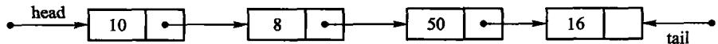
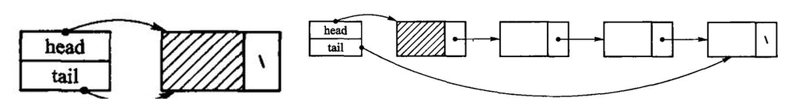
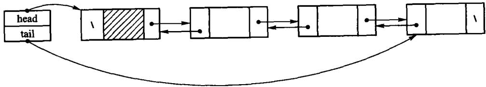
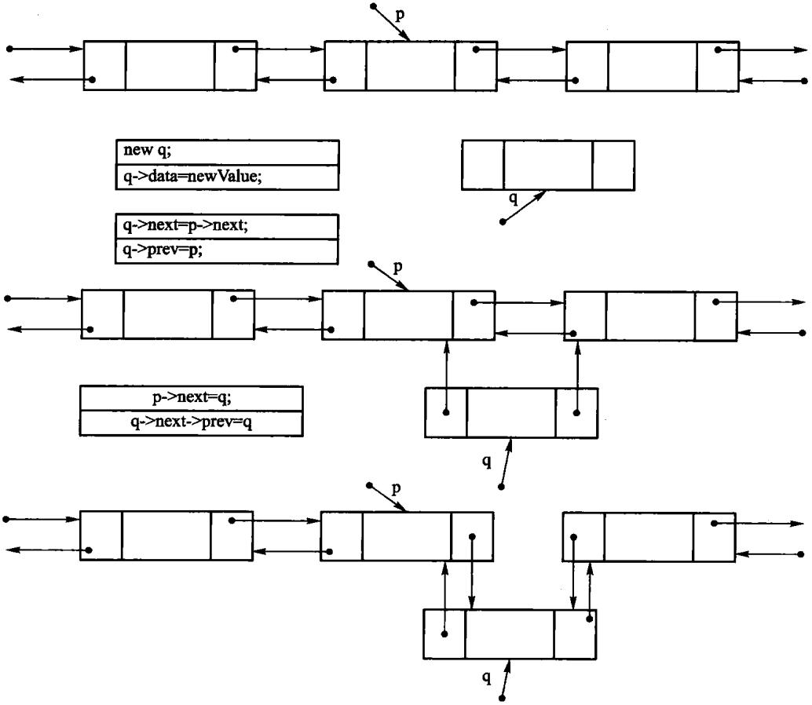
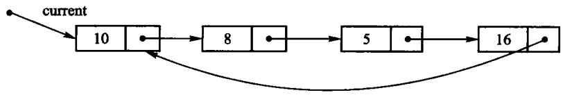
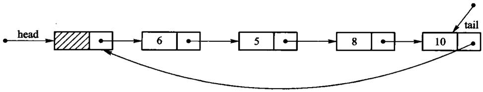
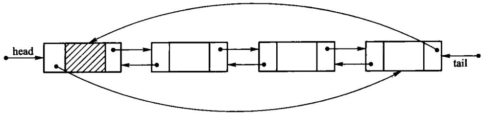

# 第2章 线性表

线性表把一串同类型元素排成唯一的先后次序。顺序表把元素连续放在数组里，能 O(1) 按下标访问；
链表用链接保存相邻关系，能在已知结点位置 O(1) 插入或删除。关键是区分「按位置找元素」和
「已知结点后改链接」这两类操作。

源码：[顺序表·教学版](../code/ch02/array_list/teaching.hpp)、
[顺序表·工程版](../code/ch02/array_list/modern.hpp)、
[顺序表示例](../code/ch02/array_list/demo.cpp)、
[链表·教学版](../code/ch02/linked_list/teaching.hpp)、
[链表·工程版](../code/ch02/linked_list/modern.hpp)、
[链表示例](../code/ch02/linked_list/demo.cpp)、
[双链表·教学版](../code/ch02/doubly_linked_list/teaching.hpp)、
[双链表·工程版](../code/ch02/doubly_linked_list/modern.hpp)。

## 先跑一遍

```cpp file=code/ch02/array_list/demo.cpp
// 第 2 章「先跑一遍」：用教学版 ArrayList 走一遍 append / insert / find / remove。
// 编译运行：
//   g++ -std=c++17 -I code/ch02/array_list code/ch02/array_list/demo.cpp -o demo && ./demo
#include "teaching.hpp"

#include <iostream>

int main() {
    ArrayList<int> values;
    values.append(10);
    values.append(30);
    values.insert(1, 20);

    std::cout << "顺序表:";
    for (int value : values) {   // 有 begin()/end()，range-for 直接可用
        std::cout << ' ' << value;
    }

    // find 返回 optional：有值才解引用
    if (auto pos = values.find(20)) {
        std::cout << "\n查找 20 的下标: " << *pos << '\n';
    }

    std::cout << "删除位置 1 得到 " << values.remove(1) << "，剩余:";
    for (int value : values) {
        std::cout << ' ' << value;
    }
    std::cout << '\n';
}
```

```bash
c++ -std=c++17 -Wall -Wextra -Werror -Icode/ch02/array_list \
    code/ch02/array_list/demo.cpp -o /tmp/list-demo
/tmp/list-demo
```

```console
顺序表: 10 20 30
查找 20 的下标: 1
删除位置 1 得到 20，剩余: 10 30
```

`insert(1, 20)` 要把后面的元素右移一位，这是顺序表的固有代价。链表同一组操作只改两条链接，但按位置找前驱仍是 O(n)：

```cpp file=code/ch02/linked_list/demo.cpp
// 第 2 章「先跑一遍」：用教学版 LinkedList 走一遍 append / insert / remove。
// 编译运行：
//   g++ -std=c++17 -I code/ch02/linked_list code/ch02/linked_list/demo.cpp -o demo && ./demo
#include "teaching.hpp"

#include <iostream>

int main() {
    LinkedList<int> values;
    values.append(10);
    values.append(30);
    values.insert(1, 20);

    std::cout << "链表:";
    for (int value : values) {
        std::cout << ' ' << value;
    }
    std::cout << "\n删除位置 0 得到 " << values.remove(0) << "，剩余:";
    for (int value : values) {
        std::cout << ' ' << value;
    }
    std::cout << "\nappend 之后尾元素是 " << values.at(values.size() - 1) << '\n';
}
```

```bash
c++ -std=c++17 -Wall -Wextra -Werror -Icode/ch02/linked_list \
    code/ch02/linked_list/demo.cpp -o /tmp/link-demo
/tmp/link-demo
```

```console
链表: 10 20 30
删除位置 0 得到 10，剩余: 20 30
append 之后尾元素是 30
```

`append` 经尾指针 O(1) 接链，不必再从头走到尾。

> **本文件的地位**：《数据结构与算法》（张铭、王腾蛟、赵海燕，高等教育出版社 2008）
> 第 2.1–2.2 节的现代化重排。原书正文（`dsa_raw.md:1145` 起）的讲法、编号、图表一概保留；
> 换掉的只是那套 2008 年的 C++ 写法。2.3 节链表另开一轮。
>
> 书里印的每一段 C++ 都来自 `code/ch02/array_list/`，真正编译、真正跑过
> （`tools/check_doc.py` 的 R3 逐字核对）。原书那份写法错在哪、改了什么、
> 什么刻意没改，逐条记在 `code/ch02/array_list/legacy.md`。
>
> 代码风格遵循 `collab/DECISION_LOG.md` 的 D-001 与 D-005。

## 2.1 线性表的概念

线性表(linear list)是由 n(n ≥ 0) 个类型相同的数据元素组成的有限序列。
除第一个元素外，每个元素有且仅有一个直接前驱；除最后一个元素外，
每个元素有且仅有一个直接后继。

线性表的抽象数据类型给出的是**一组运算**：置空、判空、在表尾追加、
在指定位置插入、删除指定位置的元素、按位置取值与改值、按值查找位置。

原书【代码2.1】用一个类模板 `List<T>` 来写这组运算。那份清单有两处今天必须改：

1. 它声明了 `bool delete(const int p);`——**`delete` 是 C++ 关键字**，不能作函数名。
   整章的删除操作都建立在这个编译不过的名字上。
2. 它写的是 `class List { void clear(); ... };`，**通篇没有 `public:`**。
   `class` 的默认访问权限是 private，于是这个抽象数据类型的每一个运算都调不到。
   （同一本书第 3 章的代码3.1 是写了 `public:` 的。）

第 2 点尤其值得停一下：抽象数据类型的意义就是**对外**给出一组运算。
一个所有运算都私有的 ADT，在语法上成立、在语义上是空的。

本书把这组运算直接定义在 `ArrayList<T>` 上，不再另设一个基类——
理由与第 3 章相同：那样的空基类给不了多态，却会带来非虚析构的未定义行为。
要定下来的是**这张表**：

| 运算 | 含义 | 时间代价 |
| --- | --- | --- |
| `at(i)` / `set(i, x)` | 按下标取值、改值 | O(1) |
| `find(x)` | 按内容查位置；找不到返回「没有」 | O(n) |
| `insert(i, x)` | 在位置 i 插入 | O(n) |
| `append(x)` | 在表尾追加 | 摊还 O(1) |
| `remove(i)` | 删除位置 i 上的元素并把它带回来 | O(n) |
| `size()` / `empty()` / `clear()` | 长度、判空、置空 | O(1) |

## 2.2 顺序表

### 为什么这一节没有 Python 版

这里故意只给 C++。顺序表的重点不是“把几个值放进一个序列”，而是容量、对象生命周期和扩容失败时旧数组是否仍然有效。若直接写成 Python `list`，扩容、元素搬迁和析构都由解释器隐藏；读者得到的是一个可用的容器，却看不到三法则、移动语义和强异常保证为何存在。算法侧可以把同一思想用 Python 重讲，存储侧若也用 `list`，反而会把本节要教的课删掉。

按顺序方式存储的线性表称为顺序表(array-based list)，又称向量(vector)，通过数组建立。

假设每个元素占用 L 个存储单元，顺序表的开始结点 k₀ 的存储位置记为
b = loc(k₀)，称为首地址；则下标为 i 的元素 kᵢ 的存储位置为

$$\mathrm{loc}(k_i) = b + i \times L$$

每个元素的存储位置都与起始位置相差一个与位序成正比的常数。只要确定了基地址，
表中任一元素的地址都能直接算出——**顺序表因此是一种随机存取的存储结构**，
按下标取值的时间代价为 O(1)。物理相邻表示了逻辑相邻。

**(a) 线性表的逻辑结构**

| 数据元素 | k₀ | k₁ | … | kᵢ | … | kₙ₋₁ | … | |
| --- | --- | --- | --- | --- | --- | --- | --- | --- |
| 逻辑地址 | 0 | 1 | … | i | … | n−1 | … | maxSize−1 |

**(b) 线性表的顺序存储结构**

| 数据元素 | k₀ | k₁ | … | kᵢ | … | kₙ₋₁ | … |
| --- | --- | --- | --- | --- | --- | --- | --- |
| 存储地址 | b | b+L | … | b+i·L | … | b+(n−1)·L | … |

图 2.1 顺序表的示意图

### 教学版：完整实现

下面是一份**完整的、能直接编译运行的**顺序表。一个文件、一个类，没有省略号。
它保留原书【代码2.2】【算法2.3】【算法2.4】【算法2.5】要教的全部内容——
连续存储、按下标 O(1) 随机存取、插入/删除要搬 O(n) 个元素——只把原书那几处
编译不过或会崩的写法换掉。后面 2.2.1、2.2.2 两节就是把它拆开逐段讲——检索、插入、删除都在 2.2.2 里。

```cpp file=code/ch02/array_list/teaching.hpp
// 顺序表 ArrayList —— 教学版。
//
// 一个文件、一个类、能直接编译运行，给「第一次读这一节」的人看。
// 它保留原书【代码2.1】【代码2.2】【算法2.3】【算法2.4】【算法2.5】要教的全部内容——
// 连续存储、按下标 O(1) 随机存取、插入/删除要搬 O(n) 个元素——
// 只把原书那几处编译不过或会崩的写法换掉。
//
// 与 modern.hpp（工程版）的分工：
//   教学版  遵守**三法则**（析构 + 拷贝构造 + 拷贝赋值），正确，但拷贝多一点；
//   工程版  在此之上补齐移动语义、强异常保证、编译期类型约束。
// 两份都在闸门里真编译真运行。先读这一份，2.2a「进阶（选读）」再读那一份。
#pragma once

#include <cstddef>
#include <optional>
#include <stdexcept>

template <typename T>
class ArrayList {
public:
    using value_type = T;
    using size_type = std::size_t;

    explicit ArrayList(size_type initial_capacity = 8)
        : data_(new T[initial_capacity]), capacity_(initial_capacity), size_(0) {}

    ~ArrayList() { delete[] data_; }

    // 三法则：自己管着 new 出来的数组，就得自己写拷贝构造和拷贝赋值。
    // 不写的话编译器会照抄指针，两个表指向同一块内存，各析构一次 → 二次释放。
    ArrayList(const ArrayList& other)
        : data_(new T[other.capacity_]), capacity_(other.capacity_), size_(other.size_) {
        for (size_type i = 0; i < size_; ++i) {
            data_[i] = other.data_[i];
        }
    }

    ArrayList& operator=(const ArrayList& other) {
        if (this == &other) {
            return *this;
        }
        T* fresh = new T[other.capacity_];
        for (size_type i = 0; i < other.size_; ++i) {
            fresh[i] = other.data_[i];
        }
        delete[] data_;
        data_ = fresh;
        capacity_ = other.capacity_;
        size_ = other.size_;
        return *this;
    }

    bool empty() const { return size_ == 0; }
    size_type size() const { return size_; }
    size_type capacity() const { return capacity_; }

    // 清空只把长度归零，已经申请的数组留着复用。
    void clear() { size_ = 0; }

    // 按下标读取，O(1)——这是顺序表相对链表的看家本领。
    // 下标非法是**调用方的错误**，不是可预期状态，所以抛异常而不是返回 optional。
    const T& at(size_type index) const {
        if (index >= size_) {
            throw std::out_of_range("ArrayList::at: 下标越界");
        }
        return data_[index];
    }

    T& at(size_type index) {
        if (index >= size_) {
            throw std::out_of_range("ArrayList::at: 下标越界");
        }
        return data_[index];
    }

    void set(size_type index, const T& value) {
        if (index >= size_) {
            throw std::out_of_range("ArrayList::set: 下标越界");
        }
        data_[index] = value;
    }

    // 按内容查找，O(n)。找到返回下标，没找到返回空 optional。
    // 原书【算法2.3】用 `bool getPos(int& p, const T value)`：忘了看返回值，
    // 就会读到一个从没被写过的 p。这里「找没找到」是返回值类型的一部分。
    std::optional<size_type> find(const T& value) const {
        for (size_type i = 0; i < size_; ++i) {
            if (data_[i] == value) {
                return i;
            }
        }
        return std::nullopt;
    }

    // 在位置 pos 插入，pos 可以等于 size()（追加到表尾）。
    // 代价 O(n)：pos 之后的元素都要右移一位。这正是顺序表与链表要对比的地方。
    void insert(size_type pos, const T& value) {
        if (pos > size_) {
            throw std::out_of_range("ArrayList::insert: 插入位置非法");
        }
        if (size_ == capacity_) {
            grow();
        }
        for (size_type i = size_; i > pos; --i) {
            data_[i] = data_[i - 1];   // 从后往前搬，否则会自己覆盖自己
        }
        data_[pos] = value;
        ++size_;
    }

    void append(const T& value) { insert(size_, value); }

    // 删除 pos 上的元素并返回它。代价同样是 O(n)：后面的元素都要左移一位。
    T remove(size_type pos) {
        if (pos >= size_) {
            throw std::out_of_range("ArrayList::remove: 下标越界");
        }
        T removed = data_[pos];
        for (size_type i = pos; i + 1 < size_; ++i) {
            data_[i] = data_[i + 1];
        }
        --size_;
        return removed;
    }

    // 有了 begin/end，range-for 就能用了：for (auto& x : list) { ... }
    //
    // 原书是在类里放一个 `int position` 游标，配 setPos/next/prev 来依次处理元素。
    // 那种设计把「遍历到哪了」这个状态塞进了容器：const 对象没法遍历，
    // 两处代码不能同时遍历，嵌套遍历直接互相踩。游标挪到容器外面，这些问题一起消失。
    T* begin() { return data_; }
    T* end() { return data_ + size_; }
    const T* begin() const { return data_; }
    const T* end() const { return data_ + size_; }

private:
    // 扩容：申请两倍大的新数组，搬过去，再释放旧的。
    // 翻倍而不是加一，才能让 append 的摊还代价保持 O(1)。
    void grow() {
        size_type next = (capacity_ == 0) ? 1 : capacity_ * 2;
        T* fresh = new T[next];
        for (size_type i = 0; i < size_; ++i) {
            fresh[i] = data_[i];
        }
        delete[] data_;       // 先搬完再释放旧的，顺序反了就会读到已释放的内存
        data_ = fresh;
        capacity_ = next;
    }

    T* data_;             // 指向底层数组
    size_type capacity_;  // 数组能放多少个
    size_type size_;      // 现在放了几个
};
```

编译运行：

```bash
g++ -std=c++17 -Wall -Wextra demo.cpp -o demo && ./demo
```

### 2.2.1 顺序表的类定义

原书【代码2.2】用四个成员表示顺序表：`T* aList`、`int maxSize`、`int curLen`、
`int position`。前三个对应缓冲区、容量、当前长度，教学版一一对应
（改用 `std::size_t`，因为「负下标」不该在类型层面存在）。

第四个 `position` 是个**当前处理位置游标**，配合正文提到的
`setPos / setStart / next / prev` 用来「依次处理元素」。这个设计今天不能要：
遍历状态一旦住进容器，`const` 对象就没法遍历（游标要改），两处代码不能同时遍历，
嵌套遍历直接互相踩。本书删掉这个成员，改为提供 `begin()/end()`，
把遍历状态交回调用方——range-for 因此可以直接用在顺序表上。
（顺带一提：原书那个 `position`，在书中展示的所有算法里一次都没被用到。）

缓冲区是**裸指针**。于是这个类自己管着资源，就必须遵守**三法则**：
一个类只要写了**析构函数、拷贝构造、拷贝赋值**中的任意一个，通常这三个都得写。
理由很直白——你之所以要写析构函数，是因为你在管资源；既然在管资源，
编译器那份「逐成员照抄」的拷贝就一定是错的：照抄一个指针成员的结果是
**两个对象指向同一块内存**，各自析构时各释放一次，同一块内存被释放两次。

原书 `arrList` 正是如此：有析构函数，却没有拷贝构造与拷贝赋值。一句普通的
`arrList<int> b = a;` 就会二次释放——与第 3 章 `arrStack` 是同一个错误，同一份 ASan 报告可以复现。

这里用裸指针而不是 `std::unique_ptr<T[]>`，是因为顺序表的存储管理正是本节的教学内容：
用智能指针时这几个函数编译器生成的就够用，学生看不到它们为什么必须存在。判据见 2.3.1 节的「所有权工具怎么选」。

另外原书的 `clear()` 是这样写的：

```text original-listing="原书 clear 清单缺少三法则与异常安全，作为缺陷原样引用"
void clear() { delete [] aList; curLen = position = 0; aList = new T[maxSize]; }
```

释放整块再重新分配。既没必要（把长度归零即可，容量留着复用），也不是异常安全的：
若 `new` 抛异常，对象就停在「指针已释放、长度已归零」的破碎状态，
之后析构还会再 `delete[]` 一次。教学版的 `clear()` 只把长度归零，一行。

### 2.2.2 顺序表的运算实现

#### 顺序表的检索

顺序表上的检索分按位置和按内容两类。按位置的检索直接由地址公式算出，O(1)——
就是上面 `at()` 和 `set()` 那几行：先查下标合不合法，然后直接 `data_[index]`，
没有循环。原书的 `getValue` 用「出参 + bool」，越界时打印一行再返回 false；
教学版把越界当**错误**处理，抛 `std::out_of_range`。

按内容的检索是把待查值与表中元素依次比较，O(n)。这里要专门讲一下**「没找到」怎么告诉调用方**——
这是全书反复出现的一个问题，第一次遇到值得说透。

原书【算法2.3】的签名是：

```text
bool getPos(int& p, const T value);
```

一次调用要带回两件事：**找没找到**（函数的返回值 `bool`），和**在第几个位置**
（引用参数 `p`，函数在里面写结果，这种参数习惯上叫「出参」）。找到了就把下标写进 `p`
并返回 `true`，没找到就返回 `false`、`p` 不动。

用起来是这样：

```text
int p;                       // 此刻 p 是未初始化的，里面是内存里的残留值
if (list.getPos(p, 20)) {    // ← 这一行的判断是必须的
    use(p);
}
```

问题就在那句注释上：**这个判断没有任何东西强制你写**。漏掉它，代码照样编译、照样运行：

```text
int p;
list.getPos(p, 20);          // 忘了看返回值
use(p);                      // ← 用的是一个从没被写过的 p
```

`p` 里是什么？没找到时 `getPos` 根本没碰它，所以它还是那块内存原来的残留值——可能是 0，
可能是上一次调用留下的旧下标，也可能是任意数字。程序不会崩，只会**默默地按错误的下标继续跑**。
这类 bug 极难查，因为出错的地方和崩溃的地方往往隔着很远。

现代写法把这两件事合成**一个**返回值——就是上面 `find()` 的
`std::optional<size_type>`：循环体一模一样，差别只在「没找到」怎么表达。

`std::optional<size_type>` 可以理解成一个「可能装着下标的盒子」：找到了，盒子里是下标；
没找到，盒子是空的（`std::nullopt`）。关键在于**取值必须先开盒**，而开盒这一步绕不过去：

```text
if (auto pos = list.find(20)) {   // 先问盒子空不空
    use(*pos);                     // 确认非空后才取值
}
```

对空盒子直接 `*` 取值是未定义行为，用 `.value()` 取则会抛 `std::bad_optional_access`。
两条路都不会像 `int p` 那样**悄悄给你一个看似正常的垃圾值**。

工程版还在 `find()` 上加了一个 `[[nodiscard]]` 属性，再补一道：
连返回值都丢掉不用，编译器直接报错。

```text
$ g++ -std=c++17 -Wall -Wextra -Wpedantic -Werror …
error: ignoring return value of ‘std::optional<...> dsa::ArrayList<T>::find(const T&) const’,
       declared with attribute ‘nodiscard’ [-Werror=unused-result]
```

教学版没有写这个属性——它是纯粹的工程加固，与顺序表这一节要讲的东西无关。

一句话概括这个改动：**原来靠调用方自觉，现在靠类型系统和编译器**。「找没找到」这件事
从「一个你可以忽略的 `bool`」变成了「不处理就取不出数据的盒子」。全书凡是「可能没有结果」
的接口——查找、出栈、取队首——都按这条办。

（顺带一提，算法2.3 那段按印刷原样是编译不过的：循环写的是 `for (i = 0; i < n; i++)`，
而 `n` 从未声明，按上下文应为 `curLen`。）

检索的时间代价体现在比较次数上。最好情况是第 1 个元素即为所求，比较 1 次；
最差情况是表中没有该元素，比较 n 次。等概率假设下平均比较次数为

$$\sum_{i=1}^{n} p \times i = \frac{1}{n}(1 + 2 + \cdots + n) = \frac{n+1}{2}$$

即平均需要检查表中一半的元素，时间开销为 O(n)。

#### 顺序表的插入

插入要在指定位置腾出一个空位：从表尾起，把 pos 之后的元素逐个右移一位。
教学版 `insert()` 里那个**倒着走**的循环就是在做这件事：

```text
for (size_type i = size_; i > pos; --i) {
    data_[i] = data_[i - 1];
}
```

方向不能反。若改成从 pos 起递增地 `data_[i + 1] = data_[i]`，
第一次搬完就把 `data_[pos + 1]` 覆盖掉了，后面搬的全是同一个值。

两处与原书不同：

- **容量不足时自动翻倍**，而不是打印 `"The list is overflow"` 然后返回 false。
  扩容策略与第 3 章算法3.3 相同。
- **位置非法抛 `std::out_of_range`**，而不是打印一行再返回 false。
  按公约，可预期的空状态用 `optional`，真正的错误抛异常——插到表外是错误。

插入位置 p 处腾空位的过程如下（图 2.2）：p 及其之后的元素整体右移一位，
空出的 p 位置写入新元素。

| aList | k₀ | k₁ | … | **value** | kₚ | … | kₙ₋₁ | … | |
| --- | --- | --- | --- | --- | --- | --- | --- | --- | --- |
| 下标 | 0 | 1 | … | p | p+1 | … | n | … | maxSize−1 |

图 2.2 顺序表元素插入示意图

时间代价仍然是 O(n)。最好情况是插在表尾，移动 0 次；最差情况是插在表头，
n 个元素全要移动；等概率假设下平均移动次数为

$$\sum_{i=0}^{n} p \times (n - i) = \frac{1}{n+1}\sum_{i=0}^{n}(n-i) = \frac{n}{2}$$

**扩容没有改变这个结论**：翻倍带来的搬迁**摊还**到每次插入是 O(1)，
而元素右移本身仍是 O(n)。

「摊还」是指：单次操作偶尔很贵，但把总代价分摊到所有操作上之后，每次仍然很便宜。
这里绝大多数插入不触发扩容，偶尔一次翻倍要搬走全部 n 个元素；但两次扩容之间至少发生了
n 次插入，把这一次搬迁分摊下去，每次插入平摊仍是 O(1)。注意它说的是**平均**而不是保证——
那一次搬迁真的会卡住，对延迟敏感的场合要单独考虑。

这一点是 2.3 节拿顺序表与链表对比的依据，不能被优化掉。

#### 顺序表的删除

删除是插入的镜像：把 pos 之后的元素逐个左移一位，这次循环**正着走**。
教学版的 `remove()` 还多做一件事——先把被删的元素存下来，最后返回给调用方。

空表上删除必然越界，所以不需要原书那句单独的空表检查：
「表空」在这里不是一种可预期状态，而就是下标非法的一个特例。

删除位置 p 上的元素后，其后的元素整体左移一位（图 2.3）：

删除前：

| aList | k₀ | k₁ | k₂ | … | **kₚ** | … | kₙ₋₁ | … |
| --- | --- | --- | --- | --- | --- | --- | --- | --- |
| 下标 | 0 | 1 | 2 | … | p | … | n−1 | … |

删除后：

| aList | k₀ | k₁ | k₂ | … | kₚ₊₁ | … | kₙ₋₁ | … |
| --- | --- | --- | --- | --- | --- | --- | --- | --- |
| 下标 | 0 | 1 | 2 | … | p | … | n−2 | … |

图 2.3 顺序表元素删除示意图

原书【算法2.5】的函数名是 `delete`——C++ 关键字，编译不过；本书叫 `remove`。
另外它返回 `bool`，被删掉的值就此丢失；这里把它返回给调用方，
「删除并取用」不必先 `getValue` 再 `delete` 两步走。

删除的时间代价分析与插入相同，平均为 O(n)。

### 2.2a 进阶（选读）：从教学版到工程版

**这一节可以整节跳过。** 上面那份教学版在**分配和 `T` 的拷贝都不抛异常**时是正确的
（元素是 `int`、`std::string` 这类东西时就是如此），跑得起来，日常用例下 ASan 也干净。
这一节讲的是把它变成一个**工业级容器**还要补哪些东西。
等你哪天要写自己的容器时再回来读。工程版在
`code/ch02/array_list/modern.hpp`，与教学版一样进闸门、一样双档编译运行。

#### 一、三法则补成五法则：移动语义

教学版把一个临时表赋给别人时，会老老实实深拷贝一遍——而那个临时对象下一行就要销毁，
这次拷贝纯属浪费。工程版补上**移动构造**与**移动赋值**：直接把指针「偷」过来，
再把对方置空，O(1) 完事。

```cpp file=code/ch02/array_list/modern.hpp#insert
/// 在位置 pos 插入元素，pos 可以等于 size()（即追加到表尾）。
/// 位置非法抛 std::out_of_range；容量不足自动翻倍。
///
/// 时间代价仍是 O(n)——pos 之后的元素都要右移一位。这是顺序表的固有代价，
/// 也是第 2.3 节要拿它和链表对比的地方，没有被"优化"掉。
void insert(size_type pos, const T& value) {
    make_gap(pos);
    data_[pos] = value;
    ++size_;
}

void insert(size_type pos, T&& value) {
    make_gap(pos);
    data_[pos] = std::move(value);
    ++size_;
}

void append(const T& value) { insert(size_, value); }
void append(T&& value) { insert(size_, std::move(value)); }
```

`insert` 因此有了两个重载：左值走拷贝，右值走 `std::move`。
`append(std::string("很长的字符串"))` 于是不再复制那串字符，只搬指针。

#### 二、扩容中途抛异常：强异常保证

教学版的 `grow()` 是「申请 → 搬 → 释放旧的」三步。它对 `int`、`std::string`
这类元素完全够用，但如果某个元素的拷贝**中途抛了异常**，新申请的 `fresh` 就漏掉了。
工程版把这一段包进 `try/catch`，并保证失败时原表**原封不动**——这叫**强异常保证**：
一个操作要么完全成功，要么像没发生过一样。

```cpp file=code/ch02/array_list/modern.hpp#grow
void ensure_capacity() {
    if (size_ < capacity_) {
        return;
    }
    constexpr size_type kMax = std::numeric_limits<size_type>::max();
    if (capacity_ > kMax / 2) {
        throw std::overflow_error("ArrayList: 容量翻倍会溢出");
    }
    const size_type next = capacity_ == 0 ? kInitialCapacity : capacity_ * 2;
    T* fresh = new T[next];
    try {
        for (size_type i = 0; i < size_; ++i) {
            // 判据同第 3 章（DECISION_LOG D-005）：看的是**移动赋值**抛不抛，
            // 不是 std::move_if_noexcept 检查的移动构造。两者可以不同，
            // 用错会让搬到一半的失败把原表掏空。
            if constexpr (std::is_nothrow_move_assignable<T>::value) {
                fresh[i] = std::move(data_[i]);
            } else {
                fresh[i] = data_[i];
            }
        }
    } catch (...) {
        delete[] fresh;
        throw;
    }
    delete[] data_;
    data_ = fresh;
    capacity_ = next;
}
```

搬迁到底用移动还是拷贝，判据必须落在**实际执行的那个操作**（移动赋值）上，
而不是惯用的 `std::move_if_noexcept`（它看的是移动**构造**）。
这个坑第 3 章 3.1.2a 有完整的复现与解释，此处不重复。

#### 三、编译期的类型约束

工程版类头上有四条 `static_assert`，在编译期检查放进来的 `T` 合不合格：
必须能默认构造（`new T[n]` 会构造整块槽位）、必须能移动赋值、
不可拷贝的 `T` 必须能无异常移动赋值、不能是引用类型。

写在类里而不是文档里，是因为**编译期报错永远比运行期谜案便宜**。
教学版没有它们：`T` 不合格时报错发生在模板实例化的深处，信息难看，但同样报错。
这是可读性与报错质量之间的一次交换，教学版选了前者。

#### 四、其它工程细节

| 工程版 | 教学版 | 差在哪 |
| --- | --- | --- |
| `check_index()` / `make_gap()` 抽成私有辅助函数 | 检查写在每个函数里 | 少一层跳转，读者不必来回翻 |
| 查询函数标 `[[nodiscard]]` 与 `noexcept` | 都不标 | 前者拦住「忘了看返回值」，后者让标准库能查询这个承诺 |
| 放在 `namespace dsa` 里 | 无命名空间 | 真实项目要防名字冲突 |
| 自由函数 `swap(a, b)` | 无 | ADL 找得到，标准库算法会用 |

## 与原书的对照

| 原书 | 现在 | 为什么 |
| --- | --- | --- |
| `bool delete(const int p)` | `T remove(size_type pos)` | `delete` 是关键字，原样编译不过；顺带把被删元素还给调用方 |
| `class List { ... }` 无 `public:` | 不设基类，要求写成 `static_assert` | 所有运算私有的 ADT 在语义上是空的；空基类给不了多态 |
| `for (i = 0; i < n; i++)` | `i < size_` | 原书 `n` 从未声明，编译不过 |
| `bool getPos(int& p, T v)` | `std::optional<size_type> find(const T&)` | 「找没找到」交给类型系统，忽略返回值会告警 |
| `bool getValue(int p, T& v)` | `const T& at(size_type)`，越界抛异常 | 同上；越界是错误，不是可预期状态 |
| `int maxSize / curLen`，满了拒绝 | `size_t capacity_ / size_`，自动翻倍 | `int` 溢出是未定义行为；「负下标」不该存在；容量不该是使用者的负担 |
| `int position` 游标 + `next/prev` | `begin()/end()` | 遍历状态住在容器里，const 不能遍历、不能嵌套遍历 |
| `cout << "The list is overflow"` | 不做任何 I/O | 数据结构不该和标准输出耦合 |
| `clear()` 释放后重新分配 | `clear() noexcept` 只归零长度 | 原写法没必要，且 `new` 抛异常会留下破碎对象 |

**刻意没改的**：连续存储、按下标 O(1) 随机存取、插入与删除搬动 O(n) 个元素。
这三条正是 2.3 节拿顺序表和链表做对比的全部依据，一条都不能优化掉。

完整实现见 `code/ch02/array_list/modern.hpp`，测试见同目录 `test.cpp`
（47 项断言，覆盖上表每一行；用 `python3 tools/check_code.py` 在
`-Werror` + ASan/UBSan 与 `-O2` 两种构建下各跑一遍）。

## 2.3 链表

### 为什么这一节没有 Python 版

链表这一节要看的是结点所有权：谁负责 `new` 出来的结点、拷贝时是否深复制、异常和析构时怎样沿链释放。Python 的 `list` 既不是这条链，也不要求读者实现拷贝构造、拷贝赋值、移动构造和析构；即便手写 Python 结点，垃圾回收仍会把所有权边界变得不可观察。因此这里保留 C++ 的裸指针与五法则，Python 版只会成为另一种容器写法。

顺序表用物理相邻表示逻辑相邻，所以按下标读取是 O(1)，但中间插入和删除需要搬动
后续元素。链表把逻辑相邻写进结点的链接域：结点可以散落在内存中；给定一个前驱结点后，
插入或删除只改常数条指针。代价也必须如实保留：要按位置找到那个前驱，仍须从表头循链，
所以按位置访问、查找、插入和删除的总时间仍是 O(n)。

每个结点只存一根指向后继的指针时，叫单链表(singly linked list)。


图 2.4　单链表示例。结点分成两部分：`data` 域存真正的数据（图中的 10、8、50、16），`next` 域存后继结点的地址。终止结点没有后继，`next` 是空指针，图里用「\」表示。结点在内存中不必两两相邻——这正是链表能以常数条指针完成插入删除的原因。

访问只能从表头开始顺着 `next` 走：图 2.4 里 `head->next->data` 是 8，`head->next->next->data` 是 50。表越长，这条链越长。为了让「在表尾追加」不必每次走到底，另设一个指向尾结点的变量 `tail`：



图 2.5　具有头、尾两指针的单链表。有了 `tail`，`append()` 是 O(1)。

### 教学版：完整实现

下面是一份**完整的、能直接编译运行的**单链表。一个文件、一个类。
后面 2.3.1、2.3.2 两节就是把它拆开逐段讲。

```cpp file=code/ch02/linked_list/teaching.hpp
// 单链表 LinkedList —— 教学版。原书【代码2.6】【代码2.7】【算法2.8】–【算法2.11】。
//
// 一个文件、一个类、能直接编译运行，给「第一次读这一节」的人看。
// 保留链表要教的全部内容：结点分散存储、带头结点、尾指针让 append 保持 O(1)、
// 按位置查找必须循链 O(n)、插入删除在定位之后只改常数条链接。
//
// 与 modern.hpp（工程版）的分工：
//   教学版  三法则（析构 + 拷贝构造 + 拷贝赋值），头结点里放一个不用的 T；
//   工程版  补齐移动语义，并把头结点做成不含 T 的哨兵基类，
//           这样 T 就不必可默认构造——代价是多一层继承和一堆 static_cast。
// 两份都在闸门里真编译真运行。先读这一份，2.3a「进阶（选读）」再读那一份。
#pragma once

#include <cstddef>
#include <optional>
#include <stdexcept>

template <typename T>
class LinkedList {
private:
    // 结点(node)：一个数据域，加一根指向后继的链接。原书【代码2.6】。
    // 它是实现细节，所以放在 private 里——调用方拿不到指针，就改不坏链。
    struct Node {
        T value;
        Node* next;
    };

public:
    using value_type = T;
    using size_type = std::size_t;

    // 头结点(head node)是一个**不存放数据**的哨兵结点，永远排在第一个真元素前面。
    // 它的作用是消掉「在表头插入 / 删除表头」这个特例：有了它，任何位置的插入
    // 都变成「找到前驱，改它的 next」，一套代码走遍全表。
    LinkedList() : head_(new Node), tail_(head_), size_(0) {
        head_->next = nullptr;
    }

    ~LinkedList() {
        clear();
        delete head_;      // 头结点是构造时 new 的，最后要还回去
    }

    // 三法则：这个类管着一串 new 出来的结点，拷贝必须自己写。
    LinkedList(const LinkedList& other) : head_(new Node), tail_(head_), size_(0) {
        head_->next = nullptr;
        for (Node* source = other.head_->next; source != nullptr; source = source->next) {
            append(source->value);
        }
    }

    LinkedList& operator=(const LinkedList& other) {
        if (this == &other) {
            return *this;
        }
        clear();
        for (Node* source = other.head_->next; source != nullptr; source = source->next) {
            append(source->value);
        }
        return *this;
    }

    bool empty() const { return size_ == 0; }
    size_type size() const { return size_; }

    // 删掉全部真元素，头结点留着。
    void clear() {
        Node* current = head_->next;
        while (current != nullptr) {
            Node* dying = current;
            current = current->next;
            delete dying;
        }
        head_->next = nullptr;
        tail_ = head_;         // 表空了，尾指针退回头结点
        size_ = 0;
    }

    // 在表尾追加。**因为存了 tail_，这里是 O(1)**；没有它就得每次从头走到尾。
    void append(const T& value) {
        Node* fresh = new Node;
        fresh->value = value;
        fresh->next = nullptr;
        tail_->next = fresh;
        tail_ = fresh;
        ++size_;
    }

    // 在位置 pos 插入，pos 可以等于 size()（追加到表尾）。
    // 两步：① 循链找到 pos 的**前驱**，O(n)；② 改两条链接，O(1)。
    // 这就是链表与顺序表的分工——链表的插入不搬元素，但定位要走。
    void insert(size_type pos, const T& value) {
        Node* predecessor = predecessor_at(pos);
        Node* fresh = new Node;
        fresh->value = value;
        fresh->next = predecessor->next;
        predecessor->next = fresh;
        if (predecessor == tail_) {   // 插在表尾，尾指针要跟上
            tail_ = fresh;
        }
        ++size_;
    }

    // 删除位置 pos 上的元素并返回它。同样是「先定位前驱，再改一条链接」。
    T remove(size_type pos) {
        if (pos >= size_) {
            throw std::out_of_range("LinkedList::remove: 下标越界");
        }
        Node* predecessor = predecessor_at(pos);
        Node* dying = predecessor->next;
        T value = dying->value;
        predecessor->next = dying->next;
        if (dying == tail_) {         // 删的是最后一个，尾指针退回前驱
            tail_ = predecessor;
        }
        delete dying;
        --size_;
        return value;
    }

    // 按位置取值：链表**不是**随机存取的，只能从头一个一个数过去，O(n)。
    // 这一条是 2.4 节拿链表和顺序表对比的关键。
    const T& at(size_type pos) const { return node_at(pos)->value; }
    T& at(size_type pos) { return node_at(pos)->value; }

    // 按内容查找，O(n)。找到返回位置，没找到返回空 optional。
    std::optional<size_type> find(const T& value) const {
        size_type pos = 0;
        for (Node* current = head_->next; current != nullptr; current = current->next) {
            if (current->value == value) {
                return pos;
            }
            ++pos;
        }
        return std::nullopt;
    }

    // 链表没有连续下标，range-for 要靠迭代器。这个迭代器就是一根被包起来的
    // 结点指针：`*it` 取值，`++it` 顺着 next 走一步，走到 nullptr 就是结束。
    class Iterator {
    public:
        explicit Iterator(Node* node) : node_(node) {}
        T& operator*() const { return node_->value; }
        Iterator& operator++() {
            node_ = node_->next;
            return *this;
        }
        bool operator!=(const Iterator& other) const { return node_ != other.node_; }

    private:
        Node* node_;
    };

    Iterator begin() { return Iterator(head_->next); }   // 从第一个**真**元素开始
    Iterator end() { return Iterator(nullptr); }

private:
    // 返回位置 pos 的前驱结点。pos == 0 时前驱就是头结点——
    // 这正是头结点存在的意义：表头不再是特例。
    Node* predecessor_at(size_type pos) const {
        if (pos > size_) {
            throw std::out_of_range("LinkedList: 下标越界");
        }
        Node* predecessor = head_;
        for (size_type i = 0; i < pos; ++i) {
            predecessor = predecessor->next;
        }
        return predecessor;
    }

    Node* node_at(size_type pos) const {
        if (pos >= size_) {
            throw std::out_of_range("LinkedList::at: 下标越界");
        }
        Node* current = head_->next;
        for (size_type i = 0; i < pos; ++i) {
            current = current->next;
        }
        return current;
    }

    Node* head_;          // 头结点（哨兵，不存数据）
    Node* tail_;          // 最后一个结点；表空时等于 head_
    size_type size_;
};
```

编译运行：

```bash
g++ -std=c++17 -Wall -Wextra demo.cpp -o demo && ./demo
```

### 2.3.1 单链表

#### 单链结点与头结点

【代码2.6】单链表的结点定义。

结点(node)就是上面那个 `Node`：**一个数据域，加一根指向后继的链接域**。
原书把它写成独立的 `Link<T>`；这里放在 `LinkedList` 的 private 区里，
因为调用方拿不到结点指针，就没法改坏链。

【代码2.6结束】

`LinkedList<T>` 还有一个**头结点**(head node)：一个不存放数据的哨兵，
永远排在第一个真元素前面。它等价于原书的"第 -1 个结点"。
有了它，表头插入和删除都变成"修改某个前驱的 `next`"，空表也不必另写一套分支——
这就是 `predecessor_at(0)` 能直接返回头结点的原因。



图 2.6　引入头结点的单链表：(a) 带头结点的空表，(b) 一个典型的带头结点的单链表。带阴影的那个结点就是头结点，它的数据域不算表中元素，只是为了让空表和表头不再是特例。

尾指针 `tail_` 指向最后一个实际结点，空表时回指头结点，
所以 `append` 不需要从头寻找末尾，是 O(1)。

【代码2.7】单链表的类型定义。

见上面教学版清单的类头：三个成员——头结点、尾指针、长度。

【代码2.7结束】

#### 构析与循链定位

【算法2.8】带有头结点的单链表构造函数与析构函数。

教学版的构造函数 `new` 出头结点，析构函数先 `clear()` 掉全部真元素、再把头结点还回去。
`clear()` 沿 `next` **逐个循环释放**，不是递归——链长十万级时递归释放会耗尽运行栈，
这一点第 3 章 3.1.3 有实测数字。

两处一漏就出事，教学版的测试各有一条断言盯着：

- `clear()` 之后 `tail_` 必须退回头结点。不退，下一次 `append` 就写进已释放的内存，
  AddressSanitizer 报 `heap-use-after-free`。
- 析构里那句 `delete head_` 不能漏。漏了，每个链表对象泄漏一个结点，
  LeakSanitizer 会报。

【算法2.8结束】

【算法2.9】寻找链表的第 i 个结点。

定位从头结点开始逐步走 `next`，不新建任何结点，O(n)。原书的 `setPos(-1)` 是处理
头结点的技巧；教学版不暴露 -1 这个特殊位置，`predecessor_at(0)` 直接返回头结点。

**返回"前驱"而不是"结点本身"**，是因为插入和删除都要改前驱的 `next`——
单链表从一个结点走不回它的前一个。一个函数同时服务两处，这是头结点带来的简化。

【算法2.9结束】

#### 所有权工具怎么选

读到这里会有一个很自然的疑问：既然现代 C++ 有 `std::unique_ptr`，为什么 `clear()` 还在手写 `delete`？把 `next` 声明成 `std::unique_ptr<Node>` 不是更省事吗——没有 `delete`，没有析构函数，五法则一条都不用写。

小规模下这么写确实看不出问题。代价藏在编译器替你生成的析构里：

```cpp file=code/ch02/ownership/modern.hpp#recursive-chain
/// **教学反例。** 用 `std::unique_ptr` 把结点串成链，看起来最干净：没有 `delete`，
/// 没有析构函数，五法则一条都不用写。
///
/// 代价藏在编译器替你生成的析构里：`~RecursiveNode` 要析构 `next`，`next` 的析构又要
/// 析构它的 `next`……链有多长，栈就压多深。链表通常正是「元素很多」的结构，
/// 于是一次普通的析构就能把栈压穿——而且崩溃阈值随优化级别变，debug 崩、release 过。
///
/// 实测数字与复现命令见本单元的 `legacy.md`。
struct RecursiveNode {
    int value = 0;
    std::unique_ptr<RecursiveNode> next;
};

class RecursiveChain {
public:
    void push_front(int value) {
        auto node = std::make_unique<RecursiveNode>();
        node->value = value;
        node->next = std::move(head_);
        head_ = std::move(node);
        ++size_;
    }

    [[nodiscard]] std::vector<int> to_vector() const {
        std::vector<int> out;
        for (const RecursiveNode* cursor = head_.get(); cursor != nullptr;
             cursor = cursor->next.get()) {
            out.push_back(cursor->value);
        }
        return out;
    }

    [[nodiscard]] std::size_t size() const noexcept { return size_; }

private:
    std::unique_ptr<RecursiveNode> head_;
    std::size_t size_ = 0;
    // 析构函数是编译器生成的——问题就出在这里：它是递归的，而且看不见。
};
```

`~RecursiveNode` 要析构 `next`，`next` 的析构又要析构它的 `next`——**链有多长，栈就压多深**。而链表恰恰是「元素很多」的结构。本机 8 MB 栈上实测：

| 构建档 | 最大安全结点数 | 崩溃于 |
| --- | --- | --- |
| `-O0 -g` | 约 57,625 | 58,601 |
| `-O2` | 约 523,329 | 524,306 |

两档差了九倍。这才是最难受的地方：同一份代码，debug 下五万多个结点就段错误，release 下五十多万才崩。学生在 debug 里调出段错误，切到 release 又复现不了。递归深度不该由优化级别决定。

自己管所有权，多写一个析构和一个 `clear()`，换来的是**栈深度与链长无关**：

```cpp file=code/ch02/linked_list/modern.hpp#clear
void clear() noexcept {
    NodeBase* current = head_.next;
    while (current != nullptr) {
        NodeBase* following = current->next;
        delete static_cast<Node*>(current);
        current = following;
    }
    head_.next = nullptr;
    tail_ = &head_;
    size_ = 0;
}
```

同样 `-O0`，五百万个结点一次段错误都没有。这几行不是仪式，是这个结构能不能处理大数据的分界线。

**但这不等于「本书不用智能指针」。** 判据是结构形态，不是个人偏好：

| 结构形态 | 该用什么 | 理由 |
| --- | --- | --- |
| 链（结点串成一条线） | 裸指针 + 迭代释放 | `unique_ptr` 的析构是递归的，深度正比于链长 |
| 树（孩子唯一所有权） | `unique_ptr` | 释放同样递归，但深度是 $O(\log n)$；第 11 章的 B+ 树、第 12 章的 Trie 用的就是它 |
| 一整块缓冲区 | 裸 `T*` + 五法则 | 换成 `unique_ptr<T[]>` 只省掉一句 `delete[]`——它只能移动，拷贝构造仍须手写，五法则并没有消失（见 2.2.1）|
| 共享（一个结点多个父） | 手写引用计数 | `unique_ptr` 语义上不成立；12.2 的广义表要教的正是「谁来回收」 |

`code/ch02/ownership` 把两种写法并排放着，复现命令和完整数字在该目录的 `legacy.md`。写工程代码时默认用智能指针是对的；本书在少数几处不用，是因为**那几处的所有权本身就是要教的内容**，而且换过去有可测的代价。

#### 插入与删除

【算法2.10】插入单链表的第 i 个结点。

教学版的 `insert(pos, value)` 分两步：① 循链找到 pos 的**前驱**，O(n)；
② 改两条链接，O(1)。

**这就是链表与顺序表的分工**：顺序表的 `insert` 不用找（下标直接算），
但要搬 O(n) 个元素；链表不搬任何元素，但要走 O(n) 步去找。
两者的 O(n) 是不同的东西——一个在搬数据，一个在走指针。

`append` 单列一个函数而不是转调 `insert(size_)`，正是因为有 `tail_`：
尾插不需要定位，直接接在 `tail_` 后面，**O(1)**。转调 `insert` 就白白退化成 O(n) 了。
插在表尾时 `tail_` 必须跟着往后挪，教学版的测试有一条专门验它。


图 2.7　插入示意：新结点的 `next` 先接上前驱原来的后继（图中的 ①），再把前驱的 `next` 改指向新结点（②）。两步的次序不能反——先改前驱就再也找不到原来的后继了。

【算法2.10结束】

【算法2.11】单链表的删除算法。

删除同样是「定位前驱 → 改一条链接」，但有两件事不能漏：

1. **被删结点必须 `delete`**，只摘链不释放就是内存泄漏；
2. **删的若是尾结点，`tail_` 必须回退到前驱**。不回退，下一次 `append`
   就写进已释放的内存——教学版的测试用「删到空表再 append」把这条钉死了，
   去掉那两行，AddressSanitizer 立刻报 `heap-use-after-free`。

位置不合法统一抛 `std::out_of_range`，容器不打印任何提示。


图 2.8　删除示意：左边是删除前，`p` 是前驱、`q` 是待删结点；右边是把 `p->next` 跨过 `q` 之后的样子。`q` 这时已经脱链，但内存还在，必须 `delete` 掉。

【算法2.11结束】

### 2.3.2 双链表

#### 双链结点

【代码2.12】双链表的结点定义和实现。

双链结点比单链结点多一根 `prev`。多出来的那个指针（64 位机上 8 字节）
只买到一件事，但这件事很值：**已知一个结点时，删除它是 O(1)**。
单链表要做同一件事得先从头走到它的前驱，O(n)——因为单链表从一个结点走不回前一个。

原书在此只给出结点定义，没有给出完整的双链表算法。



图 2.9　加入表头结点的双链表。带斜线阴影的是头结点；`head` 指向表首，`tail` 指向表尾。


图 2.10　双链表的结点：一个数据域，两根指针——`prev` 指前驱，`next` 指后继。

【代码2.12结束】

【本书补充实现】完整的双链表。

```cpp file=code/ch02/doubly_linked_list/teaching.hpp
// 双链表 DoublyLinkedList —— 教学版。原书【代码2.12】的双链结点。
//
// 一个文件、一个类、能直接编译运行，给「第一次读这一节」的人看。
//
// 双链表比单链表每个结点多存一根 `prev`。多出来的空间买到的是一件事：
// **已知结点位置时，插入和删除都是 O(1)**——不必像单链表那样先循链找前驱。
// 这是本节唯一值得多花那份空间的理由，全部教学内容都围绕它。
//
// 与 modern.hpp（工程版）的分工：
//   教学版  三法则，插入/删除各写成一段直白的改链；
//   工程版  补齐移动语义，并把「表头 / 表中 / 表尾」三种情形合并进一个
//           insert_before(pos)——省代码，但初读时那几个 nullptr 分支很绕。
// 两份都在闸门里真编译真运行。先读这一份，2.3a「进阶（选读）」再读那一份。
#pragma once

#include <cstddef>
#include <stdexcept>

template <typename T>
class DoublyLinkedList {
private:
    // 双链结点：数据 + 前驱链接 + 后继链接。
    struct Node {
        T value;
        Node* prev;
        Node* next;
    };

public:
    using value_type = T;
    using size_type = std::size_t;

    DoublyLinkedList() : head_(nullptr), tail_(nullptr), size_(0) {}

    ~DoublyLinkedList() { clear(); }

    // 三法则：这个类管着一串 new 出来的结点，拷贝必须自己写。
    DoublyLinkedList(const DoublyLinkedList& other)
        : head_(nullptr), tail_(nullptr), size_(0) {
        for (Node* source = other.head_; source != nullptr; source = source->next) {
            push_back(source->value);
        }
    }

    DoublyLinkedList& operator=(const DoublyLinkedList& other) {
        if (this == &other) {
            return *this;
        }
        clear();
        for (Node* source = other.head_; source != nullptr; source = source->next) {
            push_back(source->value);
        }
        return *this;
    }

    bool empty() const { return size_ == 0; }
    size_type size() const { return size_; }

    void clear() {
        Node* current = head_;
        while (current != nullptr) {
            Node* dying = current;
            current = current->next;
            delete dying;
        }
        head_ = tail_ = nullptr;
        size_ = 0;
    }

    // 表头插入，O(1)。要改的链接一共三处：新结点的 next、原表头的 prev、head_。
    void push_front(const T& value) {
        Node* fresh = new Node;
        fresh->value = value;
        fresh->prev = nullptr;
        fresh->next = head_;
        if (head_ != nullptr) {
            head_->prev = fresh;
        } else {
            tail_ = fresh;      // 原来是空表，新结点同时也是表尾
        }
        head_ = fresh;
        ++size_;
    }

    // 表尾插入，O(1)。与 push_front 完全对称。
    void push_back(const T& value) {
        Node* fresh = new Node;
        fresh->value = value;
        fresh->prev = tail_;
        fresh->next = nullptr;
        if (tail_ != nullptr) {
            tail_->next = fresh;
        } else {
            head_ = fresh;      // 原来是空表，新结点同时也是表头
        }
        tail_ = fresh;
        ++size_;
    }

    T pop_front() {
        if (empty()) {
            throw std::out_of_range("DoublyLinkedList::pop_front: 表空");
        }
        return erase_node(head_);
    }

    T pop_back() {
        if (empty()) {
            throw std::out_of_range("DoublyLinkedList::pop_back: 表空");
        }
        return erase_node(tail_);
    }

    // 在位置 pos 插入。定位仍是 O(n)——双链表省掉的是「找前驱」，不是「找位置」。
    void insert(size_type pos, const T& value) {
        if (pos > size_) {
            throw std::out_of_range("DoublyLinkedList::insert: 位置非法");
        }
        if (pos == 0) {
            push_front(value);
            return;
        }
        if (pos == size_) {
            push_back(value);
            return;
        }
        Node* successor = node_at(pos);          // 新结点要插在它前面
        Node* predecessor = successor->prev;     // O(1)：prev 现成的，不用循链
        Node* fresh = new Node;
        fresh->value = value;
        fresh->prev = predecessor;
        fresh->next = successor;
        predecessor->next = fresh;
        successor->prev = fresh;
        ++size_;
    }

    T erase(size_type pos) { return erase_node(node_at(pos)); }

    const T& at(size_type pos) const { return node_at(pos)->value; }
    T& at(size_type pos) { return node_at(pos)->value; }

    // 迭代器：一根被包起来的结点指针。双链表的迭代器可以 `--`，单链表的不行——
    // 这也是那根 prev 买到的东西。
    class Iterator {
    public:
        explicit Iterator(Node* node) : node_(node) {}
        T& operator*() const { return node_->value; }
        Iterator& operator++() {
            node_ = node_->next;
            return *this;
        }
        Iterator& operator--() {
            node_ = node_->prev;
            return *this;
        }
        bool operator!=(const Iterator& other) const { return node_ != other.node_; }

    private:
        Node* node_;
    };

    Iterator begin() { return Iterator(head_); }
    Iterator end() { return Iterator(nullptr); }

private:
    // 摘掉一个已知的结点，O(1)。**这是双链表的看家本领**：
    // 单链表要做同一件事，得先从头走到它的前驱，O(n)。
    T erase_node(Node* node) {
        T value = node->value;
        if (node->prev != nullptr) {
            node->prev->next = node->next;
        } else {
            head_ = node->next;     // 删的是表头
        }
        if (node->next != nullptr) {
            node->next->prev = node->prev;
        } else {
            tail_ = node->prev;     // 删的是表尾
        }
        delete node;
        --size_;
        return value;
    }

    Node* node_at(size_type pos) const {
        if (pos >= size_) {
            throw std::out_of_range("DoublyLinkedList: 下标越界");
        }
        Node* current = head_;
        for (size_type i = 0; i < pos; ++i) {
            current = current->next;
        }
        return current;
    }

    Node* head_;
    Node* tail_;
    size_type size_;
};
```

三处值得停一下：

- **插入和删除都要同时改两侧链接**。少改一根，表在**正向**遍历时看起来完全正常，
  只有反着走或者删中间结点时才炸。教学版的测试因此正着走一遍、倒着走一遍，
  断言两个结果互为逆序——漏掉 `successor->prev = fresh;` 这一条就红。
- **首尾是特例，但只有两个**：插入时若新结点成了表头/表尾，`head_`/`tail_` 要跟着改；
  删除时若删掉的是表头/表尾，同样要改。四个分支写清楚就没有别的坑了。
- **迭代器可以 `--`**。单链表的不行。这也是那根 `prev` 买到的东西。

原书用两幅图讲清了这四根指针怎么改。删除 `p` 所指结点，要同时接好前驱和后继两条链：

```text original-listing="原书 2.3.2 节删除双链结点的指针操作，作为原书记录原样引用"
p->prev->next = p->next;
p->next->prev = p->prev;
p->next = NULL; p->prev = NULL; delete p;
```


图 2.11　双链表的删除操作示意。摘链之后把 `p` 自己的两根指针置空再释放，是为了让「已删除的结点还被别人拿着」这种错误尽早暴露。

在 `p` 之后插入新结点 `q`，先让 `q` 认好左右邻居，再让邻居认 `q`：

```text original-listing="原书 2.3.2 节插入双链结点的指针操作，作为原书记录原样引用"
q->prev = p;  q->next = p->next;
p->next = q;  q->next->prev = q;
```



图 2.12　双链表插入操作示意。四条赋值的次序可以变，但「先让新结点指向两侧、再改两侧指向新结点」这个方向不能反——否则改到一半就丢了原来的后继。

双链表比单链表多一根指针的空间开销，换来的是给定元素时能在 $O(1)$ 时间内找到它的前驱。

【本书补充实现结束】

### 2.3.3 循环链表

循环链表把尾结点的 `next` 接回首结点，因而没有 `nullptr` 作为终点。它适合轮转调度、循环缓冲区等“处理完最后一个又回到第一个”的场景。空表仍用 `tail == nullptr` 表示；非空时首结点是 `tail->next`。

原书举的例子是进程轮转：多个进程在一段时间内访问同一个资源，为了让每个进程公平分享，把它们串成一个环，用一个 `current` 指针指向下一个要激活的进程，指针往前走一步就轮到下一个。



图 2.13　循环链表示意图。`current` 指向将要激活的结点，走一圈回到自己。

只要把单链表最后一个结点的 `next` 指回表首，就得到循环链表；不多花任何存储，却让「从任一结点都能访问到其余全部结点」成为可能。



图 2.14　带头结点的循环链表示意图。

把双链表的首尾也接起来，就是循环双链表，反向遍历同样闭合。



图 2.15　循环双链表示意图。

只保存 `tail` 就够了：取首结点是 `tail->next`，尾插只需改两根链接，均为 $O(1)$。从任意结点开始遍历时必须保存起点，并在再次遇到起点时停止，不能写成“走到 `nullptr` 为止”。删除最后一个结点后要把 `tail` 清空；删除首结点则把 `tail->next` 跳过被删结点。循环双链表再把首结点的 `prev` 接到尾结点，反向遍历同样闭合。

循环链表的代价是边界更容易写错：空表、单结点表和多结点表的链接规则不同。测试至少应覆盖三种长度，并验证从每个结点出发恰好走一整圈；否则漏接或误接都可能表现为无限循环。

### 2.3a 进阶（选读）：从教学版到工程版

**这一节可以整节跳过。** 工程版（`code/ch02/linked_list/modern.hpp` 与
`code/ch02/doubly_linked_list/modern.hpp`）在教学版之上补三件事。

**一、头结点不再存 `T`。** 教学版的头结点是一个完整的 `Node`，里面那个 `value`
从头到尾没人用——代价是 `T` 必须可默认构造。工程版把结点拆成两层：

```cpp file=code/ch02/linked_list/modern.hpp#class-head
/// 带头结点、尾指针的单链表。
///
/// 原书的 `setPos(-1)` 返回头结点；本实现把这个实现细节留在 predecessor_at，
/// 对外位置统一为 [0, size()]。按值查找返回 optional，位置错误抛 out_of_range。
template <typename T>
class LinkedList {
    // 头结点只保存链接，不保存 T：哨兵不代表元素，因此不要求 T 默认构造。
    // Node 继承 NodeBase 后，定位和接链逻辑只需操作 next，结点布局也不重复。
    struct NodeBase {
        NodeBase* next{nullptr};
    };
    struct Node final : NodeBase {
        T value;

        template <typename U>
        explicit Node(U&& item, NodeBase* successor = nullptr)
            // 完美转发保留左值拷贝、右值移动两条路径，避免无谓的 T 临时对象。
            : NodeBase{successor}, value(std::forward<U>(item)) {}
    };

public:
    using value_type = T;
    using size_type = std::size_t;
```

`NodeBase` 只有链接域，头结点用它；真正存数据的 `Node` 继承它。
于是头结点不含 `T`，`LinkedList<不可默认构造的类型>` 也能用了。
代价是链上走的是 `NodeBase*`，取值时到处要写 `static_cast<Node*>`：

```cpp file=code/ch02/linked_list/modern.hpp#clear
void clear() noexcept {
    NodeBase* current = head_.next;
    while (current != nullptr) {
        NodeBase* following = current->next;
        delete static_cast<Node*>(current);
        current = following;
    }
    head_.next = nullptr;
    tail_ = &head_;
    size_ = 0;
}
```

**这是一次实打实的交换**：多一层继承和一堆强制转换，换 `T` 少一条约束。
教学版选了前者，工程版选了后者。

**二、拷贝到一半失败时要自己收拾。** 构造函数抛出时，这个对象的析构函数**不会运行**——
它还没构造完，语言不认为它存在。所以工程版的拷贝构造把循环包进 `try/catch`，
失败时先 `clear()` 掉已经接上的半截链再重新抛出。教学版没有这一段。

**三、移动语义、`[[nodiscard]]`、`noexcept`。** 与 2.2a 说过的完全一样，不再重复。

双链表这边，工程版还把「表头 / 表中 / 表尾」三种插入情形合并进一个
`insert_before(pos)`——省代码，但初读时那几个 `nullptr` 分支很绕：

```cpp file=code/ch02/doubly_linked_list/modern.hpp#dll-insert-before
template <typename U>
Node* insert_before(Node* pos, U&& value) {
    // 先构造结点；构造失败时原链完全未改变。
    Node* inserted = new Node(std::forward<U>(value));
    inserted->next = pos;
    inserted->prev = pos != nullptr ? pos->prev : tail_;
    if (inserted->prev != nullptr) {
        inserted->prev->next = inserted;
    } else {
        head_ = inserted;
    }
    if (pos != nullptr) {
        pos->prev = inserted;
    } else {
        tail_ = inserted;
    }
    ++size_;
    return inserted;
}
```

```cpp file=code/ch02/doubly_linked_list/modern.hpp#dll-erase-node
T erase_node(Node* node) {
    if (node == nullptr) throw std::out_of_range("DoublyLinkedList: empty");
    T value = std::move(node->value);
    if (node->prev != nullptr) node->prev->next = node->next;
    else head_ = node->next;
    if (node->next != nullptr) node->next->prev = node->prev;
    else tail_ = node->prev;
    delete node;
    --size_;
    return value;
}
```

工程版的测试覆盖头/中/尾插入、删尾后的尾指针修复、深拷贝、移动、元素构造异常和
move-only 元素；变异自检还确认"删尾不回退 tail"会在后续尾插崩溃，
"复制构造失败不清理"会留下元素对象。原书逐条证据见
`code/ch02/linked_list/legacy.md`。

## 2.4 线性表实现方法的比较

顺序表按下标随机访问是 O(1)，插入删除要搬动后续元素，平均 O(n)；链表在已知前驱时插入删除是 O(1)，但按位置找前驱仍是 O(n)。顺序表局部性好、无指针开销；链表按需分配、没有预留空洞。选择取决于「按位置读」多，还是「在已知结点旁改链接」多。

不要用顺序表的场合：经常在表中间插入删除，或事先不知道长度上限。不要用链表的场合：按位置读远比插入删除多，或者指针本身比结点内容还占空间。


## 本章小结

线性结构里元素满足一对一的先后关系。线性表有顺序和链式两种主要存法。顺序表易用、可随机访问，适合静态或按位读取多的数据；链表适合长度常变、或经常在已知结点旁增删的场合。具体选哪一种，看访问统计和操作特点。

## 习题

1. 顺序表 $a$ 中元素递增有序。设计算法把 $x$ 插到适当位置，保持有序。
2. 顺序表 $A=(a_1,\ldots,a_m)$、$B=(b_1,\ldots,b_n)$。去掉最长公共前缀后比较剩余子表，写出比较 $A$、$B$ 大小的算法。
3. 递增单链表中删除所有大于 $\min$ 且小于 $\max$ 的元素，释放结点，并分析时间。
4. 两个递增单链表归并成一个递减表，要求占用原结点空间。
5. 含字母、数字和其他字符的单链表，拆成三个循环链表，每表只含一类字符。
6. 删除顺序表中从第 $i$ 个起的 $k$ 个元素。
7. 递增单链表中删掉值相同的多余元素，释放结点。
8. 两个值递增、表内无重复的顺序表 $A$、$B$，构造它们的交集 $C$，仍递增。
9. 第 8 题在单链表上重做。
10. 表达式已存入字符数组并以 `#` 结束，判断括号是否配对。

## 上机题

1. 设计非递归算法，在 $O(n)$ 时间和常数辅助空间内把含 $n$ 个元素的单链表逆置。
