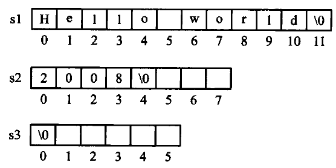
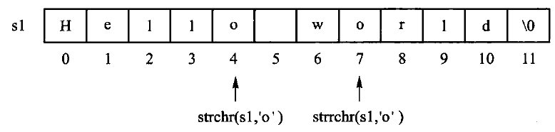
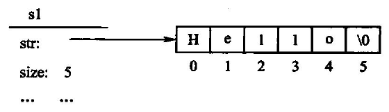
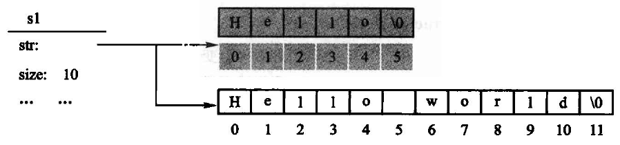
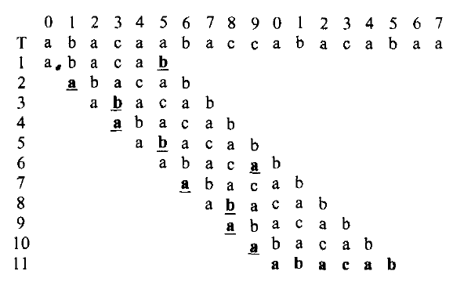
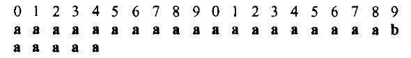
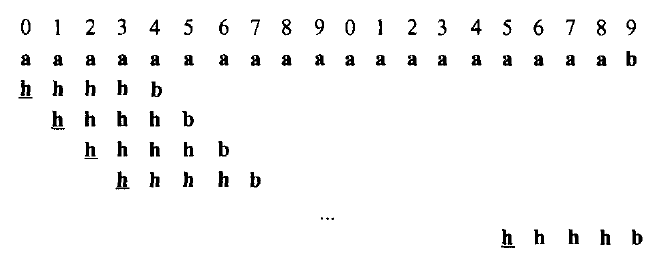
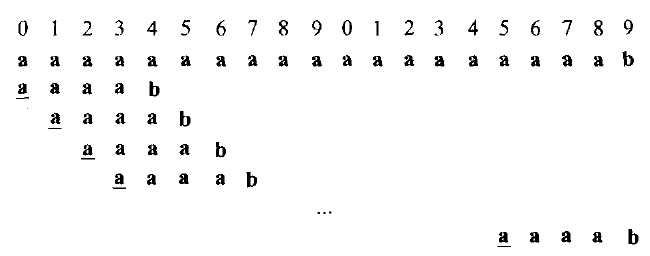
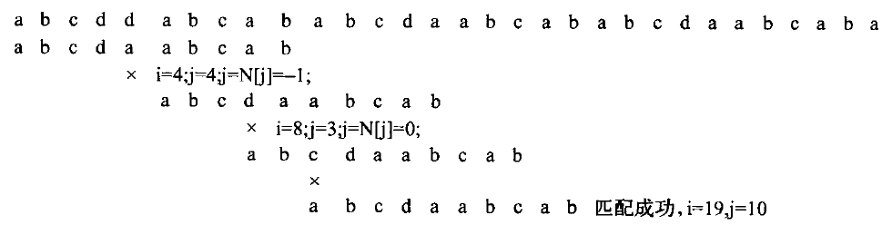

# 第4章 字符串

字符串是字符的有限序列。先区分「保存字符串」的类与「在文本中找模式」的算法：前者处理容量、
复制和下标边界，后者处理比较顺序。朴素匹配在失配后移动模式；KMP 预先计算 `next` 信息，避免
重复比较已经知道相等的前缀。

源码：[字符串类·教学版](../code/ch04/string_class/teaching.hpp)、
[字符串类·工程版](../code/ch04/string_class/modern.hpp)、
[字符串示例](../code/ch04/string_class/demo.cpp)、
[模式匹配](../code/ch04/pattern_matching/modern.hpp)、
[匹配示例](../code/ch04/pattern_matching/demo.cpp)。

## 先跑一遍

```cpp file=code/ch04/string_class/demo.cpp
// 第 4 章「先跑一遍」：用教学版 String 走一遍 append / substr / find。
// 编译运行：
//   g++ -std=c++17 -I code/ch04/string_class code/ch04/string_class/demo.cpp -o demo && ./demo
#include "teaching.hpp"

#include <iostream>

int main() {
    String text = "Hello";                       // 隐式转换：String(const char*)
    text.append(' ').append('C').append('+').append('+');
    std::cout << "拼接后: " << text.c_str() << '\n';

    const String slice = text.substr(6, 3);
    std::cout << "子串: " << slice.c_str() << '\n';

    // find 返回 optional：有值才解引用
    std::cout << "首次出现 C 的下标: ";
    if (const auto found = text.find('C')) {
        std::cout << *found << '\n';
    } else {
        std::cout << "无\n";
    }
}
```

```bash
c++ -std=c++17 -Wall -Wextra -Werror -Icode/ch04/string_class \
    code/ch04/string_class/demo.cpp -o /tmp/str-demo
/tmp/str-demo
```

```console
拼接后: Hello C++
子串: C++
首次出现 C 的下标: 6
```

缓冲区仍是手写的 `char*`，换成 `std::string` 这一节就没了。`find` 找不到时返回空 optional，不用 `-1` 和位置 0 抢同一个数字。

图4.12 自己的那对串，原书两个匹配算法都返回 11，正确答案是 10：

```cpp file=code/ch04/pattern_matching/demo.cpp
#include "modern.hpp"

#include <iostream>

int main() {
    const char* text = "abcddabcababcdaabcababcdaabcabaa";
    const char* pattern = "abcdaabcab";
    const auto naive = dsa::naive_search(text, pattern);
    const auto kmp = dsa::kmp_search(text, pattern);
    std::cout << "图4.12 的串，正确起始下标是 10\n";
    std::cout << "朴素: " << (naive ? static_cast<long>(*naive) : -1) << '\n';
    std::cout << "KMP:  " << (kmp ? static_cast<long>(*kmp) : -1) << '\n';
    std::cout << "原书返回 11，一律差 1\n";
}
```

```bash
c++ -std=c++17 -Wall -Wextra -Werror -Icode/ch04/pattern_matching \
    code/ch04/pattern_matching/demo.cpp -o /tmp/kmp-demo
/tmp/kmp-demo
```

```console
图4.12 的串，正确起始下标是 10
朴素: 10
KMP:  10
原书返回 11，一律差 1
```

> **本文件的地位**：《数据结构与算法》（张铭、王腾蛟、赵海燕，高等教育出版社 2008）
> 第 4 章的现代化重排（4.1 字符串概念、4.2 存储结构与实现、4.3 模式匹配）。
>
> 书里印的每一段 C++ 都来自 `code/ch04/string_class/` 与 `code/ch04/pattern_matching/`，
> 真正编译、真正跑过（`tools/check_doc.py` 的 R3 逐字核对）。原书那份写法错在哪、
> 改了什么、什么刻意没改，逐条记在两个单元各自的 `legacy.md`。
>
> **本章有一处不是写法问题，是算法结果错**：原书两个模式匹配算法返回的位置都差 1。
> 详见 4.3.1 节末。

## 4.1 字符串的基本概念

字符串（string）是组成元素（结点）为单个字符的线性表，简称「串」。一个字符串可以是一个单词、
一个句子、一篇文章，或者一个文件的内容。串中所包含的字符个数称为**串的长度**；长度为零的串
称为**空串**，不包含任何字符内容。

尽管字符串是一种特殊的线性表，但其逻辑结构与线性表相比存在两点区别：

1. 字符串的数据对象约束为**字符集**；
2. 线性表的基本操作大多以「单个元素」为操作对象，而字符串的基本操作通常以「**串的整体**」
   作为操作对象——拼接、复制、抽取子串、模式匹配，动的都是一整段。

**子串。** 设 $s_1 = a_0a_1a_2\cdots a_{n-1}$、$s_2 = b_0b_1b_2\cdots b_{m-1}$（$0 \le m \le n$）是两个
字符串，$a_i$ 和 $b_j$ 均为字符集中的字符。如果存在整数 $i$（$0 \le i \le n-m$），使得对任意
$j = 0, 1, \cdots, m-1$ 都有 $b_j = a_{i+j}$ 同时成立，则称字符串 $s_2$ 是 $s_1$ 的**子串**，
或称 $s_1$ 包含 $s_2$。空字符串是所有字符串的子串，任何串都是其自身的子串；如果 `str` 的一个
子串非空且不为 `str` 自身，则称其为 `str` 的一个**真子串**。例如 `"quick"`、`"jump"`、`"fox"`、
`"brown dog"` 均为 `"The quick brown dog jumps over the lazy fox"` 的真子串。4.3 节的模式匹配
问题，问的就是「一个串是不是另一个串的子串，如果是，从哪个位置开始」。

原书【代码4.1】给出字符串的抽象数据类型。那份声明有三处今天必须改：

1. **类名是小写的 `string`。** 在任何 `using namespace std;` 的翻译单元里，
   它与 `std::string` 构成歧义。原书正文随后又改用大写 `String`，
   同一章里两个名字混用。
2. **`int isEmpty();`** 用 `int` 表达布尔，**`int find(const char c, const int start);`**
   用 `-1` 表示"没找到"——与"位置 0"只差一个符号，调用方漏判就会把
   "没找到"当成"匹配在开头"。
3. **修改器按值返回**：`string append(const char c);`、`string concatenate(const char* s);`
   都返回 `string` 而非引用。代码4.1 只有声明没有函数体，所以不能断定原书会丢结果；
   **能断定的是签名含混**——调用方无从判断 `s.append('x');` 是改了 `s`，
   还是返回了一个新串而 `s` 原封不动。

本书的 `String` 把这三处分别改为：类名大写、`bool empty()`、
`std::optional<size_type> find(...)`、修改器返回 `String&`。

### 4.1.1 字符编码

字符串的逻辑元素是字符，内存中却保存**编码单元**。计算机只能识别 0、1 组成的字节，因此实际
字符集的「字符」在内存中需要用「字节」来表示，这就是所谓的**字符编码**。

在 C/C++ 等程序设计语言中，字符类型是单字节的基本数据类型，采用 ASCII（American Standard
Code for Information Interchange，美国标准信息交换码）编码标准，每个字符用一个字节表示，
其中低 7 位表示字符，最高位均为 0。ASCII 编码集中包含 128 个字符：编号为第 0～32 号及第
127 号的 34 个字符为控制字符或通信专用字符，其余编号处于第 33～126 号之间的 94 个字符为
通用字符。控制符包括 LF（换行）、CR（回车）、FF（换页）、DEL（删除）、BEL（振铃）等，通信专用
字符则有 SOH（文头）、EOT（文尾）、ACK（确认）等；通用字符包括常用的 52 个大小写字母、10 个
数字以及若干标点符号和运算符号，其中大写字母的编号范围是 65～90，小写字母是 97～122，
10 个数字是 48～57。

制定于 20 世纪 60 年代的 ASCII 标准没有考虑日后容纳中文、阿拉伯文等多种国际语言文字符号的
统一编码。在发展过程中，不同的语言形成了各自独立的字符编码系统，**这些编码系统有可能使用
相同的编号来表示各自不同的字符**：中文、日文和韩文尽管均采用两个字节的编码方式，但在编码上
存在冲突；每种语言都存在多种编码方式，例如中文的 GB2312-80（中文简体国标码，包括 6763 个
汉字）、BIG5（中文繁体编码，容纳 13053 个汉字），日文的 S-JIS、JIS 以及韩文 Wansung 码等。
这就导致不同语言系统之间进行文档交流非常困难——计算机看到的只是编码后的数字，而两种编码
可能使用相同的数字代表两个不同的字符。

为了解决这些互通问题，产生了「通用文字符号编码标准」UNICODE。简单地说，UNICODE 是一种
可伸缩的编码：既可以容纳多种语言文字的大编码集，同时又可以缩减，允许用单字节表示常用的
ASCII 符号。今天最常见的落地形式是 UTF-8——它以 1～4 个字节编码一个 Unicode 码点，且与
ASCII 完全兼容。

**由此产生一条 2008 年的书还讲不到的结论**：C++ 的 `char` 是一个字节，**不等于**一个「人眼看到
的字符」。`std::string::size()` 返回的是字节数，不能用来数 Unicode 字符；要数字符就得按 UTF-8
解码，或使用明确的 Unicode 库。字面量 `u8"..."` 表示 UTF-8 字节序列。好在**编码本身不改变
字符串概念和操作的本质**：查找、拼接、抽取子串的接口语义与编码无关，所以本书与原书一样，
以 ASCII 为主，基本不涉及多国语言混排的问题。

### 4.1.2 字符的编码顺序

为了便于进行字符串的比较和运算，字符编码表一般遵循约定俗成的「**偏序编码规则**」。这里所说的
字符偏序，是指根据字符的自然含义，某些字符间具有一定的次序，例如数字符号 $0, 1, 2, \cdots, 9$
的大小次序；为了符合其自然次序，在对这些字符编码时使其在字符集中的编码顺序和自然次序一致。
令函数 $\mathrm{encode}(x)$ 为符号 $x$ 到其 ASCII 编码（序号）的映射函数，则有

$$\mathrm{encode}('0') + 1 = \mathrm{encode}('1'), \quad \mathrm{encode}('1') + 1 = \mathrm{encode}('2'), \quad \cdots, \quad \mathrm{encode}('8') + 1 = \mathrm{encode}('9')$$

即 10 个数字符号的编码是连续递增的。对于字母符号 $A, B, C, \cdots, Z$ 也遵循类似的偏序规则，
$a, b, \cdots, z$ 同理。于是任意两个字符 `ch1` 和 `ch2` 均可用其编码值来直接比较大小；对于字母
而言，这种大小次序的含义就是按照字典编目次序。两个字符串按其构成的字符顺序比较大小，得到
的结果是：`"monday" < "sunday" < "tuesday"`，`"123" < "1234" < "23"`。**注意这种次序仅仅是
字符串的字典次序，与日常生活中人们对其理解的次序不同**——星期一在星期二之前，整数 123 比
23 要大。以上讨论的比较次序并不限于 ASCII 编码，也适合 GB2312 等其他语言文字在排序方面的
需要。

ASCII 保留了数字 `0`–`9`、大写字母和小写字母各自连续递增的区间，所以同一区间内可用编码值比较。但这不是通用的语言学排序规则：字符的编码值比较是按码元的字典序，大小写、重音、中文排序都可能需要额外的 locale 或排序键。字符串比较先比较第一个不同的编码单元；若一个是另一个的前缀，较短者更小。因此对 `std::string` 而言 `"123" < "1234" < "23"`，但这不是整数大小比较。比较前必须先约定编码和规范化方式，不能把“字节序”误当成“自然语言顺序”。

**这里有个 C++ 特有的坑，必须点破**：上面那条结论只对 `std::string` 成立。两个**字符串字面量**之间写 `<`，比的是两个数组的**地址**，不是内容：

```text
$ g++ -std=c++17 -Wall -Wextra litcmp.cpp
litcmp.cpp:7:25: warning: comparison between two arrays [-Warray-compare]
    7 |     std::cout << ("123" < "1234") << ' ' << ("1234" < "23") << '\n';
      |                   ~~~~~~^~~~~~~~
$ ./litcmp
true true      # ("123" < std::string("1234"))、(std::string("1234") < "23")
false true     # ("123" < "1234")、("1234" < "23")——第一个的答案反了
```

同一行代码，两边只要有一边是 `std::string`，比的就是内容；两边都是裸字面量，比的就是地址，而地址由编译器摆放决定。所以本书凡是比较字符串，一律先落到 `String`/`std::string` 上，再谈编码顺序。

## 4.2 字符串的存储结构和实现

选择字符串的存储结构时要考虑字符串的**变长特点**，同时需结合具体的应用分析各种存储方案的
利弊。某些应用中字符串的长度变化非常显著——短如单词，长为文件；从统计分布来看，字符串
长度分布的方差很大。**对于这种情况，用静态长度的向量作为存储结构是不恰当的。** 字符串的变长
特点是无法回避的：拼接、查找、置换和模式匹配等操作本身都涉及变长的字符串操作，这些操作
时间开销大，必须精心设计算法、选择恰当的串存储结构。本节重点讨论程序执行过程中的字符串
**变长存储**问题。

### 为什么这一节没有 Python 版

本节的对象是一个自管理的字符缓冲区：长度、容量、结尾空字符、深复制和移动后的源对象状态都属于接口契约。Python `str` 是不可变的运行时对象，`list` 也不会让读者实现缓冲区的分配、释放和强异常保证；把它们当作“字符串类的 Python 版”会跳过本节的存储布局和所有权问题。因此算法 4.3 的模式匹配有 Python 版，4.2 的字符串类只保留 C++ 实现。

`String` 采用动态变长的存储结构：内部持有一块以 `'\0'` 结尾的字符数组和当前长度，
构造时按初值长度分配，赋值时按新长度重新分配。这正是本节要教的内容，
所以缓冲区是**裸 `char*`**——换成 `std::string` 这一节就没了。

### 4.2.1 字符串的顺序存储

字符串用一段连续字符数组按字符的逻辑顺序存储，末尾保留 `\0` 作为 C 风格字符串的结束标志，并单独记录不含终止符的长度 `length`。因此容量至少要能容纳 `length + 1` 个字符；`\0` 不是字符串内容，不能计入长度。

顺序存储的字符串**适合访问字符串中单个字符或连续的一组字符**：按下标取第 $i$ 个字符是 $O(1)$。
但进行插入和删除（增减字符）操作就不是很方便，需要移动插入或删除点后面的所有字符；拼接和
抽取子串也要复制一段连续区域。若容量不足，通常重新申请更大的数组、复制旧内容、释放旧数组，
再更新指针和长度；这也是后面 `String` 类需要自己维护所有权、拷贝和析构的原因。

C/C++ 的标准字符串是顺序存储方案的典型代表：在程序中用 `char s[M];` 的形式定义字符串变量，
其中 `M` 是整型常数，表示字符数组的长度。标准字符串需要在其末尾带一个结束标记 `'\0'` 来表示
串的结束，因此**字符串的长度不能超过最大长度 `M - 1`**。原书图 4.1 画的就是

```text
char s1[12] = "Hello world";
char s2[8]  = "2008";
char s3[6];
```

这三个数组在内存里的样子。**存储字符串的数组是静态定长的**，程序运行中一旦产生更长的字符串
就会造成数组溢出，这给编写和调试程序带来不便——这正是本节接下来要用一个类来解决的问题。

还有一处「字符串处理中非常容易犯的错误」值得单独点出：C++ 中的字符数组是用字符指针定义的，
指向字符数组的始址，**赋值语句 `s1 = s2` 不能被理解为把 `s2` 的内容复制到 `s1`**。这也是本书的
`String` 必须自己写拷贝赋值运算符的原因（4.2.2 节）。



图 4.1　C 风格字符串的变量说明示意。`'\0'` 是 ASCII 里 8 位全 0 的 NULL 符，只作结束标记用，不算内容；说明变量时可以用字符串常量给初值，也可以不给——图中的 `s3` 没给初值，存的就是空串。

标准库 `<string.h>`（C++ 里是 `<cstring>`）提供了若干处理字符串的常用函数，原书表 4.1 列出了
常用的几个：

表 4.1　标准串函数

| 函数名 | 功能说明 |
| --- | --- |
| `size_t strlen(char* s)` | 求字符串 `s` 的当前长度，不计结束符；空字符串的长度为 0 |
| `char* strcpy(char* s1, const char* s2)` | 将 `s2` 复制到 `s1`，并返回一个指向 `s1` 开始的指针 |
| `char* strcat(char* s1, const char* s2)` | 将 `s2` 拼接到 `s1` 尾部 |
| `int strcmp(const char* s1, const char* s2)` | 比较 `s1` 和 `s2`：全同返回 0，`s1` 大于 `s2` 返回正数，小于返回负数 |
| `char* strchr(char* s, char c)` | 定位到 `s` 中第一次出现字符 `c` 的位置，没有则返回空指针 |
| `char* strrchr(char* s, char c)` | 从尾部逆向定位，返回最后一次出现 `c` 的位置，没有则返回空指针 |

此外，输入/输出的处理也是标准串函数库中的主要组成部分，例如 `cin >> s1;` 从标准输入读取
字符串到串变量 `s1`，`cout << s1;` 把 `s1` 的内容输出到标准输出。

例如对图 4.1 中的 `s1` 调用 `strchr(s1, 'o')` 和 `strrchr(s1, 'o')`，将分别得到字符 `'o'` 的第一次和
倒数第一次出现位置：



图 4.2　在字符串 `s1` 中定位字符 `'o'`。两个函数返回的都是指针，指向找到的那个字符；找不到返回空指针。本书的 `String` 用下标和 `std::optional` 表达同一件事——「没找到」不再靠一个特殊指针值来表示。

### 4.2.2 字符串类 class String 的存储结构

字符串的顺序存储方式简单易实现，C++ 的标准串及其相关的标准函数也提供了若干实用的函数，
**但终归难以避免其静态定长的局限**；而在实际应用中，大多的字符串变量具有动态变化的长度。

那么为什么不用链式的变长结构？因为**每一个链指针比一个字符所占的存储空间还大**——用链表
存字符，指针域的开销会几倍于数据域（回到 2.4 节那条「指针所占比例超过 1:1 就要慎重」的判据）。
所以字符串的变长存储走的是另一条路：仍然顺序存放，但**把这块缓冲区的分配与释放交给一个类
去管**。

顺序存储只说了「字符放在哪」，还没说「这块内存归谁、什么时候还」。
把它包成一个类之后，这两件事才有着落：类里存一个指向字符数组的指针和一个长度，
构造时申请、析构时释放、拷贝时另开一份——本节的教学内容就是这套**变长存储管理**。

#### 教学版：完整实现

下面是一份**完整的、能直接编译运行的**字符串类。一个文件、一个类。
后面 4.2.2、4.2.3 两节就是把它拆开逐段讲。

```cpp file=code/ch04/string_class/teaching.hpp
// 字符串类 String —— 教学版。原书【代码4.1】【算法4.3】【算法4.4】【算法4.5】。
//
// 一个文件、一个类、能直接编译运行，给「第一次读这一节」的人看。
//
// 本节的教学内容是**字符串的变长存储管理**：动态分配、按长度重新开辟、拷贝与释放。
// 所以这里是手写的 char* 缓冲区，不是 std::string——换成 std::string，这一节就没了。
//
// 与 modern.hpp（工程版）的分工：
//   教学版  三法则（析构 + 拷贝构造 + 拷贝赋值）；
//   工程版  补齐移动语义（移动之后 data_ 为空，读取路径要多一层 raw() 兜底）、
//           比较运算符全家、copy-and-swap。
// 两份都在闸门里真编译真运行。先读这一份，4.2a「进阶（选读）」再读那一份。
#pragma once

#include <cstddef>
#include <cstring>
#include <optional>
#include <stdexcept>

class String {
public:
    using size_type = std::size_t;

    // 空串。**注意它仍然申请了 1 个字节**，里面放一个 '\0'。
    // 这样 c_str() 永远返回一个合法的 C 字符串，调用方不必先判空指针。
    String() : data_(new char[1]), size_(0) {
        data_[0] = '\0';
    }

    // 从 C 字符串构造。参数是 `const char*` 而不是原书的 `char*`——
    // 原书那个签名让它自己书里的例子 `String s1 = "Hello";` 从 C++11 起就编译不过：
    // 字符串字面量的类型是 const char[6]，绑不到 char*。
    //
    // 这里**故意不加 explicit**，为的就是保住 `String s1 = "Hello";` 这种写法。
    String(const char* s) {   // NOLINT(google-explicit-constructor)
        if (s == nullptr) {
            throw std::invalid_argument("String: 不能用空指针构造字符串");
        }
        size_ = std::strlen(s);
        data_ = new char[size_ + 1];
        std::memcpy(data_, s, size_ + 1);   // +1 把结尾那个 '\0' 也带上
    }

    ~String() { delete[] data_; }

    // 三法则：自己管着 new 出来的缓冲区，拷贝必须自己写。
    // 原书正文里描述过赋值时「必须释放 s1 的原有空间」，却没有把拷贝构造和
    // 拷贝赋值作为清单给出。只有析构没有这两个，一次 `String b = a;` 就是二次释放。
    String(const String& other) : data_(new char[other.size_ + 1]), size_(other.size_) {
        std::memcpy(data_, other.data_, size_ + 1);
    }

    String& operator=(const String& other) {
        if (this == &other) {
            return *this;
        }
        char* fresh = new char[other.size_ + 1];   // 先备好新的
        std::memcpy(fresh, other.data_, other.size_ + 1);
        delete[] data_;                            // 再释放旧的
        data_ = fresh;
        size_ = other.size_;
        return *this;
    }

    size_type size() const { return size_; }
    size_type length() const { return size_; }
    bool empty() const { return size_ == 0; }
    const char* c_str() const { return data_; }

    void clear() {
        char* fresh = new char[1];
        fresh[0] = '\0';
        delete[] data_;
        data_ = fresh;
        size_ = 0;
    }

    // 按下标取字符。越界抛异常，不是返回一个随便什么值。
    char at(size_type index) const {
        if (index >= size_) {
            throw std::out_of_range("String::at: 下标越界");
        }
        return data_[index];
    }

    // 在串尾添加一个字符。
    //
    // **变长存储的代价在这里看得最清楚**：字符串长度变了，就得重新申请一块、
    // 把老内容拷过去、再把老的还回去。所以 append 一个字符是 O(n)，不是 O(1)。
    //
    // 返回自身引用，于是 `s.append('a').append('b')` 可以连着写；
    // 原书【代码4.1】声明的是**按值返回**，调用方从签名看不出它改不改本串。
    String& append(char c) {
        char* fresh = new char[size_ + 2];        // 老内容 + 新字符 + '\0'
        std::memcpy(fresh, data_, size_);
        fresh[size_] = c;
        fresh[size_ + 1] = '\0';
        delete[] data_;
        data_ = fresh;
        ++size_;
        return *this;
    }

    // 把 s 接在本串后面。同样是「重新申请、拷两段、释放旧的」。
    String& concatenate(const char* s) {
        if (s == nullptr) {
            throw std::invalid_argument("String::concatenate: 空指针");
        }
        size_type extra = std::strlen(s);
        char* fresh = new char[size_ + extra + 1];
        std::memcpy(fresh, data_, size_);
        std::memcpy(fresh + size_, s, extra + 1);
        delete[] data_;
        data_ = fresh;
        size_ += extra;
        return *this;
    }

    // 【算法4.5】从 pos 开始取长度至多 len 的子串。
    //
    // 原书在 `pos >= size` 时 `return NULL;`。那不是「返回空串」——
    // NULL 会去走 String(char*) 构造函数，然后 strlen(nullptr) 当场段错误。
    // 这里越界就抛异常，让错误停在发生的地方。
    // pos == size() 是合法的，得到空串（「从末尾取 0 个字符」）。
    String substr(size_type pos, size_type len) const {
        if (pos > size_) {
            throw std::out_of_range("String::substr: 起始位置越界");
        }
        size_type available = size_ - pos;
        size_type take = (len < available) ? len : available;   // 原书的 if (n > left) n = left
        String result;
        char* fresh = new char[take + 1];
        std::memcpy(fresh, data_ + pos, take);
        fresh[take] = '\0';
        delete[] result.data_;
        result.data_ = fresh;
        result.size_ = take;
        return result;
    }

    // 【算法4.4】从 start 开始查找字符 c。找到返回下标，没找到返回空 optional。
    // 原书用 -1 表示没找到——与「位置 0」只差一个符号，忘了判就会读错位置。
    std::optional<size_type> find(char c, size_type start = 0) const {
        for (size_type i = start; i < size_; ++i) {
            if (data_[i] == c) {
                return i;
            }
        }
        return std::nullopt;
    }

    // 【算法4.3】三路比较：负 / 零 / 正 表示 小于 / 等于 / 大于。
    //
    // 原书自己实现了一个 strcmp，返回值固定为 -1/0/1，并在正文里说
    // 「这与 C/C++ 语言中通常的大小比较习惯不一致」——其实不一致的是原书自己：
    // 标准 strcmp 返回的就是差值的符号，调用方只该看符号，不该看具体数值。
    int compare(const String& other) const {
        return std::strcmp(data_, other.data_);
    }

private:
    char* data_;       // 以 '\0' 结尾的字符数组，永远非空
    size_type size_;   // 字符个数，不含结尾的 '\0'
};

inline bool operator==(const String& a, const String& b) { return a.compare(b) == 0; }
inline bool operator!=(const String& a, const String& b) { return a.compare(b) != 0; }
inline bool operator<(const String& a, const String& b) { return a.compare(b) < 0; }
```

#### 构造与所有权

原书【算法4.4】的构造函数有两处问题。

第一处，`assert(str != '\0')` **本身就编译不过**：`'\0'` 是 `char` 而不是空指针常量，
拿指针与它比较是 ill-formed（`error: ISO C++ forbids comparison between pointer and integer`）。
而且即便改写成 `assert(str != nullptr)` 也是无效断言——`new` 失败时抛
`std::bad_alloc`，从不返回空指针；`assert` 更会在 `NDEBUG` 构建里整个消失。

第二处，参数类型是 `char*`。原书 4.2.2 节自己写下：

> `String s1 = "Hello";` 隐含地调用构造函数 `String::String(char* s)`

而字符串字面量的类型是 `const char[6]`，转成 `char*` 在 C++11 起已被移除。
GCC 默认降级为警告，在本书的 `-Werror` 构建下即是错误。

还有一处原书没有做的检查：构造函数对 `s == nullptr` 毫无防备——
而 4.2.3 节的 `Substr` 恰好会喂给它一个空指针（见 4.2.3 节）。

原书的类里有 `~string()`，却从未把拷贝构造与拷贝赋值作为清单给出
（正文描述过赋值时"必须释放 s1 的原有空间"，但没有代码）。
只要有析构而没有这两个，一次 `String b = a;` 就是二次释放——
与第 2、3 章是同一个错误。

教学版按**三法则**补齐了这两个（析构 + 拷贝构造 + 拷贝赋值），
拷贝赋值走的是「先备好新缓冲区，再释放旧的，最后接管」——顺序反过来，
一旦 `new` 抛异常，对象就停在「指针已释放」的破碎状态。

原书用两张图说明这套变长管理。`String s1 = "Hello";` 会在动态存储区开一个长度为 6 的字符数组（5 个字符加结束符），把初值顺序存进去：



图 4.3　创建字符串：对象里只有一个指针和一个长度，字符本体在堆上。

再写 `String s2 = "Hello world"; s1 = s2;`，新内容比旧的长，装不下，于是必须先另开一块新数组、把内容复制过去，旧数组（图 4.4 中的灰格）释放掉，`str` 改指新数组：



图 4.4　赋值运算：`String` 按当前串长动态调整空间，这就是「变长管理」的全部含义。注意图上那块灰色的旧空间——**它必须释放，而且必须在新空间准备好之后再释放**。原书正文说到了这一步，却没有给出拷贝赋值的代码；漏掉它，`String b = a;` 就是二次释放。

工程版还多两个**移动**操作，见 4.2a。


### 4.2.3 字符串运算的实现

#### 追加与拼接

`append(char)` 与 `concatenate(const char*)` 的形状是一样的三步：
**重新申请一块、把老内容拷过去、释放旧块**。所以追加一个字符是 O(n)，不是 O(1)——
这就是变长串管理的代价，也是后面章节讨论"预留容量"的动机。

两者都返回 `String&`，于是 `s.append('a').append('b')` 可以连着写，
而且调用方从签名一眼看出它改的是本串。原书【代码4.1】声明的是**按值返回**，
`s.append('x');` 到底改不改 `s`，从签名看不出来。

#### 抽取子串

原书【算法4.5】在起始位置越界时写 `return NULL;`。这里的返回类型是 `String`，
所以 `NULL` 不是"空串"：它先转成 `char*`，再走 `String(char*)` 构造函数，
于是 `strlen(nullptr)`。这段**能编译**，崩在运行期：

```text
$ ./s7
准备调用 s.Substr(99, 1)——原书会走到 return NULL 那一支
runtime error: null pointer passed as argument 1, which is declared to never be null
AddressSanitizer:DEADLYSIGNAL
ERROR: AddressSanitizer: SEGV on unknown address 0x000000000000
```

本书越界就抛 `std::out_of_range`，让错误停在发生的地方，
而不是变成调用方某处的段错误。

`pos == size()` 是**合法**的，得到空串——与"从末尾取 0 个字符"的直觉一致；
`len` 超出剩余长度时**截断**而不报错，与原书的 `if (n > left) n = left;` 语义一致。

#### 查找与比较

对应【算法4.4】的 `find` 返回 `std::optional<size_type>`：找到是下标，没找到是空盒子。
原书用 `-1` 表示没找到——与"位置 0"只差一个符号，调用方漏判就会把
"没找到"当成"匹配在开头"。这与 2.2.2 节 `getPos` 那一处是同一个问题、同一个改法。

关于【算法4.3】：原书自己实现了一个 `strcmp`，固定返回 −1/0/1，
并在正文里说"这与 C/C++ 语言中通常的大小比较习惯(0和非0)不一致"。
其实标准 `strcmp` 返回的就是差值的符号，调用方本来就只该看符号——
不一致的是原书固定返回 ±1 的写法。本书保持标准语义，并据此提供关系运算符。

（另外补一句实测结论：原书那个与标准库同名同签名的 `strcmp` 定义，
既能编译也能链接，不构成冲突——这是我们查过之后否掉的一个猜测，
记在 `legacy.md` 第五节。）

### 4.2a 进阶（选读）：从教学版到工程版

**这一节可以整节跳过。** 工程版在 `code/ch04/string_class/modern.hpp`。
它比教学版多的东西里，只有一件是这一章特有的：**移动之后的那个空壳怎么办。**

```cpp file=code/ch04/string_class/modern.hpp#rule-of-five
// 原书只在正文里描述了赋值时"必须释放 s1 的原有空间(delete [] s1.str)"，
// 却没有把拷贝构造和拷贝赋值作为清单给出。只要有析构函数而没有这两个，
// 一次 `String b = a;` 就是二次释放——与第 2、3 章是同一个错误。
String(const String& other) : data_(new char[other.size_ + 1]), size_(other.size_) {
    // 注意读的是 other.raw() 不是 other.data_：源可能是被移动过的对象（data_ 为空），
    // 从空指针 memcpy 即便长度为 0 也是未定义行为。
    std::memcpy(data_, other.raw(), size_ + 1);
}

String& operator=(const String& other) {
    if (this != &other) {
        String copy(other);  // 拷贝并交换：自赋值安全，且拷贝失败时原对象不受影响
        swap(copy);
    }
    return *this;
}

/// 移动**不分配**：直接接管缓冲区，把对方置为 nullptr。
/// 被移动方仍是一个可用的空串——读取路径统一走 raw()，它在 data_ 为空时返回 ""。
/// （若在这里 new 一块空缓冲区来"修复"对方，移动就不再是 noexcept 的了。）
String(String&& other) noexcept : data_(other.data_), size_(other.size_) {
    other.data_ = nullptr;
    other.size_ = 0;
}

String& operator=(String&& other) noexcept {
    if (this != &other) {
        delete[] data_;
        data_ = other.data_;
        size_ = other.size_;
        other.data_ = nullptr;
        other.size_ = 0;
    }
    return *this;
}

~String() { delete[] data_; }
```

移动操作声明为 `noexcept`，因此**不能在里面分配**——所以被移动方的 `data_`
只能置空，不能塞一块新的 1 字节缓冲区进去。可是教学版承诺过
「`c_str()` 永远不是空指针」，这个承诺不能因为被移动过就作废。

工程版的解法是加一个私有的 `raw()`：`data_` 为空时返回一个静态空串。
读取路径全部走它，于是「被移动之后仍是可用的空串」这个保证**不花任何分配**就成立。
教学版没有移动操作，也就不需要这一层。

其余的差别与前几章相同：`[[nodiscard]]`、`noexcept`、copy-and-swap、
关系运算符全家（`< > <= >=` 都由 `compare()` 派生）。

## 4.3 字符串的模式匹配

字符串模式匹配是一种常用的运算。所谓**模式匹配**（pattern matching），简单地说就是在**文本**
（text）中寻找一个给定的**模式**（pattern）：通常文本都很大，而模式则比较短小。典型的例子包括
文本编辑和 DNA 分析——编辑文本时人们经常使用「替换」命令对文中的某个字符串或语句进行替换，
此时便需先找到要被替换的内容；在文本编辑器中，模式通常为一个单词，长度在 10 个字符左右，
而文本的长度则从几百字到上百万字不等。在生物信息中，DNA 信息一般由 A、C、G、T 这 4 个符号
组成，基因一般也就是几百个字符的长度，而**人类染色体的长度却有 30 亿之多**。显而易见，这些
应用对匹配算法的效率要求很高。

模式匹配有精确匹配和近似匹配两类。**精确匹配**（exact matching）：如果在目标 $T$ 中至少一处
存在模式 $P$，则称匹配成功，否则即使目标与模式只有一个字符不同也算匹配失败。想要找的词可以
是单选的（例如 `"set"`），也可以是多选的——例如模式 `"s?t"` 表示任何以 `s` 打头、以 `t` 结尾、
中间夹一个字符的串都可与之匹配（`"sat"`、`"set"`、`"sit"` 都可以），模式中的符号 `?` 称为**通配符**；
更复杂的模式可以采用正则表达式来表示。**近似匹配**（approximate matching）：如果模式 $P$ 与
目标 $T$（或其子串）存在某种程度的相似，则认为匹配成功；常用的衡量字符串相似度的方法，是根据
一个串转换成另一个串所需的基本操作（插入、删除、替换）数目来确定的。本节与原书一样，只讨论
**精确匹配中的单选情况**，不涉及通配符、正则表达式与近似匹配。

给定目标串 $T$ 和模式串 $P$，模式匹配要回答：$P$ 是否作为 $T$ 的连续子串出现，若出现，首次出现
在哪个位置。用原书的记号写出来：$T_j$、$P_j$ 表示其在位置 $j$ 上的字符，$|T|$、$|P|$ 表示长度，
$a^n$ 表示由 $n$ 个字符 $a$ 组成的字符串，**$P$ 和 $T$ 的第一个字符都从位置 0 开始**；模式匹配
就是要在 $T$ 中找到一个 $j$，使得

$$P_0 P_1 P_2 \cdots P_{m-2} P_{m-1} = T_j T_{j+1} T_{j+2} \cdots T_{j+m-2} T_{j+m-1}$$

否则称模式匹配失败。**记住「都从位置 0 开始」这句话**——4.3.1 节会看到，原书自己的两个算法
都没有遵守它。

本节的教学内容是**算法本身**，因此下面的实现用 `std::string_view` 接收输入：
不拷贝、不拥有，把注意力留在匹配过程上。字符串容器的实现是 4.2 节的事。

### 4.3.1 朴素的模式匹配算法

朴素算法的思路直白：把模式的首字符对齐目标的每一个位置，逐字符比较；某次比较失败（称为一次
**失配**）时，就把模式对于 $T$ 向右移动一个字符位置，重新开始下一趟匹配。如此不断重复，直到
某趟配串成功返回，或者比较到目标串的结束也没有出现配串，则匹配失败。

**时间效率分情况看。** 最佳情况是目标首位置开始的子串便是所要找的配串，只要通过 $|P|$ 次比较
即可完成匹配，代价 $O(|P|)$，与模式的长度成正比。如果最终匹配失败，其最佳情况是每次都在模式
的首字符比较时就不等、于是右移一位，直到在目标的 $|T| - |P|$ 位置处依然与模式的首字符不匹配，
整个过程中至少比较了 $(|T| - |P| + 1)$ 次，时间代价 $O(|T| - |P| + 1)$。

**最差情况需要 $O(|T| \cdot |P|)$**：例如目标串 $T$ 形如 $a^n$，而模式 $P$ 形如 $a^{m-1}b$，每趟都
是在模式的最后一个字符处不匹配，即每趟都需要进行 $|P|$ 次比较，再把模式右移一位、再次从模式
头比较，最多需要 $(|T| - |P| + 1)$ 趟，因此总共需要比较 $|P|(|T| - |P| + 1)$ 次。**此类情况很少
出现在文本中，却经常出现在 DNA 信息和图像信息中**——这正是朴素算法在生物计算里不够用的原因。

平均代价同时依赖于目标和模式中字符的分布概率。假设一个字符串中只允许使用 2 种字符，那么使用
任一字符的概率为 $1/2$：对于第 $j$ 趟扫描来说，仅比较一次的概率为 $1/2$，比较两次的概率为
$1/4$，比较 $m$ 次的概率为 $2^{-m}$，因此平均情况下第 $j$ 趟扫描的比较次数为
$\sum_{k=1}^{|P|} k / 2^k < 2$，平均比较次数为 $2(|T| - |P| + 1) < 2|T|$ 次。若运用马尔科夫链
（Markov Chain）的有关理论，可以估算一个更好的比较次数 $2^{|P|+1} - 2$；在通用的情况下，如果
字符串中允许使用的字符数目为 $|A|$，则平均比较次数为 $(|A|^{|P|+1} - |A|) / (|A| - 1)$。

**问题出在哪里。** 尽管朴素算法思想简单易懂，但效率较低：一旦某趟匹配中发生失配，**无论模式的
具体情况如何，都采用模式右移一位开始下一趟的匹配**。这会导致很多冗余的比较，因为目标 $T$ 中
的字符会多次与模式中的字符进行比较，造成**目标的回溯**。例如模式 $P = $ `"abacab"` 与目标
$T = $ `"abacaabaccabacabaa"` 的第 1 趟比较中，发现 $P_5 \ne T_5$ 时把模式右移一位、开始第 2 趟，
使得 $P_0$ 与 $T_1$ 比较；其实之前的匹配中 $T_1$ 已与 $P_1$ 比较过而且相等，由于 $P_1$ 与 $P_0$
不同，因此可知 $P_0$ 与 $T_1$ 肯定不等，**根本用不着重新比较**。换言之，利用模式本身的构成特征
以及上趟匹配的比较结果，就能知道 $P_0$ 与 $T_1$ 肯定不等。

一般来说，右移的位数越多效率就越好，但前提是要保证不能丢失 $P$ 和 $T$ 的任何可匹配子串。
Knuth、Morris、Pratt 等人发现，**每次右移的位数存在，且与目标串无关，仅依赖于模式本身**，
因此他们对朴素算法进行了改进：预先处理模式本身，分析其字符分布状况，为模式中的每一个字符
计算失配时应该右移的位数——此即 4.3.2 节所谓的**字符串的特征向量**，改进后的算法就是 4.3.3 节
的 KMP 算法。

```cpp file=code/ch04/pattern_matching/modern.hpp#naive
/// 朴素模式匹配：返回 pattern 在 text 中首次出现的**起始下标**；没有则 std::nullopt。
///
/// 与原书【算法4.6】的关键差别是返回值：原书写的是 `return (j - pLen + 1);`，
/// 而在 0 起始的下标体系里正确的是 `j - pLen`——**原书这里差了 1**。
/// 用书中自己的例子可以当场看出来：T="abcddabcab..."、P="abcdaabcab" 匹配始于下标 10，
/// 原书返回 11（证据见 legacy.md 缺陷 1）。
///
/// 空模式约定返回 0（与 std::string::find("") 一致）；原书用 assert(m>0) 把它挡在门外，
/// 而 assert 在 NDEBUG 下会被整个编译掉。
[[nodiscard]] inline std::optional<std::size_t> naive_search(std::string_view text,
                                                             std::string_view pattern) {
    const std::size_t n = text.size();
    const std::size_t m = pattern.size();
    if (m == 0) {
        return std::size_t{0};
    }
    if (n < m) {
        return std::nullopt;
    }
    std::size_t i = 0;  // 模式下标
    std::size_t j = 0;  // 目标下标
    while (i < m && j < n) {
        if (text[j] == pattern[i]) {
            ++i;
            ++j;
        } else {
            j = j - i + 1;  // 回退到本趟起点的下一个位置
            i = 0;
        }
    }
    return i >= m ? std::optional<std::size_t>(j - m) : std::nullopt;
}
```

```python file=code/ch04/pattern_matching/modern.py#naive
def naive_search(text: str, pattern: str) -> int | None:
    """朴素匹配：返回首次出现的 0 起始下标。"""
    if not pattern:
        return 0
    i = 0
    j = 0
    while i < len(pattern) and j < len(text):
        if text[j] == pattern[i]:
            i += 1
            j += 1
        else:
            j = j - i + 1
            i = 0
    return j - len(pattern) if i == len(pattern) else None
```

失配时 `j = j - i + 1` 把目标下标退回本趟起点的**下一个**位置——这一步的"+1"是对的，
它表示"换一个起点重来"。

原书用 T = `"abacaabaccabacabaa"`、P = `"abacab"` 走了一遍全过程：第 1 趟在目标的 `a` 与模式的 `b` 处失配，模式右移一位重来，如此直到第 11 趟在子串处配上，返回首位置 10。



图 4.6　朴素匹配的示例。加粗带下划线的是当前失配的那一对字符。可以数一数目标里有多少字符被反复比较过——这些重复比较正是 KMP 要省掉的东西。

三种极端情况值得分开看。**最好**：目标开头那一段就是配串，比 $|P|$ 次就完事，$O(|P|)$。



图 4.7　朴素匹配的最佳情况：第一趟就配上。

**匹配失败中的最好情况**：每趟都在模式首字符处就不等，右移一位再试，一共比较约 $|T|-|P|+1$ 次，$O(|T|-|P|+1)$。



图 4.8　匹配失败的最佳情况：每趟只比一次就失配。

**最坏**：目标形如 $a^n$、模式形如 $a^{m-1}b$，每趟都要比到模式的最后一个字符才失配，$|P|(|T|-|P|+1)$ 次比较，即 $O(|T|\cdot|P|)$。



图 4.9　朴素匹配的最差情况。这种输入在自然语言文本里少见，在 DNA 序列和图像数据里却很常见——这正是需要 KMP 的实际理由。

平均情况依赖字符分布：字符表大小为 $|A|$ 时，平均比较次数约 $(|A|^{|P|+1}-|A|)/(|A|-1)$，两个字符的极端情形下不到 $2|T|$ 次。

#### 一处必须指出的错误：原书的返回值差 1

原书【算法4.6】与【算法4.8】在匹配成功时都写：

```text
if (i >= pLen) return (j - pLen + 1);
```

匹配成功时 `j` 已经走到匹配段的**末尾之后**，所以起始位置是 `j - pLen`。
那个 `+1` 是多余的。把原书两段代码照抄进程序，拿标准库的 `find` 做参照：

```text
T=abc                              P=abc          原书朴素=  1  正确答案=  0
T=xabc                             P=abc          原书朴素=  2  正确答案=  1
T=aaab                             P=ab           原书朴素=  3  正确答案=  2
T=abcddabcababcdaabcababcdaabcabaa P=abcdaabcab   原书朴素= 11  正确答案= 10
```

**每一组都恰好多 1**，最后一组正是书中图4.12 自己用来演示 KMP 的那对串。
原书用它逐趟画了匹配过程，却没有给出返回值，这个错误因此在书里没有暴露。

这不是排版或 OCR 造成的，有三重佐证：`j - pLen + 1` 在两个算法里独立印出、写法一致；
同一段代码里的 `j = j - i + 1` 说明作者用的就是 0 起始下标；
而 4.3 节开头的约定更是把这一点写死了——

> P和T的第一个字符都从位置0开始。

本书的实现返回 `j - m`，并且**每一条匹配用例都拿标准库的 `find` 逐个对拍**，
再加 3000 组随机对拍。只断言"找到了"的测试，在原书那份实现下同样全绿——
那样的测试等于没写。

### 4.3.2 字符串的特征向量

KMP 的想法是：失配时不必把模式退回从头开始，因为**已经匹配上的那一段本身携带了信息**。
这句话抽象，用一个例子就清楚了。

设目标串 T = `ababab d`，模式 P = `ababd`，从 T 的位置 0 开始比：

```text
位置:  0 1 2 3 4 5 6
T   :  a b a b a b d
P   :  a b a b d
                ↑ 这里失配（T[4]='a'，P[4]='d'）
```

失配前已经匹配上了 `abab` 这四个字符。**朴素算法**到这里会把模式整体右移一位、从 T[1] 重新
逐字符比起——但这其实浪费了信息：我们已经知道 T[0..3] 就是 `abab`。

KMP 的做法是问：`abab` 的**前缀**和**后缀**里，最长的相同的一段是多少？

```text
abab 的前缀: a, ab, aba
abab 的后缀: b, ab, bab
最长相同的一段: "ab"，长度 2
```

这个 2 的意义是：`abab` 的末尾两个字符 `ab`，恰好也是 `abab` 的开头两个字符。而模式的开头
也是 `ab`。所以模式可以**一次右移 4 − 2 = 2 位**直接对上去，并且移过去之后**前两个字符
不必再比**——它们必然相同：

```text
位置:  0 1 2 3 4 5 6
T   :  a b a b a b d
P   :      a b a b d
             ↑ 这两个已知相同，从这里继续比
```

接着从 P[2] 与 T[4] 往下比，一路比到底，在位置 2 匹配成功。整个过程中 **T 的下标从来没有
往回退过**，这正是 KMP 优于朴素算法的地方：朴素算法最坏要把 T 的每个位置都当一次起点重来。

把「每个位置失配时该退到哪里」对模式的每个位置预先算出来，就是特征向量（next 数组）。
上面这个例子用本章的实现跑出来是：

```text
next(ababd) = -1 0 -1 0 2
kmp_search("abababd", "ababd") = 2
std::string::find 对照         = 2
```

`next[4] = 2` 正是「在 P[4] 处失配时，模式的比较位置退到 2」——和上面手推的一致。
（这里印的是原书【算法4.7】的**优化版** next，所以中间会出现 −1；未优化版本的取值不同，
但失配后的落点等价。）

```cpp file=code/ch04/pattern_matching/modern.hpp#build-next
/// 计算模式的特征向量（next 数组），原书【算法4.7】的"优化版"。
///
/// 与原书的差别只有所有权：原书 `int* findNext(String P)` 用 `new int[m]` 返回裸数组，
/// 而书中**从未展示过与之配对的 delete[]**——每调用一次泄漏一个数组。
/// 计算过程一字未改，包括 `next[i] = next[k]` 这一步优化。
///
/// 空模式返回空向量；原书是 `assert(m > 0)`，而 assert 在 NDEBUG 下会被编译掉，
/// 于是 release 构建里 `new int[0]` 加 `next[0] = -1` 就是一次越界写。
[[nodiscard]] inline std::vector<next_type> build_next(std::string_view pattern) {
    const std::size_t m = pattern.size();
    std::vector<next_type> next(m);
    if (m == 0) {
        return next;
    }
    next_type i = 0;
    next_type k = -1;
    next[0] = -1;
    while (i < static_cast<next_type>(m)) {
        while (k >= 0 && pattern[static_cast<std::size_t>(i)] != pattern[static_cast<std::size_t>(k)]) {
            k = next[static_cast<std::size_t>(k)];  // 沿已算好的特征值回退
        }
        ++i;
        ++k;
        if (i == static_cast<next_type>(m)) {
            break;
        }
        const auto ui = static_cast<std::size_t>(i);
        const auto uk = static_cast<std::size_t>(k);
        // P[i] 与 P[k] 相等时可以直接借用 next[k]，省掉一次注定失败的比较——这就是"优化版"。
        next[ui] = (pattern[ui] == pattern[uk]) ? next[uk] : k;
    }
    return next;
}
```

```python file=code/ch04/pattern_matching/modern.py#build-next
def build_next(pattern: str) -> list[int]:
    """计算原书算法4.7的优化版 next 数组。"""
    if not pattern:
        return []
    next_values = [-1] * len(pattern)
    i = 0
    k = -1
    while i < len(pattern):
        while k >= 0 and pattern[i] != pattern[k]:
            k = next_values[k]
        i += 1
        k += 1
        if i == len(pattern):
            break
        next_values[i] = next_values[k] if pattern[i] == pattern[k] else k
    return next_values
```

`next[i] = next[k]` 那一步是原书所说的"优化"：如果 `P[i]` 与 `P[k]` 相同，
那么用 `k` 作为回退目标必然会再失配一次，不如直接借用 `next[k]` 一步到位。

对模式 `"abcdaabcab"`，算法产生：

| i | 0 | 1 | 2 | 3 | 4 | 5 | 6 | 7 | 8 | 9 |
| --- | --- | --- | --- | --- | --- | --- | --- | --- | --- | --- |
| P[i] | a | b | c | d | a | a | b | c | a | b |
| next[i] | −1 | 0 | 0 | 0 | −1 | 1 | 0 | 0 | 3 | 0 |

这与原书图4.11 最后一行完全一致。

> **注意原书正文与图 4.11 不一致。** 正文写的是
> `next = {-1,0,0,0,0,-1,1,0,0,3,0}`，数一下是 **11 个值**，
> 而模式只有 **10 个字符**。图 4.11 给的是 10 个值，与算法实算的结果相符。
> 正文里多出来的那个 0 是错的。本书的测试逐个比对图 4.11 的十个值，
> 并单独断言"模式只有 10 个字符"，把这处矛盾钉住。

关于所有权：原书 `findNext` 用 `new int[m]` 返回裸数组，而书中调用它的地方
——算法4.8 的 `N` 参数、正文的示例——**一次都没有出现配对的 `delete[]`**。
每匹配一个模式就漏一个数组。本书返回一个拥有所有权的容器，计算过程一字未改。

### 4.3.3 KMP 模式匹配算法

有了特征向量，匹配过程与朴素算法几乎一样，只有失配那一步不同：
不再把模式退回开头，而是退到 `next[i]`。

```cpp file=code/ch04/pattern_matching/modern.hpp#kmp
/// KMP 模式匹配。失配时不再把模式右移一位，而是按特征值决定右移多少。
///
/// 返回值与 naive_search 一致，也修正了原书【算法4.8】同样的差一错误。
/// next 由调用方传入：同一个模式可以只算一次、多次匹配复用——
/// 这正是原书强调的性质，接口把它显式表达出来。
[[nodiscard]] inline std::optional<std::size_t> kmp_search(std::string_view text,
                                                           std::string_view pattern,
                                                           const std::vector<next_type>& next) {
    const std::size_t n = text.size();
    const std::size_t m = pattern.size();
    if (m == 0) {
        return std::size_t{0};
    }
    if (next.size() != m) {
        throw std::invalid_argument("kmp_search: next 数组长度与模式不符");
    }
    if (n < m) {
        return std::nullopt;
    }
    next_type i = 0;    // 模式下标，可以退到 -1
    std::size_t j = 0;  // 目标下标，只增不减
    while (i < static_cast<next_type>(m) && j < n) {
        if (i == -1 || text[j] == pattern[static_cast<std::size_t>(i)]) {
            ++i;
            ++j;
        } else {
            i = next[static_cast<std::size_t>(i)];
        }
    }
    return i >= static_cast<next_type>(m) ? std::optional<std::size_t>(j - m) : std::nullopt;
}

/// 便利重载：模式只用一次时，自己把 next 算掉。
[[nodiscard]] inline std::optional<std::size_t> kmp_search(std::string_view text,
                                                           std::string_view pattern) {
    return kmp_search(text, pattern, build_next(pattern));
}
```

```python file=code/ch04/pattern_matching/modern.py#kmp
def kmp_search(text: str, pattern: str, next_values: list[int] | None = None) -> int | None:
    """KMP 匹配；目标串下标只向前移动。"""
    if not pattern:
        return 0
    if next_values is None:
        next_values = build_next(pattern)
    if len(next_values) != len(pattern):
        raise ValueError("kmp_search: next 数组长度与模式不符")
    i = 0
    j = 0
    while i < len(pattern) and j < len(text):
        if i == -1 or text[j] == pattern[i]:
            i += 1
            j += 1
        else:
            i = next_values[i]
    return j - len(pattern) if i == len(pattern) else None
```

**时间代价的关键在于目标下标 `j` 只增不减。** 循环体里 `++j` 至多执行 |T| 次，
与它同处一条语句的 `++i` 也不超过 |T| 次；能让 `i` 减少的只有 `i = next[i]`，
而 `next[i] < i`，所以每执行一次 `i` 至少减 1；一旦减到 −1，下一步必然进入
`++i, ++j` 分支。因此 `i = next[i]` 的执行次数不超过 `++i, ++j` 的次数加 1，
整个循环体至多执行 2|T| + 1 次——**与目标串长度成线性关系**。

加上计算 next 的 O(|P|)，KMP 整体为 O(|P| + |T|)。而同一个模式的特征向量
只需算一次即可跨多个目标复用，这一点接口里用「next 由调用方传入」显式表达。

本书的测试用朴素算法的最坏情况（T = 20 万个 'a'，P = 1999 个 'a' 加一个 'b'）
验证这条线性性质：KMP 在其上瞬间完成，而失配后不按特征值回退的实现会退化成
O(|T|·|P|)，直接撞上构建闸门的超时。

原书用 P = `"abcdaabcab"`（特征向量 $\{-1,0,0,0,-1,1,0,0,3,0\}$）、T = `"abcddabcababcdaabcababcdaabcabaa"` 走了一遍完整过程：



图 4.12　KMP 匹配示例。第 1 趟比到第 5 次发现 $P_4 \neq T_4$，$P_4$ 的特征值是 −1，模式右移 $4-(-1)=5$ 位；第 2 趟到第 9 次比较时 $P_3 \neq T_8$，按特征值 0 右移 $3-0=3$ 位；第 3 趟第 12 次比较时 $P_2 \neq T_{10}$，右移 2 位；第 4 趟比到第 22 次匹配成功。**整个过程中目标下标一次都没有回退**——对照图 4.6 里被反复比较的那些字符，省下的就是这些。

## 与原书的对照

| 原书 | 现在 | 为什么 |
| --- | --- | --- |
| `return (j - pLen + 1)` | `return j - m` | **原书差 1**，四组数据逐个对拍证实 |
| `int` 返回值，−1 表示没找到 | `std::optional<std::size_t>` | −1 与"位置 0"只差一个符号，漏判就把未匹配当成匹配在开头 |
| `int* findNext()` 返回 `new int[]` | 返回拥有所有权的容器 | 书中从未展示配对的 `delete[]`，每次调用漏一个数组 |
| `assert(m > 0)` | 空模式返回 0 | `assert` 在 NDEBUG 下整个消失，release 构建里是越界写 |
| `assert(next != 0)` | 删除 | `new` 失败抛 `bad_alloc`，从不返回空指针，该断言永远为真 |

**刻意没改的**：朴素匹配仍是回溯式的；next 仍是原书的优化版（图4.11 对的是这一版）；
KMP 的 next 仍由调用方传入并可跨目标复用。这三条是本节全部的教学内容。

完整实现见 `code/ch04/pattern_matching/modern.hpp`，测试见同目录 `test.cpp`
（56 项断言，含 3000 组随机对拍；用 `python3 tools/check_code.py` 在
`-Werror` + ASan/UBSan 与 `-O2` 两种构建下各跑一遍）。


## 本章小结

**字符串是由零个或多个字符顺序排列组成的有限序列。** 它是一种特殊的线性表，其特殊性主要体现在
组成表的每个元素均为一个字符，以及与此相应的一些特殊操作。一个字符串中所包含的字符的个数为
串的长度，长度为零的字符串称为空字符串；主字符串 $S_1$ 中若干个连续字符组成的子序列 $S_2$ 被称为
$S_1$ 的子串，而 $S_1$ 被称为 $S_2$ 的主串。

**选择字符串的存储结构时要考虑字符串的变长特点。** 顺序存储使用类型为 `char` 的一维定长数组，
访问字符串中的单个字符或连续的一组字符比较容易，但进行插入和删除（增减字符）操作就不太方便，
因为需要移动相关的字符。**为了更方便地处理字符串、避免静态定长字符串数组的问题，有些字符串类的
存储结构和实现方案提供了动态的字符串存储空间管理。**

常用的字符串运算包括字符串的复制、求长度、比较、拼接、抽子串、寻找字符等；**根据存储结构的不同，
这些运算的实现也有所不同**。

**模式匹配是一个比较复杂的串操作，是子串（模式）在主串（目标串）中的定位操作。** 常用的模式匹配
算法有朴素的原始匹配算法和经过优化改进的无回溯算法。朴素的模式匹配比较直观、易于理解，但由于
回溯而使复杂度提高，**其时间代价与目标串长度和模式串长度的乘积成正比**。

无回溯的模式匹配中最具代表性的是 **KMP 算法**：它对模式本身的字符分布特征进行分析，生成模式的
特征向量，并在匹配的过程中利用模式的特征向量，以提高模式匹配的效率；**其时间代价是目标串长度的
线性函数，计算模式特征向量的时间也与模式本身的长度成正比**。

本书在此之外还修正了原书返回值一律差 1 的错误（见 4.3.1 节）。

## 习题

1. 已知 $s=\texttt{(xyz)+*}$，$t=\texttt{(x+z)*y}$。用连接、抽子串和置换把 $s$ 变成 $t$。
2. 给出使 $s_1+s_2=s_2+s_1$ 成立的所有可能条件（$+$ 为连接）。
3. 统计输入串中各合法字符（A–Z、0–9）的频度。
4. 把长为 $n$ 的串 $S$ 改造成：偶数位字符按原下标从大到小放后半，奇数位从小到大放前半。例如 `ABCDEFGHIJKL` 变成 `ACEGIKLJHFDB`。
5. 判断串是否对称，对称返回 1 否则 0。
6. 求包含在 $s$ 中但不在 $t$ 中的字符构成的新串，以及每个字符在 $s$ 中第一次出现的位置。
7. 线性时间判断 $T$ 是否是 $T'$ 的循环反转（如 `arc` 与 `car`）。
8. 从 $s$ 中删除所有与 $t$ 相同的子串。
9. 求 `BAAABBBAA` 的特征向量，并与目标 `BAAABBBCDDDCCHHHHBBBAAABBBAADD` 匹配，画出过程。

## 上机题

1. 实现 `atoi(x)`：把由数字和可选负号组成的串转成整数。
2. 统计输入串中的整数个数并输出它们（连续数字看成一个整数）。
3. 返回串中最长重复子串及其下标。例如 `abcdacdac` 的最长重复子串是 `cdac`，下标 2。
4. **字符串综合练习**：编写一个简单行编辑程序，对文本文件进行插入、删除等修改操作。可以是类似于
   UNIX Vi 或 DOS Edlin 的简单行编辑，要求实现以下功能：(1) 行插入；(2) 行删除；(3) 改变当前行
   指针；(4) 对于超过一屏的长文件进行分页显示；(5) 基于模式匹配算法进行查找和替换。

   要求和提示：**必须实现查找字符串的操作（用 KMP 或其他模式匹配算法），不允许用编程环境所提供
   的查找算法**（可以用函数重载）；有能力的同学可以支持 `*`、`?` 等通配符；本题不要求做图形界面，
   建议实现普通的字符界面编辑器，注意界面简单友好；允许使用编程环境提供的图形包与字符串类；
   可以研究网上开源代码包，但最好不要直接采用，可以在详细说明自己引用了哪些包中哪些代码段的
   情况下进行局部引用；统计自己编写的代码行数时，开源代码包、编程环境生成的代码框架等不能计算
   在内。
