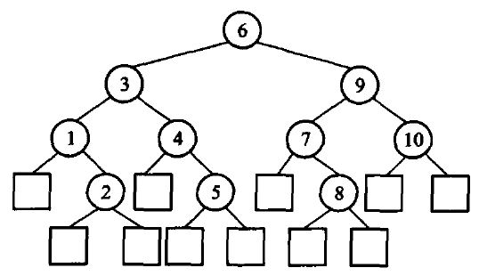
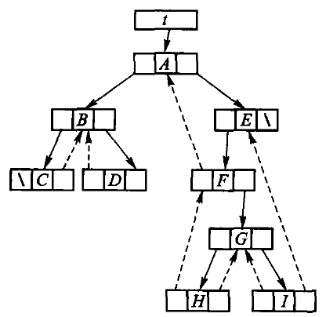
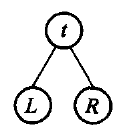
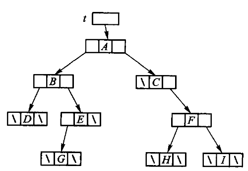
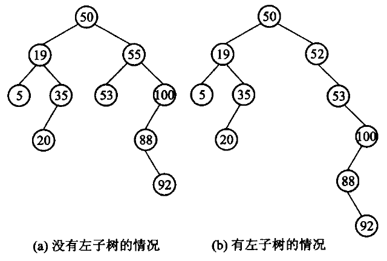
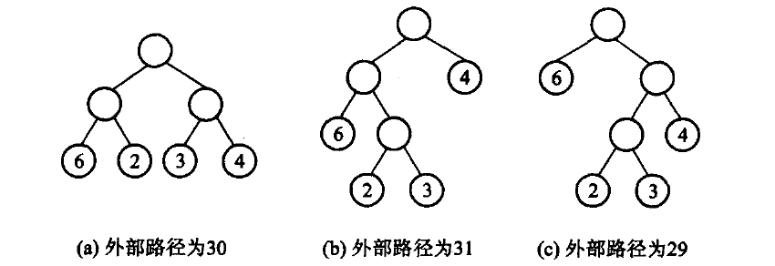
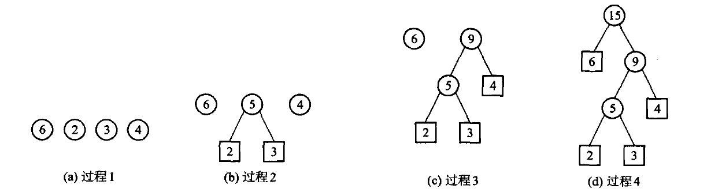
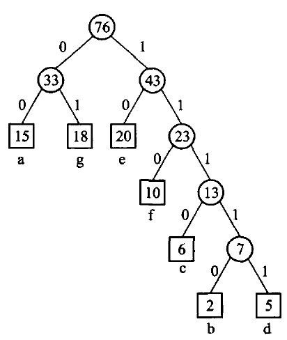
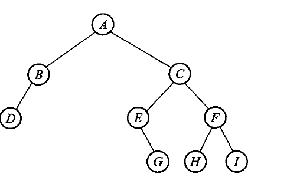
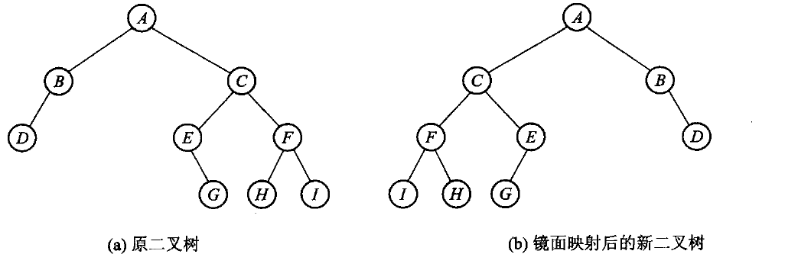

# 第5章 二叉树

二叉树的每个结点最多有左、右两个孩子。周游回答「以什么顺序访问全部结点」；二叉搜索树加上左小右大；堆把最小（或最大）值放在根；Huffman 树不断合并两个最小权值。

源码：[二叉树与二叉搜索树·教学版](../code/ch05/binary_tree/teaching.hpp)、
[二叉树与二叉搜索树·工程版](../code/ch05/binary_tree/modern.hpp)、
[最小堆与 Huffman 树·教学版](../code/ch05/heap_huffman/teaching.hpp)、
[最小堆与 Huffman 树·工程版](../code/ch05/heap_huffman/modern.hpp)、
[树的示例](../code/ch05/binary_tree/demo.cpp)、
[堆与 Huffman 的示例](../code/ch05/heap_huffman/demo.cpp)。

## 5.1 二叉树的概念

二叉树由结点的有限集合构成：或者为空，或者由一个根和两棵互不相交的左、右子树组成。左右次序不能颠倒。根没有父结点；其余每个结点恰有一个父结点，至多两个孩子。没有孩子的是叶，其余是内部结点。从根到某结点的边数是该结点的层数，根在第 0 层。

按定义展开，二叉树只有 5 种基本形态：(a) 空树；(b) 只有一个根结点；(c) 右子树为空；(d) 左子树为空；(e) 左右子树均非空。


图 5.1　二叉树的 5 种基本形态。**(c) 和 (d) 是两棵不同的二叉树**——同样是一个根加一个孩子，挂左边和挂右边不能混为一谈。第 6 章的一般树没有这个区分，这正是二叉树不是「度为 2 的树」的原因。

### 5.1.1 二叉树的定义和基本术语

**定义。** 二叉树（binary tree）由结点的有限集合构成，这个有限集合或者为空集（empty），或者为由
一个根结点（root）及两棵互不相交、分别称做这个根的左子树（left subtree）和右子树（right subtree）
的二叉树组成的集合。这个**递归定义**刻画了二叉树的固有特性：二叉树既可以是一棵空树，也可以是
由一个根结点和分别为其左子树和右子树的互不相交的二叉树组成（其左、右子树也可以为空）。

值得注意的是，**二叉树的子树有左、右之分，其次序不能颠倒**——上面图 5.1 中的 (c) 和 (d) 分别
表示两棵不同的二叉树。二叉树的结点与表的元素类似，可以表示任何一种数据类型。

**基本术语。** 二叉树是由唯一的起始结点引出的结点集合，这个起始结点称为**根**（root）。

- 二叉树中的任何非根结点都有且仅有一个前驱结点，称为该结点的**父结点**（或称双亲，parent）；
  根结点即为二叉树中唯一没有父结点的结点。
- 任何结点最多可能有两个后继结点，分别称为**左子结点**（左孩子、左子女，left child）和**右子结点**
  （右孩子、右子女，right child）。具有相同父结点的结点之间互称**兄弟结点**（sibling）。
- 一个结点的子树数目称为该结点的**度**（degree）。没有子结点的结点称为**叶结点**（leaf，也称树叶
  或终端结点），叶结点的度为 0；除叶结点以外的那些非终端结点称为**内部结点**（或分支结点，
  internal node）。
- 父结点 $k$ 与子结点 $k'$ 之间存在的一条有向连线 $\langle k, k' \rangle$ 称做**边**（edge）。
- 若二叉树中存在结点序列 $k_0, k_1, \cdots, k_s$，使得 $\langle k_0, k_1 \rangle$、
  $\langle k_1, k_2 \rangle$、$\cdots$、$\langle k_{s-1}, k_s \rangle$ 都是二叉树中的边，则称从结点
  $k_0$ 到结点 $k_s$ 存在一条**路径**（path），该路径所经历的边的个数称为这条路径的**路径长度**
  （path length）。若有一条由 $k$ 到达 $k_s$ 的路径，则称 $k$ 是 $k_s$ 的**祖先**（ancestor），
  $k_s$ 是 $k$ 的**子孙**（descendant）。
- 切断一个结点与其父结点的连接，则该结点与其子孙构成的树就称为以该结点为根的**子树**
  （subtree）。从根结点到某个结点的路径长度称为结点的**层数**（level）：根结点为第 0 层，非根
  结点的层数是其父结点的层数加 1。

除了严格区分左右子结点外，其他二叉树概念在第 6 章的一般树形结构中也适用。

下面这棵树：

```text
      A
     / \
    B   C
   / \
  D   E
```

这棵 5 个结点的小树是本章示例程序用的例子。5.2.2 讨论周游次序时会换成原书图 5.5 那棵 9 个结点的树——结点多一些，三种周游的差别才看得出来。

四种周游访问的是同一组结点，次序不同：

| 周游 | 顺序 | 本例 |
| --- | --- | --- |
| 先序 | 根，左，右 | A B D E C |
| 中序 | 左，根，右 | D B E A C |
| 后序 | 左，右，根 | D E B C A |
| 层次 | 按离根的距离 | A B C D E |

递归版最贴合定义，也是 5.2 节要教的东西。极深的退化树会耗尽调用栈：Release 档大约在百万层段错误且**没有诊断**，ASan 档会打印 `stack-overflow` 并指到具体行。数字和复现程序见仓库中的未验证风险说明。

**周游与析构在这件事上待遇不同，要分清楚：**

- **周游**保留递归为主实现——它就是本节要教的东西，抹掉递归等于抹掉课程内容。迭代版按 D-001 §3d 作为补充并列给出，读者可以对照。
- **析构 `make_empty()` 与深拷贝**改成了迭代。理由是它们**不是教学内容，却会被隐式触发**：一次普通的作用域结束、一句 `auto copy = tree;`，调用方根本看不见自己正在递归。教学价值为零，风险却实打实。

析构用的是「右旋到没有左孩子，再沿右链逐个删」的经典办法：额外空间 O(1)，不分配内存，所以能保持 `noexcept`。深拷贝用堆上的显式栈代替调用栈。改完之后，纯左链 500 万结点的析构与深拷贝都不再崩（原先分别在 100 万、50 万段错误）；测试里有一个百万深链的用例专门守着这条，改回递归它就会报 `stack-overflow`。

### 5.1.2 满二叉树、完全二叉树、扩充二叉树

任何结点或者是叶，或者左右子树都非空，叫做满二叉树（full binary tree）。深度为 $k$ 的满二叉树共有 $2^{k+1}-1$ 个结点，叶在同一层。

完全二叉树（complete binary tree）不要求每个内部结点都有两个孩子，但所有叶只出现在最下两层，且最下层的结点从左到右连续排列、没有空洞。堆正是利用这个条件按层编号存进数组：编号关系见 5.1.3。满二叉树一定完全，但完全二叉树不一定满。


图 5.2　(a) 满二叉树；(b) 完全二叉树。

把普通二叉树的每个空子树位置都补成一个“外部叶”，所得树叫扩充二叉树（extended binary tree），原来的结点叫内部结点。若原树有 $n$ 个内部结点，则扩充树有 $n+1$ 个外部叶。



图 5.3　扩充二叉树：方框是补出来的外部叶，圆圈是原有的内部结点。补完之后每个内部结点都恰好有两个孩子，所以扩充二叉树一定是满二叉树——5.6 节算带权外部路径长度时用的就是这张图的形状。设内部路径长度 $I$ 为根到所有内部结点的边数之和，外部路径长度 $E$ 为根到所有外部叶的边数之和，则

$$E=I+2n.$$

证明很直接：每个内部结点向下增加的两条分支，分别把一条路径贡献给外部叶；沿着原树的每条边，路径长度同时在内部路径和外部路径中各增加一次。等价地，对内部结点按度数计边，可得外部叶数为 $n+1$，再逐层计数即得上式。这个关系是最优二叉树和 Huffman 树计算带权路径长度的基础。

### 5.1.3 二叉树的主要性质

第 $i$ 层至多 $2^i$ 个结点；深度为 $k$ 的二叉树至多 $2^{k+1}-1$ 个结点。按层从 0 编号时，
结点 $i$ 的父是 $\lfloor(i-1)/2\rfloor$，左右孩子是 $2i+1$ 与 $2i+2$——第 5.5 节的堆全靠这一条。
$n$ 个结点的完全二叉树高度为 $\lceil\log_2(n+1)\rceil$。这些性质原书没错，原样保留。

其中三条值得单独写下来，因为后面反复要用。

**性质 3**：非空二叉树的叶结点数 $n_0$ 等于度为 2 的结点数 $n_2$ 加 1，即 $n_0 = n_2 + 1$。

> **证明.** 设结点总数 $n$、度为 1 的结点数 $n_1$，则 $n = n_0 + n_1 + n_2$。
> 换个角度数边：除根之外每个结点都恰好有一条边进入，所以边数 $e = n - 1$；
> 而这些边都是从度为 1 或 2 的结点射出的，所以 $e = n_1 + 2n_2$。
> 两式合起来得 $n_0 + n_1 + n_2 = n_1 + 2n_2 + 1$，即 $n_0 = n_2 + 1$。∎

**性质 4（满二叉树定理）**：非空满二叉树的**树叶数目等于其分支结点数加 1**。

> **证明.** 满二叉树里每个结点的度非 0 即 2，也就是 $n_1 = 0$，
> 于是分支结点就是 $n_2$，由性质 3 直接得 $n_0 = n_2 + 1$。∎

**性质 5（满二叉树定理推论）**：非空二叉树的**空子树数目等于其结点数加 1**。

> **证明.** 设二叉树为 $T$，把它所有的空子树都换成树叶，得到的扩充二叉树记为 $T'$。
> $T'$ 是满二叉树，而 $T$ 原来的每个结点在 $T'$ 里都成了分支结点。
> 由满二叉树定理，$T'$ 的树叶数 = 分支结点数 + 1 = $T$ 的结点数 + 1。
> 而每片新添的树叶恰好对应 $T$ 的一棵空子树，所以 $T$ 的空子树数目等于它的结点数加 1。∎

性质 5 不是纸面游戏：它说明**一棵 $n$ 个结点的二叉树里有 $n+1$ 个空指针**。
链式存储时这些空指针占的空间和结点本身同阶——线索二叉树、Trie 的压缩、
第 12 章 PATRICIA 的动机都从这里来。

线索二叉树（threaded binary tree）通过复用空指针保存遍历前驱或后继，适合教学和
需要低额外空间遍历的专门场景；现代通用库通常直接使用显式栈、父指针或迭代器，
因此不应把线索化当作默认的树表示。原书把它放在习题里，图是这样的：



图 5.23　中序穿线（线索）二叉树。虚线是借空指针存下的中序前驱/后继，结点里另加一位标志区分「这根指针是孩子还是线索」。有了它，中序遍历不用栈也不用递归。

## 5.2 二叉树的周游

5.1 节介绍了二叉树的逻辑结构，本节讨论二叉树的抽象数据类型和几种周游算法。

### 5.2.1 二叉树的抽象数据类型

一般情况下，需要在二叉树的各个结点中存储必要的信息，对二叉树的操作和运算也主要集中在访问
结点信息上：访问某个结点的左子结点、右子结点、父结点，或者访问结点存储的数据；从应用角度看，
有时还需要遍历二叉树的每个结点。二叉树 ADT 的基本操作因此包括建树、判空、取得根和左右子树，
以及先序、中序、后序和层次周游，在具体应用中可以此为基础进行扩充。

**为了强调抽象数据类型与存储无关，这里并不规定该 ADT 的存储方式**——二叉树结点的各种存储
方式在 5.3 节讨论，本节先从调用方观察这些操作。（原书【代码5.1】【代码5.2】分别给出二叉树
结点类和二叉树类，并把二叉树类声明为结点类的**友元类**，以便访问结点的私有成员。本书改用
另一种做法：结点是二叉树内部的实现细节，对外只暴露一组访问器，因此不需要友元声明。）

所谓二叉树的**周游**（或称遍历，traversal）是指按照一定顺序依次访问树中所有的结点，并使得每个
结点仅被访问一次。这里所说的「访问」是指**操作**，可以理解成对结点数据成员的处理，例如输出、
修改结点的信息等。

对于线性结构来说周游是一个很容易的问题；但二叉树是一种非线性结构，每个结点可以有一个以上
的直接后继，因此需要把二叉树中的结点转化为顺序结构才能周游整棵树。**周游一棵二叉树的过程，
实际上就是把二叉树的结点放入一个线性序列的过程，即对二叉树进行线性化。** 下面介绍两类周游
方法：深度优先周游和广度优先周游。

#### 先跑一遍

先建树并打印四种周游，再插一棵 BST：

```cpp file=code/ch05/binary_tree/demo.cpp
// 第 5 章「先跑一遍」：用教学版 BinaryTree 与 BinarySearchTree 走一遍四种周游与增删查。
// 编译运行：
//   g++ -std=c++17 -I code/ch05/binary_tree code/ch05/binary_tree/demo.cpp -o demo && ./demo
#include "teaching.hpp"

#include <iostream>

int main() {
    // 建一棵样例树：A 的左孩子 B（孩子 D、E），右孩子 C（叶子）
    BinaryTree<char> d, e, b, c, root;
    d.create_leaf('D');
    e.create_leaf('E');
    b.create_tree('B', d, e);      // d、e 的所有权转移给 b，之后两者变空
    c.create_leaf('C');
    root.create_tree('A', b, c);

    std::cout << "先序: ";
    root.preorder([](char value) { std::cout << value; });
    std::cout << "\n中序: ";
    root.inorder([](char value) { std::cout << value; });
    std::cout << "\n后序: ";
    root.postorder([](char value) { std::cout << value; });
    std::cout << "\n层次: ";
    root.level_order([](char value) { std::cout << value; });
    std::cout << '\n';

    BinarySearchTree<int> tree;
    for (int key : {8, 3, 10, 1, 6, 14, 4, 7}) {
        (void)tree.insert(key);
    }
    std::cout << "BST 中序:";
    tree.inorder([](int key) { std::cout << ' ' << key; });   // 中序 = 升序
    std::cout << "\n含 6? " << (tree.contains(6) ? "是" : "否")
              << "  删 3 后含 3? ";
    (void)tree.remove(3);
    std::cout << (tree.contains(3) ? "是" : "否") << '\n';
}
```

```bash
c++ -std=c++17 -Wall -Wextra -Werror -Icode/ch05/binary_tree \
    code/ch05/binary_tree/demo.cpp -o /tmp/tree-demo
/tmp/tree-demo
```

```console
先序: ABDEC
中序: DBEAC
后序: DEBCA
层次: ABCDE
BST 中序: 1 3 4 6 7 8 10 14
含 6? 是  删 3 后含 3? 否
```

`create_tree(value, left, right)` 接管两棵子树。参数是右值，表示所有权被移走；`left_leaf` 在 `std::move` 之后变空，不会和 `left` 抢着析构同一结点。

### 5.2.2 深度优先周游二叉树

二叉树的逻辑结构只有三个基本单元：根结点、左子树、右子树。



图 5.4　二叉树的基本结构。周游一棵树就是安排这三件事的先后：记访问当前结点为 $t$、周游左子树为 $L$、周游右子树为 $R$，六种排列里约定「先左后右」，剩下的就是前序 $tLR$、中序 $LtR$、后序 $LRt$ 三种。

深度优先周游的思路是尽量往深处走：沿左链一路下降，遇到左子树为空就退回最近的、右子树尚未访问的分支结点，转向它的右孩子，再继续尽量往左。重复到没有结点可退为止，每个结点恰好被访问一次。

周游一棵二叉树就是做三件事：访问当前结点（记作 t）、周游左子树（L）、周游右子树（R）。三件事共有 6 种排列，习惯上总是先左后右，于是只剩三种——就是本节的三种深度优先周游：

| 次序 | 名字 | 递归定义 |
| --- | --- | --- |
| tLR | 前序（preorder） | 访问根 → 前序周游左子树 → 前序周游右子树 |
| LtR | 中序（inorder） | 中序周游左子树 → 访问根 → 中序周游右子树 |
| LRt | 后序（postorder） | 后序周游左子树 → 后序周游右子树 → 访问根 |


前序（中序、后序）周游二叉树得到二叉树结点的一个有序序列，称为二叉树的前序（中序、后序）
**序列**。对于图 5.5 所示的二叉树：

| 周游 | 序列 |
| --- | --- |
| 前序 $tLR$ | `A B D E G C F H I` |
| 中序 $LtR$ | `D B G E A C H F I` |
| 后序 $LRt$ | `D G E B H I F C A` |

二叉树这种非线性结构经过周游转化成线性序列，从而**可以指定某种周游次序下某结点的前驱和后继
结点**。以结点 $E$ 为例：在前序序列中它的前驱是 $D$、后继是 $G$；中序序列中 $E$ 的前驱是 $G$、
后继是 $A$；后序序列中 $E$ 的前驱是 $G$、后继是 $B$。同一个结点，在三种线性化下有三组不同的
邻居——这正是「周游次序」这件事本身的意义。

对图 5.5 这棵树，三种周游给出三个不同的序列：

| 周游 | 序列 |
| --- | --- |
| 前序 | A B D E G C F H I |
| 中序 | D B G E A C H F I |
| 后序 | D G E B H I F C A |

周游把非线性的树摊成一个线性序列，「前驱」「后继」这类本属于线性结构的说法，对树才有了意义——但它取决于用的是哪一种周游。结点 E 在前序序列里的前驱是 D、后继是 G；在中序序列里前驱是 G、后继是 A；在后序序列里前驱是 G、后继是 B。同一个结点，换一种次序就换一批邻居。

原书【算法5.3】把三种周游写成三个递归函数，与存储结构无关。教学版照搬这个结构（完整实现见 5.3）：

```cpp file=code/ch05/binary_tree/teaching.hpp#fn:BinaryTree::preorder_impl
template <typename Visitor>
static void preorder_impl(const Node* node, Visitor& visit) {
    if (node == nullptr) return;
    visit(node->value);                 // 根
    preorder_impl(node->left, visit);   // 左
    preorder_impl(node->right, visit);  // 右
}
```

```cpp file=code/ch05/binary_tree/teaching.hpp#fn:BinaryTree::inorder_impl
template <typename Visitor>
static void inorder_impl(const Node* node, Visitor& visit) {
    if (node == nullptr) return;
    inorder_impl(node->left, visit);    // 左
    visit(node->value);                 // 根
    inorder_impl(node->right, visit);   // 右
}
```

```cpp file=code/ch05/binary_tree/teaching.hpp#fn:BinaryTree::postorder_impl
template <typename Visitor>
static void postorder_impl(const Node* node, Visitor& visit) {
    if (node == nullptr) return;
    postorder_impl(node->left, visit);  // 左
    postorder_impl(node->right, visit); // 右
    visit(node->value);                 // 根
}
```

三个函数的形状完全一样，只差 `visit` 那一行放在哪里。**递归在这一章的价值就在这里：代码的形状和定义的形状能一眼对上。** 读的时候要把「访问」和「走进去」分清楚——`visit(node->value)` 是访问，`preorder_impl(node->left, visit)` 是走进去；报错的序列多半来自把这两件事混为一谈。

每个结点进出各一次，三种周游的时间代价都是 $O(n)$。空间代价是递归深度，等于树高：平衡时约 $\log_2 n$，退化成一条链时是 $n$，5.1.1 说的「压穿运行栈」就是这种树。工程版另给了三个用手写链式栈显式模拟调用栈的迭代版（`preorder_iterative`、`inorder_iterative`、`postorder_iterative`），按 D-001 §3d 只作补充，不替换递归主实现，见 5.6a。

#### 表达式树：周游的一个用途

三种周游次序不是三种口味，它们各自对应一种实用的表达式写法。图 5.6 是表达式 $A + B \times (C + D)$ 的二叉树表示：运算符落在内部结点，运算对象落在叶结点，括号一个都不出现——树的形状已经把运算次序记下来了。


| 周游 | 得到 | 本例 |
| --- | --- | --- |
| 前序 | **前缀**表达式（波兰式） | `+ A × B + C D` |
| 中序 | 中缀表达式（缺括号） | `A + B × C + D` |
| 后序 | **后缀**表达式（逆波兰式） | `A B C D + × +` |

中序那一行值得多看一眼：它和原式长得像，但**括号丢了**，照它算出来的是 $A + B \times C + D$，已经不是原来的表达式。要印回可读的中缀式，必须在周游时按优先级补括号。前缀式和后缀式不需要括号——运算符出现的位置本身就定死了运算次序。

第 3.1.4 节那个后缀表达式求值器（原书【算法3.5】）吃的正是这棵树后序周游的结果；那一节把中缀式转成后缀式的工作，换个说法就是「建出这棵表达式树，再后序周游一遍」。本章上机题第 5 题（原书第 2 题）「表达式二叉树」要做的就是这件事：读入一种表达式，在机内建出这棵树，再按要求输出另外两种。

### 5.2.3 广度优先周游二叉树

**先把三种深度优先周游的代价算清楚。** 不管采用哪种周游方式，对于有 $n$ 个结点的二叉树，
周游完树的所有元素都需要 $O(n)$ 时间——只要对每个结点的处理（`Visit` 的执行）时间是一个常数，
周游二叉树就可以在线性时间内完成。所需要的**辅助空间为周游过程中栈的最大容量，即树的高度**；
最坏情况下（每个结点只有一个孩子的「藤」），具有 $n$ 个结点的二叉树高度为 $n$，所需空间复杂度
为 $O(n)$。写成递归时这个栈就是运行栈，因此那句「树退化成藤会爆栈」不是危言耸听——
本书 README 的「闸门证明不了什么」一节量过这个边界。

深度优先是尽量往深走，广度优先是一层一层走：首先访问第 0 层（即根结点所在的层），然后从左到右
依次访问第 1 层的两个结点，依次类推——当第 $i$ 层的所有结点访问完之后，再从左至右依次访问
第 $i+1$ 层的各个结点。对图 5.5 那棵树，结果是 A B C D E F G H I。

深度优先靠**栈**（写成递归时就是运行栈），广度优先靠**队列**：

```text
把根入队
只要队列非空:
    出队一个结点, 访问它
    它的左孩子入队
    它的右孩子入队
```

上层结点总是比下层结点先入队，队列又先进先出，于是出队次序自然就是逐层从左到右。

**为什么不能像前三种那样写成递归？** 递归的形状天生是深度优先的：一层调用只能带着「当前子树」往下走，而层次周游要在兄弟子树之间横向跳——第 2 层的最后一个结点和第 3 层的第一个结点常常分属不同的子树。这个跨子树的次序只能由一个显式的队列记住，递归的调用栈替不了它。

原书【算法5.7】在这里直接用了 `std::queue`。教学版改成在 `level_order` 里现写一条极简的链式 FIFO：本节要教的就是「队列在这里起了什么作用」，一行 `std::queue<Node*>` 会把它藏起来。队列本身第 3.2 节已经讲过，这里只是用它。

```cpp file=code/ch05/binary_tree/teaching.hpp#fn:BinaryTree::level_order
// 【算法5.7】层次周游：一层一层从左到右。
// 深度优先靠栈（这里是递归用的运行栈），广度优先靠**队列**。
template <typename Visitor>
void level_order(Visitor visit) const {
    // 一条极简的链式队列，只在这个函数里用
    struct Pending {
        const Node* node;
        Pending* next;
    };
    Pending* front = nullptr;
    Pending* rear = nullptr;

    if (root_ != nullptr) {
        front = rear = new Pending{root_, nullptr};
    }
    while (front != nullptr) {
        Pending* item = front;               // 出队
        front = front->next;
        if (front == nullptr) {
            rear = nullptr;
        }
        const Node* node = item->node;
        delete item;

        visit(node->value);

        if (node->left != nullptr) {         // 左右孩子依次入队
            Pending* fresh = new Pending{node->left, nullptr};
            if (rear == nullptr) { front = rear = fresh; } else { rear->next = fresh; rear = fresh; }
        }
        if (node->right != nullptr) {
            Pending* fresh = new Pending{node->right, nullptr};
            if (rear == nullptr) { front = rear = fresh; } else { rear->next = fresh; rear = fresh; }
        }
    }
}
```

每个结点入队、出队各一次，时间同样是 $O(n)$。空间由结点最多的那一层决定：最坏是满的完全二叉树，队列最长时装着最下面一整层，约 $(n+1)/2$ 个结点。这与深度优先的空间代价（正比于树高）正好互补——树越平衡，深度优先越省；树越接近一条链，广度优先越省。

## 5.3 二叉树的存储结构

### 为什么这一节没有 Python 版

本节讲的是结点的动态存储和树的所有权：析构要遍历并释放每个结点，拷贝要深复制，移动要转移根指针，还要考虑递归实现的栈边界。Python 的对象引用和垃圾回收不会给出 C++ 五法则或强异常保证的对应练习；用嵌套 `list` 表示树更会把结点布局抹掉。因此这里的教学实现只提供 C++，算法层的周游和搜索才适合做双语言对照。

前面几节讨论的二叉树逻辑结构和抽象数据类型，都**不依赖于二叉树的物理存储方式**。二叉树的存储
实现方法有多种：既可以用链接存储结构实现，又可以用顺序存储结构实现；这些方法各有其特点和
适用范围，在应用中要根据情况决定采用哪种。

**链式存储**把二叉树的各结点随机地存储在内存空间，结点之间的关系用指针表示。由二叉树的定义
可知，每一个结点由一个数据元素和指向其左右子树的分支组成，所以表示二叉树的链表结点包含
3 个域：数据域和左、右指针域——用 `info` 域存储结点的数据元素，另外再设置两个指针域 `left`
和 `right`，分别指向结点的左子结点和右子结点；当结点的某个子结点为空时，相应的指针为空指针。


图 5.7　二叉树结点的两种存储结构：(a) 数据域 + 左右指针，用它得到的是**二叉链表**（也叫 left-right 存储法）；(b) 再加一根指向父结点的 `parent`，得到的是**三叉链表**。二叉链表里找父结点得从根重新走一趟，三叉链表顺着 `parent` 一步就到——多一根指针买到的就是这件事。



图 5.8　图 5.5 那棵树的二叉链表存储结构。数一数图里的空指针：$n$ 个结点的二叉链表恰有 $n+1$ 个空链域（5.1.3 的性质 5），线索二叉树就是把它们利用起来。

本章的教学版用的正是二叉链表。`create_tree` 先 `new` 出新根，再把两棵子树的根指针挪过来，最后才清空自己原来的树。这样即使 `new` 抛异常，调用方的两棵子树也不动。

**顺序存储**是指按照一定次序，用一组地址连续的存储单元存储二叉树上的各个结点元素。由于二叉树
是一种非线性结构，因此必须将结点排成一个线性序列，使得通过结点在这个序列中的相对位置就能
确定结点之间的逻辑关系；**但通常情况下，只通过相应位置不足以刻画整个树形结构**。

而对于一棵具有 $n$ 个结点的**完全二叉树**，可以从根结点起自上而下、从左至右地把所有结点编号，
得到一个足以反映整个二叉树结构的线性序列——采用这种方式，线性序列里存储的结点就是按照层次
周游二叉树得到的排列。按层次顺序把结点从 $0$ 到 $n-1$ 编号，编号 $i$ 的结点就放在数组下标 $i$。


图 5.9　完全二叉树的结点编号。

| 下标 | 0 | 1 | 2 | 3 | 4 | 5 | 6 | 7 | 8 | 9 | 10 | 11 |
| --- | --- | --- | --- | --- | --- | --- | --- | --- | --- | --- | --- | --- |
| 元素 | A | B | C | D | E | F | G | H | I | J | K | L |

图 5.10　图 5.9 的顺序存储结构。结点间的关系不再靠指针，而是**隐含在下标里**：下标 $i$ 的左右孩子是 $2i+1$ 和 $2i+2$，父结点是 $\lfloor (i-1)/2 \rfloor$——正是 5.1.3 的性质。一个指针都不用存，这是完全二叉树最省空间的存法；5.5 节的堆和 8.3.2 节的堆排序都用它。**但它只对完全二叉树划算**：树一旦有空洞，数组里就要留出同样多的空位。

第 6 章会介绍一般情况下树的顺序存储；由于二叉树与树能够进行等价转换，因此一般情况下的二叉树
也可以采用类似的顺序存储结构方法。

**在不同的存储结构中，不仅空间开销有差异，实现二叉树操作的方法也不同。** 因此在具体应用中
采取什么存储结构，除了根据二叉树的形态之外，还应该考虑时间、空间复杂度和算法的简洁性。

#### 教学版：完整实现

下面是一份**完整的、能直接编译运行的**二叉树与二叉搜索树。一个文件、两个类。
**递归是这一章的正题**，所以周游、释放、深拷贝这里全部写成递归——
形状和定义一样，一眼就能对上。5.4a 会说明递归的代价与工程版的处理。

```cpp file=code/ch05/binary_tree/teaching.hpp
// 二叉树与二叉搜索树 —— 教学版。
// 原书【代码5.1】【代码5.2】【算法5.3】【算法5.7】【算法5.9】【算法5.10】。
//
// 一个文件、两个类、能直接编译运行，给「第一次读这一节」的人看。
//
//   BinaryTree         二叉链表：一个结点，两根指向孩子的链接；深度优先与层次周游。
//   BinarySearchTree   在二叉树上加一条「左小右大」的约束，于是查找变成一路往下走。
//
// **递归是这一章的正题**，所以周游、释放、深拷贝这里全部写成递归——形状和定义一样，
// 一眼就能对上。代价是递归深度等于树高：退化成一条链的树（比如按升序插入 BST）
// 会把运行栈压穿。工程版把释放和深拷贝改成了迭代，见 5.x「进阶（选读）」。
//
// 与 modern.hpp（工程版）的分工：
//   教学版  三法则 + 全递归；
//   工程版  五法则、迭代释放（右旋拉直）、迭代深拷贝、强异常保证、非递归周游。
#pragma once

#include <cstddef>

// ---------------------------------------------------------------------------
// 二叉树（二叉链表）
// ---------------------------------------------------------------------------
template <typename T>
class BinaryTree {
public:
    // 【代码5.1】二叉树结点：一个数据域 + 左右两根链接。
    // 没有孩子就是 nullptr——这比原书用一个"空结点"表示要省事得多。
    struct Node {
        T value;
        Node* left;
        Node* right;
    };

    BinaryTree() : root_(nullptr) {}

    ~BinaryTree() { clear(); }

    // 三法则：树管着一堆 new 出来的结点，拷贝必须自己写（而且必须是**深**拷贝）。
    BinaryTree(const BinaryTree& other) : root_(clone(other.root_)) {}

    BinaryTree& operator=(const BinaryTree& other) {
        if (this == &other) {
            return *this;
        }
        Node* fresh = clone(other.root_);   // 先把新树建好
        clear();                            // 再拆掉旧树
        root_ = fresh;
        return *this;
    }

    bool empty() const { return root_ == nullptr; }
    const Node* root() const { return root_; }
    Node* root() { return root_; }

    // 造一棵新树：一个根，接上左右两棵子树。
    // 两棵子树的所有权**转移**给新树——传进来的那两棵随即变空，
    // 否则同一批结点会被两棵树各删一次。
    void create_tree(const T& value, BinaryTree& left, BinaryTree& right) {
        Node* fresh = new Node{value, left.root_, right.root_};
        left.root_ = nullptr;
        right.root_ = nullptr;
        clear();
        root_ = fresh;
    }

    void create_leaf(const T& value) {
        Node* fresh = new Node{value, nullptr, nullptr};
        clear();
        root_ = fresh;
    }

    // 【算法5.3】深度优先周游的三种次序。三个函数只差 visit 那一行的位置：
    //   前序 根左右 · 中序 左根右 · 后序 左右根
    template <typename Visitor>
    void preorder(Visitor visit) const { preorder_impl(root_, visit); }

    template <typename Visitor>
    void inorder(Visitor visit) const { inorder_impl(root_, visit); }

    template <typename Visitor>
    void postorder(Visitor visit) const { postorder_impl(root_, visit); }

    // 【算法5.7】层次周游：一层一层从左到右。
    // 深度优先靠栈（这里是递归用的运行栈），广度优先靠**队列**。
    template <typename Visitor>
    void level_order(Visitor visit) const {
        // 一条极简的链式队列，只在这个函数里用
        struct Pending {
            const Node* node;
            Pending* next;
        };
        Pending* front = nullptr;
        Pending* rear = nullptr;

        if (root_ != nullptr) {
            front = rear = new Pending{root_, nullptr};
        }
        while (front != nullptr) {
            Pending* item = front;               // 出队
            front = front->next;
            if (front == nullptr) {
                rear = nullptr;
            }
            const Node* node = item->node;
            delete item;

            visit(node->value);

            if (node->left != nullptr) {         // 左右孩子依次入队
                Pending* fresh = new Pending{node->left, nullptr};
                if (rear == nullptr) { front = rear = fresh; } else { rear->next = fresh; rear = fresh; }
            }
            if (node->right != nullptr) {
                Pending* fresh = new Pending{node->right, nullptr};
                if (rear == nullptr) { front = rear = fresh; } else { rear->next = fresh; rear = fresh; }
            }
        }
    }

    // 结点数与高度：两个最典型的「先算孩子、再算自己」的递归。
    std::size_t size() const { return count(root_); }
    std::size_t height() const { return depth(root_); }

    void clear() {
        destroy(root_);
        root_ = nullptr;
    }

private:
    // 【代码5.8】后序释放：**必须先删两个孩子，再删自己**。
    // 反过来先 delete node，node->left 就成了读已释放内存。
    static void destroy(Node* node) {
        if (node == nullptr) {
            return;
        }
        destroy(node->left);
        destroy(node->right);
        delete node;
    }

    // 深拷贝：形状和 destroy 一样，只是把"删"换成"建"。
    static Node* clone(const Node* node) {
        if (node == nullptr) {
            return nullptr;
        }
        return new Node{node->value, clone(node->left), clone(node->right)};
    }

    template <typename Visitor>
    static void preorder_impl(const Node* node, Visitor& visit) {
        if (node == nullptr) return;
        visit(node->value);                 // 根
        preorder_impl(node->left, visit);   // 左
        preorder_impl(node->right, visit);  // 右
    }

    template <typename Visitor>
    static void inorder_impl(const Node* node, Visitor& visit) {
        if (node == nullptr) return;
        inorder_impl(node->left, visit);    // 左
        visit(node->value);                 // 根
        inorder_impl(node->right, visit);   // 右
    }

    template <typename Visitor>
    static void postorder_impl(const Node* node, Visitor& visit) {
        if (node == nullptr) return;
        postorder_impl(node->left, visit);  // 左
        postorder_impl(node->right, visit); // 右
        visit(node->value);                 // 根
    }

    static std::size_t count(const Node* node) {
        return node == nullptr ? 0 : 1 + count(node->left) + count(node->right);
    }

    static std::size_t depth(const Node* node) {
        if (node == nullptr) return 0;
        std::size_t l = depth(node->left);
        std::size_t r = depth(node->right);
        return 1 + (l > r ? l : r);
    }

    Node* root_;
};

// ---------------------------------------------------------------------------
// 二叉搜索树
//
// 约束只有一条：**左子树的键都小于根，右子树的键都大于根**。
// 有了它，查找就不必遍历全树——每比较一次就砍掉一半（前提是树是平衡的）。
// ---------------------------------------------------------------------------
template <typename T>
class BinarySearchTree {
public:
    struct Node {
        T value;
        Node* left;
        Node* right;
    };

    BinarySearchTree() : root_(nullptr) {}

    ~BinarySearchTree() { clear(); }

    BinarySearchTree(const BinarySearchTree& other) : root_(clone(other.root_)) {}

    BinarySearchTree& operator=(const BinarySearchTree& other) {
        if (this == &other) {
            return *this;
        }
        Node* fresh = clone(other.root_);
        clear();
        root_ = fresh;
        return *this;
    }

    bool empty() const { return root_ == nullptr; }

    // 【算法5.9】插入。一路比较着往下走，走到空位就把新结点挂上去。
    // 键已存在时返回 false——重复键是可预期状态，不是错误，所以不抛异常。
    bool insert(const T& value) {
        Node** link = &root_;               // 指向「新结点该挂在哪根指针上」
        while (*link != nullptr) {
            if (value < (*link)->value) {
                link = &(*link)->left;
            } else if ((*link)->value < value) {
                link = &(*link)->right;
            } else {
                return false;               // 已经有了
            }
        }
        *link = new Node{value, nullptr, nullptr};
        return true;
    }

    // 查找：同样一路往下走。树高是 h，代价就是 O(h)。
    bool contains(const T& value) const {
        const Node* current = root_;
        while (current != nullptr) {
            if (value < current->value) {
                current = current->left;
            } else if (current->value < value) {
                current = current->right;
            } else {
                return true;
            }
        }
        return false;
    }

    // 【算法5.10】删除。键不存在返回 false（幂等，不是错误）。
    //
    // 难点只有一个：被删结点有两个孩子时，谁来顶替它？
    // 答案是**中序前驱**——左子树里最大的那个。它顶上来之后，
    // 「左小右大」仍然成立，因为它比左子树其余的都大、比右子树全部都小。
    bool remove(const T& value) { return remove_impl(root_, value); }

    void clear() {
        destroy(root_);
        root_ = nullptr;
    }

    // 中序周游一棵 BST，得到的正是**升序**——这是「左小右大」的直接推论。
    template <typename Visitor>
    void inorder(Visitor visit) const { inorder_impl(root_, visit); }

private:
    static bool remove_impl(Node*& link, const T& value) {
        if (link == nullptr) {
            return false;
        }
        if (value < link->value) {
            return remove_impl(link->left, value);
        }
        if (link->value < value) {
            return remove_impl(link->right, value);
        }

        Node* removed = link;
        if (removed->left == nullptr) {          // 没有左孩子：右孩子直接顶上
            link = removed->right;
            delete removed;
            return true;
        }

        // 找中序前驱：从左孩子出发，一路向右走到底
        Node** predecessor_link = &removed->left;
        while ((*predecessor_link)->right != nullptr) {
            predecessor_link = &(*predecessor_link)->right;
        }
        Node* replacement = *predecessor_link;
        *predecessor_link = replacement->left;   // 前驱可能还有左孩子，先接走
        replacement->left = removed->left;
        replacement->right = removed->right;
        link = replacement;
        delete removed;
        return true;
    }

    static void destroy(Node* node) {
        if (node == nullptr) return;
        destroy(node->left);
        destroy(node->right);
        delete node;
    }

    static Node* clone(const Node* node) {
        if (node == nullptr) return nullptr;
        return new Node{node->value, clone(node->left), clone(node->right)};
    }

    template <typename Visitor>
    static void inorder_impl(const Node* node, Visitor& visit) {
        if (node == nullptr) return;
        inorder_impl(node->left, visit);
        visit(node->value);
        inorder_impl(node->right, visit);
    }

    Node* root_;
};
```


## 5.4 二叉搜索树

### 为什么这一节没有 Python 版

二叉搜索树的查找算法可以用 Python 讲，但本章这一实现还要展示结点的拥有关系、删除时子树指针的转移、深拷贝和析构。Python 容器会替我们保管这些资源，无法让读者观察“删除一个结点后谁负责释放它”或强异常保证如何维持，所以存储实现不另写 Python 包装。

在实际应用中，经常会碰到这样的操作：在一组记录中检索一个记录，向其中插入一个记录，或者删除
一个记录。对于一个**无序线性表**，插入记录时只需要把该记录放在表的末端，但在表中查找一个特定
记录的检索时间却相对较慢；对于**有序线性表**，如果用二分查找法检索特定的记录，检索效率较高，
但是遇到动态增减变化的情况（如插入或删除一个元素）时需要移动大量的元素。很多应用都需要一种
**插入、删除和检索记录效率都较高**的数据组织方法——二叉搜索树（binary search tree，BST，也称
二叉排序树、二叉查找树）就是这样一种高效的数据结构。

二叉搜索树是一类满足以下属性的特殊二叉树：树中的每个非空结点表示一个记录；若某结点左子树
不为空，则**左子树上所有结点的值均小于该结点的关键码值**；若其右子树不为空，则**右子树上所有
结点的值均大于该结点的关键码值**。二叉搜索树可以是一棵空树，且**任何结点的左右子树都是二叉
搜索树**。按照中序周游整个二叉树，可得到一个由小到大的有序排列；这个定义也表明**树中各结点的
关键码必须是唯一的**。原书用关键码集合 $K=\{50,19,35,55,20,5,100,52,88,53,92\}$ 建的树是这样的：


图 5.11　二叉搜索树。检索 `key` 时把它与根比较：小于就只找左子树，大于就只找右子树，每一步都能扔掉一整棵子树——这就是它比无序线性表快的原因。走到空子树还没找到，就说明 `key` 不在树里。

**插入**要先运用检索方法，查找待插入关键码是否在树中：如果存在则不允许插入重复关键码；如果
直到找到叶结点还没有发现重复关键码，则把新结点插入到待插入方向作为新的叶结点。它**不像在
有序线性表中插入元素那样要移动大量的数据**，只需改动某个结点的空指针；与查找一样，插入一个
新结点的时间复杂度是根到插入位置的路径长度，因此**在树形比较平衡时二叉搜索树的效率相当高**。
对于给定的关键码集合，可以从一棵空的二叉搜索树开始，按照检索路径逐个插入到相应的叶结点位置，
从而动态生成二叉搜索树。

**删除比较复杂**：要保持二叉搜索树的性质，就不能在树中留下一个空位置，因此需要用另一个结点来
填充这个位置并且保持性质。插入重复键、删除不存在的键都是可预期状态，返回 `false`，不抛异常。
删除有左右孩子的结点时，用左子树里最右的前驱替换它：先把前驱从原位置摘下，再让它继承被删
结点的两棵子树，最后只 `delete` 被删结点一次。漏掉「先脱离原父」会形成环或二次释放。

二叉搜索树的实现就在上面那份教学版清单里的 `BinarySearchTree`。三处值得停一下：

- **插入用的是「指向指针的指针」** `Node** link`。它指向「新结点该挂在哪根指针上」，
  于是「挂到根」和「挂到某个孩子」写成同一句 `*link = new Node{...}`，
  空树不必另开一个分支。
- **删除有两个孩子的结点时，用左子树里最右的那个（中序前驱）顶替。**
  它比左子树其余的都大、比右子树全部都小，顶上来之后「左小右大」仍然成立。
- **前驱自己可能还有一个左孩子**，顶替之前必须先把它接走
  （`*predecessor_link = replacement->left;`）。漏了这一句，树上会出现环——
  教学版的测试专门搭了一棵这样的树，去掉那句，中序周游立刻无限递归、ASan 报栈溢出。

删除分几种情形，原书的图把它们摆开了：



图 5.12　二叉搜索树的删除：(a) 被删结点没有左子树时，直接让右子树顶上；(b) 有左子树时，要先找一个合适的结点来顶替，不能一删了之。

**原书在这里给了两个算法，本书实现的是后一个。** 基本方案（原书【算法5.9】）是：若被删结点
`pointer` 有左子树，就在左子树里找到按中序周游的最后一个结点 `temppointer`，把 `temppointer`
的右指针置成指向 `pointer` 右子树的根，然后用 `pointer` 左子树的根代替被删结点。它是对的，
但从图 5.12(b) 可以看到，**把 `pointer` 的右子树整个下降为 `temppointer` 的右子树后，树的高度
可能会增加**——删了一个结点，树反而更瘦长了。

改进方案（原书【算法5.10】）换一个顺序：若 `pointer` 有左子树，先在左子树中找到中序周游的
最后一个结点 `temppointer`（即左子树中的最大结点），**并将其从二叉搜索树中删除**；由于
`temppointer` 没有右子树，删除它只需用它的左子树代替它；然后用 `temppointer` 结点代替待删除
的结点 `pointer`。这样接上去的是同一层的邻居，高度不会凭空长高。上面教学版实现里那三句
`*predecessor_link = replacement->left;` / `replacement->left = ...` / `replacement->right = ...`，
逐句对应的就是这个改进方案。


图 5.13　改进的删除办法：用左子树里最右的那个结点（中序前驱）顶替被删结点。它比左子树其余全部都大、比右子树全部都小，顶上来之后「左小右大」原封不动，树也不会因为整棵子树搬家而变高。


## 5.5 堆与优先队列

### 为什么这一节没有 Python 版

这里的教学版堆把完全二叉树直接放进自有数组，并明确处理扩容、元素移动和对象销毁；优先队列则依赖这份存储不变量。Python `heapq` 一行就替代了整节，Python `list` 也不会呈现五法则与异常安全。为了不把存储课伪装成算法调用，本节保留 C++ 教学实现；算法侧的排序和动态规划另有 Python 双实现。

在现实应用中，经常会遇到频繁地在一组对象中查找最大值或最小值的情况。为了达到这个目的，可以
每次都先排序，然后从已排序的序列中找到其最大值或最小值——这种方法虽然可行，但时间开销比较
大。有没有一种结构能为这类特殊应用提供较高的效率？这就是**堆**。堆可分为最小堆和最大堆，本节
主要讨论最小堆，最大堆具有类似的性质。

**最小堆**（min-heap，最小值堆）是关键码序列 $\{K_0, K_1, \cdots, K_{n-1}\}$，它具有如下特性：

$$K_i \le K_{2i+1}, \quad K_i \le K_{2i+2} \quad (i = 0, 1, \cdots, \lfloor n/2 \rfloor - 1)$$

从逻辑的角度来讲，堆是一种树形结构，而且是一种**特殊的完全二叉树**：此完全二叉树的每个结点
对应于序列中的一个关键码，根结点对应于 $K_0$，按层次从左至右依次类推。说其特殊，主要是因为
**堆序只是局部有序**——最小堆对应的完全二叉树中所有内部结点的值均不大于其左右子结点的关键
码值，且一个结点与其兄弟之间没有必然的联系。最小堆不像二叉搜索树那样实现了关键码的完全排序；
相比较而言，只有当结点之间是父子关系时，才可以确定这两个结点关键码的大小关系。

根据最小堆的定义，堆对应的完全二叉树的根结点具有最小关键码值，即堆所对应序列的第一个元素
具有最小值。5.3 节已经介绍过用顺序存储结构实现完全二叉树的有效方法（原书 5.3.2 节），因此可以把最小堆的
关键码存储在一维数组中：只需要计算简单的代数表达式，就能非常容易地查找某个结点的父结点和
子结点（下标 `i` 的孩子是 `2i+1` 和 `2i+2`），**既避免了使用指针来保持结构，又能有效地执行相应
操作**。当然，由于顺序存储的空间分配要求，必须预先知道堆的大小（本书的实现按需扩容）。
`sift_down` 必须比较左右两个孩子。空堆上 `remove_min()` 返回 `nullopt`。

**插入与删除。** 插入时新添的元素加入末尾；为了保持最小堆的性质，需要沿着其祖先的路径，自下
而上依次比较和交换该结点与父结点的位置，直到重新满足堆的性质为止。这样做会出现两种情况：
要么新结点升到最小堆的顶端，要么到某一位置时发现父结点比新插入的结点关键码值小。这个自下
而上逐渐上升、最后停在满足最小堆性质的位置的过程，通常被称为「**筛选**」。删除操作的处理与
插入时方向相反：删除某个位置的元素后形成了一个空位置，首先把最末端的结点填入这个位置；同理，
这样做也可能导致破坏堆序特性，末端元素需要与被删位置的子结点比较交换，直到过滤到该结点小于
最小子结点的正确位置为止。

**建堆。** 把所有关键码放到一维数组中，此时形成的完全二叉树并不具备最小堆的特性，但是**仅包含
叶子结点的子树已经是堆**——在有 $n$ 个结点的完全二叉树中，当 $i > \lfloor n/2 \rfloor - 1$ 时，以
关键码 $K_i$ 为根的子树已经是堆。这时，从含有内部结点数最少的子树（这种子树在完全二叉树的
倒数第二层，此时 $i = \lfloor n/2 \rfloor - 1$）开始，从右至左依次进行调整；对这一层调整完成之后，
继续对上一层进行同样的工作，直到整个过程到达树根时，整棵完全二叉树就成为一个堆。

对当前结点 $K_i$，调整过程是从 $K_i$ 开始向下筛选的过程：如果 $K_i \le K_{2i+1}$ 且
$K_i \le K_{2i+2}$，则以 $K_i$ 为根的子树就已经是堆，不需要调整结点的位置；否则将 $K_i$ 的值与
其子结点中关键码小的一个进行交换，交换后继续对以该子结点为根的子树进行重建，这样在最坏
情况下向下调整到树叶，然后依次调整以 $K_{i-1}, K_{i-2}, \cdots, K_0$ 为根的子树。完成了以 $K_0$
为根的树的筛选，就完成了建堆的过程。

**最后一句提醒**：最小堆只适合于查找最小值，**查找任意值的效率不高**——它没有二叉搜索树那样的
全序，找一个中间大小的关键码只能线性扫描。类似地也可以定义最大堆，第 8.3.2 节的堆排序用的
就是最大堆。


图 5.14　关键码序列 $K=\{12,14,15,19,20,17,18,24,22,26\}$ 对应的最小堆。堆序是**局部有序**：只有父子之间才能断定大小，兄弟之间没有任何关系——这一点和二叉搜索树完全不同，也正是建堆能比排序更快的原因。根一定是最小的那个。

```cpp file=code/ch05/heap_huffman/demo.cpp
// 第 5 章「先跑一遍」：用教学版 MinHeap 与 HuffmanTree。
// 编译运行：
//   g++ -std=c++17 -I code/ch05/heap_huffman code/ch05/heap_huffman/demo.cpp -o demo && ./demo
#include "teaching.hpp"

#include <iostream>

int main() {
    MinHeap<int> heap;
    for (int value : {5, 1, 4, 2}) {
        heap.insert(value);
    }
    std::cout << "依次取出最小元:";
    while (auto value = heap.remove_min()) {   // 空堆返回 nullopt，循环自然结束
        std::cout << ' ' << *value;
    }
    std::cout << '\n';

    const int weights[] = {2, 3, 4, 7};
    const HuffmanTree tree(weights, 4);
    std::cout << "权 2,3,4,7 的 Huffman 树根权 = " << tree.total_weight() << '\n';
    std::cout << "带权路径长度 WPL = " << tree.weighted_path_length() << '\n';
}
```

```bash
c++ -std=c++17 -Wall -Wextra -Werror -Icode/ch05/heap_huffman \
    code/ch05/heap_huffman/demo.cpp -o /tmp/heap-demo
/tmp/heap-demo
```

```console
依次取出最小元: 1 2 4 5
权 2,3,4,7 的 Huffman 树根权 = 16
带权路径长度 WPL = 30
```

#### 教学版：完整实现

最小堆与 Huffman 树放在同一个文件里——因为 Huffman 的构造规则
「反复取两个最小的合并」正是堆的第一个真实用途，两节内容在这里接上。

```cpp file=code/ch05/heap_huffman/teaching.hpp
// 最小堆与 Huffman 树 —— 教学版。原书【代码5.11】【代码5.12】。
//
// 一个文件、两个类、能直接编译运行，给「第一次读这一节」的人看。
//
//   MinHeap      完全二叉树用**数组**存：下标 i 的孩子是 2i+1 和 2i+2，父亲是 (i-1)/2。
//                不需要任何指针，这正是这一节最漂亮的地方。
//   HuffmanTree  反复「取两个最小的合并」，用最小堆来取——这是堆的第一个真实用途。
//
// 与 modern.hpp（工程版）的分工：
//   教学版  三法则、扩容不考虑异常、Huffman 构造不做溢出与失败清理；
//   工程版  五法则、对元素类型的 static_assert、构造中途失败时逐个回收裸结点、
//           权重相加的溢出检查。
// 两份都在闸门里真编译真运行。先读这一份，5.5a「进阶（选读）」再读那一份。
#pragma once

#include <cstddef>
#include <optional>
#include <stdexcept>
#include <string>

// ---------------------------------------------------------------------------
// 最小堆
//
// 堆是一棵**完全二叉树**（除最后一层外每层排满，最后一层靠左连续），
// 且每个结点都不大于它的孩子。完全二叉树可以按层次次序压进一个数组，
// 于是父子关系变成下标算术：
//
//   下标 i 的左孩子  2i + 1
//   下标 i 的右孩子  2i + 2
//   下标 i 的父亲    (i - 1) / 2       （i > 0）
//
// 一根指针都不用。
// ---------------------------------------------------------------------------
template <typename T>
class MinHeap {
public:
    using size_type = std::size_t;

    explicit MinHeap(size_type initial_capacity = 8)
        : data_(new T[initial_capacity]), capacity_(initial_capacity), size_(0) {}

    ~MinHeap() { delete[] data_; }

    // 三法则：管着 new 出来的数组，拷贝必须自己写。
    MinHeap(const MinHeap& other)
        : data_(new T[other.capacity_]), capacity_(other.capacity_), size_(other.size_) {
        for (size_type i = 0; i < size_; ++i) {
            data_[i] = other.data_[i];
        }
    }

    MinHeap& operator=(const MinHeap& other) {
        if (this == &other) {
            return *this;
        }
        T* fresh = new T[other.capacity_];
        for (size_type i = 0; i < other.size_; ++i) {
            fresh[i] = other.data_[i];
        }
        delete[] data_;
        data_ = fresh;
        capacity_ = other.capacity_;
        size_ = other.size_;
        return *this;
    }

    bool empty() const { return size_ == 0; }
    size_type size() const { return size_; }

    // 插入：先放到数组末尾（也就是完全二叉树的最后一个位置），
    // 再一路和父亲比较、必要时上浮。树高是 log n，所以代价是 O(log n)。
    void insert(const T& value) {
        if (size_ == capacity_) {
            grow();
        }
        data_[size_] = value;
        sift_up(size_);
        ++size_;
    }

    // 取走最小的那个（就是根，下标 0）。空堆返回空 optional。
    //
    // 手法是固定的：把**最后一个**元素搬到根上，长度减一，然后让它一路下沉。
    // 为什么是最后一个？因为只有拿掉最后一个位置，剩下的才仍然是一棵完全二叉树。
    std::optional<T> remove_min() {
        if (empty()) {
            return std::nullopt;
        }
        T smallest = data_[0];
        --size_;
        if (size_ > 0) {
            data_[0] = data_[size_];
            sift_down(0);
        }
        return smallest;
    }

private:
    // 上浮：只要比父亲小就换上去。
    void sift_up(size_type index) {
        while (index > 0) {
            size_type parent = (index - 1) / 2;
            if (!(data_[index] < data_[parent])) {
                break;                       // 已经不小于父亲，位置对了
            }
            T tmp = data_[index];
            data_[index] = data_[parent];
            data_[parent] = tmp;
            index = parent;
        }
    }

    // 下沉：和两个孩子里较小的那个比，比它大就换下去。
    // **必须和较小的那个换**——跟较大的换会破坏「父亲不大于两个孩子」。
    void sift_down(size_type index) {
        for (;;) {
            size_type left = index * 2 + 1;
            size_type right = left + 1;
            size_type smallest = index;
            if (left < size_ && data_[left] < data_[smallest]) {
                smallest = left;
            }
            if (right < size_ && data_[right] < data_[smallest]) {
                smallest = right;
            }
            if (smallest == index) {
                return;                      // 父亲已经最小，停
            }
            T tmp = data_[index];
            data_[index] = data_[smallest];
            data_[smallest] = tmp;
            index = smallest;
        }
    }

    void grow() {
        size_type next = (capacity_ == 0) ? 1 : capacity_ * 2;
        T* fresh = new T[next];
        for (size_type i = 0; i < size_; ++i) {
            fresh[i] = data_[i];
        }
        delete[] data_;
        data_ = fresh;
        capacity_ = next;
    }

    T* data_;
    size_type capacity_;
    size_type size_;
};

// ---------------------------------------------------------------------------
// Huffman 树
//
// 构造规则只有一句：**反复取出权最小的两棵树，合并成一棵新树放回去**，
// 直到只剩一棵。「取最小的」正是最小堆的拿手好戏，两节内容在这里接上了。
// ---------------------------------------------------------------------------
class HuffmanTree {
public:
    struct Node {
        int weight;
        char symbol;      // 只有叶子有意义；内部结点是合并出来的，置 '\0'
        Node* left;
        Node* right;
    };

    HuffmanTree() : root_(nullptr) {}

    /// 只关心树形与 WPL 时用这个。
    HuffmanTree(const int* weights, std::size_t count) : HuffmanTree(nullptr, weights, count) {}

    /// 带上每个权重对应的字符，树就能拿来**编码和译码**了。
    HuffmanTree(const char* symbols, const int* weights, std::size_t count) : root_(nullptr) {
        if (count == 0) {
            return;
        }
        if (weights == nullptr) {
            throw std::invalid_argument("HuffmanTree: 权重数组是空指针");
        }

        // **先把参数全查一遍，再动手 new。** 顺序反过来的话，
        // 在第 k 个权重上发现非法值时前 k-1 个结点已经建好了，
        // 抛出去就全漏了——LeakSanitizer 会当场把它报出来（作者第一版正是如此）。
        for (std::size_t i = 0; i < count; ++i) {
            if (weights[i] < 0) {
                throw std::invalid_argument("HuffmanTree: 权重不能为负");
            }
        }

        MinHeap<ByWeight> heap;
        for (std::size_t i = 0; i < count; ++i) {
            char symbol = (symbols == nullptr) ? '\0' : symbols[i];
            heap.insert(ByWeight{new Node{weights[i], symbol, nullptr, nullptr}});  // 每个权重先做成一棵单结点树
        }

        while (heap.size() > 1) {
            Node* left = heap.remove_min()->node;      // 最小的
            Node* right = heap.remove_min()->node;     // 次小的
            Node* parent = new Node{left->weight + right->weight, '\0', left, right};
            heap.insert(ByWeight{parent});
        }
        root_ = heap.remove_min()->node;
    }

    ~HuffmanTree() { destroy(root_); }

    // 这棵树不支持拷贝：结点是裸指针，深拷贝要写一整套，而 Huffman 树建好就只读。
    // 明确 `= delete` 好过让编译器悄悄生成一个会二次释放的版本。
    HuffmanTree(const HuffmanTree&) = delete;
    HuffmanTree& operator=(const HuffmanTree&) = delete;

    const Node* root() const { return root_; }

    // 根的权重就是所有叶子权重之和。
    int total_weight() const { return root_ == nullptr ? 0 : root_->weight; }

    // 带权路径长度(WPL)：每个叶子的权重乘以它的深度，再求和。
    // Huffman 树的意义就在于它让这个数最小。
    int weighted_path_length() const { return wpl(root_, 0); }

    // ---- Huffman 编码与译码 ------------------------------------------------
    //
    // 编码规则：从每个结点引向**左**孩子的边标 0，引向**右**孩子的边标 1；
    // 从根走到某个叶子，一路上的 0/1 连起来就是那个字符的编码。
    //
    // 这样得到的一定是**前缀码**——任何字符的编码都不会是另一个字符编码的前缀。
    // 理由很直白：字符只住在**叶子**上，而一个叶子不可能在另一个叶子的路径上。
    // 前缀码是能译码的前提：不然 011 既可以读成 a+bb 也可以读成 c+b，无法分辨。

    /// 查一个字符的编码。不在树里返回空 optional。
    std::optional<std::string> code_of(char symbol) const {
        std::string path;
        if (find_code(root_, symbol, path)) {
            // 只有一个字符时，从根到叶的路径是空串——那样的编码没法传。
            // 约定给它一位 "0"。这是个真实的边界，不是抠字眼。
            return path.empty() ? std::string("0") : path;
        }
        return std::nullopt;
    }

    /// 把一段文字编成比特串。出现了树里没有的字符就返回空 optional。
    std::optional<std::string> encode(const std::string& text) const {
        std::string bits;
        for (char c : text) {
            auto code = code_of(c);
            if (!code) {
                return std::nullopt;
            }
            bits += *code;
        }
        return bits;
    }

    /// 把比特串译回文字。**用的是同一棵树**：从根出发，读 0 走左、读 1 走右，
    /// 走到叶子就吐出一个字符再回到根。比特串不合法（多出半截、出现非 0/1）
    /// 就返回空 optional。
    std::optional<std::string> decode(const std::string& bits) const {
        if (root_ == nullptr) {
            return bits.empty() ? std::optional<std::string>(std::string()) : std::nullopt;
        }
        // 单结点树是特例：整棵树只有一个字符，每一位都译成它。
        if (root_->left == nullptr && root_->right == nullptr) {
            std::string text;
            for (char b : bits) {
                if (b != '0') {
                    return std::nullopt;
                }
                text.push_back(root_->symbol);
            }
            return text;
        }

        std::string text;
        const Node* current = root_;
        for (char b : bits) {
            if (b == '0') {
                current = current->left;
            } else if (b == '1') {
                current = current->right;
            } else {
                return std::nullopt;          // 既不是 0 也不是 1
            }
            if (current == nullptr) {
                return std::nullopt;
            }
            if (current->left == nullptr && current->right == nullptr) {
                text.push_back(current->symbol);
                current = root_;              // 吐出一个字符，回到根
            }
        }
        if (current != root_) {
            return std::nullopt;              // 走到一半就没比特了：串不完整
        }
        return text;
    }

private:
    // 放进堆里的是「一棵树的根指针」，比较的是它的权重。
    struct ByWeight {
        Node* node;
        bool operator<(const ByWeight& other) const {
            return node->weight < other.node->weight;
        }
    };

    static void destroy(Node* node) {
        if (node == nullptr) return;
        destroy(node->left);
        destroy(node->right);
        delete node;
    }

    /// 在树里找字符 symbol，把根到它的路径（左 0 右 1）写进 path。
    static bool find_code(const Node* node, char symbol, std::string& path) {
        if (node == nullptr) {
            return false;
        }
        if (node->left == nullptr && node->right == nullptr) {
            return node->symbol == symbol;
        }
        path.push_back('0');
        if (find_code(node->left, symbol, path)) {
            return true;
        }
        path.back() = '1';
        if (find_code(node->right, symbol, path)) {
            return true;
        }
        path.pop_back();                      // 这条路走不通，回溯
        return false;
    }

    static int wpl(const Node* node, int depth) {
        if (node == nullptr) return 0;
        if (node->left == nullptr && node->right == nullptr) {
            return node->weight * depth;      // 叶子
        }
        return wpl(node->left, depth + 1) + wpl(node->right, depth + 1);
    }

    Node* root_;
};
```

插入的手法也是固定的：**新元素先放在末尾**（这样仍是完全二叉树），再沿着祖先一路向上比较交换，直到父结点比它小、或者它升到了根。这个上升过程叫**筛选**。


图 5.15　在图 5.14 的最小堆里插入 13：13 从末尾一路上浮，停在父结点比它小的地方。

`remove_min` 的手法是固定的：**把最后一个元素搬到根上，长度减一，再让它下沉**。
为什么是最后一个？因为只有拿掉最后一个位置，剩下的才仍然是一棵完全二叉树。
下沉时**必须和两个孩子里较小的那个交换**——跟较大的换会破坏「父亲不大于两个孩子」。


图 5.16　在图 5.14 的最小堆里删除 14：末端元素填进空出来的位置，再与较小的那个孩子逐层交换下沉，直到它不大于自己的孩子。

### 5.5.1a 建堆为什么是 $O(n)$ 而不是 $O(n\log n)$

把一个无序序列变成堆，做法是**从最后一个非叶结点起，倒着对每个结点做一次下沉**：


图 5.17　建堆过程示例（原书图 5.17 的筛选法）。倒着做的理由是：对某个结点下沉时，它的两棵子树必须已经是堆——从最后一个非叶结点往前扫，正好保证这一点。叶结点本身就是堆，所以后一半结点一次都不用碰。

粗看这是 $O(n\log n)$：`sift_down` 一次最多走一条树高那么长的路，是 $O(\log n)$；
非叶结点大约 $n/2$ 个，乘起来就是 $n/2 \cdot \log n$。**原书特意说这只是一个粗略的上界。**

细算要用到一件事：**下沉的代价不是 $\log n$，而是「这个结点到最底层还有多远」**。
越靠近底层的结点越多，而它们能下沉的距离越短——两者正好互相抵消。

**先把这个堆放大成一棵满二叉树。** 设堆的高度为 $h=\lfloor\log_2 n\rfloor$（根在第 0 层）。
高度同为 $h$ 的满二叉树有 $2^{h+1}-1 \ge n$ 个结点，每一层都排满，
而且每个结点能下沉的距离都不比原堆里对应位置的短。
**所以在这棵满树上算出来的总代价，是原堆的一个上界**——
这一步是必要的，因为一般的 $n$ 下堆的最后一层未必满，层数也要取整，
直接把「共 $\log n$ 层」当等式用是不严谨的。

满树的第 $i$ 层**恰有** $2^i$ 个结点，其中的结点最多下沉 $h-i$ 层，于是

$$\text{建堆代价} \;\le\; \sum_{i=0}^{h} 2^{i}\,(h - i)$$

令 $j = h - i$ 代入：

$$\sum_{i=0}^{h} 2^{i}(h-i) \;=\; \sum_{j=0}^{h} 2^{\,h-j}\cdot j \;=\; 2^{h}\sum_{j=0}^{h}\frac{j}{2^{j}} \;<\; 2^{h}\cdot 2 \;=\; 2^{h+1} \;\le\; 2n$$

最后两步用的是 $\sum_{j\ge 0} j/2^{j} = 2$，以及 $h=\lfloor\log_2 n\rfloor$ 蕴含 $2^{h}\le n$。

所以**建堆的时间复杂度是 $O(n)$——可以在线性时间内把一个无序序列变成堆**。

> **另一种写法**（不必先放大成满树）：$n$ 个结点的堆里，高度为 $j$ 的结点**至多**
> $\lceil n/2^{\,j+1}\rceil$ 个，每个最多下沉 $j$ 层，于是总代价
> $\le \sum_{j\ge 0} \lceil n/2^{\,j+1}\rceil \cdot j = O(n)$。
> 两种证法算的是同一件事：**越靠近底层的结点越多，能沉的距离越短。**

这个结论有实际后果：第 8.3.2 节的堆排序总代价是 $O(n\log n)$，但那 $\log n$ 全部来自
**后面 $n$ 次取最小值**，建堆那一步是白送的。反过来，如果一个个 `insert` 建堆——
每次上浮 $O(\log n)$，$n$ 次就是 $O(n\log n)$——就把这份便宜丢掉了。

堆建好之后，插入、删除最小元、删除任意元素的平均与最差代价都是 $O(\log n)$，
因为树高就是 $\log n$。但**最小堆只适合查最小值，查任意值的效率不高**——
要找一个给定的键，除了从头扫没有更好的办法。这正是第 10 章要另起炉灶讲检索的原因。


### 5.5.2 优先队列

**优先队列**（priority queue）是一种有用的数据结构：它是 0 个或多个元素的集合，每个元素都有一个
关键码值，执行的操作有查找、插入和删除等。它的主要特点是支持从一个集合中**快速地查找并移出
具有最大值或最小值的元素**——最小优先队列适合查找和删除最小元素，最大优先队列适合查找和删除
最大元素。

优先队列的应用很广泛。例如，计算机的操作系统用一个优先队列来实现等候进程的调度管理：在一
系列等待执行的进程中，每一个进程可以用一个数值来表示它的优先级，优先级越高这个值就越小，
优先级高的进程应该最先获得处理器。另一个例子是打印机的输出任务队列：对于先后到达的、打印
几百页和只有几页的任务，一个合理的方法是先打印页数少的任务，这样做就是按照文件的大小来
排列打印任务的优先顺序。

优先队列可以用多种方法实现，例如采用无序线性表或者有序线性表：无序表的插入可为 $O(1)$，
但取最小值要 $O(n)$；有序表取最小值可为 $O(1)$，但插入要移动元素。**堆是一种很好的优先队列
实现方法**：一旦最小堆建成，其堆顶元素就满足关键码最小的要求，为快速查找和删除优先级最高的
元素创造条件；进行插入、删除等操作时，也能有效地保持堆的性质，从而确保优先队列的高效性。
具体地说，查看堆顶为 $O(1)$，插入与移除堆顶为 $O(\log n)$，建堆为 $O(n)$。

本书的 `MinHeap<T>` 就是一个最小优先队列：`insert` 对应入队，`remove_min` 对应取出最高优先级任务，空队列以 `std::nullopt` 表示。Huffman 构造反复取两个最小权值，Dijkstra 和 Prim 则反复取当前距离或边权最小的候选；这些算法需要的是“下一项最优”，不需要把整个队列排序。若应用要求相同优先级保持到达顺序，还要把到达序号作为第二关键码显式存入元素。

## 5.6 Huffman 树及其应用

### 为什么这一节没有 Python 版

本节的 Huffman 教学实现同时承担树结点的所有权、优先队列数组和异常路径的清理；例如权值校验必须在第一次 `new` 之前完成，否则中途抛异常会泄漏已经建立的结点。Python 的 `heapq` 与垃圾回收会把这两个存储问题藏掉，留下的只是一个算法结果。因此这里不提供 Python 版，避免读者误以为两种语言承担的是同一层教学内容。

同样是四个权为 6、2、3、4 的外部结点，树的形状不同，带权外部路径长度就不同：



图 5.18　三棵外部结点权值同为 6、2、3、4 的扩充二叉树。(a) $6\times2+2\times2+3\times2+4\times2=30$；(b) $6\times2+2\times3+3\times3+4\times1=31$；(c) $6\times1+2\times3+3\times3+4\times2=29$。(c) 最小，它就是这组权值的 Huffman 树——**权越大的叶离根越近**，总长就越小。

Huffman 树反复取出两个最小权，合成它们的和，直到只剩一棵——这就是前缀编码的那棵树。
根权等于全部叶子权之和。实现就在 5.5 那份教学版清单里的 `HuffmanTree`。



图 5.19　Huffman 树的构造过程：$n$ 个权各自成为一棵单结点树；每次挑出根权最小的两棵，合成一棵新树、新根的权是两者之和；重复 $n-1$ 次，集合里只剩一棵。

**为什么用堆**：每一轮都要「取当前最小的两棵」。用数组线性扫是 O(n) 一轮、
总共 O(n²)；用最小堆是 O(log n) 一轮、总共 O(n log n)。这是 5.5 节那个数据结构
在这里换来的东西。

衡量一棵 Huffman 树好不好，用**带权路径长度**(WPL)：每个叶子的权重乘以它的深度再求和。
以原书的权 2、3、4、7 为例，合并过程是 2+3=5 → 4+5=9 → 7+9=16，
于是 2 和 3 落在第 3 层、4 在第 2 层、7 在第 1 层：

$$\mathrm{WPL} = 2\times3 + 3\times3 + 4\times2 + 7\times1 = 30$$

Huffman 树的意义就是让这个数最小——权大的离根近，编码就短。
教学版的测试把 30 这个数字直接写成断言：合并时若取的不是最小的两个，它立刻变红。

**教学版有一处值得单独说的写法**：构造函数**先把全部权重检查一遍，再动手 `new`**。
顺序反过来的话，在第 k 个权重上发现负数时前 k−1 个结点已经建好了，一抛就全漏。
这不是纸上推演——本书作者第一版正是先检查边建，LeakSanitizer 当场把它报了出来：

```text
==2738715==ERROR: LeakSanitizer: detected memory leaks
Direct leak of 24 byte(s) in 1 object(s) allocated from:
    #1 HuffmanTree::HuffmanTree(int const*, unsigned long) teaching.hpp:180
```

### 5.6.2 Huffman 编码

#### 编码与译码

建出树只是半程。Huffman 树的**用途**是给字符编码，这一节把它走完。

**问题从哪来。** 要传电文 `abbaaadc`。定长编码给每个字符 2 位（a=00, b=01, c=10, d=11），
总共 16 位。想更短，就得让**出现次数多的字符用更短的码**。
比如 a=0, b=1, c=01, d=10，电文变成 10 位——**但这样的电文没法译码**：
收到 `011`，既可以读成 a b b，也可以读成 c b。

**症结是「前缀」。** `0` 是 `01` 的前缀，所以读到 `0` 时无法判断该停还是该再读一位。
解决办法是要求任何字符的编码都不是另一个字符编码的前缀——这种编码叫**前缀码**。

**Huffman 树天然给出前缀码。** 规则：从每个结点引向**左**孩子的边标 0、引向**右**孩子的边标 1，
从根走到某个叶子，一路的 0/1 连起来就是那个字符的编码。
为什么一定无前缀冲突？因为**字符只住在叶子上**，而一个叶子不可能出现在另一个叶子的路径上。

原书的编码示例是这样一棵树：



图 5.20　Huffman 编码示例：左边的边标 0、右边的边标 1，从根到叶一路读下来就是那个字符的编码。字符只住在叶子上，所以没有一个编码会是另一个的前缀。

以 `abbaaadc` 为例，四个字符的频率是 a×4、b×2、c×1、d×1，建出的 Huffman 树给出

| 字符 | 频率 | 编码 | 位数 |
| --- | --- | --- | --- |
| a | 4 | `0` | 1 |
| b | 2 | `10` | 2 |
| c | 1 | `110` | 3 |
| d | 1 | `111` | 3 |

电文编成 14 位，比定长的 16 位短。**注意 14 正好等于这棵树的 WPL**——
这不是巧合：WPL 是 $\sum(\text{权} \times \text{深度})$，而权就是出现次数、深度就是码长，
两者算的是同一个和。5.6 开头说「Huffman 树让 WPL 最小」，翻译过来就是
**它让这段电文的编码总长最短**。

**译码用的是同一棵树**：从根出发，读 0 走左、读 1 走右，走到叶子就吐出一个字符，
然后回到根接着读。前缀码保证这个过程不会有歧义。

教学版实现了 `code_of` / `encode` / `decode` 三个函数，就在 5.5 那份清单里。
三处边界值得一提，测试各有一条用例守着：

- **比特串走到一半就没了**（比如传丢了最后一位）→ 返回空 `optional`，而不是吐出半个字符；
- **出现既不是 0 也不是 1 的字符** → 同样返回空 `optional`；
- **整棵树只有一个字符**：从根到叶的路径是空串，那样的编码根本没法传。
  本书约定给它一位 `"0"`。这是真实的边界，不是抠字眼。

还有一个反直觉的结论：**如果所有字符频率相同，Huffman 一位都省不下来。**
8 个等权字符建出的是一棵平衡树，每个字符恰好 3 位——退化成定长编码。
压缩的收益完全来自频率的不均匀。教学版的测试把这条也写成了断言。

（把这套编码器扩展成能压缩文件，需要再加两步：把码表本身也写进输出，
以及处理最后不足一字节的那几位。原书的上机题正是这么布置的。）

### 5.6a 进阶（选读）：从教学版到工程版

**这一节可以整节跳过。** 工程版在 `code/ch05/binary_tree/modern.hpp` 与
`code/ch05/heap_huffman/modern.hpp`，与教学版的差别有四处，第一处是本章特有的。

**一、递归的深度限制，以及怎么绕开。**
教学版的 `destroy` 与 `clone` 都是递归的——形状和树的定义一样，好读。
代价是**递归深度等于树高**：一棵退化成链的树（比如按升序往 BST 里插入）会把运行栈压穿。
本机实测（Linux/gcc 13.3/8MB 栈）：纯左链 50 万结点，递归 `clone` 即段错误；
100 万结点，递归 `destroy` 段错误。

工程版把两者都改成迭代。`destroy` 用的是一个漂亮的办法——**右旋到没有左孩子，
再沿右链删**：每次旋转把左子树提上来，树被逐步拉直成一条右链，然后一个一个删。
总代价仍是 O(n)，额外空间 O(1)，而且不分配内存，所以能保持 `noexcept`：

```cpp file=code/ch05/binary_tree/modern.hpp#iterative-destroy
/// 释放整棵树。**迭代实现**，栈深度恒定。
///
/// 递归版 `destroy(left); destroy(right); delete node;` 在退化成链的树上会压穿栈——
/// 实测纯左链 100 万结点即段错误（`collab/UNVERIFIED-RISKS.md` 有复现方法）。
/// 这里用「右旋到没有左孩子，再沿右链删」的经典办法：每次旋转把左子树提上来，
/// 树被逐步拉直成一条右链，然后一个一个删。总代价仍是 O(n)，额外空间 O(1)，
/// 而且不分配内存，所以能保持 noexcept。
static void destroy(Node* node) noexcept {
    while (node != nullptr) {
        if (node->left != nullptr) {
            Node* const left = node->left;   // 右旋：左孩子成为新的根
            node->left = left->right;
            left->right = node;
            node = left;
        } else {
            Node* const right = node->right;
            delete node;
            node = right;
        }
    }
}
```

`clone` 则用一把**显式栈**代替调用栈——结点放在堆上，深度不再受线程栈限制；
中途抛异常时回收已建好的部分，保持强异常保证。用的正是本章自己那把手写链式栈。

**注意这条与 D-001 §3d 不冲突**：**周游**的递归版仍是主教学实现（递归结构正是要教的），
被改成迭代的只有**释放与深拷贝**这两件与教学无关的杂务。原书【算法5.4】–【算法5.6】
的非递归周游作为补充保留在工程版里。

**二、`MinHeap` 对元素类型的编译期约束。**
工程版类头有一条 `static_assert`，要求 `T` 的移动构造与移动赋值都 `noexcept`——
扩容搬迁靠的就是它们，判据与 3.1.2a 说过的是同一条。

**三、Huffman 构造的两处防御。**
工程版在合并前检查 `left->weight + right->weight` 会不会溢出 `int`，
并用层层 `try/catch` 保证「中途任何一步失败，已经取出来的裸结点都被回收」。
教学版只做了参数预检查，这两处留给进阶。

**四、其余与前几章相同**：五法则、`[[nodiscard]]`、`noexcept`、copy-and-swap。


## 本章小结

本章介绍了二叉树的概念。与线性表、栈、队列一样，二叉树也是一种重要的数据结构，而且应用十分广泛。

**在二叉树中，每个结点最多有两个子结点。** 由二叉树的逻辑结构给出了二叉树的递归定义：二叉树若不
为空，则由根结点和两棵互不相交的子树构成，其左右子树也是二叉树。随后给出了几种特殊的二叉树
结构，例如满二叉树、完全二叉树和扩充二叉树。

**二叉树周游是指按照一定顺序依次访问树中的所有结点，且使得每一个结点仅被访问一次。** 根据访问
结点和左右子树的次序不同，周游算法可以分为深度优先周游和广度优先周游；深度优先周游算法有前序、
中序和后序 3 种，本章给出了它们的递归和非递归实现。

二叉树抽象数据类型的各个成员函数的实现，需要参考具体的存储结构和应用。**二叉树有两种主要的实现
方式：链式存储结构和顺序存储结构。** 用指针实现二叉树是常用的方法，其中每个结点包含数据域和左、
右指针域，分别用来存储结点本身的信息和指向左、右子结点的指针，这种存储方式称为**二叉链表**；
顺序存储方式主要介绍了用数组实现完全二叉树，即一棵具有 $n$ 个结点的完全二叉树按层次顺序把所有
结点从 0 到 $n-1$ 编号，按编号的次序将所有结点元素存储在一维数组中。

**二叉搜索树（BST）是一种重要的索引结构，可以用于快速检索。** BST 每个结点关键码的值大于其左子树
上所有结点的关键码值，而小于其右子树上所有结点的值，且其左右子树分别为一棵二叉搜索树；因此，
**按中序周游二叉搜索树可以得到关键码的正序序列**。在二叉搜索树中进行检索可以得到较高的效率，
动态插入和删除结点时需要保持二叉搜索树的性质。

**堆是一种特殊的完全二叉树，常用于实现优先队列。** 其特殊性主要体现为局部有序性，即最小堆对应的
完全二叉树中所有内部结点的值均不大于其左右子结点的关键码值，而一个结点与其兄弟之间没有必然的
联系。堆的插入和删除操作必须保持最小堆的堆序性质不变，因此在堆中插入和删除一个元素时需要调整
父子结点的位置关系；**建堆过程是一个从下至上不断筛选的过程**。

**结点的带权路径长度是指从根结点到该结点的路径长度与结点权值的乘积。** Huffman 树采用贪心法
构造带权外部路径长度最小的二叉树，在信息编码中有广泛的应用。

## 习题

### 补充证明题（参考课程第 5 章）

1. 判断“先序和后序遍历序列总能唯一确定二叉树”是否成立；若不成立给出最小反例。
2. 设计 `O(n)` 算法检查数组是否为大顶堆，并说明为什么只需检查每个非根结点与父结点的关系。
3. 证明含 `n` 个结点的满二叉 Huffman 树叶子数为 `(n+1)/2`。

1. 分别画出含 3 个结点的二叉树的所有不同形态。
2. 一棵二叉树的先序是 ABCDEFG、中序是 CBDAFEG，画出这棵树并写出后序。
3. 证明：有 $n$ 个结点的二叉树，空指针域的个数是 $n+1$。
4. 完全二叉树按层编号，写出结点 $i$ 的父、左孩子、右孩子公式，并证明。
5. 写出层次周游的算法，并说明为什么需要队列。
6. 在二叉搜索树中插入序列 50, 30, 70, 20, 40, 60, 80，画出结果；再删除 50，画出删除后的树。
7. 对权 2, 3, 4, 7, 8 构造一棵 Huffman 树，计算带权路径长度，并给出一组前缀编码。

### 原书习题

> 以下是原书第 5 章的习题，本轮按扫描件补回题面；**参考答案见 `book/习题与参考答案.md` 的同章小节**，
> 由 `tools/check_doc.py` 的 R14 逐题守着。

1. 对于 3 个结点 $A$、$B$、$C$，有多少棵不同的二叉树？试将其画出来。
2. 分别按前序、后序、中序列出图 5.21 所示二叉树的结点。



图 5.21　习题 2 的图例

3. 以下命题是否为真？若真请证明之：**一棵二叉树的所有终端结点（叶结点），在前序序列、中序序列
   以及后序序列中都按相同的相对位置出现。**
4. 找出所有这样的二叉树，其结点在下列两种次序之下恰好都以同样的顺序出现：(1) 前序和中序；
   (2) 前序和后序；(3) 中序和后序。
5. 写一个递归函数计算二叉树的叶结点个数。
6. 写一个递归函数计算二叉树的高度（只有一个根结点的二叉树高为 1）。
7. 设计一个镜面映射算法，将一棵二叉树的每个结点的左、右子结点交换位置。
8. 给定结点类型为 `BinaryTreeNode` 的 3 个指针 $p$、$q$、$rt$，假设 $rt$ 为根结点，求距离结点
   $p$ 和结点 $q$ 最近的这两个结点的**共同祖先结点**。
9. 画出图 5.22(a) 所示二叉树的二叉链表存储表示图。



图 5.22　习题 7 的图例：(a) 原二叉树，(b) 镜面映射后的新二叉树

10. 对于 3 个关键码值 $A$、$B$、$C$，有多少个不同的二叉搜索树？试将其画出来。
11. 试证明：二叉搜索树结点的中序序列就是二叉搜索树结点按关键码值排序的序列。
12. 写出从二叉搜索树中删除一个关键码的递归算法。
13. 给出关键码序列 $\{$wxw, wxz, wzw, wzy, wzz, yww, yyx, zww, zwx, zwy, zyw, zyx, zyy, zyz$\}$。
    从空二叉搜索树开始，按照上述关键码出现的顺序依次插入，画出插入所有结点后的 BST。
14. 编写一个递归函数 `search()`，传入参数为一棵二叉树（不是二叉搜索树）和一个值 $K$，如果值 $K$
    出现在树中则返回 `true`，否则返回 `false`。相应地，写出一个等价的非递归函数 `search()`。
15. 编写一个递归函数 `smallcount()`，传入一棵二叉搜索树的根和值 $K$，返回值小于或等于 $K$ 的
    结点数目。**函数应尽可能少地访问 BST 的结点**。相应地写出一个等价的非递归函数。
16. 编写一个递归函数 `printRange()`，传入一个 BST、一个较小的值和一个较大的值，按照顺序打印出
    介于两个值之间的所有结点。函数应尽可能少地访问 BST 的结点。
17. 编写一个函数 `IsBST`，传入参数为一棵二叉树，如果这棵二叉树是 BST 则返回 `true`，否则返回
    `false`。
18. 编写一个函数 `IsMinHeap()`，传入参数为一个数组，如果该数组中的值满足最小堆的定义则返回
    `true`，否则返回 `false`。
19. 初始关键码序列为 $\{E, D, X, K, H, L, M, C, P\}$，试给出用筛选法所建的最小堆，并写出其相应的
    序列。在建堆过程中，移位次数是多少？（提示：一次移位就是对关键码的一次赋值操作；例如交换
    `Arr[i]` 与 `Arr[j]` 是 3 次移位。不考虑下标变量的赋值。）
20. 对于给出的一组权 $W = \{1, 4, 9, 16, 25, 36, 49, 64, 81, 100\}$，构造具有最小带权外部路径长度的
    扩充二叉树，并求出它的带权外部路径长度。
21. 给定一组权 $W_0, W_1, \cdots, W_{n-1}$，说明怎样构造一个具有最小带权外部路径长度的扩充的
    $k$ 叉树。试对权集 1, 4, 9, 16, 25, 36, 49, 64, 81, 100 来具体构造一个这样的扩充三叉树。
22. 任何包括 $n$ 个结点的二叉树的二叉链表表示中，$2n$ 个指针中都只有 $n-1$ 个用来指示结点的左右
    子结点，而另外 $n+1$ 个为空。可以用指向结点按某种次序周游的前驱和后继的指针来代替这些空的
    指针，这种附加的指针称做「**线索**」，加进了线索的二叉链表称做**穿线二叉树**（thread binary
    tree）。在穿线树中，如果结点有左子树，那么它的左指针 `left` 就指向其左孩子，否则 `left` 指向其
    前驱结点；如果结点有右子树，那么它的右指针 `right` 就指向其右孩子，否则 `right` 就指向其后继
    结点。为区分指针和线索，需要在每个结点中增加两个标志位，分别指示左右指针位置中存的是指针
    还是线索，结点结构为 `[left | ltag | info | rtag | right]`。**试给出将二叉树以中序遍历使其变成
    穿线树的线索化算法。**

## 上机题

1. 由先序和中序序列重建二叉树，再输出后序。
2. 实现二叉搜索树的插入、按键删除和中序输出，并用有序插入验证会退化成链。
3. 用最小堆对 $n$ 个整数排序，并与直接插入比较运行时间。
4. 根据一组权值建 Huffman 树，输出每个权的编码。

### 原书上机题

> 同上，本轮只补题面，参考答案登记在 `collab/answer_gaps.json`。

1. **二叉树两个结点间的最小距离。** 定义二叉树两个结点间的最小距离为：这两个结点的最近公共祖先
   结点分别到这两个结点的路径长度之和。试设计一种方法，找出给定二叉树中任意两个结点之间的最小
   距离，可以考虑以图形显示。
2. **表达式二叉树。** 表达式可以用表达式二叉树来表示。对于简单的四则运算表达式，请实现以下功能：
   (1) 对于任意给出的前缀表达式（不带括号）、中缀表达式（可以带括号）或后缀表达式（不带括号），
   能够在计算机内部构造出一棵表达式二叉树，并且以图示显示出来（字符图或图形的形式）；
   (2) 对于构造好的内部表达式二叉树，按照用户的要求，输出相应的前缀表达式（不带括号）、中缀表达式
   （可以带括号，但不允许冗余括号）或后缀表达式（不带括号）。**所谓中缀表达式中的冗余括号，就是去掉
   该括号不影响表达式的计算顺序**——例如 `(c + b) + a` 中的括号是冗余的，可以表示成 `c + b + a`。
3. **逻辑表达式推演。** 一个逻辑表达式如果对于其变元的任一种取值都为真，则称为重言式；反之，如果
   对于其变元的任一种取值都为假，则称矛盾式；否则既非重言式也非矛盾式。编写程序通过真值表判断
   一个逻辑表达式属于哪一类。(1) 逻辑运算符包括 `|`、`&`、`~`，分别标识逻辑或、与、非，表达式可包含
   括号；(2) 如果是既非重言式也非矛盾式，试按照用户给定变元的取值（可选）显示逻辑表达式的值；
   (3) 按照用户的要求可以打印真值表。
4. **Huffman 编码。** 完成根据代码5.12 建立 Huffman 编码树的源代码，包括计算各个字母对应代码的
   函数以及对信息进行编码与解码的函数。这个对象可以进一步扩展以支持对文件的压缩，为此必须增加
   两个步骤：(1) 扫描整个文件以生成文件中各个字母的实际使用频率；(2) 在编码文件的开头存储
   Huffman 树，以便解码函数使用。
5. **优先队列。** 利用最大堆实现一个优先队列。对于队列的操作应该至少支持下列几种指令：
   `void enqueue(int ObjectID, int Priority)` 向优先队列中插入一个 ID 号为 `ObjectID`、优先级为
   `Priority` 的新对象；`int dequeue()` 从优先队列中删除优先级最高的对象并返回该对象的 ID 号；
   `void changeweight(int ObjectID, int newPriority)` 将 ID 号为 `ObjectID` 的对象的优先级改为
   `newPriority`。**需要建立一种机制来获取所需对象在堆中的位置**，还需要对堆的实现进行修改，
   以存储对象在数组中的位置，以便在辅助数组结构中记录针对堆中对象的修改。
