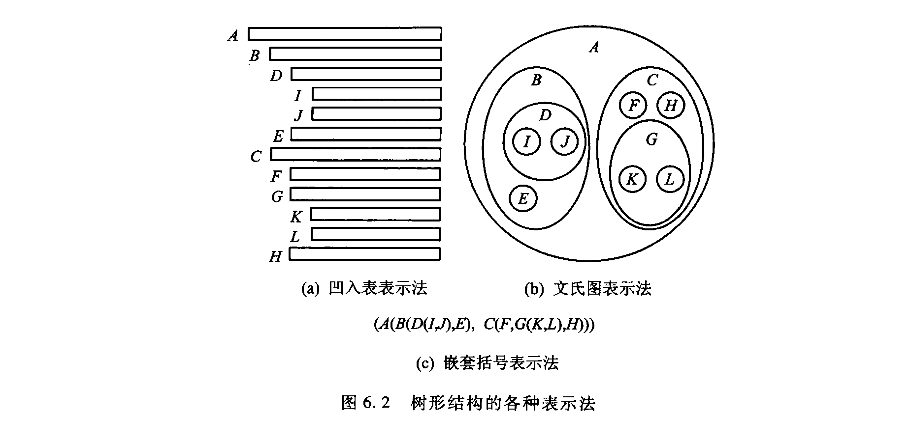
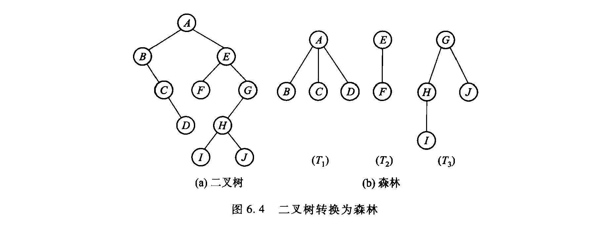
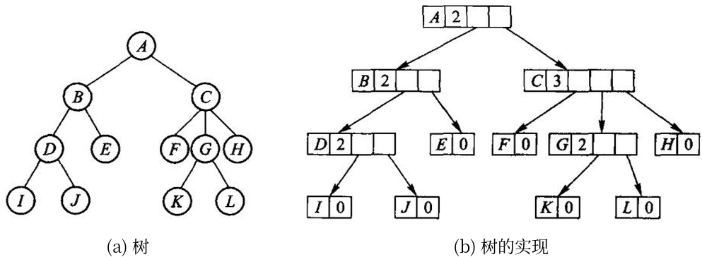
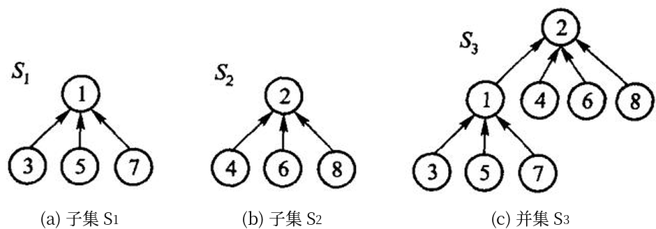
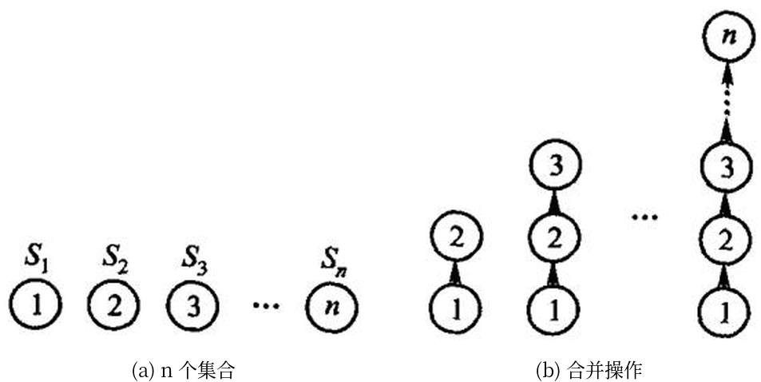
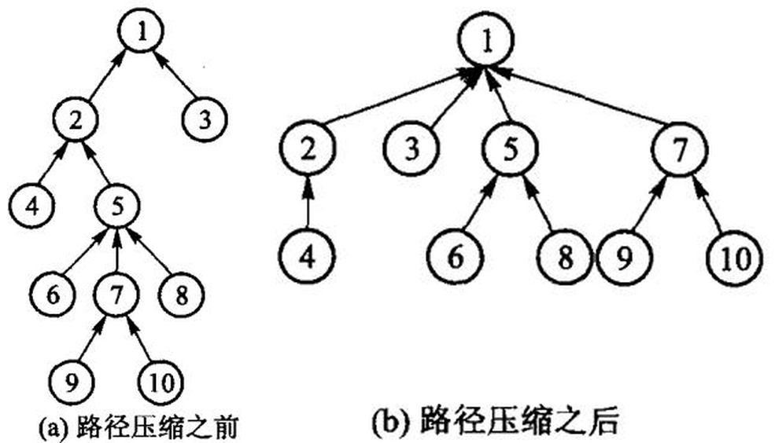
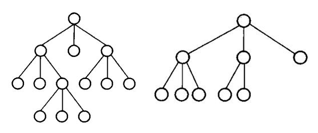

# 第6章 树

一般树允许一个结点有任意多个孩子。本章用「左孩子、右兄弟」表示它：`child` 指向第一个孩子，`sibling` 指向下一个兄弟。并查集则回答另一类问题：若干元素分属哪些互不相交的集合。

源码：[一般树和并查集](../code/ch06/general_tree/modern.hpp)、
[可运行示例](../code/ch06/general_tree/demo.cpp)、
[测试](../code/ch06/general_tree/test.cpp)。

## 6.1 树的定义和基本术语

树形结构用分支关系定义层次：一个结点至多一个前驱，但可以有任意多个后继。家谱、机关编制、文件系统目录、编译器的句法树，都是树。和第 5 章的二叉树不同，一般树的结点不限制孩子个数。

### 6.1.1 树和森林

**定义。** 树（tree）是包括 $n$（$n \ge 1$）个结点的有限集合 $T$，使得：

1. 有且仅有一个特定的称为**根**（root）的结点；
2. 除根以外的其他结点被分成 $m$（$m \ge 0$）个不相交的有限集合 $T_1, T_2, \cdots, T_m$，而每一个
   集合又都是树。其中，树 $T_1, T_2, \cdots, T_m$ 称做这个根的**子树**（subtree）。

这个定义是**递归**的：在树的定义中又用到了树的概念——一棵树可分成几个分支，而每个分支也都是
一棵树。

树的逻辑结构也可以用第 1 章的二元关系来描述：树是包含 $n$（$n > 0$）个结点的有穷集合 $K$，
且在 $K$ 上定义了一个满足以下条件的二元关系 $R = \{r\}$：

1. 有且仅有一个结点 $k_0 \in K$，它对于关系 $r$ 来说没有前驱，结点 $k_0$ 称做树的根；
2. 除结点 $k_0$ 外，$K$ 中的每个结点对于关系 $r$ 来说都有且仅有一个前驱；
3. 除结点 $k_0$ 外的任何结点 $k \in K$，都存在一个结点序列 $k_0, k_1, \cdots, k_s$，使得 $k_0$ 就是
   树根，且 $k_s = k$，其中有序对 $\langle k_{i-1}, k_i \rangle \in r$（$1 \le i \le s$）——这样的结点序列
   称为从根 $k_0$ 到结点 $k$ 的一条**路径**。

**除了定义的角度不同外，以上给出的逻辑结构描述和树的递归定义是等价的。** 以下面的图 6.1 为例，
抽象出来的逻辑结构是结点集合 $K = \{A, B, C, D, E, F, G, H, I, J, K, L\}$，$K$ 上的关系
$r = \{\langle A,B \rangle, \langle A,C \rangle, \langle B,D \rangle, \langle B,E \rangle, \langle C,F \rangle, \langle C,G \rangle, \langle C,H \rangle, \langle D,I \rangle, \langle D,J \rangle, \langle G,K \rangle, \langle G,L \rangle\}$。

**基本术语**（父结点、子结点、根、树叶、子孙、路径、层次等）都类似于二叉树中的相关概念：在一棵
树中，若存在结点 $k$ 指向结点 $k'$ 的连线，则称 $k$ 是 $k'$ 的父结点，而 $k'$ 则是 $k$ 的子结点，
有向连线 $\langle k, k' \rangle$ 称做边；同一个父结点的子结点之间互称兄弟；树中没有父结点的结点
称为根，没有子结点的结点称为树叶。**结点的子树数目称为结点的度，树的度是树中各结点度的最大
值**（二叉树的度是 2）。若有一条由 $k$ 到达 $k_s$ 的路径，则称 $k$ 是 $k_s$ 的祖先、$k_s$ 是 $k$ 的
子孙。结点的层数同样由树根开始定义：根结点为第 0 层，非根结点的层数是其父结点的层数加 1。

自然界中树的子结点次序没有必要加以区别，称为**无序树**；但计算机的存储是有序的，为方便计算机
处理，往往把子结点按从左到右的次序顺序编号，即把树作为**有序树**（ordered tree）看待。

**注意：度为 2 的有序树并不是二叉树。** 因为有序树中在第一子结点被删除后，第二子结点自然顶替
成为第一子结点；**因此，度为 2 并且严格区分左右两个子结点的有序树才是二叉树**——二叉树必须能
表示「左空、右不空」这种左右不对称。

**森林**（forest）是零棵或多棵不相交的树的集合（通常是有序集合）。对于树中的每个结点，其子树
组成的集合就是森林；而加入一个结点作为根，森林就可以转化成一棵树。


图 6.1　一般树的树形表示。

树形结构在客观世界中大量存在，有多种逻辑表示方法。**树形表示法**其实是根在上的倒挂树：用圆圈
结点表示树的数据元素，用连接两个结点的边表示数据元素的关系；尽管树中的边没有标明方向，但是
一般默认上面的结点表示前驱、下面的数据元素表示该结点的后继。**凹入表示法**表示出根结点及各个
子树的层次关系，线条表示各结点：树根结点对应的线条最长，各子结点对应的线条短于其父结点并置
于父结点线条的下方，各兄弟结点对应的线条长度相同——这种表示法类似于图书的目录表。**文氏图
表示法**用嵌套的圆表示树：每棵树对应于一个圆，树的根结点及其子树画在同一个圆内，同一个根结点
的任意两棵子树对应的圆互不相交。**嵌套括号表示法**是类似于广义表的一种表示方法：括号表示层次
关系，每棵树对应于一个以根结点作为表名的表，根结点写在左边，表由子树森林对应的表组成，各个
子树对应的表用逗号隔开，例如 `A(B(D(I,J),E), C(F,G(K,L),H))`。表示法多样，说明树在建模里用得广。



图 6.2　同一棵树的三种等价表示。凹入表适合按层次阅读，文氏图突出包含关系，嵌套括号则便于作为文本编码或输入。

例如 A 的孩子是 B、C、D，B 的孩子是 E、F。用左孩子 / 右兄弟画出来：

```text
A
└─ child → B ── sibling → C ── sibling → D
            └─ child → E ── sibling → F
```

任意度的树只需两个指针域。代价是不能 $O(1)$ 取得「第 $k$ 个孩子」，必须沿兄弟链走过去。

### 6.1.2 森林与二叉树的等价转换

树和森林都可以一对一地变成二叉树，相关操作也就都能转到二叉树上做。形象的做法是「连线、切线、旋转」三步：

1. **连线**：把兄弟结点用线连起来。
2. **切线**：只保留父结点到第一个孩子的连线，砍掉到其余孩子的连线。
3. **旋转**：以根为轴顺时针转一下，画面才像通常的二叉树。

转换后，一个结点的左孩子是它在原树（或森林）里的第一个孩子，右孩子是原来的下一个兄弟。左枝上是父子关系，右枝上是兄弟关系。单棵树的根没有兄弟，所以转成二叉树后根的右孩子一定为空。


图 6.3　森林转换为二叉树的过程：先把兄弟连线，再切去多余的父子线，最后旋转整理方向。

形式地说：森林 $F=\{T_1,T_2,\ldots,T_n\}$ 转成二叉树 $B(F)$——$F$ 空则 $B(F)$ 空；否则 $B(F)$ 的根是 $T_1$ 的根，$B(F)$ 的左子树是 $T_1$ 的子树森林转成的二叉树，$B(F)$ 的右子树是 $\{T_2,\ldots,T_n\}$ 转成的二叉树。

反过来是三步的逆：逆时针旋转；若 $x$ 是 $y$ 的左孩子，就把 $x$ 以及 $x$ 右侧整条右链上的结点都补连到 $y$；再删掉所有到右孩子的边。二叉树 $B$ 对应的森林 $F(B)$：空树对应空森林；否则 $F(B)$ 是一棵以 $B$ 的根为根、以 $F(B_L)$ 为子树森林的树，再加上 $F(B_R)$。这两种转换互逆。



图 6.4　上述转换的逆过程，完整保留二叉树和对应森林的全部子图。


图 6.5　森林与对应二叉树的互相转换，完整保留原书的森林、二叉树和题注。

### 6.1.3 树的抽象数据类型

和二叉树一样，树的 ADT 分结点类和树类。结点保存自身值，以及指向最左孩子、下一个兄弟和父结点的链接；树类保存根（森林时根还可以沿兄弟链相连）。对外运算包括：用一个值建立根；在某结点下插入第一个孩子；在某结点旁插入下一个兄弟；查询父结点；删除一棵子树；以及先根、后根、层次三种周游。插入和删除必须同时维护父链、孩子链和兄弟链，不能只改其中一条。原书【代码6.1】【代码6.2】只给出声明，本书把这些运算直接写在 `GeneralTree` 上，不再另设空基类。

### 6.1.4 树的周游

由树和森林的定义可以引出两种周游树或森林的方法：既可以按深度的方向周游，也可以按广度的方向
周游。**对于树或森林，一个结点可能具有多于两个子树，因此不能像二叉树的中序周游法那样给出树的
中根次序周游方式**，但是仍然可以考虑树或森林的前序和后序周游算法——仿照周游二叉树深度优先
算法的前序法和后序法，可以类似地定义**先根次序**和**后根次序**周游。

先根次序周游森林：① 访问森林中第一棵树的根结点；② 在先根次序下周游第一棵树根结点的子树
森林；③ 在先根次序下周游其他的树构成的森林。后根次序周游森林：① 在后根次序下周游第一棵树
根结点的子树森林；② 访问森林中第一棵树的根结点；③ 在后根次序下周游其他树构成的森林。

**这两种次序与 6.1.2 节的等价转换正好对得上，值得单独记住：**

- 按**先根次序**周游森林的序列，正好等同于其对应二叉树的**前序**序列；
- 按**后根次序**周游森林的序列，正好是该森林对应二叉树在**中序**次序周游下的结点序列。

原因就在转换关系里：森林 $F$ 的第一棵树 $T_1$ 的诸子树 $T_{11}, T_{12}, \cdots, T_{1m}$ 对应 $B(F)$ 的
左子树，而 $F$ 中其余的树 $T_2, \cdots, T_n$ 对应于 $B(F)$ 的右子树；森林的后根次序周游过程是
先周游 $\{T_{11}, \cdots, T_{1m}\}$、再访问 $T_1$ 的根结点、最后周游 $\{T_2, \cdots, T_n\}$——这恰好是
二叉树 $B(F)$ 的中序周游过程。以图 6.5 那个森林为例：先根次序得到 `A B C E F D G H J I`，
后根次序得到 `B E F C D A J H I G`。

**广度优先**（breadth-first）周游也称「宽度优先周游」或「层次周游」：从树的第 0 层（根结点）开始，
自上至下逐层周游；在同一层中，则按照从左到右的顺序对结点逐一访问。同样以图 6.5(a) 的森林为例，
按广度方向周游得到 `A G B C D H I E F J`。**注意森林的层次序列与其对应二叉树的层次次序不同**：
按广度方向周游森林对应的二叉树时，不是简单地按照离二叉树根从近到远地遍历，而是**沿着二叉树
右链访问的过程，左指针起到承上启下的作用**。

对本节的例子：

| 周游 | 顺序 | 本例 |
| --- | --- | --- |
| 先根 | 结点，再孩子子树 | A B E F C D |
| 后根 | 孩子子树，再结点 | E F B C D A |
| 层次 | 按离根的距离 | A B C D E F |

递归周游和递归销毁在极深的退化树上会耗尽调用栈，和第 5 章是同一类风险。

## 6.2 树的链式存储结构

在计算机中，树有多种存储方式：一类是链式结构，另一类是顺序结构（6.3 节）。但是，**无论在应用中
采取何种方式，都要求树的存储结构不但能存储各结点本身的数据信息，还要求能准确反映树中各结点
之间的逻辑关系。** 一般树的存储比二叉树麻烦，因为度不固定；本节介绍四种链式存储方式，本章的
主实现是第四种。

### 6.2.1 “子结点表”表示方法

「子结点表」（list of children）表示方法，是指每个分支结点的子结点按照从左至右的顺序形成一个
链表存储在该分支结点中，其**主体是一个存储了树中各结点信息的数组**。数组中的每个元素包括
3 个域，分别用来存放结点信息的值、其父结点指针以及指向其子结点表的指针——为了简明，这些
「指针」实际上使用数组的下标值；最后一列存储的子结点链表中，子结点的顺序由左至右，且每个表项
均存储着指向下一个子结点的指针。

在这种表示法中，**最左子结点可由子结点链表的第一个表项直接找到，顺链可以找到所有子结点**。
取第 $k$ 个孩子若表用数组可为 $O(1)$，若用链表则要沿表走 $k$ 步。

这种表示法的代价是：度不固定时数组表需要扩容，孩子序列中间插入还要搬动后面的指针；空间上，度为 $d$ 的结点要留 $d$ 个指针槽，孩子很少时会浪费。本章随后用“左子/右兄”把每个结点的链接数固定为两个。


图 6.6　每个结点单独保存孩子表的表示法。

### 6.2.2 静态“左子/右兄”表示法

下面介绍上述表示方法的一个改进——静态「左子/右兄」（也称「左子结点/右兄弟结点」，left child /
right sibling）表示法，**使得访问结点的右侧兄弟结点更加方便**。

图 6.7 所示为静态「左子/右兄」的一个实例，该方法仍然使用数组存储树中的各结点，数组下标代替
指针。每个结点元素包括 4 个域，分别用于存储结点的值、指向其父结点、以及指向最左子结点和右侧
兄弟结点的指针。**这种表示法比「子结点表」表示法的空间效率更高，而且每个结点的存储空间大小
固定。**


图 6.7　左孩子—右兄弟表示法把任意度的树压成两个链接域。

如果两棵树存储在同一个数组中，把其中一棵树添加为另一棵树的子树就很简单。把图 6.7 中以 A 为根的树变成 H 的最左子树，合并结果如图 6.8 所示。结点数组中只需调整 3 个链接：将 H 的最左子结点指向 A，将 A 的父结点指向 H，再将 A 的右侧兄弟指向 J。其余结点的值和链接都不变。


图 6.8　静态数组中的左子、右兄链接和树的归并。

### 6.2.3 动态表示法

**问题的根子在于「度不固定」。** 树中的结点可以有任意的度数，并且各结点的子结点数随时可能发生
变化，这种动态性给树的实现带来了困难。当然，可以采取一种不太灵活的方式，即限定树的度数，
在实现树的时候只需要给树的每一个结点分配确定数目的指针域即可；很明显，**这种存储方法对度数
小的结点会浪费存储空间，而超过限制时增加结点会非常不方便**。

另外一种实现方法是**为每个结点分配可变的存储空间**：每一个结点都存储一个子结点指针表，其子
结点的数目也存储在该结点中。使用这样的存储方式可以避免上述不足——即使子结点数目发生变化，
也只需给该结点重新分配一个大小合适的存储空间即可，因此这种途径更具有灵活性。这种表示法
**本质上与「子结点表」表示法相同，但是它可以动态地分配结点空间，而不是把所有结点分配在同一个
数组中**；树的大小事先未知、会频繁长出新结点时更合适。图 6.9(a) 是树形结构，图 6.9(b) 展开了
每个结点的动态孩子表。



图 6.9　树的动态表示法：(a) 的每个结点在 (b) 里都是一块单独分配的空间，里面存着孩子数和一张长度可变的孩子指针表。

### 6.2.4 动态“左子/右兄”二叉链表表示法

6.1.2 节介绍了森林和树的等价转换，6.2.2 节的静态「左子/右兄」可以看成是这种方法的**静态链表
实现**。既然如此，就可以直接采用第 5 章二叉树链式存储的做法，实现**动态的「左子/右兄」二叉链表
表示法**（dynamic "left child / right sibling"，往往简称为「左子/右兄」表示法，或二叉链表表示法）：
左子结点在树中是结点的最左子结点，右子结点是结点原来的右侧兄弟结点，而**根的右链就是森林中
每棵树的根结点**。这种方法应用最广泛，也是本章的主实现。

具体地说，任意度的树只需两个指针域：`child` 指向第一个孩子，`sibling` 指向下一个兄弟。再加一个
`parent` 便于向上走。代价是取第 $k$ 个孩子必须沿兄弟链走 $k$ 步。

```cpp file=code/ch06/general_tree/demo.cpp
#include "modern.hpp"

#include <iostream>

int main() {
    dsa::GeneralTree<char> tree;
    tree.create_root('A');
    auto* b = tree.insert_first(tree.root(), 'B');
    auto* c = tree.insert_next(b, 'C');
    tree.insert_next(c, 'D');
    tree.insert_first(b, 'E');
    tree.insert_next(tree.root()->child->child, 'F');

    std::cout << "先根: ";
    tree.preorder([](char value) { std::cout << value; });
    std::cout << "\n后根: ";
    tree.postorder([](char value) { std::cout << value; });
    std::cout << "\n层次: ";
    tree.breadth_first([](char value) { std::cout << value; });
    std::cout << '\n';

    dsa::DisjointSet sets(5);
    sets.unite(0, 1);
    sets.unite(1, 2);
    sets.unite(3, 4);
    std::cout << "0 与 2 同集合: " << (sets.same(0, 2) ? "是" : "否") << '\n';
    std::cout << "0 与 3 同集合: " << (sets.same(0, 3) ? "是" : "否") << '\n';
}
```

在仓库根目录运行：

```bash
c++ -std=c++17 -Wall -Wextra -Werror -Icode/ch06/general_tree \
    code/ch06/general_tree/demo.cpp -o /tmp/tree-demo
/tmp/tree-demo
```

输出是：

```console
先根: ABEFCD
后根: EFBCDA
层次: ABCDEF
0 与 2 同集合: 是
0 与 3 同集合: 否
```

`insert_first(parent, value)` 把新结点插到孩子链的最前面；`insert_next(node, value)` 插到该结点的下一个兄弟。先插入 B，再 `insert_next(B, C)`、`insert_next(C, D)`，孩子从左到右就是 B、C、D。

`create_root` 清空旧树并新建根。`insert_first` 先让新结点的 `sibling` 指向原来的第一个孩子，再把它接到 `parent->child` 上——所以后插入的孩子会出现在兄弟链前端。`delete_subtree` 沿着父的孩子链或森林的根兄弟链找到指向它的指针，改写成下一个兄弟，再递归销毁。

孩子-兄弟树：

```cpp file=code/ch06/general_tree/modern.hpp#general-tree
template <typename T>
class GeneralTree {
public:
    struct Node {
        T value;
        Node* child{nullptr};
        Node* sibling{nullptr};
        Node* parent{nullptr};

        explicit Node(const T& value) : value(value) {}
    };

    GeneralTree() = default;

    GeneralTree(const GeneralTree& other) : root_(clone(other.root_, nullptr)) {}

    GeneralTree& operator=(const GeneralTree& other) {
        if (this != &other) {
            GeneralTree copy(other);
            swap(copy);
        }
        return *this;
    }

    GeneralTree(GeneralTree&& other) noexcept : root_(other.release()) {}

    GeneralTree& operator=(GeneralTree&& other) noexcept {
        if (this != &other) {
            clear();
            root_ = other.release();
        }
        return *this;
    }

    ~GeneralTree() { clear(); }

    void swap(GeneralTree& other) noexcept {
        using std::swap;
        swap(root_, other.root_);
    }

    [[nodiscard]] Node* root() noexcept { return root_; }
    [[nodiscard]] const Node* root() const noexcept { return root_; }

    void create_root(const T& value) {
        clear();
        root_ = new Node(value);
    }

    Node* insert_first(Node* parent, const T& value) {
        if (parent == nullptr) {
            throw std::invalid_argument("parent must not be null");
        }
        Node* node = new Node(value);
        node->sibling = parent->child;
        node->parent = parent;
        parent->child = node;
        return node;
    }

    Node* insert_next(Node* node, const T& value) {
        if (node == nullptr) {
            throw std::invalid_argument("node must not be null");
        }
        Node* next = new Node(value);
        next->sibling = node->sibling;
        next->parent = node->parent;
        node->sibling = next;
        return next;
    }

    [[nodiscard]] Node* parent_of(Node* node) const noexcept {
        return node == nullptr ? nullptr : node->parent;
    }

    void delete_subtree(Node* node) {
        if (node == nullptr) {
            return;
        }

        Node** link = node->parent == nullptr ? &root_ : &node->parent->child;
        while (*link != nullptr && *link != node) {
            link = &(*link)->sibling;
        }
        if (*link != node) {
            throw std::invalid_argument("node is not part of this tree");
        }

        *link = node->sibling;
        node->sibling = nullptr;
        destroy(node);
    }

    void clear() noexcept {
        destroy(root_);
        root_ = nullptr;
    }

    template <class Visitor>
    void preorder(Visitor&& visitor) const {
        pre(root_, visitor);
    }

    template <class Visitor>
    void postorder(Visitor&& visitor) const {
        post(root_, visitor);
    }

    // >>> dual-tag
    /// 【算法6.10】带双标记位的先根次序表示 → 「左子/右兄」链式树。
    ///
    /// 顺序表示里每个结点只带两个标志位：`has_child`（原书 ltag == 0）和
    /// `has_sibling`（原书 rtag == 0）。光靠先根次序 + 这两位就能把链恢复出来，
    /// 靠的是先根次序的一条性质：**任何结点的子树都紧跟在它后面**，
    /// 子树排完才轮到它的下一个兄弟。
    ///
    /// 于是「谁是某个结点的右兄弟」这件事要等它整棵子树扫完才知道——用栈记着：
    /// 扫到 `has_sibling` 的结点就压栈；扫到没有孩子的结点（子树到头了）就弹一个出来，
    /// 把刚建的结点接成它的右兄弟。
    struct DualTagNode {
        T value;
        bool has_child;    ///< 原书 ltag == 0
        bool has_sibling;  ///< 原书 rtag == 0
    };

    [[nodiscard]] static GeneralTree from_dual_tag(const DualTagNode* nodes, std::size_t count) {
        GeneralTree tree;
        if (count == 0) {
            return tree;
        }
        if (nodes == nullptr) {
            throw std::invalid_argument("from_dual_tag: 结点数组是空指针");
        }

        // 原书用 `stack<TreeNode<T>*> aStack`，这里用 vector 当栈（见 unit.json 豁免）。
        std::vector<Node*> waiting;  // 已扫到、还等着接右兄弟的结点
        Node* current = new Node(nodes[0].value);
        tree.root_ = current;

        for (std::size_t i = 0; i + 1 < count; ++i) {
            if (nodes[i].has_sibling) {
                waiting.push_back(current);
            }
            Node* fresh = new Node(nodes[i + 1].value);
            if (nodes[i].has_child) {
                current->child = fresh;
                fresh->parent = current;
            } else {
                // 子树到头了：刚建的结点属于栈顶那个结点的右兄弟。
                //
                // 原书这里直接 `aStack.top()`，**没有判空**。标志位不自洽的输入
                // （例如全是 has_child=false、has_sibling=false）会让它对空栈取顶，
                // 那是未定义行为（证据见 legacy.md 缺陷 4）。这里判空并抛异常。
                if (waiting.empty()) {
                    delete fresh;
                    throw std::invalid_argument("from_dual_tag: 标志位不自洽，右兄弟无处安放");
                }
                Node* owner = waiting.back();
                waiting.pop_back();
                owner->sibling = fresh;
                fresh->parent = owner->parent;  // 兄弟与它共享同一个父结点
            }
            current = fresh;
        }
        // 先根次序里最后一个结点必是叶子，**而且没有下一个兄弟**——
        // 它的孩子和它的右兄弟都只能排在它后面，而它已经是最后一个了。
        // 按标记的定义，末结点必然 `ltag == 1 且 rtag == 1`。
        // 循环只走到 count-2，所以末结点的两个标志位都得在这里单独查。
        //
        // **不自洽就拒绝，不做「尽量还原」**：压栈（有兄弟）与出栈（子树到头）
        // 必须一一配对，配不上的序列不对应任何森林的编码。见 legacy.md 缺陷 4。
        if (nodes[count - 1].has_child || nodes[count - 1].has_sibling || !waiting.empty()) {
            throw std::invalid_argument("from_dual_tag: 标志位不自洽，序列没有正常收尾");
        }
        return tree;
    }
    // <<< dual-tag

    template <class Visitor>
    void breadth_first(Visitor&& visitor) const {
        std::vector<Node*> queue;
        for (Node* node = root_; node != nullptr; node = node->sibling) {
            queue.push_back(node);
        }
        for (std::size_t index = 0; index < queue.size(); ++index) {
            visitor(queue[index]->value);
            for (Node* child = queue[index]->child; child != nullptr;
                 child = child->sibling) {
                queue.push_back(child);
            }
        }
    }

private:
    // Recursive destruction and traversals preserve the textbook presentation.
    // They have a Stack Overflow Risk for a pathologically deep tree.
    static void destroy(Node* node) noexcept {
        if (node == nullptr) {
            return;
        }
        destroy(node->child);
        destroy(node->sibling);
        delete node;
    }

    static Node* clone(const Node* node, Node* parent) {
        if (node == nullptr) {
            return nullptr;
        }
        Node* copy = new Node(node->value);
        copy->parent = parent;
        try {
            copy->child = clone(node->child, copy);
            copy->sibling = clone(node->sibling, parent);
        } catch (...) {
            destroy(copy);
            throw;
        }
        return copy;
    }

    template <class Visitor>
    static void pre(Node* node, Visitor& visitor) {
        for (; node != nullptr; node = node->sibling) {
            visitor(node->value);
            pre(node->child, visitor);
        }
    }

    template <class Visitor>
    static void post(Node* node, Visitor& visitor) {
        for (; node != nullptr; node = node->sibling) {
            post(node->child, visitor);
            visitor(node->value);
        }
    }

    Node* release() noexcept {
        Node* result = root_;
        root_ = nullptr;
        return result;
    }

    Node* root_{nullptr};
};
```

### 6.2.5 父指针表示法和在并查集中的应用

并查集要防的是树退化成一条链。原书给了两条改进，本书都实现了。

#### 等价类和并查集

并查集（union/find）是一种由若干互不相交子集组成的集合抽象。它的两个基本操作是：`find` 判断两个元素是否属于同一集合，`union` 把两个集合归并为一个集合。它常用来维护“已经连通”“属于同一组”这类关系。

形式地说，集合 $S$ 上的关系 $R$ 是等价关系，当且仅当满足：对所有 $x$ 有 $(x,x)\in R$（自反性）；若 $(x,y)\in R$，则 $(y,x)\in R$（对称性）；若 $(x,y)\in R$ 且 $(y,z)\in R$，则 $(x,z)\in R$（传递性）。若 $(x,y)\in R$，称 $x$、$y$ 等价；元素 $x$ 的等价类是

$$[x]_R=\{y\in S : (x,y)\in R\}.$$

所有等价类互不相交，它们的并正好是 $S$，因此等价关系就是对 $S$ 的一种划分。

给定 $n$ 个元素和若干等价偶对 $(x,y)$，划分过程从 $n$ 个单元素集合开始。依次读入每个偶对，先查找 $x$、$y$ 所在子集；若两个根不同，就把这两个子集合并成一个。最后剩下的非空子集就是由这些偶对确定的等价类。实现这一过程需要三种操作：为每个元素建立独立集合；找到元素所在子集的标识（根）；把两个子集归并。

用父指针表示时，把每个子集看成一棵树，森林中的每棵树代表一个子集，树根就是该集合的标识符。`find` 沿父链找到根，`union` 只需把一棵树的根指向另一棵树的根；因此不必搬动集合中的所有元素。


图 6.10　用每个结点的父指针表示树。



图 6.11　集合的父指针表示与并集：(a) 子集 $S_1$、(b) 子集 $S_2$ 各是一棵树，(c) 合并后 $S_1$ 的根挂到了 $S_2$ 的根下。

**第一条是【重量权衡合并规则】**(weighted union rule)：合并时看两个集合的**元素个数**，
「令含元素少的子集的树根指向含元素多的子集的根」。原书【代码6.8】的结点里那个
`int nCount; //子树元素数目` 就是为它准备的。小树挂到大树下，能把整体深度限制在 $O(\log n)$——
理由是每次合并树高最多加 1，而元素个数至少翻倍，所以任何结点的深度最多增加 $\log n$ 次。

> **注意别和「按秩合并」混了。** 按秩比的是**树高**，按重量比的是**元素个数**。
> 两者复杂度同阶，但在同一组等价对上会长出**形状不同**的树。本书按原书口径用重量，
> 课程第 6 章习题 8 要求「使用重量权衡合并规则与路径压缩」并画出父指针数组，
> 换成按秩就对不上答案。并列时本书让**值大的根挂到值小的根下**——
> 原书没规定这一条，这个口径取自那道习题的原话，好让书里的实现能直接用来核对。



图 6.12　不采用重量权衡时，反复合并可能形成极端退化的树：(a) 起初是 $n$ 个单元素集合，(b) 每次都把大树挂到小树下，最后退化成一条长链。

**第二条是路径压缩**：`find` 在返回根之前，把沿途每个结点的父指针都直接改成根。



图 6.13　查找根结点时把沿途父指针直接改到根：(a) 是压缩之前的树，(b) 是对结点 7 调用一次 `find` 之后的样子——路径 7→5→2 上的结点都被直接改挂到根 1 下，而 9、10 仍留在 7 下面。

```cpp file=code/ch06/general_tree/modern.hpp#disjoint-set
/// 【代码6.8】树的父指针表示与 union/find。
///
/// 合并用原书的**重量权衡合并规则**(weighted union rule)：
/// 「令含元素少的子集的树根指向含元素多的子集的根」。原书结点里那个
/// `int nCount; //子树元素数目` 就是为它准备的，这里对应 `size_`。
///
/// **不要换成「按秩合并」**：按秩比的是树高，按重量比的是元素个数，两者
/// 在同一组等价对上会长出**不同形状**的树。原书与课程习题都按重量口径出题
/// （课程第 6 章习题 8 要求「使用重量权衡合并规则与路径压缩」并给出父指针数组），
/// 换成按秩会让读者对不上答案。
class DisjointSet {
public:
    explicit DisjointSet(std::size_t count) : parent_(count), size_(count, 1) {
        for (std::size_t index = 0; index < count; ++index) {
            parent_[index] = index;
        }
    }

    std::size_t find(std::size_t index) {
        if (index >= parent_.size()) {
            throw std::out_of_range("disjoint-set index");
        }
        if (parent_[index] != index) {
            parent_[index] = find(parent_[index]);  // 【算法6.9】路径压缩
        }
        return parent_[index];
    }

    bool unite(std::size_t left, std::size_t right) {
        left = find(left);
        right = find(right);
        if (left == right) {
            return false;  // 已经同类：幂等的可预期失败（D-001 §3c）
        }
        // 重量权衡：小树挂到大树下。并列时把**值大的根**挂到值小的根下——
        // 原书没有规定并列怎么办，这个口径取自课程第 6 章习题 8 的原话
        // 「当两棵树规模同样大时，使结点值较大的根结点作为值较小的根结点的子结点」，
        // 这样书里的实现能直接用来核对那道题的答案。
        if (size_[left] < size_[right] || (size_[left] == size_[right] && left > right)) {
            std::swap(left, right);
        }
        parent_[right] = left;
        size_[left] += size_[right];
        return true;
    }

    [[nodiscard]] bool same(std::size_t left, std::size_t right) {
        return find(left) == find(right);
    }

    /// 某个元素所在集合的大小。原书 `nCount` 的对外读法，也让「重量」这件事可测。
    [[nodiscard]] std::size_t set_size(std::size_t index) { return size_[find(index)]; }

    /// 当前的父指针数组——课程习题要求画出的正是它。
    [[nodiscard]] const std::vector<std::size_t>& parents() const noexcept { return parent_; }

private:
    std::vector<std::size_t> parent_;
    std::vector<std::size_t> size_;  // 原书 nCount：子树元素数目
};
```

## 6.3 树的顺序存储结构

**顺序存储表示法存储树，要求把树中的结点按照一定的顺序存储到一片连续的存储单元中；为了能够
显示出树的逻辑结构，需要在结点表中包含足够的结构信息。** 链式存储每个结点单独分配，指针占空间，
也不利于整块读写；而把结点按某一种周游次序排进数组，再用很少的附加信息记下「谁是下一个兄弟」
或「有几个孩子」，就能在连续空间里还原整棵树。

下面介绍与树和森林的**遍历次序**相关的几种典型的顺序存储结构，都以图 6.5(a) 中所示的森林为例。
原书给了四种，思路都对；本章不另写一套未验证的实现，只把还原办法说清楚。

### 6.3.1 带右链的先根次序表示

图 6.5(a) 所示森林的先根次序序列是 `A B C E F D G H J I`。**在先根序列中，任何结点的子树的所有
结点都直接跟在该结点之后，任何一个分支结点后面紧跟的是其第一个子结点**——这条性质是下面几种
表示法共同的基础。

在「带右链的先根次序表示」中，每个结点包括结点本身数据以及附加的两个表示结构信息的域
`ltag` 和 `rlink`，结点的形式为 `[ltag | info | rlink]`。其中 `info` 是结点的数据；`rlink` 是右指针，
指向结点的下一个兄弟，即树或森林所对应的二叉树中结点的右子结点；`ltag` 是一个标记位，
当结点是叶结点（即对应的二叉树中没有左子结点）时 `ltag` 为 1，否则为 0。

**为什么用 `ltag` 而不是再存一个左链？** 为了节省存储单元，「带右链的先根次序表示」用 `ltag` 代替
了 `llink`：从结点的次序和 `ltag` 的值完全可以推知 `llink`——`ltag` 为 0 的结点有左子结点，其
`llink` 就指向存储区中该结点的下一个结点；`ltag` 为 1 的结点没有左子结点，`llink` 为空。
所以顺着数组往下走、再靠右链跳过整棵子树，就能还原所有父子和兄弟关系。


图 6.14　先根序列配合右链下标还原树形。

### 6.3.2 带双标记的先根次序表示

右链要用一个整型下标。若改成两个布尔标记——`ltag`「有没有孩子」、`rtag`「有没有下一个兄弟」——
理论上只需两位信息，更省。**但普通 C++ `bool` 成员通常按字节存储，并不保证每位只占 1 bit**；
只有显式位压缩或位域实现才可讨论这种空间节省。它是早期教材常见的顺序编码，今天主要用于理解
树的序列化思想，不是通用工程接口。

以原书图6.5(a) 那片森林为例，它的双标记先根次序表示（图6.15）是：


图 6.15　双标记先根次序表示法的原书示例。

```text
先根次序   A  B  C  E  F  D  G  H  J  I
ltag       0  0  0  0  1  1  1  0  1  1     0 = 有孩子
rtag       0  1  0  1  1  1  0  0  1  1     0 = 有下一个兄弟
```

**光靠这三行就能把链恢复出来**，靠的是先根次序的一条性质：任何结点的子树都紧跟在它后面，
子树排完才轮到它的下一个兄弟。于是「谁是某个结点的右兄弟」要等它整棵子树扫完才知道——
用一把栈记着：扫到 `rtag == 0` 的结点就压栈，扫到 `ltag == 1` 的结点（没有孩子，说明子树到头）
就弹一个出来，把刚建的结点接成它的右兄弟。

【算法6.10】带双标记位先根次序树构造算法。

```cpp file=code/ch06/general_tree/modern.hpp#dual-tag
/// 【算法6.10】带双标记位的先根次序表示 → 「左子/右兄」链式树。
///
/// 顺序表示里每个结点只带两个标志位：`has_child`（原书 ltag == 0）和
/// `has_sibling`（原书 rtag == 0）。光靠先根次序 + 这两位就能把链恢复出来，
/// 靠的是先根次序的一条性质：**任何结点的子树都紧跟在它后面**，
/// 子树排完才轮到它的下一个兄弟。
///
/// 于是「谁是某个结点的右兄弟」这件事要等它整棵子树扫完才知道——用栈记着：
/// 扫到 `has_sibling` 的结点就压栈；扫到没有孩子的结点（子树到头了）就弹一个出来，
/// 把刚建的结点接成它的右兄弟。
struct DualTagNode {
    T value;
    bool has_child;    ///< 原书 ltag == 0
    bool has_sibling;  ///< 原书 rtag == 0
};

[[nodiscard]] static GeneralTree from_dual_tag(const DualTagNode* nodes, std::size_t count) {
    GeneralTree tree;
    if (count == 0) {
        return tree;
    }
    if (nodes == nullptr) {
        throw std::invalid_argument("from_dual_tag: 结点数组是空指针");
    }

    // 原书用 `stack<TreeNode<T>*> aStack`，这里用 vector 当栈（见 unit.json 豁免）。
    std::vector<Node*> waiting;  // 已扫到、还等着接右兄弟的结点
    Node* current = new Node(nodes[0].value);
    tree.root_ = current;

    for (std::size_t i = 0; i + 1 < count; ++i) {
        if (nodes[i].has_sibling) {
            waiting.push_back(current);
        }
        Node* fresh = new Node(nodes[i + 1].value);
        if (nodes[i].has_child) {
            current->child = fresh;
            fresh->parent = current;
        } else {
            // 子树到头了：刚建的结点属于栈顶那个结点的右兄弟。
            //
            // 原书这里直接 `aStack.top()`，**没有判空**。标志位不自洽的输入
            // （例如全是 has_child=false、has_sibling=false）会让它对空栈取顶，
            // 那是未定义行为（证据见 legacy.md 缺陷 4）。这里判空并抛异常。
            if (waiting.empty()) {
                delete fresh;
                throw std::invalid_argument("from_dual_tag: 标志位不自洽，右兄弟无处安放");
            }
            Node* owner = waiting.back();
            waiting.pop_back();
            owner->sibling = fresh;
            fresh->parent = owner->parent;  // 兄弟与它共享同一个父结点
        }
        current = fresh;
    }
    // 先根次序里最后一个结点必是叶子，**而且没有下一个兄弟**——
    // 它的孩子和它的右兄弟都只能排在它后面，而它已经是最后一个了。
    // 按标记的定义，末结点必然 `ltag == 1 且 rtag == 1`。
    // 循环只走到 count-2，所以末结点的两个标志位都得在这里单独查。
    //
    // **不自洽就拒绝，不做「尽量还原」**：压栈（有兄弟）与出栈（子树到头）
    // 必须一一配对，配不上的序列不对应任何森林的编码。见 legacy.md 缺陷 4。
    if (nodes[count - 1].has_child || nodes[count - 1].has_sibling || !waiting.empty()) {
        throw std::invalid_argument("from_dual_tag: 标志位不自洽，序列没有正常收尾");
    }
    return tree;
}
```

【算法6.10结束】

**原书这段代码有一处会崩**：`ltag == 1` 分支里直接写 `pointer = aStack.top();`，**没有判空**。
标志位不自洽的输入（比如两个结点都声称「没有孩子、也没有下一个兄弟」）会让它对空栈取顶——
未定义行为。本书判空并抛 `std::invalid_argument`，另加一条收尾检查：**最后一个结点的两个标记
都必须是 1**。测试里三种不自洽输入各有一条用例。

**为什么是「拒绝」而不是「尽量还原」**，值得单独说一句，因为初学者常想「能修就修」：

- 标记的定义就是 `ltag == 1` 表示无孩子、`rtag == 1` 表示无兄弟。先根序列的最后一个结点
  后面已经没有结点了，孩子和右兄弟都无处安放，所以它**必然**是 `1, 1`。
- 扫描过程里，「有兄弟」入栈与「子树到头」出栈是一一配对的。对空栈出栈，
  说明这个序列违反了这种配对关系。

也就是说，这三类输入不是合法的边界情况，而是**不对应任何森林的编码**——
多半是标记抄错了一位，或者序列被截断了。这时抛异常是在替使用者指出输入有问题;
默默「还原」出一棵树，只会把错误往后传。

### 6.3.3 带度数的后根次序表示

图 6.5(a) 森林的后根次序序列是 `B E F C D A J H I G`。**在后根次序序列中，任何一棵子树的所有
结点都聚集在一起，并且以该子树的根作为最后一个结点。** 在「带度数的后根次序表示」中，每个结点
有两个域：`info` 存放结点的数据，`degree` 存储结点的度数，结点形式为 `[info | degree]`。

**这种表示法不包括指针，但它仍能反映树的结构**，因此把它转化成森林的逻辑结构时，只需要从左至
右进行扫描：度数为零的结点是叶子结点（也可以看做是一棵子树的根）；当遇到度数非零（设为 $k$）的
结点时，则排在该结点之前且离它最近的 $k$ 个子树的根就是该结点的 $k$ 个子结点。例如上述森林中
结点 $C$ 的度数为 2，那么排在 $C$ 之前的两个结点 $E$ 和 $F$ 就是 $C$ 子树的根结点，从而结点 $C$、
$E$ 以及 $F$ 就构成了一棵树，$C$ 是这棵子树的根；同理，$A$ 的度数为 3，则排在 $A$ 之前且离 $A$
最近的三棵子树的根结点就是 $A$ 的子结点，即 $B$、$C$ 和 $D$。如此进行下去，就可以得到原来的
森林。实现时同样需要用到栈：每读到一个度数为 $d$ 的结点，就从栈顶弹出 $d$ 棵子树做它的孩子，
再把这棵新树压回去；扫完数组，栈里剩下的就是整棵树（或森林）。


图 6.16　结点度数随后根次序一起保存。

### 6.3.4 带双标记的层次次序表示


图 6.17　层次次序配合双标记记录孩子和兄弟关系。

图 6.5(a) 所示森林的层次次序序列为 `A G B C D H I E F J`。**这种层次次序的序列也同样表现了森林
的一些结构信息**：森林中处于同一层的结点在序列中都聚集在一起，任何一个结点只要它有右兄弟，
那么在序列中它的右兄弟就排在该结点后面。

类似于带双标记的先根次序表示，引入带双标记的层次次序表示法，结点形式为 `[ltag | info | rtag]`：
当结点没有左子结点时 `ltag` 为 1，否则为 0；当结点没有下一个兄弟时 `rtag` 为 1，否则为 0。

**怎么还原。** 由层次次序的性质可知，任何结点的子结点都排在该结点的所有兄弟结点后面，并且任何
结点的最后一个兄弟结点都不会再有下一个兄弟，即最后一个兄弟的 `rtag` 为 1。`rlink` 的值很容易
确定：结点的 `rtag` 为 1 则 `rlink` 为空，`rtag` 为 0 则 `rlink` 指向该结点紧邻的下一个结点。
`llink` 要靠队列来定：顺序扫描层次序列，若结点的 `ltag` 值为 1 则置其 `llink` 为空，否则把该结点
放入队列；遇到 `rtag` 为 1 的结点时，说明这一条兄弟结点链已经扫描完毕，下一个结点就是队头结点
的最左子结点——**队列在这里起的正是「承上启下」的作用**。适合需要按层处理的外部存储。

**现代视角：紧凑树编码。** 如果目标是工程中的紧凑存储或高速导航，通常会考虑 **LOUDS**、平衡括号（balanced parentheses）
等 succinct tree 编码，而不是直接照搬本节的双标记结构。它们同样把树压成位串，
但会明确规定位级布局、秩/选择（rank/select）操作和随机访问边界。本节的右链、双标记、带度数表示
应视为经典编码对照，用来理解「结构信息如何随周游序列保存」即可。

## 6.4 K叉树

有些应用里每个结点的孩子数有固定上限 $K$，例如三子棋的博弈树、某些 B 树的内存模拟。这时不必走「任意度 + 兄弟链」，可以规定每个结点至多 $K$ 个孩子，叫做 $K$ 叉树。

满 $K$ 叉树、完全 $K$ 叉树的定义与二叉树平行：满 $K$ 叉树的每个结点要么是叶，要么恰好 $K$ 个孩子；完全 $K$ 叉树只有最下两层的度可以小于 $K$，且最下层靠左对齐。按层从 0 编号时，结点 $i$ 的孩子们是 $Ki+1,\ldots,Ki+K$，父结点是 $\lfloor(i-1)/K\rfloor$。$K=2$ 就回到二叉树。



图 6.18　$K=3$ 时的 (a) 满 3 叉树与 (b) 完全 3 叉树。$K$ 叉树的分支结点孩子数是定死的，所以链式和顺序两种存法都好实现；完全 $K$ 叉树按编号存进数组，和完全二叉树是同一套办法。计算机图形学里的 4 叉树、8 叉树就是常见的应用。

本章主实现仍是任意度的左子 / 右兄，不单独做一份 $K$ 叉数组。需要固定 $K$、又想顺序存放时，用上面的编号公式即可。

## 本章小结

一般树允许任意多个孩子。森林是若干互不相交的树。树和森林与二叉树可以按「长子—左、兄弟—右」一一转换。链式存储里，左子/右兄用两个指针表示任意度；顺序存储则按某种周游次序排进数组，再靠右链、双标记或度数还原树形。并查集用父指针表示集合，路径压缩和重量权衡合并让大量操作接近常数。$K$ 叉树是度有上限的特例。

## 习题

### 补充证明与算法题（参考课程第 6 章）

1. 高度为 `h` 的满 `k` 叉树按层编号，推导第 `l` 层结点数、结点 `i` 的第 `m` 个孩子编号及右兄弟条件。
2. 用并查集判断变量方程组 `a==b`、`a!=b` 是否有解，并分别分析无优化、按秩合并和路径压缩的复杂度。
3. 给定一棵树的左孩子/右兄弟表示，写出其森林的先根序列和带度数后根序列。

1. 画出三棵树组成的森林转换成的二叉树，再转换回去，验证互逆。
2. 对树 `A(B(E,F),C(G),D(H,I,J))`（6.1.1 的括号表示法）写出先根、后根、层次序列。
3. 度为 2 的有序树和二叉树差在哪里？举一个「左空右不空」的例子。
4. 用带度数的后根次序表示一棵小树，并说明扫描时栈如何弹出孩子。
5. 对元素 $0..6$ 依次 `unite(0,1)`、`unite(1,2)`、`unite(3,4)`，画出父指针，再 `find(0)` 后画出路径压缩的结果。
6. 完全 3 叉树按层编号，写出结点 4 的父和孩子们。

## 上机题

1. 实现森林与二叉树的互相转换，并用先根序列对拍。
2. 用并查集判断无向图是否连通，并统计连通分量个数。
3. 比较带路径压缩与不带路径压缩的 `find` 在退化链上的时间。
