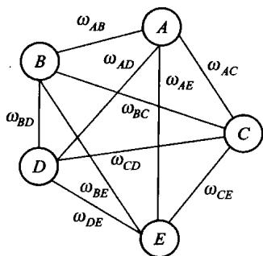
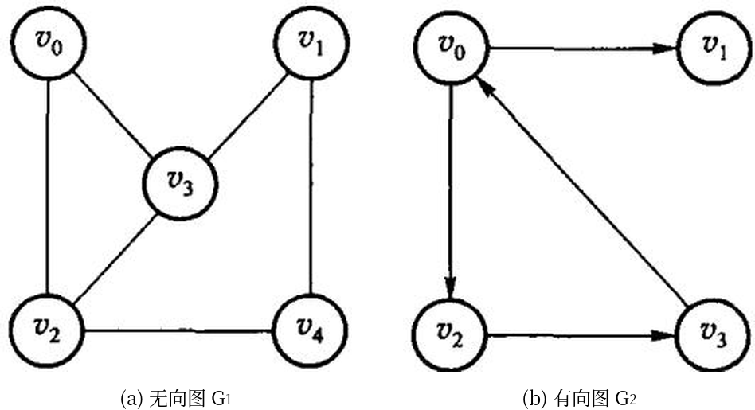
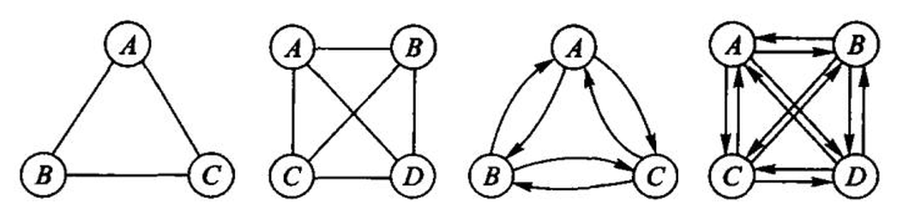
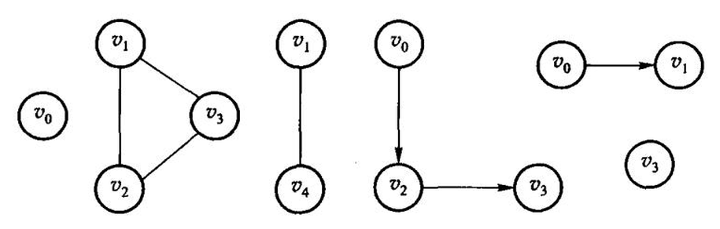
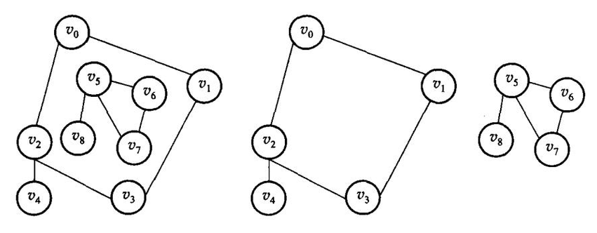
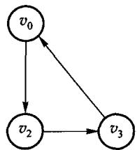
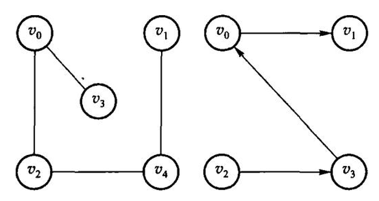
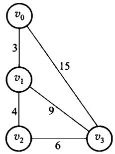
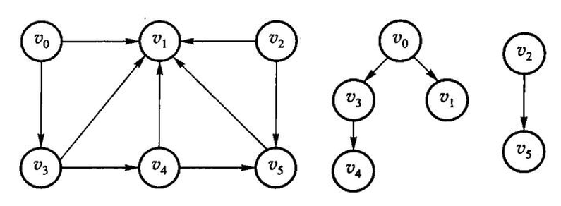

# 第7章 图

图由顶点和边组成。有向边表示单向关系，无向边表示双向关系，带权边表示代价。先弄清题目属于哪一种，再选算法。

源码：[图与七个算法](../code/ch07/graph/modern.hpp)、
[可运行示例](../code/ch07/graph/demo.cpp)、
[交叉验证测试](../code/ch07/graph/test.cpp)。

## 7.1 图的定义和基本术语

图比线性结构和树更一般：结点之间的关系可以是任意的。按第 1 章的分类——线性结构唯一前驱、唯一后继；树唯一前驱、多个后继；图对前驱和后继的个数都不加限制。线性和树都可以看成受限的图。

一个典型问题：要在几个城市之间建通信网，使每两个城市都能直接或间接通话，并且总造价尽量低。用顶点代表城市，边代表线路，边旁的数代表造价，问题就变成：在带权图里找一棵连通全部顶点、边权之和最小的树。这就是后面的最小生成树。


图 7.1　用图描述通信网络。顶点是城市，边是可以架设的线路，边旁的数是造价。要求选出一组线路，把 5 个城市全连起来且总造价最小。


图记作 $G=\langle V,E\rangle$。$V$ 是顶点的有穷非空集合；$E$ 是边的集合，每条边是一对顶点。边没有方向时叫无向图，无序对写成 $(v_1,v_2)$，$(v_1,v_2)$ 与 $(v_2,v_1)$ 是同一条边。边有方向时叫有向图，有序对写成 $\langle v_1,v_2\rangle$，也叫弧：$v_1$ 是弧尾（起点），$v_2$ 是弧头（终点）；$\langle v_1,v_2\rangle$ 与 $\langle v_2,v_1\rangle$ 是两条不同的弧。
图 7.2 给出两个例子。(a) 是无向图 $G_1$，(b) 是有向图 $G_2$，写成集合就是

$$G_1=\langle V(G_1),E(G_1)\rangle,\quad V(G_1)=\{v_0,v_1,v_2,v_3,v_4\},\quad E(G_1)=\{(v_0,v_2),(v_0,v_3),(v_1,v_3),(v_1,v_4),(v_2,v_3),(v_2,v_4)\}$$

$$G_2=\langle V(G_2),E(G_2)\rangle,\quad V(G_2)=\{v_0,v_1,v_2,v_3\},\quad E(G_2)=\{\langle v_0,v_1\rangle,\langle v_0,v_2\rangle,\langle v_2,v_3\rangle,\langle v_3,v_0\rangle\}$$



图 7.2　图的示例：(a) 无向图 $G_1$，(b) 有向图 $G_2$。本章后面反复拿这两张图举例。


边或弧上可以附带权，表示距离、时间或代价。每条边都带权的图叫带权图。本书不考虑多重边（同一对顶点之间多于一条边）和自环（顶点到自己的边）。

用 $n$ 表示顶点数，$e$ 表示边数。无向图 $e$ 的范围是 $0\sim n(n-1)/2$，有向图是 $0\sim n(n-1)$。边相对少的叫稀疏图，相对多的叫稠密图。任意两个顶点之间都有边的图叫完全图，它取到边数的上限。


图 7.3　完全图：左两幅是 3 个和 4 个顶点的 (a) 无向完全图，右两幅是对应的 (b) 有向完全图。无向完全图每对顶点之间一条边，有向完全图每对之间两条方向相反的弧。


若 $V'$ 是 $V$ 的子集，$E'$ 是 $E$ 的子集，且 $E'$ 里的边只连 $V'$ 里的顶点，则 $G'=\langle V',E'\rangle$ 是 $G$ 的子图。一条边所连的两个顶点互为邻接点；这条边与这两个顶点相关联。有向图里还要分清「邻接到」和「邻接自」。


图 7.4　图 7.2 的若干子图：左边两幅取自无向图 $G_1$，右边两幅取自有向图 $G_2$。只保留一部分顶点和一部分边，剩下的仍是原图的子图。


顶点的度是与它相关联的边数。有向图再分成入度（指进来的弧）和出度（指出去的弧）。度为 0 的顶点是孤立点。

从 $u$ 出发、沿边走到 $v$ 的顶点序列叫路径；边数是路径长度。有向图必须顺着弧走。起点和终点相同、且至少含一条边的路径叫回路（环）。除端点外没有重复顶点的路径叫简单路径。

无向图中，若任意两点之间都有路径，称图连通；极大的连通子图叫连通分量。有向图中，若任意两点 $u$、$v$ 都存在 $u$ 到 $v$ 和 $v$ 到 $u$ 的有向路径，称强连通；只要求把有向边看成无向边后连通，叫弱连通。


图 7.5　(a) 非连通的无向图 $G_3$；(b) $G_3$ 的两个连通分量。「极大」是指再添任何一个顶点，子图就不连通了。



图 7.6　图 7.2(b) 中 $G_2$ 的两个强连通分量。$G_2$ 本身不是强连通的——从 $v_1$ 到 $v_3$ 没有有向路径。


无向连通图的生成树，是包含全部顶点、有 $n-1$ 条边、因而没有环的连通子图。带权连通图里边权之和最小的生成树，就是最小生成树。最短路的「短」是边权总和最小，不一定是经过的边数最少。


图 7.7　图 7.2 中 (a) 无向图 $G_1$ 和 (b) 有向图 $G_2$ 的一棵生成树。生成树上再加一条边必成环；边数少于 $n-1$ 则必不连通。

不带简单回路的连通无向图叫自由树，它同样有 $n-1$ 条边。带权的连通图叫网络，图 7.8 的 $G_4$ 就是一个网络——7.5 节的最短路径和 7.6 节的最小生成树都在网络上讨论。



图 7.8　网络实例 $G_4$：带权的连通图。

有向图里也有对应的说法：只有一个顶点入度为 0、其余顶点入度均为 1 的有向图叫有向树；若干棵有向树，弧互不相交、顶点合起来正好是原图的全部顶点，就构成一个生成森林。图 7.9 是一个例子。



图 7.9　(a) 一个有向图；(b) 它的生成森林——两棵有向树，弧互不相交，顶点合起来是原图的全部顶点。


选算法之前，先分清题目：

| 题目 | 前提 | 结果 |
| --- | --- | --- |
| 从一个点能走到哪些点 | 任意图 | DFS 或 BFS 的访问序列 |
| 课程或任务的可行顺序 | 有向无环图 | 拓扑序；有环则无解 |
| 一个源点到各点的最短路 | 边权非负 | Dijkstra 的距离数组 |
| 任意两点最短路 | 顶点数较小 | Floyd 的距离矩阵 |
| 连通所有点且总权最小 | 无向连通图 | Prim 或 Kruskal 的边集 |

本单元用邻接矩阵。没有边记为 `infinity`（`int` 最大值的四分之一，给加法留余量）。环、非连通等正常失败用 `optional` 表达。DFS 仍是递归，深图有栈溢出风险。

## 7.2 图的抽象数据类型

和线性表、树一样，先说清楚图对外提供哪些运算，再谈怎么存。

原书 7.2 节先强调了一件容易被忽略的事：**图的顶点之间本来没有次序**。从逻辑结构看，任何一个顶点都可以当作「第一个」顶点，一个顶点的若干邻接点之间也没有先后。可是一旦按某种存储结构把图建起来，次序就被存储结构定死了——邻接矩阵里的次序是列号，邻接表里的次序是链表的插入次序。所以下文所有「第一条边」「下一条边」说的都是存储结构给出的次序，不是图本身的性质；同一张图换个存法，DFS 的访问序列就可能不同。7.3 节把两种存储结构逐项对拍，正是把这点不确定性钉死：同一张图、同样的建图次序，两种实现必须给出同一个序列。

原书用【代码7.1】把运算列成一个抽象类（下面是修掉 OCR 断字、补齐花括号后的样子，运算和注释照原书）：

```text original-listing="原书【代码7.1】的图 ADT 声明，OCR 把标识符切断、类尾缺右花括号，作为原书记录原样引用"
class Graph {                       // 图的抽象数据类型
public:
  int VerticesNum();                // 返回图的顶点个数
  int EdgesNum();                   // 返回图的边数
  Edge FirstEdge(int oneVertex);    // 返回依附于顶点 oneVertex 的第一条边
  Edge NextEdge(Edge preEdge);      // 返回与 preEdge 有相同顶点的下一条边
  bool setEdge(int fromVertex, int toVertex, int weight);  // 添加边
  bool delEdge(int fromVertex, int toVertex);              // 删除边
  bool IsEdge(Edge oneEdge);        // oneEdge 是否是边
  int FromVertex(Edge oneEdge);     // 返回 oneEdge 的始点
  int ToVertex(Edge oneEdge);       // 返回 oneEdge 的终点
  int Weight(Edge oneEdge);         // 返回 oneEdge 的权
};
```

这份清单里真正的设计决定是 `Edge`：原书不把「顶点 $v$ 的邻居」整个交出去，而是给一对游标运算，让上层算法写成

```text original-listing="原书各周游算法遍历一个顶点出边的固定写法，出自算法7.5–7.11，作为原书记录原样引用"
for (Edge e = G.FirstEdge(v); G.IsEdge(e); e = G.NextEdge(e)) { /* 处理 e */ }
```

于是 DFS、拓扑、Dijkstra 都只依赖这四个运算，不依赖矩阵还是链表——这是原书用一套算法讲两种存储结构的办法。代价有两处：换一种存法就要重写这对游标；`IsEdge` 同时兼任「这是不是一条边」和「游标是否走到头」两种含义。

原书代码7.2 给出这个类的基类实现，它的可复核问题记在 `code/ch07/graph/legacy.md` 里：`Mark`、`Indegree` 两个裸数组在构造里 `new`、只在析构里 `delete[]`，没有拷贝构造和赋值运算符，按值传一次图就会二次释放；`numVertex`、`numEdge` 是 public 数据成员，谁都能改坏；`IsEdge` 用 `oneEdge.weight > 0` 判断边是否存在，于是**权为 0 的合法边被判成不存在**。加上标识符被 OCR 空格切断（`num Vertex = num Vert`），这两段清单都不能照抄。

本书因此不复刻这个抽象基类，直接把运算定义在两个可运行的类上：`Graph`（邻接矩阵，`code/ch07/graph`）和 `GraphList`（邻接表，`code/ch07/adjacency_list`）。对应关系如下。

| 原书运算 | 干什么 | 本书写法 |
| --- | --- | --- |
| `Graph(int numVert)` | 指定顶点数建一张空图 | `Graph::Graph`、`GraphList::GraphList` |
| `VerticesNum()` | 返回顶点个数 | `Graph::vertices`、`GraphList::vertices` |
| `setEdge(f, t, w)` | 添加一条边 | `Graph::add_edge`、`GraphList::add_edge`（末参选有向/无向） |
| `IsEdge(e)` / `Weight(e)` | 问某条边在不在、权多少 | 矩阵直接读 `adjacency_`；邻接表用 `GraphList::weight`，无边返回空 |
| `FirstEdge` / `NextEdge` | 逐条走一个顶点的出边 | 矩阵扫一行；邻接表用 `GraphList::neighbors` 返回该顶点的边表 |
| — | 周游、拓扑、最短路、最小生成树 | `Graph::dfs`、`Graph::bfs`、`Graph::topological_sort`、`Graph::dijkstra`、`Graph::floyd`、`Graph::prim`、`Graph::kruskal` |

`delEdge` 本书没有实现：后面七个算法都不删边，凭空加一个没有测试覆盖的运算，只会多一处无人验证的代码。需要时按 D-001 的规矩补，连测试一起补。

接口上还有一条贯穿全章的约定：**「有环」「不连通」不是异常，是可预期的结果**。所以 `topological_sort`（图里有环）、`prim` 和 `kruskal`（图不连通）返回 `std::optional`，空值本身就是答案；`GraphList::weight` 在两点之间没有边时同样返回空。真正的用法错误才抛异常——顶点下标越界抛 `std::out_of_range`，负权边抛 `std::invalid_argument`（Dijkstra 在负权上不成立，见 7.5.1 节）。原书把这些情况打印到 `cout`，容器里做输出，调用者既拿不到结果也没法测试。

## 7.3 图的存储结构

图常用两种存法。邻接矩阵用 $n\times n$ 的表，$A[i][j]$ 表示 $i$ 到 $j$ 有没有边、权是多少，适合稠密图和需要 $O(1)$ 问「两点之间有没有边」的算法（Floyd、Prim）。邻接表为每个顶点挂一条出边表，适合稀疏图和只沿出边走的算法（DFS、BFS、Dijkstra、拓扑）。

两种都有可运行实现：邻接矩阵是 `code/ch07/graph`（代码7.1–7.3），邻接表是 `code/ch07/adjacency_list`（代码7.4）。两者**逐项对拍**——同一张图上 DFS/BFS 序列、拓扑序、Dijkstra 距离向量必须完全相同，外加 30 轮随机图对拍。换存储方式不该换答案，只该换代价。

### 7.3.1 相邻矩阵

本节沿用原书标题；现代教材通常称为**邻接矩阵**（adjacency matrix）。
邻接矩阵是一个 $V\times V$ 的二维数组；第 `from` 行、第 `to` 列保存弧 `from → to` 的权值。构造时对角线为 0（到自己的距离是 0），其余位置为 `infinity` 表示没有边。无向边要同时写入 $(u,v)$ 和 $(v,u)$ 两格；`add_edge(..., directed=false)` 正是这样做的。零权边是合法的，因此不能再用 0 表示“无边”。

矩阵的空间是 $O(V^2)$，无论图中实际有多少条边；查询两点是否相邻为 $O(1)$，但扫描一个顶点的全部邻居要扫完整行，遍历全图通常为 $O(V^2)$。所以它适合稠密图，以及 Floyd、Prim 这类需要频繁随机访问矩阵元素的算法；稀疏图用邻接表会省下大量空间。

### 7.3.2 邻接表

邻接表为每个顶点存一张出边表，**只存实际存在的边**。代价随之全变：

| | 邻接矩阵 | 邻接表 |
| --- | --- | --- |
| 存储量 | $V^2$ | $V + E$ |
| 遍历某点的邻居 | $O(V)$，要扫过整行 | $O(\deg v)$ |
| 问「$(u,v)$ 之间有没有边」 | $O(1)$ | $O(\deg u)$ |
| DFS / BFS 全图 | $O(V^2)$ | $O(V + E)$ |
| Dijkstra | $O(V^2)$ | $O((V+E)\log V)$（配二叉堆）|

注意第三行：**邻接表在这一项上是吃亏的**。没有哪种表示法总是更好，这正是本节要比较的东西。

结构上的差别只有一处——存的是什么：

```cpp file=code/ch07/adjacency_list/modern.hpp#graph-list
/// 邻接表存图（原书【代码7.4】）：每个顶点挂一条边表，只存**实际存在**的边。
///
/// 与同章 `Graph`（邻接矩阵）的区别只有一处——存储方式——但这一处决定了全部代价：
///
/// | | 邻接矩阵 | 邻接表 |
/// | --- | --- | --- |
/// | 存储量 | $V^2$ | $V + E$ |
/// | 遍历某点的邻居 | $O(V)$，要扫过整行 | $O(\deg v)$，只走这条边表 |
/// | 判断 (u,v) 是否有边 | $O(1)$ | $O(\deg u)$ |
/// | DFS / BFS 全图 | $O(V^2)$ | $O(V + E)$ |
///
/// 稀疏图（$E \ll V^2$）上邻接表快得多；稠密图或频繁问「这两点之间有没有边」时，
/// 矩阵反而合适。**没有哪种表示法总是更好**，这正是本章要比较的东西。
class GraphList {
public:
    static constexpr int infinity = std::numeric_limits<int>::max() / 4;

    struct Edge {
        std::size_t from;
        std::size_t to;
        int weight;

        bool operator<(const Edge& other) const noexcept { return weight < other.weight; }
    };

    explicit GraphList(std::size_t count) : adjacency_(count) {}

    /// 加边。重复加同一条 `from→to` 时**覆盖权值**而不是并存两条——
    /// 与邻接矩阵的语义保持一致，两种表示法才可以逐项对拍。代价是每次加边 O(deg from)。
    void add_edge(std::size_t from, std::size_t to, int weight, bool directed = true) {
        check_vertex(from);
        check_vertex(to);
        if (weight < 0) {
            throw std::invalid_argument("negative edge");
        }
        put(from, to, weight);
        if (!directed) {
            put(to, from, weight);
        }
    }

    [[nodiscard]] std::size_t vertices() const noexcept { return adjacency_.size(); }

    /// 边表里的条目数。无向图一条边会在两端各存一次，这里如实返回条目数。
    [[nodiscard]] std::size_t edge_entries() const noexcept {
        std::size_t total = 0;
        for (const auto& list : adjacency_) {
            total += list.size();
        }
        return total;
    }

    [[nodiscard]] std::size_t degree(std::size_t vertex) const {
        check_vertex(vertex);
        return adjacency_[vertex].size();
    }

    /// 某个顶点的边表。邻接表的核心能力：拿到邻居不必扫过不存在的边。
    [[nodiscard]] const std::vector<Edge>& neighbors(std::size_t vertex) const {
        check_vertex(vertex);
        return adjacency_[vertex];
    }

    [[nodiscard]] std::optional<int> weight(std::size_t from, std::size_t to) const {
        check_vertex(from);
        check_vertex(to);
        for (const Edge& edge : adjacency_[from]) {
            ++scanned_;
            if (edge.to == to) {
                return edge.weight;
            }
        }
        return std::nullopt;  // 没有这条边是预期状态，不是错误
    }

    /// 存储量（按「一个整数算一格」计）。对照矩阵的 $V^2$，稀疏图上差距一目了然。
    [[nodiscard]] std::size_t storage_cells() const noexcept {
        return vertices() + edge_entries() * 2;  // 每条边存 to 和 weight
    }

    /// 已经检查过多少条边。教学计数器：用它把 $O(V+E)$ 和 $O(V^2)$ 的差别量出来。
    [[nodiscard]] std::size_t scan_steps() const noexcept { return scanned_; }
    void reset_scan_steps() const noexcept { scanned_ = 0; }
```

周游时的差别随之而来。矩阵版每出队一个顶点要扫过整行 $V$ 格，邻接表只走这条边表：

```cpp file=code/ch07/adjacency_list/modern.hpp#graph-list-traversal
/// 深度优先周游。只走边表，不看不存在的边——这是与矩阵版最直接的差别。
[[nodiscard]] std::vector<std::size_t> dfs(std::size_t source) const {
    check_vertex(source);
    std::vector<bool> seen(vertices());
    std::vector<std::size_t> result;
    visit_depth_first(source, seen, result);
    return result;
}

[[nodiscard]] std::vector<std::size_t> bfs(std::size_t source) const {
    check_vertex(source);
    std::vector<bool> seen(vertices());
    std::queue<std::size_t> pending;
    std::vector<std::size_t> result;
    pending.push(source);
    seen[source] = true;
    while (!pending.empty()) {
        const std::size_t from = pending.front();
        pending.pop();
        result.push_back(from);
        for (const Edge& edge : adjacency_[from]) {  // 矩阵版这里要扫 V 格
            ++scanned_;
            if (!seen[edge.to]) {
                seen[edge.to] = true;
                pending.push(edge.to);
            }
        }
    }
    return result;
}
```

差距是量出来的，不是推出来的。取一条 1000 个顶点的链（$E = V-1$，典型的稀疏图）：

```cpp file=code/ch07/adjacency_list/demo.cpp
#include "modern.hpp"

#include <cstdio>

int main() {
    using dsa::GraphList;

    // 一条 1000 个顶点的链：典型的稀疏图（E = V - 1）。
    constexpr std::size_t n = 1000;
    GraphList sparse(n);
    for (std::size_t v = 0; v + 1 < n; ++v) {
        sparse.add_edge(v, v + 1, 1);
    }
    sparse.reset_scan_steps();
    const auto order = sparse.bfs(0);
    const std::size_t steps = sparse.scan_steps();
    std::printf("稀疏图 V=%zu, E=%zu\n", n, sparse.edge_entries());
    std::printf("  邻接表存储 %zu 格   ← 随 V+E 走\n", sparse.storage_cells());
    std::printf("  邻接矩阵存储 %zu 格 ← V*V\n", n * n);
    std::printf("  BFS 走遍 %zu 个顶点，只检查了 %zu 条边\n", order.size(), steps);
    std::printf("  邻接矩阵的 BFS 要扫 %zu 格（每出队一个顶点扫一整行）\n", n * n);

    // 教科书例子：最短路与最小生成树。
    GraphList graph(6);
    const int edges[][3] = {{0,1,7},{0,2,9},{0,5,14},{1,2,10},{1,3,15},
                            {2,3,11},{2,5,2},{3,4,6},{5,4,9}};
    for (const auto& e : edges) {
        graph.add_edge(static_cast<std::size_t>(e[0]), static_cast<std::size_t>(e[1]), e[2], false);
    }
    const auto distance = graph.dijkstra(0);
    std::printf("\n从 0 出发的最短距离:");
    for (const int d : distance) {
        std::printf(" %d", d);
    }
    const auto mst = graph.prim(0);
    int total = 0;
    for (const auto& edge : *mst) {
        total += edge.weight;
    }
    std::printf("\n最小生成树 %zu 条边，总权 %d\n", mst->size(), total);
    return 0;
}
```

```text
稀疏图 V=1000, E=999
  邻接表存储 2998 格   ← 随 V+E 走
  邻接矩阵存储 1000000 格 ← V*V
  BFS 走遍 1000 个顶点，只检查了 999 条边
  邻接矩阵的 BFS 要扫 1000000 格（每出队一个顶点扫一整行）

从 0 出发的最短距离: 0 7 9 20 20 11
最小生成树 5 条边，总权 33
```

存储差 300 倍，BFS 的检查次数差 1000 倍。稠密图上这个差距会消失——$E$ 接近 $V^2$ 时，
$V+E$ 也就是 $V^2$，而矩阵还省掉了存 `to` 的那一半空间。

Dijkstra 是这一章里差别最大的一处。矩阵版每轮要扫一遍全部顶点找最近的那个，是 $O(V^2)$；
邻接表配一个最小堆之后，「找最近顶点」由堆负责，「松弛」只走实际存在的边：

```cpp file=code/ch07/adjacency_list/modern.hpp#graph-list-dijkstra
/// Dijkstra，最小堆版。代价 $O((V+E)\log V)$。
///
/// 矩阵版每轮要扫一遍全部顶点找最近的那个，是 $O(V^2)$；换成邻接表 + 堆之后，
/// 「找最近顶点」由堆负责、「松弛」只走实际存在的边。**稀疏图上这才是该用的组合**。
/// 堆是第 5 章的教学内容，这里作为基础设施使用（见 unit.json 的 d001_exceptions）。
[[nodiscard]] std::vector<int> dijkstra(std::size_t source) const {
    check_vertex(source);
    std::vector<int> distance(vertices(), infinity);
    distance[source] = 0;

    using Item = std::pair<int, std::size_t>;  // (当前距离, 顶点)
    std::priority_queue<Item, std::vector<Item>, std::greater<Item>> heap;
    heap.emplace(0, source);
    while (!heap.empty()) {
        const auto [dist, from] = heap.top();
        heap.pop();
        if (dist > distance[from]) {
            continue;  // 堆里的旧条目，已经被更短的路径取代
        }
        for (const Edge& edge : adjacency_[from]) {
            ++scanned_;
            const int relaxed = dist + edge.weight;
            if (relaxed < distance[edge.to]) {
                distance[edge.to] = relaxed;
                heap.emplace(relaxed, edge.to);
            }
        }
    }
    return distance;
}
```

7.5.1 节给出的 $O(V^2)$ 是**矩阵版**的结论，别把它套到邻接表上；反过来，常见教材里那个
$O((V+E)\log V)$ 也不能套到矩阵版上。复杂度是「算法 + 存储结构」一起决定的。

### 7.3.3 十字链表

邻接表只沿出边组织数据；如果还要频繁查询“哪些边指向这个顶点”，就得另存一份逆邻接表。十字链表把两种方向接在同一个弧结点上：`tailnextarc` 串起同一尾点的出边，`headnextarc` 串起同一头点的入边；顶点同时保存 `firstoutarc` 和 `firstinarc`。每条弧只分配一个结点，却能在 $O(\deg^+(v))$ 或 $O(\deg^-(v))$ 时间遍历出边或入边，空间为 $O(V+E)$。

它适合需要同时维护入度和出度的有向图，例如拓扑排序、依赖图和删除一条弧后的双向更新。代价是插入、删除必须同时维护两条链，指针不变量比普通邻接表多；只沿出边遍历的程序使用邻接表更简单。实现时删除弧要从尾点的出链和头点的入链各摘除一次，不能只改其中一条，否则下一次按另一方向遍历会访问已释放结点。

## 7.4 图的周游

### 先跑一遍

下面这张有向图：`0→1(2)`、`0→2(7)`、`1→2(1)`、`1→3(5)`、`2→3(1)`、`3→4(3)`。从 0 到 4 的最短路是 `0→1→2→3→4`，总权 7，不是那条权为 7 的直达边 `0→2` 再往后走。

```cpp file=code/ch07/graph/demo.cpp
#include "modern.hpp"

#include <iostream>

int main() {
    dsa::Graph graph(5);
    graph.add_edge(0, 1, 2);
    graph.add_edge(0, 2, 7);
    graph.add_edge(1, 2, 1);
    graph.add_edge(1, 3, 5);
    graph.add_edge(2, 3, 1);
    graph.add_edge(3, 4, 3);

    std::cout << "DFS(0):";
    for (std::size_t vertex : graph.dfs(0)) {
        std::cout << ' ' << vertex;
    }
    std::cout << "\nBFS(0):";
    for (std::size_t vertex : graph.bfs(0)) {
        std::cout << ' ' << vertex;
    }

    const auto topo = graph.topological_sort();
    std::cout << "\n拓扑序:";
    if (topo) {
        for (std::size_t vertex : *topo) {
            std::cout << ' ' << vertex;
        }
    } else {
        std::cout << " 无（有环）";
    }

    const auto distance = graph.dijkstra(0);
    std::cout << "\nDijkstra(0->4) = " << distance[4] << '\n';
}
```

```bash
c++ -std=c++17 -Wall -Wextra -Werror -Icode/ch07/graph \
    code/ch07/graph/demo.cpp -o /tmp/graph-demo
/tmp/graph-demo
```

```console
DFS(0): 0 1 2 3 4
BFS(0): 0 1 2 3 4
拓扑序: 0 1 2 3 4
Dijkstra(0->4) = 7
```

若再加上 `4→0` 形成环，`topological_sort()` 返回 `nullopt`。

### 7.4.1 深度优先周游

DFS 进入一个顶点就立刻标记已访问，再沿编号从小到大的出边递归。BFS 用队列按层扩展，先到的顶点先出队。

```cpp file=code/ch07/graph/modern.hpp#dfs
[[nodiscard]] std::vector<std::size_t> dfs(std::size_t source) const {
    check_vertex(source);
    std::vector<bool> seen(vertices());
    std::vector<std::size_t> result;
    visit_depth_first(source, seen, result);
    return result;
}
```
```python file=code/ch07/graph/modern.py#dfs
def dfs(self, source: int) -> list[int]:
    self._check_vertex(source)
    seen = [False] * self.vertices
    result: list[int] = []

    def visit(vertex: int) -> None:
        seen[vertex] = True
        result.append(vertex)
        for target in range(self.vertices):
            if self._adjacency[vertex][target] < self.infinity and not seen[target]:
                visit(target)

    visit(source)
    return result
```

### 7.4.2 广度优先周游

```cpp file=code/ch07/graph/modern.hpp#bfs
[[nodiscard]] std::vector<std::size_t> bfs(std::size_t source) const {
    check_vertex(source);
    std::vector<bool> seen(vertices());
    std::queue<std::size_t> queue;
    std::vector<std::size_t> result;
    queue.push(source);
    seen[source] = true;
    while (!queue.empty()) {
        const std::size_t from = queue.front();
        queue.pop();
        result.push_back(from);
        for (std::size_t to = 0; to < vertices(); ++to) {
            if (adjacency_[from][to] < infinity && !seen[to]) {
                seen[to] = true;
                queue.push(to);
            }
        }
    }
    return result;
}
```
```python file=code/ch07/graph/modern.py#bfs
def bfs(self, source: int) -> list[int]:
    self._check_vertex(source)
    seen = [False] * self.vertices
    queue = [source]
    head = 0
    seen[source] = True
    result: list[int] = []
    while head < len(queue):
        vertex = queue[head]
        head += 1
        result.append(vertex)
        for target in range(self.vertices):
            if self._adjacency[vertex][target] < self.infinity and not seen[target]:
                seen[target] = True
                queue.append(target)
    return result
```

### 7.4.3 拓扑排序

统计每个顶点的入度，把入度为 0 的点入队；每取出一个点，就把它指出的入度减 1。若最终取出的点数少于顶点数，图里有环。

```cpp file=code/ch07/graph/modern.hpp#topological
[[nodiscard]] std::optional<std::vector<std::size_t>> topological_sort() const {
    std::vector<std::size_t> indegree(vertices());
    for (std::size_t from = 0; from < vertices(); ++from) {
        for (std::size_t to = 0; to < vertices(); ++to) {
            if (from != to && adjacency_[from][to] < infinity) {
                ++indegree[to];
            }
        }
    }
    std::queue<std::size_t> queue;
    for (std::size_t vertex = 0; vertex < vertices(); ++vertex) {
        if (indegree[vertex] == 0) {
            queue.push(vertex);
        }
    }
    std::vector<std::size_t> result;
    while (!queue.empty()) {
        const std::size_t from = queue.front();
        queue.pop();
        result.push_back(from);
        for (std::size_t to = 0; to < vertices(); ++to) {
            if (from != to && adjacency_[from][to] < infinity && --indegree[to] == 0) {
                queue.push(to);
            }
        }
    }
    return result.size() == vertices() ? std::optional<std::vector<std::size_t>>(result)
                                       : std::nullopt;
}
```
```python file=code/ch07/graph/modern.py#topological
def topological_sort(self) -> list[int] | None:
    indegree = [0] * self.vertices
    for source in range(self.vertices):
        for target in range(self.vertices):
            if source != target and self._adjacency[source][target] < self.infinity:
                indegree[target] += 1
    queue = [vertex for vertex in range(self.vertices) if indegree[vertex] == 0]
    head = 0
    result: list[int] = []
    while head < len(queue):
        source = queue[head]
        head += 1
        result.append(source)
        for target in range(self.vertices):
            if source != target and self._adjacency[source][target] < self.infinity:
                indegree[target] -= 1
                if indegree[target] == 0:
                    queue.append(target)
    return result if len(result) == self.vertices else None
```

## 7.5 最短路径

### 7.5.1 单源最短路径

Dijkstra 反复选出尚未确定的、当前距离最小的顶点，用它的出边松弛邻居。边权必须非负。

```cpp file=code/ch07/graph/modern.hpp#dijkstra
[[nodiscard]] std::vector<int> dijkstra(std::size_t source) const {
    check_vertex(source);
    std::vector<int> distance(vertices(), infinity);
    std::vector<bool> used(vertices());
    distance[source] = 0;
    for (std::size_t count = 0; count < vertices(); ++count) {
        const std::size_t from = nearest_unvisited(distance, used);
        if (from == vertices() || distance[from] == infinity) {
            break;
        }
        used[from] = true;
        for (std::size_t to = 0; to < vertices(); ++to) {
            if (adjacency_[from][to] < infinity &&
                distance[to] > distance[from] + adjacency_[from][to]) {
                distance[to] = distance[from] + adjacency_[from][to];
            }
        }
    }
    return distance;
}
```
```python file=code/ch07/graph/modern.py#dijkstra
def dijkstra(self, source: int) -> list[int]:
    self._check_vertex(source)
    distance = [self.infinity] * self.vertices
    used = [False] * self.vertices
    distance[source] = 0
    for _ in range(self.vertices):
        vertex = self._nearest(distance, used)
        if vertex is None or distance[vertex] == self.infinity:
            break
        used[vertex] = True
        for target in range(self.vertices):
            candidate = distance[vertex] + self._adjacency[vertex][target]
            if self._adjacency[vertex][target] < self.infinity and candidate < distance[target]:
                distance[target] = candidate
    return distance
```

### 7.5.2 每对顶点之间的最短路径

Floyd 枚举中转点 `via`，比较 `from→to` 与 `from→via→to`。测试里五个源点的 Dijkstra 与 Floyd 逐项对拍。

```cpp file=code/ch07/graph/modern.hpp#floyd
[[nodiscard]] std::vector<std::vector<int>> floyd() const {
    auto distance = adjacency_;
    for (std::size_t via = 0; via < vertices(); ++via) {
        for (std::size_t from = 0; from < vertices(); ++from) {
            for (std::size_t to = 0; to < vertices(); ++to) {
                if (distance[from][via] < infinity && distance[via][to] < infinity) {
                    distance[from][to] = std::min(
                        distance[from][to], distance[from][via] + distance[via][to]);
                }
            }
        }
    }
    return distance;
}
```
```python file=code/ch07/graph/modern.py#floyd
def floyd(self) -> list[list[int]]:
    distance = [list(row) for row in self._adjacency]
    for via in range(self.vertices):
        for source in range(self.vertices):
            for target in range(self.vertices):
                candidate = distance[source][via] + distance[via][target]
                if distance[source][via] < self.infinity and distance[via][target] < self.infinity:
                    distance[source][target] = min(distance[source][target], candidate)
    return distance
```

## 7.6 最小生成树

目标不是任意两点最短，而是连通全部顶点且选中边的总权最小。

### 7.6.1 Prim 算法

从指定源点生长，每次把离当前树最近的顶点加进来。非连通则返回 `nullopt`。

```cpp file=code/ch07/graph/modern.hpp#prim
[[nodiscard]] std::optional<std::vector<Edge>> prim(std::size_t source) const {
    check_vertex(source);
    std::vector<int> distance(vertices(), infinity);
    std::vector<std::size_t> predecessor(vertices());
    std::vector<bool> used(vertices());
    std::vector<Edge> result;
    distance[source] = 0;
    for (std::size_t count = 0; count < vertices(); ++count) {
        const std::size_t from = nearest_unvisited(distance, used);
        if (from == vertices() || distance[from] == infinity) {
            return std::nullopt;
        }
        used[from] = true;
        if (from != source) {
            result.push_back({predecessor[from], from, distance[from]});
        }
        for (std::size_t to = 0; to < vertices(); ++to) {
            if (!used[to] && adjacency_[from][to] < distance[to]) {
                distance[to] = adjacency_[from][to];
                predecessor[to] = from;
            }
        }
    }
    return result;
}
```
```python file=code/ch07/graph/modern.py#prim
def prim(self, source: int) -> list[Edge] | None:
    self._check_vertex(source)
    distance = [self.infinity] * self.vertices
    predecessor = [0] * self.vertices
    used = [False] * self.vertices
    result: list[Edge] = []
    distance[source] = 0
    for _ in range(self.vertices):
        vertex = self._nearest(distance, used)
        if vertex is None or distance[vertex] == self.infinity:
            return None
        used[vertex] = True
        if vertex != source:
            result.append(Edge(predecessor[vertex], vertex, distance[vertex]))
        for target in range(self.vertices):
            if not used[target] and self._adjacency[vertex][target] < distance[target]:
                distance[target] = self._adjacency[vertex][target]
                predecessor[target] = vertex
    return result
```

### 7.6.2 Kruskal 算法

把边按权排序，用并查集跳过会形成环的边。连通图上与 Prim 得到相同总权、`n-1` 条边。

```cpp file=code/ch07/graph/modern.hpp#kruskal
[[nodiscard]] std::optional<std::vector<Edge>> kruskal() const {
    std::vector<Edge> edges;
    for (std::size_t from = 0; from < vertices(); ++from) {
        for (std::size_t to = from + 1; to < vertices(); ++to) {
            if (adjacency_[from][to] < infinity) {
                edges.push_back({from, to, adjacency_[from][to]});
            }
        }
    }
    std::sort(edges.begin(), edges.end());
    std::vector<std::size_t> parent(vertices());
    for (std::size_t vertex = 0; vertex < vertices(); ++vertex) {
        parent[vertex] = vertex;
    }
    std::vector<Edge> result;
    for (const Edge& edge : edges) {
        const std::size_t from_root = find_root(parent, edge.from);
        const std::size_t to_root = find_root(parent, edge.to);
        if (from_root != to_root) {
            parent[from_root] = to_root;
            result.push_back(edge);
        }
    }
    return result.size() + 1 == vertices() ? std::optional<std::vector<Edge>>(result)
                                            : std::nullopt;
}
```
```python file=code/ch07/graph/modern.py#kruskal
def kruskal(self) -> list[Edge] | None:
    edges = [Edge(source, target, self._adjacency[source][target])
             for source in range(self.vertices) for target in range(source + 1, self.vertices)
             if self._adjacency[source][target] < self.infinity]
    for end in range(len(edges) - 1, 0, -1):
        for index in range(end):
            if edges[index].weight > edges[index + 1].weight:
                edges[index], edges[index + 1] = edges[index + 1], edges[index]
    parent = list(range(self.vertices))

    def root(vertex: int) -> int:
        while parent[vertex] != vertex:
            parent[vertex] = parent[parent[vertex]]
            vertex = parent[vertex]
        return vertex

    result: list[Edge] = []
    for edge in edges:
        left = root(edge.source)
        right = root(edge.target)
        if left != right:
            parent[left] = right
            result.append(edge)
    return result if len(result) + 1 == self.vertices else None
```


## 本章小结

图对前驱和后继的个数都不加限制。边可以无向或有向、可以带权。存储常用邻接矩阵（稠密、问边 $O(1)$）和邻接表（稀疏、沿出边走）。周游有深度优先和广度优先。有向无环图可以拓扑排序；有环则无解。非负权单源最短路用 Dijkstra，任意两点用 Floyd。无向连通图的最小生成树可用 Prim 或 Kruskal，二者总权相同。

本章实现使用邻接矩阵，因此当前 Dijkstra 和 Prim 的直接实现是 $O(V^2)$，Floyd 是 $O(V^3)$，空间是
$O(V^2)$。改用邻接表并配合二叉堆之后，稀疏图上的 Dijkstra 达到 $O((V+E)\log V)$——
这一条现在有实现和实测支撑，见 7.3.2 与 `code/ch07/adjacency_list`。两个结论各自对应
各自的存储结构，不能互相套用。

## 习题

### 补充算法设计题（参考课程第 7 章）

1. 在 DAG 中设计关键路径算法，计算每个顶点的最早发生时间和工程总工期。
2. 说明为什么不能给所有边统一加常数后继续使用 Dijkstra；给出负权边反例。
3. 证明 Dijkstra 得到的是最短路树而不一定是最小生成树。

1. 分别画出 4 个顶点的无向完全图和有向完全图，并写出边数公式。
2. 对本章 demo 那张有向图，写出从 0 出发的一种 DFS 序列和一种 BFS 序列。
3. 给一个有环的有向图，说明拓扑排序如何发现环。
4. 在边权非负的图上用手算 Dijkstra，列出每一步选出的顶点和距离数组。
5. 说明为什么负权边不能直接用 Dijkstra。
6. 对同一张无向带权连通图分别做 Prim 和 Kruskal，验证边集可以不同、总权必须相同。
7. 邻接矩阵和邻接表各适合什么图、什么运算？给出空间代价。

## 上机题

1. 读入一个有向图，输出一种拓扑序；有环则报告。
2. 实现 Dijkstra，输出源点到各点的距离和一条最短路径。
3. 实现 Prim 与 Kruskal，对同一组随机连通图比较总权。
4. `code/ch07/adjacency_list` 已经用邻接表重做了 DFS/BFS 并与矩阵版对拍。再往前一步：给它加一个删边接口，并说明为什么删边在邻接表上是 $O(\deg u)$、在矩阵上是 $O(1)$。
