# 第7章 图

图由顶点和边组成。有向边表示单向关系，无向边表示双向关系，带权边表示代价。先弄清题目属于哪一种，再选算法。

源码：[图与七个算法](../code/ch07/graph/modern.hpp)、
[可运行示例](../code/ch07/graph/demo.cpp)、
[交叉验证测试](../code/ch07/graph/test.cpp)。

## 7.1 图的定义和基本术语

图比线性结构和树更一般：结点之间的关系可以是任意的。按第 1 章的分类——线性结构唯一前驱、唯一后继；树唯一前驱、多个后继；图对前驱和后继的个数都不加限制。线性和树都可以看成受限的图。

一个典型问题：要在几个城市之间建通信网，使每两个城市都能直接或间接通话，并且总造价尽量低。用顶点代表城市，边代表线路，边旁的数代表造价，问题就变成：在带权图里找一棵连通全部顶点、边权之和最小的树。这就是后面的最小生成树。


图 7.1　用图描述通信网络。顶点是城市，边是可以架设的线路，边旁的数是造价。要求选出一组线路，把 5 个城市全连起来且总造价最小。


图记作 $G=\langle V,E\rangle$。$V$ 是顶点的有穷非空集合；$E$ 是边的集合，每条边是一对顶点。边没有方向时叫无向图，无序对写成 $(v_1,v_2)$，$(v_1,v_2)$ 与 $(v_2,v_1)$ 是同一条边。边有方向时叫有向图，有序对写成 $\langle v_1,v_2\rangle$，也叫弧：$v_1$ 是弧尾（起点），$v_2$ 是弧头（终点）；$\langle v_1,v_2\rangle$ 与 $\langle v_2,v_1\rangle$ 是两条不同的弧。
图 7.2 给出两个例子。(a) 是无向图 $G_1$，(b) 是有向图 $G_2$，写成集合就是

$$G_1=\langle V(G_1),E(G_1)\rangle,\quad V(G_1)=\{v_0,v_1,v_2,v_3,v_4\}$$

$$E(G_1)=\{(v_0,v_2),(v_0,v_3),(v_1,v_3),(v_1,v_4),(v_2,v_3),(v_2,v_4)\}$$

$$G_2=\langle V(G_2),E(G_2)\rangle,\quad V(G_2)=\{v_0,v_1,v_2,v_3\}$$

$$E(G_2)=\{\langle v_0,v_1\rangle,\langle v_0,v_2\rangle,\langle v_2,v_3\rangle,\langle v_3,v_0\rangle\}$$


图 7.2　图的示例：(a) 无向图 $G_1$，(b) 有向图 $G_2$。本章后面反复拿这两张图举例。


边或弧上可以附带权，表示距离、时间或代价。每条边都带权的图叫带权图。本书不考虑多重边（同一对顶点之间多于一条边）和自环（顶点到自己的边）。

用 $n$ 表示顶点数，$e$ 表示边数。无向图 $e$ 的范围是 $0\sim n(n-1)/2$，有向图是 $0\sim n(n-1)$。边相对少的叫稀疏图，相对多的叫稠密图。任意两个顶点之间都有边的图叫完全图，它取到边数的上限。


图 7.3　完全图：(a) 是 3 个和 4 个顶点的无向完全图，(b) 是顶点数相同的有向完全图。无向完全图每对顶点之间一条边，有向完全图每对之间两条方向相反的弧。


若 $V'$ 是 $V$ 的子集，$E'$ 是 $E$ 的子集，且 $E'$ 里的边只连 $V'$ 里的顶点，则 $G'=\langle V',E'\rangle$ 是 $G$ 的子图。一条边所连的两个顶点互为邻接点；这条边与这两个顶点相关联。有向图里还要分清「邻接到」和「邻接自」。


图 7.4　图 7.2 的若干子图：(a) 的两幅取自无向图 $G_1$，(b) 的两幅取自有向图 $G_2$。只保留一部分顶点和一部分边，剩下的仍是原图的子图。


顶点的度是与它相关联的边数。有向图再分成入度（指进来的弧）和出度（指出去的弧）。度为 0 的顶点是孤立点。

从 $u$ 出发、沿边走到 $v$ 的顶点序列叫路径；边数是路径长度。有向图必须顺着弧走。起点和终点相同、且至少含一条边的路径叫回路（环）。除端点外没有重复顶点的路径叫简单路径。

无向图中，若任意两点之间都有路径，称图连通；极大的连通子图叫连通分量。有向图中，若任意两点 $u$、$v$ 都存在 $u$ 到 $v$ 和 $v$ 到 $u$ 的有向路径，称强连通；只要求把有向边看成无向边后连通，叫弱连通。


图 7.5　(a) 非连通的无向图 $G_3$；(b) $G_3$ 的两个连通分量。「极大」是指再添任何一个顶点，子图就不连通了。

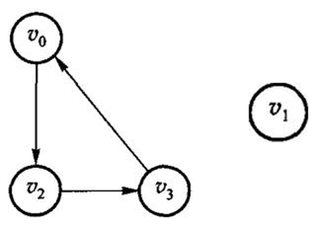

图 7.6　图 7.2(b) 中 $G_2$ 的两个强连通分量：左边是 $\{v_0,v_2,v_3\}$（$v_0\to v_2\to v_3\to v_0$ 成环），右边是只含 $v_1$ 的分量。$G_2$ 本身不是强连通的——$v_1$ 只有入弧，从 $v_1$ 回不到 $v_0$。


无向连通图的生成树，是包含全部顶点、有 $n-1$ 条边、因而没有环的连通子图。带权连通图里边权之和最小的生成树，就是最小生成树。最短路的「短」是边权总和最小，不一定是经过的边数最少。


图 7.7　图 7.2 中 (a) 无向图 $G_1$ 和 (b) 有向图 $G_2$ 的一棵生成树。生成树上再加一条边必成环；边数少于 $n-1$ 则必不连通。

不带简单回路的连通无向图叫自由树，它同样有 $n-1$ 条边。带权的连通图叫网络，图 7.8 的 $G_4$ 就是一个网络——7.5 节的最短路径和 7.6 节的最小生成树都在网络上讨论。


图 7.8　网络实例 $G_4$：带权的连通图。

有向图里也有对应的说法：只有一个顶点入度为 0、其余顶点入度均为 1 的有向图叫有向树；若干棵有向树，弧互不相交、顶点合起来正好是原图的全部顶点，就构成一个生成森林。图 7.9 是一个例子。


图 7.9　(a) 一个有向图；(b) 它的生成森林——两棵有向树，弧互不相交，顶点合起来是原图的全部顶点。


选算法之前，先分清题目：

| 题目 | 前提 | 结果 |
| --- | --- | --- |
| 从一个点能走到哪些点 | 任意图 | DFS 或 BFS 的访问序列 |
| 课程或任务的可行顺序 | 有向无环图 | 拓扑序；有环则无解 |
| 一个源点到各点的最短路 | 边权非负 | Dijkstra 的距离数组 |
| 任意两点最短路 | 顶点数较小 | Floyd 的距离矩阵 |
| 连通所有点且总权最小 | 无向连通图 | Prim 或 Kruskal 的边集 |

本单元用邻接矩阵。没有边记为 `infinity`（`int` 最大值的四分之一，给加法留余量）。环、非连通等正常失败用 `optional` 表达。DFS 仍是递归，深图有栈溢出风险。

## 7.2 图的抽象数据类型

和线性表、树一样，先说清楚图对外提供哪些运算，再谈怎么存。

原书 7.2 节先强调了一件容易被忽略的事：**图的顶点之间本来没有次序**。从逻辑结构看，任何一个顶点都可以当作「第一个」顶点，一个顶点的若干邻接点之间也没有先后。可是一旦按某种存储结构把图建起来，次序就被存储结构定死了——邻接矩阵里的次序是列号，邻接表里的次序是链表的插入次序。所以下文所有「第一条边」「下一条边」说的都是存储结构给出的次序，不是图本身的性质；同一张图换个存法，DFS 的访问序列就可能不同。7.3 节把两种存储结构逐项对拍，正是把这点不确定性钉死：同一张图、同样的建图次序，两种实现必须给出同一个序列。

原书用【代码7.1】把运算列成一个抽象类（下面是修掉 OCR 断字、补齐花括号后的样子，运算和注释照原书）：

```text original-listing="原书【代码7.1】的图 ADT 声明，OCR 把标识符切断、类尾缺右花括号，作为原书记录原样引用"
class Graph {                       // 图的抽象数据类型
public:
  int VerticesNum();                // 返回图的顶点个数
  int EdgesNum();                   // 返回图的边数
  Edge FirstEdge(int oneVertex);    // 返回依附于顶点 oneVertex 的第一条边
  Edge NextEdge(Edge preEdge);      // 返回与 preEdge 有相同顶点的下一条边
  bool setEdge(int fromVertex, int toVertex, int weight);  // 添加边
  bool delEdge(int fromVertex, int toVertex);              // 删除边
  bool IsEdge(Edge oneEdge);        // oneEdge 是否是边
  int FromVertex(Edge oneEdge);     // 返回 oneEdge 的始点
  int ToVertex(Edge oneEdge);       // 返回 oneEdge 的终点
  int Weight(Edge oneEdge);         // 返回 oneEdge 的权
};
```

这份清单里真正的设计决定是 `Edge`：原书不把「顶点 $v$ 的邻居」整个交出去，而是给一对游标运算，让上层算法写成

```text original-listing="原书各周游算法遍历一个顶点出边的固定写法，出自算法7.5–7.11，作为原书记录原样引用"
for (Edge e = G.FirstEdge(v); G.IsEdge(e); e = G.NextEdge(e)) { /* 处理 e */ }
```

于是 DFS、拓扑、Dijkstra 都只依赖这四个运算，不依赖矩阵还是链表——这是原书用一套算法讲两种存储结构的办法。代价有两处：换一种存法就要重写这对游标；`IsEdge` 同时兼任「这是不是一条边」和「游标是否走到头」两种含义。

原书代码7.2 给出这个类的基类实现，它的可复核问题记在 `code/ch07/graph/legacy.md` 里：`Mark`、`Indegree` 两个裸数组在构造里 `new`、只在析构里 `delete[]`，没有拷贝构造和赋值运算符，按值传一次图就会二次释放；`numVertex`、`numEdge` 是 public 数据成员，谁都能改坏；`IsEdge` 用 `oneEdge.weight > 0` 判断边是否存在，于是**权为 0 的合法边被判成不存在**。加上标识符被 OCR 空格切断（`num Vertex = num Vert`），这两段清单都不能照抄。

本书因此不复刻这个抽象基类，直接把运算定义在两个可运行的类上：`Graph`（邻接矩阵，`code/ch07/graph`）和 `GraphList`（邻接表，`code/ch07/adjacency_list`）。对应关系如下。

| 原书运算 | 干什么 | 本书写法 |
| --- | --- | --- |
| `Graph(int numVert)` | 指定顶点数建一张空图 | `Graph::Graph`、`GraphList::GraphList` |
| `VerticesNum()` | 返回顶点个数 | `Graph::vertices`、`GraphList::vertices` |
| `setEdge(f, t, w)` | 添加一条边 | `Graph::add_edge`、`GraphList::add_edge`（末参选有向/无向） |
| `IsEdge(e)` / `Weight(e)` | 问某条边在不在、权多少 | 矩阵直接读 `adjacency_`；邻接表用 `GraphList::weight`，无边返回空 |
| `FirstEdge` / `NextEdge` | 逐条走一个顶点的出边 | 矩阵扫一行；邻接表用 `GraphList::neighbors` 返回该顶点的边表 |
| — | 周游、拓扑、最短路、最小生成树 | `Graph::dfs`、`Graph::bfs`、`Graph::topological_sort`、`Graph::dijkstra`、`Graph::floyd`、`Graph::prim`、`Graph::kruskal` |

`delEdge` 本书没有实现：后面七个算法都不删边，凭空加一个没有测试覆盖的运算，只会多一处无人验证的代码。需要时按 D-001 的规矩补，连测试一起补。

接口上还有一条贯穿全章的约定：**「有环」「不连通」不是异常，是可预期的结果**。所以 `topological_sort`（图里有环）、`prim` 和 `kruskal`（图不连通）返回 `std::optional`，空值本身就是答案；`GraphList::weight` 在两点之间没有边时同样返回空。真正的用法错误才抛异常——顶点下标越界抛 `std::out_of_range`，负权边抛 `std::invalid_argument`（Dijkstra 在负权上不成立，见 7.5.1 节）。原书把这些情况打印到 `cout`，容器里做输出，调用者既拿不到结果也没法测试。

## 7.3 图的存储结构

图常用两种存法。邻接矩阵用 $n\times n$ 的表，$A[i][j]$ 表示 $i$ 到 $j$ 有没有边、权是多少，适合稠密图和需要 $O(1)$ 问「两点之间有没有边」的算法（Floyd、Prim）。邻接表为每个顶点挂一条出边表，适合稀疏图和只沿出边走的算法（DFS、BFS、Dijkstra、拓扑）。

两种都有可运行实现：邻接矩阵是 `code/ch07/graph`（代码7.1–7.3），邻接表是 `code/ch07/adjacency_list`（代码7.4）。两者**逐项对拍**——同一张图上 DFS/BFS 序列、拓扑序、Dijkstra 距离向量必须完全相同，外加 30 轮随机图对拍。换存储方式不该换答案，只该换代价。

### 7.3.1 相邻矩阵

本节沿用原书标题；现代教材通常称为**邻接矩阵**（adjacency matrix）。
邻接矩阵是一个 $V\times V$ 的二维数组；第 `from` 行、第 `to` 列保存弧 `from → to` 的权值。构造时对角线为 0（到自己的距离是 0），其余位置为 `infinity` 表示没有边。无向边要同时写入 $(u,v)$ 和 $(v,u)$ 两格；`add_edge(..., directed=false)` 正是这样做的。零权边是合法的，因此不能再用 0 表示“无边”。

不带权的图只需要记「有没有边」，即 $A[i,j]=1$ 表示 $(v_i,v_j)\in E$，否则为 0。图 7.2 那两张图的相邻矩阵是：

| $A(G_1)$ | $v_0$ | $v_1$ | $v_2$ | $v_3$ | $v_4$ | | $A(G_2)$ | $v_0$ | $v_1$ | $v_2$ | $v_3$ |
| --- | --- | --- | --- | --- | --- | --- | --- | --- | --- | --- | --- |
| $v_0$ | 0 | 0 | 1 | 1 | 0 | | $v_0$ | 0 | 1 | 1 | 0 |
| $v_1$ | 0 | 0 | 0 | 1 | 1 | | $v_1$ | 0 | 0 | 0 | 0 |
| $v_2$ | 1 | 0 | 0 | 1 | 1 | | $v_2$ | 0 | 0 | 0 | 1 |
| $v_3$ | 1 | 1 | 1 | 0 | 0 | | $v_3$ | 1 | 0 | 0 | 0 |
| $v_4$ | 0 | 1 | 1 | 0 | 0 | | | | | | |

图 7.10　(a) 无向图 $G_1$ 与 (b) 有向图 $G_2$ 的相邻矩阵。**无向图的矩阵一定对称**，顶点 $v_i$ 的度就是第 $i$ 行（或第 $i$ 列）之和；有向图的矩阵不一定对称，第 $i$ 行之和是出度，第 $i$ 列之和是入度。

带权图把 1 换成权值，没有边的位置记 $\infty$。图 7.8 的网络 $G_4$ 是：

| $A(G_4)$ | $v_0$ | $v_1$ | $v_2$ | $v_3$ |
| --- | ---: | ---: | ---: | ---: |
| $v_0$ | 0 | 3 | ∞ | 15 |
| $v_1$ | 3 | 0 | 4 | 9 |
| $v_2$ | ∞ | 4 | 0 | 6 |
| $v_3$ | 15 | 9 | 6 | 0 |

图 7.11　带权图 $G_4$ 及其相邻矩阵。对角线是 0（到自己的距离为 0）。本书的实现用 `infinity` 而不是 0 表示无边——**因为权为 0 的边是合法的**，用 0 兼任「无边」会把它误判掉。

矩阵的空间是 $O(V^2)$，无论图中实际有多少条边；查询两点是否相邻为 $O(1)$，但扫描一个顶点的全部邻居要扫完整行，遍历全图通常为 $O(V^2)$。所以它适合稠密图，以及 Floyd、Prim 这类需要频繁随机访问矩阵元素的算法；稀疏图用邻接表会省下大量空间。

### 7.3.2 邻接表

邻接表为每个顶点存一张出边表，**只存实际存在的边**。


图 7.12　无向图 $G_1$ 的邻接表表示。顶点数组的每一项挂一条链，链上是它的邻接点。无向图里**一条边出现两次**（$(u,v)$ 在 $u$ 的表里，也在 $v$ 的表里），所以边表结点共 $2e$ 个。

有向图的一条弧只出现一次，顶点 $v_i$ 的边表长度就是它的**出度**——因此邻接表也叫出边表。想知道入度就得扫遍整张表，于是有了**逆邻接表**（入边表）：把每条弧记在弧头那一侧。

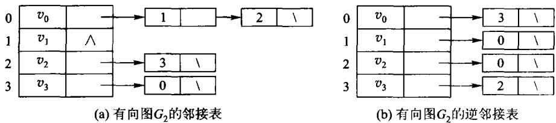

图 7.13　有向图 $G_2$ 的 (a) 邻接表与 (b) 逆邻接表。逆邻接表里 $v_i$ 的边表长度就是它的入度——7.4.3 节拓扑排序要的正是入度。

带权图在边表结点里多存一个权：

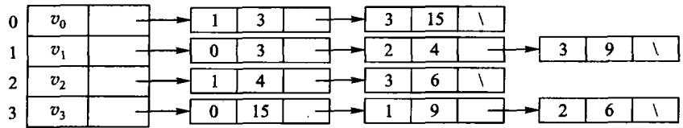

图 7.14　带权图 $G_4$ 的邻接表表示。本书 `GraphList` 的边表结点（`Edge` 结构里的 `to` 与 `weight`）就是这两个域。

代价随之全变：

| | 邻接矩阵 | 邻接表 |
| --- | --- | --- |
| 存储量 | $V^2$ | $V + E$ |
| 遍历某点的邻居 | $O(V)$，要扫过整行 | $O(\deg v)$ |
| 问「$(u,v)$ 之间有没有边」 | $O(1)$ | $O(\deg u)$ |
| DFS / BFS 全图 | $O(V^2)$ | $O(V + E)$ |
| Dijkstra | $O(V^2)$ | $O((V+E)\log V)$（配二叉堆）|

注意第三行：**邻接表在这一项上是吃亏的**。没有哪种表示法总是更好，这正是本节要比较的东西。

结构上的差别只有一处——存的是什么：

```cpp file=code/ch07/adjacency_list/modern.hpp#graph-list
/// 邻接表存图（原书【代码7.4】）：每个顶点挂一条边表，只存**实际存在**的边。
///
/// 与同章 `Graph`（邻接矩阵）的区别只有一处——存储方式——但这一处决定了全部代价：
///
/// | | 邻接矩阵 | 邻接表 |
/// | --- | --- | --- |
/// | 存储量 | $V^2$ | $V + E$ |
/// | 遍历某点的邻居 | $O(V)$，要扫过整行 | $O(\deg v)$，只走这条边表 |
/// | 判断 (u,v) 是否有边 | $O(1)$ | $O(\deg u)$ |
/// | DFS / BFS 全图 | $O(V^2)$ | $O(V + E)$ |
///
/// 稀疏图（$E \ll V^2$）上邻接表快得多；稠密图或频繁问「这两点之间有没有边」时，
/// 矩阵反而合适。**没有哪种表示法总是更好**，这正是本章要比较的东西。
class GraphList {
public:
    static constexpr int infinity = std::numeric_limits<int>::max() / 4;

    struct Edge {
        std::size_t from;
        std::size_t to;
        int weight;

        bool operator<(const Edge& other) const noexcept { return weight < other.weight; }
    };

    explicit GraphList(std::size_t count) : adjacency_(count) {}

    /// 加边。重复加同一条 `from→to` 时**覆盖权值**而不是并存两条——
    /// 与邻接矩阵的语义保持一致，两种表示法才可以逐项对拍。代价是每次加边 O(deg from)。
    void add_edge(std::size_t from, std::size_t to, int weight, bool directed = true) {
        check_vertex(from);
        check_vertex(to);
        if (weight < 0) {
            throw std::invalid_argument("negative edge");
        }
        put(from, to, weight);
        if (!directed) {
            put(to, from, weight);
        }
    }

    [[nodiscard]] std::size_t vertices() const noexcept { return adjacency_.size(); }

    /// 边表里的条目数。无向图一条边会在两端各存一次，这里如实返回条目数。
    [[nodiscard]] std::size_t edge_entries() const noexcept {
        std::size_t total = 0;
        for (const auto& list : adjacency_) {
            total += list.size();
        }
        return total;
    }

    [[nodiscard]] std::size_t degree(std::size_t vertex) const {
        check_vertex(vertex);
        return adjacency_[vertex].size();
    }

    /// 某个顶点的边表。邻接表的核心能力：拿到邻居不必扫过不存在的边。
    [[nodiscard]] const std::vector<Edge>& neighbors(std::size_t vertex) const {
        check_vertex(vertex);
        return adjacency_[vertex];
    }

    [[nodiscard]] std::optional<int> weight(std::size_t from, std::size_t to) const {
        check_vertex(from);
        check_vertex(to);
        for (const Edge& edge : adjacency_[from]) {
            ++scanned_;
            if (edge.to == to) {
                return edge.weight;
            }
        }
        return std::nullopt;  // 没有这条边是预期状态，不是错误
    }

    /// 存储量（按「一个整数算一格」计）。对照矩阵的 $V^2$，稀疏图上差距一目了然。
    [[nodiscard]] std::size_t storage_cells() const noexcept {
        return vertices() + edge_entries() * 2;  // 每条边存 to 和 weight
    }

    /// 已经检查过多少条边。教学计数器：用它把 $O(V+E)$ 和 $O(V^2)$ 的差别量出来。
    [[nodiscard]] std::size_t scan_steps() const noexcept { return scanned_; }
    void reset_scan_steps() const noexcept { scanned_ = 0; }
```

周游时的差别随之而来。矩阵版每出队一个顶点要扫过整行 $V$ 格，邻接表只走这条边表：

```cpp file=code/ch07/adjacency_list/modern.hpp#graph-list-traversal
/// 深度优先周游。只走边表，不看不存在的边——这是与矩阵版最直接的差别。
[[nodiscard]] std::vector<std::size_t> dfs(std::size_t source) const {
    check_vertex(source);
    std::vector<bool> seen(vertices());
    std::vector<std::size_t> result;
    visit_depth_first(source, seen, result);
    return result;
}

[[nodiscard]] std::vector<std::size_t> bfs(std::size_t source) const {
    check_vertex(source);
    std::vector<bool> seen(vertices());
    std::queue<std::size_t> pending;
    std::vector<std::size_t> result;
    pending.push(source);
    seen[source] = true;
    while (!pending.empty()) {
        const std::size_t from = pending.front();
        pending.pop();
        result.push_back(from);
        for (const Edge& edge : adjacency_[from]) {  // 矩阵版这里要扫 V 格
            ++scanned_;
            if (!seen[edge.to]) {
                seen[edge.to] = true;
                pending.push(edge.to);
            }
        }
    }
    return result;
}
```

差距是量出来的，不是推出来的。取一条 1000 个顶点的链（$E = V-1$，典型的稀疏图）：

```cpp file=code/ch07/adjacency_list/demo.cpp
#include "modern.hpp"

#include <cstdio>

int main() {
    using dsa::GraphList;

    // 一条 1000 个顶点的链：典型的稀疏图（E = V - 1）。
    constexpr std::size_t n = 1000;
    GraphList sparse(n);
    for (std::size_t v = 0; v + 1 < n; ++v) {
        sparse.add_edge(v, v + 1, 1);
    }
    sparse.reset_scan_steps();
    const auto order = sparse.bfs(0);
    const std::size_t steps = sparse.scan_steps();
    std::printf("稀疏图 V=%zu, E=%zu\n", n, sparse.edge_entries());
    std::printf("  邻接表存储 %zu 格   ← 随 V+E 走\n", sparse.storage_cells());
    std::printf("  邻接矩阵存储 %zu 格 ← V*V\n", n * n);
    std::printf("  BFS 走遍 %zu 个顶点，只检查了 %zu 条边\n", order.size(), steps);
    std::printf("  邻接矩阵的 BFS 要扫 %zu 格（每出队一个顶点扫一整行）\n", n * n);

    // 教科书例子：最短路与最小生成树。
    GraphList graph(6);
    const int edges[][3] = {{0,1,7},{0,2,9},{0,5,14},{1,2,10},{1,3,15},
                            {2,3,11},{2,5,2},{3,4,6},{5,4,9}};
    for (const auto& e : edges) {
        graph.add_edge(static_cast<std::size_t>(e[0]), static_cast<std::size_t>(e[1]), e[2], false);
    }
    const auto distance = graph.dijkstra(0);
    std::printf("\n从 0 出发的最短距离:");
    for (const int d : distance) {
        std::printf(" %d", d);
    }
    const auto mst = graph.prim(0);
    int total = 0;
    for (const auto& edge : *mst) {
        total += edge.weight;
    }
    std::printf("\n最小生成树 %zu 条边，总权 %d\n", mst->size(), total);
    return 0;
}
```

```text
稀疏图 V=1000, E=999
  邻接表存储 2998 格   ← 随 V+E 走
  邻接矩阵存储 1000000 格 ← V*V
  BFS 走遍 1000 个顶点，只检查了 999 条边
  邻接矩阵的 BFS 要扫 1000000 格（每出队一个顶点扫一整行）

从 0 出发的最短距离: 0 7 9 20 20 11
最小生成树 5 条边，总权 33
```

存储差 300 倍，BFS 的检查次数差 1000 倍。稠密图上这个差距会消失——$E$ 接近 $V^2$ 时，
$V+E$ 也就是 $V^2$，而矩阵还省掉了存 `to` 的那一半空间。

Dijkstra 是这一章里差别最大的一处。矩阵版每轮要扫一遍全部顶点找最近的那个，是 $O(V^2)$；
邻接表配一个最小堆之后，「找最近顶点」由堆负责，「松弛」只走实际存在的边：

```cpp file=code/ch07/adjacency_list/modern.hpp#graph-list-dijkstra
/// Dijkstra，最小堆版。代价 $O((V+E)\log V)$。
///
/// 矩阵版每轮要扫一遍全部顶点找最近的那个，是 $O(V^2)$；换成邻接表 + 堆之后，
/// 「找最近顶点」由堆负责、「松弛」只走实际存在的边。**稀疏图上这才是该用的组合**。
/// 堆是第 5 章的教学内容，这里作为基础设施使用（见 unit.json 的 d001_exceptions）。
[[nodiscard]] std::vector<int> dijkstra(std::size_t source) const {
    check_vertex(source);
    std::vector<int> distance(vertices(), infinity);
    distance[source] = 0;

    using Item = std::pair<int, std::size_t>;  // (当前距离, 顶点)
    std::priority_queue<Item, std::vector<Item>, std::greater<Item>> heap;
    heap.emplace(0, source);
    while (!heap.empty()) {
        const auto [dist, from] = heap.top();
        heap.pop();
        if (dist > distance[from]) {
            continue;  // 堆里的旧条目，已经被更短的路径取代
        }
        for (const Edge& edge : adjacency_[from]) {
            ++scanned_;
            const int relaxed = dist + edge.weight;
            if (relaxed < distance[edge.to]) {
                distance[edge.to] = relaxed;
                heap.emplace(relaxed, edge.to);
            }
        }
    }
    return distance;
}
```

7.5.1 节给出的 $O(V^2)$ 是**矩阵版**的结论，别把它套到邻接表上；反过来，常见教材里那个
$O((V+E)\log V)$ 也不能套到矩阵版上。复杂度是「算法 + 存储结构」一起决定的。

### 7.3.3 十字链表

邻接表只沿出边组织数据；如果还要频繁查询“哪些边指向这个顶点”，就得另存一份逆邻接表。十字链表把两种方向接在同一个弧结点上：`tailnextarc` 串起同一尾点的出边，`headnextarc` 串起同一头点的入边；顶点同时保存 `firstoutarc` 和 `firstinarc`。每条弧只分配一个结点，却能在 $O(\deg^+(v))$ 或 $O(\deg^-(v))$ 时间遍历出边或入边，空间为 $O(V+E)$。

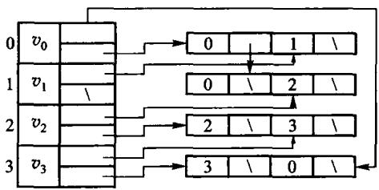

图 7.15　有向图的十字链表示例。每条弧只有一个结点，却同时挂在「同尾」和「同头」两条链上——邻接表与逆邻接表的信息合在了一起，不必存两份。

#### 原书式教学实现：把两次挂接写在眼前

原书 7.3.3 本身只有图和字段说明，没有独立代码清单。这里保留截图所用的传统教材写法：
`ArcBox`、`VexNode`、裸链接和表头插入。它不是把截图伪称为原书逐字代码，而是把图 7.15 的
表示法写成一份可以运行的教学版；为使其能安全结束生命周期，补上了析构并禁止浅拷贝。

```cpp file=code/ch07/orthogonal_graph/teaching.hpp#orthogonal-arcbox
struct ArcBox {
    std::size_t tailvex;       // 弧尾 u
    std::size_t headvex;       // 弧头 v
    ArcBox* tailnextarc;       // 下一条同尾弧
    ArcBox* headnextarc;       // 下一条同头弧
    int info;                  // 权值或其他边属性
};

struct VexNode {
    ArcBox* firstin = nullptr;   // 第一条指向本顶点的弧
    ArcBox* firstout = nullptr;  // 第一条从本顶点出发的弧
};
```

先读这两种结点。`ArcBox` 的前两个域说明“哪条弧”，后两个域说明“这条弧在两条链中各接向哪里”；
`VexNode` 的两个表头则分别给出入链和出链的入口。重点是 `firstin` 与 `firstout` 指向的可以是
同一个 `ArcBox`，并没有第二份边结点。

下面六行就是传统写法最值得保留的地方。先 `new` 出**一个**弧结点；`tailnextarc` 接住旧出链表头，
再改 `firstout`；`headnextarc` 接住旧入链表头，再改 `firstin`。表头插入所以最新插入的弧先被遍历到。

```cpp file=code/ch07/orthogonal_graph/teaching.hpp#orthogonal-teaching-add
void add_edge(std::size_t tail, std::size_t head, int info = 1) {
    check_vertex(tail);
    check_vertex(head);
    auto* arc = new ArcBox{tail, head, vertices_[tail].firstout,
                           vertices_[head].firstin, info};
    vertices_[tail].firstout = arc;  // 接进 tail 的出边链
    vertices_[head].firstin = arc;   // 同一结点接进 head 的入边链
    ++arc_count_;
}
```

`clear()` 沿每个顶点的**出链**释放一次即可，因为每条弧恰好属于一个尾点；绝不能再沿入链释放。
教学版删除复制构造和复制赋值，防止两个图对象析构同一批 `ArcBox`。这些资源边界不改变“一个结点、
两条链”的教学结构，只把短例中通常省略的收尾补齐。

#### 现代实现：所有权集中，双链仍显式

完整可编译类型在 `code/ch07/orthogonal_graph/modern.hpp`。它用
`std::vector<std::unique_ptr<Arc>> arcs_` 集中拥有每个弧结点；`firstin`、`firstout`、
`tailnextarc`、`headnextarc` 仍是裸的**非拥有**链接，因此双链的形状没有被智能指针藏掉。

插入仍是与教学版相同的两次挂接，只是 `owned` 最后移入唯一所有者表：

```cpp file=code/ch07/orthogonal_graph/modern.hpp#orthogonal-modern-add
void add_edge(std::size_t tail, std::size_t head, int info = 1) {
    check_vertex(tail);
    check_vertex(head);
    if (find_arc(tail, head)) {
        throw std::invalid_argument("duplicate edge");
    }

    auto owned = std::make_unique<Arc>(tail, head, info);
    Arc* arc = owned.get();
    arc->tailnextarc = vertices_[tail].firstout;
    vertices_[tail].firstout = arc;
    arc->headnextarc = vertices_[head].firstin;
    vertices_[head].firstin = arc;
    arcs_.push_back(std::move(owned));
}
```

删除最能检验两条链是否真的独立维护：先在尾点出链找到并摘下 `victim`，再在头点入链找到**同一地址**
并摘下，最后从 `arcs_` 移除唯一所有者，析构自动释放结点。若少掉任一次摘链，测试会分别在出边或入边
查询处失败。

```cpp file=code/ch07/orthogonal_graph/modern.hpp#orthogonal-modern-remove
bool remove_edge(std::size_t tail, std::size_t head) {
    check_vertex(tail);
    check_vertex(head);
    Arc** out_link = &vertices_[tail].firstout;
    while (*out_link && (*out_link)->head != head) {
        out_link = &(*out_link)->tailnextarc;
    }
    if (!*out_link) {
        return false;
    }

    Arc* victim = *out_link;
    *out_link = victim->tailnextarc;
    Arc** in_link = &vertices_[head].firstin;
    while (*in_link != victim) {
        in_link = &(*in_link)->headnextarc;
    }
    *in_link = victim->headnextarc;
    arcs_.erase(std::remove_if(arcs_.begin(), arcs_.end(),
                               [victim](const std::unique_ptr<Arc>& owned) {
                                   return owned.get() == victim;
                               }),
                arcs_.end());
    return true;
}
```

#### 把一条弧拆开看

先只看一条弧 $u\to v$。它不是“出边结点复制一份、入边结点再复制一份”，而是**同一个**
弧结点带着两根不同用途的链接：

```text
顶点 u 的 firstoutarc  ->  [tailvex=u | headvex=v | tailnextarc=...]  ->  下一条从 u 出发的弧
                                  ^
顶点 v 的 firstinarc   ->  同一个弧结点                         ->  下一条指向 v 的弧
                                  |
                           headnextarc=...
```

| 域 | 回答的问题 | 沿它走时保持不变的顶点 |
| --- | --- | --- |
| `tailvex` | 这条弧从哪里出发？ | 弧尾，即出边表所属顶点 |
| `headvex` | 这条弧指向哪里？ | 弧头，即入边表所属顶点 |
| `tailnextarc` | 同一个尾点还有哪条下一弧？ | `tailvex` 相同 |
| `headnextarc` | 同一个头点还有哪条下一弧？ | `headvex` 相同 |
| `info` | 权值、容量或其他边属性是什么？ | 不参与两条链的连接 |

因此查“从 $u$ 能去哪里”时，从 `u.firstoutarc` 开始，反复读当前结点的 `headvex`，然后跳
`tailnextarc`；查“谁能到 $v$”时，从 `v.firstinarc` 开始，反复读当前结点的 `tailvex`，然后跳
`headnextarc`。**读的是同一批弧结点，走的是两条不同的 next 链。**这正是“十字”的含义。

例如依次插入 $0\to1$、$0\to2$、$3\to2$，不管新弧接在表头还是表尾，两个查询的逻辑都是：

| 查询 | 起点 | 读取字段 | 下一步 | 得到的顶点 |
| --- | --- | --- | --- | --- |
| 0 的出边 | `firstoutarc[0]` | 每个结点的 `headvex` | `tailnextarc` | 1、2 |
| 2 的入边 | `firstinarc[2]` | 每个结点的 `tailvex` | `headnextarc` | 0、3 |

这也解释了更新为何容易出错：插入 $u\to v$ 时，弧结点必须同时接进 `u` 的出链和 `v` 的入链；
删除时也必须在两条链中各找到一次该结点再摘除。只更新其中一条，表面上“从 $u$ 出发”可能仍正确，
但统计 $v$ 的入度或反向遍历时就会读到陈旧链接。

它适合需要同时维护入度和出度的有向图，例如拓扑排序、依赖图和删除一条弧后的双向更新。代价是插入、删除必须同时维护两条链，指针不变量比普通邻接表多；只沿出边遍历的程序使用邻接表更简单。实现时删除弧要从尾点的出链和头点的入链各摘除一次，不能只改其中一条，否则下一次按另一方向遍历会访问已释放结点。

## 7.4 图的周游

图的周游（traversing graph）是指从图中的某一个顶点出发，按照一定的策略访问图中的每一个顶点，
使得每一个顶点被访问且只被访问一次。**图的周游算法是求解图的连通性问题、拓扑排序和关键路径
等问题的基础。**

图的周游比树的周游复杂，因为**图中每一个顶点都可能和其他顶点相邻接**：某一个顶点被访问后，
还可能经过其他路径又回到这个顶点。为了避免重复访问同一个顶点，在周游图的过程中应该记下顶点
是否已经被访问，若遇到已访问的顶点则不再访问——这就是下面每个算法里那个 `seen` 数组存在的
理由（原书写作 `Mark` 数组，取值 `VISITED` / `UNVISITED`）。

深度优先周游和广度优先周游是两种基本的周游方法，**对有向图和无向图都适用**。

### 先跑一遍

下面这张有向图：`0→1(2)`、`0→2(7)`、`1→2(1)`、`1→3(5)`、`2→3(1)`、`3→4(3)`。从 0 到 4 的最短路是 `0→1→2→3→4`，总权 7，不是那条权为 7 的直达边 `0→2` 再往后走。

```cpp file=code/ch07/graph/demo.cpp
#include "modern.hpp"

#include <iostream>

int main() {
    dsa::Graph graph(5);
    graph.add_edge(0, 1, 2);
    graph.add_edge(0, 2, 7);
    graph.add_edge(1, 2, 1);
    graph.add_edge(1, 3, 5);
    graph.add_edge(2, 3, 1);
    graph.add_edge(3, 4, 3);

    std::cout << "DFS(0):";
    for (std::size_t vertex : graph.dfs(0)) {
        std::cout << ' ' << vertex;
    }
    std::cout << "\nBFS(0):";
    for (std::size_t vertex : graph.bfs(0)) {
        std::cout << ' ' << vertex;
    }

    const auto topo = graph.topological_sort();
    std::cout << "\n拓扑序:";
    if (topo) {
        for (std::size_t vertex : *topo) {
            std::cout << ' ' << vertex;
        }
    } else {
        std::cout << " 无（有环）";
    }

    const auto distance = graph.dijkstra(0);
    std::cout << "\nDijkstra(0->4) = " << distance[4] << '\n';
}
```

```bash
c++ -std=c++17 -Wall -Wextra -Werror -Icode/ch07/graph \
    code/ch07/graph/demo.cpp -o /tmp/graph-demo
/tmp/graph-demo
```

```console
DFS(0): 0 1 2 3 4
BFS(0): 0 1 2 3 4
拓扑序: 0 1 2 3 4
Dijkstra(0->4) = 7
```

若再加上 `4→0` 形成环，`topological_sort()` 返回 `nullopt`。

### 7.4.1 深度优先周游

**深度优先搜索**（depth-first search，DFS）是树的先根次序周游的推广：进入一个顶点就立刻标记
已访问，再沿编号从小到大的出边递归下去；某个顶点的所有邻接点都访问过了，就回退到上一个顶点，
换一条还没走过的边继续。

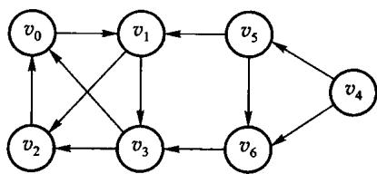

图 7.16　原书用来走深度优先周游的有向图 $G$。从 $v_0$ 出发：访问 $v_0$，取它唯一的邻接点 $v_1$；在 $v_1$ 的边表里 $v_2$ 排在 $v_3$ 前面，于是先进 $v_2$；$v_2$ 除已访问的 $v_0$ 外没有别的邻接点，回退到 $v_1$，再进 $v_3$；$v_3$ 的邻接点都访问过了，一路回退到 $v_0$。此时还有顶点没访问，**再挑一个未访问顶点重新开始**，依次访问 $v_4$、$v_5$、$v_6$。

两点值得记住：一是**图不连通时一次 DFS 走不完**，要在外层对每个未访问顶点再起一次；二是**存储结构一旦定下、源点一旦定下，深度优先序列就是唯一的**——序列不同不是算法不同，是边表次序不同。

**代价取决于存储结构，而不是取决于算法。** 周游图的过程实质上是搜索每个顶点的邻接点的过程，
时间主要耗费在从该顶点出发搜索它的所有邻接点上。对于具有 $n$ 个顶点和 $e$ 条边的无向图或有向
图，深度优先周游算法对图中每个顶点至多调用一次 DFS 函数：**用相邻矩阵表示图时，共需检查 $n^2$
个矩阵元素，所需时间为 $O(n^2)$；用邻接表表示图时，找邻接点需将邻接表中所有边结点检查一遍，
需要时间 $O(e)$，对应的深度优先搜索算法的时间复杂度为 $O(n+e)$。** 这也是 7.3 节那张「稠密图用
矩阵、稀疏图用邻接表」的取舍表在算法侧的直接后果。

```cpp file=code/ch07/graph/modern.hpp#dfs
[[nodiscard]] std::vector<std::size_t> dfs(std::size_t source) const {
    check_vertex(source);
    std::vector<bool> seen(vertices());
    std::vector<std::size_t> result;
    visit_depth_first(source, seen, result);
    return result;
}
```
```python file=code/ch07/graph/modern.py#dfs
def dfs(self, source: int) -> list[int]:
    self._check_vertex(source)
    seen = [False] * self.vertices
    result: list[int] = []

    def visit(vertex: int) -> None:
        seen[vertex] = True
        result.append(vertex)
        for target in range(self.vertices):
            if self._adjacency[vertex][target] < self.infinity and not seen[target]:
                visit(target)

    visit(source)
    return result
```

### 7.4.2 广度优先周游

系统地访问图的所有顶点的另一个方法是**广度优先搜索**（breadth-first search，BFS）。其周游的过程
是：从图中的某个顶点 $v$ 出发，访问并标记了顶点 $v$ 之后，**横向**搜索 $v$ 的所有邻接点
$u_1, u_2, \cdots, u_t$；在依次访问 $v$ 的各个未被访问的邻接点之后，再从这些邻接点出发，依次访问
与它们邻接的所有未曾访问过的顶点。重复上述过程，直至图中所有与源点 $v$ 有路径相通的顶点都被
访问过为止。若 $G$ 是连通图则周游完成；否则，在图 $G$ 中选一个尚未访问的顶点作为新源点继续
广度优先搜索。

例如对于图 7.16 所示的有向图 $G$：首先访问 $v_0$ 和 $v_0$ 的邻接点 $v_1$，然后访问顶点 $v_1$ 的所有
邻接点 $v_2$ 和 $v_3$；由于顶点 $v_2$ 和 $v_3$ 的所有邻接点都已经被访问过，选择未被访问过的顶点
$v_4$ 继续广度优先搜索，即访问顶点 $v_4$ 和 $v_4$ 的邻接点 $v_5$、$v_6$。

**广度优先搜索的过程类似于树的按层次次序周游**（5.2.3 节），可以使用 FIFO 队列保存已访问过的
顶点，从而使得先访问的顶点的邻接点在下一轮被优先访问到：在搜索过程中，每访问到一个顶点后将
其入队，当队头元素出队时将其未被访问的邻接点入队，**每个顶点只入队一次**。

广度优先搜索实质上与深度优先相同，只是访问顺序不同而已，**二者的时间复杂度也相同**。

```cpp file=code/ch07/graph/modern.hpp#bfs
[[nodiscard]] std::vector<std::size_t> bfs(std::size_t source) const {
    check_vertex(source);
    std::vector<bool> seen(vertices());
    std::queue<std::size_t> queue;
    std::vector<std::size_t> result;
    queue.push(source);
    seen[source] = true;
    while (!queue.empty()) {
        const std::size_t from = queue.front();
        queue.pop();
        result.push_back(from);
        for (std::size_t to = 0; to < vertices(); ++to) {
            if (adjacency_[from][to] < infinity && !seen[to]) {
                seen[to] = true;
                queue.push(to);
            }
        }
    }
    return result;
}
```
```python file=code/ch07/graph/modern.py#bfs
def bfs(self, source: int) -> list[int]:
    self._check_vertex(source)
    seen = [False] * self.vertices
    queue = [source]
    head = 0
    seen[source] = True
    result: list[int] = []
    while head < len(queue):
        vertex = queue[head]
        head += 1
        result.append(vertex)
        for target in range(self.vertices):
            if self._adjacency[vertex][target] < self.infinity and not seen[target]:
                seen[target] = True
                queue.append(target)
    return result
```

### 7.4.3 拓扑排序

有向图的边可以看做顶点之间制约关系的描述。在工程实践中，有些工程的进行经常受到一定条件的
约束，例如一个工程项目通常由若干个子工程组成，某些子工程完成之后另一些子工程才能开始。

一个无环的有向图称为**有向无环图**（directed acyclic graph，DAG），常用来描述一个过程或一个系统
的进行过程。对于有向无环图 $G = \langle V, E \rangle$，如果顶点序列满足「存在顶点 $v_i$ 到 $v_j$ 的
一条路径，那么在序列中顶点 $v_i$ 必在顶点 $v_j$ 之前」，顶点集合 $V$ 的这种线性序列称做一个
**拓扑序列**（topological order）；根据有向图建立拓扑序列的过程称为**拓扑排序**（topological sorting）。
对有向无环图的顶点进行拓扑排序，对应于实际问题就是对各项子工程排出一个线性顺序关系；如果
条件限制这些工作必须串行，就应该按拓扑次序安排依次执行。**拓扑排序可以解决先决条件问题**，
即以某种线性顺序来组织多项任务，以便能够在满足先决条件的情况下逐个完成各项任务。

原书的例子是课程先修关系：顶点是课程，弧 $\langle c_i,c_j\rangle$ 表示 $c_i$ 是 $c_j$ 的先修课。
$c_0$ 高等数学、$c_1$ 程序设计基础没有先修课；$c_2$ 离散数学要先修 $c_0$、$c_1$；$c_3$ 数据结构要先修
$c_1$、$c_2$；$c_4$ 算法语言要先修 $c_1$；$c_5$ 编译原理要先修 $c_3$、$c_4$；$c_6$ 操作系统要先修
$c_3$、$c_8$；$c_7$ 普通物理要先修 $c_0$；$c_8$ 计算机原理要先修 $c_7$。


图 7.17　表示课程优先关系的有向无环图。它的拓扑序列可以是 $(c_0,c_1,c_2,c_3,c_4,c_5,c_7,c_8,c_6)$，也可以是 $(c_0,c_7,c_8,c_1,c_4,c_2,c_3,c_6,c_5)$——**拓扑序不唯一**，学生按其中任何一个排课都不会先修颠倒。

**拓扑排序的方法**是两步的反复：① 从有向图中选出一个没有前驱（入度为 0）的顶点并输出；
② 删除图中该顶点和所有以它为起点的弧。不断重复这两个步骤，会出现两种情形：要么有向图中顶点
全部被输出，要么当前图中不存在没有前驱的顶点。当图中的顶点全部输出时，就完成了拓扑排序；
**当图中还有顶点没有输出时，说明有向图中含有环——可见拓扑排序可以顺便检查有向图是否存在环**。

以图 7.17 为例：$c_0$ 和 $c_1$ 没有前驱，可以选其中任何一个输出。假设先输出 $c_0$，删除顶点 $c_0$
和弧 $\langle c_0,c_2 \rangle$、$\langle c_0,c_7 \rangle$ 之后，顶点 $c_1$ 和 $c_7$ 没有前驱，则不妨从中选择
$c_1$ 输出，然后删去顶点 $c_1$ 和弧 $\langle c_1,c_2 \rangle$、$\langle c_1,c_3 \rangle$、$\langle c_1,c_4 \rangle$；
依次类推，就可以得到有向无环图的拓扑有序序列。

具体实现时，用邻接表作为存储结构，每个顶点中加入一个存放该顶点入度的域（indegree），这样检查
顶点数组就可以方便地找出入度为 0 的顶点；删除该顶点及以它为尾的弧，即将边表中所有弧头顶点的
入度减 1。**为了减少查找入度为 0 的顶点的次数**，可以把入度为 0 的顶点构造成一个队列，使得每次
查找时只要从队列中取出第一个顶点即可，而不必检查整个顶点表；删除入度为 0 的顶点后，如果此时
某个顶点的入度减为 0，就将其插入队列。若最终取出的点数少于顶点数，图里有环。

```cpp file=code/ch07/graph/modern.hpp#topological
[[nodiscard]] std::optional<std::vector<std::size_t>> topological_sort() const {
    std::vector<std::size_t> indegree(vertices());
    for (std::size_t from = 0; from < vertices(); ++from) {
        for (std::size_t to = 0; to < vertices(); ++to) {
            if (from != to && adjacency_[from][to] < infinity) {
                ++indegree[to];
            }
        }
    }
    std::queue<std::size_t> queue;
    for (std::size_t vertex = 0; vertex < vertices(); ++vertex) {
        if (indegree[vertex] == 0) {
            queue.push(vertex);
        }
    }
    std::vector<std::size_t> result;
    while (!queue.empty()) {
        const std::size_t from = queue.front();
        queue.pop();
        result.push_back(from);
        for (std::size_t to = 0; to < vertices(); ++to) {
            if (from != to && adjacency_[from][to] < infinity && --indegree[to] == 0) {
                queue.push(to);
            }
        }
    }
    return result.size() == vertices() ? std::optional<std::vector<std::size_t>>(result)
                                       : std::nullopt;
}
```
```python file=code/ch07/graph/modern.py#topological
def topological_sort(self) -> list[int] | None:
    indegree = [0] * self.vertices
    for source in range(self.vertices):
        for target in range(self.vertices):
            if source != target and self._adjacency[source][target] < self.infinity:
                indegree[target] += 1
    queue = [vertex for vertex in range(self.vertices) if indegree[vertex] == 0]
    head = 0
    result: list[int] = []
    while head < len(queue):
        source = queue[head]
        head += 1
        result.append(source)
        for target in range(self.vertices):
            if source != target and self._adjacency[source][target] < self.infinity:
                indegree[target] -= 1
                if indegree[target] == 0:
                    queue.append(target)
    return result if len(result) == self.vertices else None
```

## 7.5 最短路径

旅客要从 A 城到 B 城，希望路程最短：顶点是城市、边是交通线、权是里程，问题就是找权值之和最小的那条路径。

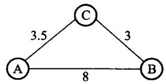

图 7.18　最短路径的示例：从 A 到 B 的最短路径是 A→C→B，**并不是边数最少的那条**。路径上的第一个顶点叫源点(source)，最后一个叫汇点(sink)。下面两小节分别讨论单源最短路径和每对顶点之间的最短路径。

### 7.5.1 单源最短路径

给定一个带权图 $G = \langle V, E \rangle$，其中每条边 $(v_i, v_j)$ 上的权 $W[v_i, v_j]$ 是一个非负实数，
另外给定 $V$ 中的一个顶点 $s$ 充当源点；要计算从源点 $s$ 到所有其他各顶点的最短路径，这个问题
通常称为**单源最短路径**（single-source shortest paths）问题。

解决它的一个常用算法是 **Dijkstra 算法**，由 E. W. Dijkstra 提出，是一种**按路径长度递增的次序
产生到各顶点最短路径的贪心算法**。基本思想是把图的顶点集合划分成两个集合 $S$ 和 $V-S$：
$S$ 表示最短距离已经确定的顶点集，其余顶点放在 $V-S$ 中。初始时 $S$ 只包含源点，即
$S = \{s\}$，此时只有源点到自己的最短距离是已知的。

设 $v$ 是 $V$ 中的某个顶点，把从源点 $s$ 到顶点 $v$ 且**中间只经过集合 $S$ 中顶点**的路径称为从源点
到 $v$ 的**特殊路径**，并用数组 $D$ 记录当前所找到的、从源点 $s$ 到每个顶点的最短特殊路径长度。
$D$ 的初始状态是：如果从 $s$ 到 $v$ 有弧，则 $D[v]$ 记为弧的权值，否则置为无穷大。Dijkstra 算法
每次从尚未确定最短路径长度的集合 $V-S$ 中取出一个最短特殊路径长度最小的顶点 $u$，将 $u$ 加入
集合 $S$，同时修改数组 $D$ 中由 $s$ 可达的最短路径长度：若加进 $u$ 做中间顶点使得 $v_i$ 的最短特殊
路径长度变短，则修改 $v_i$ 的距离值（即当 $D[u] + W[u, v_i] < D[v_i]$ 时，令 $D[v_i] = D[u] + W[u, v_i]$）——
这一步通常称为**松弛**。重复上述操作，一旦 $S$ 包含了所有 $V$ 中的顶点，$D$ 中各顶点的距离值就
记录了从源点 $s$ 到该顶点的最短路径长度。

**要输出路径本身，还需要一个 `pre` 域**：记录从源点到顶点 $v$ 的最短路径上 $v$ 前面经过的那个顶点。
初始时对所有 $v \ne s$ 均设其前一个顶点为 $s$；更新最短路径长度时，只要 $D[u] + W[u,v] < D[v]$
就设置 $v$ 的前一个顶点为 $u$，否则不做修改。算法终止时，顺着 `pre` 一路回溯就得到完整路径。

**代价取决于用什么挑「最小的那个」。** 对于 $n$ 个顶点 $e$ 条边的图，图中的任何一条边都可能在最短
路径中出现，因此最短路径算法对每条边至少都要检查一次。原书【算法7.8】采用**最小堆**来选择权值
最小的边，每次改变最短特殊路径长度时需要对堆进行一次重排，时间复杂度为 $O((n+e)\log e)$，
**适合于稀疏图**；如果像 Prim 算法那样，通过直接比较 $D$ 数组元素来确定代价最小的边，则需要总
时间 $O(n^2)$，取出顶点后修改最短特殊路径长度共需要 $O(e)$，因此共需 $O(n^2)$，**这种方法适合于
稠密图**。

边权必须非负。


图 7.19　单源最短路径的示例。已确定的顶点集合每轮扩大一个：从「尚未确定」的顶点里挑距离最小的那个，它的距离**此后不会再变小**——因为任何绕道都要先经过一个距离不更小的顶点，而边权非负。这条论证正是 Dijkstra 要求非负权的地方，本书的实现因此在 `add_edge` 就拒绝负权。

```cpp file=code/ch07/graph/modern.hpp#dijkstra
[[nodiscard]] std::vector<int> dijkstra(std::size_t source) const {
    check_vertex(source);
    std::vector<int> distance(vertices(), infinity);
    std::vector<bool> used(vertices());
    distance[source] = 0;
    for (std::size_t count = 0; count < vertices(); ++count) {
        const std::size_t from = nearest_unvisited(distance, used);
        if (from == vertices() || distance[from] == infinity) {
            break;
        }
        used[from] = true;
        for (std::size_t to = 0; to < vertices(); ++to) {
            if (adjacency_[from][to] < infinity &&
                distance[to] > distance[from] + adjacency_[from][to]) {
                distance[to] = distance[from] + adjacency_[from][to];
            }
        }
    }
    return distance;
}
```
```python file=code/ch07/graph/modern.py#dijkstra
def dijkstra(self, source: int) -> list[int]:
    self._check_vertex(source)
    distance = [self.infinity] * self.vertices
    used = [False] * self.vertices
    distance[source] = 0
    for _ in range(self.vertices):
        vertex = self._nearest(distance, used)
        if vertex is None or distance[vertex] == self.infinity:
            break
        used[vertex] = True
        for target in range(self.vertices):
            candidate = distance[vertex] + self._adjacency[vertex][target]
            if self._adjacency[vertex][target] < self.infinity and candidate < distance[target]:
                distance[target] = candidate
    return distance
```

### 7.5.2 每对顶点之间的最短路径

给定带权图 $G = \langle V, E \rangle$，要求对任意的顶点有序对 $\langle v_i, v_j \rangle$ 找出从 $v_i$ 到 $v_j$ 的
最短路径，这个问题通常称为**所有顶点对之间的最短路径**（all-pairs shortest paths）问题。

解决它可以每次以一个顶点为源点、重复执行 Dijkstra 算法 $n$ 次，时间复杂度为 $O(n^3)$。下面介绍
**Floyd 算法**，它是一个典型的**动态规划法**：先自底向上分别求解子问题的解，然后由这些子问题的解
得到原问题的解；时间复杂度也是 $O(n^3)$，但形式上比较简单。

Floyd 算法用相邻矩阵 $adj$ 表示带权有向图，基本思想是：初始化 $adj^{(0)}$ 为相邻矩阵 $adj$，在
$adj^{(0)}$ 上做 $n$ 次迭代，递归地产生一个矩阵序列 $adj^{(1)}, \cdots, adj^{(k)}, \cdots, adj^{(n)}$。其中，
**经过第 $k$ 次迭代，$adj^{(k)}[i,j]$ 的值等于从顶点 $v_i$ 到 $v_j$ 路径上所经过的顶点序号不大于 $k$ 的
最短路径长度。**

推导只有两种情况：进行第 $k$ 次迭代时已求得矩阵 $adj^{(k-1)}$，那么从 $v_i$ 到 $v_j$ 中间顶点序号不
大于 $k$ 的最短路径，要么**中间不经过顶点 $v_k$**，此时 $adj^{(k)}[i,j] = adj^{(k-1)}[i,j]$；要么**中间经过
$v_k$**，此时这条路径由两段组成——从 $v_i$ 到 $v_k$ 且中间顶点序号不大于 $k-1$ 的最短路径，加上
从 $v_k$ 到 $v_j$ 且中间顶点序号不大于 $k-1$ 的最短路径。综合两种情况：

$$adj^{(k)}[i,j] = \min\{adj^{(k-1)}[i,j], \; adj^{(k-1)}[i,k] + adj^{(k-1)}[k,j]\}$$

这样 $adj^{(n)}[i,j]$ 就是所要求的从 $v_i$ 到 $v_j$ 的最短路径长度。

**要输出路径本身**，可以设置一个 $n \times n$ 的矩阵 $path$：$path[i,j]$ 是由 $v_i$ 到 $v_j$ 的最短路径上
排在 $v_j$ 前面的那个顶点——当 $k$ 在 Floyd 算法中使得 $adj^{(k)}[i,j]$ 达到最小值，就置
$path[i,j] = k$；如果当前没有最短路径，就将 $path[i,j]$ 置为 $-1$。

具体到实现：Floyd 枚举中转点 `via`，比较 `from→to` 与 `from→via→to`。测试里五个源点的 Dijkstra
与 Floyd 逐项对拍。

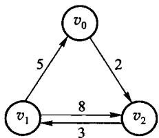

图 7.20　每对顶点间最短路径的示例。Floyd 从相邻矩阵 $adj^{(0)}$ 出发，第 $k$ 轮允许把 $v_k$ 当中转点，得到 $adj^{(k)}$；$n$ 轮之后每一格就是最短路径长度（原书图 7.21 逐轮列出了这个迭代过程）。三重循环的次序不能换：**中转点必须在最外层**，否则 $adj^{(k)}$ 还没算完就被拿去用了。

```cpp file=code/ch07/graph/modern.hpp#floyd
[[nodiscard]] std::vector<std::vector<int>> floyd() const {
    auto distance = adjacency_;
    for (std::size_t via = 0; via < vertices(); ++via) {
        for (std::size_t from = 0; from < vertices(); ++from) {
            for (std::size_t to = 0; to < vertices(); ++to) {
                if (distance[from][via] < infinity && distance[via][to] < infinity) {
                    distance[from][to] = std::min(
                        distance[from][to], distance[from][via] + distance[via][to]);
                }
            }
        }
    }
    return distance;
}
```
```python file=code/ch07/graph/modern.py#floyd
def floyd(self) -> list[list[int]]:
    distance = [list(row) for row in self._adjacency]
    for via in range(self.vertices):
        for source in range(self.vertices):
            for target in range(self.vertices):
                candidate = distance[source][via] + distance[via][target]
                if distance[source][via] < self.infinity and distance[via][target] < self.infinity:
                    distance[source][target] = min(distance[source][target], candidate)
    return distance
```

## 7.6 最小生成树

回到本章开始提到的例子：假设要在 $n$ 个城市之间建立通信网络，要在最节省经费的情况下建立这个
网络，则联通 $n$ 个城市只需要 $n-1$ 条线路——如何在这些可能的线路中选择 $n-1$ 条使得总花费
最小，就是**最小生成树问题**。目标不是任意两点最短，而是连通全部顶点且选中边的总权最小。

图 $G$ 的**生成树**是一棵包含 $G$ 的所有顶点的树，树上所有权值总和表示代价；在 $G$ 的所有生成树中，
代价最小的生成树称为图 $G$ 的**最小生成树**（minimum-cost spanning tree，MST）。构造最小生成树
有多种算法，本节介绍 Prim 算法和 Kruskal 算法。

Prim 和 Kruskal 都是贪心算法，都靠同一条性质站住脚，**MST 性质**：设 $U$ 是顶点集 $V$ 的非空真子集，若 $(u,v)$ 是所有一端在 $U$、另一端在 $V-U$ 的边里权最小的一条，则一定存在一棵包含 $(u,v)$ 的最小生成树。

反证：假设某棵最小生成树 $T$ 不含 $(u,v)$。把 $(u,v)$ 加进 $T$ 必成一个回路，回路上一定另有一条边 $(u',v')$ 同样跨在 $U$ 与 $V-U$ 之间：

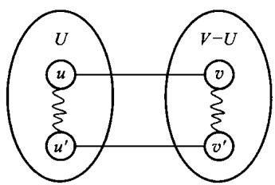

图 7.22　含 $(u,v)$ 的回路。删掉 $(u',v')$ 就消掉了回路，得到另一棵生成树 $T'$；因为 $W(u,v) \le W(u',v')$，$T'$ 的代价不比 $T$ 大，于是 $T'$ 也是最小生成树，且含 $(u,v)$——与假设矛盾。

这条性质就是两个算法「每一步都可以放心地取当前最小的那条跨界边」的依据。下面两小节都拿同一张带权图举例：

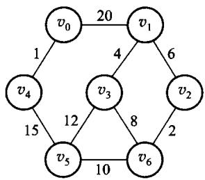

图 7.23　本节两个算法共用的带权图。

### 7.6.1 Prim 算法

设 $G = \langle V, E \rangle$ 是一个连通的带权图，$V$ 是顶点的集合，$E$ 是边的集合，$TE$ 为最小生成树
的边的集合。则 Prim 算法通过以下步骤得到最小生成树：

1. **初始状态**：$U = \{u_0\}$，$TE = \{\}$，其中 $u_0$ 是顶点集合 $V$ 中的某一个顶点；
2. 在所有 $u \in U$、$v \in V-U$ 的边 $(u,v) \in E$ 中找一条权值最小的边 $(u_0, v_0)$，将这条边加进
   集合 $TE$ 中，同时将此边的另一顶点 $v_0$ 并入 $U$；
3. 如果 $U = V$ 则算法结束，否则重复步骤 2。

算法结束时 $TE$ 中包含了 $G$ 中的 $n-1$ 条边，经过上述步骤选取到的所有边恰好就构成了图 $G$ 的
一棵最小生成树。具体到实现：从指定源点生长，每次把离当前树最近的顶点加进来；非连通则返回
`nullopt`。

**Prim 与 Dijkstra 非常像，差别只有一处。** 两者都反复「从集合外挑一个距离值最小的顶点并入
集合」，但 **Prim 的距离值不需要累积，直接采用「离集合最近的边距」**，而 Dijkstra 累积的是从源点
起的整条路径长度。时间复杂度也与 Dijkstra 相同：通过直接比较 $D$ 数组元素确定代价最小的边需要
总时间 $O(n^2)$，取出权最小的顶点后修改 $D$ 数组共需要 $O(e)$，因此共需 $O(n^2)$，**适合于稠密图**。

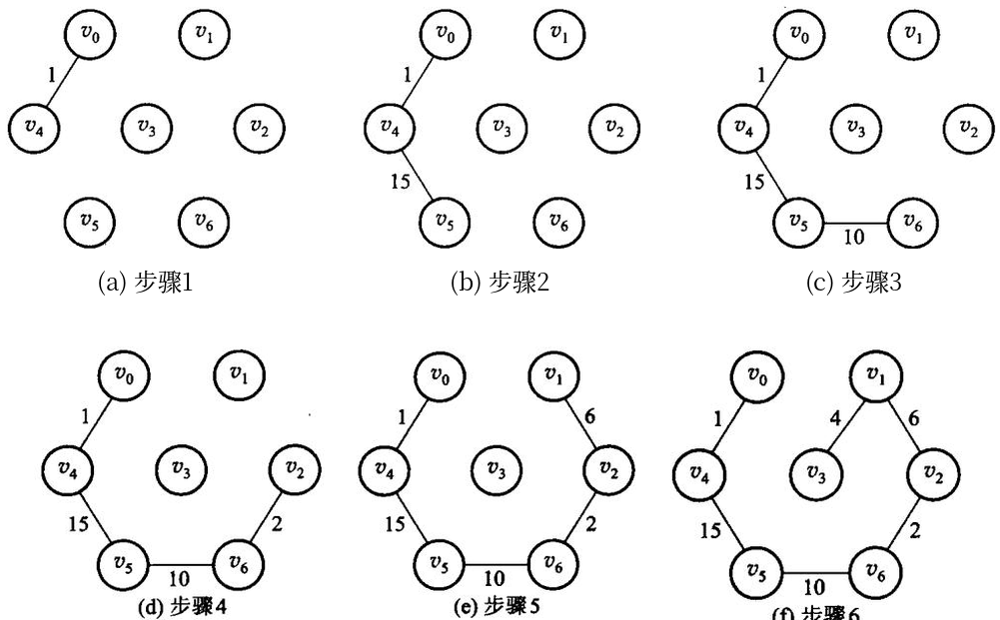

图 7.24　Prim 算法在图 7.23 上的六个步骤。注意每一步长出来的都是**一棵连着的树**——这正是它与 Kruskal 的区别。

```cpp file=code/ch07/graph/modern.hpp#prim
[[nodiscard]] std::optional<std::vector<Edge>> prim(std::size_t source) const {
    check_vertex(source);
    std::vector<int> distance(vertices(), infinity);
    std::vector<std::size_t> predecessor(vertices());
    std::vector<bool> used(vertices());
    std::vector<Edge> result;
    distance[source] = 0;
    for (std::size_t count = 0; count < vertices(); ++count) {
        const std::size_t from = nearest_unvisited(distance, used);
        if (from == vertices() || distance[from] == infinity) {
            return std::nullopt;
        }
        used[from] = true;
        if (from != source) {
            result.push_back({predecessor[from], from, distance[from]});
        }
        for (std::size_t to = 0; to < vertices(); ++to) {
            if (!used[to] && adjacency_[from][to] < distance[to]) {
                distance[to] = adjacency_[from][to];
                predecessor[to] = from;
            }
        }
    }
    return result;
}
```
```python file=code/ch07/graph/modern.py#prim
def prim(self, source: int) -> list[Edge] | None:
    self._check_vertex(source)
    distance = [self.infinity] * self.vertices
    predecessor = [0] * self.vertices
    used = [False] * self.vertices
    result: list[Edge] = []
    distance[source] = 0
    for _ in range(self.vertices):
        vertex = self._nearest(distance, used)
        if vertex is None or distance[vertex] == self.infinity:
            return None
        used[vertex] = True
        if vertex != source:
            result.append(Edge(predecessor[vertex], vertex, distance[vertex]))
        for target in range(self.vertices):
            if not used[target] and self._adjacency[vertex][target] < distance[target]:
                distance[target] = self._adjacency[vertex][target]
                predecessor[target] = vertex
    return result
```

### 7.6.2 Kruskal 算法

构造最小生成树的另一个常用算法是 Kruskal 算法。**它使用的贪心准则是：从剩下的边中选择不会
产生回路且具有最小权值的边，加入到生成树的边集中。**

给定含有 $n$ 个顶点和 $e$ 条边的无向连通带权图 $G = \langle V, E \rangle$，Kruskal 算法的构造思想是：
首先将 $G$ 中的 $n$ 个顶点看成是独立的 $n$ 个连通分量，这时的状态是有 $n$ 个顶点而无边的森林，
可以记为 $T = \langle V, \{\} \rangle$；然后在 $E$ 中选择代价最小的边，**如果该边依附于两个不同的连通
分支，那么将这条边加入到 $T$ 中，否则舍去这条边而选择下一条代价最小的边**；依次类推，直到 $T$
中所有顶点都在同一个连通分量中为止，此时就得到图 $G$ 的一棵最小生成树。

具体到实现：把边按权排序，用并查集跳过会形成环的边。**Kruskal 算法的时间复杂度为 $O(e\log e)$，
主要取决于边数，因此适合于构造稀疏图的最小生成树**——这正好与适合稠密图的 Prim 算法互补。
连通图上两者得到相同总权、`n-1` 条边。

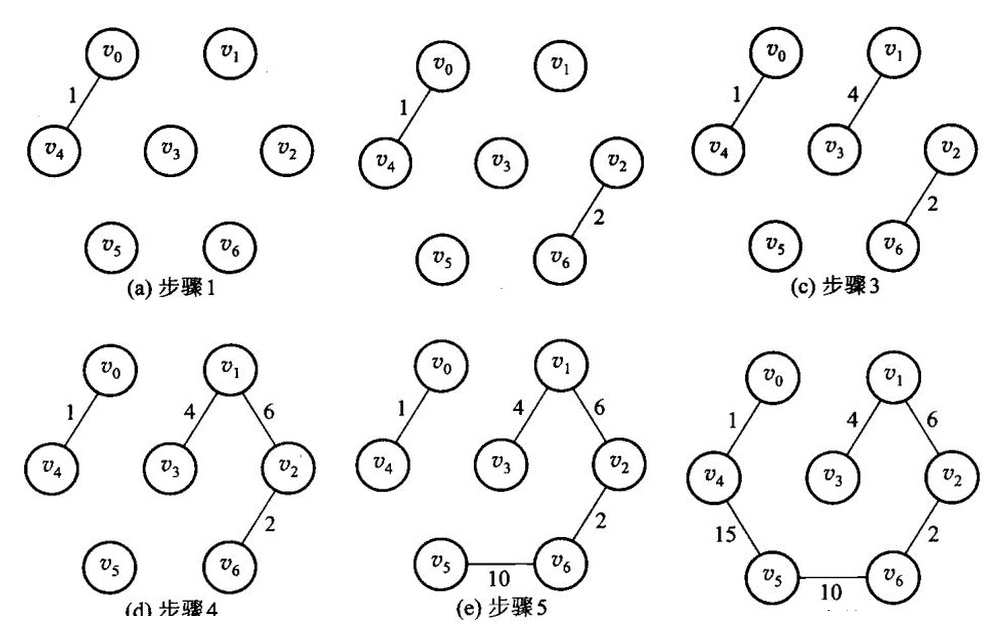

图 7.25　Kruskal 算法在同一张图 7.23 上的步骤。中间过程是**一片森林**，直到最后才连成一棵树；判断「这条边会不会成环」就是判断两个端点是不是已经在同一棵树里——这正是第 6 章并查集的用处。两个算法走的路不同，得到的总权相同。

```cpp file=code/ch07/graph/modern.hpp#kruskal
[[nodiscard]] std::optional<std::vector<Edge>> kruskal() const {
    std::vector<Edge> edges;
    for (std::size_t from = 0; from < vertices(); ++from) {
        for (std::size_t to = from + 1; to < vertices(); ++to) {
            if (adjacency_[from][to] < infinity) {
                edges.push_back({from, to, adjacency_[from][to]});
            }
        }
    }
    std::sort(edges.begin(), edges.end());
    std::vector<std::size_t> parent(vertices());
    for (std::size_t vertex = 0; vertex < vertices(); ++vertex) {
        parent[vertex] = vertex;
    }
    std::vector<Edge> result;
    for (const Edge& edge : edges) {
        const std::size_t from_root = find_root(parent, edge.from);
        const std::size_t to_root = find_root(parent, edge.to);
        if (from_root != to_root) {
            parent[from_root] = to_root;
            result.push_back(edge);
        }
    }
    return result.size() + 1 == vertices() ? std::optional<std::vector<Edge>>(result)
                                            : std::nullopt;
}
```
```python file=code/ch07/graph/modern.py#kruskal
def kruskal(self) -> list[Edge] | None:
    edges = [Edge(source, target, self._adjacency[source][target])
             for source in range(self.vertices) for target in range(source + 1, self.vertices)
             if self._adjacency[source][target] < self.infinity]
    for end in range(len(edges) - 1, 0, -1):
        for index in range(end):
            if edges[index].weight > edges[index + 1].weight:
                edges[index], edges[index + 1] = edges[index + 1], edges[index]
    parent = list(range(self.vertices))

    def root(vertex: int) -> int:
        while parent[vertex] != vertex:
            parent[vertex] = parent[parent[vertex]]
            vertex = parent[vertex]
        return vertex

    result: list[Edge] = []
    for edge in edges:
        left = root(edge.source)
        right = root(edge.target)
        if left != right:
            parent[left] = right
            result.append(edge)
    return result if len(result) + 1 == self.vertices else None
```


## 本章小结

本章介绍了图的基本概念以及图的重要运算，**重点是图的存储结构、图的周游、拓扑排序、最短路径、
最小生成树等相关算法**。

首先介绍了图的相关定义和抽象数据类型。图可以分为无向图和有向图，这两种图中含有一些对应的
概念，例如边和弧、度和出度/入度、连通分量和强连通分量等；在图的定义中还给出了子图、带权图等概念。

**图有 3 种主要存储结构：相邻矩阵表示法、邻接表表示法和十字链表表示法。** 相邻矩阵用数组表示顶点
间相邻关系的矩阵；图的邻接表由顶点表和边表组成，把依附于同一个顶点的边（或弧）存放在同一个边表
中；十字链表是有向图的另一种链式存储结构，可以看做有向图的邻接表和逆邻接表的结合。相邻矩阵
表示法与邻接表表示法有以下差异：

1. **相邻矩阵适合存储稠密图，邻接表适合存储稀疏图；**
2. 求无向图顶点的度时采用这两种存储结构都比较容易，求有向图顶点的出度时采用相邻矩阵更方便；
3. 判断是否是图中的边，相邻矩阵更容易；
4. 求边数 $e$，相邻矩阵耗时为 $O(n^2)$、与 $e$ 无关，邻接表的耗时为 $O(n+e)$。

图的周游是指从图中的某一个顶点出发，按照一定的策略访问图中的每一个顶点，使得每一个顶点被访问
且只被访问一次。**图的深度优先搜索（DFS）类似于树的先根次序周游**，采用的搜索方法的特点是尽可能
先对纵深方向进行搜索；**广度优先搜索（BFS）的基本思想是「先被访问的顶点的邻接点」先于「后被访问
的顶点的邻接点」被访问**。

对一个有向无环图进行拓扑排序，是将图中所有顶点排成一个线性序列，使得弧尾在弧头之前出现。
算法的实现思想是：反复选择入度为 0 的顶点输出并删除该顶点涉及的所有边。

**单源最短路径和所有顶点对之间的最短路径是两类在带权图上寻找最短路径的问题。** 解决单源最短路径
问题的常用算法是 Dijkstra 算法，求所有顶点对之间的最短路径使用 Floyd 算法；**其中 Floyd 算法是
比较典型的动态规划，而 Dijkstra 算法是贪心算法**。

构造最小生成树的算法有 Prim 算法和 Kruskal 算法。Prim 算法与 Dijkstra 算法类似，具体操作是从
图中的一个顶点开始，把这个顶点包括在 MST 中，然后反复寻找一个顶点已在 MST 中而另一个顶点还不
在 MST 中的最小权边，把新边和新结点加入到生成树中，**Prim 算法适合于稠密图**；Kruskal 算法的
构造思想是将 $G$ 中的 $n$ 个顶点看成是独立的 $n$ 个连通分量，然后在边集中选择代价最小且依附于
不同连通分支的边加入到生成树中，**Kruskal 算法较适合于稀疏图**。

本章实现使用邻接矩阵，因此当前 Dijkstra 和 Prim 的直接实现是 $O(V^2)$，Floyd 是 $O(V^3)$，空间是
$O(V^2)$。改用邻接表并配合二叉堆之后，稀疏图上的 Dijkstra 达到 $O((V+E)\log V)$——
这一条现在有实现和实测支撑，见 7.3.2 与 `code/ch07/adjacency_list`。两个结论各自对应
各自的存储结构，不能互相套用。

## 习题

### 补充算法设计题（参考课程第 7 章）

1. 在 DAG 中设计关键路径算法，计算每个顶点的最早发生时间和工程总工期。
2. 说明为什么不能给所有边统一加常数后继续使用 Dijkstra；给出负权边反例。
3. 证明 Dijkstra 得到的是最短路树而不一定是最小生成树。

1. 分别画出 4 个顶点的无向完全图和有向完全图，并写出边数公式。
2. 对本章 demo 那张有向图，写出从 0 出发的一种 DFS 序列和一种 BFS 序列。
3. 给一个有环的有向图，说明拓扑排序如何发现环。
4. 在边权非负的图上用手算 Dijkstra，列出每一步选出的顶点和距离数组。
5. 说明为什么负权边不能直接用 Dijkstra。
6. 对同一张无向带权连通图分别做 Prim 和 Kruskal，验证边集可以不同、总权必须相同。
7. 邻接矩阵和邻接表各适合什么图、什么运算？给出空间代价。

### 原书习题

> 以下是原书第 7 章的习题，本轮按扫描件补回题面；**参考答案尚未写出**，已逐题登记在
> `collab/answer_gaps.json`。图 7.26～图 7.29 见原书。

1. 对于图 7.26 所示的带权有向图：(1) 写出其相邻矩阵；(2) 画出其邻接表表示；(3) 计算每个顶点的
   入度和出度；(4) 如果每个指针需要 4 个字节、每个顶点的标号需要 2 个字节、每条边的权需要 2 个
   字节，则此图采用哪种表示法所需要的空间较少？
2. 对于图 7.27 所示的有向图，从顶点 $v_1$ 出发分别画出其深度优先搜索（DFS）和广度优先搜索（BFS）
   的生成森林。
3. 求图 7.28 所示的有向图中从顶点 $v_4$ 到其他各顶点的全部最短路径及长度。
4. **拓扑排序的结果不是唯一的**，对于图 7.29 所示有向图的顶点进行拓扑排序，能够得到多少个不同的
   拓扑序列？试输出得到的所有拓扑序列。
5. 证明：只要适当排列顶点的次序，就能够使有向无环图的相邻矩阵中对角线以下元素全为 0。
6. 证明：(1) 一个没有简单回路的连通无向图 $G = \langle V, E \rangle$ 有 $n-1$ 条边；
   (2) 一个有 $n-1$ 条边的无环图一定是连通的。
7. 有向图 $G = \langle V, E \rangle$ 的**转置**是图 $G^T = \langle V, E^T \rangle$，其中边
   $\langle u,v \rangle \in E^T$ 当且仅当 $\langle v,u \rangle \in E$，即 $G^T$ 就是逆转 $G$ 中所有的方向而
   得到的图。试按照相邻矩阵和邻接表两种表示法写出从 $G$ 计算 $G^T$ 的有效算法，并确定算法的时间
   复杂度。
8. 有向图 $G = \langle V, E \rangle$ 的**平方图**是图 $G^2 = \langle V, E^2 \rangle$，其中边
   $\langle u,v \rangle \in E^2$ 当且仅当存在一个顶点 $x \in V$ 使得 $\langle u,x \rangle \in E$ 且
   $\langle x,v \rangle \in E$。试按照相邻矩阵和邻接表两种表示法写出从 $G$ 产生 $G^2$ 的有效算法，
   并确定算法的时间复杂度。
9. 写出一个算法确定一个有 $n$ 个顶点 $e$ 条边的图（有向图或者无向图）是否包含回路，所设计的算法
   时间复杂度应该是 $O(n+e)$。
10. 说明并验证你所认为的每对顶点间最短路径问题的**最大可能下限**。
11. 证明：如果图 $G$ 所有边的权值不相等时，它只存在一棵最小生成树（MST）。
12. Dijkstra 最短路径算法是否给出一棵生成树？是否给出一棵最小生成树（MST）？并证明你的结论。
13. 设计算法找图（有向图或无向图）的所有连通分量（对于有向图则是强连通分量）。提示：第一个连通
    分量的所有顶点使用第一分量的标记，第二个连通分量的所有顶点使用第二分量的标记，依次类推。
14. 证明：对于一个无向图 $G = \langle V, E \rangle$，若 $G$ 中各顶点的度均大于或等于 2，则 $G$ 中必有
    回路。
15. 设有一个含 $n$ 个顶点的有向无环连通图 $G$，试问 $G$ 有多少条边？
16. 在有向图中，**源**是一个入度为 0 的顶点，试证明每个有向无环图（DAG）至少有一个源。
17. 什么样的有向无环图（DAG）具有唯一的拓扑排序？
18. 采用相邻矩阵表示一个有向图 $G$，写出一个算法确定 $G$ 是否含有一个**漏**（即入度为 $n-1$、出度
    为 0 的顶点），要求该算法的时间复杂度是 $O(n^2)$。
19. 对于一个具有 $n$ 个顶点和 $e$ 条边的有向图 $G = \langle V, E \rangle$，证明：求其强连通分量的
    算法所需的时间复杂度是 $O(n+e)$。
20. 设计一个算法，在图（有向图或者无向图）的邻接表表示的基础上实现边的插入和删除。
21. 只要图中不存在权值为负数的边，Dijkstra 算法就可以使用。**如果一个图存在权值为负数的边，
    Dijkstra 算法是否继续可用？** 如果你认为不可用，是否有办法改进 Dijkstra 算法使其可用？试证明
    你的结论；如果你改进了 Dijkstra 算法，也请证明所做改进的正确性。
22. 设一个带权有向图 $G = \langle V, E \rangle$，$v$ 是 $G$ 的一个顶点，$v$ 的**偏心距**定义为
    $\max\{$ 从 $u$ 到 $v$ 的最短路径的长度 $\}$，其中 $u \in V$（**最短路径的长度不是指边数，而是指
    路径上的边所带的权的总和**）。将 $G$ 中偏心距最小的顶点称为 $G$ 的**中心**，试设计一个算法求
    带权有向图的中心，并确定算法的时间复杂度。
23. 每棵树是一个有向无环图（DAG），但并不是所有 DAG 就是树。试设计一个程序以判断 DAG 是否
    是树，并确定程序所采用算法的时间复杂度。
24. 设计算法找有向图的**根**：以一个有向图作为输入，如果它有根，则输出它的所有的根；如果没有，
    则输出空。试分析算法的时间复杂度。
25. 设计算法找有向无环图（DAG）每对顶点间的「**最长简单路径**」（所谓最长简单路径，是指该简单路径
    包含的边数最多）。以一个有向无环图作为输入，对于每对顶点，如果它们之间存在简单路径，则输出
    其中路径长度最长（边数最多）的简单路径，否则输出空。试分析算法的时间复杂度。
26. 设计一个程序，输入一个图（有向图或者是无向图）$G = \langle V, E \rangle$ 以及一对顶点
    $v_i, v_j \in V$，输出的结果是：如果从 $v_i$ 到 $v_j$ 存在一条简单路径，则输出从 $v_i$ 到 $v_j$ 的
    所有简单路径；如果不存在，则输出空。

## 上机题

1. 读入一个有向图，输出一种拓扑序；有环则报告。
2. 实现 Dijkstra，输出源点到各点的距离和一条最短路径。
3. 实现 Prim 与 Kruskal，对同一组随机连通图比较总权。
4. `code/ch07/adjacency_list` 已经用邻接表重做了 DFS/BFS 并与矩阵版对拍。再往前一步：给它加一个删边接口，并说明为什么删边在邻接表上是 $O(\deg u)$、在矩阵上是 $O(1)$。

### 原书上机题

> 同上，本轮只补题面，参考答案登记在 `collab/answer_gaps.json`。

1. **套汇**是指利用汇率差异将一个单位的货币转换为大于一个单位的同种货币。例如，假设 1 美元兑换
   7.51 人民币，1 元人民币兑换 0.07 英镑，1 英镑兑换 2.03 美元，那么如果一个人拿 1 美元先兑换成
   人民币，再把人民币兑换成英镑，最后把英镑兑换成美元，则他最后能够得到
   $1 \times 7.51 \times 0.07 \times 2.03 = 1.07$ 美元，从而获得 $1.07 - 1 = 0.07$ 美元的利润，这就是套汇。
   假设有 $n$ 种货币 $v_1, v_2, \cdots, v_n$ 和有关汇率的 $n \times n$ 矩阵，其中 $A[i,j]$ 是一单位货币
   $v_i$ 兑换成货币 $v_j$ 的单位数，要求设计一个程序判断是否存在一个货币序列
   $v_{i1}, v_{i2}, \cdots, v_{ik}$ 使得 $A[i_1,i_2] \times A[i_2,i_3] \times \cdots \times A[i_k,i_1] > 1$；
   如果存在则输出所有这样的货币序列，如果不存在则输出空，并确定算法的时间复杂度。
2. **AOE 网络与关键路径。** 有向无环图在工程计划和管理系统中具有广泛的应用，是描述一项工程或
   系统进行过程的有效工具。如果用一个带权的有向无环图表示这种结构，其中顶点表示事件、有向边
   表示活动、弧上的权值表示活动进行的时间，这样的有向图称做 **AOE（activity on edge）网络**。

   利用 AOE 网络可以对工程进行估算，分析完成整个工程至少需要的时间以及哪些活动是影响工程进度
   的关键等问题。完成工程的最短时间是从开始点到结束点的最长路径长度，具有最长路径长度的路径
   称为**关键路径**（critical path），关键路径上的活动称为**关键活动**：如果不按期完成关键活动就会
   影响整个工程的完成时间，**而提前完成那些不在关键路径上的活动也不能加快整个工程的进度**。

   用 $e(i)$ 表示活动 $a_i$ 的最早发生时间，即从开始结点 $v_1$ 到结点 $v_i$ 的最长路径长度；用 $l(i)$
   表示活动 $a_i$ 的最迟发生时间，即在保证结点 $v_n$ 在 $e(n)$ 时刻发生的前提下、活动 $a_i$ 允许发生的
   最迟时间。可见 $\Delta t = l(i) - e(i)$ 表示完成事件 $v_i$ 的时间余量，**所谓关键活动就是那些
   $l(i) = e(i)$ 的活动**。

   为了求 AOE 网络中活动的 $l(i)$ 和 $e(i)$，定义 $ee(i)$ 为事件 $v_i$ 的最早发生时间、$le(i)$ 为事件
   $v_i$ 允许发生的最晚时间。如果 AOE 网络中的活动 $a_i$ 由弧 $\langle j,k \rangle$ 给出、其时间用权值
   $W(\langle v_j,v_k \rangle)$ 表示，则有 $e(i) = ee(j)$、$l(i) = le(k) - W(\langle j,k \rangle)$。
   计算 $ee(i)$ 和 $le(i)$ 的过程是：(1) 令 $ee(0) = 0$，然后向前推进求 $ee(j)$；
   (2) 令 $le(n) = ee(n)$，然后向后退求 $le(i)$。**第 (1) 步求 $ee(j)$ 必须在结点 $v_j$ 的所有前驱结点
   的最早发生时间都已求得的前提下进行；第 (2) 步求 $le(i)$ 必须在结点 $v_i$ 的所有后继结点的最晚
   发生时间都已求得的前提下进行，因此结点序列 $v_1, v_2, \cdots, v_n$ 必须是一个拓扑序列。**

   了解了上面的知识后，试设计一个以文件方式存储事件结点网络的格式，从而实现从一个文件中读入一个
   事件结点网络，并求出各活动可能的最早开始时间和允许的最晚完成时间、整个工程的最短完成时间、
   哪些活动是关键活动、提高哪些活动的速度能够使整个工程提前完成等，并将求出的结果写入到另一个
   文件。
