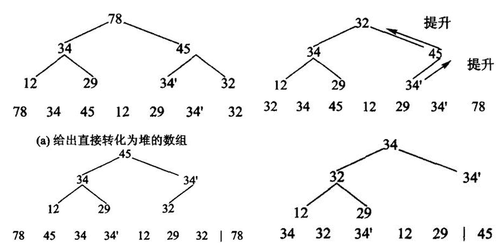
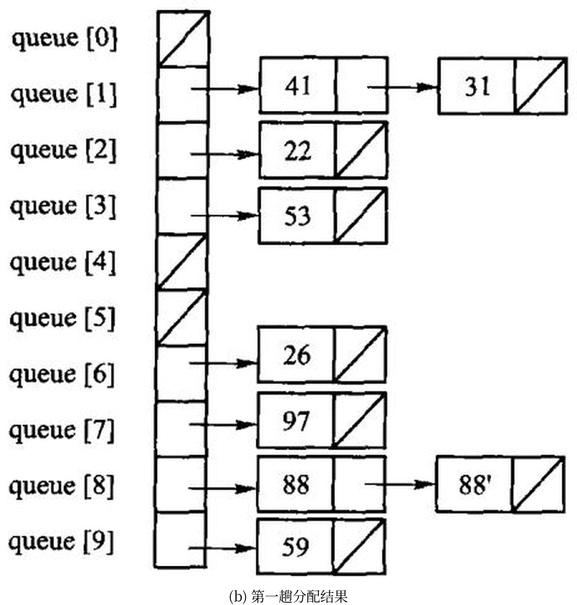
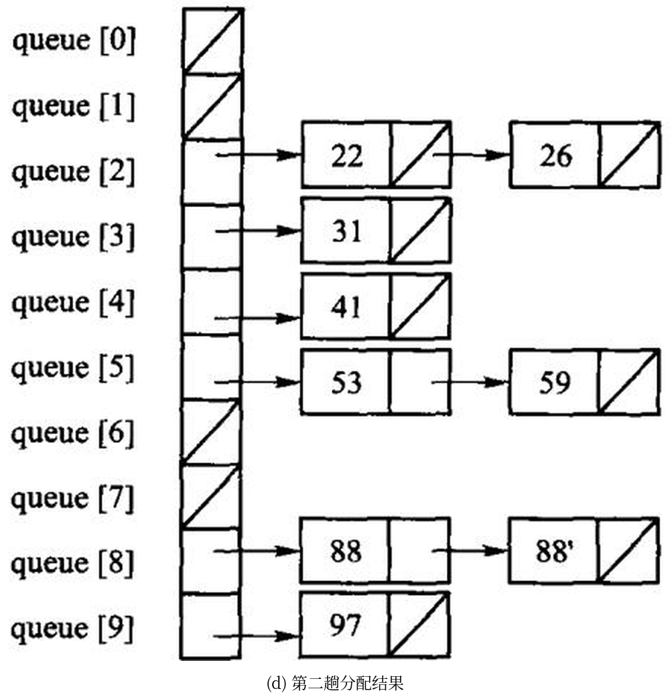
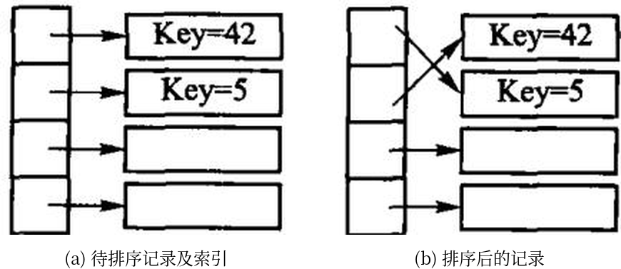

# 第8章 内部排序

排序把一个序列重排为非递减顺序。阅读时同时问四个问题：比较还是分配？是否稳定？额外空间多少？最好、平均、最坏时间是多少？

源码：[全部手写排序](../code/ch08/sorting/modern.hpp)、
[可运行示例](../code/ch08/sorting/demo.cpp)、
[对拍测试](../code/ch08/sorting/test.cpp)。

## 8.1 排序问题的基本概念

在日常生活中，经常需要对收集到的各种数据信息进行处理，这些数据处理中经常用到的核心运算就是
**排序**（sorting）：图书管理员将书籍按照编号排序放置在书架上；打开资源管理器，可以选择按名称、
大小、类型排列图标；搜索引擎把与检索词最相关的页面排在前面返回给用户。

排序主要分为两类。如果待排序的记录个数较少，整个排序过程中所有的记录都可以直接存放在内存中，
这样的排序叫做**内排序**（internal sorting）——本章讨论的就是它；如果待排序记录数量太大、内存
无法容纳所有记录，在排序过程中还需要访问外存，这样的排序叫做**外排序**（external sorting），
是第 9 章的内容。

**几个术语先约定清楚。** 讨论排序时，习惯上用「记录」（record）或「元素」（element）代替前 7 章的
「结点」（node）；记录是进行排序的基本单位，把所有待排记录称为「序列」（sequence），而不用「线性表」。
每一个记录内都有一个**排序码**（sort key）域作为排序运算的依据。**注意排序码不一定是关键码**：
关键码是唯一确定记录的一个或多个域；如果排序码不是关键码，就可能有多个记录具有同一个排序码，
因此排序结果可能不唯一。为了简便，本章假设排序码为整数。

给定序列 $R = \{r_0, r_1, \cdots, r_{n-1}\}$，其排序码分别为 $k = \{k_0, k_1, \cdots, k_{n-1}\}$，排序后
形成新序列 $R'$，对应排序码满足 $k'_0 \le k'_1 \le \cdots \le k'_{n-1}$（**不减序列**）或
$k'_0 \ge k'_1 \ge \cdots \ge k'_{n-1}$（**不增序列**）；没有重复排序码时，前者称**升序**、后者称**降序**。
如果待排序的序列正好符合排序要求，则称「**正序**」序列；如果把它逆转过来正好符合要求，则称
「**逆序**」序列。本章的排序算法一般对记录数组进行不减排序。

**稳定性。** 如果存在多个具有相同排序码的记录，经过排序后这些记录的相对次序仍然保持不变，这种
排序算法称为「**稳定的**」（stable），否则称为「不稳定的」。有些应用要求尽量不改变具有相同排序码的
记录的原始输入顺序，这时就需要采用稳定的排序算法——例如 8.6.2 节的低位优先基数排序 LSD，
**第一趟分配和收集以后的其他排序步骤都要求采用稳定排序算法**，否则前面几趟的成果会被后面的
趟数打乱。

读每一种方法时同时问四件事：它靠元素之间比较，还是靠关键码的数字结构做分配？相等的键排完之后相对次序变不变（稳定）？除了原序列还要多少额外空间？最好、平均、最坏各是什么时间？「稳定」不是装饰：按成绩排序时，两名同分学生若仍按原来的姓名顺序出现，后续按姓名再排才有意义。

**怎么衡量代价。** 评价一种排序算法的好坏主要通过空间代价和时间代价两方面，尤其是时间代价；
如果有特殊的空间限制，则要注意采用辅助空间较小的算法。时间代价一般通过**记录的总比较次数和
总移动次数**来衡量：一次移动就是一次记录赋值，**一次 `swap` 交换算三次移动**——这条换算在 8.7.2
节解释「同样是 $\Theta(n^2)$，冒泡为什么比插入慢几十倍」时会再用到。记录的数量、排序码和记录的
大小、以及输入记录的原始有序程度，都会影响排序算法的相对运行时间。估算时间代价时需要分别
考虑 3 种情况：最小时间代价（最佳情况）、最大时间代价（最差情况）以及平均时间代价（平均情况）。
**当序列中不含重复记录时，一个长度为 $n$ 的序列共有 $n!$ 种排列；假定每种排列的出现都是等概率的，
所有可能排列的平均运行时间就是排序算法的平均时间代价。**

**本章的分类**沿用原书：把直接插入排序、Shell 排序归为插入排序类（8.2）；把冒泡排序和快速排序
归为交换排序（8.4）；把直接选择排序、堆排序以及第 9 章的选择树归并排序划为选择排序（8.3）；
分配排序中介绍桶排序、基数排序以及索引排序（8.6）。另一种常见分类是把插入、直接选择、冒泡归为
「简单排序」，把快速排序和归并排序归为「分治排序」。

比较排序在最坏情况下至少需要 $\Omega(n\log n)$ 次比较，这是判定树给出的下界。插入、选择、冒泡是 $O(n^2)$；堆和归并最坏也是 $O(n\log n)$；快排平均 $O(n\log n)$，已经有序时退化成 $O(n^2)$。计数和基数不是比较排序，代价取决于值域或位数。

| 方法 | 平均时间 | 稳定性 | 主要特点 |
| --- | --- | --- | --- |
| 直接插入 | O(n²) | 稳定 | 小规模、近乎有序时简单有效 |
| 冒泡 | O(n²) | 稳定 | 教学直观，通常不作为通用选择 |
| 选择 | O(n²) | 不稳定 | 交换次数少 |
| 堆排序 | O(n log n) | 不稳定 | 最坏情况也有保证，原地排序 |
| 快速排序 | O(n log n) 平均 | 不稳定 | 实务常用，坏划分时会退化 |
| 归并排序 | O(n log n) | 稳定 | 需要 O(n) 辅助空间 |
| 计数/基数 | 与值域或位数有关 | 可稳定 | 适合整数键，不是比较排序 |

本章所有实现都接受有符号整数，测试含重复值和负数；没有用 `std::sort` / `std::make_heap` 顶替任何一个手写算法——那样等于把这一章删掉。

## 8.2 插入排序

先把四种排序跑一遍，看看它们交出什么。

**插入排序**（insert sorting）的算法思想十分简单：对待排序的记录逐个进行处理，每个新记录与同组
那些已排好序的记录进行比较，然后插入到适当的位置。关键在于如何将一个新记录 $r_i$ 插入到已排序
序列 $R'$ 中，这涉及两个方面——**找到序列中应插入的位置**，以及**如何移动序列中那些已排好序的
元素以便插入新记录**。插入排序的变种很多，例如本章上机题里的二分插入排序和交换插入排序。

### 8.2.1 直接插入排序


```cpp file=code/ch08/sorting/demo.cpp
#include "modern.hpp"

#include <iostream>
#include <vector>

namespace {
void print(const char* name, const std::vector<int>& values) {
    std::cout << name;
    for (int value : values) {
        std::cout << ' ' << value;
    }
    std::cout << '\n';
}
}  // namespace

int main() {
    const std::vector<int> raw{3, -2, 7, 3, 0, -2, 9, 1};

    auto insertion = raw;
    dsa::sorting::insertion_sort(insertion);
    print("插入:", insertion);

    auto heap = raw;
    dsa::sorting::heap_sort(heap);
    print("堆排:", heap);

    auto quick = raw;
    dsa::sorting::quick_sort(quick);
    print("快排:", quick);

    auto radix = raw;
    dsa::sorting::radix_sort(radix);
    print("基数:", radix);
}
```

```bash
c++ -std=c++17 -Wall -Wextra -Werror -Icode/ch08/sorting \
    code/ch08/sorting/demo.cpp -o /tmp/sort-demo
/tmp/sort-demo
```

```console
插入: -2 -2 0 1 3 3 7 9
堆排: -2 -2 0 1 3 3 7 9
快排: -2 -2 0 1 3 3 7 9
基数: -2 -2 0 1 3 3 7 9
```

四种算法交出同一条非递减序列。插入排序保持两个 `-2`、两个 `3` 的相对次序；堆排和快排不保证这一点。

直接插入把 `values[index]` 抽出来，向前挪动所有比它大的元素，把空位留给它。相等元素不越过彼此，
所以**稳定**——每次插入只与临近记录逐个比较，直到找到第一个不大于新记录的值就停止；如果前面有
等于新记录排序码的记录，该记录仍然会在前方位置。图 8.1 中 $i=4$ 那一行就没有改变两个 34
（34 和 34′）的原始顺序，直到排序结束二者的相对顺序也没有改变。

**代价分析。** 算法用到一个辅助存放待插入记录的临时变量，因此**空间代价是一个记录大小，即
$\Theta(1)$**。时间代价复杂一些：程序体由两重循环组成，外层循环迭代 $n-1$ 次；内层循环的开始和
结束有两个记录的移动操作，迭代次数依赖于「在第 $i$ 个记录前的 $i-1$ 个记录中有多少个小于第 $i$ 个
记录」。

- **最佳情况**：数组正序排列时，每次第 $i$ 个记录一进入内层循环就退出，迭代次数为 0，比较次数为
  $n-1$；当前记录保存在临时变量中 $n-1$ 次、回填 $n-1$ 次，移动次数共为 $2(n-1)$。因此最小时间
  代价为 $\Theta(n)$。
- **最差情况**：数组恰好按降序排列（逆序）。外层第 $i$ 次迭代中内层需要进行 $i$ 次循环、比较 $i$ 次；
  当前记录存入临时变量 1 次移动、回填 1 次移动，前面序列顺序向后移动 $i$ 次，共 $i+2$ 次。
  总比较次数为 $\sum_{i=1}^{n-1} i = n(n-1)/2 = \Theta(n^2)$，总移动次数为
  $\sum_{i=1}^{n-1}(i+2) = (n-1)(n+4)/2 = \Theta(n^2)$。

**平均情况要靠「逆置」来数。** 考虑序列 $R$ 的一个排列 $P = \{p_0, p_1, \cdots, p_{n-1}\}$：如果 $P$ 中
两个元素 $p_i$ 和 $p_j$ 满足 $p_i > p_j$ 但 $i < j$，那么 $(p_i, p_j)$ 称为一个**逆置**（inversion）。
$P$ 的全逆置序列为 $P' = \{p_{n-1}, p_{n-2}, \cdots, p_0\}$。当 $R$ 中不含重复元素时 $P$ 共有 $n!$ 种排列；
把 $P$ 中的元素两两组成对，共有 $n(n-1)/2$ 个元素对，每个元素对都可能构成 $P$ 或者 $P'$ 的一个
逆置，因此按每个元素对出现的几率相等的原则，**平均有一半的逆置出现在 $P$ 中，即 $P$ 中平均有
$n(n-1)/4$ 个逆置**。

处理第 $i$ 个记录时，内层循环的迭代次数依赖于该记录前面比它大的记录个数，也就是逆置的数目——
例如图 8.1 中处理到 $i=3$ 时，记录 12 前面有 3 个比它大的数，存在 3 个逆置。**逆置的数目决定了
比较及移动的次数**，因此计算平均时间代价也就是要计算整个数组中平均有多少个逆置：按上面的推理，
平均时间代价为 $n(n-1)/4$，即 $\Theta(n^2)$。

```cpp file=code/ch08/sorting/modern.hpp#insertion
// 算法8.1：直接插入排序。相等元素不越过彼此，故稳定。
inline void insertion_sort(std::vector<int>& values) {
    for (std::size_t index = 1; index < values.size(); ++index) {
        const int value = values[index];
        std::size_t hole = index;
        while (hole != 0 && value < values[hole - 1]) {
            values[hole] = values[hole - 1];
            --hole;
        }
        values[hole] = value;
    }
}
```

本书讲**算法**的章节同时给一份 Python 实现，讲**存储管理**的章节只有 C++（D-025）。
两份不是逐行翻译：策略是同一份，代价不是同一份——差在哪里，每处都会点名。

```python file=code/ch08/sorting/modern.py#insertion
# 算法8.1：直接插入排序。相等元素不越过彼此，故稳定。
def insertion_sort(values: list[int]) -> None:
    for index in range(1, len(values)):
        value = values[index]
        hole = index
        # `hole > 0` 这个条件在 Python 里是**承重的**，不是防御性写法：
        # C++ 版越界会被 ASan 当场抓住，Python 的 values[-1] 却合法——
        # 它悄悄环绕到最后一个元素，把排序结果搅乱而不报任何错。
        while hole > 0 and value < values[hole - 1]:
            values[hole] = values[hole - 1]
            hole -= 1
        values[hole] = value
```

`hole > 0` 这个条件在 Python 里是**承重的**，不是防御性写法。C++ 版写漏了，
下标越界会被 AddressSanitizer 当场抓住；Python 的 `values[-1]` 却完全合法——
它环绕到最后一个元素，把结果悄悄排错而不报任何错。同一处笔误，
一种语言当场崩，另一种语言交出一个看起来正常的错答案。

### 8.2.2 Shell 排序

直接插入的代价几乎全花在「一次只能挪一格」上：一个很小的元素落在末尾，就得一路挪回
$n-1$ 次。


图 8.2　Shell 排序。同一种底纹标出的是同一个子序列。

8.2.1 节已经介绍过两条性质：初始序列为正序时，插入排序的最佳时间代价为 $\Theta(n)$；另外，对于
短序列的情况插入排序也比较有效。**Shell 排序（D. L. Shell，1959）有效地利用了插入排序的这两个
性质。**

与直接插入排序不同的是，Shell 排序不是着眼于相邻记录之间的比较，而是**对那些不相邻的记录进行
比较和移动**：先将待排序序列分为若干个子序列，而且要保证子序列中的记录在原始数组中不相邻、
且间距相同，分别对这些小子序列进行插入排序；然后减少记录间的间距、减少小序列个数，将原始序列
分为更大、更有序的子序列，分别进行插入排序；重复下去，直到最后间距减少为 1（整个序列比较接近
于正序状态），然后对整个序列进行插入排序——此时序列已经**基本有序**，插入排序在这种输入上接近
$\Theta(n)$。

由于 Shell 排序按照不断缩小的增量来将原始序列分成若干个子序列，因此有时也称为**缩小增量排序法**
（diminishing increment sorting）。本书按原书取「增量每次除以 2 递减」，即增量序列为
$(2^k, 2^{k-1}, \cdots, 2, 1)$。仍用上面那个序列（$n=8$），两个 34 用 34 和 34′ 区分：

```text
初始       45  34  78  12 34′  32  29  64
gap=4     34′  32  29  12  45  34  78  64
gap=2      29  12 34′  32  45  34  78  64
gap=1      12  29  32 34′  34  45  64  78
```

`gap=4` 那一趟把序列分成 4 个各含两个元素的子序列 `{45,34′}`、`{34,32}`、`{78,29}`、`{12,64}`，
各自排好：29 从下标 6 一步搬到下标 2，34′ 从下标 4 一步搬到下标 0——**一步跨四格**，
这是直接插入做不到的。代价是稳定性：34 与 34′ 落在不同的子序列里，34′ 在第一趟就越过了 34，
最终结果里 34′ 排在 34 前面，与输入次序相反。**Shell 排序不稳定**，
原因正是「跨越式移动」，而稳定性恰恰依赖「只与相邻元素比较、绝不跳过相等元素」。

```cpp file=code/ch08/sorting/modern.hpp#fn:shell_sort
// 算法8.2：增量每次减半的 Shell 排序。
inline void shell_sort(std::vector<int>& values) {
    for (std::size_t gap = values.size() / 2; gap != 0; gap /= 2) {
        for (std::size_t index = gap; index < values.size(); ++index) {
            const int value = values[index];
            std::size_t hole = index;
            while (hole >= gap && value < values[hole - gap]) {
                values[hole] = values[hole - gap];
                hole -= gap;
            }
            values[hole] = value;
        }
    }
}
```

增量序列的选择直接决定复杂度，这是一个至今没有完全解决的问题：减半序列最坏
$\Theta(n^2)$，Hibbard 序列 $1,3,7,\ldots,2^k-1$ 最坏 $\Theta(n^{3/2})$，
实测常用的 Sedgewick 序列更好。本书取减半，是因为它最容易讲清楚「增量」这件事本身。

## 8.3 选择排序

**为什么「除以 2 递减」效果有限。** Shell 排序的效率比直接插入排序要高——整个排序过程中，第一轮
循环中逆置个数比较多，最后几轮循环中子序列都是基本有序的，因此效率比起直接对整个数组做插入
排序要好。但是当选取「增量每次除以 2 递减」时，**效率仍然为 $\Theta(n^2)$**，并没有多大效果。问题
就在于这样选取的增量之间**并不互质**：间距为 $2^{k-1}$ 的子序列都是由那些间距为 $2^k$ 的子序列组成
的，而实际上上一轮循环中这些子序列都已经排序过，导致后面的处理效率不高。最坏情况下，所有比较
大的记录下标都是奇数、比较小的记录下标都是偶数：由于每次分出的子序列要么下标都是奇数、要么
都是偶数，因此每次对子序列排序后，大数仍然在奇数位置上、小数仍然在偶数位置上，整个序列没有
达到基本有序状态，导致最后一次对整个序列做直接插入排序时效率大幅降低。

**换增量序列能换来质变。** Hibbard 提出了一种新的增量序列 $\{2^k-1, 2^{k-1}-1, \cdots, 7, 3, 1\}$，
推理证明这种选取方式下 Shell 排序的效率可以达到 $\Theta(n^{3/2})$，而模拟实验表明甚至可以达到
$\Theta(n^{5/4})$，只是尚未得到理论上的证明；「增量每次除以 3 递减」的效率也是 $\Theta(n^{3/2})$。
事实上，选取其他增量序列还可以进一步减少时间代价，甚至有的增量序列可以达到 $\Theta(n^{7/6})$，
很接近 $\Theta(n\log n)$，比直接插入排序要快得多。

**注意两条边界。** 一是**最后一趟的增量必须是 1**：如果采用其他增量序列，一定要注意人为地加上一个
间距为 1 的增量元素，否则整个序列不能保证有序。二是 **Shell 排序不稳定**：子序列互相交错，而且
跨度比较大——上面那个例子里 34 和 34′ 的排序结果就是不稳定的。空间代价仍是 $\Theta(1)$。

**选择排序**（selection sorting）的算法思想是逐个找出第 $i$ 小的记录，并将其放到数组的第 $i$ 个位置。
**关键在于如何从剩余的未排序记录中找出最小（或最大）的那个记录**：本节介绍简单的线性查找方法
（直接选择排序）和基于二叉树堆进行选择的方法（堆排序）。

### 8.3.1 直接选择排序

选择排序的思路是逐个「选出第 $i$ 小的记录，一次交换到位」：第 $i$ 轮从剩下的
$n-i$ 个记录里线性扫描出最小的那个，与下标 $i$ 上的记录交换。

```cpp file=code/ch08/sorting/modern.hpp#fn:selection_sort
// 算法8.3：直接选择排序。
inline void selection_sort(std::vector<int>& values) {
    for (std::size_t first = 0; first < values.size(); ++first) {
        std::size_t minimum = first;
        for (std::size_t index = first + 1; index < values.size(); ++index) {
            if (values[index] < values[minimum]) minimum = index;
        }
        using std::swap;
        swap(values[first], values[minimum]);
    }
}
```

仍用原书图8.3 的那个序列（两个 34 记作 34 和 34′，用来看稳定性）：

```text
初始       45  34  78  12 34′  32  29  64
i=0        12  34  78  45 34′  32  29  64    12 与下标 3 交换
i=1        12  29  78  45 34′  32  34  64    29 与下标 6 交换
i=2        12  29  32  45 34′  78  34  64    32 与下标 5 交换
i=3        12  29  32 34′  45  78  34  64    34′ 与下标 4 交换
i=4        12  29  32 34′  34  78  45  64    34 与下标 6 交换
i=5        12  29  32 34′  34  45  78  64    45 与下标 6 交换
i=6        12  29  32 34′  34  45  64  78    64 与下标 7 交换
```

**它不稳定，第 3 轮就看得出来**：扫描是从前往后的，34′（下标 4）先于 34（下标 6）
被选中，于是排完是 `34′ 34`，与输入次序相反。更本质的原因是那次交换的**跨度很大**——
`i=1` 那一轮把 34 从下标 1 一脚踢到了下标 6，越过了 34′。稳定的排序必须避免这种远距离交换。

代价分析很干脆：外层 $n-1$ 轮，第 $i$ 轮内层比较 $n-1-i$ 次，

$$\sum_{i=0}^{n-2}(n-1-i)=\frac{n(n-1)}{2}=\Theta(n^2)$$

**而且与输入顺序无关**——已经排好序的输入照样扫这么多次，所以最好、平均、最坏都是
$\Theta(n^2)$。这一点和插入排序、冒泡排序都不同，后两者在有序输入上是 $\Theta(n)$。

但它有一个别人没有的优点：**交换次数最多只有 $n-1$ 次**。当记录很大（比如每条记录几百字节）
而比较很便宜时，移动开销才是主导，这时选择排序反而合适。想把移动降到更低，
见 8.6.3 节的索引排序。空间代价 $\Theta(1)$。

### 8.3.2 堆排序

先把数组建成最大堆，再反复把堆顶与堆尾交换并缩小堆。`sift_down` 必须比较左右两个孩子。



图 8.4　堆排序：(a) 待排序列建成最大堆；(b) 取走最大值 78，用末尾的 32 填上；(c) 重新筛选后又是一个堆；(d) 重复下去，每取一次就把一个最大值放到已排好的那一段。建堆是 $O(n)$（5.5.1a 证过），此后 $n-1$ 次筛选各 $O(\log n)$，合计 $O(n\log n)$——**而且不需要额外数组**。

```cpp file=code/ch08/sorting/modern.hpp#heap
// 算法8.4：手写最大堆筛选与堆排序，不委托 std::make_heap/sort_heap。
inline void sift_down(std::vector<int>& values, std::size_t root, std::size_t count) {
    while (root * 2 + 1 < count) {
        std::size_t child = root * 2 + 1;
        if (child + 1 < count && values[child] < values[child + 1]) ++child;
        if (values[root] >= values[child]) return;
        using std::swap;
        swap(values[root], values[child]);
        root = child;
    }
}

inline void heap_sort(std::vector<int>& values) {
    for (std::size_t root = values.size() / 2; root != 0; --root) {
        sift_down(values, root - 1, values.size());
    }
    for (std::size_t end = values.size(); end > 1; --end) {
        using std::swap;
        swap(values[0], values[end - 1]);
        sift_down(values, 0, end - 1);
    }
}
```

Python 版同样手写筛选，不借 `heapq`：

```python file=code/ch08/sorting/modern.py#heap
# 算法8.4：手写最大堆筛选与堆排序，不借 heapq——那一行就是 5.5 节全节。
def sift_down(values: list[int], root: int, count: int) -> None:
    while root * 2 + 1 < count:
        child = root * 2 + 1
        if child + 1 < count and values[child] < values[child + 1]:
            child += 1
        if values[root] >= values[child]:
            return
        values[root], values[child] = values[child], values[root]
        root = child


def heap_sort(values: list[int]) -> None:
    for root in range(len(values) // 2 - 1, -1, -1):
        sift_down(values, root, len(values))
    for end in range(len(values) - 1, 0, -1):
        values[0], values[end] = values[end], values[0]
        sift_down(values, 0, end)
```

`heapq.heapify` 加 `heappop` 三行就能排完一个表，但那三行就是 5.5 节全节。
本书的闸门有一条规则专查这件事——Python 实现文件里出现 `heapq`、`bisect`、
`sorted`、`list.sort` 一律判红，要豁免得在 `unit.json` 里写明理由（D-025）。

## 8.4 交换排序

交换排序的基本思想是：**两两比较待排序记录的关键码，发现记录逆置则进行交换，直到没有逆置对
为止。** 冒泡排序和快速排序是典型的交换排序算法。

### 8.4.1 冒泡排序

冒泡排序（bubble sorting，也称为起泡排序）不停地比较**相邻**两个记录，如果不满足排序要求就交换
相邻记录，直到所有的记录都已经排好序为止。一趟走完，最大（或最小）的那个必然被顶到一端，
**就像一个气泡从水底慢慢地冒上来、最后浮出水面**——这就是冒泡排序的命名由来。

对于长度为 $n$ 的待排序记录数组 $R = \{r_0, r_1, \cdots, r_{n-1}\}$，原书的步骤是：从数组末端开始，
不断比较相邻记录，不满足排序要求就交换——首先比较 $r_{n-1}$ 和 $r_{n-2}$，如果 $r_{n-1} < r_{n-2}$ 则两者
交换，然后依次对 $r_{n-2}$ 和 $r_{n-3}$、$\cdots$、$r_1$ 和 $r_0$ 比较处理；这样比较完一轮后，最小的那个
记录已经被推到数组的最左端 $r_0$ 位置上。开始第二轮时由于 $r_0$ 已经是最小的记录，因此只需要对
$r_{n-1}$ 到 $r_1$ 进行比较；依次类推，直到数组中所有记录都已经排好序为止。


图 8.5　冒泡排序。每一行是一趟之后的序列，带箭头的是本轮交换过的相邻记录。

原书是从数组末端往前比，每趟把最小的推到最左；本书从前往后比，
每趟把最大的顶到最右——原书自己也写了「算法的具体实现取决于编程人员的个人喜好」，
两种写法对称等价。

关键的一处优化在原书算法8.5 里已经有了：**记一个「本趟有没有发生过交换」的标志，
没有就说明整个序列已经有序，立刻结束**。

```cpp file=code/ch08/sorting/modern.hpp#fn:bubble_sort
// 算法8.5：带“本趟无交换即结束”优化的冒泡排序。
inline void bubble_sort(std::vector<int>& values) {
    for (std::size_t end = values.size(); end > 1; --end) {
        bool changed = false;
        for (std::size_t index = 1; index < end; ++index) {
            if (values[index] < values[index - 1]) {
                using std::swap;
                swap(values[index], values[index - 1]);
                changed = true;
            }
        }
        if (!changed) return;
    }
}
```

仍是那个序列：

```text
初始       45  34  78  12 34′  32  29  64
第1趟      34  45  12 34′  32  29  64  78
第2趟      34  12 34′  32  29  45  64  78
第3趟      12  34  32  29 34′  45  64  78
第4趟      12  32  29  34 34′  45  64  78
第5趟      12  29  32  34 34′  45  64  78
第6趟      12  29  32  34 34′  45  64  78    ← 本趟一次交换都没有，结束
```

**它是稳定的**：只有严格小于才交换，相等的两个元素永远不会互换位置——
第 3、4 趟里 34 越过 32 和 29 往左走，34′ 也在走，但两者始终保持「34 在前」。
把实现里的 `<` 写成 `<=`，稳定性当场消失，这是最容易犯的一个错。

时间代价：最好情况是输入已经有序，第一趟没有交换就退出，$\Theta(n)$；
最坏是完全逆序，比较与交换次数都是

$$\sum_{i=1}^{n-1}(n-i)=\frac{n(n-1)}{2}=\Theta(n^2)$$

平均交换次数约为最坏的一半，仍是 $\Theta(n^2)$。空间 $\Theta(1)$。

需要提醒的是：$\Theta(n^2)$ 相同不代表快慢相同。8.7.2 节的实测里，同样 5 万个随机数，
冒泡 5822 毫秒、插入 214 毫秒，**差 27 倍**——都是 $\Theta(n^2)$，差在常数上：
冒泡每次逆序都要做一次三步交换，插入排序只做一次赋值搬移。

### 8.4.2 快速排序


图 8.6　快速排序：选一个枢轴把序列分成「都不大于它」和「都不小于它」两段，枢轴落到它最终的位置上，再对两段各自递归。

**快速排序就是基于分治法的排序算法**：分治法（divide and conquer）的关键是分、治、合——将给定
问题分成若干个子问题（分），再对每个子问题求解（治），最后将所有子问题的解合并成一个综合的解
（合），得到原始问题的解。

1962 年，伦敦 Elliot Brothers Ltd 公司的 Tony Hoare 发明了快速排序（quicksort）方法。**它几乎是
最快的排序算法，被评选为 20 世纪十大算法之一**，平均时间代价为 $\Theta(n\log n)$。快速排序之所以
很快，主要因为它在对数组进行分组时不是随便划分，而是**尽量将原数组划分为两半**。算法思想是：

1. 从待排序序列 $S$ 中任意选择一个记录 $k$ 作为**轴值**（pivot）；
2. 将剩余的记录**分割**（partition）成左子序列 $L$ 和右子序列 $R$；
3. $L$ 中所有记录都小于或等于 $k$，$R$ 中记录都大于等于 $k$，因此 $k$ 正好位于正确的位置；
4. 对子序列 $L$ 和 $R$ 递归进行快速排序，直到子序列中只含有 0 或 1 个元素，退出递归。

步骤 2、3 是「分」「治」过程，可以同时实现，完成序列的分割。**轴值 $k$ 已经到位，而左序列 $L$ 的记录
再也不会跑到 $k$ 的右边，反之亦然，因此不需要明显的「合」过程**——这是它与归并排序（8.5 节）最大
的区别。如果把轴值看成子根、分割后的 $L$ 和 $R$ 分别看做轴值的左右子结点，则整幅图可以看成一棵
二叉树；对这棵二叉树进行中序遍历，收集轴值以及单个元素的叶结点，就得到最终的排序结果。

**轴值怎么选，影响很大。** 轴值的选择应尽量使得序列可以据此划分为均匀的两半。最糟糕的情况莫过于
轴值恰好是第一个或者最后一个记录——这样分出的两个子序列中就会有一个为空，从而使分治法根本
起不到作用。最简单的办法是选择第一个记录（下标 `start`）或者最后一个记录（下标 `end`）作为轴值，
**但弊端在于：当原始输入数组恰巧是正序或者恰好是逆序时，每次分割都会将剩余记录全都分到一个
序列中，而另一个序列却为空。** 可以选取中间点 `(start + end) / 2` 的记录作为轴值，这种轴值在输入
数据为正序或逆序时可以平分序列，实验效果非常好。

本书的实现选区间末元素为枢轴，把更小的元素换到左侧，再递归两边。全相等的输入必须也能结束。


图 8.7　一趟分割的过程。分割是快排的全部工作量所在：它是 $O(n)$ 的一次线性扫描，而**分得均不均匀决定了递归有多深**——每次都平分是 $O(n\log n)$，每次只切下一个元素就退化成 $O(n^2)$。

**原书给了两种分割写法。** 最简单的一种是 $l$、$r$ 下标分别从序列的左端、右端向中间扫描：左边越过
那些小于等于 pivot 的值，停在第一个大于 pivot 的值 $k_l$；右边越过那些大于等于 pivot 的值，停在
第一个小于 pivot 的值 $k_r$；交换逆置记录 $k_l$ 和 $k_r$；从交换后的位置继续从左右向中间扫描，
发现并交换逆置记录对，直到 $l$、$r$ 交叉而整个序列扫描完毕。一种改进的方法（图 8.7 画的就是它）
是**从序列两端交替检查空闲位置，将逆置记录移动到空闲位置上，而不是直接交换逆置记录**：分割前
先将轴值与最后一个记录交换、并把轴值保存到一个临时变量中，此时序列中的最后一个位置就是空闲
位置。不同的分割方法所分出来的子序列不同。

**代价分析。** 最差情况下每次分割只切下一个元素，需要 $\Theta(n)$ 次分割，最大时间代价为
$\Theta(n^2)$；每次分割时递归算法都需要用到编译栈中一个临时记录来存储轴值，因此最大空间代价为
$\Theta(n)$。最好情况下每次分割恰好将记录分为两个长度相等的子序列，此时

$$T(n) = 2T(n/2) + cn$$

两边同除以 $n$ 得 $T(n)/n = T(n/2)/(n/2) + c$，逐层展开并叠加（算法共要进行 $\log n$ 次分割）得到
$T(n)/n = T(1)/1 + c\log n$，即 $T(n) = cn\log n + n = \Theta(n\log n)$。

平均情况要对所有可能的情况求和再除以总情况数。假设每次分割时轴值处于结果数组中各位置的概率
是一样的，即轴值把数组分成长度为 0 和 $n-1$、1 和 $n-2$、$\cdots$ 的子序列的概率都是 $1/n$，则
$T(i)$ 和 $T(n-1-i)$ 的平均值均为 $\frac{1}{n}\sum_{k=0}^{n-1} T(k)$，代入递推式得到

$$T(n) = cn + \frac{2}{n}\sum_{k=0}^{n-1} T(k)$$

两边同乘 $n$ 得 $nT(n) = cn^2 + 2\sum_{k=0}^{n-1}T(k)$；以 $n-1$ 代入同一式得
$(n-1)T(n-1) = c(n-1)^2 + 2\sum_{k=0}^{n-2}T(k)$；两式相减并忽略常数项，得
$nT(n) = (n+1)T(n-1) + 2cn$。再两边同除以 $n(n+1)$ 并逐层展开叠加：

$$\frac{T(n)}{n+1} = \frac{T(1)}{2} + 2c\sum_{i=3}^{n+1}\frac{1}{i} = \Theta(\log n)$$

因此 $T(n) = \Theta(n\log n)$。**快速排序平均时间代价 $\Theta(n\log n)$，平均需要 $\Theta(\log n)$ 次
分割，平均空间代价 $\Theta(\log n)$。**

```cpp file=code/ch08/sorting/modern.hpp#quick
inline std::size_t partition(std::vector<int>& values, std::size_t first, std::size_t last) {
    const int pivot = values[last - 1];
    std::size_t boundary = first;
    for (std::size_t index = first; index + 1 < last; ++index) {
        if (values[index] < pivot) {
            using std::swap;
            swap(values[boundary], values[index]);
            ++boundary;
        }
    }
    using std::swap;
    swap(values[boundary], values[last - 1]);
    return boundary;
}

inline void quick_sort_range(std::vector<int>& values, std::size_t first, std::size_t last) {
    if (last - first < 2) return;
    const std::size_t middle = partition(values, first, last);
    quick_sort_range(values, first, middle);
    quick_sort_range(values, middle + 1, last);
}

// 算法8.6：手写快排。
inline void quick_sort(std::vector<int>& values) { quick_sort_range(values, 0, values.size()); }
```

```python file=code/ch08/sorting/modern.py#quick
def partition(values: list[int], first: int, last: int) -> int:
    """以 [first, last) 的末元素为轴划分，返回轴的落点。"""
    pivot = values[last - 1]
    boundary = first
    for index in range(first, last - 1):
        if values[index] < pivot:
            values[boundary], values[index] = values[index], values[boundary]
            boundary += 1
    values[boundary], values[last - 1] = values[last - 1], values[boundary]
    return boundary


def quick_sort_range(values: list[int], first: int, last: int) -> None:
    if last - first < 2:
        return
    middle = partition(values, first, last)
    quick_sort_range(values, first, middle)
    quick_sort_range(values, middle + 1, last)


# 算法8.6：手写快排。
#
# **这一版在 Python 里会真的崩，而在 C++ 里只是慢**：末元素当轴，遇到已排好序的
# 输入就退化成 n 层递归。C++ 有 8 MB 栈，几万层才炸；CPython 的递归上限默认是
# 1000 层，一千个有序元素就抛 RecursionError。同一个算法缺陷，两种语言的暴露
# 阈值差两个数量级——8.7 的「短侧递归」因此在 Python 里不是优化，是能不能跑。
# test.py 里有断言把这两件事都钉住。
def quick_sort(values: list[int]) -> None:
    quick_sort_range(values, 0, len(values))
```

**这一版在 Python 里会真的崩，而在 C++ 里只是慢。** 末元素当枢轴，遇到已排好序的
输入就退化成 $n$ 层递归。C++ 默认 8 MB 栈，几万层才炸；CPython 的递归上限默认
1000 层，**两千个有序元素就抛 `RecursionError`**。同一个算法缺陷，
两种语言的暴露阈值差两个数量级——下面那条「只对较短的一侧递归」的优化，
在 C++ 里是省栈，在 Python 里是**能不能跑完**。

基础版有两处会出事，原书算法8.7 给了对策：

- **递归太深**。每次只把区间切成两半再各自递归，划分不平衡时深度可达 $n$；
  已经排好序的输入配上「取末元素作枢轴」正是最坏情形。对策是**只对较短的一侧递归，
  较长的一侧改成循环**——这样递归深度被压到 $O(\log n)$，因为每次递归的区间至少减半。
- **小区间上递归不划算**。区间只剩十几个元素时，递归调用与划分的固定开销超过了收益，
  改用直接插入排序更快。本书的阈值取 16。原书的道理讲得更细：当子数组小于某个长度时不必继续
  递归，**那些子数组内部是无序的，但整块地看待这些子数组时它们一块块地有序**（左边子数组的排序码
  都小于右边数组的排序码），整个序列已经基本有序，正适合最后对整个数组做一次插入排序。原书按
  表 8.4 的实验取阈值 28；**阈值与算法、机器的软/硬件条件有关，在不同的环境下得到过 9、16、28 等
  最佳值**——本书在自己的机器上取 16，读者应当在自己的环境里重测。

```cpp file=code/ch08/sorting/modern.hpp#fn:quick_sort_optimized
inline void quick_sort_optimized(std::vector<int>& values) {
    quick_sort_optimized_range(values, 0, values.size());
}
```

```python file=code/ch08/sorting/modern.py#fn:quick_sort_optimized
def quick_sort_optimized(values: list[int]) -> None:
    quick_sort_optimized_range(values, 0, len(values))
```

注意这两条优化管的是**栈深与常数**，管不了**最坏时间**：枢轴仍取末元素，
已排好序的输入照样是 $\Theta(n^2)$ 次比较。8.7.2 节的实测里，
2 万个已排好序的数，优化快排要 105.9 毫秒，而插入排序只要 0.0 毫秒——
**快排在这种输入上比 $\Theta(n^2)$ 的插入排序还慢**。想根治，得换枢轴策略
（三数取中、随机枢轴），那是习题里的事。

## 8.5 归并排序

归并排序（merge sorting）简单地将原始序列划分为两个子序列，然后分别对每个子序列递归排序，
最后再将有序子序列合并。主要步骤为：① 将序列划分为两个子序列；② 分别对两个子序列递归进行
归并排序；③ 将这两个已排好序的子序列合并为一个有序序列，即**归并**过程。

**归并排序也是一种基于分治法的排序，但重心与快速排序恰好相反。** 快速排序侧重于「分」（含「治」），
即用轴值分割子序列的过程，没有明显的「合」；归并排序的「分」很简单（对半切），它侧重于「治」和
「合」——每次比较子序列头，取出较小的进入结果序列，其后次小记录顶上来，继续比较。

区间长度小于 2 时已经有序，因此递归可以停止。每一层合并总共扫描 `n` 个元素，递推式为

$$T(n)=2T(n/2)+\Theta(n)=\Theta(n\log n).$$


图 8.8　归并排序。**归并与快排正好相反**：快排把力气花在分（分割）上，合的时候什么都不用做；归并分得很随意（对半切），力气全花在合上。

归并排序所需时间主要包括划分时间、两个子序列的排序时间以及归并时间：**划分时间为常数，可以
忽略；归并时间随着数组长度 $n$ 线性增长**。当数组长度为 1 时函数直接返回，$T(1)=1$。
由于**归并排序不依赖于原始数组的输入情况**，每次划分时两个子序列的长度都是基本一样的，因此
它的最大、最小以及平均时间代价均为 $\Theta(n\log n)$——这一点与快速排序不同，快排的最差情况会
退化到 $\Theta(n^2)$。

实现只分配一个与输入等长的缓冲区，并在所有递归层复用它；因此辅助空间为 $\Theta(n)$，递归
调用栈另占 $O(\log n)$。合并时使用「右侧严格更小才取右侧」的判断：相等元素先取左侧，
从而保持稳定性（原书【算法8.8】的注释写的是「为保证稳定性，相等时左边优先」，是同一件事）。

**归并排序也有改进的余地。** R. Sedgewick 提出过一种优化：在把数组暂时复制到临时数组时，
**将第二个子数组中元素的顺序颠倒一下**；这样两个子数组从两端开始处理、向中间推进，使得这两个
子数组的两端互相成为另一个数组的「**监视哨**」，从而不用像基本版那样在循环里反复检查子序列是否
已经结束。另外，当子数组小于某个长度（原书取 28）时也不继续递归，而是最后对整个序列使用一次
插入排序——与 8.4.2 节优化快排的思路完全一样。

```cpp file=code/ch08/sorting/modern.hpp#merge
inline void merge_ranges(std::vector<int>& values, std::vector<int>& buffer,
                         std::size_t first, std::size_t middle, std::size_t last) {
    std::size_t left = first;
    std::size_t right = middle;
    std::size_t output = first;
    while (left < middle && right < last) {
        buffer[output++] = values[right] < values[left] ? values[right++] : values[left++];
    }
    while (left < middle) buffer[output++] = values[left++];
    while (right < last) buffer[output++] = values[right++];
    for (std::size_t index = first; index < last; ++index) values[index] = buffer[index];
}

inline void merge_sort_range(std::vector<int>& values, std::vector<int>& buffer,
                             std::size_t first, std::size_t last) {
    if (last - first < 2) return;
    const std::size_t middle = first + (last - first) / 2;
    merge_sort_range(values, buffer, first, middle);
    merge_sort_range(values, buffer, middle, last);
    merge_ranges(values, buffer, first, middle, last);
}

// 算法8.8：两路归并排序。
inline void merge_sort(std::vector<int>& values) {
    std::vector<int> buffer(values.size());
    merge_sort_range(values, buffer, 0, values.size());
}
```

```python file=code/ch08/sorting/modern.py#merge
def merge_ranges(values: list[int], buffer: list[int],
                 first: int, middle: int, last: int) -> None:
    left, right, output = first, middle, first
    while left < middle and right < last:
        # `<` 而不是 `<=`：相等时取左边，稳定性就是从这一个符号来的。
        if values[right] < values[left]:
            buffer[output] = values[right]
            right += 1
        else:
            buffer[output] = values[left]
            left += 1
        output += 1
    while left < middle:
        buffer[output] = values[left]
        left += 1
        output += 1
    while right < last:
        buffer[output] = values[right]
        right += 1
        output += 1
    values[first:last] = buffer[first:last]


def merge_sort_range(values: list[int], buffer: list[int], first: int, last: int) -> None:
    if last - first < 2:
        return
    middle = first + (last - first) // 2
    merge_sort_range(values, buffer, first, middle)
    merge_sort_range(values, buffer, middle, last)
    merge_ranges(values, buffer, first, middle, last)


# 算法8.8：两路归并排序。辅助空间 O(n)，一次开够，不在递归里反复申请。
def merge_sort(values: list[int]) -> None:
    buffer = [0] * len(values)
    merge_sort_range(values, buffer, 0, len(values))
```

`values[right] < values[left]` 里的这个 `<` 就是稳定性的全部来源：相等时取左边。
写成 `<=` 就取右边，稳定性当场消失——**而 C++ 那份 `std::vector<int>` 的实现
根本无法验证这一点**，两个相等的 `3` 换不换位置，排完一模一样。
Python 这份不必改一个字就能排任何可比较的对象，于是测试里放一种
「只按 key 比较、payload 不参与比较」的记录，排完检查 payload 是否还是入场顺序。
把那个 `<` 改成 `<=`，这条断言会红。

空序列和单元素序列都能直接通过。

原书算法8.9 给了两处优化，本书都实现了：

- **小区间改用直接插入排序**（阈值 16）。递归到只剩十几个元素时，划分与函数调用的固定
  开销超过了收益，而插入排序在这种规模上几乎是最快的。
- **归并前先看一眼左半段的末尾与右半段的开头**：若 `values[middle-1] <= values[middle]`，
  两段拼起来本来就有序，整趟归并直接跳过。对已经有序或接近有序的输入，这一句把实际搬移
  从 $\Theta(n\log n)$ 压到接近 $\Theta(n)$；对随机输入它几乎不命中，代价只是每层多一次比较。

```cpp file=code/ch08/sorting/modern.hpp#fn:merge_sort_optimized
inline void merge_sort_optimized(std::vector<int>& values) {
    std::vector<int> buffer(values.size());
    merge_sort_optimized_range(values, buffer, 0, values.size());
}
```

## 8.6 分配排序和索引排序

本章要介绍的最后一种排序算法是**分配排序**（distribution sorting）。**这种排序算法的唯一特征是
不需要进行关键码之间的比较，但是需要事先知道记录序列的一些具体情况。**

三种情况对应三种做法：如果事先知道序列中记录的排序码都位于某个小区间段内，就可以用 8.6.1 的
**桶式排序**；当排序码值域 $m$ 很大时，可以拆分为多个部分来进行比较，这就是基于桶式排序的
**基数排序**（radix sorting，8.6.2）；为减少记录的移动，可以采取基于静态链的基数排序，这本质上
是一种**索引排序**（index sorting）或称地址排序（address sorting，8.6.3）——索引排序后的结果应该
可以在 $\Theta(n)$ 的线性时间内整理为按照数组下标为序的有序序列。

### 8.6.1 桶式排序

前面每一种排序都靠**元素之间的比较**决定次序，而比较排序最坏至少要 $\Omega(n\log n)$
次比较（证明见 8.7.3）。要突破这个下界，只能不再比较——转而利用关键码本身的数字结构，
直接算出每个元素该去哪儿。这类方法叫**分配排序**。

桶式排序是其中最简单的一种：已知所有取值落在 $[0, m)$ 之间时，准备 $m$ 个计数器，
扫一遍序列数出每个取值出现几次，再把计数**累加**成「小于等于 $i$ 的元素共有几个」，
这就直接给出了每个取值在结果里的位置区间。


图 8.9　桶式排序示意图。值相同的记录进同一个桶，再按桶号依次收集。先数一遍、把计数累加成起始位置，就能预先给每个桶留出恰好够用的一段——这样只需要一个长度为 $n$ 的辅助数组，而不是 $m$ 条变长的链。

**为什么要「先数一遍再累加」。** 假如知道某个长度为 $n$ 的序列中所有记录的值都在 $0 \sim m-1$ 之间，
如果事先知道每个桶中会有多少个元素，就可以使用一个长度为 $n$ 的辅助数组：例如第 0 个桶将含有
3 个记录、第 1 个桶将接收 5 个记录，就可以预先将前 3 个位置空出来留给第 0 个桶使用，把接着的
5 个位置留给第 1 个桶。因此还需要用 $m$ 个计数器分别来统计 $0, 1, 2, \cdots, m-1$ 这些数出现的
个数，将具有相同值的记录都分配到同一个桶中，然后依次按照编号从桶中取出记录，组成一个有序序列。

用原书的例子，$m=10$，序列 `{7, 3, 8, 9, 6, 1, 8′, 1′, 2}`：

```text
取值 i        0   1   2   3   4   5   6   7   8   9
出现次数      0   2   1   1   0   0   1   1   2   1
累加之后      0   2   3   4   4   4   5   6   8   9   ← count[i] 是「i 的结束位置」
```

`count[8] == 8` 的含义是：值 8 的记录占据结果数组下标 6、7 两格。
**输出时必须从原序列的尾部往前扫**——先遇到 8′，把它放在下标 7；后遇到 8，放在下标 6。
这样两个 8 的相对次序才保持不变。倒着扫是桶式排序稳定性的**唯一**来源，正着扫就不稳定了。

本书的实现有两处与原书不同，都写在这里：

```cpp file=code/ch08/sorting/modern.hpp#fn:counting_sort
// 算法8.10：桶式（计数）排序，支持负数但不适合巨大稀疏值域。
inline void counting_sort(std::vector<int>& values) {
    if (values.empty()) return;
    int low = values[0];
    int high = values[0];
    for (int value : values) { if (value < low) low = value; if (high < value) high = value; }
    const auto range = static_cast<unsigned long long>(static_cast<long long>(high) - low + 1);
    if (range > counting_range_limit) throw std::invalid_argument("counting sort value range is too sparse");
    std::vector<std::size_t> counts(static_cast<std::size_t>(range), 0);
    for (int value : values) ++counts[static_cast<std::size_t>(value - low)];
    std::size_t output = 0;
    for (std::size_t bucket = 0; bucket < counts.size(); ++bucket) {
        while (counts[bucket]-- != 0) values[output++] = static_cast<int>(bucket) + low;
    }
}
```

```python file=code/ch08/sorting/modern.py#fn:counting_sort
# 算法8.10：桶式（计数）排序，支持负数但不适合巨大稀疏值域。
#
# 与 C++ 版的一处**实质**差别：C++ 里 `high - low + 1` 本身就可能溢出 int，
# 那一版必须先转成 long long 再算。Python 的整数没有宽度，这个坑不存在——
# 但值域上限的检查一条都不能少，它挡的是内存而不是溢出。
def counting_sort(values: list[int]) -> None:
    if not values:
        return
    low = high = values[0]
    for value in values:
        if value < low:
            low = value
        if high < value:
            high = value
    span = high - low + 1
    if span > COUNTING_RANGE_LIMIT:
        raise ValueError("counting sort value range is too sparse")
    counts = [0] * span
    for value in values:
        counts[value - low] += 1
    output = 0
    for bucket, count in enumerate(counts):
        for _ in range(count):
            values[output] = bucket + low
            output += 1
```

C++ 版计算值域时必须先转成 `long long`：`high - low + 1` 在 `int` 里自己就会溢出。
Python 的整数没有宽度，这个坑不存在——**但值域上限的检查一条都不能少**，
它挡的是内存，不是溢出。

第一，**不要求下界为 0**。实现先扫出实际的 `[low, high]`，按 `value - low` 计数，
于是负数不需要调用者先做平移——原书那个「所有记录都位于区间 $[0,\max)$」的前提，
在真实数据上往往是不成立的。

第二，**值域太稀疏时直接抛异常**。桶式排序的时间与空间都是 $\Theta(m+n)$：
$m$ 是值域长度，不是元素个数。排 10 个数、值域却是 $[0, 10^9)$ 时，它会试图分配十亿个计数器。
原书没有防线，本书在 $m > 10^7$ 时抛 `std::invalid_argument`——**让它当场失败，
好过让它把机器拖垮**。判断能不能用桶式排序，靠的正是这个 $m$ 与 $n$ 的比值：
$m = \Theta(n)$ 时总代价 $\Theta(n)$，是相对比较排序的一次飞跃；
$m$ 涨到 $\Theta(n\log n)$ 或 $\Theta(n^2)$，优势立刻消失，还倒贴 $\Theta(m+n)$ 的空间。

还有一处要说清楚：本书实现按计数**重建取值**（`values[output++] = bucket + low`），
而不是像原书那样把原记录搬进结果数组。对纯整数，两者的输出完全一样，稳定性无从区分；
但只要记录带上了卫星数据（学号、姓名），就必须回到原书的写法——**倒序扫描 + 搬移原记录**。
这一点在把本节代码推广到真实记录时是个坑。

**代价与适用范围。** 对于一个长度为 $n$ 且值域区间长度为 $m$ 的数组，桶式排序首先需要扫描一遍序列
以便进行统计计数，然后再统计小于等于 $i$（$i \in [0,m)$）的个数，输出有序序列时共循环 $n$ 次，
因此**总的时间代价为 $\Theta(m+n)$**；由于算法中需要用到 $m$ 个计数器，还需要一个长度为 $n$ 的临时
数组，因此**空间代价为 $\Theta(m+n)$**。

当 $m$ 为 $\Theta(n)$ 数量级时，时间代价为 $\Theta(\Theta(n)+n)$，还是 $\Theta(n)$——此时桶式排序的效率
相对于前面那些排序算法是一个飞跃。**但是当 $m$ 为更高数量级（例如 $\Theta(n\log n)$ 或 $\Theta(n^2)$）时，
时间代价就由 $m$ 来决定**，也变成 $\Theta(n\log n)$ 或 $\Theta(n^2)$；此时桶式排序相比于前面那些排序
就没有什么优势，不仅如此，它还要额外的 $\Theta(m+n)$ 空间代价。**因此桶式排序只对 $m$ 较小时才具有
实际意义**——这也正是下一节要把大值域拆成若干小值域的原因。

### 8.6.2 基数排序

当值域 $m$ 很大时，可以对桶式排序做一些改进：**将排序码拆分为多个部分来进行比较**。例如要对
$0 \sim 9999$ 之间的整数进行排序，可以先按千、百、十、个位拆分。这种将排序码按照其进制的**基数**
进行拆分排序的方法就是基数排序，是分配排序的一种特例。

具体地说，基数排序把关键码拆成 $d$ 位，每一位的取值只有 $r$ 种（十进制数 $r=10$，字符串 $r=26$），
于是可以逐位做桶式排序。


图 8.10　两位数的基数排序，(b) 低位优先：先按个位分成 10 个桶、收集，再按十位分桶、收集，两趟之后整个序列有序。(a) 高位优先则要先按十位分桶，再对**每个桶**分别按个位细分，两位数一共 100 个子桶——桶数随位数指数增长，所以实用的是低位优先。低位优先能成立的前提是每一趟都**稳定**：后一趟不能打乱前一趟已经排好的相对次序。


图 8.11　基于顺序存储的基数排序：每一趟用桶式排序把记录搬进辅助数组，再搬回来。

搬记录太贵时，可以改用静态链：不动记录，只改 `next` 索引，每趟只重排链。

原书图 8.12 用 $\{97, 53, 88, 59, 26, 41, 88', 31, 22\}$（$n=9$、$d=2$、$r=10$）走了一遍，五个分图依次是：

(a) 初始链表内容

| 下标 | 0 | 1 | 2 | 3 | 4 | 5 | 6 | 7 | 8 |
| --- | --- | --- | --- | --- | --- | --- | --- | --- | --- |
| 关键码 | 97 | 53 | 88 | 59 | 26 | 41 | 88' | 31 | 22 |



(c) 第一趟收集结果

| 下标 | 0 | 1 | 2 | 3 | 4 | 5 | 6 | 7 | 8 |
| --- | --- | --- | --- | --- | --- | --- | --- | --- | --- |
| 关键码 | 41 | 31 | 22 | 53 | 26 | 97 | 88 | 88' | 59 |



(e) 第二趟收集结果

| 下标 | 0 | 1 | 2 | 3 | 4 | 5 | 6 | 7 | 8 |
| --- | --- | --- | --- | --- | --- | --- | --- | --- | --- |
| 关键码 | 22 | 26 | 31 | 41 | 53 | 59 | 88 | 88' | 97 |

图 8.12　基于静态链的基数排序。两趟分配和收集之后，静态链已经串成有序次序，再顺链整理一遍（原书的 `AddrSort()`，$\Theta(n)$）就得到按下标有序的数组。注意 88 和 88' 在 (e) 里仍保持原来的先后——基数排序的每一趟都必须稳定，否则低位排好的次序会被高位那趟打乱。

本书的实现把有符号 `int` 的符号位翻转后，按字节做 4 趟计数收集。否则负数会按无符号序排到最大。

```cpp file=code/ch08/sorting/modern.hpp#radix
// 算法8.11：LSD 基数排序。翻转符号位使二补码有符号 int 按无符号序排序。
inline void radix_sort(std::vector<int>& values) {
    std::vector<int> buffer(values.size());
    for (unsigned shift = 0; shift < 32; shift += 8) {
        std::size_t counts[256]{};
        for (int value : values) {
            const auto key = static_cast<std::uint32_t>(value) ^ 0x80000000U;
            ++counts[(key >> shift) & 0xffU];
        }
        std::size_t offset = 0;
        for (std::size_t& count : counts) { const std::size_t old = count; count = offset; offset += old; }
        for (int value : values) {
            const auto key = static_cast<std::uint32_t>(value) ^ 0x80000000U;
            buffer[counts[(key >> shift) & 0xffU]++] = value;
        }
        values.swap(buffer);
    }
}
```

```python file=code/ch08/sorting/modern.py#radix
# 算法8.11：LSD 基数排序，每趟按 8 位分桶。
#
# **C++ 版那个「异或最高位」的技巧在 Python 里不成立**，这是本章最值得看的一处
# 语言差异。C++ 的 int 是定长补码，把符号位翻过来，负数的位模式就整体排到正数
# 前面，一趟不用特殊处理。Python 的整数是任意精度、没有「最高位」这个东西，
# `-1` 的二进制是概念上无限长的 1。所以这里换一种同样只扫两遍的办法：
# **整体平移到非负区间**，排完再平移回来。代价是多一次 min 扫描，
# 换来的是不依赖任何机器字长——这份实现对 10**30 一样成立。
def radix_sort(values: list[int]) -> None:
    if not values:
        return
    shift_base = min(values)
    keys = [value - shift_base for value in values]
    largest = max(keys)
    buffer = [0] * len(keys)
    shift = 0
    while (largest >> shift) > 0 or shift == 0:
        counts = [0] * RADIX_BUCKETS
        for key in keys:
            counts[(key >> shift) & (RADIX_BUCKETS - 1)] += 1
        offset = 0
        for bucket in range(RADIX_BUCKETS):
            counts[bucket], offset = offset, offset + counts[bucket]
        for key in keys:
            digit = (key >> shift) & (RADIX_BUCKETS - 1)
            buffer[counts[digit]] = key
            counts[digit] += 1
        keys, buffer = buffer, keys
        shift += RADIX_BITS
    for index, key in enumerate(keys):
        values[index] = key + shift_base
```

**C++ 版那个「异或最高位」的技巧在 Python 里不成立**，这是本章最值得看的一处语言差异。
C++ 的 `int` 是定长补码，把符号位翻过来，负数的位模式就整体排到正数前面，一趟不用特殊处理。
Python 的整数是任意精度、**没有「最高位」这个东西**，`-1` 的二进制是概念上无限长的 1。
所以 Python 版换成**整体平移到非负区间**，排完再平移回来：代价是多一次 `min` 扫描，
换来的是不依赖任何机器字长——这份实现对 $10^{30}$ 一样成立，测试里就是拿这个规模钉住的。

一趟按一个字节分配，4 趟覆盖 32 位，因此时间是 $\Theta(d(n+r))$：$d=4$ 趟，
每趟 $r=256$ 个桶。与桶式排序相比，基数排序把「值域 $m$」换成了「位数 $d$ 与基数 $r$」，
于是 $[0, 2^{32})$ 这样的值域也排得动——代价是要扫 4 遍。

上面这版把桶做成了计数数组（先数、再累加、再放），桶是**隐式**的。
原书算法8.13 走的是另一条路：桶是**显式**的队列，每趟把记录 `push` 进 256 个队列，
再按桶号依次 `pop` 出来。它更接近「分配-收集」这个名字的字面意思，也更容易看懂；
代价是每趟都要维护 256 个队列。原书为此专门给了一个定长队列（代码8.12）：

```cpp file=code/ch08/sorting/modern.hpp#static-queue
// 代码8.12：固定容量 FIFO，是基数排序的桶而非通用 STL queue 替身。
template <typename T>
class StaticQueue {
public:
    explicit StaticQueue(std::size_t capacity) : data_(capacity), capacity_(capacity) {}
    [[nodiscard]] bool push(const T& value) {
        if (size_ == capacity_) return false;
        data_[(front_ + size_++) % capacity_] = value;
        return true;
    }
    [[nodiscard]] std::optional<T> pop() {
        if (size_ == 0) return std::nullopt;
        T value = data_[front_];
        front_ = (front_ + 1) % capacity_;
        --size_;
        return value;
    }
    [[nodiscard]] bool empty() const noexcept { return size_ == 0; }
private:
    std::vector<T> data_;
    std::size_t capacity_{0};
    std::size_t front_{0};
    std::size_t size_{0};
};
```

**代码8.12 是本章 Python 侧唯一不给实现的三条清单之一**（另两条是代码8.16 随机数据与
代码8.17 计时）。理由写在 `code/ch08/sorting/unit.json` 的 `py_skip` 字段里：
容量、环绕、下标回卷都是**存储管理**，而 Python 的 `list` 没有容量这个概念，
照着写只会得到一层没有内容的包装。下面算法8.13 的 Python 版改用普通 `list` 作桶，
这一节要讲的东西——稳定性来自「桶内保持入桶顺序、收集时按桶号从小到大」——一个字都没少。

它不是 `std::queue` 的替身，而是基数排序的桶：容量固定、不扩容，`push` 满了返回 `false`，
`pop` 空了返回 `std::nullopt`（D-001 §3c：可预期的空状态用 `optional`，不是错误）。

```cpp file=code/ch08/sorting/modern.hpp#fn:radix_sort_linked_style
// 算法8.13：以显式桶队列演示顺序收集的基数排序。
inline void radix_sort_linked_style(std::vector<int>& values) {
    std::vector<int> buffer(values.size());
    for (unsigned shift = 0; shift < 32; shift += 8) {
        std::vector<StaticQueue<int>> buckets;
        buckets.reserve(256);
        for (std::size_t bucket = 0; bucket < 256; ++bucket) buckets.emplace_back(values.size());
        for (int value : values) {
            const auto key = static_cast<std::uint32_t>(value) ^ 0x80000000U;
            (void)buckets[(key >> shift) & 0xffU].push(value);
        }
        std::size_t output = 0;
        for (auto& bucket : buckets) while (auto value = bucket.pop()) buffer[output++] = *value;
        values.swap(buffer);
    }
}
```

```python file=code/ch08/sorting/modern.py#fn:radix_sort_linked_style
# 算法8.13：以显式桶队列演示「分桶 — 按桶序收集」的基数排序。
#
# C++ 版这里用的是【代码8.12】那个固定容量环形队列。Python 侧按 D-025 §1
# 不实现 8.12：容量、环绕、下标回卷都是**存储管理**，而 list 没有容量这个概念，
# 照着写只会得到一层没有内容的包装。桶换成普通 list，这一节要讲的东西
# ——稳定性来自「桶内保持入桶顺序、收集时按桶号从小到大」——一个字都没少。
def radix_sort_linked_style(values: list[int]) -> None:
    if not values:
        return
    shift_base = min(values)
    keys = [value - shift_base for value in values]
    largest = max(keys)
    shift = 0
    while (largest >> shift) > 0 or shift == 0:
        buckets: list[list[int]] = [[] for _ in range(RADIX_BUCKETS)]
        for key in keys:
            buckets[(key >> shift) & (RADIX_BUCKETS - 1)].append(key)
        output = 0
        for bucket in buckets:
            for key in bucket:
                keys[output] = key
                output += 1
        shift += RADIX_BITS
    for index, key in enumerate(keys):
        values[index] = key + shift_base
```

两种写法排出来的结果逐字节相同，测试对拍了这一点。**分配排序天然稳定**：
同一个桶里的记录按进桶顺序出桶，从头到尾没有任何一次比较能打乱它们。


**基数排序到底是不是 $\Theta(n)$ 的？** 前面的分析给出基数排序的时间代价是 $\Theta(d(n+r))$。
当 $r$ 远小于 $n$ 时（整数基数 $r=10$、字符串基数 $r=26$ 均为常数），可以忽略掉 $r$，时间代价为
$\Theta(d \cdot n)$，而 $d$ 取决于数字的位数或者字符串的长度；如果 $d$ 相对于数组长度 $n$ 很小，
时间代价就成了 $\Theta(n)$。**这样看来，基数排序似乎是最快的排序算法——但它不是。**

考虑 $n$ 个互不相同的关键码：此时需要 $n$ 个不同的编码来表示它们，也就是说 $d \ge \log_r n$，
即 $d$ 在 $\Omega(\log n)$ 中。因此，对 $n$ 个不同的关键码值进行基数排序需要耗用 $\Omega(n\log n)$ 的
时间代价。**换句话说，如果 $n$ 个记录的排序码均不重复，那么排序码会被拆分为 $\log_r n$ 位，
这时 $d$ 就不能再当作常数来处理，基数排序的时间代价变成 $\Theta(n\log_r n)$**——按二进制选基数
$r=2$ 时就是 $\Theta(n\log n)$。所以**基数排序实质上并不是 $\Theta(n)$ 的算法，与堆排序、快速排序、
归并排序同属 $\Theta(n\log n)$ 复杂度量级**。

（实际应用中常用的 32 位计算机，其 `int` 的 32 个二进制位数几乎都比 $\log n$ 大，因此比较两个较长
整数的时间代价理论上是 $\Omega(\log n)$，但实际上人们认为整数的比较运算在常数时间内完成——
这条「常数时间比较」的默认假设，正是上面那笔账能算出差别的原因。）

**一处值得抄下来的工程优化**：取排序码第 $i$ 位的朴素写法是循环 `k = k / r` 做 $i$ 次再取模。
对正整数、而且采用 2 的 $g$ 次幂 $r = 2^g$ 作基数时，可以改用位操作
`k = ((k & (0xFF << (i*g))) >> (i*g)) % r;`——先把 `0xFF` 左移 $i \cdot g$ 位，与 `k` 按位与，
消除 `k` 右边的 $i \cdot g$ 位，再右移回来。原书在同一测试环境下实测：1M 数据、$r=16$、$g=4$ 的
链式基数排序从 0.6570 秒降到 0.5532 秒。

### 8.6.3 索引排序

前面所有算法都在**搬记录**。当记录很大——一条学籍记录几百字节，一张图片几兆——搬移的代价
就压过了比较的代价。索引排序（也叫地址排序）的办法是：**让数组中的每一个元素存储指向该元素
记录的指针，在需要移动记录时只移动指针值（或索引地址）而不移动记录本身**。8.6.2 节中的静态链
基数排序实际上也是一种索引排序。

**索引排序是典型的用空间换取时间的技巧**：它需要一些空间来存放指针，但换来了更高的效率。
需要说明的是，索引排序并不要求在待排序数组中就给出附加空间——可以通过申请新数组、通过下标
来进行对应。排序后，需要根据辅助的索引数组来调整原始的待排数组，使其按照下标有序地存放记录，
**这些整理都应该在 $O(n)$ 时间之内完成**（否则前面省下的搬移就白省了）。



图 8.13　索引排序示意：(a) 待排序记录及索引；(b) 排序后——**记录一个都没动，动的是索引**。

排完之后手上有一个索引数组。原书表8.1 给了两种约定，本节按第二种：
`index[i]` 存的是「结果数组第 $i$ 个位置应该从原数组的哪个下标取值」，
也就是 `结果[i] == 原数组[index[i]]`。仍用原书那组数据：

```text
原下标 i        0    1    2    3    4    5    6    7
排序码        29   25   34   64  34′   12   32   45
索引 index[i]  5    1    0    6    2    4    7    3
按索引取值    12   25   29   32   34  34′   45   64
```

排索引本身可以用任何排序算法，原书算法8.14 用的是直接插入——比较的是
`values[index[...]]`，交换的是 `index[...]`：

```cpp file=code/ch08/sorting/modern.hpp#fn:insertion_index_sort
// 算法8.14：排序索引，不移动原记录。
inline std::vector<std::size_t> insertion_index_sort(const std::vector<int>& values) {
    std::vector<std::size_t> indexes(values.size());
    for (std::size_t i = 0; i < indexes.size(); ++i) indexes[i] = i;
    for (std::size_t i = 1; i < indexes.size(); ++i) {
        const std::size_t index = indexes[i];
        std::size_t hole = i;
        while (hole != 0 && values[index] < values[indexes[hole - 1]]) { indexes[hole] = indexes[hole - 1]; --hole; }
        indexes[hole] = index;
    }
    return indexes;
}
```

```python file=code/ch08/sorting/modern.py#fn:insertion_index_sort
# 算法8.14：排序索引，不移动原记录。记录大而键小时，搬索引比搬记录便宜得多。
def insertion_index_sort(values: list[int]) -> list[int]:
    indexes = list(range(len(values)))
    for i in range(1, len(indexes)):
        index = indexes[i]
        hole = i
        while hole > 0 and values[index] < values[indexes[hole - 1]]:
            indexes[hole] = indexes[hole - 1]
            hole -= 1
        indexes[hole] = index
    return indexes
```

注意这里**稳定性是免费的**：插入排序不越过相等元素，所以 34 与 34′ 的先后没变
（`index` 里 2 排在 4 前面）。

如果最终还是要把记录本身排好，就得按索引把数组整理一遍，而且要在 $O(n)$ 时间内完成——
否则前面省下的搬移又还回去了。做法是顺着**置换环**走：从下标 0 开始，
0 该放 5 的值、5 该放 4 的值、4 该放 2 的值、2 该放 0 的值，一圈回到起点，
这一环上的元素一次到位；每到位一个就把它的索引改成自己的下标，从此不再参与后续的环。

```cpp file=code/ch08/sorting/modern.hpp#fn:adjust_by_index
// 算法8.15：沿置换环把索引顺序落实为记录顺序。
inline void adjust_by_index(std::vector<int>& values, std::vector<std::size_t>& indexes) {
    for (std::size_t first = 0; first < values.size(); ++first) {
        if (indexes[first] == first) continue;
        std::size_t current = first;
        const int saved = values[first];
        while (indexes[current] != first) {
            const std::size_t source = indexes[current];
            values[current] = values[source];
            indexes[current] = current;
            current = source;
        }
        values[current] = saved;
        indexes[current] = current;
    }
}
```

```python file=code/ch08/sorting/modern.py#fn:adjust_by_index
# 算法8.15：沿置换环把索引顺序落实为记录顺序。
# 每个元素最多被搬一次，整趟 O(n) 次移动、O(1) 辅助空间。
def adjust_by_index(values: list[int], indexes: list[int]) -> None:
    for first in range(len(values)):
        if indexes[first] == first:
            continue
        current = first
        saved = values[first]
        while indexes[current] != first:
            source = indexes[current]
            values[current] = values[source]
            indexes[current] = current
            current = source
        values[current] = saved
        indexes[current] = current
```

这组数据一共两个环：

```text
环 {0, 5, 4, 2}    12   25   29   64   34  34′   32   45
环 {3, 6, 7}       12   25   29   32   34  34′   45   64
```

每个元素恰好被搬一次，所以整理是 $\Theta(n)$ 的。（底稿里这一环印成了 `{0,5,4,1}`，
与它自己列出的元素 `{29,12,34′,34}` 对不上——那组元素对应的下标是 `{0,5,4,2}`，
多半是扫描损坏。）

**代价与收益**：多用 $\Theta(n)$ 的索引空间，换来「排序阶段一次记录搬移都没有」。
8.6.2 节的静态链基数排序其实也是一种索引排序——它排的是 `next` 链，不是记录本身。

## 8.7 排序算法的时间代价

以下结论都以「元素比较次数」为模型，并假定一次比较是 $O(1)$。

### 8.7.1 简单排序算法的时间代价

三种 $\Theta(n^2)$ 的算法放在一起看，差别不在数量级，而在**它们对输入形态的反应**：

| 算法 | 最好 | 平均 | 最坏 | 稳定 | 交换/搬移次数 |
| --- | --- | --- | --- | --- | --- |
| 直接插入 | $\Theta(n)$（已有序） | $\Theta(n^2)$ | $\Theta(n^2)$（逆序） | 稳定 | 搬移 $\Theta(n^2)$ |
| 冒泡（带无交换退出） | $\Theta(n)$（已有序） | $\Theta(n^2)$ | $\Theta(n^2)$ | 稳定 | 交换 $\Theta(n^2)$ |
| 直接选择 | $\Theta(n^2)$ | $\Theta(n^2)$ | $\Theta(n^2)$ | **不稳定** | 交换 $\le n-1$ |

选择排序那一行是关键：**它的最好情况也是 $\Theta(n^2)$**，因为无论输入什么样，
它都要把剩余部分完整扫一遍才能确定最小值。代价是它换来了「交换次数最少」这个别人没有的性质。
反过来，插入与冒泡都能在有序输入上退化到 $\Theta(n)$——前者的内层循环一次都不进，
后者靠那个「本趟无交换」的标志立刻退出。

**为什么这三种都快不起来，原因是同一个。** 插入和冒泡算法都有一个共同缺点：**只对相邻的两个记录
进行比较和移动**，因此记录只能一步步地向目标位置移动，效率低下。直接选择排序虽然没有这样，
但是在选择第 $i$ 小的记录时也是在剩下的记录中逐个地进行线性比较——**它改进了冒泡排序的交换
次数，但比较次数仍然没有降低**，因此总体效率依旧很低。

8.2.1 节分析过：插入排序的时间代价主要由记录移动到目标位置所需的步长之和决定，而步长又由序列
中的**逆置数**决定；由于一个长度为 $n$ 的序列平均有 $n(n-1)/4$ 对逆置，因此**任何一种只对相邻记录
进行比较的排序算法，平均时间代价都是 $\Theta(n^2)$**。

这些算法效率太低，是因为它们在排序过程中的比较或者移动都是一步步进行的，实际上做了很多重复
的操作。**因此，如果想彻底从数量级上提高算法效率，就需要摆脱这种逐个对每个记录一步步操作的
算法思想**——例如 Shell 排序就跨越相邻元素进行分区插入排序，从而达到了 $\Theta(n^{1.5})$ 的效率。
Shell 排序不在上表内：它的复杂度取决于增量序列，减半增量最坏 $\Theta(n^2)$，
Hibbard 增量最坏 $\Theta(n^{3/2})$。

### 8.7.2 排序算法的理论和实验时间

同阶不等于同速。原书为此专门给了两个工具——随机数据生成（代码8.16）与计时（代码8.17）：

```cpp file=code/ch08/sorting/modern.hpp#fn:random_values
// 代码8.16：可复现随机数据；代码8.17：单调时钟计时。
inline std::vector<int> random_values(std::size_t count, int upper_bound, unsigned seed = 1) {
    std::mt19937 engine(seed);
    std::uniform_int_distribution<int> distribution(0, upper_bound - 1);
    std::vector<int> values(count);
    for (int& value : values) value = distribution(engine);
    return values;
}
```

```cpp file=code/ch08/sorting/modern.hpp#stopwatch
class Stopwatch {
public:
    void start() noexcept { started_ = std::chrono::steady_clock::now(); }
    [[nodiscard]] double elapsed_seconds() const noexcept {
        return std::chrono::duration<double>(std::chrono::steady_clock::now() - started_).count();
    }
private:
    std::chrono::steady_clock::time_point started_{};
};
```

`random_values` 带默认种子，**同一个种子生成同一组数据**——这是能不能复现实验的前提；
计时用 `steady_clock` 而不是 `system_clock`，因为后者会被系统对时改动。

用它们量一遍（g++ 13.3，`-O2`，随机数据，单位毫秒；上机题第 1 题要求的正是这张表）：

```text
      n     插入     选择     冒泡     堆排     快排     归并
   1000      0.1      0.2      2.8      0.0      0.0      0.0
  10000      7.9     18.9    162.4      0.7      0.4      0.5
  50000    213.5    482.1   5821.9      3.0      2.2      3.1
```

两件事值得停下来看：

1. **同为 $\Theta(n^2)$，冒泡比插入慢 27 倍**（5822 对 214）。渐近记号把常数丢掉了，
   而这里的常数差异来自「冒泡每遇到一个逆序对就做一次三步交换，插入只做一次搬移」。
   $\Theta$ 告诉你 $n$ 变大时谁会输，不告诉你在你关心的那个 $n$ 上谁更快。
2. $n$ 从 1 万涨到 5 万（5 倍），$\Theta(n^2)$ 的三个涨了约 25 倍，
   $\Theta(n\log n)$ 的三个只涨了 5～6 倍。**这就是量出来的数量级。**

再看输入形态的影响（2 万个数）：

```text
                    插入      冒泡    优化快排
已经排好序           0.0       0.0     105.9
随机                58.5     675.1       0.7
```

**优化快排在已排好序的输入上比插入排序慢了不止 100 倍**。原因在 8.4.2 讲过：
枢轴取末元素，有序输入每次划分都最坏，$\Theta(n^2)$；那两处优化管的是栈深和常数，
救不了最坏时间。这也是为什么实务中的快排一定要配三数取中或随机枢轴。

**原书还量出了几条对数据分布的敏感性结论**，值得一并记住：

- **选择排序、归并排序、基数排序对数据分布情况不敏感**；插入排序、冒泡排序、Shell 排序都是正序
  比逆序要快，而且在正序或基本有序等特殊情况下，插入排序、冒泡排序等简单的算法是最好的。
- **快速排序的正序和逆序速度一样**，都比随机分布要快——这是因为原书的算法选取中间点作为轴值，
  在输入数据为正序或逆序时正好平分序列。（本书实现取末元素作枢轴，所以在这两种输入上反而最慢，
  上面那张表就是证据。**同一个算法，选轴策略不同，对输入形态的反应可以完全相反。**）
- **堆排序逆序比正序稍微快一些**，因为算法采用最大堆，逆序时已经自然成堆，建堆速度比较快。
- 顺序基数排序比链式要快；但如果记录是比较大的组合类型，应该采用链式存储以减少排序过程中的
  记录移动，从而提高速度。

**标准库里的排序是怎么做的。** ANSI C 提供了 `qsort` 快速排序。C++ 标准库根据不同的需求提供了
不同的排序函数：`sort` 对给定区间所有元素进行排序，`stable_sort` 进行稳定排序，`partial_sort`
部分排序，`nth_element` 找出给定区间的某个位置对应的元素。**`std::sort` 实际上是一种基于快速
排序的混合算法**（今天通称 introsort）：首先采用快速排序，其轴值为三点选中，当长度小于阈值
（原书记为 $n < 20$）时停止递归，留下分块有序的子序列最后进行整个序列的插入排序；为了避免出现
性能退化为 $O(n^2)$ 的情况，还引入了一个递归计数——**当递归深度超过一定阈值（原书记为
$2\log n$）时，算法转入到代价为 $O(n\log n)$ 的堆排序**。这样最坏情况下也能达到接近 $O(n\log n)$
的性能：最坏情况比堆排序差一些，但比快速排序好得多，而平均性能与快速排序差不多。
`stable_sort` 采用归并排序，`partial_sort` 采用堆排序。

**这段话正好解释了本书为什么不用 `std::sort` 顶替这一章**：它是把本章三种算法拼起来的产物，
读懂它的前提恰恰是先把这三种都手写一遍。

### 8.7.3 排序问题的下限


直接插入排序、直接交换排序、冒泡排序等算法的平均时间代价是 $\Theta(n^2)$，堆排序、快速排序、
归并排序是更加有效的 $\Theta(n\log n)$ 算法；在某些特殊情况下基数排序的时间代价接近 $\Theta(n)$，
但从实验数据中也可看到，基数排序在大部分时候远比 $\Theta(n\log n)$ 的快速排序慢得多。快速排序
几乎是所有这些算法中最快的排序，**那么还有没有更快的排序？**

这一小节分析排序问题本身的时间代价的上限和下限。**所谓排序问题的下限，就是解决排序问题所能
达到的最佳可能效率，即使尚未设计出算法；而上限则是指已知的最快算法所达到的最佳渐近效率。**
如果问题的上限与下限相同，那么从渐近分析的意义上说，不可能有更有效的算法，因此没必要再去
花费大量时间精力去试图改进。

**先看一条谁也绕不过去的下限**：任何算法的时间代价都不可能小于它的 I/O 时间，因此没有哪种排序
算法能够将时间下限降到 $\Omega(n)$ 以下——算法至少要花 $n$ 步来读入 $n$ 个待排序的数据、输出
排序后的 $n$ 个结果。实际上，排序的时间只可能在 $\Omega(n) \sim O(n\log n)$ 之间。已经知道所有
基于比较的排序算法的上限为 $O(n\log n)$，那么它的下限能不能降到 $\Omega(n)$？

答案是不能。上面所有比较排序，最坏时间没有一个低于 $\Theta(n\log n)$。这不是巧合：
**任何基于比较的排序，最坏情况下至少需要 $\Omega(n\log n)$ 次比较。**

证明用判定树。把一次排序的执行过程画成一棵二叉树：每个内部结点是一次比较
「$a_i < a_j$?」，两条边是两种结果，每片叶子是一种最终的输出排列。
算法在某个输入上做了多少次比较，就等于从根走到对应叶子的路径长度。

$n$ 个互不相同的元素有 $n!$ 种排列，每一种都必须能被这棵树区分出来，
否则算法会对两个不同的输入给出同一个答案——所以**叶子至少有 $n!$ 片**。
高度为 $h$ 的二叉树最多有 $2^h$ 片叶子，于是 $2^h \ge n!$，

$$h \ge \log_2(n!) = \Theta(n\log n)$$

最后一步用 Stirling 公式：$\log_2(n!) \ge \log_2\left(\frac{n}{2}\right)^{n/2}
= \frac{n}{2}\log_2\frac{n}{2} = \Theta(n\log n)$。而树的高度正是最坏情况下的比较次数。

这个下界**只约束比较排序**。桶式排序和基数排序不比较元素，它们直接用关键码的值算位置，
所以能做到 $\Theta(m+n)$ 或 $\Theta(d(n+r))$——它们没有违反下界，是站在下界管辖范围之外。
代价是对关键码的形态有额外要求：值域要够密，或者位数要够少。


## 本章小结

其实所谓排序，就是将线性表序列中的记录按照特定的顺序排列起来。**如果存在多个具有相同排序码的
记录，经过排序后这些记录的相对次序仍然保持不变，则这种排序算法称为「稳定的」**，否则称为
「不稳定的」。

作为最常用的算法，**排序、检索和索引历来是数据结构讨论的重点问题**。检索是直接面向用户的，往往
要求比较好的性能，即以较快的检索速度把最相关的检索结果呈现给用户；为了提高检索速度往往需要
预先索引，而索引可能要求事先对数据进行排序，而且为了把最相关的检索结果呈现给用户，也需要把
检索结果按照相关性排序。

排序算法最能够体现算法设计和算法分析的魅力，其速度要求非常高：**内排序主要考虑的是怎样减少
关键码之间的比较次数和记录移动次数来提高排序速度；而外排序则考虑外存的特性，尽量减少访外操作。**

本章介绍的几种经典内排序算法，思想可以总结如下：

1. **直接插入排序**：依次对第 $i$ 个记录进行排序，将当前无序区的第一个记录 `Array[i]` 插入到有序区
   `Array[0..i-1]` 的合适位置。
2. **Shell 排序**：按照某种增量序列依次操作。在处理第 $i$ 个增量 $d$ 时，把整个待排数组中距离 $d$
   倍数的那些记录放在同组子序列中，组内进行插入排序；逐渐扩大小序列的规模，而减少小序列个数；
   最后所有序列都合并在一个大序列中进行一趟插入排序。**注意，如果最后一个增量不是 1，则需要对
   整个数列进行一次插入排序。**
3. **直接选择排序**：依次从剩余记录中找出第 $i$ 小的记录，直接交换到正确位置（本趟待排子序列的
   最前端）。
4. **堆排序**：对所有记录建立最大堆（也可以用最小堆），取出堆顶的最大记录，重新建堆；不断重复这一
   操作，直到堆为空，得到完整的有序序列。
5. **冒泡排序**：依次从剩余记录中找出第 $i$ 小的记录，通过不断比较和交换相邻记录来寻找最小记录，
   每趟都把找到的最小记录放在本趟待排子序列的最前端。**选择排序可以看做是对冒泡排序的一种改进。**
6. **快速排序**：首先从待排序序列中任意选择一个记录 $k$ 作为轴值，然后将剩余的记录分割成左子序列
   $L$ 和右子序列 $R$；$L$ 中包含所有小于或等于轴值 $k$ 的记录，$R$ 中包含所有大于轴值 $k$ 的记录，
   $k$ 正好到位。原问题分解为 $L$ 和 $R$ 这两个规模更小的同结构子问题，递归进行直到子序列中只含有
   0 或 1 个元素时退出递归。
7. **归并排序**：将序列划分为两个子序列，对子序列递归；反复比较两个有序子序列的最小记录，取较小者
   出列进入结果序列，合并为一个有序序列。
8. **桶式排序**：扫描一遍序列进行统计计数，然后再统计小于等于编号 $i$ 的个数，给各桶预留适当的
   空间；从序列尾部往前再一次进行扫描，将具有相同值的记录都分配到同一个桶中；最后依次按照编号
   从桶中取出记录。
9. **基数排序**：将排序码拆分为 $d$ 个子码，按照低位优先的顺序进行 $d$ 趟桶式排序。有顺序存储和
   静态链式存储两种实现方法。

**插入排序、冒泡排序、归并排序、分配排序（桶式、基数）都是稳定的排序算法。** 若要证明一个排序算法
是稳定的，则需证明：对于任意两个关键码相同的记录 $r_i$、$r_j$（$K_i = K_j$，序号 $i < j$），排序后
它们的新位置为 $i'$、$j'$，其相对序号仍保持 $i' < j'$。**可以举反例来证明一个排序算法是不稳定的
——直接选择排序、堆排序、Shell 排序、快速排序都是不稳定的排序算法。**

**时间代价在排序算法中居于非常重要的地位，是衡量排序算法最重要的指标。** 排序总时间代价是比较和
移动次数之和；根据应用需要可以分别考察最小、平均、最大时间代价。对于记录比较大的情况，可以采取
减少移动记录的策略，例如索引排序法。

直接插入、直接选择、冒泡这 3 种排序算法的时间代价都很大，在平均和最差情况下的时间代价均为
$\Theta(n^2)$。**三者之中，插入排序的试验时间最好，而冒泡排序的性能最差**，因此插入排序经常被用来
与其他排序方法结合使用。快速排序、归并排序、堆排序、基数排序都是 $\Theta(n\log n)$ 量级的排序；
**快速排序的确是最快的，比同级别的排序算法都要快一些，尤其是数组规模较大时更为明显**，因此快速
排序在实践中应用十分广泛。本章证明了所有基于比较的排序算法的时间代价都是 $\Theta(n\log n)$，
这也是排序问题的时间代价。

**空间代价考虑排序算法所需要的额外空间，包括编译栈消耗的辅助记录空间。** 直接插入排序、直接选择
排序、冒泡排序、Shell 排序、堆排序的空间代价为 $\Theta(1)$，快速排序为 $\Theta(\log n)$，归并排序为
$\Theta(n)$，桶式排序为 $\Theta(n+m)$，基数排序为 $\Theta(n+r)$。如果有特殊的空间限制，则要注意
采用辅助空间较小的算法。

在实际应用中，可以根据排序规模（$n$ 的大小）、稳定性要求、待排数组有序状况、排序码的组合情况等来
选择合适的排序算法，或者对这些排序算法进行适当的组合。**可以遵循以下一些原则：**

1. 当待排序的关键码序列基本有序时，直接插入排序最快，冒泡排序速度也较快；
2. 归并排序对待排序关键码的初始排列不敏感，因此排序速度比较稳定；
3. 若待排序的记录个数 $n$ 较小时，可采用直接插入或直接选择排序；
4. 若 $n$ 较大时，则应采用时间代价为 $O(n\log n)$ 的快速排序、堆排序、归并排序或基数排序方法；
5. 当 $n$ 较大、且输入顺序比较随机（即杂乱无序）时，如果没有稳定性要求，则采用快速排序效果最好；
6. **当 $n$ 很大且关键码位数较少时，采用静态链的基数排序效果比较好。**

本章所有算法都是手写实现，不用标准库排序替代。

## 习题

### 补充复杂度题（参考课程第 8 章）

1. 用随机划分实现 Randomized-Select，求无序数组第 `k` 小元素，并说明期望复杂度。
2. 对字符串按长度分桶，再按字符位做稳定基数排序；证明总时间与所有字符串长度之和同阶。
3. 给出索引排序与直接排序的区别，并说明重复键时如何保持稳定性。

1. 对序列 `{49, 38, 65, 97, 76, 13, 27}` 分别画出直接插入、冒泡、简单选择的第一趟结果。
2. 说明为什么直接插入稳定、堆排序不稳定。举一个使堆排序打乱相等键次序的例子。
3. 写出快速排序一次划分的过程，并指出最坏输入。
4. 对 8 个元素用手算堆排序：先建大顶堆，再写出每一趟交换堆顶之后的数组。
5. 二路归并需要多少额外空间？能否原地归并？代价是什么。
6. 基数排序为什么对有符号整数要先处理符号位。
7. 在什么情况下你会选插入而不是快排？选堆而不是归并？

### 原书习题

> 以下是原书第 8 章的习题（原书共 33 道，此处按扫描件补回题面）；**参考答案尚未写出**，
> 已逐题登记在 `collab/answer_gaps.json`。

1. 试构造 5 个整数元素进行排序且最多只用 7 次比较的算法思想。
2. 写一个处理整数排序码的插入排序算法。算法要满足以下条件：**输入数据存放于栈中**（不是存放在
   数组中），并且程序中只许用一定的整数及栈；算法结束时排序结果放在栈中，栈顶元素最小。最差
   情况下算法的执行时间为 $O(n^2)$。
3. 试给出采用增量序列 $\{2^k-1, 2^{k-1}-1, \cdots, 7, 3, 1\}$ 的 Shell 排序的时间代价为
   $\Theta(n^{3/2})$ 的推理过程。
4. 采用增量序列 $\{2^k-1, 2^{k-1}-1, \cdots, 7, 3, 1\}$ 重新对图 8.5 中的例子进行排序，试写出排序
   各阶段时的数组状态，与原来的排序过程进行比较。
5. 直接选择排序的最少交换次数为 $\Theta(n)$，因为算法并不检查第 $i$ 个元素是否已经在第 $i$ 个位置，
   即有可能带来不必要的交换。(1) 改进算法使之没有不必要的交换；(2) 这种改进能加快速度吗？试说明
   理由；(3) 编程验证一下原始排序算法和改进算法的运行时间，哪个算法实际上更快？
6. 考虑这样一种**计数排序**：对每个待排序记录，扫描整个序列统计比它小的记录个数 $c$，则 $c$ 就是它
   在序列中的正确位置。值得注意的是，**计数排序只适用于不存在重复记录的情况**。编程实现这种算法，
   并分析其时间代价，与直接选择排序进行比较。
7. 在堆排序中采用的堆是基于二叉树的，因此时间代价为 $\Theta(n\log n)$。如果采用基于三叉树的堆来
   实现堆排序，时间代价是否会变成 $\Theta(n\log_3 n)$？试编写出基于三叉树的堆排序算法，并分析
   时间代价。
8. 冒泡排序函数中有循环 `for (int j = n-1; j >= i; j--)`，考虑一下将其换成
   `for (int j = n-1; j > 0; j--)` 的影响：新的算法是否还能正常执行？这种改变是否会影响到程序的
   近似复杂性？此改变对时间代价有何影响？
9. 冒泡排序的一个变种就是所谓的**鸡尾酒混合排序**：与本章中介绍的冒泡排序一样，它对数组总共也要
   进行 $n-1$ 趟排序，但是**相邻两趟的冒泡方向是相反的**——例如第一趟排序将最大的记录起跑到数组
   的底部，而在第二趟排序中将最小的记录冒泡到数组的顶部。试编程实现该算法。
10. 在冒泡排序过程中，什么情况下排序码会朝向与排序相反的方向移动？试举例说明。在快速排序过程中
    有这种现象吗？（提示：排序相反的方向是某个元素从它现在的位置向其最终的位置移动的方向。）
11. 通常，快速排序是将数组划分成两部分，当数组中有大量重复记录时，试将快速排序改为**三分数组**
    （将数组划分成大于、等于和小于轴值三部分），并讨论算法对包含 $d$ 个不同值的长度为 $N$ 的数组的
    效率。
12. 本章中算法 8.6 给出的快速排序是通过递归来实现的。(1) 试用栈来代替递归，减少函数调用次数，
    优化该算法；(2) 在最差情况下栈有多深？(3) 怎样组织递归调用的顺序可以让栈的深度减到最小，
    可以减为多少？(4) 可以用队列，而不用栈来消除快速排序中的递归吗？
13. 一个非零数列中有些为正数、有些为负数。试编写一个算法，重新排列这些非零实数，使得负数排在
    前面、正数排在后面。（提示：参考快速排序的分割算法。）
14. 设有一个仅由红、白、蓝 3 种颜色的条块组成的序列，各种色块的个数是随机的，但 3 种颜色色块的
    总数为 $n$。试编写一个时间复杂度为 $\Theta(n)$ 的算法，使用辅助空间最少的算法，使得这些条块
    按照红、白、蓝的顺序排好序，即排成**荷兰国旗图案**。试分析你的算法的时间和空间代价。
15. 定义「中位数」为长度为 $n$ 的序列的第 $\lceil (n+1)/2 \rceil$ 个或第 $\lfloor (n+1)/2 \rfloor$ 个
    （若对该序列排序，就是排在该位置上的值；注意当 $n$ 是偶数时中位数有两个）。试设计一个
    $\Theta(n)$ 的算法求给定序列的中位数。
16. 设 $A$、$B$ 是长为 $n$ 的数表，已经按照非降顺序排好序。如果将这 $2n$ 个数全体排序，则处于第 $n$
    个位置的数称为中位数。设计一个最坏情况下 $O(\log n)$ 时间的算法求 $A$ 和 $B$ 的中位数：
    (1) 描述算法的设计思想；(2) 证明算法的时间复杂性。
17. 为了从由 $n$ 个元素构成的未排序序列 $S = \{s_1, s_2, \cdots, s_n\}$ 中选择出第 $k$ 个最大的元素，
    考虑「中位数的中位数」算法：(a) 如果 $n \le 5$，对 $S$ 排序且直接选出第 $k$ 个最大元素；
    (b) 否则把序列 $S$ 分割成长度为 5 的子序列；(c) 对长度为 5 的子序列用任意一种方法进行排序；
    (d) 从每个子序列中选取一个中位数，形成一个含 $\lfloor n/5 \rfloor$ 个中位数的序列 $M$；
    (e) 递归重复这一选择过程，找出序列 $M$ 中的中位数 $m$；(f) 将序列 $S$ 分割成 3 个子序列
    $\{L, E, G\}$，使得 $L$ 中的元素都比 $m$ 小、$E$ 中的元素都等于 $m$、$G$ 中的元素都比 $m$ 大；
    (g) 如果 $k \le |L|$，递归重复这个过程选择 $L$ 中的第 $k$ 个最大元素；如果 $|L| < k \le |L|+|E|$，
    结果就是 $m$；否则选择 $G$ 中的第 $k - (|L|+|E|)$ 个最大元素。
    问：(1) 此算法的运行时间是多少？(2) 如果用这个算法选择轴值，试证明快速排序的最差运行时间是
    $\Theta(n\log n)$。
18. 本章中介绍的是两路归并算法，如果是 4 路或者 8 路归并，应该如何改写？试分析改写后的算法代价，
    并与原来的算法进行比较。
19. 有人说：「由于归并排序的时间代价为 $\Theta(n\log n)$，插入排序的时间代价为 $\Theta(n^2)$，因此
    当对 256 个数字进行排序时，归并排序的速度将是插入排序的 64 倍！」**试问这种说法是否正确？**
    并说明理由。
20. 本章中算法 8.8 给出的归并排序是通过递归来实现的。(1) 试用栈来代替递归，编写一个非递归的
    归并排序算法；(2) 不用栈、也不用队列，编写一个非递归的归并排序算法。
21. 本章中介绍的归并函数中，需要用到一个长度为 $n$ 的辅助数组来保存合并后的记录。试对该函数进行
    改进，在不增加算法的时间代价前提下尽量减小空间代价。
22. 编写一种对扑克牌进行排序的基数排序。花色为高位排序码，面值为低位排序码，大小顺序为：
    方块 < 梅花 < 红桃 < 黑桃，2 < 3 < 4 < 5 < 6 < 7 < 8 < 9 < 10 < J < Q < K < A。
23. 本章介绍了很多排序算法，分别列出哪些算法具有以下特性：(1) 不需要访问那些已排好序的记录；
    (2) 在整个排序过程中，算法每次都要访问序列中的所有记录。
24. 下面的各个操作中，哪一个最适于先进行排序处理？对于这些操作分别简短地描述一个实现算法，
    并给出算法的渐近复杂性：(1) 找最小值；(2) 找最大值；(3) 计算算术平均值；(4) 找中位数；
    (5) 找出现次数最多的值。
25. 在下列情况下，你会选择哪种排序算法？并说明理由。(1) 需要对 1000 个数字进行排序，程序只需运行
    一次；(2) 只需要对 50 个数字进行排序，程序只需运行一次；(3) 在编写一个很庞大的程序中需要编写
    一个对 5 个记录进行排序的函数，而且该函数将被反复调用很多次；(4) 需要对 1000 个大型的记录进行
    排序，记录本身存储在外存中，在内存中只保存了所有记录的排序码——排序码之间的比较非常快，
    但移动代价很大，因为一旦移动一个排序码，相应的外存中的记录也要移动，将涉及上百个磁盘块的
    移动；(5) 在图书馆里计算机类书籍区一共有 12 列书架，书架上的书本来都是按照编目号排列好的，
    但其中有些书被读者放错了地方，但通常不会偏离超过一个书架，试设计一个算法将这些书重新放回
    正确的位置；(6) 需要将 500 张随机排列的图书卡片按照字母顺序排好序；(7) 已知一个包含了 5000 个
    单词的列表已按字母顺序排好序，需要再进行一次检查，确保所有单词已经排好序。
26. 某整型数组 $A$ 的 10 个元素值依次为 $\{6, 2, 9, 7, 3, 8, 4, 5, 0, 1\}$，用下列各排序方法将 $A$ 中的
    元素由小到大排序：(1) 取第一个元素值 6 作为分割数，试写出快速排序第一次分隔后 $A$ 中的结果；
    (2) 用堆排序，试写出将第一个选出的数据放在 $A$ 的最后位置上、将 $A$ 调整成堆后的 $A$ 中结果；
    (3) 用基数为 3 的基数排序法，试写出第一次分配和收集后 $A$ 中的结果。
27. 已知一组元素的排序码为 $(46, 74, 16, 53, 14, 26, 40, 53', 86, 65, 27, 34)$。
    (1) 利用直接插入排序的方法写出每次向前面有序表插入一个元素后的排列结果；
    (2) 利用直接选择排序方法写出每次选择和交换后的排列结果；
    (3) 利用最大堆排序的方法写出在构成初始堆和利用堆排序的过程中，每次过筛（代码 5.11 中的函数
    `SiftDown`）运算后的排列结果，并画出初始堆所对应的完全二叉树；
    (4) 采用快速排序，每次都取子序列的最左元素为轴值，写出每一层划分后的排列结果，并画出由此
    快速排序得到如图 8.6 所示的二叉搜索树；
    (5) 利用归并排序的方法写出每一趟二路归并排序后的结果。
28. 如果只想在一个有 $n$ 个元素的任意序列中得到其中最小的第 $k$（$k \ll n$）个元素之前的部分排序
    序列，而且这个 $n$ 是比较小的值，**采用什么排序方法能得到比用堆排序的比较次数更少？**
    例如序列 $\{503, 017, 512, 908, 170, 897, 275, 653, 612, 154, 509, 612', 677, 765, 094\}$，
    要得到其第 4 个元素之前的部分有序序列 $\{017, 094, 154, 170\}$，用所选择的排序算法（非堆排序）
    实现时要执行多少次比较？若用堆排序算法，要执行多少次比较？
29. 设 $S_1, S_2, \cdots, S_k$ 是 $k$ 个集合，每个集合均由 $n$ 个实数所组成。试设计一个算法将所有的和
    $x_1 + x_2 + \cdots + x_k$（其中 $x_i \in S_i$，$i = 1, 2, \cdots, k$）从小到大排序，并分析算法的时间
    代价。
30. 设 $k$ 为给定常数，$A_1 = \langle x_1, x_2, \cdots, x_k \rangle$，
    $A_2 = \langle y_1, y_2, \cdots, y_k \rangle$ 是 $k$ 维正整数序列。如果存在 $x_1, x_2, \cdots, x_k$ 的排列
    $x'_1, x'_2, \cdots, x'_k$ 满足 $x'_1 < y_1, x'_2 < y_2, \cdots, x'_k < y_k$，则称 $A_1$ 嵌入 $A_2$，
    记作 $A_1 < A_2$。现有 $n$ 个 $k$ 维序列 $A_1, A_2, \cdots, A_k$ 构成集合 $B$。
    (1) 说明 $B$ 上的嵌入关系有哪些性质；(2) 设计一个算法求使得 $j$ 最大的
    $A_{i1}, A_{i2}, \cdots, A_{ij}$，并且 $A_{i1} < A_{i2} < \cdots < A_{ij}$；
    (3) 说明算法的正确性并分析算法在最坏情况下的复杂性。
31. 像静态链基数排序那样，数组元素增加一个 `next` 域逻辑链表，对这个静态链表实现插入排序
    （只修改 `next` 静态指针，不移动元素），则称为「**表插入排序**」。(1) 实现这个表插入排序算法，
    算法执行后，这个长度为 $n$ 的数组由其内部的静态链链指针 `next` 串成一个已排序序列（不减的
    顺序）；(2) 设计一个只使用一个辅助结点的算法，在 $\Theta(n)$ 时间内，把这个由静态指针 `next`
    串成的有序数组，整理成为从数组的 $0 \sim n-1$ 位置存放的不减的序列。
32. 考虑由 3 个不同记录组成的序列 $\{A, B, C\}$，试分别画出表示下列排序算法的二叉判定树：
    直接插入排序、直接选择排序、冒泡排序。
33. 设计一个算法，将数组 $A(0..n-1)$ 中的元素循环右移 $k$ 位。假设原数组序列为
    $a_0, a_1, \cdots, a_{n-2}, a_{n-1}$，移动后的序列为
    $a_{n-k}, a_{n-k+1}, \cdots, a_0, a_1, \cdots, a_{n-k-1}$。**要求只用一个元素大小的附加存储，
    元素移动或交换次数为 $O(n)$。**

## 上机题

1. 用同一组随机数据比较插入、堆、快排、归并的运行时间，画出 $n$ 与时间的关系。
2. 构造使快排退化的输入，观察递归深度。
3. 实现带监视哨的插入排序，并与本章实现对拍。
4. 对含负数的整数序列验证基数排序与 `std::sort` 结果一致。

### 原书上机题

> 同上，本轮只补题面，参考答案登记在 `collab/answer_gaps.json`。

1. 编程实现下述算法，并与教材上的算法进行时间效率比较，然后用理论分析支持你的试验结论。
   (1) 教材中是用插入排序算法线性搜索来寻找正确位置的；在插入第 $i$ 个记录时，前面的记录已经
   有序，因此可以考虑用二分法查找第 $i$ 个记录的正确位置，这种算法称为**二分法插入排序**
   （binary insert sorting）；(2) **交换式插入排序**（swap insert sorting）改写教材中每一次插入时的
   操作：当插入第 $i$ 个记录时，如果该记录比它前面的那个记录小，则交换该记录与其前面的那个记录，
   即将该记录向前移动一个位置，然后继续向前比较，直到遇到一个小于或等于它的记录，本次插入才完成。
2. **奇偶交换排序**是另一种交换排序。它的第一趟对序列中的所有奇数项 $i$ 进行扫描，第二趟对序列中
   的所有偶数项 $i$ 进行扫描；若 `A[i] > A[i+1]` 则交换它们。第三趟又对所有的奇数项，第四趟对所有
   的偶数项，如此反复，直到整个序列全部排好序为止。(1) 这种排序方法结束的条件是什么？
   (2) 写出奇偶交换排序的算法，并实验测试其时间代价；(3) 当待排序排序码序列的初始排列是从小到大
   有序，或从大到小有序时，在奇偶交换排序过程中的排序码比较次数是多少？分析奇偶交换排序的平均
   时间代价。
3. 改写算法 8.8 中的快速排序算法，采用一种不同的轴值选择方法：**选择序列中所有记录的平均值作为
   轴值**。试设计并实现一个 `MeanPivotQuickSort` 类，使其能把要排列的序列分割成比平均值大和比
   平均值小的元素。注意：需要修改原来的分割函数，因为现在轴值可能不是序列中的元素。试编程比较
   两种算法的实际运行时间。
4. 试写一组英文单词按字典序排序的基数排序算法。单词区分大小写，设最大的单词有 $n$ 个字母。
   本章中介绍的排序算法大都是基于数组实现的，试采用链式存储来改写本章的排序算法，并试验比较
   算法的数组实现和链式实现效率。此时，可以发现大部分算法都能用链表来实现，**但有些特殊算法不适于
   链式存储，试分析为什么这些算法不适合链式存储。**
