# 第11章 索引技术

索引不是保存完整记录的主文件，而是一张「关键码到记录位置」的查找表。它的目标是在海量外存记录中避免逐条扫描：先查较小的索引，再按位置读取目标记录。

原书本章没有独立的 `【算法】` / `【代码】` 清单——`dsa_raw.md` 里 105 条清单，第 11 章一条都没有。本章的实现因此全部是新写的，不认领任何原书清单，台账等式不受影响。四个小节各有一个通过闸门的实现单元：

| 小节 | 实现状态 | 代码 |
| --- | --- | --- |
| 11.1 线性索引 | 实现并测试 | `code/ch11/linear_index` |
| 11.2 静态多分树 | 实现并测试 | `code/ch11/bplus_tree` 的 `bulk_load` |
| 11.3 倒排索引 | 实现并测试 | `code/ch11/inverted_index` |
| 11.4 B 树与 B+ 树 | 实现并测试 | `code/ch11/bplus_tree` |
| 11.5 位图、签名 | 实现并测试 | `code/ch11/bitmap_index` |
| 11.5 红黑树 | 概念导读 | 只作对照讨论，不另写实现 |

这些都是**内存里的页模拟**：结点即页，`page_reads()` / `page_writes()` 数的是页访问次数。它们不做真实磁盘 I/O、页缓存和并发控制——本章要教的是访外次数怎么被结构决定，不是写一个存储引擎。

## 11.1 线性索引

第 1 章和第 9 章已经说过：外存上逐条扫描主文件太贵，应该先查一张较小的表，再按位置读记录。线性索引就是这张表：项是 `(key, location)`，按 key 排序，可以在内存里二分。

稠密索引为每条记录建一项，主文件可以无序，查到索引项就直接得到记录位置。稀疏索引只为每个有序数据块建一项，通常记下该块的最小 key；查到块之后还要在块内再找一次。稀疏索引更省空间，但要求主文件按 key 分块有序。


图11.1中记录长度不同，不能用“基地址 + 下标 × 固定长度”直接计算位置。索引项保存关键码和记录地址，把逻辑顺序与物理布局分开；主文件移动后要更新地址，索引本身不保存完整记录。

第一层索引太大、内存放不下时，再为它建一层，成为多级索引。一次查询的路径是：内存里的顶层 → 读一个索引页 → 读数据页。这时的关键指标不是 CPU 比较次数，而是磁盘页访问次数。变长记录尤其适合「索引 + 位置」，因为主文件无法按下标直接算出地址。

先跑一遍：

```cpp file=code/ch11/linear_index/demo.cpp
#include "modern.hpp"

#include <cstdio>

int main() {
    using dsa::index::IndexKind;
    using dsa::index::MultiLevelIndex;
    std::vector<std::pair<int, std::string>> records;
    for (int i = 0; i < 1000; ++i) {
        records.emplace_back(i * 10, std::string(static_cast<std::size_t>(i % 7) + 1, 'x'));
    }

    // 每个数据页 4 条记录，每个索引页 4 项。
    MultiLevelIndex sparse(IndexKind::Sparse, 4, 4);
    sparse.load(records);
    sparse.reset_counters();
    const bool hit = sparse.find(5000).has_value();
    std::printf("稀疏 · 每页 4 项 : %zu 个数据页，%zu 个索引项，%zu 层，查一次读 %zu 页（命中 %d）\n",
                sparse.data_pages(), sparse.entries(), sparse.levels(), sparse.page_reads(),
                static_cast<int>(hit));

    // 索引页装得多，层数就少，访外次数随之下降——这就是 11.2 要做多分树的理由。
    MultiLevelIndex flat(IndexKind::Sparse, 4, 64);
    flat.load(records);
    flat.reset_counters();
    (void)flat.find(5000);
    std::printf("稀疏 · 每页 64 项: %zu 层，查一次读 %zu 页\n", flat.levels(), flat.page_reads());

    MultiLevelIndex dense(IndexKind::Dense, 4, 64);
    dense.load(records);
    dense.reset_counters();
    (void)dense.find(5005);  // 不存在
    const std::size_t miss_reads = dense.page_reads();
    dense.reset_counters();
    (void)dense.find(5000);  // 存在
    std::printf("稠密 · %zu 层      : 查不到读 %zu 页，命中读 %zu 页——"
                "多出来的那一页就是数据页，索引里没有就不必去读\n",
                dense.levels(), miss_reads, dense.page_reads());
    return 0;
}
```

```text
稀疏 · 每页 4 项 : 250 个数据页，250 个索引项，4 层，查一次读 4 页（命中 1）
稀疏 · 每页 64 项: 2 层，查一次读 2 页
稠密 · 2 层      : 查不到读 1 页，命中读 2 页——多出来的那一页就是数据页，索引里没有就不必去读
```

三行输出对应三个结论。第一行：索引项一页放不下就逐层上建，查一次的代价等于层数。第二行：**索引页装得多，层数就少，访外次数随之下降**——这正是下一节要做多分树的理由。第三行是稠密与稀疏最实用的差别：稠密索引在索引里查不到就是真没有，一个数据页都不用读；稀疏索引只能定位到页，**查不到也得先把那一页读上来**才知道。

#### 从 1000 条记录算出四层索引

示例中每个数据页放 4 条记录，因此主文件有 $\lceil1000/4\rceil=250$ 个数据页。稀疏索引每页一项，第一层恰有 250 项；索引页也只放 4 项时，自底向上各层页数为：

| 层 | 项数 | 占用页数 | 上一层要为它建多少项 |
| ---: | ---: | ---: | ---: |
| 数据页 | 1000 条记录 | 250 | 250 |
| 一级索引 | 250 | 63 | 63 |
| 二级索引 | 63 | 16 | 16 |
| 三级索引 | 16 | 4 | 4 |
| 顶层索引 | 4 | 1 | 常驻内存 |

一次命中从顶层定位后，要读三级、二级、一级索引中的各一页，再读数据页，共 4 页。把每个索引页容量从 4 提高到 64 后，250 项只占 4 页，再用 1 个顶层页索引它们；查询因此只读 1 个下层索引页和 1 个数据页。


页内用顺序查还是二分查，只改变 CPU 比较次数，不改变“这一页已经读进来”这个事实。优化存储索引时先降树高和随机 I/O，再讨论页内比较，顺序不能倒过来。

查找过程写出来就是「逐层读索引页，最后读一个数据页」：

```cpp file=code/ch11/linear_index/modern.hpp#index-find
[[nodiscard]] std::optional<std::string> find(int key) const {
    if (levels_.empty()) {
        return std::nullopt;
    }
    // 顶层常驻内存：定位到它所在的那一页，不计页访问。
    std::size_t page = locate(levels_.back(), 0, levels_.back().size(), key);
    for (std::size_t level = levels_.size() - 1; level > 0; --level) {
        page = levels_[level][page].target;
        ++reads_;  // 读一个下层索引页
        const std::size_t first = page * entries_per_page_;
        const std::size_t last = std::min(first + entries_per_page_, levels_[level - 1].size());
        if (first >= last) {
            return std::nullopt;
        }
        page = locate(levels_[level - 1], first, last, key);
    }

    const Entry& entry = levels_[0][page];
    if (kind_ == IndexKind::Dense) {
        // 稠密索引：索引里没有就是真没有，数据页一次都不用读。
        if (entry.key != key) {
            return std::nullopt;
        }
        ++reads_;
        return records_[entry.target].second;
    }
    // 稀疏索引：只能定位到页，页内还要再找一次；不命中也已经付出了这一页。
    ++reads_;
    const std::size_t first = entry.target * records_per_page_;
    const std::size_t last = std::min(first + records_per_page_, records_.size());
    for (std::size_t i = first; i < last; ++i) {
        if (records_[i].first == key) {
            return records_[i].second;
        }
    }
    return std::nullopt;
}
```

## 11.2 静态索引——多分树

磁盘按页读写，一个索引结点通常设计成恰好装满一页。二叉树每个结点只有两个孩子，同样多的 key 会把树撑得很高，查询就要读很多页。多分树每个结点有许多孩子，树高低，页访问少。

静态多分树在批量装入时按页填满，之后结构不再变。查找从根走到叶，每层读一页。插入、删除会破坏「一页正好满」的约定：多出来的记录只能进溢出区，少了的页会变稀，最终往往要重组整棵树。所以它适合「一次建好、很少改」的文件，不适合频繁更新的目录。


多分树降低的是高度。若每个结点最多有 $m$ 个孩子、树高为 $h$，理想满树可导航约 $m^h$ 个叶页；同样覆盖一百万个叶页，二叉树约需 20 层，100 路树只需 3 层。页内要比较更多分界 key，但整页已经在内存里，代价通常远小于多读一次外存页。

扇出不是随意选的。页大小 4096 字节，若每个“关键码 + 孩子页号”占 16 字节，扣除页头后大约能放 250 项，扇出约 251；关键码变长或页头元数据增加，扇出就会下降。数据库索引喜欢短关键码，不只为省总空间，也为让一页容纳更多分支、压低树高。

批量装入本身就是「按页填满、自底向上建层」，`code/ch11/bplus_tree` 的 `bulk_load` 实现的正是这件事——把下一节那棵 3 阶 B+ 树按这个办法装出来，得到的就是 11.4 图里的形状。区别只在后续：静态多分树靠重组，B+ 树靠分裂与合并就地维护。

批量装入前必须按 key 排好记录，然后连续填叶页，再用每个孩子的最小 key 建上一层。这样叶页天然相邻，范围扫描接近顺序 I/O。若一条条随机插入再指望得到相同布局，结点会因分裂留下空隙，树形和页利用率都不同。

## 11.3 倒排索引

在实际应用中，不仅需要按关键码值检索记录并进而找到记录中的其他数据项值，而且经常需要**按照
记录中的其他数据项（即属性值）来检索记录**，这样就需要按属性值建立索引。这种索引表中的每一项
都包括一个属性值和具有该属性值的各记录地址。**由于这种索引不是由记录来确定属性值，而是由属性
值来确定记录的位置，因而称为倒排索引**（inverted index）；带有倒排索引的文件称为倒排索引文件，
简称**倒排文件**（inverted file）。

**基于属性的倒排。** 以原书表 11.1 那张教师登记表为例：每位教员的数据是表中的一个记录，以职工号
`EMP#` 为主关键码，另外有姓名、系、职称、专长、地址等属性。关键码可以唯一标识一个教员，而其他
属性则不能——学校里可能有同名教员，计算机系有几十名教员也就是有几十个记录的「系」域值是
「计算机」。对这张表可能提出的检索是「列出职称为讲师的所有职工号」「列出计算机系擅长英语的教员
名单」。**用前面讨论过的检索技术也可以处理，但是代价比较大**：处理前一个检索需要顺序扫描所有记录，
处理后一个还要对每个记录先检查「系」域、再看「专长」域，效率很低。

**为有效地处理基于属性的检索，考虑使用特殊的存储形式：倒排表（inverted list）。** 倒排表是基于属性
的倒排——在保留原表的同时，对于感兴趣的属性（即可以用来作为检索参数的属性）的每个值都建立一个
称做倒排表的线性表，并存放与此属性值相对应的所有关键码值。

**对正文文件的倒排。** 正文索引（text indexing）处理的是「建立一个数据结构以提供对文本内容的快速
检索」，有两种方法：**词索引**（word index）把正文看做由符号和词组成的集合，从正文中抽取出关键词，
然后用这些关键词组成适合快速检索的数据结构——它适用于可以很容易解析成一组词的文本（例如英文），
**但不适合生物学数据和一些东方语言书写的文本**，而且查询词被限制在词索引的关键词范围内；
**全文索引**（full-text index）把正文看做一个长字符串，在数据结构中记录子字符串的开始位置，这样
查询就可以针对正文中的任何子字符串、不再限于关键词，代价是**通常需要更大的空间**。

**倒排文件是使用得最广泛的词索引。** 一个倒排文件就是一个排序关键词的列表，其中每个关键词指向
一个**倒排表**（posting list），指向该关键词出现的文档集合以及在该文档中的位置。对于词 $t_i$，它的
posting list 可表示为 $\{(d_{i1}, f_{i1}, a_{i1}), (d_{i2}, f_{i2}, a_{i2}), \cdots\}$，其中 $d$ 为文档标号、
$f$ 为该词在文档中的出现次数（依此对 posting list 中出现的文档进行排序）、$a$ 为出现信息（位置、
权重等）的罗列。**为节省存储空间、提高查询响应时间，可以把频率信息去掉，甚至还可以把位置信息
去掉，而只保留该关键词所出现的文档编号**——本节实现的就是保留位置信息的那一档，因为短语查询
需要它。

倒排的思路是：从属性值走到记录集合。例如

```text
计算机系 -> [0310, 0330, 0341]
英语专长 -> [0310, 0421]
```

「计算机系且擅长英语」就是两个有序列表的交集，结果是 `[0310]`。或查询是并集，差查询是差集。全文检索用同一结构：词项映射到「哪些文档、出现在哪些位置」。短语查询还要用位置是否相邻来过滤。

倒排把查询变成集合运算，速度很快；代价是每次插入、删除、修改记录，都要同步维护所有相关列表。倒排表通常只存标识和位置，完整记录仍在主文件里。

先跑一遍：

```cpp file=code/ch11/inverted_index/demo.cpp
#include "modern.hpp"

#include <cstdio>

int main() {
    dsa::index::InvertedIndex index;
    index.add_document(310, {"计算机系", "英语专长"});
    index.add_document(330, {"计算机系"});
    index.add_document(341, {"计算机系"});
    index.add_document(421, {"英语专长"});

    const auto show = [](const char* label, const std::vector<int>& docs) {
        std::printf("%s:", label);
        for (const int doc : docs) {
            std::printf(" %04d", doc);
        }
        std::printf("\n");
    };
    show("计算机系          ", index.postings("计算机系"));
    show("英语专长          ", index.postings("英语专长"));
    show("计算机系且擅长英语", index.and_query({"计算机系", "英语专长"}));
    show("计算机系或擅长英语", index.or_query({"计算机系", "英语专长"}));
    show("不擅长英语        ", index.not_query("英语专长"));

    dsa::index::InvertedIndex text;
    text.add_document(1, {"the", "quick", "brown", "fox"});
    text.add_document(2, {"the", "brown", "quick", "fox"});
    show("含 quick 与 brown ", text.and_query({"quick", "brown"}));
    show("短语 quick brown  ", text.phrase_query({"quick", "brown"}));
    return 0;
}
```

```text
计算机系          : 0310 0330 0341
英语专长          : 0310 0421
计算机系且擅长英语: 0310
计算机系或擅长英语: 0310 0330 0341 0421
不擅长英语        : 0330 0341
含 quick 与 brown : 0001 0002
短语 quick brown  : 0001
```

最后两行是短语查询存在的理由：2 号文档两个词都有，但不相邻，只有位置信息能把它排除掉。

#### 两个指针怎样求交

对倒排表 `A=[310,330,341]` 与 `B=[310,421]` 求交：

| 步 | `A[i]` | `B[j]` | 动作 | 输出 |
| ---: | ---: | ---: | --- | --- |
| 1 | 310 | 310 | 相等，两边都前进 | 310 |
| 2 | 330 | 421 | 左边小，只移动 `i` | 310 |
| 3 | 341 | 421 | 左边小，只移动 `i` | 310 |
| 4 | 耗尽 | 421 | 停止 | 310 |

每次至少有一个指针前进，所以总步数不超过两张表长度之和。不能对 A 的每个文档号都从头扫描 B，那会把 $O(n+m)$ 退化成 $O(nm)$。

多词 AND 查询还要决定合并顺序。先交最短的倒排表，往往能尽早把候选集缩小；例如三张表长度分别为 10、1000、100000，先合并后两张会制造一个很大的中间结果。OR 查询则要在归并时去重，NOT 查询必须相对于“全部文档集合”求差，单独一张倒排表无法知道哪些文档不存在该词。

短语查询的倒排项不能只存文档号，还要存词在文档中的位置。查询 `quick brown` 时，文档 1 中位置可以是 `(1,2)`，相差 1，保留；文档 2 中若为 `(2,1)`，两个词都出现却次序相反，应排除。先按文档号求交，再在候选文档内检查位置，可避免读取无关位置表。

倒排表按文档号升序，所以求交就是一次归并，两个指针各走一趟，代价 $O(n+m)$：

```cpp file=code/ch11/inverted_index/modern.hpp#inverted-intersect
/// 有序表求交。归并一遍，两个指针各走一趟，代价 O(n+m)。
[[nodiscard]] static std::vector<int> intersect(const std::vector<int>& left,
                                                const std::vector<int>& right) {
    std::vector<int> out;
    std::size_t i = 0;
    std::size_t j = 0;
    while (i < left.size() && j < right.size()) {
        if (left[i] < right[j]) {
            ++i;
        } else if (right[j] < left[i]) {
            ++j;
        } else {
            out.push_back(left[i]);
            ++i;
            ++j;
        }
    }
    return out;
}
```

这段归并是本节的核心，所以要自己写；换成一行库调用，这一节就没有内容了。

## 11.4 动态索引

**动态索引结构在文件创建、初始装入记录时生成，在系统运行过程中插入或删除记录时，索引结构本身
也可能发生改变，以保持较好的检索性能。** 这与 11.2 节的静态索引形成对照：静态索引一旦建立，
插入删除就只能靠溢出区兜着。

**先说清楚为什么外存索引必须用多分树。** 二叉搜索树 BST 不能保证平衡，有可能退化为线性表；
**外存索引结构的平衡性能非常重要，因为退化的树结构将导致树形索引的失败，而面临巨大的访外开销**。
由 11.2 节多分树的讨论可以看出，外存索引树结点在不超过磁盘页块大小限制的前提下，应该尽量增加
每个结点内关键码的数目。第 12 章将要介绍的 AVL 树使得 BST 始终保持 $\Theta(\log n)$ 级的平衡状态，
但**其频繁的插入删除调整对于外存树索引来说也需要很大的 I/O 访问量**。

于是问题变成：怎样保持多分树高度上的平衡，不让它退化为线性？怎样使得多分树结点中关键码尽可能
多，而插入删除操作也不需要太多调整树结构的动作？**1970 年 R. Bayer 和 E. McCreight 提出了 B 树**
（balanced tree，国内也有人称「B-树」，其中的「-」是英文的连字符，**不要说成「B 减树」**），它是一种
平衡的多分树，适用于组织动态的索引结构。

**$m$ 阶 B 树的定义**（五条，缺一不可）：① 每个结点至多有 $m$ 个子结点；② 除根结点和叶结点外，
其他每个结点至少有 $\lceil m/2 \rceil$ 个子结点；③ 根结点至少有两个子结点（例外情况：根可以为空，
或者独根）；④ **所有的叶结点在同一层**，可以有 $\lceil m/2 \rceil - 1$ 到 $m-1$ 个关键码；
⑤ 有 $k$ 个子结点的分支结点恰好包含 $k-1$ 个关键码。最底层的叶结点的指针指向空（对应于失败
检索），**空指针数目正好等于树中所包含的关键码数目加 1**。

**B 树的四条性质**（原书 11.4.1 末）：① B 树总是树高平衡的，所有叶结点都在同一层；② 更新和检索
操作只影响一些磁盘块，因此性能很好；③ **B 树把相关的记录（即关键码具有接近的值）放在同一个磁盘
块中，从而利用了访问局部性原理**；④ B 树保证树中至少有一定比例的结点是满的，这样既能保证一定
的空间利用率，又使得插入和删除不必像静态多分树那样频繁地修改结点，从而总体上减少了磁盘读取数。
**阶为 3 的 B 树就是通常说的「2-3 树」。**

B 树是保持平衡的多路搜索树，专门为磁盘页设计。一个结点里有多个有序 key，key 之间是指向孩子的指针。查找从根开始，在页内确定下一条分支，再读孩子页。树高随阶数增大而降低，一次查找的页数大约是 $\log_m n$。


一个含 $r$ 个关键码的内部结点有 $r+1$ 个孩子：最左孩子的键都小于第一个关键码，相邻两个关键码之间各管一个区间，最右孩子的键都大于最后一个关键码。页内先定位区间，再沿对应页号下降；若孩子数与关键码数不满足“多一个”，结点结构已经损坏。

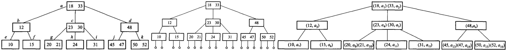

图 11.5　同一棵 3 阶 B 树的三种画法：(a) 通常的画法；(b) 把外部空结点画出来；(c) 画出隐含指针——$a_1 \sim a_{16}$ 是关键码在主文件里对应磁盘块的索引地址。**B 树的关键码在内部结点上也带着数据地址**，这正是它与后面 B+ 树的分水岭。

插入使结点超过上限（溢出）时，把它分裂成两个，并把分界 key 上推到父结点；父结点也可能接着分裂，最坏会一直裂到根，树增高一层。

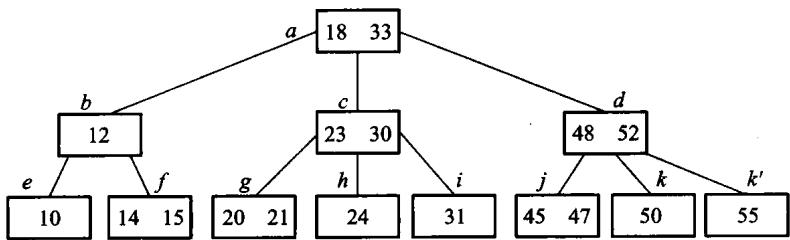

图 11.6　在图 11.5 的 3 阶 B 树里插入 14、55。两次插入都能就地放下，树高不变——**大多数插入就是这样结束的**。


图 11.7　再插入 19 就不行了：叶溢出、分裂、分界 key 上推，父结点跟着溢出，一路裂到根，树**增高一层**。B 树只在这一种情况下长高，所以它的所有叶永远在同一层。

删除使结点低于下限（下溢）时，先向左右兄弟借 key；借不到就把两个结点合并，分界 key 从父结点拿下来。借和合并都可能向上传播。

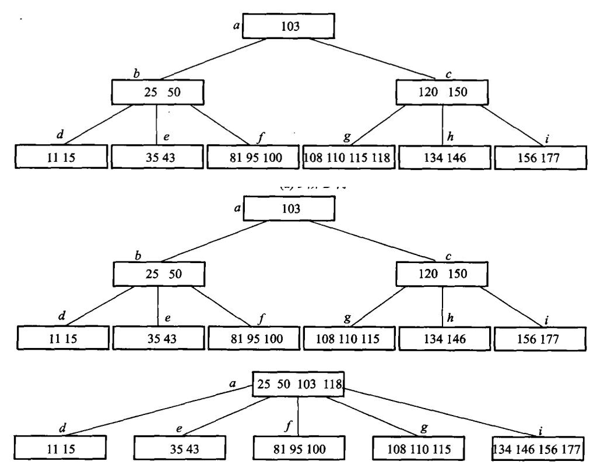

图 11.8　在一棵 (a) 5 阶 B 树上连续删除：(b) 删 120——先与中序后继交换再删，删后下溢，向左邻**借**一个关键码；(c) 接着删 150——同样先交换，删后下溢而两侧都借不到，只能**合并**，合并又让父结点下溢，一路传到根。

这些局部调整保证所有叶在同一层，所以 B 树始终平衡。

**B+ 树是 B 树的一种变形。** 实际应用中产生了一些 B 树的变形：每个结点的「充满度」可以不同；
树在不同层上可有不同的阶；每个关键码的长度可变；**把关键码全部顺序存储在叶结点上，而索引部分
是每个结点内最大（或最小）关键码的复写**——最后这一种就是应用得很广泛的 B+ 树。

**$m$ 阶 B+ 树的结构定义**：① 每个结点至多有 $m$ 个子结点；② 每个结点（除根外）至少有
$\lceil m/2 \rceil$ 个子结点；③ 根结点至少有两个子结点；④ **所有的叶结点在同一层，可以有
$\lceil m/2 \rceil$ 到 $m$ 个关键码，叶结点包含全部关键码以及相应的记录信息**（例如该记录在主文件中
的位置指针），**叶结点之间可以用双链表顺序链接**；⑤ 有 $k$ 个子结点的分支结点**必有 $k$ 个关键码**
（注意与 B 树的 $k-1$ 个不同）。

B+ 树把记录（或记录位置）全部放在叶上，内部结点只作路标，不存完整记录。叶按 key 从小到大串成一条链。点查询仍然从根走到叶；范围查询找到下限所在的叶之后，沿叶链顺序扫到上限即可，不必再回到内部结点。关系数据库的磁盘索引多用 B+ 树，正是因为范围扫描是常见操作。


B 树命中内部关键码时就可能拿到记录；B+ 树内部关键码只是叶键的复写，点查询仍要走到叶。看似多走一步，换来的是内部页只放短 key 和孩子指针，扇出更大、树更矮，而且所有记录都在同一叶层，范围访问路径统一。

一棵 3 阶 B+ 树可以这样看（内部结点只导航，数据全在最下一层，叶之间有横链）：

```text
                [  30  |  70  ]
               /       |       \
        [10|20]     [30|50]    [70|90]
           ↔           ↔           ↔
         记录…       记录…       记录…
```

本章的约定：3 阶指一个结点最多 3 个孩子，因此叶和内部结点都最多 2 个 key；内部结点的分界 key 取右子树最小 key 的复写。原书 11.4.2 用的是另一套约定——最大关键码复写，并把 m 阶 B+ 叶的容量定为 $\lceil m/2 \rceil$ 到 $m$ 个 key（3 阶叶因此存 2 到 3 个 key）。两套约定都成立，对照原书读时注意这处差别。

查找 50：根上 $30<50<70$，走中间孩子；叶上直接取到 50。查找 35 到 80：先落到含 35 的叶，再沿 `↔` 扫过 50、70，直到超过 80。

插入 60：中间叶暂成 `[30|50|60]`，超过 2 个 key 的上限。按原书 11.4.1 的分裂规则取中位数 50 作分界，叶裂成 `[30]` 和 `[50|60]`，50 复写一份上推（B+ 的分界 key 在叶上仍保留）。上推之后根成了 `[30|50|70]`、要挂 4 个孩子，同样超限，于是根也分裂：中位数 50 上移，成为新根，树增高一层。

| 阶段 | 发生溢出的页 | 局部结果 | 向父层传什么 |
| --- | --- | --- | --- |
| 插入前 | - | 叶 `[30,50]` | - |
| 插入 60 | 叶页 | `[30]` 与 `[50,60]` | 复写 50 |
| 父层接收 50 | 原根 | key 变为 `[30,50,70]`，4 个孩子 | 上移 50 |
| 建新根 | 根 | 新根 `[50]`，树高加 1 | 结束 |

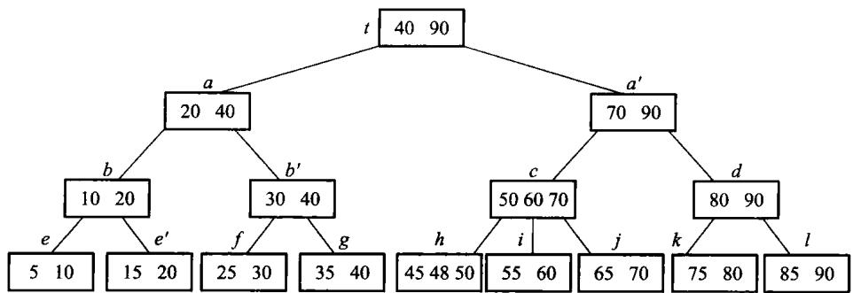

```text
                    [  50  ]
                 /            \
          [  30  ]            [  70  ]
         /       \          /        \
    [10|20]     [30]      [50|60]    [70|90]
       ↔          ↔           ↔          ↔
```

叶分裂时分界 key 是**复写**（叶上仍留一份），内部结点分裂时分界 key 是**上移**（原结点不再保留）——这是 B+ 树与 B 树最容易混的一处。两条规则并排写出来就是：

```cpp file=code/ch11/bplus_tree/modern.hpp#bplus-split
void split_leaf(Node* node, Split& split) {
    const std::size_t mid = node->keys.size() / 2;
    auto right = std::make_unique<Node>(true);
    right->keys.assign(node->keys.begin() + static_cast<std::ptrdiff_t>(mid), node->keys.end());
    right->values.assign(std::make_move_iterator(node->values.begin() + static_cast<std::ptrdiff_t>(mid)),
                         std::make_move_iterator(node->values.end()));
    node->keys.resize(mid);
    node->values.resize(mid);
    right->next = node->next;
    node->next = right.get();
    // 叶分裂：分界码是右叶最小关键码，复写上推，叶上仍保留。
    split.happened = true;
    split.separator = right->keys.front();
    split.right = std::move(right);
    writes_ += 2;
}

void split_internal(Node* node, Split& split) {
    const std::size_t mid = node->keys.size() / 2;
    auto right = std::make_unique<Node>(false);
    // 内部结点分裂：中位数上移，原结点不再保留它。
    split.separator = node->keys[mid];
    right->keys.assign(node->keys.begin() + static_cast<std::ptrdiff_t>(mid) + 1, node->keys.end());
    right->children.assign(
        std::make_move_iterator(node->children.begin() + static_cast<std::ptrdiff_t>(mid) + 1),
        std::make_move_iterator(node->children.end()));
    node->keys.resize(mid);
    node->children.resize(mid + 1);
    split.happened = true;
    split.right = std::move(right);
    writes_ += 2;
}
```

先跑一遍。上面那两张图不是画出来的，是这段程序打印出来的：

```cpp file=code/ch11/bplus_tree/demo.cpp
#include "modern.hpp"

#include <cstdio>

int main() {
    using dsa::index::BPlusTree;
    std::vector<std::pair<int, std::string>> rows;
    for (const int key : {10, 20, 30, 50, 70, 90}) {
        rows.emplace_back(key, "记录" + std::to_string(key));
    }
    // 11.2：批量装入，按页填满。
    BPlusTree tree = BPlusTree::bulk_load(3, rows, 2);
    std::printf("装入后   : %s\n", tree.to_string().c_str());

    // 11.4：插入 60，叶裂 → 根裂 → 树增高一层。
    tree.insert(60, "记录60");
    std::printf("插入 60  : %s（树高 %zu）\n", tree.to_string().c_str(), tree.height());
    tree.insert(65, "记录65");
    std::printf("插入 65  : %s（父结点没满，没裂到根）\n", tree.to_string().c_str());

    tree.reset_counters();
    // 先取结果再取计数：printf 的实参求值顺序没有保证。
    const auto found = tree.find(50);
    const std::size_t point_reads = tree.page_reads();
    std::printf("查找 50  : %s，读了 %zu 页\n", found->c_str(), point_reads);

    tree.reset_counters();
    const auto scan = tree.range(35, 80);
    const std::size_t scan_reads = tree.page_reads();
    std::printf("范围 35..80 :");
    for (const auto& row : scan) {
        std::printf(" %d", row.first);
    }
    std::printf("，读了 %zu 页\n", scan_reads);

    tree.erase(70);
    std::printf("删除 70  : %s\n", tree.to_string().c_str());
    return 0;
}
```

```text
装入后   : [30,70] / [10,20] [30,50] [70,90]
插入 60  : [50] / [30] [70] / [10,20] [30] [50,60] [70,90]（树高 3）
插入 65  : [50] / [30] [60,70] / [10,20] [30] [50] [60,65] [70,90]（父结点没满，没裂到根）
查找 50  : 记录50，读了 3 页
范围 35..80 : 50 60 65 70，读了 6 页
删除 70  : [50] / [30] [60,90] / [10,20] [30] [50] [60,65] [90]
```

范围扫描的写法直接对应「找到下限所在的叶，然后沿叶链横着走」：

```cpp file=code/ch11/bplus_tree/modern.hpp#bplus-range
/// 范围扫描：找到下限所在的叶，然后沿叶链横着走，不再回到内部结点。
[[nodiscard]] std::vector<std::pair<int, std::string>> range(int low, int high) const {
    std::vector<std::pair<int, std::string>> out;
    if (low > high) {
        return out;
    }
    const Node* node = root_.get();
    while (!node->leaf) {
        ++reads_;
        node = node->children[child_slot(*node, low)].get();
    }
    while (node != nullptr) {
        ++reads_;
        for (std::size_t i = 0; i < node->keys.size(); ++i) {
            if (node->keys[i] > high) {
                return out;
            }
            if (node->keys[i] >= low) {
                out.emplace_back(node->keys[i], node->values[i]);
            }
        }
        node = node->next;
    }
    return out;
}
```

删除 70：先在叶上删，若叶下溢就向兄弟借或合并，再改内部结点的路标。这里有一处容易漏：借位和合并都会把父结点的分界 key 搬进孩子里，而那个 key 可能正是刚被删掉的——搬完必须按「分界 key = 右子树最小 key」重算一遍，否则树里会留下一个指向已删关键码的路标。这个错误不影响点查询，只有结构不变量检查才看得出来（`code/ch11/bplus_tree/legacy.md` 记了实测过程）。

删除后的处理顺序固定：

1. 页仍达到最小占用，更新必要的父分界后结束；
2. 页下溢且相邻兄弟有富余，借一个键并重算父分界；
3. 兄弟也在下限，合并两页，父结点少一个 key 和一个孩子；
4. 父结点因此下溢，向上重复；若根只剩一个孩子，让该孩子成为新根，树高减 1。

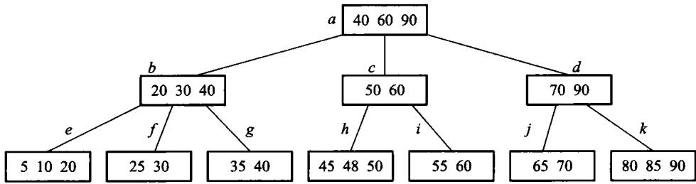

图 11.11　从图 11.9 的 3 阶 B+ 树里删掉 75 之后。内部结点上那份 75 的复写**可以留着不动**——它只是路标，不必对应一个真实存在的键。

实际系统里内部结点和叶结点的容量往往不同：内部结点只放短 key 和页号，放得下的多；叶要放记录或记录地址，放得少。内外阶数不同的叫**混合型 B+ 树**。

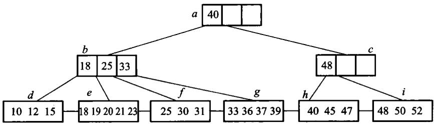

图 11.12　混合型 B+ 树：内部结点阶为 4，叶结点阶为 5。

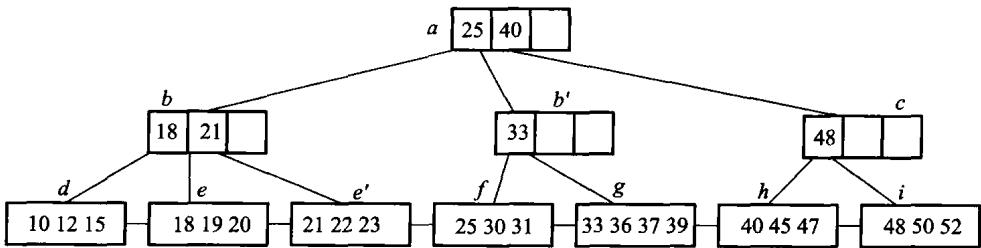

图 11.13　在图 11.12 的混合型 B+ 树里插入 22 之后。

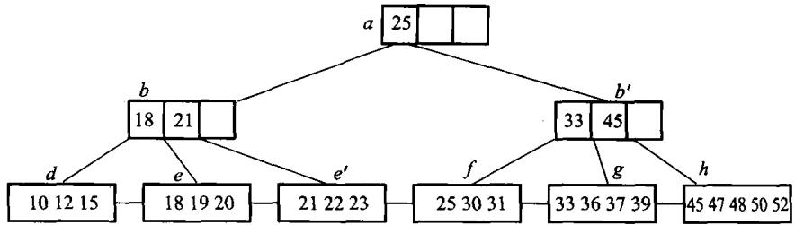

图 11.14　在图 11.13 上删除 40 之后。分裂与合并的规则不变，只是内外两层各按各自的阶判断溢出和下溢。

分裂与合并要同时维护叶链。只修父子指针而漏掉 `next`，点查询仍可能全绿，范围查询却会跨不过断链；所以测试既要逐键 `find`，也要把全范围扫描结果与排序后的记录全集对拍。

B 树与 B+ 树可以记成三句话：记录在不在内部结点；叶有没有横向链接；范围扫描要不要反复爬树。

### B 树的性能分析

**先算树高。** 设 B 树包含 $N$ 个关键码，那么扩展外部空结点（即失败检索）就有 $N+1$ 个。设外部结点
都在第 $I$ 层（根为第 0 层）：因为根至少有两个子结点，因此第一层至少有两个结点；除根和树叶外，
其他结点至少有 $\lceil m/2 \rceil$ 个子结点，因此第二层至少有 $2\lceil m/2 \rceil$ 个结点，第三层至少有
$2\lceil m/2 \rceil^2$ 个……第 $I$ 层至少有 $2\lceil m/2 \rceil^{I-1}$ 个结点，于是 $N+1 \ge 2\lceil m/2 \rceil^{I-1}$，即

$$I \le 1 + \log_{\lceil m/2 \rceil}\left(\frac{N+1}{2}\right)$$

**这意味着若 $N = 1999998$、$m = 199$，则 $I$ 至多等于 4。** 因为一次检索至多进行 $I$ 次存取，
这个公式保证了 B 树的检索效率是相当高的。

**再从磁盘块的角度估算 B+ 树的索引规模**（这段是全章最值得记住的一笔账）。假定磁盘块大小为 4096
个字节，整数型关键码值占 4 个字节，指针占 8 个字节；不考虑存储块块头信息所占的空间，满足
$4m + 8(m+1) \le 4096$ 的最大整数值 $m$ 就是 B+ 树的阶，$m = 340$。假若磁盘块的平均充满度介于
最大和最小中间，即平均有 255 个指针，则对于 3 层的 B+ 树：根结点有 255 个子结点，有
$255^2 = 65025$ 个叶结点，每个叶结点也有 255 个索引记录，即可以有 $255^3 \approx 16.6 \times 10^6$ 个
指向记录的指针。**也就是说，记录数小于等于约 1660 万的文件都可以被 3 层的 B+ 树容纳，3 次访外
就可以获得关键码在主文件的地址。**

**实际上还可以更少。** 由于 B+ 树树根通常处于内存中，而且现在系统内存空间都比较大，把 B+ 树的
第二层结点完全保存在缓冲区中也是合理的——**这样只需要读一次叶结点磁盘块**。这一句解释了今天
数据库索引的常见形态：三层 B+ 树 + 常驻内存的上两层。

**插入时平均分裂几个结点？** 设 $p$ 是内部结点个数、$N$ 是关键码个数。当根包括一个关键码、除根外
所有内部结点都包括 $\lceil m/2 \rceil - 1$ 个关键码时，B 树所包括的总关键码个数最少，因此有
$N \ge 1 + (\lceil m/2 \rceil - 1)(p-1)$。考虑最坏情况（从第二个结点开始每个结点均是经过分裂而
得到的），插入 $N$ 个关键码的过程中进行了 $p-1$ 次分裂，那么每插入一个关键码平均分裂的结点个数

$$s = \frac{p-1}{N} \le \frac{N-1}{(\lceil m/2 \rceil - 1) \cdot N} \le \frac{1}{\lceil m/2 \rceil - 1}$$

$m$ 越大这个数越小——**这正是「结点开大一点」在插入代价上的回报**。

**B 树与 B+ 树谁更矮？** B+ 树内部分支结点（非叶层）中的关键码不需要像 B 树那样带隐含指针。
在磁盘页块容量一致、页块指针大小相同的情况下索引同一个主文件，**B 树比 B+ 树高，即 B+ 树索引
效率更高**：设主文件有 $N$ 个记录，关键码所占字节数与指针相同，一个磁盘页块可以存 $m$ 个
（关键码，子结点页块地址）二元对；B+ 树最大充盈度 100%、最小 50%，假设平均充盈度
$(1+0.5)/2 = 75\%$，即平均每个结点有 $0.75m$ 个子结点，则 B+ 树的高度为 $\lceil \log_{0.75m} N \rceil$。

### 11.4.4 动态索引和静态索引性能的比较

静态索引在建立后不主动重排主文件；新增记录通常进入溢出区并挂链。它的结点紧凑、层数少，记录地址稳定，辅助索引也容易维护；但插删积累后溢出链变长、空洞增多，查询与空间利用率都会下降，最终必须停下来重组文件。

动态索引用 B 树或 B+ 树的分裂、借位和合并保持平衡。新旧记录具有相同的渐近查询代价，空间按需分配，也不需要周期性的全文件重组；代价是每个结点要保留孩子指针，树可能更高，更新还要处理并发锁与辅助索引中的地址变化。

| 工作负载 | 更合适的选择 | 原因 |
| --- | --- | --- |
| 数据几乎只读、可批量重建 | 静态索引 | 结构紧凑，读路径短 |
| 持续插入和删除 | B/B+ 树动态索引 | 局部调整即可保持查询性能 |
| 范围扫描很多 | B+ 树 | 数据集中在叶层，叶链可顺序读 |
| 记录物理地址必须长期稳定 | 静态索引 | 不因结点分裂搬动既有记录 |

选择的关键不是“哪一种总是更快”，而是更新成本由谁承担：静态索引把成本推迟到昂贵的批量重组，动态索引把成本摊到每次更新。读多写少且有维护窗口时静态结构仍有价值；在线系统无法停机重组时，动态索引通常更合适。

## 11.5 位索引技术

### 位图、签名和红黑树

位图索引适合取值很少的属性，例如性别、省份、是否及格。每个属性值对应一个位串，第 $i$ 位表示第 $i$ 条记录有没有这个值。AND、OR、NOT 查询变成机器字上的按位运算，一次可以处理几十上百条记录。属性取值一多，位图会变得很宽，需要压缩（游程、字对齐混合等）。

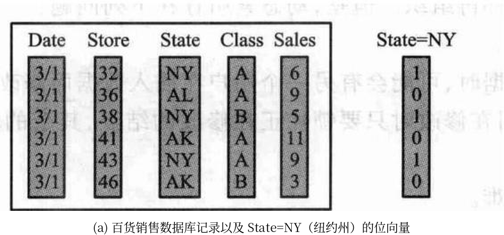

(b) 数据域 State 的位向量集合

| State=AK | State=AL | … | State=NY |
| --- | --- | --- | --- |
| 0 | 0 |  | 1 |
| 0 | 1 |  | 0 |
| 0 | 0 |  | 1 |
| 1 | 0 |  | 0 |
| 0 | 0 |  | 1 |
| 1 | 0 |  | 0 |

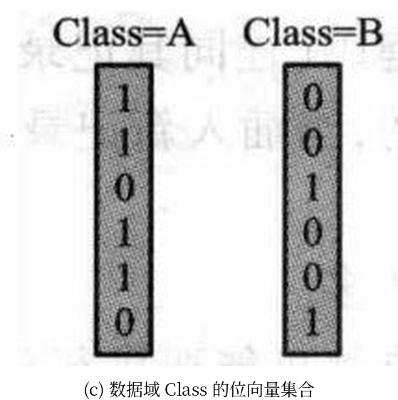

图 11.15　百货销售数据库记录的位图索引。**一个属性值一条位串**：State 有多少个取值，(b) 就有多少列，每列长度都是记录条数；查询于是变成位串之间的按位运算。属性取值越多，位图越宽——这正是位图索引只适合低基数属性的原因。

设 6 条记录的州属性和等级属性形成两条位图：

```text
State=NY : 1 0 1 0 1 0
Class=A  : 1 1 0 1 1 0
AND      : 1 0 0 0 1 0
```

结果位 0 和 4 为 1，所以查询返回第 1、5 条记录（若程序下标从 0 开始则是 0、4）。OR 返回满足任一条件的记录，NOT 必须把超出实际记录数的尾部位清零；否则一个 64 位机器字只用了前 6 位，取反后其余 58 位都会被误认成记录。

位图总空间约为“记录数 × 属性不同取值数”位。低基数列很合算：一百万条记录的“是否及格”只有两张约 122 KiB 的位图；若把几乎每人不同的学号做位图，就会生成近一百万张位图，完全失去意义。

签名文件把一篇文档的特征散列成较短的位串。查询时先用签名快速丢掉不可能匹配的文档，再回到原文确认。签名可能产生假阳性（签名说可能有、原文里没有），不能有假阴性。它适合「先粗筛、再精查」的全文检索，不替代倒排。

红黑树是内存里的近似平衡二叉搜索树：每个结点带一种颜色，通过几条局部规则保证从根到叶的黑结点数相同，最长路径不超过最短路径的两倍。查找、插入、删除都是 $O(\log n)$，旋转次数有常数上限。它适合进程地址空间里的有序映射，不替代按页组织的 B+ 树。本书不另写红黑树实现，只作对照讨论。

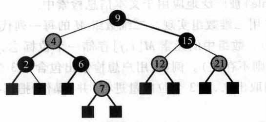

图 11.16　红黑树示意图。

红黑树的“平衡”不是要求左右子树等高，而是用颜色约束控制最长路径：根为黑、红结点不能有红孩子、从任一结点到其后代空叶的黑结点数相同。由此可得原书的四条性质，其中最有用的一条是：含 $n$ 个内部结点的红黑树，树高最多 $2\log_2(n+1)+1$——**最长路径不超过最短路径的两倍**，检索因此是 $O(\log n)$。

本章的外存主线是 B+ 树，红黑树只作对照，所以下面按原书把调整规则列一遍、不另写实现。

**插入。** 先按普通二叉搜索树找到位置，把新结点着成**红色**。父结点是黑的就结束；父子都红就要调整，分两种情况看**叔父结点**的颜色。

情况 1：叔父是黑色。这时靠旋转解决。

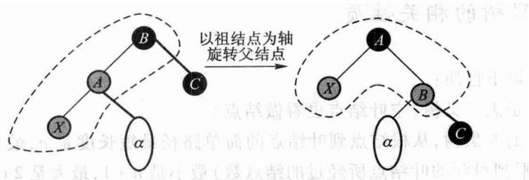

图 11.17　父结点红、叔父黑：旋转一次解决红红冲突。图中新增结点 X 是父结点 A 的左孩子；X 是右孩子时先把 X 与 A 换位，就化归成同一种形状。

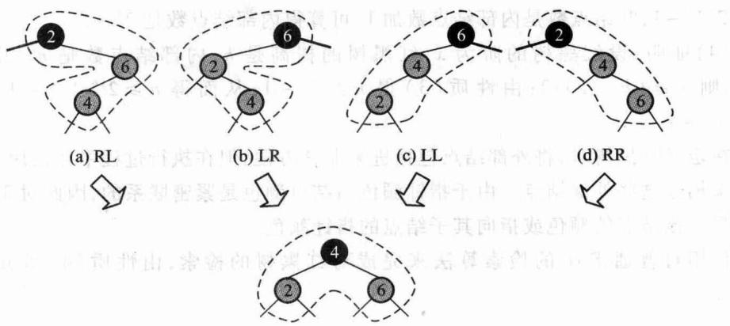

图 11.18　叔父为黑时一共四种子结构（LL、LR、RL、RR）。四种的实质是同一件事：**取「双红结点 + 祖父」这三个键的中位数当新的子根、着黑，另外两个当它的孩子、着红**。每个结点的阶（黑高）都不变，调整到此结束。

情况 2：叔父也是红色。这时不必旋转，只要换色。

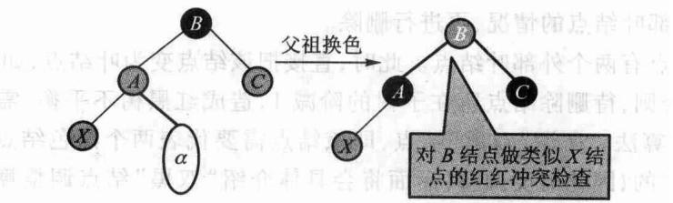

图 11.19　父与叔父都红：把父 A 和叔父 C 都改成黑、祖父 B 改成红。A 以下的冲突解决了，但 B 可能与它的父结点再冲突，于是**把 B 当成新的 X 递归上去**。最坏一路推到根，把根改回黑色即可——这是红黑树唯一会长高（阶加 1）的时刻。

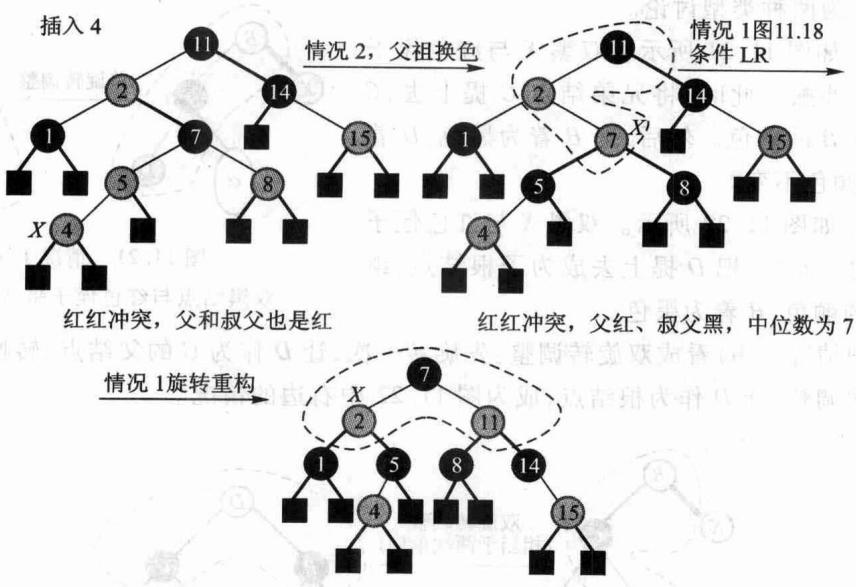

图 11.20　一次插入引发的红红冲突调整全过程。

**删除。** 先照 BST 删：待删结点若有两个非空孩子，就与右子树的最小结点交换值（颜色不动），转成「至多一个非空孩子」的情形再删。删完可能出现**双黑**结点，这是删除最复杂的地方，按兄弟和侄子的颜色分三种情况——下面都按「双黑是左孩子」写，右孩子左右对称。

情况 1(a)：兄弟黑、红侄子与双黑呈八字形外撇。

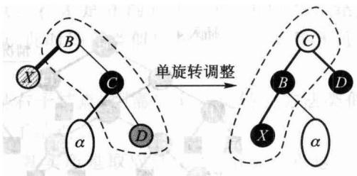

图 11.21　把兄弟 C 提上去继承原父结点 B 的颜色，B 与侄子 D 都着黑。

情况 1(b)：兄弟黑、红侄子与双黑同边顺。

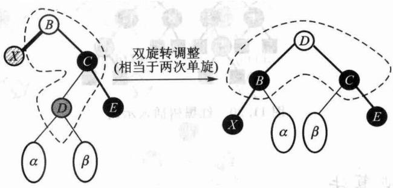

图 11.22　把侄子 D 提上去当子根、继承原子根 B 的颜色，B 着黑。也可以看成双旋转：先转一次化归成情况 1(a)，再转一次。

情况 2：兄弟黑，且兄弟的两个孩子都是黑。

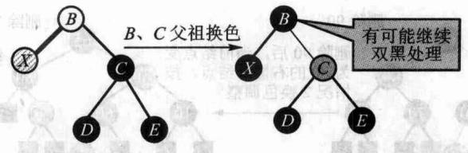

图 11.23　只换色：兄弟 C 着红、父 B 着黑。B 原来是红的就此结束；原来是黑的，就把 B 当成新的双黑继续往上调整。

情况 3：兄弟是红色。

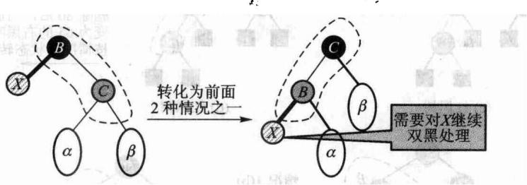

图 11.24　此时父结点必为黑、兄弟的两个孩子必为黑。旋转一次之后 X 仍是双黑，但已经**化归成前两种情况**，继续处理即可。

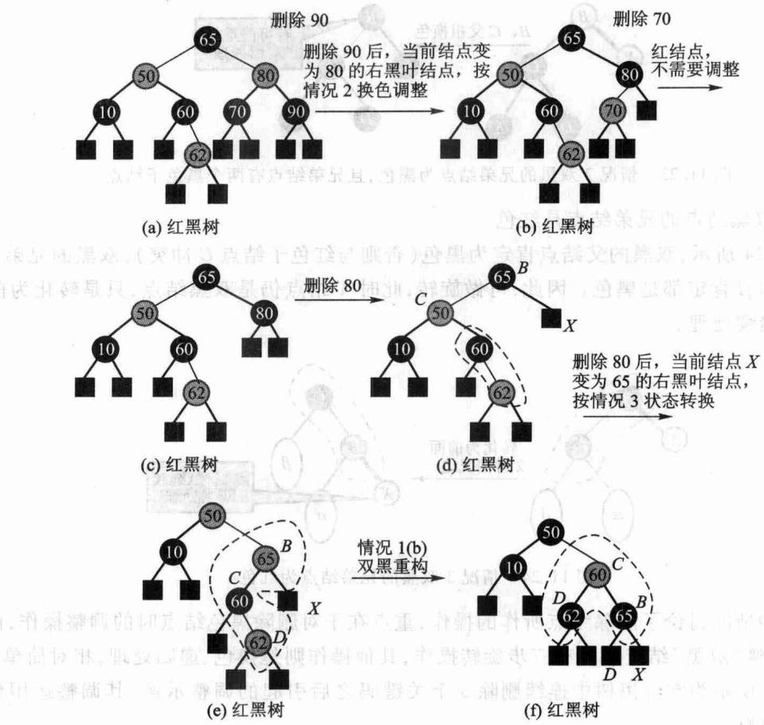

图 11.25　连续删除 90、70、80 引起的双黑调整全过程。

图 11.16 到 11.25 只用来比较「二叉、内存结点」与「多路、页结点」两种成本模型：红黑树每步只碰几个结点、适合内存里的有序映射；B+ 树每步碰一整页、适合按页读写的外存索引。

先跑一遍：

```cpp file=code/ch11/bitmap_index/demo.cpp
#include "modern.hpp"

#include <cstdio>

int main() {
    dsa::index::BitmapIndex index;
    for (int i = 0; i < 200; ++i) {
        index.add_record((i % 3) == 0 ? "及格" : "不及格");
    }
    index.reset_ops();
    const auto passed = index.select("及格");
    const auto failed = index.select_not("及格");
    std::printf("200 条记录，%zu 个取值，位图共 %zu 个机器字\n",
                index.distinct_values(), index.words());
    std::printf("及格 %zu 条，不及格 %zu 条；取反只做了 %zu 次字运算\n",
                passed.size(), failed.size(), index.word_ops());

    // 稀疏位图：大片全 0 的字，游程压缩很有效。
    dsa::index::BitmapIndex sparse;
    for (int i = 0; i < 1000; ++i) {
        sparse.add_record(i < 3 ? "命中" : "其他");
    }
    const auto bits = sparse.bitmap("命中");
    const auto encoded = dsa::index::run_length_encode(bits);
    std::printf("稀疏位图 %zu 个字 → 游程压缩后 %zu 个字\n", bits.size(), encoded.size());

    dsa::index::SignatureFile signatures(2);
    signatures.add(1, {"数据", "结构"});
    signatures.add(2, {"算法", "分析"});
    std::printf("签名粗筛「数据」的候选文档数：%zu（仍需回原文确认）\n",
                signatures.candidates({"数据"}).size());
    return 0;
}
```

```text
200 条记录，2 个取值，位图共 8 个机器字
及格 67 条，不及格 133 条；取反只做了 4 次字运算
稀疏位图 16 个字 → 游程压缩后 4 个字
签名粗筛「数据」的候选文档数：1（仍需回原文确认）
```

第二行就是位图的全部理由：200 条记录只占 4 个机器字，一次取反做 4 次运算就处理完了全部记录。查询写出来只是逐字的按位运算：

```cpp file=code/ch11/bitmap_index/modern.hpp#bitmap-ops
/// 「与」：逐字 `&`。`word_ops()` 数的就是这里做了几次字运算。
[[nodiscard]] std::vector<std::size_t> select_and(const std::string& a,
                                                  const std::string& b) const {
    return to_records(combine(bitmap(a), bitmap(b), Op::And));
}

[[nodiscard]] std::vector<std::size_t> select_or(const std::string& a,
                                                 const std::string& b) const {
    return to_records(combine(bitmap(a), bitmap(b), Op::Or));
}

[[nodiscard]] std::vector<std::size_t> select_not(const std::string& value) const {
    std::vector<std::uint64_t> bits = bitmap(value);
    for (auto& word : bits) {
        word = ~word;
        ++ops_;
    }
    mask_tail(bits);  // 最后一个字里超出记录数的那些位必须清掉
    return to_records(bits);
}
```

注意 `mask_tail`：记录数不是 64 的整数倍时，最后一个字里超出记录数的那些位取反后会变成 1，于是冒出根本不存在的记录号。这是位图实现最常见的一个洞。

压缩不是万能的。上面稀疏位图 16 个字压到 4 个，但对 0 和 1 交替的稠密位图，游程压缩后**反而更大**——`code/ch11/bitmap_index/test.cpp` 直接断言了这一点，不粉饰。

签名文件也需要一个反例才能看清边界。若“数据”和“结构”经散列后碰巧设置了与“算法”相同的几位，查询“算法”时这篇文档会进入候选集，即假阳性；但只要构造签名时把每个真实词的位都置上，真正含“算法”的文档不可能被漏掉。粗筛之后必须回原文确认，不能把候选集直接当查询答案。

| 结构 | 保存什么 | 可能的额外工作 | 适合场景 |
| --- | --- | --- | --- |
| 倒排表 | 词到文档号/位置的列表 | 合并有序列表 | 精确全文检索、短语查询 |
| 位图 | 属性值到记录位向量 | 按位布尔运算 | 低基数列组合过滤 |
| 签名 | 文档特征的短位串 | 假阳性后回原文确认 | 空间受限的粗筛 |
| B+ 树 | 有序 key 到记录位置 | 沿页树下降、沿叶链扫描 | 点查询与范围查询 |

## 练习路径

本章四个方向都已有可运行实现，练习因此从「照着写一遍」改成「在已有实现上再往前走一步」：

1. 给 `MultiLevelIndex` 的页内定位换成二分查找，测量比较次数的变化，并确认**页访问次数一次都没变**——本章的关键指标不在这里。
2. 给 `InvertedIndex` 的倒排表加差值编码（只存与前一个文档号的差），比较压缩前后的表长；注意求交时要能边解码边归并。
3. 给 `BPlusTree` 加一个「按范围批量删除」的接口，并用 `validate()` 确认每一步之后结构仍然合法。
4. 给 `BitmapIndex` 换成字对齐混合编码（WAH），和现在的字级游程比压缩率；用交替位图确认它不会像现在这样越压越大。
5. 为 `SignatureFile` 做一次参数实验：固定语料，改变每词位数，画出假阳性率随位数的变化。


## 本章小结

### Python 实现的证据链

```python file=code/ch11/linear_index/modern.py#index-find
def find(self,key):
    if not self._levels:
        return None
    page = self._locate(self._levels[-1],0,len(self._levels[-1]),key)
    for level in range(len(self._levels)-1,0,-1):
        page = self._levels[level][page][1]
        self._reads += 1
        first = page*self.epp
        last = min(first+self.epp,len(self._levels[level-1]))
        page = self._locate(self._levels[level-1],first,last,key)
    entry = self._levels[0][page]
    if self.kind==DENSE:
        if entry[0]!=key:
            return None
        self._reads += 1
        return self.records[entry[1]][1]
    self._reads += 1
    for record_key,value in self.records[entry[1]*self.rpp:(entry[1]+1)*self.rpp]:
        if record_key==key:
            return value
    return None
```

```python file=code/ch11/inverted_index/modern.py#inverted-intersect
def intersect(left, right):
    out = []
    i=j = 0
    while i<len(left) and j<len(right):
        if left[i]<right[j]:
            i += 1
        elif right[j]<left[i]:
            j += 1
        else:
            out.append(left[i])
            i += 1
            j += 1
    return out

def unite(left, right):
    out = []
    i=j = 0
    while i<len(left) or j<len(right):
        if j==len(right) or (i<len(left) and left[i]<right[j]):
            value = left[i]
            i += 1
        elif i==len(left) or right[j]<left[i]:
            value = right[j]
            j += 1
        else:
            value = left[i]
            i += 1
            j += 1
        if not out or out[-1]!=value:
            out.append(value)
    return out

def difference(left, right):
    out = []
    j = 0
    for value in left:
        while j<len(right) and right[j]<value:
            j += 1
        if j==len(right) or right[j]!=value:
            out.append(value)
    return out
```

```python file=code/ch11/bitmap_index/modern.py#bitmap-ops
def select_and(self,a,b):
    return self._combine(a,b,lambda x,y:x&y)
def select_or(self,a,b):
    return self._combine(a,b,lambda x,y:x|y)
def select_not(self,value):
    bits = [(~word)&MASK for word in self.bitmap(value)]
    self._ops += len(bits)
    if bits and self._count%64:
        bits[-1] &= (1<<(self._count%64))-1
    return self._records(bits)
```

**B+ 树这一节没有 Python 版，理由值得单独讲一句。** 本书讲算法的章节两种语言各给一份
（D-025），但 B+ 树讲的**不是算法，是页式存储管理**：页容量、装填因子、结点分裂、
删除时的借位与合并，以及 `page_reads()` / `page_writes()` 这两个只有在真的按页访问时
才有意义的计数器。这些东西在一个 `list` 上无处安放——和 3.1 节的顺序栈、4.2 节的
字符串类是同一条线。

这不是事后的托词，是**试出来的**。本书曾提交过一版 Python「B+ 树」：内部是一个有序
`list`，`height()` 与 `leaf_count()` 由记录数套公式算出，`page_reads()` 累加的是那个
公式的结果，而标着「结点分裂」的那段代码里没有任何分裂。它跑得通，闸门也是绿的——
**因为一个不存在的结构，没有任何断言能证伪它**。理由与那次的结论一起记在
`code/ch11/bplus_tree/unit.json` 的 `py_skip` 字段里，闸门核对该单元确实没有
`modern.py`。想看 B+ 树按页分裂到底怎么写，读上面那段 C++。

**索引就是把关键码与其主文件中的数据记录位置相关联的过程**，索引文件则是用于记录这种联系的文件
组织结构。**索引技术的目的是在支持高效数据（尤其是外存的大量数据）检索的同时，支持高效的插入和
删除操作，它是数据库的核心技术之一。**

实际应用中经常需要根据属性的值来查找记录，因此采用**倒排索引**技术：每一项都包括一个属性值和
具有该属性值的那些记录地址；由于不是由记录来确定属性值，而是由属性值来确定记录的位置，因此
称为倒排索引，带有倒排索引的文件称为倒排文件。

**线性索引**被组织成简单的（关键码，指针）的序列，按照关键码的顺序进行排序，其常用的检索技术是
二分检索；数据规模太大、索引文件无法完全存储到内存时，可以采用二级线性索引。

**多分树静态索引结构**在文件创建、初始装入记录时生成，并固定不变，插入和删除操作非常不方便——
只有当文件再组织时才允许改变索引结构。

**$B$/$B^+$ 树是动态的索引结构**，允许动态地插入或删除记录，索引结构本身也可能发生改变；改变索引
结构的目的是为保持较好的性能，例如较高的检索效率。$B$ 树和 $B^+$ 树都是经典的动态索引，本质上是
平衡的多分树：$B$ 树中的关键码没有重复，父结点中的关键码是其子结点的分界。**$B^+$ 树是 $B$ 树的
一种变形树，它不同于 $B$ 树的特点是**：(1) 有 $k$ 个子结点的结点必然有 $k$ 个关键码；(2) $B^+$ 中叶
结点是关键码的一个全集，跟实际数据记录有关的信息均存放在叶结点中；(3) 内部分支结点仅具有索引
作用，可以看做是从叶往根的方向一层层复写子结点中的最大（或最小）关键码。

$B$ 树、$B^+$ 树的插入与删除都要特别注意保持其平衡性质，特别是等高、子结点个数、关键码个数的
上下界限制。**$B$ 树的插入可以说是「插入—分裂」的过程**：首先是在恰当的叶结点中添加关键码，插入
分裂时中位数要向父结点中传递，分裂过程可能一直传到根、建立一个新根结点，树增高一层。
**$B$ 树的删除可以说是「交换—删除—借关键码—合并」的过程**：若被删码不在叶结点层，则先把此关键码
与其后继对换位置然后再删除；借关键码时父结点中的分界码要合并到两个相邻结点的关键码集合中，
该集合的中位数尽量把集合平等划分为两个新结点、中位数代替父结点中的原分界码；发生合并时，父结点
中的分界码要拿下来合并到两个相邻结点的关键码集合中，合并也可以传递到根。

**$B^+$ 树检索时必须继续沿指针向下一直查到叶结点层的关键码**，才能找到跟记录有关的信息（例如指向
该记录主文件中位置的指针）。$B^+$ 树的插入也是「插入—分裂」的过程，也是在叶结点上开始：如果上溢
导致叶结点分裂，父结点会增加一个复写分界关键码，也有可能要修改原复写分界码的值，目的是保证上层
结点中有这两个结点的复写码。**$B^+$ 树的删除是「删除—借关键码—合并」的过程，不需要交换**——$B^+$
树中的关键码在叶结点层删除后，在不影响检索的前提下，在上层的复本可以保留作为一个「分界关键码」
存在。

**$B$ 树只适合随机检索。$B^+$ 树的所有叶结点构成一个有序链表，可以按照关键码大小有序地遍历全部
记录，因此 $B^+$ 树同时支持随机检索和顺序检索（尤其是范围检索），在实际中应用比较多。**

$B$/$B^+$ 树适合于检索并取回少量记录的情况；**对于唯一值极少（低基数）的数据域，适合采用位图索引
技术**，用位串来代表数据库列中是否存储该数据域取值，计算机可以迅速地执行位图映射操作，这是一种
非常高效的索引。**签名文件**被广泛地应用于文本信息检索中，其核心思想是把文本的特征用签名位串来
表示；签名文件比原文件小得多，因此可以提供更快速的检索。

**红黑树**也是一种二叉搜索树，它没有第 12 章将要介绍的 AVL 树那样完全平衡的特性，而是利用对树中
结点红黑着色的要求降低了平衡性的条件，达到局部平衡，从而既能提高红黑树增删记录的性能，又能达到
高效率的检索要求。**它的统计性能要好于 AVL 树，且增删记录算法性能好、易实现，因此红黑树是一种
很好的索引结构**——C++ STL 的 `set`、`multiset`、`map`、`multimap` 都应用了红黑树的变体，
Linux 内核中的用户态地址空间管理也使用了红黑树。

具体到本章的实现：线性索引分稠密和稀疏，过大就做成多级。静态多分树把一个结点做成一页，树高低、
页访问少，但不适合频繁更新。倒排从属性走到记录集合，查询变成交并差。B 树在页内分裂合并以保持
平衡；B+ 树把记录放在叶上并用叶链做范围扫描。位图适合低基数属性，签名做粗筛，红黑树是内存有序映射。

## 习题

### 补充索引题（参考课程第 11 章）

1. 给定页大小、记录大小和索引项大小，计算稠密索引最多支持的记录数及二级索引的访外次数。
2. 对给定的院系表和宿舍表建立倒排索引，并求“院系且宿舍”查询的交集。
3. 模拟 B+ 树查找、插入分裂和删除后继替换，分别统计读页和写页次数。

1. 稠密索引和稀疏索引各要求主文件怎样组织。
2. 多级索引一次查询大约读几页？关键指标为什么不是比较次数。
3. 静态多分树插入一条溢出记录会发生什么。
4. 用倒排表求「计算机系且擅长英语」的交集。
5. 在 11.4 插入 60 之后的那棵 3 阶 B+ 树上继续插入 65，写出叶和根，并说明这次为什么没有一直裂到根。
6. 位图、签名、红黑树、B+ 树各适合内存还是外存、点查询还是范围查询。

### 原书习题

> 以下是原书第 11 章的习题，本轮按扫描件补回题面；**参考答案尚未写出**，已逐题登记在
> `collab/answer_gaps.json`。图 11.1、11.2、11.9、11.12、11.26～11.31 见原书。

1. 假定一个计算机系统有 4096 B 的磁盘块。存储的每一条记录中 4 B 是关键码、64 B 是数据域，记录
   已经排序、顺序地存放到磁盘文件中。线性索引的结构为（每块的最小关键码，该块的磁盘地址），地址
   指针为 4 B。通过线性索引访问磁盘文件中的记录。(1) 如果线性索引的大小是 2 MB，最多可以在磁盘
   文件中存储多少条记录？(2) 如果线性索引也存储在磁盘中（这样它的大小仅受二级索引限制），而且使用
   4096 个字节（即 1024 个关键码值）的二级索引时，文件中最多可以存储多少条记录？二级索引中的每个
   单元引用线性索引磁盘块中的最小关键码值。
2. 假定一个数据库存储的记录由 2 个字节的整数关键码和一个变长的数据域组成，数据域是一个字符串。
   试给出下面一组记录的线性索引：`397 Hello world!`、`82 XYZ`、`1038 This string is rather long`、
   `1037 This is shorter`、`42 ABC`、`2222 Hello new world!`。
3. 设有一个职工文件，并设该文件由 5 个记录组成，其中职工号为关键码（记录见原书表）。
   (1) 若该文件为顺序文件，试写出文件的存储结构；(2) 若该文件为索引顺序文件，试写出索引表；
   (3) 若该文件为倒排文件，试写出关于性别的倒排索引和关于职业的倒排索引。
4. 对于图 11.9 所示的 $B$ 树，依次进行如下操作：插入关键码 480，删除关键码 375，分别画出每次操作
   后 $B$ 树的形状。
5. 画出能由 1、2、3、4、5、6、7、8 构成的所有 5 阶 $B$ 树。
6. 求满足如下条件的序列的最短长度：按照序列顺序插入关键码能生成高度为 3 的 5 阶 $B$ 树。
7. 假设按如下方法修改从 $B$ 树中删除元素的方式：如果一个结点既有最相邻左兄弟也有最相邻右兄弟，
   那么在合并前对两个兄弟都要做检查。从一棵高度为 $h$ 的 $B$ 树中删除元素时需要的最大磁盘访问
   次数是多少？
8. 设有一棵阶 $m=3$ 的 $B$ 树（图 11.26），其中 $a, b, \cdots, g$ 是结点的名称、结点内的整数为关键码。
   若在图中插入关键码 55，画出插入后 $B$ 树的状况，计算完成该插入所需要的访外次数（假定一次访外
   存取一个结点），并具体说明每次访外的功能。
9. **偶数阶的 $B$ 树插入上溢出时，中位数有两个，需要注意采用统一的策略。** 例如取第二个中位数，即
   分裂后左 $\lceil (m-1)/2 \rceil$ 个关键码、右 $\lfloor (m-1)/2 \rfloor$ 个关键码；或者取第一个中位数，
   分裂后左 $\lfloor (m-1)/2 \rfloor$ 个关键码、右 $\lceil (m-1)/2 \rceil$ 个关键码。试画出对图 11.27 所示的
   4 阶 $B$ 树进行下列操作后的 $B$ 树：(1) 分裂时采用第 2 个中位数为分界码，试画出插入关键码 113 后
   的 $B$ 树；(2) 分裂时采用第 1 个中位数为分界码，试画出插入关键码 113 后的 $B$ 树；
   (3) 在原树中删除关键码 50。
10. 分别画出在如图 11.28 所示的 3 阶 $B$ 树中，进行下列操作后的 $B$ 树：(1) 插入关键码 75；
    (2) 删除关键码 156。
11. 在 $B$ 树定义中，特性 (2) 的意义是什么？如果把 $\lceil m/2 \rceil$ 改成 $\lceil m/3 \rceil$ 或者
    $\lceil 2m/3 \rceil$ 是否可以？所得到的树结构和 $B$ 树有何区别？
12. $B$ 树中的某个关键码不在叶结点中，试证明它的前驱和后继（自然顺序）必然在叶结点中。
13. 在含有 $n$ 个关键码的 $m$ 阶 $B$ 树中进行检索时，最多访问多少个结点？
14. 试证明：高度为 $h$ 的 2-3 树（3 阶 $B$ 树）中叶结点数目在 $2^{h-1}$ 与 $3^{h-1}$ 之间。
15. 假设一个数据文件每个记录对象需要占用 128 B（其中关键码占用 4 B），且所有记录均已按关键码
    有序地存储在主磁盘文件中。设磁盘页块大小为 2048 B，若主存中有 12 MB 空间可以用来存储索引
    结构，索引项中每一个地址指针占 8 B。试简要回答以下问题（写明计算过程）：(1) 使用 $B$ 树索引，
    $B$ 树的阶 $m$ 最多可以为多少？（注：在 $B$ 树中找到关键码的同时，应该可以得到其在主文件中的
    地址。）(2) 4 层 $m$ 阶 $B$ 树最多可以索引多少字节的数据文件？（注：独根 $B$ 树算 1 层，空 $B$ 树算
    0 层。）(3) 假设尽量把 $B$ 树的头几层放入内存（本题规定不能超过 12 MB），那么给定关键码，通过
    $B$ 树查找到 (2) 小题中主数据文件的一个记录，最少需要几次访外？最多需要几次访外？
    (4) 上述问题 (1)～(3) 中的 $B$ 树换成 $B^+$ 树，试回答相关的问题。
16. 假定一个文件有一兆（1000000）个记录，每个记录占 200 B，其中关键码占 50 B。一个磁盘页块（结点）
    有 1000 B，页块指针为 5 B。若用 $B^+$ 树组织索引，并假定所有页块（结点）都尽可能装满，则需要多少
    索引页块（即 $B^+$ 树中有多少个非叶结点）？在上述文件组织中存取一个记录需要多少次外存访问？
17. 对于下面两种 $B^+$ 树，列表给出它们在 1、2、3、4 和 5 层（独根是一层树）的不同情况下，能够存储的
    最大记录数和最小记录数：(1) 如图 11.9 那样的 $B^+$ 树，其内部结点阶为 50、叶结点阶为 50；
    (2) 如图 11.12 那样的混合型 $B^+$ 树，其内部结点阶为 100、叶结点阶为 15。
18. 给定一组记录，其关键码值是字母。记录按照下面的顺序插入：C、S、D、T、A、M、P、I、B、W、N、G、U、
    R、K、E、H、O、L、J。试给出插入这些记录后的 4 阶 $B^+$ 树，假定叶结点最多可放 3 条记录。
19. 已知一组关键码为 $(20, 30, 50, 52, 60, 68, 70)$，试依次插入关键码：(1) 生成一棵 3 阶的 $B$ 树，
    画出每次插入一个关键码后 $B$ 树的结构，并画出删除 50 和 68 后的 $B$ 树状态；(2) 生成一棵 3 阶的
    $B^+$ 树，画出每次插入一个关键码后 $B^+$ 树的结构，并画出删除 50 和 68 后的 $B^+$ 树状态。
20. 假定一个文件由 15 个记录组成，每个记录的关键码均为整数，分别为 $1^2, 2^2, 3^2, \cdots, 15^2$。
    每个数据页块存放 3 个记录。要求：(1) 用 $B$ 树组织索引，设 $m=3$，依次将上述 15 个关键码插入
    $B$ 树，画出插入后的 $B$ 树的结构图；(2) 用 $B^+$ 树组织索引，设 $m=3$，依次将上述 15 个记录插入
    文件中，画出插入后的整个文件的结构图（包括 $B^+$ 树索引）。
21. 在如图 11.29 所示的 2 阶 $B^+$ 树中，删除关键码 35。试讨论删除后应该是 2 层 $B$ 树，还是 3 层
    $B$ 树。
22. 图 11.30 所示为一棵混合型 $B^+$ 树，假定内部结点的阶为 4、叶结点的阶为 3。(1) 画出插入关键码
    `C` 以后的 $B^+$ 树；(2) 画出删除关键码 `I` 以后的 $B^+$ 树。
23. 下面是顾客记录，格式为「顾客号：(年龄, 月收入)」：1:(25,600) 2:(45,600) 3:(50,750) 4:(50,1000)
    5:(50,1200) 6:(70,1100) 7:(85,1400) 8:(30,2600) 9:(25,4000) 10:(45,3500) 11:(50,2750)
    12:(60,2600)。(1) 试写出年龄位图索引向量集合；(2) 试写出月收入位图索引向量集合；
    (3) 找出年龄范围为 20～40 且月收入为 1000～2000 元的顾客。
24. 考虑一个具有 1000000 个记录的文件，其数据域 $F$ 有 $m$ 个不同值。(1) $F$ 的位图索引有多少个
    字节？(2) 假定数据域 $F$ 的每个取值每隔 $m$ 个记录出现一次，试设计一种合适的压缩存储方案，
    并计算该压缩索引需要多少个字节？
25. 对如图 11.31 所示的红黑树，画出下面插入和删除过程的主要变换步骤：(1) 插入结点 19；
    (2) 删除结点 10。
26. 讨论采用自顶向下的红黑树插入和删除调整方法，并给出插入和删除的实例。

## 上机题

见本章末「练习路径」的四条。

### 原书上机题

> 同上，本轮只补题面，参考答案登记在 `collab/answer_gaps.json`。

1. 对如图 11.1 和 11.2 所示的变长记录实现一个二级线性索引。假定磁盘块的长度是 1024 B，数据库
   文件中记录的长度一般在 20～200 B 之间、包括 4 B 的关键码值。索引文件中的每条记录存储一个关键
   码值和一字节偏移量，这个偏移量表示相应记录第一个字节在数据库文件中的字节偏移量。**顶层索引
   （存储在内存中）应当是一个简单的数组**，存储索引文件相应块的最小关键码值。
2. 试参照 $B$ 树的插入、删除算法实现 $B^+$ 树的插入、删除算法。
3. 试设计一个遍历 $B$ 树的算法，使输出的关键码序列递增有序。
4. $B^*$ 树是内部结点包含至少 $\lceil 2m/3 \rceil$ 个子结点的 $B$ 树，试考虑 $B^*$ 树的插入和删除操作
   造成的分裂与合并应该采取怎样的策略并实现之。
5. 现有红黑树 $T_1$、$T_2$ 和关键码 $z$，$T_1$ 中的关键码都比 $z$ 小，$T_2$ 中的关键码都比 $z$ 大。
   试将 $T_1$、$T_2$ 和 $z$ 合并成一棵新的红黑树 $T_3$（树中的关键码不重复）。
   (1) $N$ 是操作结点总数的上限，试分析你的算法的时间代价，如果高于 $O(\log N)$ 要调整算法；
   (2) 在不给定关键码 $z$ 的情况下，实现两棵红黑树的合并操作。
