# 第12章 高级数据结构

本章把前面学过的「存储、查找、回收」推到更复杂的对象上：多维数组把多个下标换算成一个线性地址；稀疏矩阵让结点同时进入行链和列链；广义表允许共享甚至成环；Trie 按关键码的字符或位分支；最优 BST、AVL 和伸展树则分别用访问权重、严格高度平衡和访问局部性改进查找。可利用空间表与标记–清除穿插其间，回答这些结点不用以后由谁回收。

读这一章不要只记结构名称。每一节都追问三个问题：**一个逻辑对象落在哪些物理位置；一次更新要同时维护哪些不变量；结构失效或空间不足时怎样收尾。** 后面的演算都围绕这三问展开。

本章各节的实现状态：

| 小节 | 实现状态 | 代码 |
| --- | --- | --- |
| 12.1 多维数组、特殊矩阵、稀疏矩阵 | 混合 | `code/ch12/sparse_matrix` 实现十字链表；多维定位仍为公式 |
| 12.2.1 广义表 | 实现并测试 | `code/ch12/gen_list` |
| 12.2.2 可利用空间表、最优 BST | 实现并测试 | `code/ch12/optimal_bst` |
| 12.2.3 动态分配与回收 | 实现并测试 | `code/ch12/memory_allocator`；三种适应策略与相邻块合并 |
| 12.2.4 无用单元回收 | 实现并测试 | `code/ch12/storage_recovery`；根集与标记–清除 |
| 12.3 Trie 与 Patricia | 实现并测试 | `code/ch12/trie` |
| 12.4 最优 BST / AVL / 伸展树 | 实现并测试 | `code/ch12/optimal_bst`、`code/ch12/balanced_trees` |

其中广义表、Trie/Patricia、AVL 与伸展树原书都没有给清单（第 12 章的清单只有算法12.1、算法12.2），这三个单元是新写的，不认领任何原书清单。

## 12.1 多维数组

多维数组是一维数组的扩充：数组的数组就是二维，二维数组再排成一列就是三维。结构上的特点是，元素本身还可以有结构，但同一数组里的元素类型相同。元素个数相对固定，一旦生成通常只改值、不改相对位置和个数，因此自然采用顺序存储。

### 12.1.1 多维数组的存储

C++ 里每一维的下界都是 0。二维数组既可以看成 $m$ 个行向量组成的向量，也可以看成 $n$ 个列向量组成的向量。每个元素 $a_{i,j}$ 同时属于第 $i$ 行和第 $j$ 列，最多有两个前驱、两个后继。推到 $k$ 维，每个元素属于 $k$ 个向量。

把数组按某种周游次序排成线性序列，就可以顺序存放。C++ 和 Pascal 按**行优先**：先排最右的下标，从右往左排。二维数组排出来是

$$a_{0,0},a_{0,1},\ldots,a_{0,n-1},a_{1,0},\ldots,a_{m-1,n-1}$$

$d_0\times d_1\times\cdots\times d_{n-1}$ 数组中，元素 $A[j_0,\ldots,j_{n-1}]$ 相对首地址的偏移是

$$d\cdot\Bigl(\sum_{i=0}^{n-2} j_i\prod_{k=i+1}^{n-1}d_k + j_{n-1}\Bigr)$$

其中 $d$ 是一个元素所占单元数。每个元素的定位时间相同，所以这是随机存储结构。FORTRAN 按**列优先**，先排最左下标，公式左右对调。

以 `int A[2][3][4]` 为例，找 `A[1][2][3]` 时，不必真的把 24 个元素列出来。最右一维每跨一步跳 1 个元素，中间一维每跨一步跳 4 个，最左一维每跨一步跳 $3\times4=12$ 个：

$$offset=1\times12+2\times4+3=23$$

若 `int` 占 4 字节，字节偏移就是 92。也可以从左往右用霍纳法算：`((1 * 3 + 2) * 4 + 3) * 4 = 92`。这种写法只需一边读下标一边累乘，不必预存每一维的跨度。定位前仍要逐维检查 `0 <= j_i < d_i`；公式本身不会替程序发现越界。

把每一步展开，可以同时核对跨度与边界：

| 维 | 下标 | 后续维大小的乘积 | 贡献 |
| --- | ---: | ---: | ---: |
| 0 | 1 | $3\times4=12$ | 12 |
| 1 | 2 | 4 | 8 |
| 2 | 3 | 1 | 3 |
| 合计 | | | 23 个元素 |

列优先不是把最终答案随意反过来，而是把最左下标当作变化最快的一维。同一个 `2 x 3 x 4` 形状若按列优先存，`[1,2,3]` 的元素偏移为 $1+2\times2+3\times(2\times3)=23$；这个角落碰巧仍是 23，换成 `[1,0,0]` 就能分辨：行优先为 12，列优先为 1。测试布局时应选这种能区分规则的下标。

### 12.1.2 特殊矩阵

矩阵常用二维数组表示，但有些矩阵里大量元素是 0 或同一个常数，不必存整块。

**三角矩阵。** $n$ 阶上三角（或下三角）里，对角线一侧全是 0 或常数 $c$。只需存另一侧加上那个常数，一共 $(n^2+n)/2$ 个单元。若用一维数组 `list[0 .. (n²+n)/2-1]` 存下三角，元素 $a_{i,j}$（$i\ge j$）前面有 $i$ 行、共 $(i^2+i)/2$ 个非零元，再加本行的 $j$，下标就是 $(i^2+i)/2+j$。

**对称矩阵。** $a_{i,j}=a_{j,i}$。只存下三角（含对角线），另一半用对称关系映射。`list` 与 $a_{i,j}$ 的对应是：$i\ge j$ 时下标 $(i^2+i)/2+j$，否则 $(j^2+j)/2+i$。


4 阶下三角按行压缩后的区间是 `[0]`、`[1..2]`、`[3..5]`、`[6..9]`。因此 $a_{3,1}$ 落在 `6 + 1 = 7`；上三角位置 $a_{1,3}$ 若矩阵对称，则先换成 $a_{3,1}$，仍读下标 7。先判断三角区域、再套公式，比背两套容易核对。

### 12.1.3 稀疏矩阵

非零元很少、分布又不规则时，叫稀疏矩阵。$m\times n$ 的矩阵里有 $t$ 个非零元，稀疏因子 $\delta=t/(mn)$；通常 $\delta<0.05$ 就按稀疏处理。这时不应再分配整块二维数组，而改存三元组 `(行, 列, 值)` 的线性表，或用十字链表：**每个非零元同时挂在一条行链和一条列链上**，便于按行、按列遍历。

十字链表（orthogonal list，也叫 cross-linked list）是教材中的双向索引结构，适合需要频繁按行、按列更新的稀疏矩阵。现代数值计算更常用 COO（三元组）、CSR（压缩稀疏行）或 CSC（压缩稀疏列）：它们连续存储、缓存局部性更好，但动态插入通常需要批量重建。

三种存法的代价：

| | 整块二维数组 | 三元组线性表 | 十字链表 |
| --- | --- | --- | --- |
| 存储量 | $mn$ | $O(t)$ | $O(t)$，每个元多一个指针 |
| 取 $a_{ij}$ | $O(1)$ | $O(\log t)$ | $O(该行非零元数)$ |
| 按列扫一遍 | $O(m)$ | $O(t)$，要滤掉别的列 | $O(该列非零元数)$ |
| 插入一个非零元 | $O(1)$ | $O(t)$，要挪动后面的项 | $O(行内 + 列内定位)$ |


看一个 $4\times5$ 的小矩阵，只列非零元：`(0,1,8)`、`(0,4,2)`、`(2,1,5)`、`(3,3,7)`。结点 `(2,1,5)` 在第 2 行链里可能是唯一结点，在第 1 列链里却接在 `(0,1,8)` 后面。把它删掉必须做两次摘链：第 2 行头改为空，第 1 列中让 8 的下继越过 5。只改一条链，按行和按列看到的就不再是同一个矩阵。

插入 `(0,1,9)` 也不能再造一个同坐标结点；应找到旧结点并覆盖 8。测试十字链表时因此至少要查四件事：新坐标同时出现在两条链、覆盖不增加非零元数、赋值为 0 等价于删除、删除后两条链都找不到它。

| 操作后 | 第 0 行链 | 第 2 行链 | 第 1 列链 | $t$ |
| --- | --- | --- | --- | ---: |
| 初始 | `(0,1,8) -> (0,4,2)` | `(2,1,5)` | `(0,1,8) -> (2,1,5)` | 4 |
| 覆盖 `(0,1,9)` | `(0,1,9) -> (0,4,2)` | `(2,1,5)` | `(0,1,9) -> (2,1,5)` | 4 |
| 删除 `(2,1)` | `(0,1,9) -> (0,4,2)` | 空 | `(0,1,9)` | 3 |

第二行是十字链表**吃亏**的地方，第三行才是它存在的理由。`code/ch12/sparse_matrix` 的实现里，插入时在两条链上各定位一次并同时接上，删除时同样从两条链上各摘一次——都是**局部**操作，不碰其他行列。测试用一个 200×200 的对角线矩阵量过：扫第 7 列只走过 3 个结点，而不是全表的 202 个。

结点所有权归容器，两条链都是裸指针，析构沿行链**迭代**释放。这里不能用 `unique_ptr` 串链——一行里非零元一多，递归析构就会压穿栈（判据见 2.3.1 节的「所有权工具怎么选」；实测数字在该单元的 `legacy.md` 里）。

## 12.2 广义表和存储管理

### 为什么这一节没有 Python 版

广义表、共享子表和回收算法讨论的是存储图而不是普通嵌套序列：结点可能被多个表共享，释放时要避免重复访问，还要处理空闲块和环。Python 的引用计数/垃圾回收会替实现者维护这些关系，`list` 也无法表达本节的空闲表、句柄复用和强异常保证。这里因此只给 C++，让所有权、访问标记和回收顺序成为可见的教学对象。

**现代视角：** “广义表”是数据结构教材中的历史名称；现代代码通常把同一类问题称为**嵌套对象、对象图、共享 DAG
或循环对象图**。例如编译器 AST、JSON/XML 的嵌套值、内容寻址存储中的共享节点，都可以用本节的
头尾分解、共享和环来解释。术语可以保留，但不要把它误解成今天仍普遍使用的标准容器接口。

线性表的元素是不可再分的原子。广义表放宽这条：元素可以是原子，也可以是另一个广义表。按是否共享、是否有环，分成三种：纯表对应树（每个子表只出现一次）；再入表对应有向无环图（子表可以被共享）；循环表对应有环图。存储上常用带头尾指针的结点；表一旦共享，释放时就必须处理别名，不能只按树来递归 `delete`。

### 12.2.1 广义表的定义和存储结构

表头是第一个元素，表尾是去掉表头后剩下的那个表。空表既没有头也没有尾。任何一个非空广义表都可以唯一地拆成「头 + 尾」，所以递归算法写成「先处理头、再处理尾」就和定义对上了。

对 $L=(a,(b,c),d)$ 连续拆解：`head(L)=a`，`tail(L)=((b,c),d)`；对子表 `(b,c)`，头是 `b`、尾是 `(c)`。长度只数最外层的三个元素，得到 3；深度要进入子表，得到 2；原子数则遍历所有层，得到 4。三个指标回答不同问题，不能从括号或逗号数机械推出。

按子表允许的形式，广义表分成几个层次。最简单的是**线性表**——所有元素都是原子：

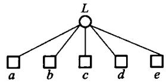

图 12.3　纯线性结构表。

**纯表**(pure list)对应一棵树：从根到任何叶只有一条路径，每个元素只出现一次；每对括号是一个内部结点，原子是叶。

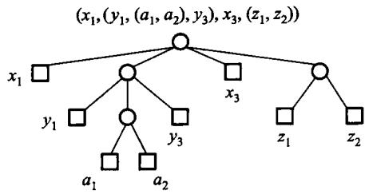

图 12.4　纯表的树表示。

**再入表**允许共享：某些结点可以从多条路径到达，无回路时对应一个 DAG（见前面的图 12.5）。**循环表**允许某个子表直接或间接把自己当成表目，对应有回路的有向图（图 12.6）。四者的包含关系是：

$$\text{循环表} \supseteq \text{再入表} \supseteq \text{纯表} \supseteq \text{线性表}$$

「深度」是展开后括号的层数：线性表深度为 1，循环表深度为无穷大。

结点通常有一个标记位，区分原子和子表：原子结点存值，子表结点存指向另一个表的指针。再加表头结点，可以把空表和共享关系表示得更干净。

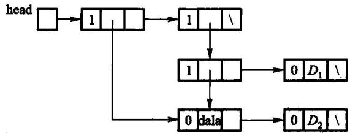

图 12.7　没有头结点的广义表。

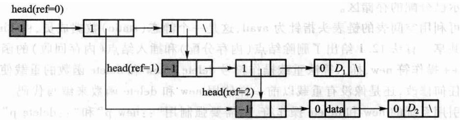

图 12.8　带头结点的广义表：多一个不存数据的表头结点，空表和非空表就不必分两套写法——与第 2 章链表引入头结点是同一个理由。

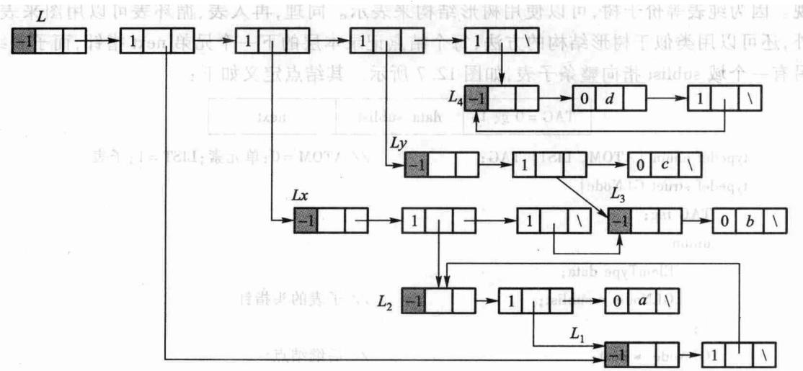

图 12.9　带表头结点的循环广义表。

先跑一遍：

```cpp file=code/ch12/gen_list/demo.cpp
#include "modern.hpp"

#include <cstdio>

int main() {
    using dsa::advanced::GenList;
    const GenList list = GenList::parse("(a,(b,c),d)");
    std::printf("表      : %s\n", list.to_string().c_str());
    std::printf("表头    : %s\n", list.head()->to_string().c_str());
    std::printf("表尾    : %s\n", list.tail()->to_string().c_str());
    std::printf("长度 %zu，深度 %zu，原子 %zu 个\n",
                list.length(), list.depth(), list.atom_count());

    // 再入表：同一个子表挂到两处，靠引用计数而不是拷贝。
    const GenList shared = GenList::parse("(b,c)");
    const GenList host = GenList::cons(shared, GenList::cons(shared, GenList()));
    std::printf("共享后  : %s，被引用 %zu 次\n", host.to_string().c_str(), shared.use_count());
    return 0;
}
```

```text
表      : (a,(b,c),d)
表头    : a
表尾    : ((b,c),d)
长度 3，深度 2，原子 4 个
共享后  : ((b,c),(b,c))，被引用 3 次
```

最后一行是本节的难点：`(b,c)` 只有一份，挂在两处，引用计数是 3（自己一份，两个宿主各一份）。共享一旦发生，回收就**不能再按树递归 `delete`**——那会把同一个结点删两次。所以结点上带计数，句柄负责加减：

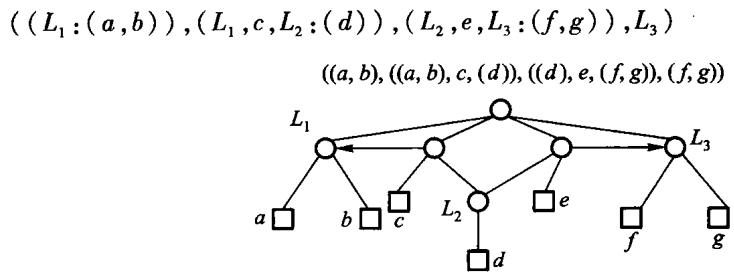

```cpp file=code/ch12/gen_list/modern.hpp#genlist-refcount
static void retain(GenNode* node) noexcept {
    if (node != nullptr) {
        ++node->refs;
    }
}

static void release(GenNode* node) noexcept {
    // 计数归零才真正删除；共享的子表因此只会被删一次。
    while (node != nullptr && --node->refs == 0) {
        GenNode* const head = node->head;
        GenNode* const tail = node->tail;
        delete node;
        // 表尾用循环走，长表不会把栈压穿；表头递归，深度由嵌套层数决定。
        release(head);
        node = tail;
    }
}
```

`release` 沿表尾迭代、只对表头递归，因此三万个元素的长表析构不会压穿栈，栈深度只跟嵌套层数走。这里不用 `shared_ptr`：12.2 要教的就是「谁来回收共享结点」，交给标准库这一节就没了。

引用计数收不回**环**。构造函数自底向上建表，本书的接口造不出循环表；`code/ch12/storage_recovery` 用**根集**和真正的对象图（每个对象可以有多条出边）演示标记–清除如何回收无根环，见 12.2.4。它不冒充真实运行时垃圾回收器。

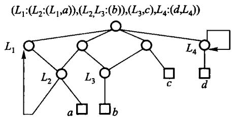

### 12.2.2 可利用空间表

原书用重载 `operator new/delete` 和一条全局 `avail` 链实现结点复用。所有对象共享隐式全局状态，生命周期结束时还要 `::delete` 整条链。现代实现改成显式的索引句柄池：`acquire` 从空闲栈弹出一个下标，`release` 把它推回去；耗尽返回 `nullopt`，重复/越界归还返回 `false`。释放后的下标失效，`get` 得到空指针。

“可利用空间表”（free list）是固定大小对象池的一种历史叫法。工程中还会按对象大小使用 arena、pool 或 slab allocator；它们都把分配路径和所有权边界显式化，避免教材示例那种全局 `avail` 状态。

普通二叉搜索树只要求中序遍历有序，树形可能很多。若键的查找频率不同，应把常查的键放得更靠近根。最优 BST 的输入包括成功查找权 `p[1..n]` 与失败查找权 `q[0..n]`；动态规划对每个区间尝试每一个键作根，选择「左子树代价 + 右子树代价 + 本区间总权」最小的方案。

教材样例 `p = {1,5,4,3}`、`q = {5,4,3,2,1}` 的总成本是 57，根是第 2 个键。`cost[i][j]` 是区间代价，`root[i][j]` 记录取得最小值的根，因而还能按根表重建树形。朴素实现为 O(n³)。

先跑一遍：

```cpp file=code/ch12/optimal_bst/demo.cpp
#include "modern.hpp"

#include <iostream>

int main() {
    dsa::advanced::ReusableNodePool<int> pool(2);
    const auto first = pool.acquire(11);
    const auto second = pool.acquire(22);
    std::cout << "申请到槽 " << *first << " 和 " << *second
              << "，剩余 " << pool.available() << '\n';
    pool.release(*first);
    const auto reused = pool.acquire(44);
    std::cout << "归还后再申请得到槽 " << *reused
              << "，值为 " << *pool.get(*reused) << '\n';

    const auto tree = dsa::advanced::optimal_bst({1, 5, 4, 3}, {5, 4, 3, 2, 1});
    std::cout << "最优 BST 总成本 " << tree.cost[0][4]
              << "，根为键 " << tree.root[0][4] << '\n';
}
```

```bash
c++ -std=c++17 -Wall -Wextra -Werror -Icode/ch12/optimal_bst \
    code/ch12/optimal_bst/demo.cpp -o /tmp/bst-demo
/tmp/bst-demo
```

```console
申请到槽 0 和 1，剩余 0
归还后再申请得到槽 0，值为 44
最优 BST 总成本 57，根为键 2
```

把 `optimal_bst({1,2}, {3,4})` 这种长度对不上的输入送进去，会抛 `std::invalid_argument`。空树对应 `p = {}`、`q = {某个失败权}`，代价为 0。

池用 `vector<optional<T>>` 表示槽位占用，`vector<size_t>` 当空闲栈。构造时下标从大到小入栈，所以第一次 `acquire` 拿到 0。`release` 先确认该槽确实被占用，再 `reset` 并归还。

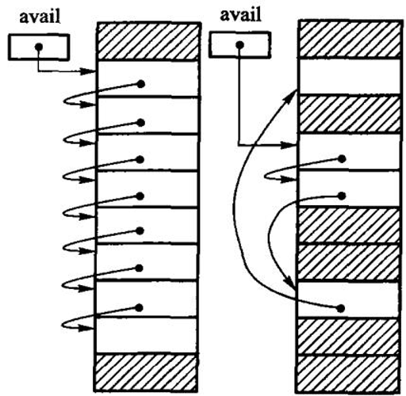

容量为 3 时，状态可以直接写成一张账：初始空闲栈顶依次是 `0,1,2`；申请 A、B 后，句柄分别是 0、1，只剩 2；归还 0 后，空闲栈是 `0,2`；再申请 C 会复用 0。旧句柄 0 在归还那一刻已经失效，数值虽然后来又出现，却代表新的占用期。真实系统若要识别「拿旧句柄误访问新对象」，还会在句柄中加入代数（generation）；本节的简化池只保证空闲槽不可读和重复释放会失败。

| 动作 | 槽 0 | 槽 1 | 槽 2 | 下一可用 |
| --- | --- | --- | --- | --- |
| 初始 | 空 | 空 | 空 | 0 |
| `acquire(A)` | A | 空 | 空 | 1 |
| `acquire(B)` | A | B | 空 | 2 |
| `release(0)` | 空 | B | 空 | 0 |
| `acquire(C)` | C | B | 空 | 2 |

这个表也解释了为什么 `release` 不能只把下标推回空闲栈：若不先确认槽位处于占用状态，重复归还 0 会让空闲栈出现两个 0，之后 A、B 两次申请可能拿到同一个槽。

```cpp file=code/ch12/optimal_bst/modern.hpp#reusable-node-pool
template <typename T>
class ReusableNodePool {
public:
    explicit ReusableNodePool(std::size_t capacity) : slots_(capacity) {
        for (std::size_t index = 0; index < capacity; ++index) {
            free_.push_back(capacity - index - 1);
        }
    }

    [[nodiscard]] std::optional<std::size_t> acquire(const T& value) {
        if (free_.empty()) {
            return std::nullopt;
        }
        const std::size_t index = free_.back();
        free_.pop_back();
        slots_[index] = value;
        return index;
    }

    bool release(std::size_t index) {
        if (index >= slots_.size() || !slots_[index]) {
            return false;
        }
        slots_[index].reset();
        free_.push_back(index);
        return true;
    }

    [[nodiscard]] const T* get(std::size_t index) const noexcept {
        if (index >= slots_.size() || !slots_[index]) {
            return nullptr;
        }
        return &*slots_[index];
    }

    [[nodiscard]] std::size_t available() const noexcept { return free_.size(); }

private:
    std::vector<std::optional<T>> slots_;
    std::vector<std::size_t> free_;
};
```

### 12.2.3 存储的动态分配和回收

12.2.2 节的可利用空间表只针对**一种长度**的空闲块，但实际应用中要求被分配的空闲块有多种长度——
一种常见的情况是动态分配内存时要求为整型、浮点型、双精度浮点型等类型的变量分配存储空间；
而且那种做法也不能很好地解决存储区共享的问题。

**本节把不同长度的结点（空闲块）组织在一个可利用空间表中。** 分配时并不是所有结点都能满足，
而需要按申请的长度进行检索，找到其空间大于等于申请长度的结点，从中截取合适的长度；**回收时也
不能简单地释放，而必须考虑刚刚被删除的结点空间能否与其他结点合并**，组成较大的结点，以便能满足
后来较大长度结点的分配请求。这种处理方法的优点是可以解决存储空间的共享问题，缺点是分配和回收
的算法比较复杂，**并且在系统长期动态运行的过程中，这种方法有可能使整个空间被分割成许多大小
不等的碎块，而某些碎块由于太小而长期得不到使用，这就产生了所谓的碎片问题**。

**空闲块要自带「身份证」。** 因为空闲块的长度是不定的，所以可利用空间表中每个结点都需要记录本结点
的长度。一种常见的方法是：对于一个需要 $m$ 字节空间的请求，存储管理器可能会分配稍多于 $m$ 字节的
空间，**额外的空间留给存储管理器进行存储管理**，例如存放块的标记位、链表指针和块长度；标记位用来
区别这个块是空闲块还是已被分配的块。另外，**空闲块的分配和回收不是简单地在可利用空间表的一端
进行，可利用空间表不再是一个堆栈结构**——事实上，为了检索方便，通常用双链表来实现它。

**两种碎片，来自两种做法。** 如果能够找到大于 $N$ 字节的空闲块：一种做法是**整个块交给请求者**，
把首尾标记位都改为「已分配」；另一种做法是对于长度为 $K > N$ 的空闲块，**把 $N$ 字节分配给请求者、
剩余的 $K-N$ 字节形成一个新的空闲块**。不管采用哪种做法，都会存在碎片（fragmentation）问题：
第一种做法把多于请求字节数的空间分配给请求者，会浪费空闲块的空间，从而产生**内部碎片**
（internal fragmentation）；第二种做法则会产生大量的不能满足一般性请求的小空闲块，称为**外部碎片**
（external fragmentation）。

**实际应用中，有的存储管理器牺牲内部碎片的空间，使得存储管理更加简单**——例如文件管理系统中
以簇为基本单位进行文件空间的分配，就牺牲了内部碎片从而避免了外部碎片。

**下面这三种可能产生外部碎片的方法通称为顺序适配**（sequential fit）：首先适配（first fit）、最佳适配
（best fit）和最差适配（worst fit）。三者只在「挑哪一块」这一步不同，分裂与合并完全一样。

- **首先适配**从可利用空间表的表头开始顺次搜索，一旦找到第一个长度大于等于请求长度的空闲块就
  分配。**一种简单改进是：记住前一次搜索到达的位置，从该位置开始新的搜索**，搜到链表尾部时重新
  从表头开始（今天通称 next fit）。优点是速度快，缺点是可能把较大块拆分成较小的块，导致后来难以
  满足对大块的申请。
- **最佳适配**在所有大于等于请求长度的块中找出最小的一块进行分配。优点很显然：**它可以使得无法
  满足大请求块的可能性降到最低**；但它可能使得外部碎片问题变得非常严重，因为那些满足请求后剩下
  的空闲块非常小，对将来的请求已没有什么用处。实现有两种方案——检索整个无序的可利用空间表
  找到最小的合适块，或者**把空闲块按照从小到大的顺序排列成优先队列**，使得检索时只需要从表头往后
  查看。
- **最差适配**每次分配当前最大的块，指望剩下的部分还大到能再用一次。

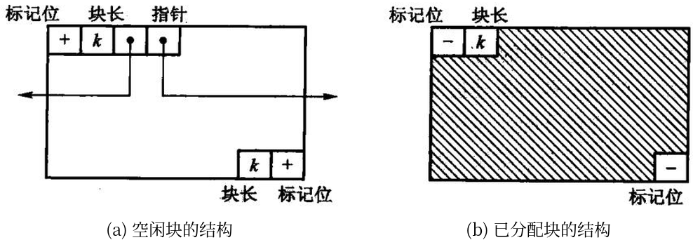

差别用一个例子最清楚。设空闲区依次是 500、200、300、600 字节（中间被已分配块隔开，所以不会合并），现在要 212 字节：

| 策略 | 挑中 | 剩下的碎片 | 代价 |
| --- | --- | --- | --- |
| 首次适应 | 500 那块 | 288 | 找到就停，扫得最少；小碎片在低地址堆积 |
| 最佳适应 | 300 那块 | **88** | 大块留住了，但剩下的碎片最碎、最难再用 |
| 最坏适应 | 600 那块 | **388** | 剩下的还大到能再分一次；大块很快被拆光 |

`code/ch12/memory_allocator` 实现了这三种，测试用的正是上面这组数字。**只在一块空闲区上测是分辨不出三种策略的**——那种布局下三者必然挑中同一块，把最佳适应和最坏适应的判据对调，测试照样全绿。

无论哪种策略，相邻的空闲块都应当合并，否则外部碎片只会越来越多。「外部碎片」是可以直接量出来的：释放出两个不相邻的 30 字节空洞后，空闲总量有 60 字节，但最大的一块只有 30——45 字节的请求就会失败；把中间那块也释放掉、三块并成一整块之后，同样的请求立刻能满足。

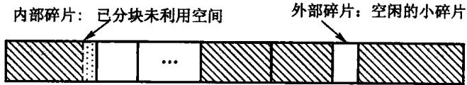

合并要分四种位置关系。设释放块为 M：左右都忙，M 单独入空闲表；只有左边空闲，扩大左块；只有右边空闲，把右块的起点移到 M；左右都空闲，把三块合成一块。顺序表实现可以检查前后项，边界标记则从 M 的块头、块尾直接找到物理邻居。

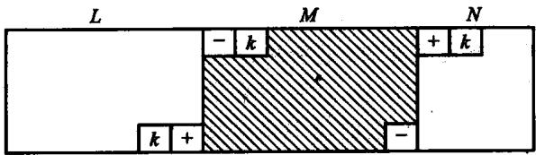

原书提到的**边界标记**（块头块尾各记一份大小与忙闲）解决的是「怎么在 $O(1)$ 内找到物理相邻的邻居」。本书的实现把块表按偏移升序排列，相邻块就是表里相邻的项，表达的是同一个想法；代价是定位要扫表而不是 $O(1)$，这一点写在实现的注释里，不冒充。

### 12.2.4 失败处理策略和无用单元回收

分配失败时可以：直接拒绝；压缩（把已分配块搬到一起，挤出一整块空闲）；或者做垃圾回收，把程序已经够不着、却还占着的块收回来。

引用计数给每个对象记有多少指针指着它，减到零就释放。实现简单，但对象互相指形成环时，计数永远掉不到零，这块内存就漏了。标记–清除从一组根（栈上的指针、全局变量）出发走遍所有还能碰到的对象并打上标记，然后扫一遍堆，没标记的统统回收。它能处理环，但要求能从根集走到每一个活对象，并且要能区分「这是指针」和「这只是一个看起来像地址的整数」。

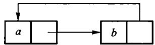

例如根集只有 `R -> A -> B`，另有 `C -> D -> C`。标记栈先压 A，继而标 A、B；C、D 虽然各有一个入边，却从任何根都走不到。清除阶段保留 A、B，回收 C、D。这里判生死的是**可达性**，不是入度或引用数；这正是循环引用能被整组收回的原因。

| 阶段 | 待处理栈 | 已标记 | 动作 |
| --- | --- | --- | --- |
| 放入根 | `A` | A | 根先标记再入栈 |
| 弹出 A | `B` | A、B | 沿 `A -> B` 发现 B |
| 弹出 B | 空 | A、B | 标记阶段结束 |
| 清扫 | 空 | A、B | 保留 A、B；回收 C、D |

一定要「先标记、再入栈」。若等到弹出时才标，环或菱形共享会把同一结点反复压栈；结果也许仍对，空间和时间却可能失控。

本章的句柄池把「失败」做成返回 `nullopt`，不劫持全局 `new`，也不假装自己是通用垃圾回收器。

`code/ch12/storage_recovery` 把标记–清除做成可运行的：出边是一张表（一个对象可以指向多个对象），`collect()` 接受**一组**根。它演示的核心是「可达性是从根走出来的，与有多少人指着我无关」——一个被三处引用、却谁都够不着根的对象，引用计数收不回，标记–清除照收。

标记阶段用**显式栈**而不是递归：垃圾回收恰恰是在内存吃紧时跑的，那时最不该再去吃调用栈（同 2.3.1 节「所有权工具怎么选」的判据）。测试里有 20 万个对象的深链，递归标记必然压穿栈。

它仍然是教学模型：没有栈扫描、没有写屏障、没有分代，也不区分「这是指针」和「这只是个看起来像地址的整数」——而那恰恰是真实垃圾回收器最难的部分。

## 12.3 Trie 结构和 Patricia 树

### 为什么这一节的存储侧只有 C++

本节的 C++ 版本属于存储侧：它把 Trie 结点、Patricia 内部结点布局、共享前缀回收和按位分支不变量都变成可观察的对象。Python 版本保留，是为了对照查找、前缀计数等算法行为；它不是 C++ 所有权和布局的逐行替代，Python `dict` 或垃圾回收会把那部分教学内容隐藏掉。因此两种语言在这里承担的不是同一层任务：算法结果可对拍，存储管理仍以 C++ 为准。

**先说清楚 Trie 与 BST 分属两种「分解」。** 第 5 章的 BST 是一种组织上基于**对象空间**（object space）
分解的数据结构，即**关键码范围的分解是由存储在树中的对象（关键码值）决定的**；BST 并不是一种平衡
的树，其树结构与输入数据的顺序有很大关系——按升序输入会退化成线性表，查找一个关键码的时间
代价为 $O(n)$。

**若要消除这样的不平衡，最根本的办法就是改变关键码的划分方式**：在关键码范围内，对树结构中每一个
结点预定义划分位置。假设划分因子为 2（每次仅把当前范围分为两部分，对应于二叉树）：根结点把整个
关键码范围分为两部分，插入时不考虑插入的顺序，小于根的关键码都放到左子树、大于根的放到右子树。
**按照此规则所产生的树不依赖于关键码的插入顺序，其深度只受关键码精度的影响**，因此最坏情况下就
等于存储关键码所需要的位数：如果关键码是 $0 \sim 255$ 之间的整数，精度就是 8 个二进制位，两个只在
最低位不同的关键码要到第 8 次划分才能分开，这棵搜索树深度也为 8。

**这种对关键码范围进行均分的方法称为关键码空间（key space）分解，基于关键码分解的数据结构叫做
Trie 结构。** 「trie」这个词来源于「retrieval」，暗示了它的主要应用：信息检索（information retrieval）。
这种数据结构被很多人用来存储英文字符串，尤其是大规模的英文词典，在自然语言理解系统中经常用到。
**与 B+ 树一样，Trie 树内部结点仅作为占位符引导检索过程，数据记录只存储在叶结点中。**

**但这种结构并不能保证树是平衡的**：考虑一种极端情况，如果所选择的根结点不合适，导致所有的关键码
都小于根结点，那么这棵树的右子树将没有任何元素——这是因为关键码分布得很不均衡。

**Trie 树基于两个原则**：关键码集合是固定的；能够对结点进行分层标记。如果所有的元素都可以使用
数字或者字母等来标记，就可以考虑使用 Trie 结构——例如元素可以用 $0 \sim 9$ 的数字组合来标记时，
就可以在根结点分出 10 个子结点分别标记 $0 \sim 9$，然后每个子结点又可以分出 10 个结点，如此下去
直到所有的元素都能够被区分开。

二叉搜索树按整个关键码比较，树的形状依赖插入次序。Trie 换一种切法：按关键码的字符（或二进制位）一层一层分支，第 $i$ 层对应第 $i$ 个字符。公共前缀在树里只存一次，所以它特别适合字典、IP 路由这种「按前缀分类」的问题。查找沿着字符走，时间与关键码长度成正比，与表里有多少个词关系不大。

最简单的形式是**二叉 Trie**：按关键码所在的数值区间对半分，左枝标 0、右枝标 1。

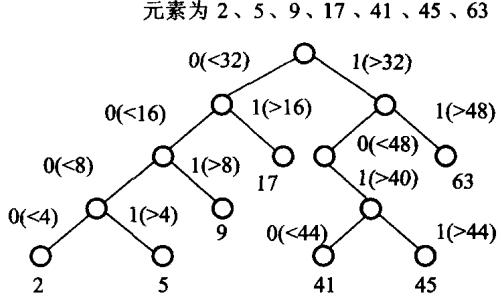

图 12.16　二叉 Trie 树。最大元素 63，所以关键码范围取 $[0,64)$；根把范围劈成 $[0,32)$ 和 $[32,64)$，于是 2、5、9、17 进左子树，41、45、63 进右子树；再往下继续对半分，直到每个元素单独落在一个叶上。同一棵子树下的关键码共享父结点代表的前缀——第 5 章的 Huffman 编码树也有这个性质，**Huffman 树就是一种二叉 Trie**。

把 `can`、`car`、`cat`、`do` 插进一棵字母 Trie，公共前缀 `ca` 只出现一次：

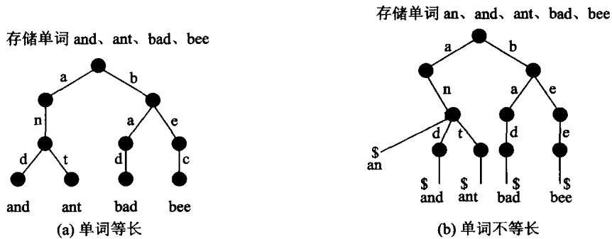

```text
        ·
       / \
      c   d
      |   |
      a   o*
     /|\
    n* r* t*
```

带 `*` 的是词尾。查找 `car` 走 c–a–r，三步；查找 `cab` 在 b 处没有分支，失败。最长前缀匹配（路由）则走到不能再走为止，回退到最近的词尾。

先跑一遍。上面那棵图里的结点数不是数出来的，是程序报的：

```cpp file=code/ch12/trie/demo.cpp
#include "modern.hpp"

#include <cstdio>

int main() {
    dsa::advanced::Trie trie;
    dsa::advanced::PatriciaTree patricia;
    for (const char* word : {"can", "car", "cat", "do"}) {
        trie.insert(word);
        patricia.insert(word);
    }
    std::printf("Trie     : %zu 个词，%zu 个结点（字符总数 11）\n",
                trie.size(), trie.node_count());
    std::printf("Patricia : %zu 个词，%zu 个内部结点\n",
                patricia.size(), patricia.internal_count());
    std::printf("前缀 ca 下有 %zu 个词：", trie.count_with_prefix("ca"));
    for (const auto& word : trie.keys_with_prefix("ca")) {
        std::printf("%s ", word.c_str());
    }
    std::printf("\n最长前缀匹配 dozen -> %s（走不动就回退到最近词尾）\n",
                trie.longest_prefix_of("dozen").c_str());
    return 0;
}
```

```text
Trie     : 4 个词，7 个结点（字符总数 11）
Patricia : 4 个词，3 个内部结点
前缀 ca 下有 3 个词：can car cat 
最长前缀匹配 dozen -> do（走不动就回退到最近词尾）
```

第一行就是前缀共享的全部价值：四个词一共 11 个字符，树里只有 7 个结点，因为 `ca` 只存了一次。最长前缀匹配的写法就是「一路往下走，随手记住最近一次经过的词尾」：

```cpp file=code/ch12/trie/modern.hpp#trie-longest-prefix
/// 最长前缀匹配：走到走不动为止，回退到最近的词尾。IP 路由查表就是这个动作。
[[nodiscard]] std::string longest_prefix_of(std::string_view text) const {
    const Node* node = &root_;
    std::size_t best = 0;
    for (std::size_t i = 0; i < text.size(); ++i) {
        if (!is_letter(text[i])) {
            break;
        }
        const Node* next = node->children[index_of(text[i])].get();
        if (next == nullptr) {
            break;
        }
        node = next;
        if (node->terminal) {
            best = i + 1;
        }
    }
    return std::string(text.substr(0, best));
}
```

字母 Trie 的每个内部结点原则上要留 26 条分支，大部分是空的——空间是它的主要代价。原书给出的一种改进是把内部结点上那张定长的分支表换掉：

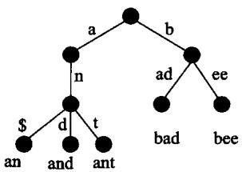

图 12.18　对 Trie 树的改进：只保存实际用到的分支，代价是查一层要在表里找一次，不再是直接下标。

纯 Trie 在「只有一个孩子」的内部结点上仍然分支，路径偏长。Patricia 树把这种单孩子结点压缩掉，边上记下「跳过几位再比」。查找时按记下的位位置取关键码的那一位，决定走左还是走右。路径更短，结点更少，仍然保持前缀共享——同样四个词，Patricia 只要 3 个内部结点。

按位取值和「两个关键码第一次不同在第几位」是 Patricia 的两块基石：

```cpp file=code/ch12/trie/modern.hpp#patricia-bits
static bool bit_of(std::string_view key, std::size_t index) noexcept {
    const std::size_t byte = index / 8;
    if (byte >= key.size()) {
        return false;  // 越过关键码长度，一律读 0
    }
    const auto value = static_cast<unsigned char>(key[byte]);
    return ((value >> (7 - index % 8)) & 1U) != 0;
}

static optional_bit first_differing_bit(std::string_view a, std::string_view b) {
    const std::size_t longest = a.size() > b.size() ? a.size() : b.size();
    const std::size_t bits = (longest + 1) * 8;  // +1 让「一个是另一个的前缀」也能分开
    for (std::size_t i = 0; i < bits; ++i) {
        if (bit_of(a, i) != bit_of(b, i)) {
            return {true, i};
        }
    }
    return {};
}
```

越过关键码长度的位一律读作 0，这样「一个关键码是另一个的前缀」（`a` 与 `ab`）也能分开，代价是关键码里不能出现 `'\0'`。还有一处不能省：沿位下降到叶之后，**必须和叶上的完整关键码再比一次**——路上只看了少数几位，不比就会把 `ca`、`cars` 这种根本不在表里的串判成命中。

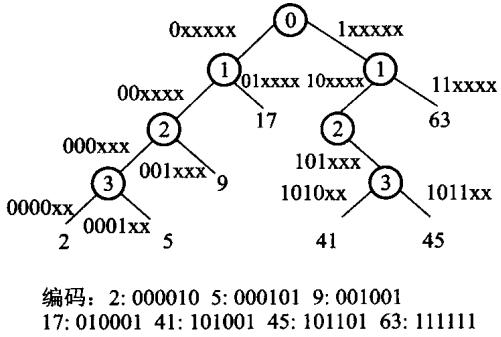

图 12.19　压缩的依据：`x` 表示该位取 0 取 1 都落在同一枝里，也就是这一位**不需要用来分支**——把这样的层去掉就是 Patricia。

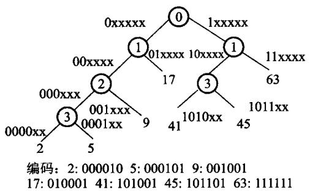

图 12.20　压缩后的 PATRICIA Trie。内部结点不再逐位下降，而是各自记住「该比第几位」。

以单字节 `'a'` 与 `'c'` 为例，ASCII 分别是 `01100001` 和 `01100011`，第一次不同在从 0 起算的第 6 位。Patricia 内部结点只记这个分歧位：该位为 0 走一边，为 1 走另一边；前面六个相同位不再各占一层。再插入键时，先走到叶并找出首个不同位，再把新分支插到位号仍保持递增的位置，否则查找路径会跳过应比较的位。

## 12.4 改进的二叉搜索树

### 12.4.1 最佳二叉搜索树

同一个关键码集合，插入次序不同，长出来的二叉搜索树就不同。原书拿 $K=\{$ xal, wan, wil, zol, yo, xul, yum, wen, wim, zi, yon, xem, wul, zom $\}$ 举例：

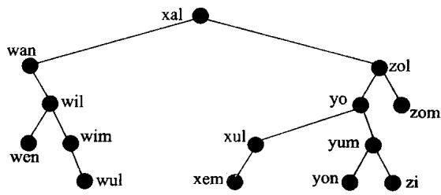

图 12.21　按 $K$ 的给定次序插入得到的二叉搜索树。

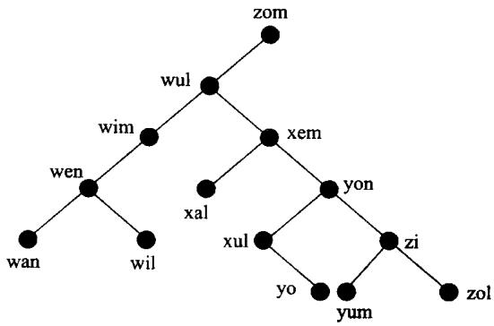

图 12.22　同一批关键码倒着插入得到的另一棵 BST。$n$ 个关键码有 $n!$ 种插入次序，但不同次序可能长出同一棵树，真正不同的形状只有 $C_{2n}^{n}/(n+1)$ 棵（组合数学里的 Catalan 数）。问题因此变成：这些形状里哪一棵检索效率最好？

**先数一数「一共有多少棵形状不同的 BST」。** 这个问题等价于：当二叉树的中序排列是
$\{1, 2, 3, \cdots, n\}$ 时，这棵二叉树有多少种可能的前序排列。可以证明，$n!$ 种排列中只有
$\frac{1}{n+1}C_{2n}^{n}$（组合数学中的 **Catalan 数**）种前序排列能够构成二叉搜索树——例如
$\{2,3,1\}$ 就不是任何二叉搜索树的前序排列。通常用检索效率来评价这 $C_{2n}^{n}/(n+1)$ 棵树，
问什么形状的二叉搜索树比较好。

衡量的办法是把树扩充成满二叉树（5.1.2 节），空子树补成外部结点：

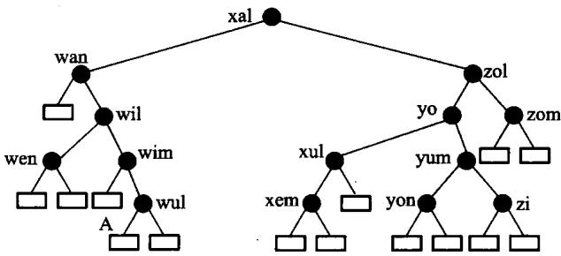

图 12.23　图 12.21 的扩充二叉树，小方框是外部结点。**每个外部结点代表一类检索失败**——例如图中的 A 代表所有取值落在 wim 与 wul 之间的关键码。于是「检索成功的代价」落在内部结点上，「检索失败的代价」落在外部结点上，两者可以一起算进同一个目标函数。

**把代价写成公式。** 对于 $n$ 个结点的二叉树，**外部路径长度** $E$ 定义为从扩充二叉树的根到每个
外部结点的路径长度之和，**内部路径长度** $I$ 定义为从根到每个内部结点的路径长度之和，两者满足
$E = I + 2n$。回到检索效率：从根开始比较，若不等就进入下面一层继续比较，因此**成功检索的比较
次数就是关键码所在的层数加 1**（根为第 0 层），**不成功检索的比较次数就等于被检索的关键码所属的
那个外部结点的层数**。于是检索一个关键码的平均比较次数为

$$\mathrm{ASL}(n) = \frac{1}{W}\left[\sum_{i=1}^{n} p_i(l_i + 1) + \sum_{i=0}^{n} q_i l'_i\right], \quad W = \sum_{i=1}^{n} p_i + \sum_{i=0}^{n} q_i$$

其中 $l_i$ 是第 $i$ 个内部结点的层数，$l'_i$ 是第 $i$ 个外部结点的层数，$p_i$ 是检索第 $i$ 个内部结点所代表
的关键码的频率，$q_i$ 是被检索的关键码属于第 $i$ 个外部结点所代表的可能关键码集合（即处于第 $i$ 个
和第 $i+1$ 个内部结点之间）的频率。$p_i$、$q_i$ 也叫做结点的**权**。**把 $\mathrm{ASL}(n)$ 最小的那棵
二叉搜索树称做最佳二叉搜索树。**

**先看一种特殊情况：所有结点的权都相等。** 此时 $p_i/W = q_i/W = 1/(2n+1)$，代入化简（用
$E = I + 2n$）得 $\mathrm{ASL}(n) = (2I + 3n)/(2n+1)$——**要平均比较次数最小，就是要内部路径长度
$I$ 最小**。在一棵二叉树中，路径长度为 0 的结点仅有一个，为 1 的至多两个，为 2 的至多 4 个……
因此 $n$ 个结点的二叉树其内部路径长度 $I$ 至少等于序列 $0,1,1,2,2,2,2,3,3,\cdots$ 的前 $n$ 项和，
即 $\sum_{k=1}^{n}\lfloor \log_2 k \rfloor$。这个最小的 $I$ 值显然在下面这样的二叉树里可以达到：
**只有最下面两层结点的度数可以小于 2，其他结点度数必须等于 2**——在所有结点权相等的情况下，
这样的二叉搜索树就是最佳二叉搜索树，其 $\mathrm{ASL}(n)$ 是 $\Theta(\log_2 n)$ 量级的。
构造办法也很直白：先把关键码排序，然后用二分法依次检索这些关键码，把检索中遇到的、树中还没有
的关键码依次插入。

各关键码被检索的概率通常不等，把概率（或频次）当权，目标就是**带权路径长度最小**：

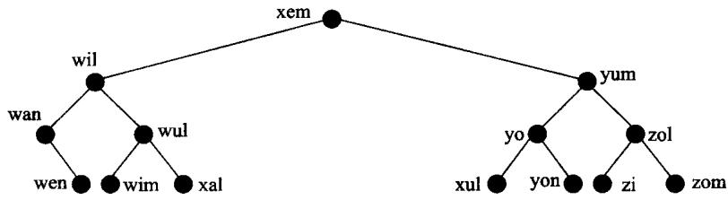

图 12.24　等权时的最佳二叉搜索树——形状尽量平衡。

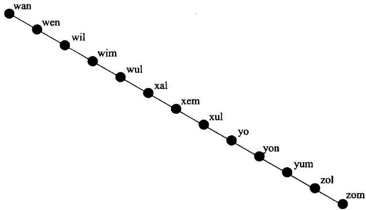

图 12.25　最坏的形状：退化成一条链，检索代价 $O(n)$。

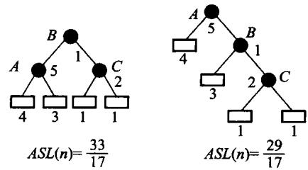

图 12.26　结点权不等时，**最佳的形状未必最平衡**：权大的关键码要往根靠，哪怕整棵树因此歪一些。这正是需要动态规划、而不是简单「取中位数当根」的原因。

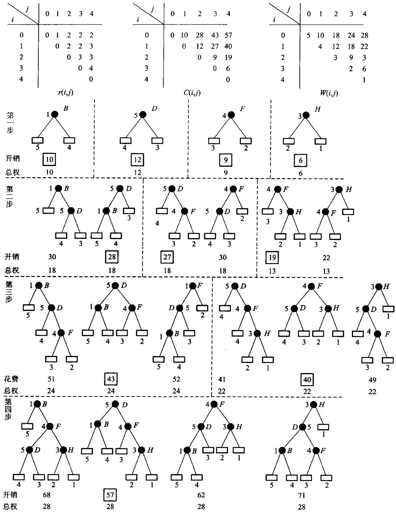

图 12.27　构造最佳二叉搜索树的过程：按区间由短到长填表，每个区间枚举根。

最优 BST 先校验 `q.size() == p.size() + 1`。空区间的 `cost[i][i] = 0`，`weight[i][i] = q[i]`。长度从 1 扩到 n，对每个区间 `[first, last]` 枚举根 `r`，候选代价是 `cost[first][r-1] + cost[r][last] + weight[first][last]`。

```cpp file=code/ch12/optimal_bst/modern.hpp#optimal-bst
struct OptimalBstResult {
    std::vector<std::vector<long long>> cost;
    std::vector<std::vector<std::size_t>> root;
};

inline OptimalBstResult optimal_bst(const std::vector<int>& successful,
                                    const std::vector<int>& unsuccessful) {
    if (unsuccessful.size() != successful.size() + 1) {
        throw std::invalid_argument("weight count");
    }
    const std::size_t count = successful.size();
    OptimalBstResult result{
        std::vector<std::vector<long long>>(count + 1,
                                            std::vector<long long>(count + 1, 0)),
        std::vector<std::vector<std::size_t>>(count + 1,
                                              std::vector<std::size_t>(count + 1, 0))};
    std::vector<std::vector<long long>> weight(
        count + 1, std::vector<long long>(count + 1, 0));

    for (std::size_t index = 0; index <= count; ++index) {
        // The book's c table measures internal-key comparison cost; an empty
        // interval has zero c cost while its unsuccessful weight remains in w.
        result.cost[index][index] = 0;
        weight[index][index] = unsuccessful[index];
    }
    for (std::size_t length = 1; length <= count; ++length) {
        for (std::size_t first = 0; first + length <= count; ++first) {
            const std::size_t last = first + length;
            weight[first][last] = weight[first][last - 1] + successful[last - 1] +
                                  unsuccessful[last];
            result.cost[first][last] = std::numeric_limits<long long>::max() / 4;
            for (std::size_t root = first + 1; root <= last; ++root) {
                const long long candidate = result.cost[first][root - 1] +
                                            result.cost[root][last] + weight[first][last];
                if (candidate < result.cost[first][last]) {
                    result.cost[first][last] = candidate;
                    result.root[first][last] = root;
                }
            }
        }
    }
    return result;
}
```

动态规划为什么要按区间长度递增，可以在长度 2 的区间上看清。算 `[i,j]` 时，若选 `r` 为根，必须已经知道 `[i,r-1]` 和 `[r,j]` 的最优代价；它们都比当前区间短。每试一个根，本区间总权 `weight[i][j]` 都要再加一次，因为挂到新根下面后，区间内每种成功或失败查找的深度都增加 1。`root[i][j]` 不是附带输出，而是重建树时的路线图：先取整段根，再递归查左右两个子区间。

教材样例的关键格可以逐层核算：

| 区间 | 总权 $w$ | 最优代价 $c$ | 根 |
| --- | ---: | ---: | ---: |
| `[0,1]` | 10 | 10 | 1 |
| `[1,2]` | 12 | 12 | 2 |
| `[2,3]` | 9 | 9 | 3 |
| `[3,4]` | 6 | 6 | 4 |
| `[0,2]` | 18 | 28 | 2 |
| `[1,3]` | 18 | 27 | 2 |
| `[2,4]` | 13 | 19 | 3 |
| `[0,3]` | 24 | 43 | 2 |
| `[1,4]` | 22 | 40 | 3 |
| `[0,4]` | 28 | **57** | **2** |

最后一格选根 2 时，候选值是 `c[0][1] + c[2][4] + w[0][4] = 10 + 19 + 28 = 57`。这既复算了演示程序的输出，也能抓住把 `weight` 漏加或多加一次的实现错误。

### 12.4.2 平衡的二叉搜索树

**BST 在最好的情况下搜索只需要 $O(\log n)$ 的时间代价，而在最坏时却需要 $O(n)$ 的时间**——若键
已经有序，它会退化成一条链。如果能够找到一种方法，使得 BST 不受输入的影响、始终保持平衡状态，
就能得到很好的检索效率。基于这种想法，**Adelson-Velskii 和 Landis 发明了 AVL 树**（名字取自两位
发明者姓氏的首字母），这是一种平衡的二叉搜索树：**其任何结点的左子树和右子树高度最多相差 1**。

AVL 树的三条性质：① 一棵空二叉树是一个 AVL 树；② 如果 $T$ 是一棵具有 $n$ 个结点的 AVL 树，
则其高度为 $O(\log n)$；③ 如果 $T$ 是一棵 AVL 树，那么其左右子树 $T_L$、$T_R$ 也是 AVL 树，
并且 $|h_L - h_R| \le 1$。可以把 AVL 树看做是 BST 的一个特例。

**因为 AVL 树的高度是 $O(\log n)$，所以在其上进行的搜索、插入和删除都只需要 $O(\log n)$ 的时间
代价。现在关键的问题就是如何保持一棵 AVL 树的结构，使得不论对其进行何种操作都不改变其 AVL
特性；并且，为保持这样的树结构所进行的操作，都要在 $O(\log n)$ 的时间内完成**，以保证总时间代价
仍然在 $O(\log n)$ 时间内。平衡二叉搜索树因此在每次插入、删除之后做少量旋转，把左右子树的高度差
限制住，从而保证树高 $O(\log n)$。

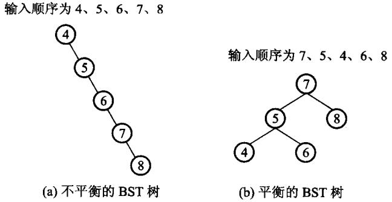

图 12.15　同一批关键码，形状可以从「接近完全二叉树」一直退化到「一条链」——检索代价随之从 $O(\log n)$ 变成 $O(n)$。

AVL 树给每个结点记一个平衡因子：右子树高度减左子树高度，只允许 $-1$、$0$、$1$。

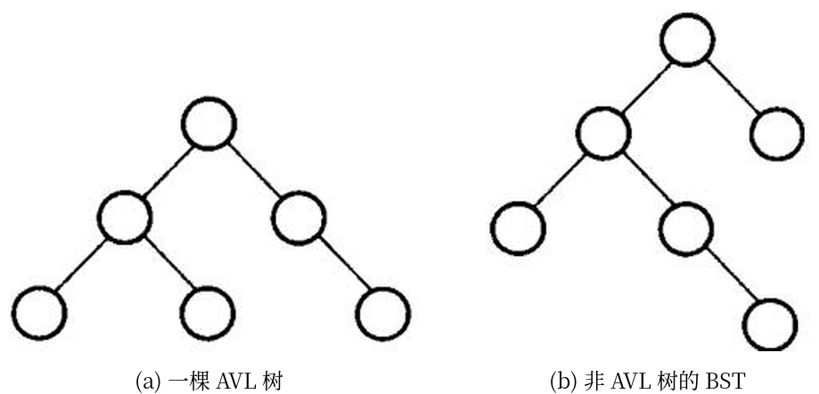

图 12.28　(a) 一棵 AVL 树；(b) 关键码相同但不是 AVL 树的 BST——某个结点的左右子树高度差到了 2。

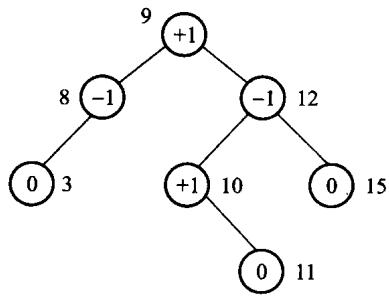

图 12.29　带平衡因子的 AVL 树。实现时结点里存的不是高度而是这个因子，只要两位。插入或删除使某个祖先的因子变成 $\pm 2$ 时，按「哪边沉、沉在内侧还是外侧」分成四种情形。外侧失衡一次单旋转就能拉平；内侧失衡要先把孙子转到孩子、再把孩子转到祖先，即双旋转。旋转是局部的，不改变中序次序。查找、插入、删除最坏都是 $O(\log n)$。

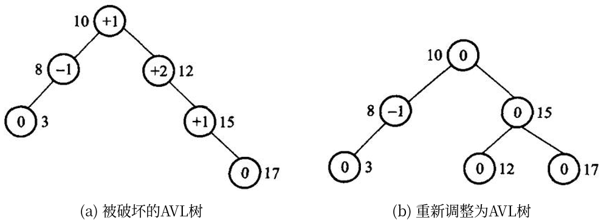

图 12.30　(a) 插入之后被破坏的 AVL 树；(b) 旋转之后重新变成 AVL 树。旋转只动局部几根指针，**中序次序保持不变**——这是所有平衡树旋转的共同前提。

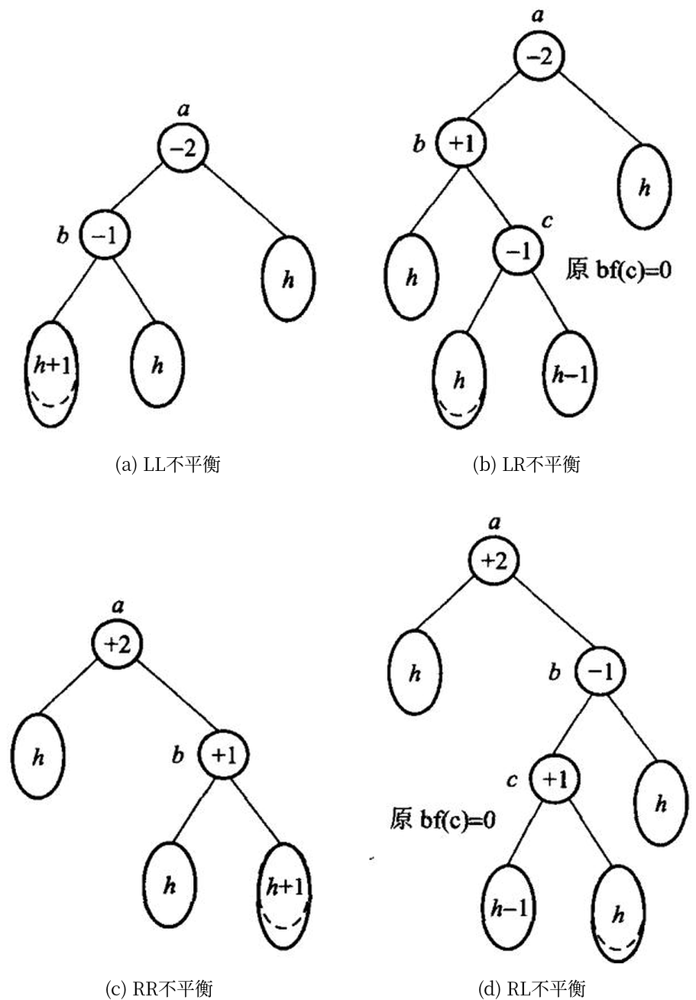

图 12.31　AVL 树的四种失衡类型：(a) LL、(b) LR、(c) RR、(d) RL。圆圈是结点，椭圆是子树，里面的符号是它的高度。

四种情形用中序仍保持 $A<B<C$ 来记（圆括号里是子树）：

```text
LL（左左，一次右旋）          RR（右右，一次左旋）
      C                           A
     /                             \
    B               →               B
   /                                 \
  A                                   C

LR（左右，先左旋再右旋）      RL（右左，先右旋再左旋）
      C                           A
     /                             \
    A               →               B
     \                             / \
      B                           A   C
```

插入 1、2、3 会走出 RR：先得到右链 `1-2-3`，在 1 上左旋变成以 2 为根的平衡树。插入 3、2、1 是对称的 LL。插入 1、3、2 是 RL：先在 3 上右旋，再在 1 上左旋。删除一个结点后，从被删处向上检查，哪一层变成 $\pm 2$ 就在那一层做同样的旋转；有时旋转一次还不够，要继续向上走。

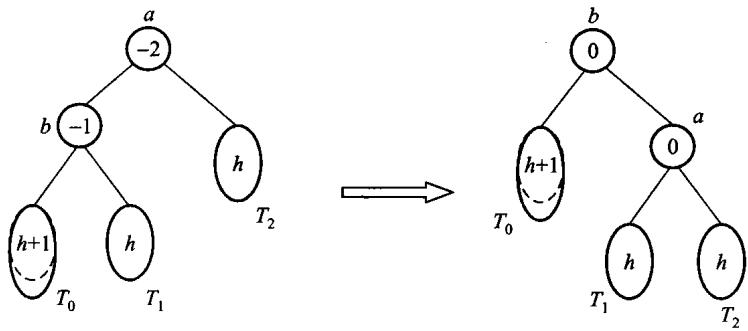

图 12.32　LL 型失衡的单旋转，RR 型对称。

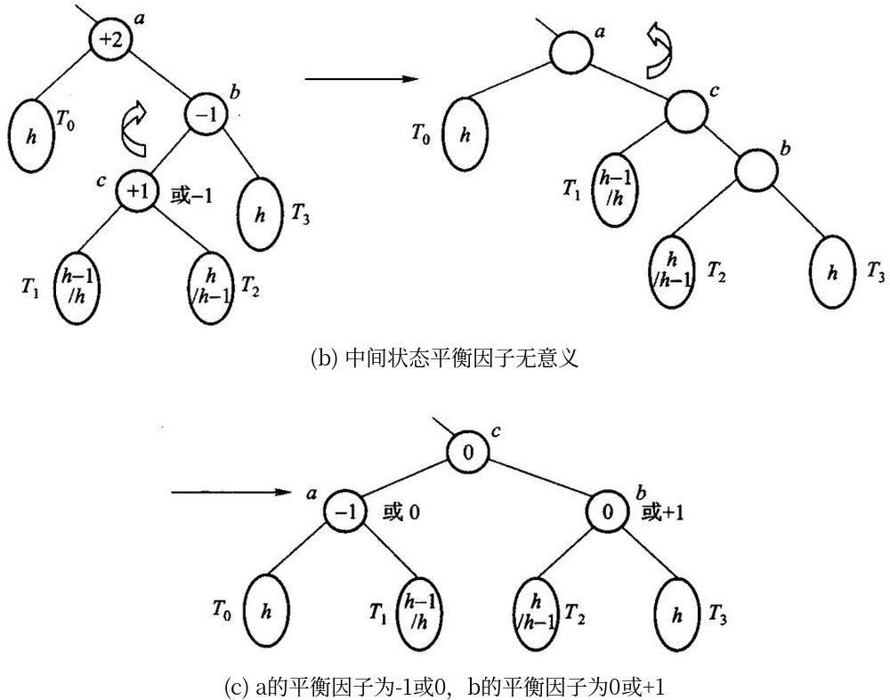

图 12.33　RL 型的双旋转，LR 型对称。中间那步的平衡因子没有意义（图中的 (b)）；转完之后 $a$ 的因子是 $-1$ 或 $0$、$b$ 的因子是 $0$ 或 $+1$，取决于被提上来的那棵子树原来偏哪边。

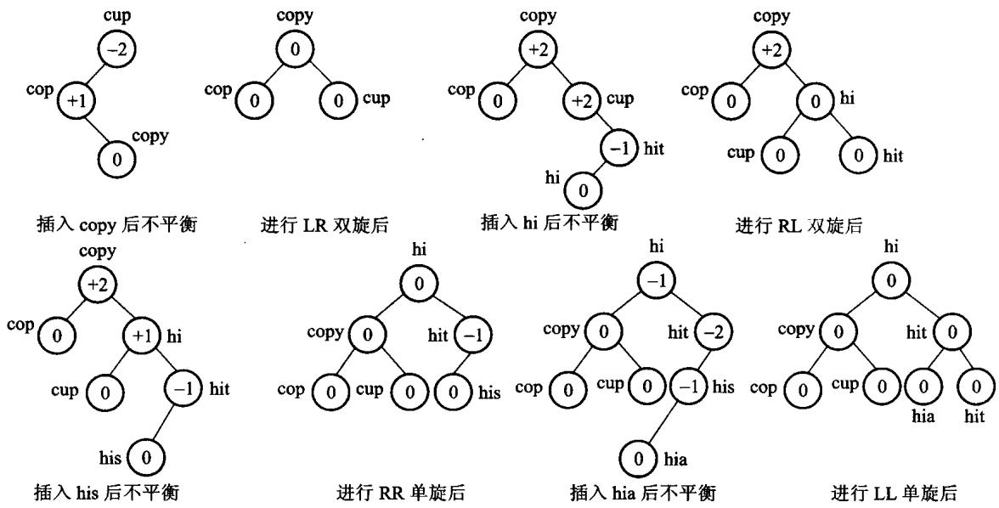

图 12.34　从空树开始依次插入一组单词，AVL 树的生长过程。

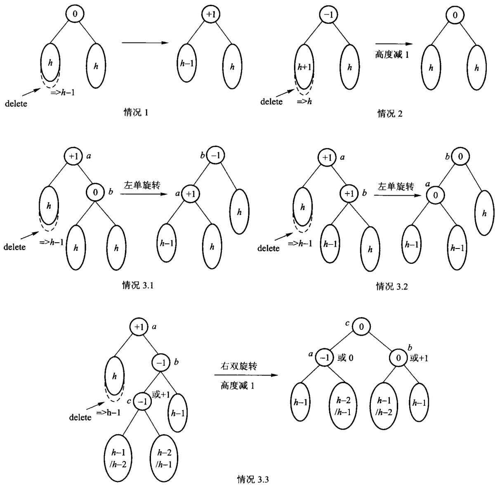

图 12.35　删除之后的调整。**删除比插入麻烦**：插入最多转一次就结束，删除可能一路向上每层都要转。

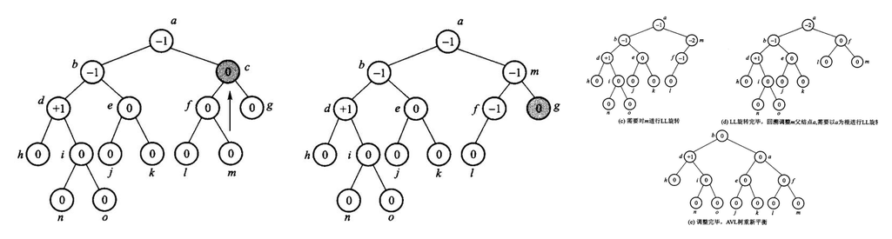

图 12.36　删除的例子：(a) 删有两个孩子的结点 c，先用它的中序前驱 m 顶替，再删到叶那一层；(b) 删结点 g 之后 m 失衡；(c) 需要对 m 作 LL 旋转；(d) 转完 m 之后回溯，父结点 a 又失衡，再以 a 为根作一次 LL 旋转；(e) 调整完毕，整棵树重新平衡。**一次删除可能引发从被删结点一路到根的多次旋转**，这是它与插入最大的不同。

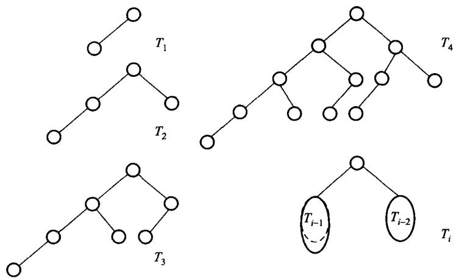

图 12.37　「最瘦」的 AVL 树——每个结点的左右高度差都取到允许的极限。设高度为 $h$ 的这种树最少有 $N(h)$ 个结点，则 $N(h)=N(h-1)+N(h-2)+1$（Fibonacci 递推），由此可推出 AVL 树的高度不超过约 $1.44\log_2 n$：**AVL 的平衡不是完美平衡，但足以保证 $O(\log n)$**。

四组最小输入正好能当旋转单元测试：`3,2,1 -> LL`，`1,2,3 -> RR`，`3,1,2 -> LR`，`1,3,2 -> RL`，结果都应以 2 为根，中序都为 `1,2,3`。只测中序不够，因为一棵退化链的中序也正确；还要查根、高度和平衡因子，才能证明旋转真的发生。

红黑树是另一种近似平衡，用颜色规则保证最长路径不超过最短路径的两倍，旋转次数有常数上限，见第 11.5 节。
可运行的 AVL 四旋转实现见 `code/ch12/balanced_trees/modern.hpp`，测试检查中序有序、查找、删除和高度边界。

### 12.4.3 伸展树

**伸展树**（splaying tree）由 John Edward Hopcroft 和 Robert Endre Tarjan 于 1985 年共同发明，
与第 10.1 节提到的线性表调整技术同属于**自调整数据结构**（self-adjusting data structure）。

**与 AVL 不同的是：伸展树的一次访问不一定会使树结构更加平衡，也不能保证最终树高平衡；但它能
保证访问的总代价不高，达到最令人满意的性能。** 伸展树与 AVL 树一样，实际上也不是一种新数据
结构，而只是**改进 BST 性能的一组规则**，控制检索、插入、删除等操作对 BST 的修改，从而避免标准
BST 操作在最差情况下的线性时间代价。

每当访问一个结点 $x$ 时（$x$ 被插入、删除或者被检索），伸展树就完成一次称为**展开**（splaying）的过程：
插入和检索 $x$ 时，结点 $x$ 作为当前结点；**删除结点 $x$ 时，$x$ 的父结点作为当前结点**。沿着当前结点
到根结点的方向进行一系列展开操作，直到把当前结点移到 BST 的根。就像在 AVL 树中一样，一次展开
由一组**旋转**（rotation）组成：一次旋转通过调整结点 $x$ 相对于其父结点和祖父结点的位置，将其移到
树结构中的更高层。**旋转有 3 种类型：单旋转、一字型双旋转、之字型双旋转。**

当被访问结点 $x$ 是根结点的子结点时，完成**单旋转**（single rotation），在保持 BST 特性的情况下把
$x$ 与其父结点交换位置——**实际上伸展树的单旋转与 AVL 树的单旋转是一样的**。当被访问结点 $x$ 离
根结点的层数大于等于 2 时，发生**双旋转**（double rotation），涉及 $x$、其父结点 $y$ 和祖父结点 $z$。

最近被用到的键下次更容易先碰到，这是一种自调整，均摊 $O(\log n)$。

从被访问结点走到根，每次看它、父结点和祖父结点的形状。一字形（连续两次同向）先转祖父、再转父；之字形（先左后右，或先右后左）先转父、再转祖父。两种双旋都把目标提升两层，但对其余结点的重排不同。目标只差一层到根时，再做一次单旋转即可。半伸展不会每次都把目标送到根，旋转更少，但保证也与全伸展不同。

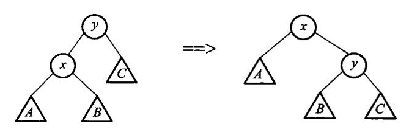

图 12.38　只有当被展开的结点已经是根的孩子时，才做单旋转：左边是旋转前，右边是旋转后。

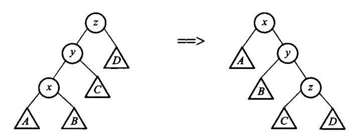

图 12.39　一字形旋转：$x$、$y$、$z$ 在一条同向的链上（左），旋转之后（右）。一字形一般不会降低树高，但会把整条同向长链压短。

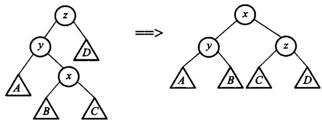

图 12.40　之字形旋转：$x$、$y$、$z$ 拐了个弯。之字形**倾向于让树更平衡**——子树 B、C 上升一层，D 下降一层。

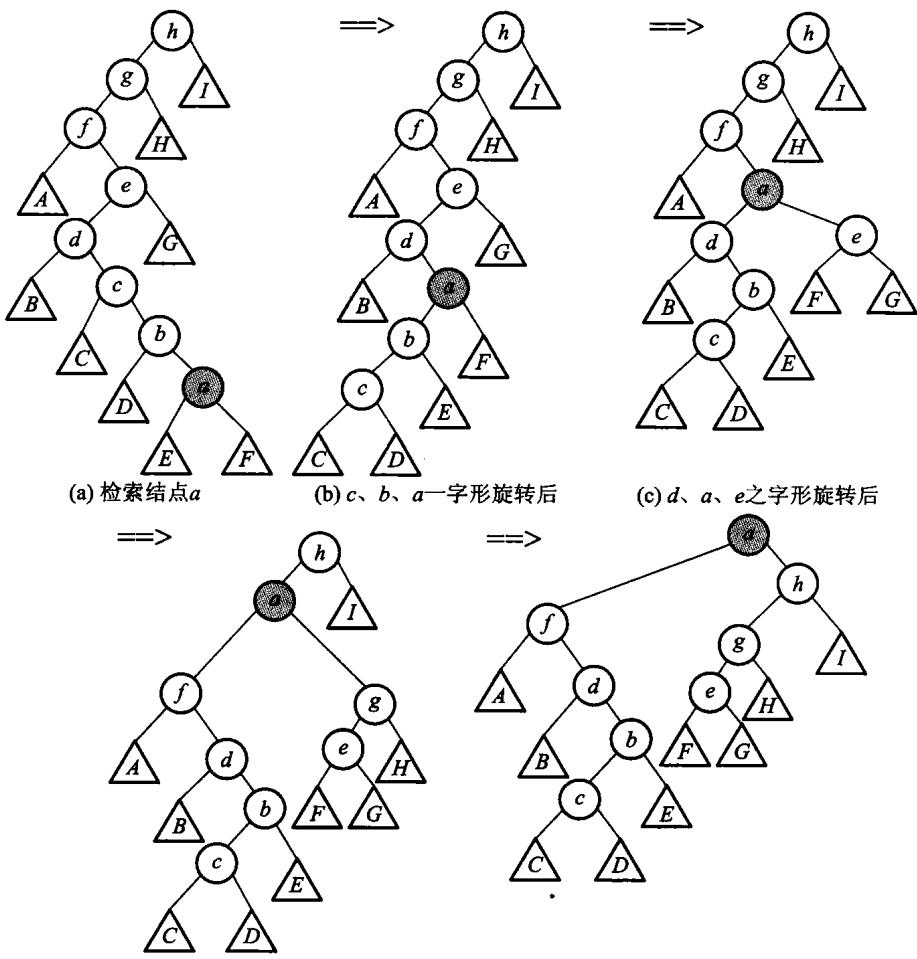

**最后一句放在这里最合适**（原书 12.4.2 末）：二叉搜索树（包括红黑树、AVL 树、伸展树等）适用于组织
**内存中**小规模的目录；对于较大的、存放在外存储器上的文件，用二叉搜索树来组织索引就不太合适——
**若以结点作为内外存交换的单位，则检索中在找到需要的关键码之前平均要对外存进行 $\log_2 n$ 次
访问，这是很费时的**。在文件索引中大量使用每个结点包含多个关键码的 B 树，尤其是 B+ 树（第 11 章）。
另外，Linux 采用 AVL 树描述进程的虚拟内存段。

图 12.41　检索 a 之后把它展开到根：先 c、b、a 一字形，再 d、a、e 之字形，再 f、a、g 之字形，最后一次单旋转让 a 成为根。四次旋转下来，整棵树的层次明显变浅了。（图中内部结点只是索引代号，记录都在外部叶上，所以内部结点的字母不必满足中序有序。）

例如链 `10 -> 20 -> 30` 中访问 30，是右–右一字形：先围绕 10 左旋，再围绕 20 左旋，30 到根。若 10 的右孩子是 30、30 的左孩子是 20，则访问 20 是右–左之字形，两次旋转方向相反。两种情况都把目标提两层，但一字形还把整条同向长链明显压短，这是不能把它替换成连续「父子单旋」的原因。

“均摊 $O(\log n)$”不等于每一次都快。访问深链末端的单次代价仍可达 $O(n)$；保证的是从任意初始树开始，一串 $m$ 次操作的总成本为 $O(m\log n)$（另加初始势能）。因此伸展树适合热点键反复出现、又不要求单次延迟上界的场景；实时系统若要求每次查找都在确定高度内结束，更适合 AVL 或红黑树。

**半伸展**是一种折中：不必每次都把目标送到根，旋转次数更少。

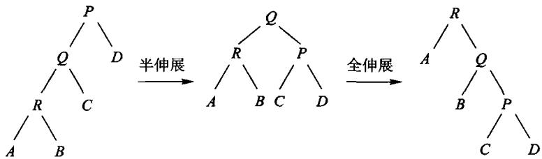

图 12.42　半伸展与全伸展的区别。

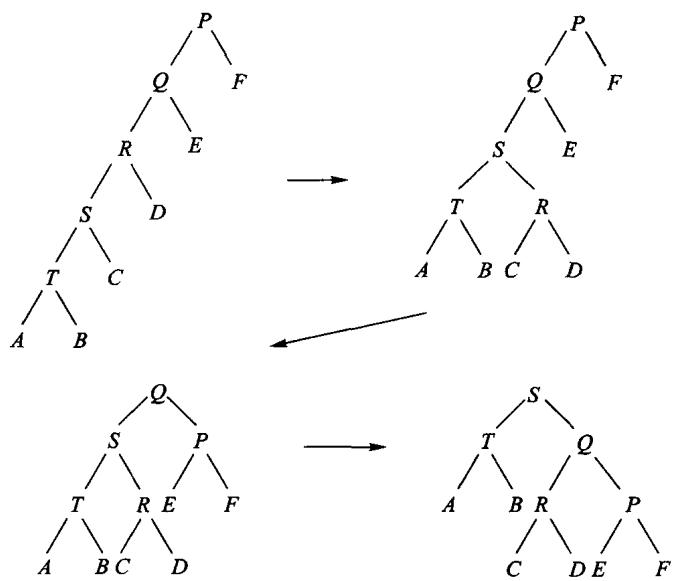

图 12.43　连续两次访问同一个结点 T 时，半伸展树的变化。

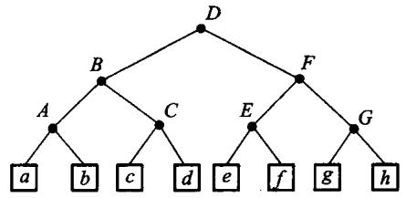

图 12.44　记录存在外部结点上的半伸展树。

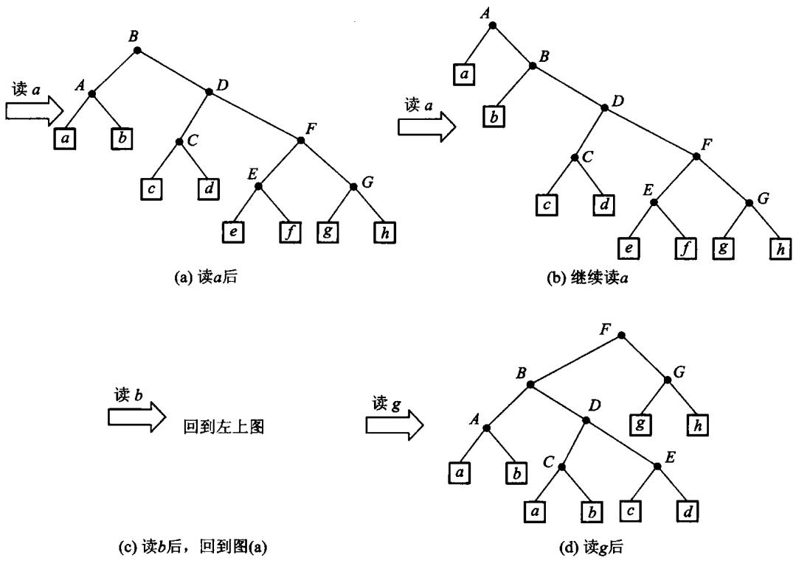

图 12.45　在图 12.44 上连续读 a、a、b、g 之后的变化过程。**重复访问的键会一路浮到靠近根的位置**——这正是伸展树在「热点键反复出现」时占便宜的地方。

伸展树实现简单，不必维护额外的平衡域；代价是单次操作可能仍是 $O(n)$，只是摊还之后是对数。
同一实现中的 `SplayTree` 使用 `unique_ptr` 维护子树所有权，访问后按一字形/之字形规则旋至根。


## 本章小结

### Python 实现的证据链

```python file=code/ch12/trie/modern.py#trie
class Trie:
    """12.4 Trie：每个字符一层，公共前缀共享同一条路径。"""

    def __init__(self) -> None:
        self.root = _Node()
        self._size = 0

    @staticmethod
    def _valid(word: str) -> None:
        if any(c < "a" or c > "z" for c in word):
            raise ValueError("trie key must be a..z")

    def insert(self, word: str) -> bool:
        self._valid(word)
        node = self.root
        path = []
        for c in word:
            path.append(node)
            node = node.children.setdefault(c, _Node())
        if node.terminal:
            return False
        node.terminal = True
        self._size += 1
        # passing 是「有多少个键经过这里」，count_with_prefix 靠它一次问答，
        # 而不是把子树数一遍。维护它的代价就落在这一行。
        for item in path:
            item.passing += 1
        node.passing += 1
        return True

    def contains(self, word: str) -> bool:
        node = self._find(word)
        return node is not None and node.terminal

    def starts_with(self, prefix: str) -> bool:
        return self._find(prefix) is not None

    def count_with_prefix(self, prefix: str) -> int:
        if prefix == "":
            return self._size
        node = self._find(prefix)
        return 0 if node is None else node.passing

    def _find(self, text: str) -> _Node | None:
        node = self.root
        for c in text:
            if c not in node.children:
                return None
            node = node.children[c]
        return node

    def size(self) -> int:
        return self._size

    def node_count(self) -> int:
        def count(node: _Node) -> int:
            return sum(1 + count(child) for child in node.children.values())

        return count(self.root)

    def keys_with_prefix(self, prefix: str) -> list[str]:
        node = self._find(prefix)
        out: list[str] = []
        if node is None:
            return out

        def collect(current: _Node, text: str) -> None:
            if current.terminal:
                out.append(text)
            # 按 a..z 的顺序下降，收集结果因此天然有序，不必再排一次。
            for code in range(ord("a"), ord("z") + 1):
                c = chr(code)
                if c in current.children:
                    collect(current.children[c], text + c)

        collect(node, prefix)
        return out

    def erase(self, word: str) -> bool:
        if not self.contains(word):
            return False
        node = self.root
        path = []
        for c in word:
            path.append((node, c))
            node = node.children[c]
        node.terminal = False
        node.passing -= 1
        self._size -= 1
        # 自底向上摘掉不再承载任何键的结点：passing 归零且没有孩子就该消失。
        for parent, c in reversed(path):
            parent.passing -= 1
            child = parent.children[c]
            if child.passing == 0 and not child.children:
                del parent.children[c]
        return True

    # >>> trie-longest-prefix
    def longest_prefix_of(self, text: str) -> str:
        """text 的哪个前缀是树里最长的那个键。走不动就回退到最近一次的词尾。"""
        node = self.root
        best = 0
        for i, c in enumerate(text):
            if c not in node.children:
                break
            node = node.children[c]
            if node.terminal:
                best = i + 1
        return text[:best]
    # <<< trie-longest-prefix
```

```python file=code/ch12/trie/modern.py#trie-longest-prefix
def longest_prefix_of(self, text: str) -> str:
    """text 的哪个前缀是树里最长的那个键。走不动就回退到最近一次的词尾。"""
    node = self.root
    best = 0
    for i, c in enumerate(text):
        if c not in node.children:
            break
        node = node.children[c]
        if node.terminal:
            best = i + 1
    return text[:best]
```

```python file=code/ch12/trie/modern.py#patricia-bits
def bit_of(key: str, index: int) -> bool:
    """键的第 index 位（从最高位数起）。超出键长一律当 0——

    这一条让「一个键是另一个键的前缀」也能被分开：`"a"` 与 `"ab"` 在
    第 8 位之后就靠这个 0 区分。求首个不同位时把上界取到 `(最长+1)*8`，
    正是为了给这个「虚拟的结尾」留出位置。
    """
    byte = index // 8
    if byte >= len(key):
        return False
    return bool((ord(key[byte]) >> (7 - index % 8)) & 1)
```

算法12.1 的可利用空间表属于存储管理侧，因此不给 Python 薄封装；最佳 BST 的动态规划属于算法侧：

```python file=code/ch12/optimal_bst/modern.py#optimal-bst
def optimal_bst(successful, unsuccessful):
    if len(unsuccessful) != len(successful) + 1:
        raise ValueError("weight count")
    n = len(successful)
    cost = [[0]*(n+1) for _ in range(n+1)]
    root = [[0]*(n+1) for _ in range(n+1)]
    weight = [[0]*(n+1) for _ in range(n+1)]
    for i in range(n+1):
        weight[i][i] = unsuccessful[i]
    for length in range(1, n+1):
        for first in range(n-length+1):
            last = first + length
            weight[first][last] = weight[first][last-1] + successful[last-1] + unsuccessful[last]
            cost[first][last] = 10**30
            for r in range(first+1, last+1):
                candidate = cost[first][r-1] + cost[r][last] + weight[first][last]
                if candidate < cost[first][last]:
                    cost[first][last], root[first][last] = candidate, r
    return cost, root
```

**为了适应一些特定应用，需要功能更强大、具有更多操作的高级数据结构。** 本章介绍了多维数组、广义表
等高级线性表结构以及相关的内存管理技术，还介绍了 Trie 和 PATRICIA 两种字符索引结构，以及最佳
二叉搜索树、平衡二叉搜索树 AVL、伸展树 3 种改进的 BST。

**多维数组可以看做是线性表的推广。** 数组一般采取顺序存储方法，因为数组结构中元素个数相对固定，
一旦生成只改变元素的值，并不改变元素的相对位置和个数；把数组元素按周游的顺序排列起来，得到一个
包含所有数组元素的线性序列，**数组的周游分为行优先顺序和列优先顺序两种方式**。二维数组常被用来
表示矩阵，数组的第一维和第二维分别对应矩阵的行和列；三角矩阵、对称矩阵和对角矩阵是常用的几类
比较特殊的矩阵；**稀疏矩阵是非零元素非常少的矩阵，它常用的存储方式是十字链表法。**

广义表是对线性表的一种扩展，**它允许线性表中还包含一个或多个子表**。用数学中结合的包含关系可以
表述几种类型的广义表：**图 $\supseteq$ 再入表 $\supseteq$ 循环表 $\supseteq$ 纯表 $\supseteq$ 线性表**。
根据广义表的不同形式，可以用线性表、树和图等数据结构或其修改形式来存储和实现广义表；广义表的
周游通常采用深度优先的策略。

**为支持动态数据结构，操作系统需要一套有效的内存管理技术**，动态地进行内存的分配和回收。在实际的
操作系统中，内存管理本质上是利用链表和广义表来实现的；内存管理最基本的问题是存储的分配和回收，
需要解决碎片问题以及存储空间溢出时无用单元的回收管理等。**内存分配是通过可利用空间表的组织来
进行的**，这是把存储区中当前还未使用的空间通过链表方式管理起来的一种方法。

**BST 树是一种基于对象空间分解的数据结构**，即关键码范围的分解是由存储在树中的对象决定的，这种
分解方式受关键码输入的影响。**Trie 结构对关键码范围进行均分，它基于两个原则：有一个固定的关键码
集合和对于结点的分层标记。** 其内部结点仅作为占位符引导检索过程，数据记录只存储在叶结点中；英文
字符 Trie 树的每个内部结点都有 26 个子结点（如果算上空格，则为 27 个）。**PATRICIA 树是 Trie 树的
变体，它根据关键码的二进制编码来进行划分，是一种比较好的中文字典组织方式。**

最佳二叉搜索树、平衡二叉搜索树 AVL、伸展树是二叉搜索树 BST 的几个变体。**检索中平均比较次数
最小的二叉搜索树称为最佳二叉搜索树**，它满足最优子问题和子问题重叠性质，可以使用动态规划算法来
构造。

**AVL 树中任何结点的左子树和右子树高度最多相差 1。** 插入新结点按照 BST 的插入算法，如果插入后
仍然是 AVL 树则不调整，否则需要根据 LL、LR、RL、RR 四种类型进行调整；AVL 树的删除结点采用 BST
的基本删除算法，如果删除后需要调整，则从被删除的结点找到第一个失衡的祖先结点，然后开始单旋转或
多旋转操作，**这样的调整操作向根的方向传递，直到树平衡为止**。AVL 树放宽了 BST 的平衡要求，它既
照顾到更新操作的代价，又兼顾完成操作后树结构的检索功能，其树高为 $O(\log n)$。

**伸展树不要求 BST 结构总是保持平衡或最佳检索状态**，而是在每次访问时通过一系列双旋转、单旋转将
被访问结点移到根结点，**这样尽量使最近访问的结点容易被检索到**，其检索效率比较高。

第 11 章介绍的红黑树也是一种改进的 BST，它是一种常用的索引结构，统计性能要好于 AVL 树；其平衡
要求比 AVL 树更低，利用对树中结点红黑着色的要求达到局部平衡。

**二叉搜索树（包括红黑树、AVL 树、伸展树等）适用于组织内存中小规模的目录。** AVL 树的高度不超过
$1.5\log_2(n+1)$，具有 $n$ 个内部结点的红黑树最大树高是 $2\log_2(n+1)+1$，因此**最坏情况下的红黑树
的高度大于最坏情况下具有相同（内部）结点数目的 AVL 树**；AVL 树和伸展树适合于检索较多的应用，
插入删除操作比较频繁的应用往往采用红黑树。

具体到本章的实现：多维数组按行优先或列优先顺序存放，按下标随机访问；三角、对称、稀疏矩阵可以
压缩。广义表的元素可以是原子或子表，头尾分解对应递归。动态存储要处理碎片和回收：首次/最佳/最坏
适应，引用计数与标记清除。Trie 按字符分支并共享前缀，Patricia 压缩单孩子路径。最优 BST 用动态规划选根；AVL 用平衡因子和四种旋转保证 $O(\log n)$；伸展树用访问后上移做均摊平衡。可利用空间表是定长结点的显式空闲栈，不劫持全局 `new`。

## 习题

### 补充概念与上机题（参考课程第 12 章）

1. 用 CSR 三数组表示稀疏矩阵，并计算 `y = A x`；复杂度按非零元数 `nnz` 表示。
2. 说明共享广义表为什么不能简单递归释放，并设计引用计数或访问标记方案。
3. 证明长度为 `N` 的字符串所有后缀插入 Trie 后，每个不同子串对应 Trie 中一个结点；分析最坏时间。
4. 实现 AVL 的四种旋转，并用中序遍历验证旋转前后序列不变。

1. 写出 $3\times 4$ 数组按行优先时 $a_{2,1}$ 相对首地址的偏移（元素占 1 个单元）。
2. 把 4 阶下三角压成一维，给出 $a_{3,1}$ 的下标。
3. 说明纯表、再入表、循环表分别对应什么图，释放时要注意什么。
4. 空闲块按地址顺序是 900、1500、700。举一个请求，使首次适应、最佳适应、最坏适应分别选中三块**不同**的空闲区；再说明为什么「能不能满足」这个条件本身分辨不出三种策略。
5. 把 `can`、`car`、`cat` 插入字母 Trie，画出结果，并写出查找 `cab` 的失败路径。
6. 教材样例 $p=\{1,5,4,3\}$、$q=\{5,4,3,2,1\}$，指出最优 BST 的根和总成本。
7. 从空 AVL 依次插入 1、2、3，画出每次旋转。再插入 0，需要旋转吗。
8. 伸展树中，之字形和一字形各升几层？为什么半伸展适合连续访问同一结点。

### 原书习题

> 以下是原书第 12 章的习题，本轮按扫描件补回题面；**参考答案尚未写出**，已逐题登记在
> `collab/answer_gaps.json`。图 12.46 见原书。

1. 设计一个算法，将按行优先原则顺序存储的二维数组 $A_{n \times n}$ 转置（$a_{i,j}$ 与 $a_{j,i}$ 交换），
   **要求转置结果仍占用原来的存储空间**。
2. 编写程序，建立一个 $10 \times 10$ 的对角线元素为 0、其余元素为 1 的二维数组，并将该数组打印出来。
   成功后改写该程序，使其对角线元素仍然为 0、其余元素为空格字符的二维数组。
3. 若在 $m \times n$ 的矩阵中存在一个元素 $A[i,j]$ 满足：$A[i,j]$ 是第 $i$ 行元素中最小值，且是第 $j$ 列
   元素中最大值，则称矩阵 $A$ 有**鞍点**。试写一个算法，找出矩阵 $A$ 的一个鞍点；若 $A$ 中不存在鞍点，
   则给出某种信息（采用行优先原则顺序存储矩阵 $A_{mn}$）。
4. 编写一个广义表逆置算法，在所有级别逆置子表、包括最高级。(1) 例如纯表
   $(x_1, (y_1, y_2, (z_1, z_2), y_4), (w_1, w_2), x_4)$ 的逆置为
   $(x_4, (w_2, w_1), (y_4, (z_2, z_1), y_2, y_1), x_1)$；(2) 循环表
   $(L1:(L2:(L1,a)), (L2,L3:(b)), (L3,c), L4:(d,L4))$ 的逆置对应于
   $(L4:(L4,d), (c,L3:(b)), (L3,L2:(a,L1)), L1:(L2))$。
5. 画出下列广义表的图形表示和它们的存储表示：(1) $D:(A:(c), B:(e), C:(a, L(b, A, d)))$；
   (2) $J1:(J2:(J1, a, J3:(J1)), J3)$。
6. 利用广义表的 `Head` 和 `Tail` 运算，把原子 $d$ 分别从下列广义表中分离出来：
   $L1 = ((((a), b), d), e)$；$L2 = (a, (b, ((d)), e))$。
7. 设计一个算法，求广义表的深度。
8. 设计一个算法，删除广义表中所有值等于 $x$ 的原子项。
9. 设计一个算法，判断两个广义表是否相等。
10. 3 种顺序适配方法各有其使用范围。现假定存储区中有大小为 900、1500、700 的三块空存储块。
    试给出符合以下几种情况的存储请求的例子：(1) 首先适配法可满足请求，另两种方法不可满足请求；
    (2) 最佳适配法可满足请求，另两种方法不可满足请求；(3) 最差适配法可满足请求，另两种方法不可
    满足请求。
11. 组织成循环链表的可利用空间表附加什么条件时，**首次适配策略转变为最佳适配策略**吗？
12. 给出下面一组值 $\{$cup, cop, copy, hit, hi, his, hia, he$\}$ 的二叉 Trie 结构。
13. 给出下面一组值 $\{$cup, cop, copy, hit, hi, his, hia, he$\}$ 的 PAT Trie 结构。
14. 将关键码 $1, 2, 3, \cdots, (2^k - 1)$ 依次插入到一棵初始为空的 AVL 树中，试证明结果是一棵高度为
    $k$ 的完全满二叉树。
15. 已知元素个数为 12 的字典，其元素集合为 $\{$Jan, Feb, Mar, Apr, May, June, July, Aug, Sep, Oct,
    Nov, Dec$\}$。(1) 试按元素的次序依次插入一棵初始时为空的二叉搜索树，画出插入完成之后的二叉
    搜索树，并求其在等概率情况下查找成功的平均查找长度；(2) 按元素顺序构造一棵 AVL 树，并求其在
    等概率情况下查找成功的平均查找长度。
16. AVL 树是否允许重复关键码？例如图 12.46 中有两个关键码都是 12 的结点，为什么？
17. 高度为 $h$ 的 AVL 树上的最少结点个数与最多结点个数分别是多少？
18. 从空的二叉树开始，根据字典序顺序（注意：`he` < `tea` < `teacher`），严格按照 AVL 树（平衡的二叉
    搜索树）插入算法，依次插入 $\{$head, he, tea, teach, twin, hot, toss$\}$。(1) 试画出插入后的 AVL 树；
    (2) 在上题生成的 AVL 树中，依次删除 head、he、tea、teach、twin、hot、toss。试画出每执行一次删除
    操作、并根据必要进行调整后的 AVL 树。

## 上机题

1. 实现下三角矩阵的压缩存储，并支持按下标读写。
2. 用句柄池管理固定个数的结点，测试耗尽、归还、复用和重复释放。
3. 实现一棵字母 Trie 的插入和查找，用一组单词对拍 `std::set`。
4. 按教材权重实现最优 BST，输出根表并重建树形。

### 原书上机题

> 同上，本轮只补题面，参考答案登记在 `collab/answer_gaps.json`。原书这一章的上机题分量最重，
> 后几道（阅卷管理、职工管理、搜索引擎）是北京大学计算机系多年来的学期综合上机实习题。

1. 设二维数组 $a[1..m, 1..n]$ 含有 $m \times n$ 个整数。写出一个算法来判断 $a$ 中所有元素是否互不
   相同，输出相关信息（yes/no），并分析你的算法的时间复杂度。
2. 广义表具有可共享性，因此在周游一个广义表时必须为每一个结点增加一个标志域 `mark`，以记录该
   结点是否访问过；一旦某一个共享的子表结点被做过访问标志，以后就不再访问它。(1) 试定义该广义表
   的类结构；(2) 实现对一个非递归的广义表进行周游的算法。
3. 试设计一个数据结构和算法，判断两个 `.cpp` 程序（程序都是完整的，即类型定义和函数定义都在一个
   文件中）是否相似。可以返回 0（完全不同）至 1（完全相同）之间的值。
4. 实现稀疏矩阵表示方法，并支持矩阵的下列操作：(1) 在给定位置向矩阵中插入一个元素；(2) 从矩阵中
   给定位置删除一个元素；(3) 返回矩阵中给定位置元素的值；(4) 对一个矩阵进行转置；(5) 两个矩阵相加。
5. 基于图 12.11 的结构，模拟存储管理系统，支持 3 种顺序适配方法的分配和回收操作：首先适配、最佳
   适配和最差适配。测试你的系统，分析总结在什么情况下哪种方法完成得最好。
6. 用 Trie 树实现一个字典，要求具有 `create`、`insert`、`delete`、`search` 功能。
7. 使用 Trie 数据结构设计一个程序对变长字符串排序，**程序所做的工作与所有字符串中字母总数要成
   比例**。有些字符串可能很长，而大多数则很短。
8. 编写一个程序，对一段英文材料用 Trie 树进行存储。要求：提供算法周游 Trie 树，并打印出所有单词，
   单词按照长度的升序排序，长度相同的单词按字母顺序。
9. 对于一段英文材料，构造 PATRICIA 树，并统计每个字母出现的次数。
10. **后缀树。** 后缀是指从某个位置 $i$ 开始到整个串末尾结束的一个特殊子串；一个长度为 $n$ 的字符串
    $S$ 约定末位 `S[n]` 为特殊字符 `$`，也就是说 $S$ 以一个特殊字符 `$` 结尾。一个**后缀树**（suffix tree）是对于一个
    给定的字符串，包含其所有后缀字符串的压缩 Trie 结构。例如字符串 `MALAYALAM$` 的后缀字符串
    集合中有 10 个子串。**后缀树的好处是它允许使用通配符对字符串进行检索**：例如检索关键码
    `ALA*` 表示找到所有以 `ALA` 作为前 3 个字符的字符串，这可以很容易地使用一个普通 Trie 结构
    实现；**在一个普通 Trie 结构中检索 `*ALA` 效率很低，但是在一棵后缀树中却是高效率的。** 后缀树
    提供了很好的全索引结构，适合于各种字符串算法，例如查找字符串中的子串、找出串中最长的重复子串、
    查找两个字符串的公共子串、判断回文串等；后缀树在中文切词、共现词关联分析、频繁模式挖掘、聚类
    分析、基因序列对比分类等研究领域也有很广泛的应用。Edward McCreight 于 1976 年提出非在线的
    后缀树算法，逆序处理字符串、采用路径压缩的方法构造后缀树，该后缀树最多有 $2n$ 个结点，构造时间
    代价为 $O(n)$；1995 年 Ukkonen 提出了在线的后缀树算法，在从左到右输入的同时构造出后缀树，
    时间代价为 $O(n)$。试根据自己的兴趣和能力完成后缀树的练习，例如：(1) 对一个词典中的单词或
    短语实现后缀树；(2) 分析若干篇文章中的频繁共现词汇；(3) 利用后缀树对搜索引擎的返回结果进行
    聚类。
11. 在字符 $\{A, C, G, T\}$ 组成的 DNA 序列中，A↔T 和 C↔G 是互补对。编写算法，判断一个 DNA 序列
    中所有互补回文串（例如 `ATCATGAT` 的补串是 `TAGTACTA`，与原串形成互补回文串）。
12. **利用半伸展树存储文件中单词词频。** 扫描一个文本文件，并计算出这一文件中每个词的词频；为简化
    起见，略去标点符号、按照字典排列的顺序对单词排序，并忽略大小写。用一棵 BST 作为一个文件中单词
    的存储结构，并用 semi-splay 技术对这棵树进行辅助维护，以使输入流中的下一个单词出现在树比较
    接近于根的位置的几率较大。方法如下：(1) 如果在文件中第一次遇到一个词，把这个单词插入 BST 树；
    否则，从与该单词对应的结点处开始处理，这一单词的频率增加 1；(2) 向根结点的移动是通过改变所涉及
    结点的链接来完成的，如果单词没有在树中找到，将创建一个新的叶结点然后插入树中；(3) 通过一个
    指向父结点的指针来保存结点的前驱。**注意：旋转与否只取决于是否被访问（包括查找、插入等），跟词频
    本身没有必然关系**——但是可以想像，访问频率越高（只要不都是连续访问），它被旋转到根结点的机会
    就越多，相对而言它会比其他较少访问的结点更接近根结点。作业要求：创建一个较长的测试文件，使用
    semisplaying 技术来组织一棵 BST；在所有的单词都处理完之后，要求对树进行一次中序周游，将所有
    结点的词频数打印出来。
13. **模拟的阅卷管理系统。** 该系统支持多位教师集体阅卷（试卷为电子文档）。基本要求：(1) 每份试卷应
    该随机调阅，分别由两位教师批阅，取其平均成绩；(2) 阅卷教员发出调阅试卷要求，系统随机调阅一份未
    完成的试卷（还没有人阅过，或者只有一位教师阅过）给该阅卷者；(3) 每位教师可以检查自己批阅过的
    试卷，并录入和修改成绩；考生姓名和考号对教师保密，教师只能看到系统编号。读者根据自己的能力
    添加其他功能：① 支持大数据量，例如 100 万以上；② 支持并发操作，例如允许多位教员读数据；
    ③ 两位阅卷教师给出的成绩相差太大（例如 > 10%）时，试卷派发给阅卷组长；④ 自动调整每位教员的
    成绩权重，不同教师给予不同的权重。
14. **简单的职工管理系统。** 职工对象包括姓名、部门、开始工作时间、职务、年龄、性别、生日、学历、住址、
    电话、工资。要求：(1) 实现增加一个职工的信息（包括加入批量的数据），并允许某些参数不输入；
    (2) 删除满足条件的职工对象；(3) 查询符合某些条件的职工对象；(4) 对检索出的某些对象进行修改；
    (5) 根据某些需要对显示的结果进行排序；(6) **实现对某些域建立索引**（可以是 B 树、$B^+$ 树、散列
    索引或者其他高效率的索引），并比较使用索引和不使用索引的查询速度；(7) 对于输入的职工信息要有
    基本的纠错能力，例如像输入出生年月日是否合法；(8) 排序要能够按照用户的格式进行，包括字母排序、
    数字排序、日期排序、升序、降序、多列排序等；(9) 数据量规模在一万以上。加分功能：支持带有 `*`、`?`
    等通配符的字符串查询（需要正则表达式匹配算法）；支持简单的 SQL 语句的查询；能支持百万以上的
    职工数据量。
15. **搜索引擎。** 搜索引擎是一种收集、组织和处理大量信息资源，并向用户提供高效检索服务的工具。
    由于搜索引擎涉及图、排序、索引、检索等数据结构技术，而且设计搜索引擎这个综合上机题也能充分
    激发学生综合应用数据结构知识的兴趣，**因此多年来北京大学计算机系一直把此题作为计算机专业
    学生的数据结构学期综合上机实习题**。一个搜索引擎大体可以分为 3 个部分：(1) **网络爬虫**
    （spider / web crawler）也称为「搜索器」，在互联网上沿网页链接访问并保存页面信息，作为检索信息的
    来源——Web 页作为结点、网页之间的链接作为边，可以把 Web 页的关系表示为图，**网络爬虫的工作
    本质上就是图的搜索**；(2) **索引器**（indexer）对爬虫收集来的网页信息，构造出便于快速访问和检索的
    索引数据结构，一般采用倒排索引（第 11 章）；(3) **查询处理**（retriever）也称为「检索器」，分为前台和
    后台两部分，绝大部分实用搜索引擎都加入了结果排级（ranking）的功能模块以改进搜索结果——
    google 的成功就在于它所发明的 PageRank 算法有效地解决了文档的相关性问题。实习目标：应用已经
    掌握的数据结构基础知识，设计并实现一个搜索引擎原型（可以是网页搜索、FTP 搜索，也可以是 MP3
    音乐、电影等专题搜索），该原型能对一定规模的资源进行索引，能在合理的响应时间内满足用户的检索
    请求并返回结果。
16. Google Suggest 的「提示」文本框等利用了 Ajax 控件，其后台有一个用户常用查询词词典。试帮助
    设计一个英文词典，该字典要能很好地支持前缀串查询——例如输入 `comp`，在提示框中应该能动态地
    返回查询结果最多的 10 个相关词，按照访问频率在输入框中顺序排列这 10 个词。
