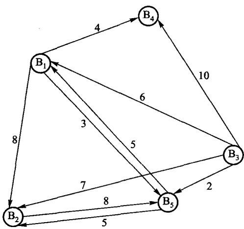
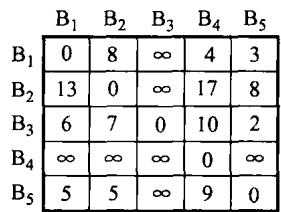
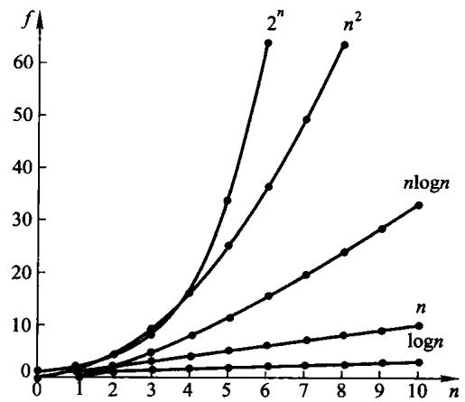

# 第1章 概论

**这门课到底在教什么**

- 数据结构：数据怎么组织
- 算法：怎么在这个组织上算
- 算法分析：凭什么说一个比另一个好

先用一个真问题把三者串起来。

<!-- 备注
第 1 章最容易讲空。办法是：不要先讲定义，先给一个学生会做但做不好的问题，
让他们自己撞上「组织方式决定了能不能算」这件事，再回头补定义。
-->

---

# 1.1 一个真问题：股市的传言

某交易所有若干经纪人，**消息只在认识的人之间传**，每传一步花的时间不同。

要回答的是：

- 从谁开始放风，能让**所有人**最快知道？
- 那个「最快」到底是多少？



---

# 先把问题抽象掉

| 现实 | 抽象成 |
| --- | --- |
| 经纪人 | 顶点 |
| 「A 认识 B」 | 边 |
| 传一步花的时间 | 边上的权 |
| 从 s 放风到所有人知道 | s 到**最远**那个顶点的最短路 |

**最后一行是全题的关键**：要的不是平均，是**最慢的那一项**——
消息传完的时刻由最后一个知道的人决定。

<!-- 备注
这一步是「问题求解」的核心动作：把应用语言翻译成结构语言。
学生最容易在最后一行出错，直接去求平均或者求总和。
可以问一句：如果取平均，会发生什么？（会挑出一个「对多数人快、对个别人极慢」的起点。）
-->

---

# 用什么存这张图

相邻矩阵：`m[i][j]` 是 i 到 j 一步的时间，不通就是「无穷大」。



- 存储量 $V^2$，跟边多少无关
- 问「i 和 j 之间有没有边」是 O(1)

第 7 章会讲另一种存法（邻接表），以及**为什么没有哪种总是更好**。

---

# 算法：Floyd

对每一对 (i, j)，问「允许经过前 k 个顶点中转时，最短是多少」：

```text
d[k][i][j] = min( d[k-1][i][j] ,  d[k-1][i][k] + d[k-1][k][j] )
                  不经过 k          经过 k
```

k 从 0 数到 V-1，答案就是 d[V-1]。代价 $O(V^3)$，**与边数无关**。

<!-- 备注
最经典的错法：把 k 的循环放到里层。
k 的含义是「只允许经过前 k 个顶点中转」，它必须是**最外层**——
放到里层，递推式就不成立了，而且往往还能跑出「看起来差不多」的结果。
这是本章最值得当场演示的一处。
-->

---

# 实现：两件事在一个函数里

```cpp file=code/ch01/adt/modern.hpp#fn:best_source
[[nodiscard]] std::optional<std::size_t> best_source() const {
    auto shortest = distance_;
    for (std::size_t via = 0; via < shortest.size(); ++via) {
        for (std::size_t from = 0; from < shortest.size(); ++from) {
            for (std::size_t to = 0; to < shortest.size(); ++to) {
                if (shortest[from][via] != infinity &&
                    shortest[via][to] != infinity &&
                    shortest[from][to] > shortest[from][via] + shortest[via][to]) {
                    shortest[from][to] = shortest[from][via] + shortest[via][to];
                }
            }
        }
    }

    std::optional<std::size_t> result;
    int smallest_eccentricity = infinity;
    for (std::size_t from = 0; from < shortest.size(); ++from) {
        int largest_distance = 0;
        for (int distance : shortest[from]) {
            largest_distance = distance > largest_distance ? distance : largest_distance;
        }
        if (largest_distance < smallest_eccentricity) {
            smallest_eccentricity = largest_distance;
            result = from;
        }
    }
    return result;
}
```

先跑 Floyd，再对每个起点取**这一行的最大值**，最后在所有起点里取最小。

<!-- 备注
三处值得说：
1. k（这里叫 via）在最外层；
2. infinity 取的是 INT_MAX/4 而不是 INT_MAX——两个 infinity 相加会溢出，
   而溢出是未定义行为；
3. 返回 optional：图不连通时**没有**这样的起点，那不是错误，是可预期状态。
-->
---

# 1.2 数据结构：三个层次

| 层次 | 回答什么 | 例子 |
| --- | --- | --- |
| **逻辑结构** | 元素之间有什么关系 | 线性、树形、图 |
| **存储结构** | 关系怎么落到内存里 | 顺序、链接、索引、散列 |
| **运算** | 能对它做什么 | 插入、删除、检索 |

**同一个逻辑结构可以有多种存储结构**——线性表既能顺序存（顺序表），
也能链接存（链表），这就是第 2 章的全部内容。

---

# 逻辑结构的三分

- **线性**：每个结点至多一个前驱、至多一个后继
- **树形**：至多一个前驱，可以有多个后继
- **图**：前驱后继都可以有多个

两条分界线：

- 树和图的分界：**每个结点是否至多一个直接前驱**
- 线和树的分界：**每个结点是否至多一个直接后继**

<!-- 备注
后面每一章都落在这三类里，可以先把全书地图画出来：
第 2-4 章线性，第 5-6 章树形，第 7 章图，第 8-12 章是在这些结构上做算法。
-->

---

# 四种存储方法

| 方法 | 怎么表示「相邻」 | 代价 |
| --- | --- | --- |
| **顺序** | 地址相邻 | 按下标 O(1)；插删要搬 |
| **链接** | 指针相指 | 插删只改指针；按位置要走 |
| **索引** | 另造一张表，存地址 | 多一份空间；换来快速定位 |
| **散列** | 由关键码**算**出地址 | 期望 O(1)；不保序，会冲突 |

<!-- 备注
索引和散列在第 10、11 章才展开，这里只要学生记住「有四种」。
特别提醒：索引表的空间是**附加**在数据之外的。
-->

---

# 索引：逻辑有序，物理无序

```text
存储区的数据 -- 物理无序, 而且每块长度不等
+----------------+----------+------------+--------------+--------+
| [1] 73         | [2] 52   | [3] 42     | [4] 98       | [5] 37 |
+----------------+----------+------------+--------------+--------+

线性索引 -- 附加在数据之外的一张小表
+------+------+------+------+------+
|  37  |  42  |  52  |  73  |  98  |   关键码: 升序
+------+------+------+------+------+
| [5]  | [3]  | [2]  | [1]  | [4]  |   指向第几块: 乱序
+------+------+------+------+------+
```

**这两行的错位就是索引的全部意义**：上面能二分，下面一块没搬过。

<!-- 备注
找 52：索引里二分到第 3 列，读出 [2]，直接取第 2 块——只读一块。
再看每块的宽度：五块长度各不相同。正因为长度不等，
「第 k 块在哪」没法用「起始地址 + k × 块长」算出来，只能查表。
这就是原书说「索引函数并非数组那样的简单线性函数」的意思。
-->

---

# 1.2.3 抽象数据类型

**ADT = 一组运算 + 它们的约定**，不是一个类，更不是一个基类。

```text
ADT 名字 {
    数据对象 D: 结点是什么
    数据关系 R: 结点之间有什么关系
    基本操作 P: 对外提供哪些运算
}
```

用它的人只能通过这些运算访问数据，**不能去翻内部表示**——
所以换实现不用改调用方。

<!-- 备注
原书用一个「成员函数非纯虚、析构函数非 virtual」的空基类来表达抽象。
那样的基类给不了任何多态，反而埋下「通过基类指针删派生对象」的未定义行为。
在 C++ 里，模板本身就承担了这层抽象——本书各章都不设基类。
-->

---

# 1.4 算法分析：为什么要看增长趋势

程序跑多久跟机器、编译器、输入都有关。要比较**算法**而不是**这次运行**，
就只能看「输入变大时，代价怎么涨」。



<!-- 备注
强调一句：常数和低阶项不是不重要，是**不能用来区分算法**。
n 小的时候 O(n^2) 完全可能比 O(n log n) 快，这在第 8 章讲插入排序时会再遇到。
-->

---

# 大 O、Ω、Θ

| 记号 | 含义 | 日常说法 |
| --- | --- | --- |
| $O(f)$ | 增长**不快于** $f$ | 上界 |
| $\Omega(f)$ | 增长**不慢于** $f$ | 下界 |
| $\Theta(f)$ | 上下界都是 $f$ | 恰好这么快 |

平时说「这个算法是 $O(n\log n)$」，严格说往往应该是 $\Theta$。
**说 $O$ 永远不会错，只是可能说少了。**

<!-- 备注
可以举个反例：说「插入排序是 O(n^2)」对，说「插入排序是 Θ(n^2)」就错了——
输入已经有序时它是 Θ(n)。所以最好情况/最坏情况必须分开说。
-->

---

# 最好、最坏、平均

以**顺序检索**为例，表长 n：

| 情况 | 比较次数 |
| --- | --- |
| 最好 | 1（第一个就是） |
| 最坏 | n（不在表里） |
| 平均（等概率） | $\frac{1}{n}(1+2+\cdots+n) = \frac{n+1}{2}$ |

平均情况**依赖于输入的概率分布**——等概率只是一个假设，不是事实。

<!-- 备注
可以追问：如果查询集中在前几个元素（比如按热度排序），平均次数会小很多。
这就是「自组织线性表」的动机，第 10 章会提。
-->

---

# 1.4.3 时间与空间的折衷

- 存下来 → 省时间，费空间（查表、缓存、索引）
- 现算 → 省空间，费时间

**本书里这条折衷反复出现**：

| 章 | 折衷在哪 |
| --- | --- |
| 第 2 章 | 链表每个结点多一根指针，换来 O(1) 插删 |
| 第 6 章 | 双链表多一根 prev，换来 O(1) 删除已知结点 |
| 第 10 章 | 散列表用空闲槽位换期望 O(1) 检索 |
| 第 11 章 | 索引用附加空间换少读盘 |

---

# 本章小结

- 问题求解的第一步是**抽象**：把应用语言翻译成结构语言
- 数据结构分三层：**逻辑结构、存储结构、运算**
- 同一逻辑结构可以有多种存储；选哪种要看**在它上面做什么运算**
- ADT 是一组运算，不是一个基类
- 算法分析看**增长趋势**；最好/最坏/平均必须分开说
- 时间和空间是可以互换的，没有免费的午餐

---

# 上机

```bash
python3 tools/check_code.py code/ch01/adt
```

- 读 `code/ch01/adt/modern.hpp`，找出 `infinity` 为什么不取 `INT_MAX`
- 改一处：把 Floyd 的 `k` 循环挪到里层，看哪条断言变红

> 全书的判据都是一样的：**把实现改回错的写法，必须有一条断言会红。**
