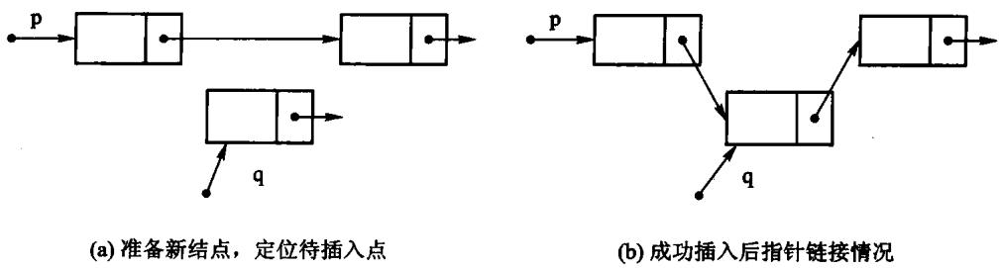
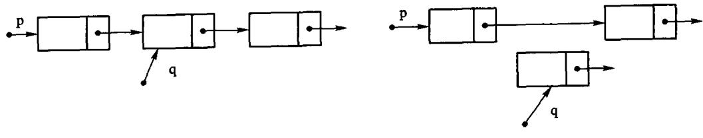
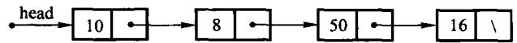
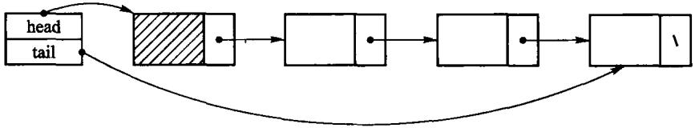
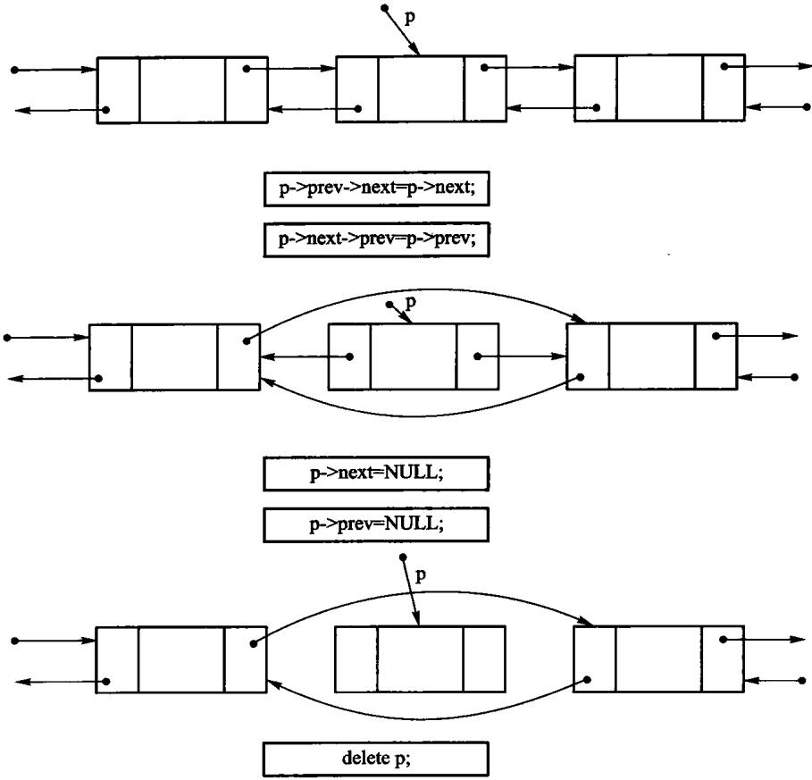

# 第2章 线性表

**一串同类型元素，排成唯一的先后次序**

- 顺序表：元素连续放在数组里
- 链表：用链接保存相邻关系

一条主线：**同一个逻辑结构，两种存储结构，代价完全不同**。

<!-- 备注
这一章是全书第一个「同一 ADT 两种实现」的例子，后面每一章都会重复这个模式。
让学生带着一个问题听：什么时候该用哪个？答案在 2.4 节，但过程比答案重要。
-->

---

# 2.1 线性表的抽象数据类型

| 运算 | 含义 | 顺序表 | 链表 |
| --- | --- | --- | --- |
| `at(i)` | 按下标取值 | **O(1)** | O(n) |
| `find(x)` | 按内容查位置 | O(n) | O(n) |
| `insert(i, x)` | 在位置 i 插入 | O(n) 搬元素 | O(n) 找前驱 |
| `remove(i)` | 删除位置 i | O(n) 搬元素 | O(n) 找前驱 |
| `append(x)` | 表尾追加 | 摊还 O(1) | O(1)（有尾指针） |

**两个 O(n) 不是同一回事**：一个在搬数据，一个在走指针。

<!-- 备注
这张表可以贴在黑板一角，整章都指着它讲。
最后一行的对比是本章的落点：顺序表和链表在「插入」上都是 O(n)，
但慢的原因完全不同，所以适用场合也不同。
-->

---

# 原书这里编译不过

原书用一个类模板 `List<T>` 写这组运算，那份清单有两处硬伤：

```text
bool delete(const int p);        <- delete 是 C++ 关键字, 不能作函数名
class List { void clear(); ... } <- 通篇没有 public:
```

第二条尤其值得停一下：`class` 的默认访问权限是 private，
于是这个**抽象数据类型的每一个运算都调不到**。

**一个所有运算都私有的 ADT，语法上成立，语义上是空的。**

<!-- 备注
本书把这组运算直接定义在 ArrayList<T> 上，不另设基类——
理由和第 3 章一样：空基类给不了多态，却会带来非虚析构的未定义行为。
-->

---

# 2.2 顺序表：地址公式

元素连续存放，每个占 L 个单元，首地址 b：

$$\mathrm{loc}(k_i) = b + i \times L$$

**只要知道基地址，任一元素的地址都能直接算出来**——
所以按下标取值是 O(1)。这就是「随机存取」。

物理相邻表示了逻辑相邻。

---

# 教学版：三个成员

```text
T* data_;             指向底层数组
size_type capacity_;  数组能放多少个
size_type size_;      现在放了几个
```

整份实现在 `code/ch02/array_list/teaching.hpp`——一个文件、一个类。

后面几页把它拆开逐段看。

---

# 按下标取值与改值

```cpp file=code/ch02/array_list/teaching.hpp#fn:at
// 按下标读取，O(1)——这是顺序表相对链表的看家本领。
// 下标非法是**调用方的错误**，不是可预期状态，所以抛异常而不是返回 optional。
const T& at(size_type index) const {
    if (index >= size_) {
        throw std::out_of_range("ArrayList::at: 下标越界");
    }
    return data_[index];
}

T& at(size_type index) {
    if (index >= size_) {
        throw std::out_of_range("ArrayList::at: 下标越界");
    }
    return data_[index];
}
```

先查下标合不合法，然后直接 `data_[index]`，**没有循环**。

越界抛 `std::out_of_range`——原书是打印一行再返回 false。

<!-- 备注
为什么越界是「抛异常」而不是「返回 optional」？
因为它不是可预期状态：调用方给了一个不存在的位置，那是调用方的 bug。
可预期的「没有」（比如 find 找不到）才用 optional。这条口径全书统一。
-->

---

# 按内容查找：「没找到」怎么说

原书的签名是：

```text
bool getPos(int& p, const T value);
```

一次调用带回两件事：找没找到（返回值）、在第几位（出参 p）。

```text
int p;
list.getPos(p, 20);     // 忘了看返回值
use(p);                 // 用的是一个从没被写过的 p
```

**程序不崩，只是默默按错误的下标继续跑。**

---

# 现代写法：把两件事合成一个

```cpp file=code/ch02/array_list/teaching.hpp#fn:find
// 按内容查找，O(n)。找到返回下标，没找到返回空 optional。
// 原书【算法2.3】用 `bool getPos(int& p, const T value)`：忘了看返回值，
// 就会读到一个从没被写过的 p。这里「找没找到」是返回值类型的一部分。
std::optional<size_type> find(const T& value) const {
    for (size_type i = 0; i < size_; ++i) {
        if (data_[i] == value) {
            return i;
        }
    }
    return std::nullopt;
}
```

`std::optional<size_type>` 是一个「可能装着下标的盒子」：
找到了盒子里是下标，没找到盒子是空的。

**取值必须先开盒**，而开盒这一步绕不过去。

<!-- 备注
对空盒子直接 * 取值是未定义行为，用 .value() 取会抛 bad_optional_access。
两条路都不会像 int p 那样悄悄给你一个看似正常的垃圾值。

一句话：原来靠调用方自觉，现在靠类型系统。
-->

---

# 插入：搬 O(n) 个元素



```cpp file=code/ch02/array_list/teaching.hpp#fn:insert
// 在位置 pos 插入，pos 可以等于 size()（追加到表尾）。
// 代价 O(n)：pos 之后的元素都要右移一位。这正是顺序表与链表要对比的地方。
void insert(size_type pos, const T& value) {
    if (pos > size_) {
        throw std::out_of_range("ArrayList::insert: 插入位置非法");
    }
    if (size_ == capacity_) {
        grow();
    }
    for (size_type i = size_; i > pos; --i) {
        data_[i] = data_[i - 1];   // 从后往前搬，否则会自己覆盖自己
    }
    data_[pos] = value;
    ++size_;
}
```

<!-- 备注
循环**倒着走**是考点：若改成从 pos 起递增地 data_[i+1] = data_[i]，
第一次搬完就把 data_[pos+1] 覆盖掉了，后面搬的全是同一个值。
现场改一下演示，效果很好。
-->

---

# 扩容：翻倍，不是加一

```cpp file=code/ch02/array_list/teaching.hpp#fn:grow
// 扩容：申请两倍大的新数组，搬过去，再释放旧的。
// 翻倍而不是加一，才能让 append 的摊还代价保持 O(1)。
void grow() {
    size_type next = (capacity_ == 0) ? 1 : capacity_ * 2;
    T* fresh = new T[next];
    for (size_type i = 0; i < size_; ++i) {
        fresh[i] = data_[i];
    }
    delete[] data_;       // 先搬完再释放旧的，顺序反了就会读到已释放的内存
    data_ = fresh;
    capacity_ = next;
}
```

- 加一：追加 n 个元素总共搬 $O(n^2)$ 次
- 翻倍：总搬运次数 $< 2n$，平摊到每次是**常数**

`delete[]` 必须在搬完之后——顺序反了就是读已释放的内存。

---

# 删除：插入的镜像



```cpp file=code/ch02/array_list/teaching.hpp#fn:remove
// 删除 pos 上的元素并返回它。代价同样是 O(n)：后面的元素都要左移一位。
T remove(size_type pos) {
    if (pos >= size_) {
        throw std::out_of_range("ArrayList::remove: 下标越界");
    }
    T removed = data_[pos];
    for (size_type i = pos; i + 1 < size_; ++i) {
        data_[i] = data_[i + 1];
    }
    --size_;
    return removed;
}
```

<!-- 备注
这次循环**正着走**。另外它多做一件事：把被删的元素返回给调用方。
原书的 delete 返回 bool，被删的值就此丢失，调用方得先 getValue 再 delete 两步走。
-->

---

# 三法则：原书最硬的一处错

原书 `arrList` 有析构函数，**却没有拷贝构造与拷贝赋值**。

一句 `arrList<int> b = a;` 之后，两个对象持有**同一根指针**，
各析构一次 → 同一块内存被释放两次。

```cpp file=code/ch02/array_list/teaching.hpp#fn:ArrayList
explicit ArrayList(size_type initial_capacity = 8)
    : data_(new T[initial_capacity]), capacity_(initial_capacity), size_(0) {}

// 三法则：自己管着 new 出来的数组，就得自己写拷贝构造和拷贝赋值。
// 不写的话编译器会照抄指针，两个表指向同一块内存，各析构一次 → 二次释放。
ArrayList(const ArrayList& other)
    : data_(new T[other.capacity_]), capacity_(other.capacity_), size_(other.size_) {
    for (size_type i = 0; i < size_; ++i) {
        data_[i] = other.data_[i];
    }
}
```

<!-- 备注
-Wall -Wextra -Wpedantic 一句警告都不给，小数据量下往往也不当场崩。
第 3 章有这个 bug 的 ASan 报告，可以翻回去看。

三法则：写了析构、拷贝构造、拷贝赋值中的任意一个，通常这三个都得写。
理由：你之所以要写析构，是因为你在管资源；既然在管资源，
编译器那份「逐成员照抄」的拷贝就一定是错的。
-->

---

# 一个被删掉的设计：游标

原书的 `arrList` 里还有第四个成员 `int position`，配 `setPos / next / prev`
用来「依次处理元素」。

**遍历状态一旦住进容器，三件事同时坏掉**：

- `const` 对象没法遍历（游标要改）
- 两处代码不能同时遍历
- 嵌套遍历直接互相踩

本书删掉它，改为提供 `begin() / end()`——`range-for` 因此可以直接用。

<!-- 备注
顺带一提：原书那个 position，在书中展示的所有算法里一次都没被用到。
-->

---

# 2.3 链表：换一种存储



- 结点可以**散落**在内存里，靠链接域表示「谁在谁后面」
- 给定前驱结点后，插入或删除只改**常数条**指针
- 代价：要找到那个前驱，仍须从表头循链，**O(n)**

---

# 头结点：让表头不再是特例



**头结点是一个不存放数据的哨兵**，永远排在第一个真元素前面。

有了它，「在表头插入」和「在中间插入」变成同一句话：
**找到前驱，改它的 next**。空表也不必另写一套分支。

<!-- 备注
这就是原书 setPos(-1) 那个技巧的实质。现代接口不暴露 -1 这个特殊位置，
predecessor_at(0) 直接返回头结点。
可以让学生自己写一遍不带头结点的插入，感受一下多出来的那个 if。
-->

---

# 尾指针：让 append 变成 O(1)

```cpp file=code/ch02/linked_list/teaching.hpp#fn:append
// 在表尾追加。**因为存了 tail_，这里是 O(1)**；没有它就得每次从头走到尾。
void append(const T& value) {
    Node* fresh = new Node;
    fresh->value = value;
    fresh->next = nullptr;
    tail_->next = fresh;
    tail_ = fresh;
    ++size_;
}
```

**没有它，每次追加都得从头走到尾。**

`append` 单列一个函数而不是转调 `insert(size_)`，正是因为有它——
转调就白白退化成 O(n) 了。

---

# 循链定位：返回「前驱」

```cpp file=code/ch02/linked_list/teaching.hpp#fn:predecessor_at
// 返回位置 pos 的前驱结点。pos == 0 时前驱就是头结点——
// 这正是头结点存在的意义：表头不再是特例。
Node* predecessor_at(size_type pos) const {
    if (pos > size_) {
        throw std::out_of_range("LinkedList: 下标越界");
    }
    Node* predecessor = head_;
    for (size_type i = 0; i < pos; ++i) {
        predecessor = predecessor->next;
    }
    return predecessor;
}
```

**为什么返回前驱而不是结点本身？** 因为插入和删除都要改前驱的 `next`，
而单链表从一个结点走不回它的前一个。

一个函数同时服务两处——这是头结点带来的简化。

---

# 删除：两件事不能漏

```cpp file=code/ch02/linked_list/teaching.hpp#fn:remove
// 删除位置 pos 上的元素并返回它。同样是「先定位前驱，再改一条链接」。
T remove(size_type pos) {
    if (pos >= size_) {
        throw std::out_of_range("LinkedList::remove: 下标越界");
    }
    Node* predecessor = predecessor_at(pos);
    Node* dying = predecessor->next;
    T value = dying->value;
    predecessor->next = dying->next;
    if (dying == tail_) {         // 删的是最后一个，尾指针退回前驱
        tail_ = predecessor;
    }
    delete dying;
    --size_;
    return value;
}
```

1. **被删结点必须 `delete`**，只摘链不释放就是内存泄漏
2. **删的若是尾结点，`tail_` 必须回退**——不回退，下一次 `append`
   就写进已释放的内存

<!-- 备注
第 2 条是教学版测试里专门守着的：用「删到空表再 append」把它钉死，
去掉那两行 AddressSanitizer 立刻报 heap-use-after-free。
现场演示效果好，因为不删那两行的话普通用例全绿。
-->

---

# 2.3.2 双链表：多一根指针买什么


多出来的 `prev`（64 位机上 8 字节）只买到一件事，但很值：

**已知一个结点时，删除它是 O(1)。**

单链表要做同一件事，得先从头走到它的前驱——O(n)，
因为单链表从一个结点走不回前一个。

---

# 双链表的删除：两侧都要改



```cpp file=code/ch02/doubly_linked_list/teaching.hpp#fn:erase_node
// 摘掉一个已知的结点，O(1)。**这是双链表的看家本领**：
// 单链表要做同一件事，得先从头走到它的前驱，O(n)。
T erase_node(Node* node) {
    T value = node->value;
    if (node->prev != nullptr) {
        node->prev->next = node->next;
    } else {
        head_ = node->next;     // 删的是表头
    }
    if (node->next != nullptr) {
        node->next->prev = node->prev;
    } else {
        tail_ = node->prev;     // 删的是表尾
    }
    delete node;
    --size_;
    return value;
}
```

<!-- 备注
少改一根，表在**正向**遍历时看起来完全正常，只有反着走或者删中间结点时才炸。
教学版的测试因此正着走一遍、倒着走一遍，断言两个结果互为逆序。
-->

---

# 所有权工具怎么选（2.3.1）

「为什么不全用 `unique_ptr`？」——判据是**结构形态**，不是偏好。

| 形态 | 用什么 | 理由 |
| --- | --- | --- |
| 链 | 裸指针 + 迭代释放 | `unique_ptr` 的析构是**递归**的，深度正比于链长 |
| 树 | `unique_ptr` | 也递归，但深度 $O(\log n)$ |
| 一整块缓冲区 | 裸 `T*` + 三法则 | 换 `unique_ptr<T[]>` 只省一句 `delete[]` |
| 共享 | 手写引用计数 | `unique_ptr` 语义上不成立 |

---

# 「链那一行」有实测支撑

本机 8 MB 栈，`RecursiveChain`（`unique_ptr<Node> next`）：

| 构建档 | 最大安全结点数 | 崩溃于 |
| --- | --- | --- |
| `-O0 -g` | ≈ 57,625 | 58,601 |
| `-O2` | ≈ 523,329 | 524,306 |

同规模下**迭代释放**的版本在 `-O0` 跑到 500 万结点无恙。

**两档差九倍**是最关键的一点：debug 崩、release 过。

<!-- 备注
递归深度的安全边界由优化级别决定——这种不确定性不该出现在教材实现里。
所以本书所有链式结构的析构一律写成迭代。
这不是审美判断，是上面这张表。
-->

---

# 2.3.3 循环链表

循环链表把尾结点的 `next` 接回首结点：

```text
空表: tail = nullptr
非空: first = tail->next
停止: 再次遇到起点，而不是遇到 nullptr
```

- 只保存 `tail`，取首结点和尾插都是 $O(1)$
- 删除首结点：让 `tail->next` 跳过旧首结点
- 删除最后一个结点：必须把 `tail` 清空

适合轮转调度等“最后一个之后回到第一个”的场景。

<!-- 备注
测试至少覆盖空表、单结点、多结点，并验证从任一结点出发恰好走一整圈。
-->

---

# 2.4 顺序表与链表的比较

| | 顺序表 | 链表 |
| --- | --- | --- |
| 按下标访问 | **O(1)** | O(n) |
| 已知前驱后插删 | O(n) 搬元素 | **O(1)** 改指针 |
| 每元素额外空间 | 无 | 一根指针 |
| 空间是否预分配 | 是（可能浪费/不够） | 否（用多少要多少） |
| 缓存局部性 | **好** | 差 |

**选哪个看运算**：随机访问多 → 顺序表；频繁在已知位置插删 → 链表。

<!-- 备注
补一句现实：现代机器上缓存局部性的影响常常压过渐进复杂度，
n 不大时 vector 往往比 list 快，哪怕理论上后者插删更优。
这也是「渐进分析不是全部」的一个好例子。
-->

---

---

# 课堂讲解卡：一次插入到底慢在哪里

顺序表插入慢在搬元素，链表插入慢在找位置。先问“位置已知吗”，再决定哪一种代价更重要。

```text
已知下标 i：顺序表搬 O(n-i)，链表仍要走 O(i)
已知结点指针：链表改链接 O(1)，顺序表无法避免搬移
```

---

# 课堂例题：扩容与摊还代价

容量按 1、2、4、8 翻倍时，追加 n 个元素最多搬 `1+2+4+...<2n` 个旧元素。
因此一次 append 的最坏情况是 O(n)，但连续 n 次 append 的总搬运量是 O(n)，摊还为 O(1)。

---

---

# 课堂例题答案：扩容搬运次数

容量为 1、2、4、8 时，扩容搬运量是 `1+2+4+...+2^r < 2n`。因此 n 次追加的总搬运量为 O(n)，摊还到每次 append 是 O(1)。

---

# 课末自检

- 插入循环为什么必须从后向前？
- `find` 找不到时为什么返回空 optional？
- 链表删除时是否同时维护了前驱、后继和头尾指针？
- 什么时候应优先选择连续数组而不是链表？

---

---

# 课末自检参考答案

- 从后向前搬，避免尚未复制的元素被覆盖。
- 空 optional 表示“没有找到”，比未初始化出参安全。
- 删除要同时维护前驱、后继以及头尾指针。
- 随机访问和缓存局部性重要时优先连续数组；已知结点位置且插删多时链表更合适。

---

---

# 板书演算：顺序表插入

表 `[10,20,30,40]` 在位置 2 插入 25：先把 40 移到 4，再把 30 移到 3，最后写入 25，结果 `[10,20,25,30,40]`。

---

# 反例：从前向后搬

若从位置 2 向后搬，先把 30 写到 3，再把位置 3 的 30 写到 4，原来的 40 已丢失。

---

# 课堂练习与答案

课堂练习：容量 4 的表追加第 5 个元素，列出扩容前后 data、size、capacity。答案：申请容量 8，复制 4 个旧元素，写入新元素后 size=5、capacity=8。

---

# 本章小结

- 同一个线性表 ADT，两种存储结构，**代价互补**
- 顺序表：地址公式 → O(1) 随机存取；插删要搬
- 链表：链接域 → O(1) 改指针；定位要走
- **头结点**消掉表头特例，**尾指针**让 append 变 O(1)
- 自己管资源就要守**三法则**——原书这一章又漏了一次
- 遍历状态不要住进容器（`begin()/end()` 而不是内部游标）
- 智能指针的判据是**结构形态**，链上用递归析构会爆栈

---

# 上机

```bash
python3 tools/check_code.py code/ch02/array_list
python3 tools/check_code.py code/ch02/linked_list
```

故意改坏一处，看哪条断言变红：

- 把 `insert` 的搬移循环改成正着走
- 把 `grow` 的 `delete[]` 挪到拷贝循环之前
- 删掉 `remove` 里回退 `tail_` 的那两行

> **写不出「会红」的用例，说明还没想清楚那条性质是什么。**
