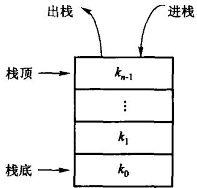
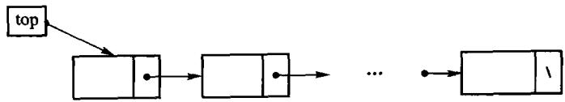
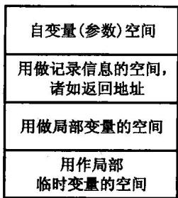
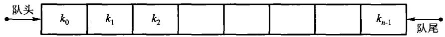
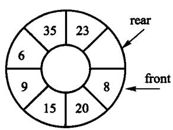

# 第3章 栈与队列

**限制存取点的线性表**

- 栈：只在一端进出，后进先出（LIFO）
- 队列：一端进、另一端出，先进先出（FIFO）

本章代码全部来自 `code/ch03/`，真编译、真跑过。

<!-- 备注
开场先问一句：为什么要专门讲这两种结构？它们的操作比线性表**更少**。
答案是——正因为限制了存取点，实现可以更快、更简单，而且这个限制恰好匹配
一大类问题（递归、括号匹配、表达式求值、BFS）。
-->

---

# 这一章讲什么

- **3.1 栈**：ADT、顺序栈、链式栈
- **3.1.4 表达式求值**：后缀求值 + 中缀转后缀
- **3.1.5 栈与递归**：运行栈、递归改循环
- **3.2 队列**：循环队列、链式队列
- **3.3 比较**：什么时候用哪个

一条暗线：**原书这一章的代码，有两处按印刷原样根本编译不过。**

<!-- 备注
那两处会在讲到顺序栈时当场演示。这是本章最有价值的教学时刻之一——
让学生看到「书上印的」和「能跑的」是两回事。
-->

---

# 3.1 栈

栈(stack)是**限定仅在一端进行插入和删除**的线性表。

- 那一端叫**栈顶**(top)，另一端叫**栈底**(bottom)
- 元素按**后进先出**(LIFO, last in first out)访问



---

# 栈的抽象数据类型

| 运算 | 含义 | 时间代价 |
| --- | --- | --- |
| `push(x)` | 把 x 压到栈顶 | 摊还 O(1) |
| `pop()` | 弹出栈顶并带回来；空栈返回「没有」 | O(1) |
| `top()` | 只看栈顶，不弹出；空栈返回「没有」 | O(1) |
| `empty()` / `size()` | 判空、长度 | O(1) |

**「空栈返回『没有』」这四个字，C++17 里有精确的表达方式**——待会儿见分晓。

<!-- 备注
先不说 optional，让学生自己想「没有」怎么表达。
常见答案：返回 -1、返回 bool + 出参、抛异常。
这三个都有问题，下面逐个拆。
-->

---

# 先问一个问题

入栈顺序是 1, 2, 3, 4，**出栈顺序可以有哪些？**

- `1 2 3 4` 可以吗？
- `4 3 2 1` 可以吗？
- `3 1 4 2` 可以吗？

<!-- 备注
让学生举手。答案：前两个可以，第三个不行——3 先出说明 1、2 还在栈里且 2 在 1 上面，
那么 1 不可能在 2 之前出来。
可行的出栈序列个数是 Catalan 数 C(n) = (2n)! / (n!(n+1)!)，n=4 时是 14。
这是第 5 章还要再遇到的数——二叉树形态数也是它。
-->

---

# 3.1.2 顺序栈：存储结构

用一块**连续数组**存元素。哪一端当栈顶？

- 下标 0 当栈顶 → 每次 push/pop 都要搬动全部元素，**O(n)**
- **表尾当栈顶** → 只动最后一个位置，**O(1)**

```text
下标     0     1     2     3     4     …
内容    [A]   [B]   [C]    ?     ?     …
               ▲
            size_ = 3   （栈顶是 C，下一个 push 写到 3）
```

`size_` 既是元素个数，也是下一个空位的下标——**一个变量干两件事**。

---

# 教学版：三个成员

```text
T* data_;             指向底层数组
size_type capacity_;  数组能放多少个
size_type size_;      现在放了几个（同时也是下一个空位的下标）
```

整份实现在 `code/ch03/array_stack/teaching.hpp`——**一个文件、一个类，
抄下来就能编译**。下面几页把它拆开逐段看。

<!-- 备注
先让学生看清楚只有三个成员。很多人以为栈很复杂，其实就这三样。
构造函数里的初值 8 给多少都不影响正确性——因为满了会自动翻倍。
-->

---

# 入栈：满了就翻倍

```cpp file=code/ch03/array_stack/teaching.hpp#fn:push
// 入栈。满了就翻倍，所以不会有「栈满溢出」这回事。
void push(const T& value) {
    if (size_ == capacity_) {
        grow();
    }
    data_[size_] = value;
    ++size_;
}
```

```cpp file=code/ch03/array_stack/teaching.hpp#fn:grow
// 扩容：申请一块两倍大的，把老元素搬过去，再把老的还回去。
// 每个元素在均摊意义下只被搬运常数次，所以 push 的摊还代价仍是 O(1)。
void grow() {
    size_type next = (capacity_ == 0) ? 1 : capacity_ * 2;
    T* fresh = new T[next];
    for (size_type i = 0; i < size_; ++i) {
        fresh[i] = data_[i];
    }
    delete[] data_;       // 先搬完再释放旧的，顺序反了就会读到已释放的内存
    data_ = fresh;
    capacity_ = next;
}
```

<!-- 备注
grow 里那三行的顺序是考点：先申请新的、再搬、最后才 delete 旧的。
反过来写就是读已经还回去的内存。现场可以演示：把 delete 挪到循环前面，
ASan 立刻报 heap-use-after-free。
-->

---

# 为什么是「翻倍」而不是「加一」

- 加一：push n 个元素总共搬 $1+2+\cdots+n = O(n^2)$ 次
- 翻倍：总搬运次数 $1+2+4+\cdots+n < 2n$

平摊到每次 push 就是**常数**——这就是**摊还 O(1)**。

> 摊还的意思：单次操作偶尔很贵（那一次要搬走全部 n 个），
> 但两次扩容之间至少发生了 n 次 push，分摊下去每次仍然便宜。
> 注意它说的是**平均**，不是保证——那一次搬迁真的会卡住。

<!-- 备注
对延迟敏感的场合（实时系统）要单独考虑这一点。
这是「摊还」和「最坏情况」的区别，第 8 章讲排序时还会用到。
-->

---

# 出栈：空栈怎么办

```cpp file=code/ch03/array_stack/teaching.hpp#fn:pop
// 出栈并把元素带回来。空栈返回空的 optional，不是错误，也不打印任何东西。
std::optional<T> pop() {
    if (empty()) {
        return std::nullopt;
    }
    --size_;
    return data_[size_];
}
```

原书写的是 `bool pop(T & item)`——用**出参**带值、用**返回值**带成败。

**问题**：调用方忘了检查返回值，读到的就是那个从没被修改过的 `item`。
程序不崩，只是默默按错误数据继续跑。

<!-- 备注
这类 bug 极难查，因为出错的地方和崩溃的地方隔得很远。
std::optional 把「有没有值」搬进了类型：取值之前必须先判断。
-->

---

# 原书这里编译不过

原书【代码3.2】的顺序栈，三个成员是 `int mSize`、`int top`、`T* st`。

```text
legacy.cpp:65:5: error: ‘bool arrStack<T>::top(T&)’
    conflicts with a previous declaration
```

**`int top` 与成员函数 `bool top(T&)` 重名。** 整个类按印刷原样进不了编译器。

同一本书第 3.1.3 节的链式栈**犯了同一个错**。

<!-- 备注
这是本章第一个「书上印的 ≠ 能跑的」时刻。
强调：命名规则不是洁癖——数据成员和成员函数重名，语言直接拒绝。
本书的做法：栈顶位置叫 size_，top() 留给成员函数。
-->

---

# 更安静的一个错：三法则

原书 `arrStack` 有析构函数，**却没有拷贝构造**。

```console
$ cat drv2.cpp
int main(){ arrStack<int> a(4); a.push(7); arrStack<int> b = a; }
$ g++ -std=c++17 -fsanitize=address -g drv2.cpp -o drv2 && ./drv2
==2331703==ERROR: AddressSanitizer: attempting double-free
    #0 operator delete[](void*)
    #1 arrStack<int>::~arrStack()
```

`-Wall -Wextra -Wpedantic` **一句警告都不给**。

<!-- 备注
现场跑一遍这个例子，效果最好。
两个对象持有同一根指针，各析构一次 → 同一块内存释放两次。
小数据量下往往还不当场崩，所以它能一路活到生产环境。
-->

---

# 三法则（Rule of Three）

一个类只要自己写了**析构、拷贝构造、拷贝赋值**中的任意一个，
通常这三个都得写。

```cpp file=code/ch03/array_stack/teaching.hpp#fn:ArrayStack
// 构造：先要一小块数组。容量不够时会自动翻倍，所以初值给多少都不影响正确性。
explicit ArrayStack(size_type initial_capacity = 8)
    : data_(new T[initial_capacity]), capacity_(initial_capacity), size_(0) {}

// 拷贝构造：**必须自己写**。
// 不写的话编译器生成的版本会把 data_ 这根指针照抄一份，于是两个栈指向同一块
// 内存，各析构一次 —— 同一块内存被释放两次。原书 arrStack 正是漏了这个。
ArrayStack(const ArrayStack& other)
    : data_(new T[other.capacity_]), capacity_(other.capacity_), size_(other.size_) {
    for (size_type i = 0; i < size_; ++i) {
        data_[i] = other.data_[i];
    }
}
```

<!-- 备注
上面这两个函数是一起取出来的：构造函数申请内存，拷贝构造就必须自己写。
理由很直白：你之所以要写析构函数，是因为你在管资源；
既然在管资源，编译器那份「逐成员照抄」的拷贝就一定是错的。

工程版还会补移动构造和移动赋值，那叫五法则——它们不修正确性，只修性能。
初学阶段守住三法则就够了：在分配和 T 的拷贝都不抛异常的前提下它是对的。
（T 的拷贝真抛出时，扩容中的新缓冲区会漏——那是进阶节讲的强异常保证。）
-->

---

# 3.1.3 链式栈

结点分散在堆上，压栈只是**接一个新结点**。



**没有「栈满」这回事**——这是它与顺序栈最大的差别。

---

# 链式栈的入栈与出栈

```cpp file=code/ch03/linked_stack/teaching.hpp#fn:push
// 入栈：造一个新结点，让它指向原来的栈顶，再让栈顶指向它。
// **没有「栈满」这回事**——这正是链式栈相对顺序栈最大的差别。
void push(const T& value) {
    Node* fresh = new Node;
    fresh->value = value;
    fresh->next = top_;
    top_ = fresh;
    ++size_;
}
```

```cpp file=code/ch03/linked_stack/teaching.hpp#fn:pop
// 出栈：把栈顶结点摘下来，取走它的值，再释放它。空栈返回空 optional。
std::optional<T> pop() {
    if (empty()) {
        return std::nullopt;
    }
    Node* dying = top_;
    T value = dying->value;
    top_ = dying->next;
    delete dying;
    --size_;
    return value;
}
```

<!-- 备注
push 三步：造新结点、让它指向原栈顶、栈顶指向它。顺序不能乱。
pop 四步：摘下栈顶、取值、栈顶后移、释放结点。
注意释放必须在取值之后。
-->

---

# 顺序栈 vs 链式栈

| | 顺序栈 | 链式栈 |
| --- | --- | --- |
| 存储 | 一块连续数组 | 分散结点 |
| 每个元素额外开销 | 无 | 一根指针（8 字节） |
| 栈满 | 需要扩容 | **不存在** |
| 缓存局部性 | 好 | 差 |
| 扩容时的抖动 | 有（那一次搬全部） | 无 |

**结论**：元素多且大小可预估 → 顺序栈；深度波动大或元素很大 → 链式栈。

<!-- 备注
不要给「哪个更好」的答案，给判据。
补一句：链式栈的 clear 必须用循环，不能用递归——十万级链长会把运行栈压穿。
本书的测试用 80 万结点守着这条。
-->

---

# 3.1.4 表达式求值

**后缀表达式**（逆波兰式）不需要括号，也不需要优先级：

- 遇操作数 → **压栈**
- 遇操作符 → **弹出两个**，算完再压回
- 读完时栈里剩下的唯一元素就是结果

```text
3 4 + 2 *     →   压 3、压 4、弹出算 3+4=7 压回、压 2、弹出算 7*2=14
```

<!-- 备注
现场手动走一遍 "3 4 + 2 *"。
让学生注意：先弹出的是**右**操作数。减法和除法顺序反了就错。
-->

---

# 手动走一遍 `3 4 + 2 *`

```text
读到    栈内容      动作
 3      [3]         压栈
 4      [3 4]       压栈
 +      [7]         弹出 4 和 3, 算 3+4=7, 压回
 2      [7 2]       压栈
 *      [14]        弹出 2 和 7, 算 7*2=14, 压回
读完    [14]        栈里唯一的元素就是结果
```

实现见 `code/ch03/expression_eval/modern.hpp`，正文 3.1.4 逐条讲。

<!-- 备注
现场让学生跟着念一遍。两个要点：
1. **先弹出的是右操作数**——减法和除法顺序反了就错，这是最常见的 bug；
2. 读完时栈里必须**恰好一个**元素。多了说明操作数多余，少了说明操作符多余，
   两种都要报错。原书是 cerr 打一行然后继续跑。
另外提一句原书那个更隐蔽的 bug：GetTwoOperands 在第二个操作数缺失时
已经把第一个弹掉了，返回 false 时栈已经被破坏。
-->

---

# 可人写的是中缀式

`23 + (34 * 45) / (5 + 6 + 7)`

中间隔着一步转换——**这才是栈最典型的应用**。
括号和优先级造成的「先算什么」，全靠一把栈记住。

| 遇到 | 做什么 |
| --- | --- |
| 操作数 | 直接输出 |
| `(` | 入栈 |
| `)` | 反复弹出并输出，直到遇到 `(`；`(` 弹掉但不输出 |
| 运算符 | 栈顶优先级**不低于**当前就反复弹出；然后当前入栈 |
| 扫描结束 | 栈里剩下的依次弹出输出 |

<!-- 备注
原书把规则讲全了，却把代码留成了练习（「有兴趣的读者可作为练习」）。
本书补上了——不补的话 3.1.4 只剩半个应用。
编译器把算术式变成机器指令，走的就是这条路。
-->

---

# 「不低于」三个字是承重的

如果写成「高于」，同优先级时就不先弹：

```text
1 - 2 - 3   →   转成  1 2 3 - -   →   求值 1-(2-3) = 2      ✗
                正确  1 2 - 3 -   →   求值 (1-2)-3 = -4     ✓
```

**左结合**是靠这一个符号保住的。测试里有一条专门算这个数。

<!-- 备注
把 `<` 写成 `<=` 它立刻变红——这就是「有牙的测试」该有的样子。
可以现场改一下演示。
-->

---

# 手动走一遍 `1 + 2 * 3`

```text
读到    输出         运算符栈    说明
 1      1            []
 +      1            [+]         栈空, 直接压
 2      1 2          [+]
 *      1 2          [+ *]       * 优先级高于 +, 不弹
 3      1 2 3        [+ *]
读完    1 2 3 * +    []          依次弹出
```

换成 `1 * 2 + 3` 再走一遍：读到 `+` 时栈顶是 `*`，**优先级不低于它，要先弹**。

实现见 `code/ch03/expression_eval/modern.hpp`，正文 3.1.4 有完整规则表。

<!-- 备注
两个例子对照着走，学生就能看出「弹不弹」这个判断是全部难点所在。
再补一句：负号和减号靠「上一个记号是什么」区分——
`-3 + 5` 开头那个是符号，`3 - 5` 里那个是运算符。
-->

---

# 3.1.5 栈与递归

**递归的实现本身就是一个栈。** 每次函数调用，运行栈上压入一条**活动记录**：



- 返回地址、参数、局部变量、返回值
- 函数返回时弹出这条记录

<!-- 备注
所以「递归会爆栈」不是玄学——运行栈是有限的（Linux 默认 8 MB）。
下一页有实测数字。
-->

---

# 运行栈有多大：三个档位，三种结果

同一份递归源码，Linux / gcc 13.3 / `ulimit -s` 默认 8 MB：

| 构建档 | 20 万层 | 50 万层 | 100 万层 |
| --- | --- | --- | --- |
| `-O0`（不优化） | 通过 | **段错误** | 段错误 |
| `-O1` + ASan/UBSan | 通过 | **stack-overflow** | stack-overflow |
| `-O2` | 通过 | 通过 | **通过** |

改成显式栈（数据压进 `ArrayStack`，也就是放到**堆**上）：
三档在 **1000 万层**都通过。

<!-- 备注
最反直觉的是 -O2 那一行：编译器把尾递归转成了循环，一次自调用都没有。
汇编确认过。
这意味着：**递归深度的安全边界由优化级别决定**——debug 崩、release 过。
这种不确定性不该出现在教材实现里，所以本书的容器析构一律写成迭代。
-->

---

# 3.2 队列

一端进、另一端出，**先进先出**(FIFO)。



- 插入端叫**队尾**(rear)，删除端叫**队头**(front)
- 空队列上取元素是**可预期状态**，返回空 `optional`

---

# 顺序队列：为什么要「循环」

队列两头都要动。若队头固定在下标 0，每次出队都要把后面全部前移，**O(n)**。

**让队头也往后走**——走到数组末尾就绕回下标 0，整块数组当成一个圈用。



<!-- 备注
绕回是靠取模实现的：rear_ = (rear_ + 1) % slots_。
漏了取模就是数组越界，ASan 当场报 heap-buffer-overflow。
-->

---

# 空和满怎么分

绕回之后有个麻烦：`front == rear` **既可能是空、也可能是满**。

原书的办法：**牺牲一个槽位**。

- 约定「rear 的下一格就是 front」时算满
- 于是 n+1 个槽位最多装 n 个元素，两种状态分得开

```cpp file=code/ch03/queue/teaching.hpp#fn:full
// 满的判据：rear 再往前走一格就撞上 front。那一格就是被牺牲掉的槽位。
bool full() const { return (rear_ + 1) % slots_ == front_; }
```

<!-- 备注
也可以另存一个 count 变量来区分，那样不浪费槽位但多一个要维护的状态。
原书选了前者，本书照办——教材的选择要和教材一致，学生才对得上。
-->

---

# 两种入队，放在一起看

上面是**顺序队列**（取模绕回、队满返回 false），下面是**链式队列**
（没有队满，靠队尾指针保持 O(1)）。

```cpp file=code/ch03/queue/teaching.hpp#fn:enqueue
// 入队。队满返回 false——顺序队列的容量是固定的，这是它与链式队列的核心差别。
bool enqueue(const T& value) {
    if (full()) {
        return false;
    }
    data_[rear_] = value;
    rear_ = (rear_ + 1) % slots_;    // 走到末尾就绕回 0，取模不能漏
    return true;
}

// 入队：新结点接到队尾。队列原来是空的话，它同时也是队头。
void enqueue(const T& value) {
    Node* fresh = new Node;
    fresh->value = value;
    fresh->next = nullptr;
    if (rear_ == nullptr) {
        front_ = rear_ = fresh;
    } else {
        rear_->next = fresh;
        rear_ = fresh;
    }
    ++size_;
}
```

没有队尾指针的话，每次入队都得从队头走到尾，**O(n)**。

<!-- 备注
两段并排看效果最好：同一个 FIFO 语义，存储换了，代码形状完全不同。
顺序队列那段的关键是 `% slots_`；链式那段的关键是 rear_ 的两个分支。
-->

---

# 两种出队 + 一处容易漏的地方

```cpp file=code/ch03/queue/teaching.hpp#fn:dequeue
// 出队。空队列返回空 optional，不是错误，也不打印任何东西。
std::optional<T> dequeue() {
    if (empty()) {
        return std::nullopt;
    }
    T value = data_[front_];
    front_ = (front_ + 1) % slots_;
    return value;
}

// 出队：摘下队头结点。摘完若队列空了，队尾指针也必须置空，
// 否则它就成了一根指向已释放内存的野指针。
std::optional<T> dequeue() {
    if (empty()) {
        return std::nullopt;
    }
    Node* dying = front_;
    T value = dying->value;
    front_ = dying->next;
    if (front_ == nullptr) {
        rear_ = nullptr;
    }
    delete dying;
    --size_;
    return value;
}
```

**链式队列出队把队列摘空时，队尾指针必须一起置空**——
否则它就是一根指向已释放结点的野指针，下一次入队会写进已释放的内存。

<!-- 备注
去掉那两行，AddressSanitizer 立刻报 heap-use-after-free。
教学版的测试里有一条「出队到空再入队」专门守着它。
现场演示效果很好——因为不删那两行的话，普通用例全绿。
-->

---

# 3.3 栈与队列的比较

| | 栈 | 队列 |
| --- | --- | --- |
| 存取点 | 一端 | 两端 |
| 次序 | 后进先出 | 先进先出 |
| 典型用途 | 递归、括号匹配、表达式求值、DFS | 排队服务、BFS、缓冲区 |
| 顺序实现的坑 | 扩容 | 绕回 + 空满判据 |
| 链式实现的坑 | 深链递归析构 | 空掉时的队尾指针 |

**两者都是「限制存取点的线性表」**——限制换来的是 O(1) 的操作和更简单的实现。

---

# 本章小结

- **栈 = LIFO，队列 = FIFO**；限制存取点换来 O(1)
- 顺序实现要处理**扩容**（翻倍 → 摊还 O(1)）和**循环绕回**
- 链式实现没有容量上限，代价是每元素一根指针 + 缓存局部性
- 空状态用 `std::optional`，**不用** `bool` + 出参
- 自己管资源就要守**三法则**——原书这一章漏了两次
- 递归的背后就是运行栈；改显式栈 = 把数据从栈搬到堆

<!-- 备注
留一句话收尾：这一章的两个结构都很简单，难的是「边界」——
空、满、只剩一个、刚好摘空。本书的测试用例大半在这些地方。
-->

---

# 习题与上机

- **书面**：Catalan 数（出栈序列个数）、双栈模拟队列、中缀转后缀手工演算
- **上机**：`code/ch03/` 下每个单元都有 `teaching_test.cpp`，
  先跑通，再**故意改坏一处**，看哪条断言变红

```bash
python3 tools/check_code.py code/ch03/array_stack
```

> 判据：**把实现退回原书的写法，必须有一条断言会红。**
> 写不出这样的用例，说明还没想清楚那条性质是什么。

<!-- 备注
布置作业时强调最后这一句。学生最容易写出「顺手测一下」的用例——
那种用例在原书那份有 bug 的实现上同样全绿，等于没测。
-->

---

# 单调栈：把“还没找到答案”的位置留下

- 栈里放索引，不放值；从左到右扫描
- 当前值严格大于栈顶值：栈顶的下一个更大位置就是当前下标
- 等值不弹出，因此语义是“严格更大”
- 每个位置最多入栈、出栈一次：时间 `O(n)`，空间 `O(n)`

```cpp file=code/ch03/monotonic_stack/modern.hpp#next-greater
/// 对每个位置返回右侧第一个严格更大值的位置；不存在时返回 n。
inline std::vector<std::size_t> next_greater_indices(const std::vector<int>& values) {
    const std::size_t n = values.size();
    std::vector<std::size_t> answer(n, n);
    std::vector<std::size_t> stack;
    for (std::size_t i = 0; i < n; ++i) {
        while (!stack.empty() && values[stack.back()] < values[i]) {
            answer[stack.back()] = i;
            stack.pop_back();
        }
        stack.push_back(i);
    }
    return answer;
}
```

---

# 单调栈：直方图最大矩形

在末尾放一个虚拟高度 `0`，把所有未结算柱子弹出。柱子 `h` 弹出时：

- 右边界是当前下标，左边界是新的栈顶加一
- 宽度 = 右边界 - 左边界
- 面积 = `h × width`

```cpp file=code/ch03/monotonic_stack/modern.hpp#histogram
/// 直方图最大矩形面积；在末尾放一个 0，统一清空仍有候选边界的栈。
inline long long largest_rectangle_area(const std::vector<int>& heights) {
    for (int height : heights) {
        if (height < 0) throw std::invalid_argument("histogram height must be non-negative");
    }
    std::vector<std::size_t> stack;
    long long best = 0;
    for (std::size_t i = 0; i <= heights.size(); ++i) {
        const int current = i == heights.size() ? 0 : heights[i];
        while (!stack.empty() && heights[stack.back()] > current) {
            const std::size_t top = stack.back();
            stack.pop_back();
            const std::size_t left = stack.empty() ? 0 : stack.back() + 1;
            const long long width = static_cast<long long>(i - left);
            const long long area = static_cast<long long>(heights[top]) * width;
            if (area > best) best = area;
        }
        stack.push_back(i);
    }
    return best;
}
```

独立验证用枚举区间最小高度对拍，不用单调栈当自己的答案。
