# 第5章 二叉树

**每个结点最多两个孩子，而且分左右。**

- 周游：以什么顺序访问全部结点
- 二叉搜索树：加上「左小右大」
- 堆：把最小值放在根
- Huffman 树：不断合并两个最小权

一条主线：**递归的结构，用递归的算法**。

---

# 5.1 定义与五种基本形态

二叉树由结点的有限集合构成：**或者为空**，
或者由一个根结点和两棵**不相交**的左、右子树组成。

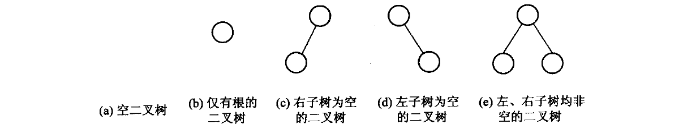

这是一个**递归定义**——后面几乎所有算法都直接照着它写。

<!-- 备注
强调「分左右」：只有一个孩子时，它是左孩子还是右孩子是**不同的树**。
这与第 6 章的一般树不同，那里孩子之间没有左右之分（只有次序）。
-->

---

# 满二叉树与完全二叉树

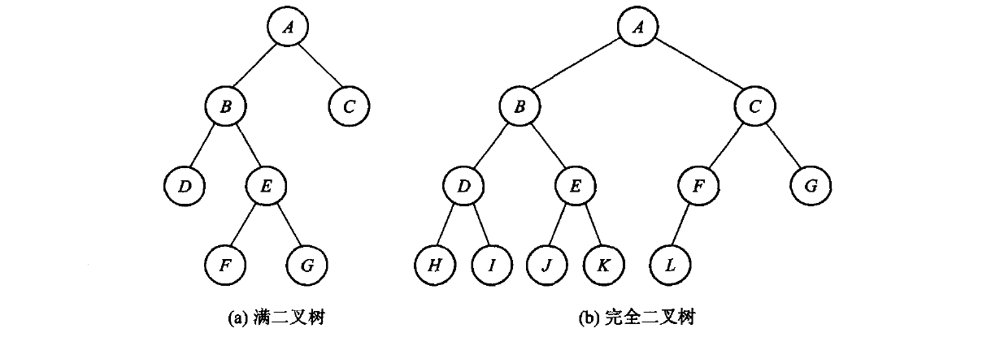

- **满二叉树**：每个结点的度非 0 即 2（没有只有一个孩子的结点）
- **完全二叉树**：除最下两层外每层排满，最下层结点集中在**左边连续**位置

完全二叉树这个条件看着别扭，但它换来一件大事——见 5.3 节。

<!-- 备注
先留个悬念：完全二叉树可以按层次次序压进一个**数组**，父子关系变成下标算术，
一根指针都不用。这就是 5.5 节堆的基础。
-->

---

# 5.1.3 三条要用到的性质

**性质 3**：叶结点数 $n_0$ = 度为 2 的结点数 $n_2$ 加 1。

> 证明：设结点总数 $n = n_0 + n_1 + n_2$。
> 换个角度数边：除根外每个结点恰有一条边进入，所以 $e = n - 1$；
> 而边都从度 1 或 2 的结点射出，所以 $e = n_1 + 2n_2$。
> 两式合并即得 $n_0 = n_2 + 1$。

**性质 4（满二叉树定理）**：非空满二叉树的树叶数 = 分支结点数 + 1。

> 满二叉树里 $n_1 = 0$，由性质 3 直接得出。

---

# 性质 5：一棵 n 结点的树里有 n+1 个空指针

**满二叉树定理推论**：非空二叉树的**空子树数目** = 结点数 + 1。

> 证明：把所有空子树换成树叶，得到扩充二叉树 $T'$。
> $T$ 原来的每个结点在 $T'$ 里都成了分支结点。
> 由满二叉树定理，$T'$ 的树叶数 = 分支数 + 1 = $T$ 的结点数 + 1。
> 每片新叶恰对应 $T$ 的一棵空子树。

**这不是纸面游戏**：链式存储时这些空指针占的空间和结点本身同阶。
线索二叉树、Trie 压缩、第 12 章 PATRICIA 的动机都从这里来。

线索二叉树（threaded binary tree）是**经典教材表示**，适合低额外空间遍历的专门场景；通用库通常使用显式栈、父指针或迭代器，不把线索化作为默认表示。

---

# 5.2 周游：三种深度优先

“周游”是中文数据结构教材的传统说法，现代资料通常直接说**遍历**（traversal）。

访问根、走左子树、走右子树——**三件事的次序**决定了三种周游：

| 次序 | 名字 |
| --- | --- |
| 根 左 右 | **前序**(preorder) |
| 左 根 右 | **中序**(inorder) |
| 左 右 根 | **后序**(postorder) |

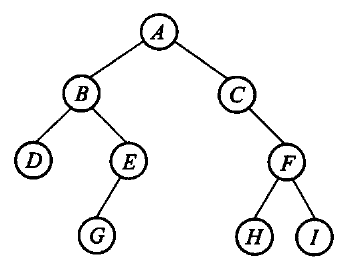

<!-- 备注
让学生对着图 5.5 报三遍答案。报错的多半是把「访问」和「走进去」混了。
可以提示：三个函数的代码一模一样，只差 visit 那一行的位置。
-->

---

# 三种周游的代码只差一行

```cpp file=code/ch05/binary_tree/teaching.hpp#fn:BinaryTree::preorder_impl
template <typename Visitor>
static void preorder_impl(const Node* node, Visitor& visit) {
    if (node == nullptr) return;
    visit(node->value);                 // 根
    preorder_impl(node->left, visit);   // 左
    preorder_impl(node->right, visit);  // 右
}
```

```cpp file=code/ch05/binary_tree/teaching.hpp#fn:BinaryTree::inorder_impl
template <typename Visitor>
static void inorder_impl(const Node* node, Visitor& visit) {
    if (node == nullptr) return;
    inorder_impl(node->left, visit);    // 左
    visit(node->value);                 // 根
    inorder_impl(node->right, visit);   // 右
}
```

**形状和定义一样，一眼就能对上**——这正是递归在这一章的价值。

---

# 广度优先：一层一层来

深度优先靠**栈**（这里是递归用的运行栈），广度优先靠**队列**。

```text
把根入队
只要队列非空:
    出队一个结点, 访问它
    它的左孩子入队
    它的右孩子入队
```

对图 5.5 那棵树，得到的次序是**逐层从左到右**。

完整实现在 `code/ch05/binary_tree/teaching.hpp` 的 `level_order`——
里面那条极简链式队列是现写的，因为第 3 章讲过了。

<!-- 备注
可以问：为什么不能用递归做层次周游？
答案：递归天然是深度优先的，层次周游需要「跨子树」的次序，必须显式队列。
-->

---

# 表达式树：周游的一个用途

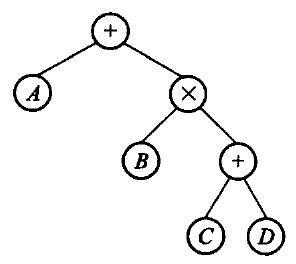

| 周游 | 得到 |
| --- | --- |
| 前序 | **前缀**表达式（波兰式） |
| 中序 | 中缀表达式（缺括号） |
| 后序 | **后缀**表达式（逆波兰式） |

第 3 章那个后缀求值器，吃的就是这棵树后序周游的结果。

---

# 5.3 存储结构：二叉链表

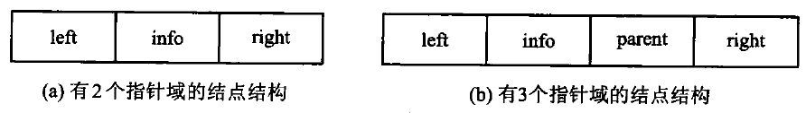

一个数据域、两根链接。没有孩子就是 `nullptr`——
比原书用一个「空结点」表示要省事得多。

```cpp file=code/ch05/binary_tree/teaching.hpp#fn:create_tree
// 造一棵新树：一个根，接上左右两棵子树。
// 两棵子树的所有权**转移**给新树——传进来的那两棵随即变空，
// 否则同一批结点会被两棵树各删一次。
void create_tree(const T& value, BinaryTree& left, BinaryTree& right) {
    Node* fresh = new Node{value, left.root_, right.root_};
    left.root_ = nullptr;
    right.root_ = nullptr;
    clear();
    root_ = fresh;
}
```

<!-- 备注
create_tree 里那两句置空是考点：两棵子树的所有权**转移**给新树，
传进来的那两棵随即变空。不置空的话同一批结点会被两棵树各删一次，
ASan 当场报 double-free。教学版测试专门守着这一条。
-->

---

# 释放：必须后序

```cpp file=code/ch05/binary_tree/teaching.hpp#fn:destroy
// 【代码5.8】后序释放：**必须先删两个孩子，再删自己**。
// 反过来先 delete node，node->left 就成了读已释放内存。
static void destroy(Node* node) {
    if (node == nullptr) {
        return;
    }
    destroy(node->left);
    destroy(node->right);
    delete node;
}

static void destroy(Node* node) {
    if (node == nullptr) return;
    destroy(node->left);
    destroy(node->right);
    delete node;
}
```

**先删两个孩子，再删自己。** 反过来先 `delete node`，
`node->left` 就成了读已释放的内存。

<!-- 备注
这段是递归的。代价是递归深度等于**树高**——退化成一条链的树会把运行栈压穿。
本机实测：纯左链 100 万结点，递归 destroy 段错误。
工程版改成了迭代（右旋拉直再沿右链删），见书稿 5.6a。
教学版保留递归，因为形状和定义一致，是这一章的正题。
-->

---

# 5.3 另一种存法：完全二叉树进数组

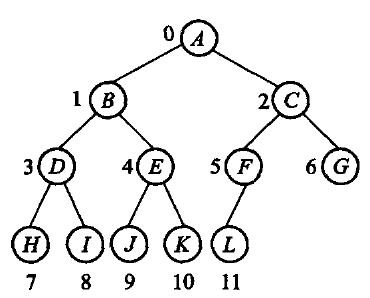

按层次次序编号后，父子关系变成**下标算术**：

```text
下标 i 的左孩子   2i + 1
下标 i 的右孩子   2i + 2
下标 i 的父亲     (i - 1) / 2      (i > 0)
```

**一根指针都不用。** 但只对完全二叉树成立——
非完全二叉树这么存会留下大量空洞。

---

# 5.4 二叉搜索树

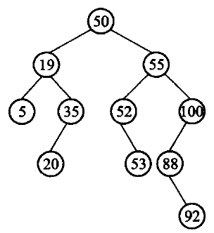

约束只有一条：**左子树的键都小于根，右子树的都大于根**。

有了它，查找不必遍历全树——每比较一次就砍掉一半（前提是树平衡）。

**中序周游一棵 BST，得到的正是升序**——这是「左小右大」的直接推论。

---

# 插入：指向指针的指针

```cpp file=code/ch05/binary_tree/teaching.hpp#fn:insert
// 【算法5.9】插入。一路比较着往下走，走到空位就把新结点挂上去。
// 键已存在时返回 false——重复键是可预期状态，不是错误，所以不抛异常。
bool insert(const T& value) {
    Node** link = &root_;               // 指向「新结点该挂在哪根指针上」
    while (*link != nullptr) {
        if (value < (*link)->value) {
            link = &(*link)->left;
        } else if ((*link)->value < value) {
            link = &(*link)->right;
        } else {
            return false;               // 已经有了
        }
    }
    *link = new Node{value, nullptr, nullptr};
    return true;
}
```

`Node** link` 指向「新结点该挂在哪根指针上」，
于是「挂到根」和「挂到某个孩子」写成**同一句** `*link = new Node{...}`。

空树不必另开一个分支。

<!-- 备注
这个手法在 C 系语言里很经典，值得单独讲两分钟。
学生第一次见往往懵，可以画一下：link 指向的是 root_ 这个变量本身，
而不是 root_ 指向的结点。
重复键返回 false——那是可预期状态，不是错误。
-->

---

# 删除：难点只有一个

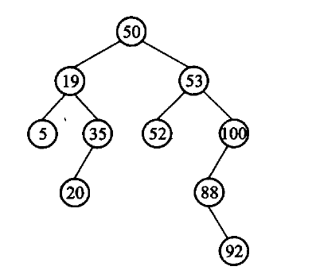

被删结点有**两个孩子**时，谁来顶替？

**中序前驱**——左子树里最大的那个。它比左子树其余的都大、
比右子树全部都小，顶上来之后「左小右大」仍然成立。

---

# 删除：还藏着一步

被删结点有两个孩子时，用中序前驱顶替。但——

**中序前驱自己可能还有一个左孩子。**

```text
被删 50, 它的中序前驱是 45, 而 45 还带着一个左孩子 42

顶替之前必须先把 42 接走:
    *predecessor_link = replacement->left;
```

漏了这一句，40 的右链仍指向 45，而 45 已经成了根——**树上出现环**。
中序周游立刻无限递归，ASan 报栈溢出。

<!-- 备注
这一条我第一版的测试没盖到：前一步已经把 20 删了，
被删的 30 反而落进「无左孩子」分支，根本没走到这一路。
补了一棵专门的树（删 50，前驱 45 带左孩子 42）才钉住。
现场可以演示：去掉那一句，测试从「全绿」变成「ASan 栈溢出」。
-->

---

# 5.5 堆：完全二叉树 + 数组

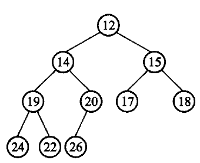

- 是一棵**完全二叉树**
- 每个结点都**不大于**它的孩子（最小堆）

因为完全，可以压进数组；因为堆序，根就是最小值。
**堆序只管父子，不管兄弟**——这是它比 BST 弱、也比 BST 便宜的地方。

---

# 插入：放末尾，然后上浮

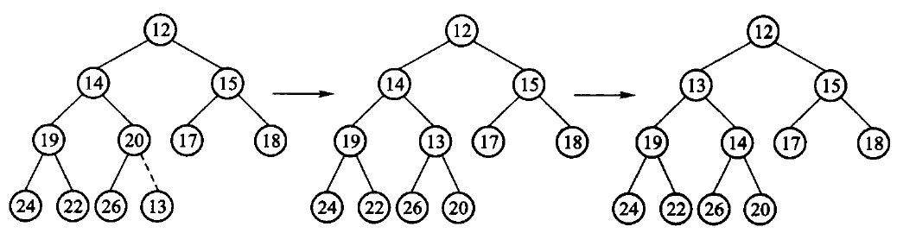

```cpp file=code/ch05/heap_huffman/teaching.hpp#fn:sift_up
// 上浮：只要比父亲小就换上去。
void sift_up(size_type index) {
    while (index > 0) {
        size_type parent = (index - 1) / 2;
        if (!(data_[index] < data_[parent])) {
            break;                       // 已经不小于父亲，位置对了
        }
        T tmp = data_[index];
        data_[index] = data_[parent];
        data_[parent] = tmp;
        index = parent;
    }
}
```

只要比父亲小就换上去。树高 $\log n$，所以代价 $O(\log n)$。

---

# 删除最小：搬最后一个上来，然后下沉

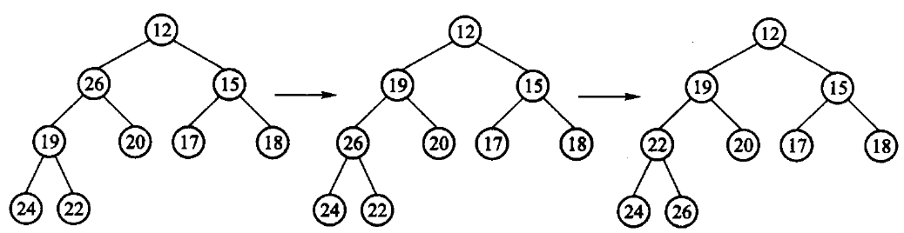

---

# 删除最小：搬最后一个上来，然后下沉（续）

```cpp file=code/ch05/heap_huffman/teaching.hpp#fn:sift_down
// 下沉：和两个孩子里较小的那个比，比它大就换下去。
// **必须和较小的那个换**——跟较大的换会破坏「父亲不大于两个孩子」。
void sift_down(size_type index) {
    for (;;) {
        size_type left = index * 2 + 1;
        size_type right = left + 1;
        size_type smallest = index;
        if (left < size_ && data_[left] < data_[smallest]) {
            smallest = left;
        }
        if (right < size_ && data_[right] < data_[smallest]) {
            smallest = right;
        }
        if (smallest == index) {
            return;                      // 父亲已经最小，停
        }
        T tmp = data_[index];
        data_[index] = data_[smallest];
        data_[smallest] = tmp;
        index = smallest;
    }
}
```

**必须和两个孩子里较小的那个交换**——跟较大的换会破坏堆序。

<!-- 备注
为什么搬**最后一个**上来？因为只有拿掉最后一个位置，
剩下的才仍然是一棵完全二叉树。这是「完全」这个条件在还债。
-->

---

# 建堆为什么是 O(n)

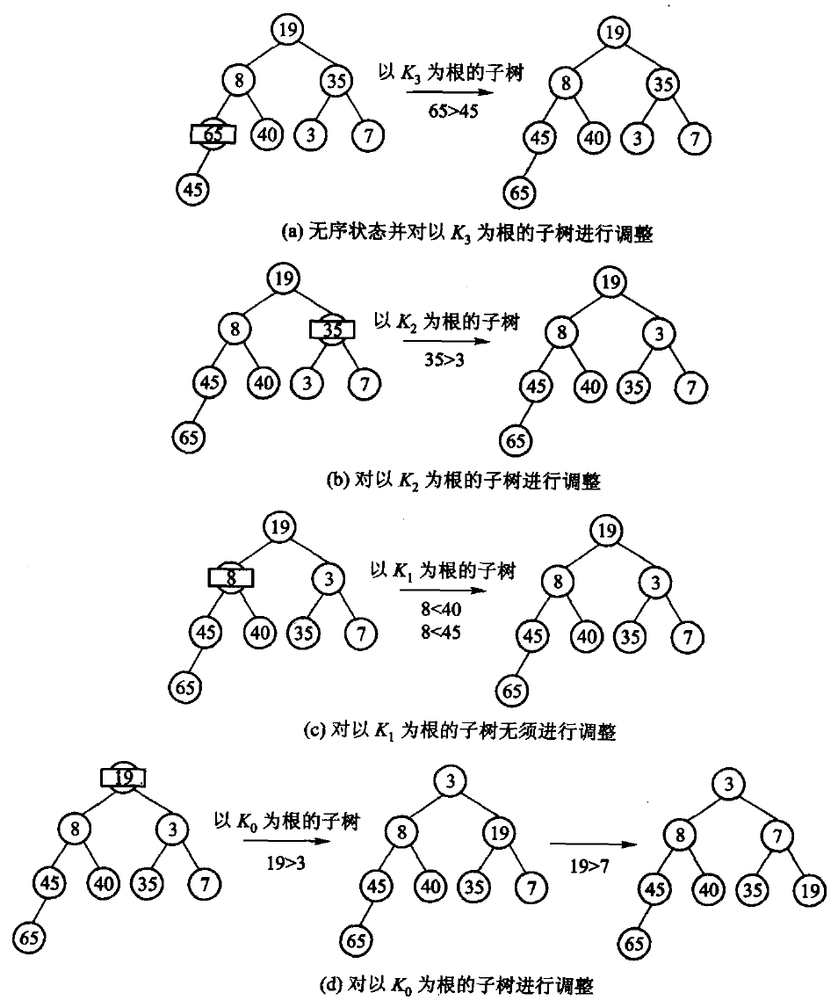

---

# 建堆为什么是 O(n)（续）

粗算：$n/2$ 次 `sift_down` $\times\ O(\log n) = O(n\log n)$。**原书说这只是粗略上界。**

细算的关键：**下沉距离不是 $\log n$，是「离底层还有多远」**。
越靠底层的结点越多，能沉的距离越短——两者正好抵消。

---

# 建堆：把和算出来

先把堆**放大成一棵满二叉树**（高度同为 $h=\lfloor\log_2 n\rfloor$，结点数 $\ge n$，
每层排满），在它上面算出来的就是上界——一般的 $n$ 下堆的最后一层未必满，
不能直接把「共 $\log n$ 层」当等式用。

满树第 $i$ 层恰有 $2^i$ 个结点，最多下沉 $h-i$ 层：

$$\sum_{i=0}^{h} 2^{i}(h-i) = 2^{h}\sum_{j=0}^{h}\frac{j}{2^{j}} < 2^{h}\cdot 2 = 2^{h+1} \le 2n$$

（令 $j=h-i$；末两步用 $\sum_{j\ge0} j/2^{j}=2$ 与 $2^{h}\le n$。）

**所以建堆是 $O(n)$——线性时间就能把无序序列变成堆。**

<!-- 备注
实际后果：第 8 章堆排序总代价 O(n log n)，那个 log n 全部来自后面 n 次取最小值，
建堆那一步是白送的。
反过来，一个个 insert 建堆是 O(n log n)，就把这份便宜丢掉了。
-->

---

# 5.5.2 优先队列

优先队列只保证“下一项最优”，不要求所有元素始终有序。

| 表示 | 插入 | 查看最小 | 删除最小 |
| --- | ---: | ---: | ---: |
| 无序表 | $O(1)$ | $O(n)$ | $O(n)$ |
| 有序表 | $O(n)$ | $O(1)$ | $O(1)$ |
| 最小堆 | $O(\log n)$ | $O(1)$ | $O(\log n)$ |

本书 `MinHeap<T>` 就是最小优先队列：
`insert` 入队，`remove_min` 取最高优先级，空队列返回 `nullopt`。

Huffman、Dijkstra、Prim 都只反复需要“当前最小”，无需全排序。

---

# 5.6 Huffman 树

规则只有一句：**反复取出权最小的两棵树，合并成一棵放回去**，直到只剩一棵。

「取最小的」正是堆的拿手好戏——**两节内容在这里接上了**。

| 做法 | 每轮取最小 | 总代价 |
| --- | --- | --- |
| 线性扫描 | $O(n)$ | $O(n^2)$ |
| 最小堆 | $O(\log n)$ | $O(n\log n)$ |

---

# 带权路径长度 WPL

以权 2、3、4、7 为例，合并过程 2+3=5 → 4+5=9 → 7+9=16：

$$\mathrm{WPL} = 2\times3 + 3\times3 + 4\times2 + 7\times1 = 30$$

**Huffman 树让这个数最小**——权大的离根近，编码就短。

<!-- 备注
教学版的测试把 30 这个数字直接写成断言：合并时若取的不是最小的两个，它立刻变红。
可以现场改一下。
-->

---

# 5.6.2 为什么需要前缀码

传电文 `abbaaadc`。定长编码每字符 2 位，共 16 位。

想更短就让高频字符用短码。比如 a=0, b=1, c=01, d=10 → 10 位。

**但这样的电文没法译码**：收到 `011`，既可以读成 a b b，也可以读成 c b。

**症结**：`0` 是 `01` 的前缀。要求任何编码都不是另一个的前缀——**前缀码**。

---

# Huffman 树天然给出前缀码

左边标 0、右边标 1，从根走到叶子，一路的 0/1 就是那个字符的编码。

| 字符 | 频率 | 编码 | 位数 |
| --- | --- | --- | --- |
| a | 4 | `0` | 1 |
| b | 2 | `10` | 2 |
| c | 1 | `110` | 3 |
| d | 1 | `111` | 3 |

**为什么一定无冲突**：字符只住在**叶子**上，
而一个叶子不可能在另一个叶子的路径上。

---

# 编码总长恰好等于 WPL

`abbaaadc` 编成 **14 位**，比定长的 16 位短。

**14 正好是这棵树的 WPL**——这不是巧合：
WPL 是 $\sum(\text{权}\times\text{深度})$，而权就是出现次数、深度就是码长。

一个反直觉的推论：**所有字符频率相同时，Huffman 一位都省不下来。**
8 个等权字符建出的是平衡树，每个恰好 3 位——退化成定长编码。

<!-- 备注
压缩的收益完全来自频率的不均匀。这一条教学版测试里也有断言。
-->

---

# 译码：用同一棵树

```text
从根出发
读一位: 0 走左, 1 走右
走到叶子: 吐出这个字符, 回到根, 继续读
```

前缀码保证这个过程**没有歧义**——不会出现「读到一半不知道该停还是该继续」。

三处边界，测试各有一条用例：

- 比特串走到一半就没了 → 返回空 `optional`，不吐半个字符
- 出现既不是 0 也不是 1 的字符 → 同样返回空
- 整棵树只有一个字符 → 从根到叶的路径是空串，本书约定给它一位 `"0"`

<!-- 备注
最后一条是真实的边界，不是抠字眼：一个字符的树，编码是空串就没法传。
实现见 code/ch05/heap_huffman/teaching.hpp 的 decode。
-->

---

---

# 课堂讲解卡：树的形状决定代价

同样的键集合可以形成平衡树或退化链；周游、搜索、堆操作的代价都由高度和形状决定。

```text
二叉搜索树：左 < 根 < 右
堆：只保证根与孩子的局部次序
```

---

# 课堂例题：插入 5、3、7、2、4

先画 BST，再写中序序列 `2 3 4 5 7`；随后把根删除，比较“无左子树、无右子树、两个孩子”三种情况。
最后把同一组值放入堆，指出堆的中序序列没有排序保证。

---

---

# 课堂例题答案：BST 与堆

BST 根为 5，左子树为 3（孩子 2、4），右子树为 7；中序为 `2 3 4 5 7`。删除 5 时用右子树最小值 7 替换。相同数据建成小堆只保证根最小，中序不必有序。

---

# 课末自检

- 完全二叉树为什么适合数组存储？
- BST 删除两个孩子时，后继来自哪棵子树？
- 建堆为什么不是 O(n log n) 的紧确代价？
- Huffman 树的 WPL 与编码总长度如何对应？

---

---

# 课末自检参考答案

- 完全二叉树按层紧凑，父子下标可用公式计算，适合数组。
- 两个孩子时取右子树最小结点或左子树最大结点。
- 自底向上建堆的下沉路径总和为 O(n)。
- Huffman 的 WPL 就是编码总比特数。

---

---

# 状态演算：堆下沉

小堆根删除后，把末尾元素移到根；若根大于两个孩子，先与较小孩子交换，再继续向下，直到局部堆序恢复。

---

# 反例：只和左孩子交换

根有两个孩子时必须选较小者，否则交换后可能仍大于右孩子，下一层的堆不变量没有恢复。

---

# 课堂练习与答案

课堂练习：对堆 `[2,5,7,9,6]` 删除根，写出每次交换。答案：搬 6 得 `[6,5,7,9]`，与 5 交换得 `[5,6,7,9]`。

---

---

# 语言分工：本章为什么以 C++ 为主

二叉链表、深拷贝、析构、堆数组和 Huffman 结点所有权是本章的教学对象；Python 的垃圾回收和 `heapq` 会隐藏这些不变量，因此算法结论保留在 C++ 实现中讲清。

---

# 本章小结

- 二叉树是**递归定义**的，所以周游、释放、深拷贝都自然是递归
- 三种深度优先只差 `visit` 那一行的位置；广度优先必须用队列
- 满二叉树定理推论：n 个结点的树里有 **n+1 个空指针**
- **完全**二叉树可以进数组，父子关系变下标算术——堆的基础
- BST 删除的难点是两个孩子的情形：用中序前驱顶替，
  且**前驱自己的左孩子要先接走**
- **建堆是 $O(n)$**，不是 $O(n\log n)$
- Huffman 树给出前缀码，编码总长恰好等于 WPL

---

# 上机

```bash
python3 tools/check_code.py code/ch05/binary_tree
python3 tools/check_code.py code/ch05/heap_huffman
```

故意改坏一处，看哪条断言变红：

- `destroy` 改成先删自己再删孩子
- `sift_down` 改成和**较大**的孩子交换
- BST 删除去掉「接走前驱左孩子」那一句
- Huffman 合并时取**最大**的两个

> 最后一条会让 WPL 变大——测试里那个 `30` 就是为它准备的。
