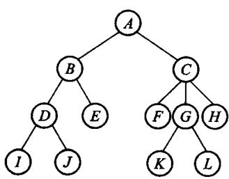
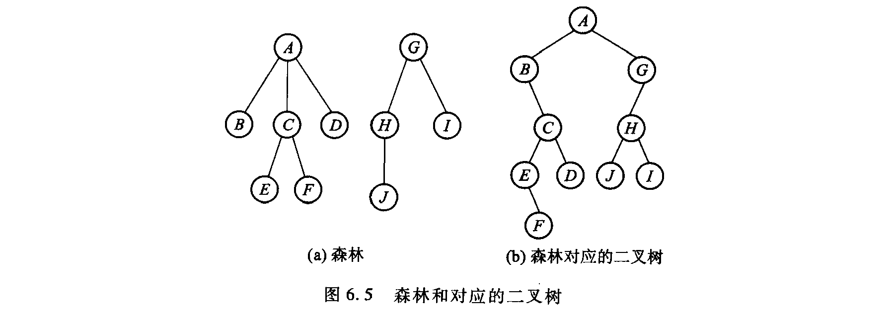
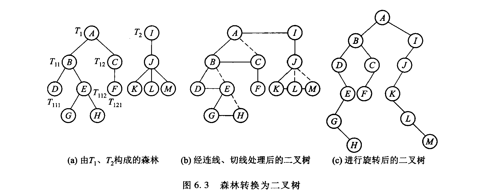
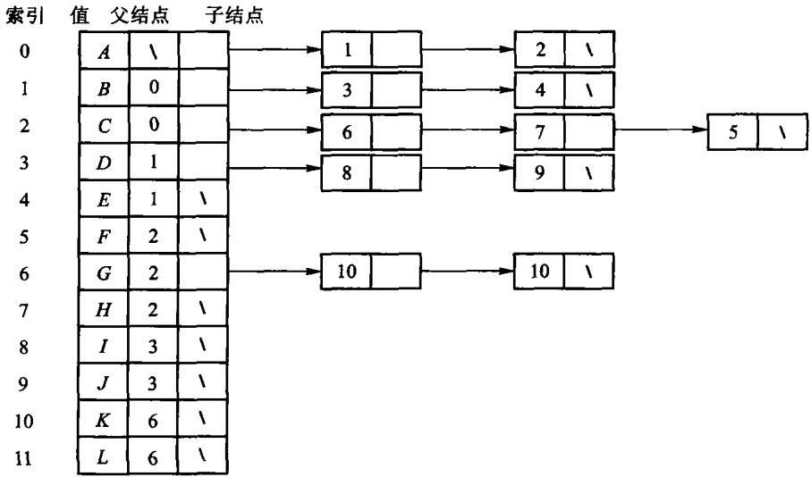
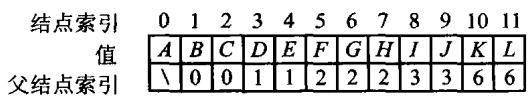
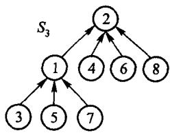
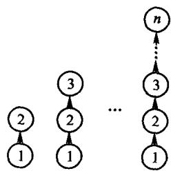
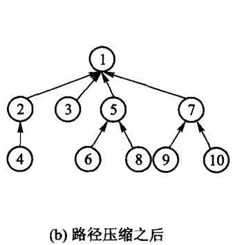
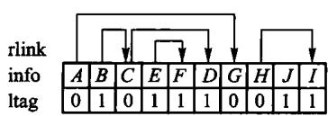
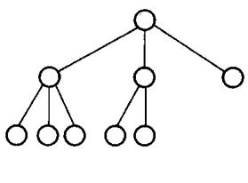

# 第6章 树

**一般树**：每个结点可以有任意多个孩子。

- 6.1 定义、森林与二叉树的等价转换、周游
- 6.2 链式存储：四种表示法 + 并查集
- 6.3 顺序存储：四种表示法
- 6.4 K 叉树

一条主线：**同一棵树，存法不同，能高效做的运算就不同**。

<!-- 备注
这一章表示法特别多，学生容易记乱。
建议每讲一种就问同一个问题：「这种存法下，找父亲要多久？找孩子要多久？」
答案不同，正是它们各自存在的理由。
-->

---

# 6.1.1 树与森林



- **树**：n 个结点的有限集合，有一个根，其余分成互不相交的子树
- **森林**：m 棵互不相交的树的集合

把一棵树的根去掉，剩下的就是森林——这个观察后面反复用到。

---

# 6.1.2 森林与二叉树可以互相转换



规则只有两条：

- 结点的**第一个孩子** → 二叉树的**左**孩子
- 结点的**下一个兄弟** → 二叉树的**右**孩子

这就是「左子/右兄」表示法。

<!-- 备注
这是本章最重要的一个观念：一般树的问题都可以搬到二叉树上解决，
第 5 章那套算法直接复用。
一个推论：由**一棵树**转出的二叉树，其右子树一定为空——
因为根没有兄弟。森林转出来的才会有右子树。
-->

---

# 转换的两个方向



**森林 → 二叉树**：连兄弟、留长子、旋转 45 度。

**二叉树 → 森林**：反过来做。任何二叉树都能转回唯一的森林。

<!-- 备注
可以给一道现场题：一棵二叉树的右子树非空，说明原来的森林至少有几棵树？
答案：至少两棵。
-->

---

# 6.1.3 树的 ADT：对外有哪些运算

| 运算 | 干什么 | `GeneralTree` 上的名字 |
| --- | --- | --- |
| 建根 | 用一个值建出根结点 | `GeneralTree::create_root` |
| 插入长子 | 在某结点下插入**第一个**孩子 | `GeneralTree::insert_first` |
| 插入兄弟 | 在某结点旁插入**下一个**兄弟 | `GeneralTree::insert_next` |
| 问父亲 | 取某结点的父结点 | `GeneralTree::parent_of` |
| 删子树 | 摘掉一棵子树并销毁 | `GeneralTree::delete_subtree` |
| 周游 | 先根 / 后根 / 层次 | `preorder` / `postorder` / `breadth_first` |

**「插入长子」和「插入兄弟」这一对，就是「左子/右兄」在接口上的样子**——
一般树没有「第 $k$ 个孩子」这种 $O(1)$ 运算，孩子只能顺兄弟链走。

原书【代码6.1】【代码6.2】只给出声明。本书把这些运算直接写在 `GeneralTree` 上，
不再另设一个空的抽象基类。

<!-- 备注
可以问一句：为什么 ADT 里没有「取第 k 个孩子」？
因为那会承诺一个这套存储给不了的代价。ADT 该说的是能做什么、代价多少，
而不是把所有想得到的运算都列上。
-->

---

# 6.1.4 树的周游

| 周游 | 做法 | 对应二叉树的 |
| --- | --- | --- |
| **先根** | 先访问根，再依次周游各棵子树 | 前序 |
| **后根** | 先依次周游各棵子树，再访问根 | 中序 |
| **广度优先** | 一层一层，用队列 | 层次 |

**「按先根次序周游树」等于「对应二叉树的前序周游」**——
这是上一页那个转换的直接推论。

<!-- 备注
注意树没有「中序」——根只有一个位置可放（最前或最后），
因为孩子不止两个，没有「中间」可言。
-->

---

# 先根与后根

```cpp file=code/ch06/general_tree/modern.hpp#fn:pre
template <class Visitor>
static void pre(Node* node, Visitor& visitor) {
    for (; node != nullptr; node = node->sibling) {
        visitor(node->value);
        pre(node->child, visitor);
    }
}
```

```cpp file=code/ch06/general_tree/modern.hpp#fn:post
template <class Visitor>
static void post(Node* node, Visitor& visitor) {
    for (; node != nullptr; node = node->sibling) {
        post(node->child, visitor);
        visitor(node->value);
    }
}
```

两个函数只差 `visitor(node->value)` 那一行的位置——
和第 5 章的三种周游是同一个套路。

---

# 6.2 链式存储：四种表示法

| 表示法 | 结点里存什么 | 找孩子 | 找父亲 |
| --- | --- | --- | --- |
| 子结点表 | 一张孩子链表 | 快 | **慢** |
| 指针数组 | 固定长的孩子指针数组 | 快 | 慢 |
| 静态左子/右兄 | 数组下标表示两条链 | 中 | 慢 |
| **动态左子/右兄** | 两根指针 | 中 | 慢 |
| **父指针** | 一根指向父亲的指针 | **慢** | **快** |

**没有哪种都快**——最后两行是本章要展开的两个。

---

# 子结点表：为什么不够用



每个结点挂一条孩子链表。找孩子很快。

**但找父亲要扫遍全表**——而且每个结点的孩子数不定，
数组要么浪费要么不够。

---

# 6.2.4 动态「左子/右兄」

结点只留**两根**指针：第一个孩子、下一个兄弟。

```cpp file=code/ch06/general_tree/modern.hpp#fn:insert_first
Node* insert_first(Node* parent, const T& value) {
    if (parent == nullptr) {
        throw std::invalid_argument("parent must not be null");
    }
    Node* node = new Node(value);
    node->sibling = parent->child;
    node->parent = parent;
    parent->child = node;
    return node;
}
```

```cpp file=code/ch06/general_tree/modern.hpp#fn:insert_next
Node* insert_next(Node* node, const T& value) {
    if (node == nullptr) {
        throw std::invalid_argument("node must not be null");
    }
    Node* next = new Node(value);
    next->sibling = node->sibling;
    next->parent = node->parent;
    node->sibling = next;
    return next;
}
```

<!-- 备注
两个函数都要同步维护三条链接：parent、child、sibling。
少维护一条，父树里就留下悬垂指针。

注意 insert_next 里 `next->parent = node->parent`——**兄弟共享父结点**。
这是最容易写错的一行。
-->

---

# 删子树：先脱开，再销毁

```cpp file=code/ch06/general_tree/modern.hpp#fn:delete_subtree
void delete_subtree(Node* node) {
    if (node == nullptr) {
        return;
    }

    Node** link = node->parent == nullptr ? &root_ : &node->parent->child;
    while (*link != nullptr && *link != node) {
        link = &(*link)->sibling;
    }
    if (*link != node) {
        throw std::invalid_argument("node is not part of this tree");
    }

    *link = node->sibling;
    node->sibling = nullptr;
    destroy(node);
}
```

<!-- 备注
顺序不能反：必须先把结点从「父亲的孩子链」或「根的兄弟链」上摘下来，
才能销毁它。反过来做，父树里就留下一根指向已释放内存的指针。

那个 `Node** link` 的手法和第 5 章 BST 插入是同一个：
它指向「这个结点是被谁指着的」，于是「是长子」和「是某个兄弟」写成同一段代码。
-->

---

# 6.2.5 父指针表示法



每个结点只存**一根指向父亲的指针**。

- 找父亲、找祖先：**快**
- 找孩子：得扫遍全表

看着很废——但它恰好匹配一类问题：**判断两个元素在不在同一个集合里**。

---

# 并查集：等价类问题



给一堆等价对 (A,B)、(C,K)、…，要能回答「x 和 y 同类吗」。

- **find(x)**：沿父指针一路走到根，根就是这个集合的代表
- **unite(x, y)**：把一棵树的根挂到另一棵的根下

只用到「往上走」，所以父指针表示法正好。

---

# 朴素做法会退化成一条链



每次都把 B 挂到 A 下面，n 次合并之后树高 n，
`find` 退化成 **O(n)**。

原书给了两条改进，本书都实现了。

---

# 改进一：重量权衡合并规则

**看两个集合的元素个数，令含元素少的树根指向含元素多的根。**

```cpp file=code/ch06/general_tree/modern.hpp#fn:unite
bool unite(std::size_t left, std::size_t right) {
    left = find(left);
    right = find(right);
    if (left == right) {
        return false;  // 已经同类：幂等的可预期失败（D-001 §3c）
    }
    // 重量权衡：小树挂到大树下。并列时把**值大的根**挂到值小的根下——
    // 原书没有规定并列怎么办，这个口径取自课程第 6 章习题 8 的原话
    // 「当两棵树规模同样大时，使结点值较大的根结点作为值较小的根结点的子结点」，
    // 这样书里的实现能直接用来核对那道题的答案。
    if (size_[left] < size_[right] || (size_[left] == size_[right] && left > right)) {
        std::swap(left, right);
    }
    parent_[right] = left;
    size_[left] += size_[right];
    return true;
}
```

<!-- 备注
为什么能把深度限制在 O(log n)：每次合并树高最多加 1，
而元素个数**至少翻倍**，所以任何结点的深度最多增加 log n 次。

**别和「按秩合并」混了**：按秩比的是树高，按重量比的是元素个数。
两者复杂度同阶，但在同一组等价对上会长出**形状不同**的树。
本书按原书口径用重量——课程习题按这个口径出题，换成按秩就对不上答案。
-->

---

# 改进二：路径压缩



```cpp file=code/ch06/general_tree/modern.hpp#fn:find
std::size_t find(std::size_t index) {
    if (index >= parent_.size()) {
        throw std::out_of_range("disjoint-set index");
    }
    if (parent_[index] != index) {
        parent_[index] = find(parent_[index]);  // 【算法6.9】路径压缩
    }
    return parent_[index];
}
```

`find` 在返回根之前，把沿途**每个结点的父指针都直接改成根**。

两条改进合起来，m 次操作的摊还代价是 $O(m\,\alpha(n))$——
$\alpha$ 是反 Ackermann 函数，实际中不超过 5。

---

# 6.3 顺序存储：四种表示法

树也可以压成一个**线性序列**存到文件里。关键是：
序列本身丢掉了结构，要靠附加信息把结构恢复出来。

| 表示法 | 每个结点附加什么 |
| --- | --- |
| 带右链的先根次序 | 一个 `rlink` 下标 + 一个 `ltag` |
| **带双标记的先根次序（历史编码）** | `ltag` + `rtag` 两位信息；普通 `bool` 不保证各占 1 bit |
| 带度数的后根次序 | 这个结点有几个孩子 |
| 带双标记的层次次序 | `ltag` + `rtag`，但按层排 |

---

# 带双标记的先根次序

这是经典顺序编码，今天主要用于理解树的序列化；工程中的紧凑树通常会考虑 LOUDS 或平衡括号编码。



```text
先根次序   A  B  C  E  F  D  G  H  J  I
ltag       0  0  0  0  1  1  1  0  1  1     0 = 有孩子
rtag       0  1  0  1  1  1  0  0  1  1     0 = 有下一个兄弟
```

**光靠这三行就能把链恢复出来**，靠的是先根次序的一条性质：
任何结点的子树都**紧跟在它后面**，子树排完才轮到它的下一个兄弟。

---

# 重建：用一把栈

「谁是某个结点的右兄弟」要等它整棵子树扫完才知道——用栈记着：

```text
扫每个结点:
    rtag == 0 (还有下一个兄弟)  ->  把它压栈
    建一个新结点
    ltag == 0 (有孩子)          ->  新结点就是它的长子
    ltag == 1 (没孩子, 子树到头) ->  弹一个出来, 新结点是那个的右兄弟
```

完整实现是原书【算法6.10】，见 `code/ch06/general_tree/modern.hpp`。

<!-- 备注
原书这段代码在 ltag==1 分支里直接 aStack.top()，**没有判空**。
标志位不自洽的输入（比如两个结点都说「没孩子、没兄弟」）会让它对空栈取顶，
那是未定义行为。本书判空并抛异常，另加一条「末结点仍声称有孩子」的收尾检查。

顺带一提：这条清单此前被台账认领却根本没有实现，2026-08-16 对照课程课件时发现的。
-->
---

# 6.4 K 叉树



二叉树的自然推广：每个结点最多 K 个孩子，**而且孩子的位置有区分**。

完全 K 叉树同样可以按层次编号进数组：

```text
下标 i 的第 j 个孩子   K*i + j + 1      (j = 0 .. K-1)
下标 i 的父亲          (i - 1) / K
```

第 11 章的 B 树、B+ 树就是 K 叉树的一种。

---

# 本章小结

- 一般树的问题可以通过「左子/右兄」搬到**二叉树**上解决
- 先根周游 = 对应二叉树的前序；后根周游 = 中序；树没有中序
- 存法决定能高效做什么：**子结点表找孩子快，父指针找祖先快**
- 并查集用父指针 + **重量权衡合并** + **路径压缩**，摊还近似 $O(1)$
- 顺序存储要靠附加标志位把结构恢复出来；重建时用栈
- K 叉树是二叉树的推广，完全 K 叉树同样能进数组

---

# 上机

```bash
python3 tools/check_code.py code/ch06/general_tree
```

故意改坏一处，看哪条断言变红：

- `insert_next` 里把 `next->parent = node->parent` 改成 `= node`
- `delete_subtree` 里先销毁再脱链
- `unite` 改成按秩合并（比树高而不是比元素个数）
- 重建算法里把「扫到没有孩子才弹栈」改成「每个结点都弹」

> 第三条会让「规模 3 的集合与规模 2 的集合合并、根应是前者」那条断言变红——
> 两种规则长出的树形状不同。
