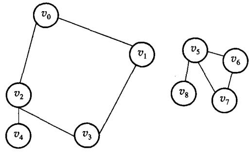
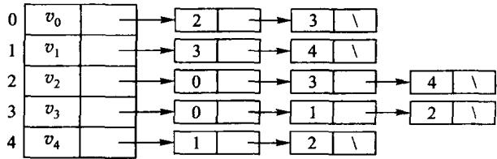
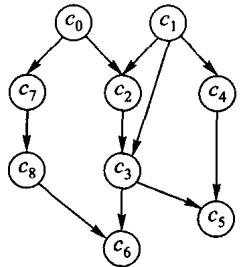
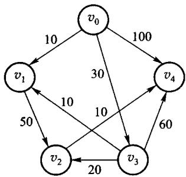

# 第7章 图

**结点之间的关系可以是任意的**——比线性、树形都复杂。

- 7.3 存储：相邻矩阵 vs 邻接表
- 7.4 周游：DFS、BFS、拓扑排序
- 7.5 最短路径：Dijkstra、Floyd
- 7.6 最小生成树：Prim、Kruskal

一条主线：**几乎每个算法的代价，都取决于图怎么存**。

---

# 7.1 基本术语


- $G = (V, E)$：顶点集 + 边集
- **无向图**的边是顶点对 $(u,v)$；**有向图**的边（弧）是序偶 $\langle u,v\rangle$
- **度**：无向图看关联的边数；有向图分**入度**和**出度**
- **路径**、**回路**、**连通**、**连通分量**

---

# 连通与强连通



- 无向图：任意两点有路径 → **连通**；极大连通子图 → **连通分量**
- 有向图：任意两点**互相**可达 → **强连通**；极大者 → **强连通分量**


---

# 7.2 图的 ADT：对外有哪些运算

| 运算 | 干什么 | `Graph` 上的名字 |
| --- | --- | --- |
| 构造 | 指定顶点数建一张空图 | `Graph(count)` |
| 加边 | 加一条带权边（可选有向/无向） | `Graph::add_edge` |
| 问规模 | 有多少个顶点 | `Graph::vertices` |
| 周游 | 深度优先 / 广度优先 | `Graph::dfs` / `Graph::bfs` |
| 拓扑 | 排一个线性次序，有环则说不出来 | `Graph::topological_sort` |
| 最短路 | 单源 / 每对顶点 | `Graph::dijkstra` / `Graph::floyd` |
| 最小生成树 | 从点长 / 从边挑 | `Graph::prim` / `Graph::kruskal` |

**「有环」「不连通」不是异常，是可预期的结果**——所以
`topological_sort`、`prim`、`kruskal` 返回 `std::optional`，空值就是答案。

原书【代码7.1】【代码7.2】的 ADT 声明残缺，标识符还被 OCR 的空格切断。
本书直接把运算定义在 `Graph` 上。

---

# 7.3.1 相邻矩阵

“相邻矩阵”是原书沿用的**历史教材称呼**；现代资料通常称**邻接矩阵**（adjacency matrix）。

`m[i][j]` 是 i 到 j 一条边的权，不通就是「无穷大」。

```cpp file=code/ch07/graph/modern.hpp#graph-build
explicit Graph(std::size_t count) : adjacency_(count, std::vector<int>(count, infinity)) {
    for (std::size_t vertex = 0; vertex < count; ++vertex) {
        adjacency_[vertex][vertex] = 0;
    }
}

[[nodiscard]] std::size_t vertices() const noexcept { return adjacency_.size(); }

void add_edge(std::size_t from, std::size_t to, int weight, bool directed = true) {
    check_vertex(from);
    check_vertex(to);
    if (weight < 0) {
        throw std::invalid_argument("negative edge");
    }
    adjacency_[from][to] = weight;
    if (!directed) {
        adjacency_[to][from] = weight;
    }
}
```

<!-- 备注
infinity 取 INT_MAX/4 而不是 INT_MAX——Floyd 里两个 infinity 会相加，
用 INT_MAX 就溢出了，而有符号溢出是未定义行为。这一处第 1 章也讲过。

无向图加边要加两次，本书用 directed 参数表达。
-->

---

# 7.3.2 邻接表



每个顶点挂一条**边表**，只存**实际存在**的边。

---

# 两种存法的代价对照

| | 相邻矩阵 | 邻接表 |
| --- | --- | --- |
| 存储量 | $V^2$ | $V + E$ |
| 遍历某点的邻居 | $O(V)$，要扫整行 | $O(\deg v)$ |
| 问 (u,v) 有没有边 | **$O(1)$** | $O(\deg u)$ |
| DFS / BFS 全图 | $O(V^2)$ | **$O(V + E)$** |

**稀疏图（$E \ll V^2$）用邻接表；稠密图或频繁问「这两点之间有没有边」用矩阵。**

**没有哪种总是更好**——这正是本章要比较的东西。

<!-- 备注
本书的 GraphList 里埋了一个教学计数器 scan_steps()，
可以把「扫过多少条边」量出来，让 O(V+E) 和 O(V^2) 的差别不是纸上说说。
上机题就用它。
-->

---

# 7.3.3 十字链表：一条弧进两条链

邻接表只方便沿出边走；十字链表（**经典教材表示**）让同一弧结点同时进入：

- 尾点的出边链：`tailnextarc`
- 头点的入边链：`headnextarc`
- 顶点保存：`firstoutarc` 与 `firstinarc`

因此遍历顶点 $v$ 的出边是 $O(\deg^+(v))$，
遍历入边是 $O(\deg^-(v))$，总空间仍是 $O(V+E)$。

**更新不变量**：删除弧必须从出链、入链各摘一次；
只改一边，另一方向会留下指向已释放结点的悬空链接。

---

# 7.4 深度优先周游

```cpp file=code/ch07/graph/modern.hpp#dfs
[[nodiscard]] std::vector<std::size_t> dfs(std::size_t source) const {
    check_vertex(source);
    std::vector<bool> seen(vertices());
    std::vector<std::size_t> result;
    visit_depth_first(source, seen, result);
    return result;
}
```

**「一条路走到黑，走不动了退回来」**——和二叉树的前序周游是同一个形状，
只是多了一个 `seen` 数组：图里有回路，不标记就会绕圈。

<!-- 备注
树的周游不需要 seen，因为树没有回路。这是图与树的第一个实质差别。
DFS 递归写法的深度是路径长度，极端图上仍有爆栈风险——第 3 章那张表适用。
-->

---

# 广度优先周游

```cpp file=code/ch07/graph/modern.hpp#bfs
[[nodiscard]] std::vector<std::size_t> bfs(std::size_t source) const {
    check_vertex(source);
    std::vector<bool> seen(vertices());
    std::queue<std::size_t> queue;
    std::vector<std::size_t> result;
    queue.push(source);
    seen[source] = true;
    while (!queue.empty()) {
        const std::size_t from = queue.front();
        queue.pop();
        result.push_back(from);
        for (std::size_t to = 0; to < vertices(); ++to) {
            if (adjacency_[from][to] < infinity && !seen[to]) {
                seen[to] = true;
                queue.push(to);
            }
        }
    }
    return result;
}
```

<!-- 备注
BFS 用队列，DFS 用栈（递归的运行栈）——这个对偶第 5 章讲二叉树时已经出现过。

BFS 的一个重要性质：在**无权图**上，它给出的就是最短路（按边数）。
Dijkstra 可以看成 BFS 在带权图上的推广，把队列换成了优先队列。
-->

---

# 7.4.3 拓扑排序



给有向无环图（DAG）排一个线性次序，使**每条边都从前指向后**。

「先修课」就是典型场景。

---

# 拓扑排序：不断摘入度为 0 的点

```text
算出每个顶点的入度
把入度为 0 的都放进队列
只要队列非空:
    出队一个 v, 输出它
    对 v 的每个后继 w: 入度减一, 减到 0 就入队
```

两种结局：

- 所有顶点都输出了 → 排序成功
- 还有顶点没输出，却找不到入度 0 的 → **图里有环**

**所以拓扑排序顺带就是一个环检测算法。**

实现见 `code/ch07/graph/modern.hpp` 的 `topological_sort`。

---

# 7.5.1 单源最短路：Dijkstra



每一轮：在**还没确定**的顶点里挑一个当前距离最小的，
把它标为确定，然后用它去松弛邻居。

---

# Dijkstra 的实现

```cpp file=code/ch07/graph/modern.hpp#dijkstra
[[nodiscard]] std::vector<int> dijkstra(std::size_t source) const {
    check_vertex(source);
    std::vector<int> distance(vertices(), infinity);
    std::vector<bool> used(vertices());
    distance[source] = 0;
    for (std::size_t count = 0; count < vertices(); ++count) {
        const std::size_t from = nearest_unvisited(distance, used);
        if (from == vertices() || distance[from] == infinity) {
            break;
        }
        used[from] = true;
        for (std::size_t to = 0; to < vertices(); ++to) {
            if (adjacency_[from][to] < infinity &&
                distance[to] > distance[from] + adjacency_[from][to]) {
                distance[to] = distance[from] + adjacency_[from][to];
            }
        }
    }
    return distance;
}
```

**前提：边权非负。** 有负权边时这个「挑最小就确定」的贪心不成立。

<!-- 备注
常见误解：把所有边权统一加一个常数就能处理负权。**不行**——
加常数会按路径的**边数**增加不同的总量，边多的路径被罚得更重，
最短路的次序因此会变。这是课程习题里的一道题。
负权要用 Bellman-Ford。
-->

---

# 7.5.2 每对顶点：Floyd

```cpp file=code/ch07/graph/modern.hpp#floyd
[[nodiscard]] std::vector<std::vector<int>> floyd() const {
    auto distance = adjacency_;
    for (std::size_t via = 0; via < vertices(); ++via) {
        for (std::size_t from = 0; from < vertices(); ++from) {
            for (std::size_t to = 0; to < vertices(); ++to) {
                if (distance[from][via] < infinity && distance[via][to] < infinity) {
                    distance[from][to] = std::min(
                        distance[from][to], distance[from][via] + distance[via][to]);
                }
            }
        }
    }
    return distance;
}
```

递推的含义：**允许经过前 k 个顶点中转时的最短路**。

**k 必须在最外层**——它是「允许中转的集合」，放到里层递推就不成立了。

<!-- 备注
这是第 1 章那个股市传言问题用的算法，可以回头指一下。
代价 O(V^3)，与边数无关，所以稠密图上比跑 V 次 Dijkstra 还划算。
-->

---

# 7.6 最小生成树


连通带权无向图的**生成树**里，边权总和最小的那一棵。

两个经典算法，思路完全不同：

- **Prim**：从一个点开始长，每次加一条「连到树外最便宜」的边
- **Kruskal**：把边按权排序，能不成环就加

---

# Prim：从点出发

```cpp file=code/ch07/graph/modern.hpp#prim
[[nodiscard]] std::optional<std::vector<Edge>> prim(std::size_t source) const {
    check_vertex(source);
    std::vector<int> distance(vertices(), infinity);
    std::vector<std::size_t> predecessor(vertices());
    std::vector<bool> used(vertices());
    std::vector<Edge> result;
    distance[source] = 0;
    for (std::size_t count = 0; count < vertices(); ++count) {
        const std::size_t from = nearest_unvisited(distance, used);
        if (from == vertices() || distance[from] == infinity) {
            return std::nullopt;
        }
        used[from] = true;
        if (from != source) {
            result.push_back({predecessor[from], from, distance[from]});
        }
        for (std::size_t to = 0; to < vertices(); ++to) {
            if (!used[to] && adjacency_[from][to] < distance[to]) {
                distance[to] = adjacency_[from][to];
                predecessor[to] = from;
            }
        }
    }
    return result;
}
```

<!-- 备注
Prim 和 Dijkstra 长得极像，都是「每轮挑一个最小的加进来」。
差别在**比什么**：Dijkstra 比的是「到源点的距离」，
Prim 比的是「到当前树的距离」。一个字之差，结果完全不同。

这也是课程习题里的一道题：AB=2, BC=2, AC=3 时，
Dijkstra 树总权 5，MST 总权 4。
-->

---

# Kruskal：从边出发

```text
把所有边按权从小到大排序
依次考察每条边 (u, v):
    u 和 v 已经连通吗?
        是 -> 加进来会成环, 跳过
        否 -> 加入生成树, 把两个集合合并
直到选够 V-1 条边
```

**「已经连通吗」怎么判？** 用第 6 章的**并查集**——
两个端点 `find` 到同一个根就说明成环。

代价：排序的 $O(E\log E)$ 主导。

<!-- 备注
这是全书结构复用最漂亮的一处：第 6 章讲父指针表示法时看不出用途，
到这里成了 Kruskal 的核心零件。可以回头指一下。

稀疏图上 Kruskal 好（边少，排序快），稠密图上 Prim 好。
实现见 code/ch07/graph/modern.hpp 的 kruskal。
-->

---

# 最短路树 ≠ 最小生成树

```text
三个点:  A-B = 2    B-C = 2    A-C = 3

从 A 出发的 Dijkstra 树:  A-B(2) + A-C(3) = 5
最小生成树:               A-B(2) + B-C(2) = 4
```

- **Dijkstra** 保证每个点到**源点**的距离最短
- **MST** 保证**总权**最小

两个目标不同，结果自然不同。

<!-- 备注
这是最常见的一个混淆，值得单独一页。
可以让学生自己在纸上画一遍，比直接给结论有效。
-->

---

---

# 课堂讲解卡：图算法先看存储和不变量

先决定图是稠密还是稀疏，再选邻接矩阵或邻接表；随后给算法写不变量：已确定的距离、已访问的顶点或当前生成树。

---

# 课堂例题：从 0 出发的带权图

用 Dijkstra 逐轮确定最小暂定距离，用 Floyd 逐个开放中间顶点；两种算法算出的距离应一致，但访问模式不同。
再删掉一个入度为 0 的点，观察拓扑排序为什么会暴露环。

---

---

# 课堂例题答案：三个算法的结果

Dijkstra 每轮确定最小暂定距离，要求边权非负；Floyd 按中间点编号逐轮更新，允许负边但不能有负环。拓扑排序若仍有顶点未摘除，说明剩余子图有环。

---

# 课末自检

- Dijkstra 为什么不能处理负权边？
- DFS/BFS 的 `seen` 何时标记，能否避免重复入队？
- Prim 与 Kruskal 都生成什么对象，为什么不等于最短路树？
- 十字链表的两条链是否始终描述同一组弧？

---

---

# 课末自检参考答案

- Dijkstra 的贪心前提被负边破坏。
- DFS/BFS 入队或入栈时及时标记，避免重复加入。
- Prim/Kruskal 生成最小生成树，最短路树优化的是源点距离。
- 每条弧同时在出链和入链中出现，插删必须同步维护。

---

# 本章小结

- 图的存法决定算法代价：稀疏用**邻接表**，稠密用**相邻矩阵**
- DFS 用栈、BFS 用队列；图有回路，所以必须标记 `seen`
- 拓扑排序顺带是**环检测**
- Dijkstra 要求**边权非负**；统一加常数**不能**修复负权
- Floyd 的 k 必须在**最外层**，$O(V^3)$，与边数无关
- Kruskal 用第 6 章的**并查集**判环
- **最短路树不是最小生成树**——目标不同

---

# 上机

```bash
python3 tools/check_code.py code/ch07/graph
python3 tools/check_code.py code/ch07/adjacency_list
```

- 用 `GraphList::scan_steps()` 量一量：同一张稀疏图上，
  邻接表和邻接矩阵各扫了多少条边
- 把 Floyd 的 k 循环挪到里层，看哪条断言变红
- 构造一个带负权边的图，看 Dijkstra 给出什么

> 邻接表和邻接矩阵两套实现在测试里**逐项对拍**：
> 同一张图上，所有算法必须给出同样的答案。
