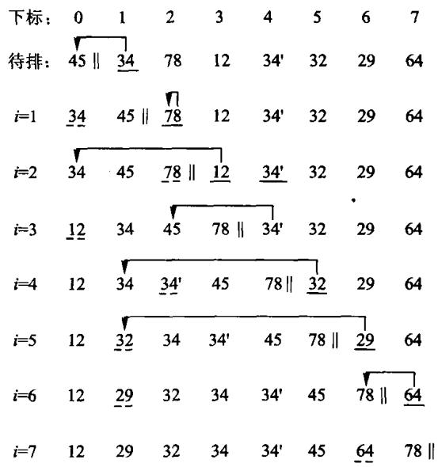
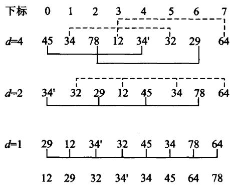
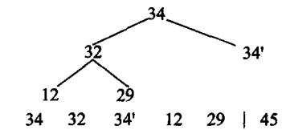
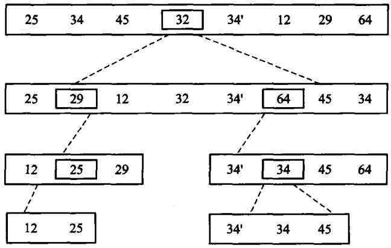
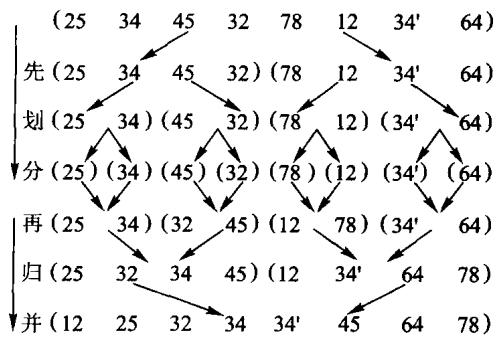
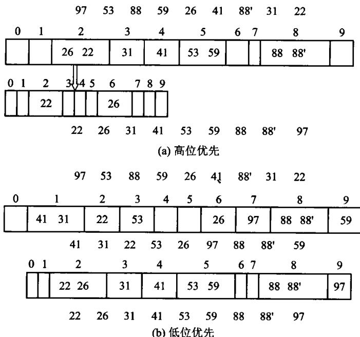
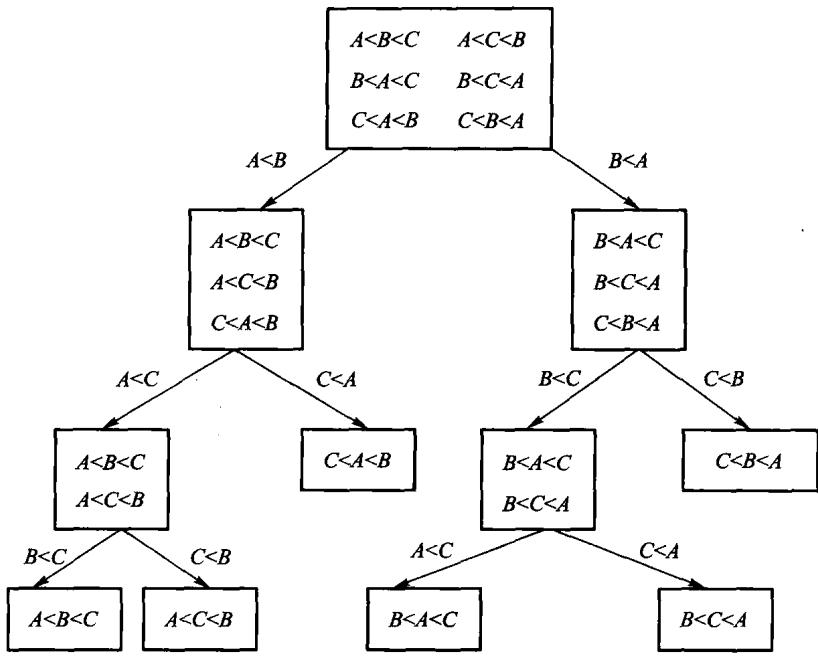

# 第8章 内排序

**把一组记录按关键码重排成有序序列。**

- 插入类：直接插入、Shell
- 选择类：直接选择、**堆排序**
- 交换类：冒泡、**快速排序**
- 归并类：两路归并
- 分配类：桶式、基数

一条主线：**代价从 $O(n^2)$ 到 $O(n\log n)$，靠的是什么。**

---

# 8.1 基本概念

- **稳定性**：关键码相同的记录，排完之后相对次序不变 → 稳定
- **就地**：额外空间 $O(1)$
- **比较模型**：只能通过「两两比较」判断次序

**稳定性不是可有可无**：按多个字段排序时，
先排次要字段、再用**稳定**算法排主要字段，就能得到「主序内按次序」的结果。

<!-- 备注
举个例子：先按成绩排，再按班级用稳定排序排，结果就是「班级内按成绩」。
用不稳定的排序做这件事就得不到想要的结果。
-->

---

# 8.2 插入排序



```cpp file=code/ch08/sorting/modern.hpp#insertion
// 算法8.1：直接插入排序。相等元素不越过彼此，故稳定。
inline void insertion_sort(std::vector<int>& values) {
    for (std::size_t index = 1; index < values.size(); ++index) {
        const int value = values[index];
        std::size_t hole = index;
        while (hole != 0 && value < values[hole - 1]) {
            values[hole] = values[hole - 1];
            --hole;
        }
        values[hole] = value;
    }
}
```

<!-- 备注
形象说法：像整理手里的扑克牌，抓一张就往左边已经排好的那段里插。

最好情况：输入已有序，每张牌比一次就位，**O(n)**。
最坏情况：输入逆序，第 i 张要比 i 次，O(n^2)。
所以说「插入排序是 O(n^2)」对，说「是 Θ(n^2)」就错了。
-->

---

# 插入排序的两个优点

- **稳定**：只在严格小于时才往前挪
- **对近乎有序的输入极快**：$O(n + d)$，d 是逆序对数

所以它常被用作**其它算法的收尾**——快排/归并递归到小区间时改用插入排序。

**n 小的时候 $O(n^2)$ 完全可能比 $O(n\log n)$ 快**：常数小、没有递归开销、缓存友好。

<!-- 备注
这是第 1 章「渐进分析不是全部」的一个实例，可以回头指一下。
标准库的 sort 内部就是这么做的（introsort：快排 + 堆排 + 插入排序）。
-->

---

# 8.2.2 Shell 排序



先按**大增量**分组做插入排序，再逐步缩小增量，最后增量为 1。

**为什么快**：大增量时每组元素少、几乎有序；
小增量时整体已经接近有序，而插入排序恰好对这种输入极快。

代价与增量序列有关，「每次除以 2」约 $O(n^{1.5})$。**不稳定**。

---

# 8.3.1 直接选择排序

第 $i$ 轮从 `[i,n)` 扫出最小值，与位置 $i$ 交换。

```text
初始   45 34 78 12 34' 32 29 64
i=0    12 34 78 45 34' 32 29 64
i=1    12 29 78 45 34' 32 34 64
i=2    12 29 32 45 34' 78 34 64
```

- 无论输入是否有序，比较次数都是 $n(n-1)/2$
- 只做至多 $n-1$ 次交换，额外空间 $O(1)$
- **不稳定**：远距离交换可能让相等记录越过彼此

它省的是交换，不是比较。

---

# 8.3.2 堆排序



```cpp file=code/ch08/sorting/modern.hpp#heap
// 算法8.4：手写最大堆筛选与堆排序，不委托 std::make_heap/sort_heap。
inline void sift_down(std::vector<int>& values, std::size_t root, std::size_t count) {
    while (root * 2 + 1 < count) {
        std::size_t child = root * 2 + 1;
        if (child + 1 < count && values[child] < values[child + 1]) ++child;
        if (values[root] >= values[child]) return;
        using std::swap;
        swap(values[root], values[child]);
        root = child;
    }
}

inline void heap_sort(std::vector<int>& values) {
    for (std::size_t root = values.size() / 2; root != 0; --root) {
        sift_down(values, root - 1, values.size());
    }
    for (std::size_t end = values.size(); end > 1; --end) {
        using std::swap;
        swap(values[0], values[end - 1]);
        sift_down(values, 0, end - 1);
    }
}
```

<!-- 备注
两步：先把整个数组建成**最大**堆，再反复「把根和末尾交换、堆长度减一、下沉」。

关键点：**建堆是 O(n)**（第 5 章证过），所以总代价 O(n log n) 里那个 log n
全部来自后面 n 次取最大值。

优点：就地、最坏也是 O(n log n)。缺点：不稳定，而且缓存局部性差
（下标跳来跳去），实际常数往往比快排大。
-->

---

# 8.4.1 冒泡排序

每一趟比较相邻元素，把当前最大值“冒”到未排序区末尾。

```text
5 1 4 2 8
1 4 2 5 8   第一趟，8 已就位
1 2 4 5 8   第二趟
```

- 相等元素不交换，所以稳定
- 一趟没有交换即可提前结束：已有序时 $O(n)$
- 逆序时仍需 $O(n^2)$ 次比较和交换

优化只改变最好情况，不改变最坏时间。

---

# 8.4.2 快速排序



选一个**轴值**，把序列分成「小于它的」和「大于它的」两段，再各自递归。

---

# 快排的实现

```cpp file=code/ch08/sorting/modern.hpp#quick
inline std::size_t partition(std::vector<int>& values, std::size_t first, std::size_t last) {
    const int pivot = values[last - 1];
    std::size_t boundary = first;
    for (std::size_t index = first; index + 1 < last; ++index) {
        if (values[index] < pivot) {
            using std::swap;
            swap(values[boundary], values[index]);
            ++boundary;
        }
    }
    using std::swap;
    swap(values[boundary], values[last - 1]);
    return boundary;
}

inline void quick_sort_range(std::vector<int>& values, std::size_t first, std::size_t last) {
    if (last - first < 2) return;
    const std::size_t middle = partition(values, first, last);
    quick_sort_range(values, first, middle);
    quick_sort_range(values, middle + 1, last);
}

// 算法8.6：手写快排。
inline void quick_sort(std::vector<int>& values) { quick_sort_range(values, 0, values.size()); }
```

<!-- 备注
分割（partition）是全部难点。这里用的是最直白的写法：
boundary 左边全是小于轴值的，扫一遍把小的换过去，最后把轴值换到分界点。

平均 O(n log n)，最坏 O(n^2)——输入已经有序而轴值取末尾时，
每次只分出一个元素，递归深度 n。
-->

---

# 快排最坏情况怎么办

| 办法 | 效果 |
| --- | --- |
| 三者取中（首、中、尾） | 避开「已排序」这个最常见的坏输入 |
| 随机轴值 | 让坏输入无法被构造出来 |
| 小区间改插入排序 | 省掉递归开销，常数变小 |
| 递归改成对**短**的那半递归 | 栈深度降到 $O(\log n)$ |

**最后一条常被忽略**：不做的话，最坏情况下递归深度是 $n$，
在第 3 章那张表里就是段错误。

---

# 8.5 归并排序



```cpp file=code/ch08/sorting/modern.hpp#merge
inline void merge_ranges(std::vector<int>& values, std::vector<int>& buffer,
                         std::size_t first, std::size_t middle, std::size_t last) {
    std::size_t left = first;
    std::size_t right = middle;
    std::size_t output = first;
    while (left < middle && right < last) {
        buffer[output++] = values[right] < values[left] ? values[right++] : values[left++];
    }
    while (left < middle) buffer[output++] = values[left++];
    while (right < last) buffer[output++] = values[right++];
    for (std::size_t index = first; index < last; ++index) values[index] = buffer[index];
}

inline void merge_sort_range(std::vector<int>& values, std::vector<int>& buffer,
                             std::size_t first, std::size_t last) {
    if (last - first < 2) return;
    const std::size_t middle = first + (last - first) / 2;
    merge_sort_range(values, buffer, first, middle);
    merge_sort_range(values, buffer, middle, last);
    merge_ranges(values, buffer, first, middle, last);
}

// 算法8.8：两路归并排序。
inline void merge_sort(std::vector<int>& values) {
    std::vector<int> buffer(values.size());
    merge_sort_range(values, buffer, 0, values.size());
}
```

<!-- 备注
分治的另一种切法：快排是「先分好再递归」，归并是「先递归再合并」。

归并的两个特点：
1. **稳定**（合并时相等取左边的）；
2. **最坏也是 O(n log n)**，没有快排那种退化。
代价是需要 O(n) 的额外空间——这是它不如快排流行的主要原因。

归并还有一个别处没有的好处：它天然适合**外排序**，因为只需要顺序读写。
第 9 章全靠它。
-->

---

# 8.6 分配排序：跳出比较模型

**比较排序的下界是 $\Omega(n\log n)$**——

> n 个元素有 $n!$ 种排列，每次比较至多把可能性减半，
> 所以至少要 $\log_2(n!) = \Omega(n\log n)$ 次比较。

想更快，就只能**不靠比较**：直接用关键码的值去算位置。

---

# 8.6.1 桶式排序

关键码落在有限值域 `[0,r)` 时，为每个值准备一个桶：

```text
输入: 3 1 3 0 2
计数: [1,1,1,2]
输出: 0 1 2 3 3
```

时间 $O(n+r)$，空间 $O(r)$；它绕过比较排序下界，
因为直接用关键码算桶号。

值域很大而数据很少时，桶数组会浪费空间；
要保持稳定，每个桶必须按进入顺序输出。

---

# 8.6.2 基数排序



```cpp file=code/ch08/sorting/modern.hpp#radix
// 算法8.11：LSD 基数排序。翻转符号位使二补码有符号 int 按无符号序排序。
inline void radix_sort(std::vector<int>& values) {
    std::vector<int> buffer(values.size());
    for (unsigned shift = 0; shift < 32; shift += 8) {
        std::size_t counts[256]{};
        for (int value : values) {
            const auto key = static_cast<std::uint32_t>(value) ^ 0x80000000U;
            ++counts[(key >> shift) & 0xffU];
        }
        std::size_t offset = 0;
        for (std::size_t& count : counts) { const std::size_t old = count; count = offset; offset += old; }
        for (int value : values) {
            const auto key = static_cast<std::uint32_t>(value) ^ 0x80000000U;
            buffer[counts[(key >> shift) & 0xffU]++] = value;
        }
        values.swap(buffer);
    }
}
```

<!-- 备注
桶式排序：关键码范围有限时，开一排桶，直接扔进去，O(n + r)。

基数排序：把关键码按位拆开，**从低位到高位**依次做桶式排序。
d 位、每位 r 个值时是 O(d(n + r))。

为什么必须从低位开始？因为每一轮的桶式排序必须是**稳定**的，
低位的结果才能被高位的排序保留下来。反过来做会把低位的功夫全废掉。
这一点值得当场问学生。
-->

---

# 8.6.3 索引排序

不移动大记录，只排序一张下标表 `IndexArray`。

```text
记录下标:   0  1  2  3  4  5  6  7
关键码:    29 12 34 47 34 10 31 42
有序下标:   5  1  0  6  2  4  7  3
```

按索引访问已经有序；必须原地重排时，再沿置换环搬记录。

- 大记录、小关键码时，移动下标更便宜
- 相等键 34 的下标仍为 2、4，稳定性可明确控制
- 代价是按索引访问的局部性可能变差

---

# 8.7.1 简单排序的时间代价

| 算法 | 平均 | 最坏 | 额外空间 | 稳定 |
| --- | --- | --- | --- | --- |
| 直接插入 | $O(n^2)$ | $O(n^2)$ | $O(1)$ | 是 |
| Shell | $O(n^{1.5})$ | 与增量有关 | $O(1)$ | 否 |
| 直接选择 | $O(n^2)$ | $O(n^2)$ | $O(1)$ | 否 |
| 堆排序 | $O(n\log n)$ | $O(n\log n)$ | $O(1)$ | 否 |
| 快速排序 | $O(n\log n)$ | $O(n^2)$ | $O(\log n)$ | 否 |
| 归并排序 | $O(n\log n)$ | $O(n\log n)$ | $O(n)$ | **是** |
| 基数排序 | $O(d(n+r))$ | $O(d(n+r))$ | $O(n+r)$ | **是** |

---

# 8.7.2 理论时间与实测时间

本机 `g++ 13.3 -O2` 的两组结果：

| 输入 | 算法 | 时间 |
| --- | --- | ---: |
| 5 万随机数 | 冒泡 | 5821.9 ms |
| 5 万随机数 | 插入 | 213.5 ms |
| 2 万已有序 | 优化快排 | 105.9 ms |
| 2 万已有序 | 插入 | 约 0.0 ms |

同为 $\Theta(n^2)$ 可以差 27 倍；近乎有序时，插入甚至胜过退化快排。

渐进阶先排除不合格算法，实测再决定常数与工作负载。

---

# 8.7.3 比较排序的下限



$n$ 个互异元素有 $n!$ 种排列；一次二元比较最多把候选情况分成两半。

判定树至少有 $n!$ 个叶子，因此高度至少：

$$\lceil\log_2(n!)\rceil=\Omega(n\log n)$$

这限制的是**只靠比较**的排序。桶式与基数利用关键码结构，
不在这个模型里，所以能达到 $O(n+r)$ 或 $O(d(n+r))$。

---

# 怎么选

- **一般情况**：快排（三者取中 + 小区间插入排序）
- **要稳定**：归并
- **最坏也不能退化**（实时系统）：堆排序
- **数据近乎有序**：插入排序
- **关键码是小范围整数**：桶式 / 基数
- **数据放不进内存**：第 9 章的外排序

**没有一个算法在所有维度上都最好**——这是本章真正要传达的。

---

---

# 课堂讲解卡：排序选择取决于约束

先问三个问题：数据能否全部放入内存？是否要求稳定？关键字是否有额外结构？答案决定比较排序、外排序或分配排序。

---

# 课堂例题：同一组数据的三种路径

对 `5, 2, 4, 2, 1`：插入排序展示“局部有序”，快排展示分区，归并排序展示稳定合并；记录两个相同的 2 来观察稳定性。

---

---

# 课堂例题答案：排序路径对照

插入排序逐步扩大左侧有序区；快排先分区，稳定性取决于实现；归并排序在相等时取左即可稳定。三者都得到 `1,2,2,4,5`，但中间状态、最坏代价和空间不同。

---

# 课末自检

- 快排最坏情况来自什么输入和选点策略？
- 堆排序为什么不稳定但保证 O(n log n)？
- 归并排序的额外空间换来了什么性质？
- 基数排序何时能绕开比较模型下界？

---

---

# 课末自检参考答案

- 固定端点枢轴遇到已排序输入时快排可能 O(n²)。
- 堆排序保证 O(n log n) 且原地，但不稳定。
- 归并用 O(n) 辅助空间换取稳定的 O(n log n)。
- 关键字可拆成有限位并稳定分配时，基数排序可绕开比较下界。

---

# 本章小结

- 稳定性在**多字段排序**时是刚需，不是可有可无
- 插入排序对近乎有序的输入是 $O(n)$，所以常被用作收尾
- 堆排序靠第 5 章的堆；**建堆 $O(n)$**，总代价里的 $\log n$ 来自取最大值
- 快排的最坏是 $O(n^2)$，靠**取轴策略**和**对短半边递归**避开
- 归并稳定、最坏有保证，代价是 $O(n)$ 额外空间
- 比较模型的下界是 $\Omega(n\log n)$；要更快只能**不比较**
- 基数排序必须**从低位到高位**，且每轮必须稳定

---

# 上机

```bash
python3 tools/check_code.py code/ch08/sorting
```

- 用随机、已排序、逆序、全相等、含负数五组输入对拍所有算法
- 把基数排序改成从**高位**到低位，看结果错在哪
- 给快排喂一个已排序的输入，量一下递归深度

> 测试里所有排序算法**互相对拍**：同一组输入必须给出同样的结果，
> 稳定的那几个还要额外验证稳定性。
