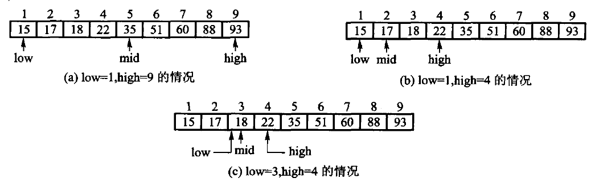
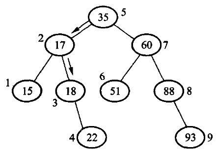
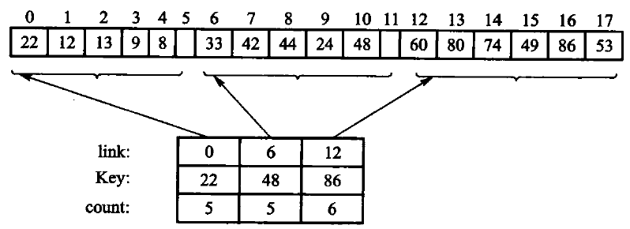
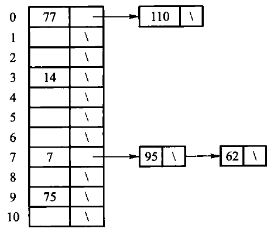

# 第10章 检索

“检索”是中文教材的传统术语，现代资料通常写作 **search**；面对索引服务时也常说 query（查询）。

**在一组记录里找到关键码等于给定值的那一条。**

- 10.1 基于线性表：顺序、二分、分块
- 10.2 集合
- 10.3 散列：**用函数直接算出位置**

衡量指标：平均检索长度 $\mathrm{ASL} = \sum P_i C_i$。

---

# 10.1.1 顺序检索

从头比到尾。**对数据没有任何要求**——这是它唯一的优点，也是全部优点。

| 情况 | 比较次数 |
| --- | --- |
| 最好 | 1 |
| 最坏 | n |
| 平均（等概率） | $\frac{n+1}{2}$ |

<!-- 备注
可以追问：如果查询集中在少数几个元素上（比如按热度），平均会小很多。
这就是「自组织线性表」的动机——把刚访问过的往前挪。
-->

---

# 10.1.2 二分检索



**要求已排好序**，每比较一次砍掉一半，$O(\log n)$。

---

# 二分检索：半开区间 trace

有序表 `{1,3,7,8,12,15,18,21}` 查 18：

| 轮次 | `[first,last)` | `middle` | 中值 | 更新 |
| ---: | --- | ---: | ---: | --- |
| 1 | `[0,8)` | 4 | 12 | `first=5` |
| 2 | `[5,8)` | 6 | 18 | 命中 |

查 14 时：

```text
[0,8) → [5,8) → [5,6) → [5,5) → 失败
```

不变量：目标若存在，始终还在 `[first,last)` 中；区间为空才失败。

---

# 二分的一个坑：无符号下溢

```cpp file=code/ch10/search_hash/teaching.hpp#fn:binary_search
// 【算法10.3】二分检索：要求**已排好序**，每比较一次砍掉一半，代价 O(log n)。
//
// 这里用的是**半开区间** [first, last)：`last` 指向"最后一个候选的下一个"。
// 为什么不用书上常见的闭区间 [low, high]？因为闭区间在没找到时要写 `high = mid - 1`，
// 而下标是无符号的，`mid == 0` 时这一句会下溢成一个天文数字。
// 半开区间只写 `last = middle`，永远不减 1，这个坑就不存在。
inline std::optional<std::size_t> binary_search(const std::vector<int>& sorted_values, int key) {
    std::size_t first = 0;
    std::size_t last = sorted_values.size();
    while (first < last) {
        // 写成 first + (last - first) / 2 而不是 (first + last) / 2：
        // 后者在两个下标都很大时会溢出。
        std::size_t middle = first + (last - first) / 2;
        if (sorted_values[middle] == key) {
            return middle;
        }
        if (sorted_values[middle] < key) {
            first = middle + 1;    // 目标在右半边
        } else {
            last = middle;         // 目标在左半边
        }
    }
    return std::nullopt;
}
```

<!-- 备注
两处值得讲：

1. **半开区间 [first, last)**。书上常见的闭区间写法在没找到时要写
   `high = mid - 1`，而下标是无符号的，mid == 0 时这一句会下溢成天文数字。
   半开区间只写 `last = middle`，永远不减 1，这个坑就不存在。
   现场可以改一下：ASan/UBSan 当场报越界。

2. `first + (last - first) / 2` 而不是 `(first + last) / 2`——
   后者在两个下标都很大时会溢出。这是个经典的库级 bug（Java 的 binarySearch
   曾经就有）。
-->

---

# 决策树：二分为什么是 $\log n$



每次比较对应树上下降一层，树高就是最坏比较次数。

n 个元素的判定树高度是 $\lceil\log_2(n+1)\rceil$——
**这也是比较模型下检索的下界**：n 个可能的答案至少需要 $\log_2 n$ 次比较区分。

---

# 10.1.3 分块检索



把 n 个元素分成 b 块：**块间有序，块内可以无序**。
另造一张块索引记下每块的最大关键码。

先在索引里找到块，再在块内顺序查。块数取 $\sqrt{n}$ 量级时 ASL 约 $O(\sqrt{n})$——
**介于顺序的 $O(n)$ 和二分的 $O(\log n)$ 之间**。

<!-- 备注
它的适用场合是：主表很大、不能整表排序，但可以按块组织。
第 11 章的索引技术就是这个思路的推广。
-->

---

# 分块检索：先找块，再扫块

```text
块 0: 22 12 13  9  8       max=22
块 1: 33 42 44 24 48       max=48
块 2: 60 80 74 49 86 53    max=86
```

查 44：索引比较 22、48，落到块 1；块内比较 33、42、44。

查 23：也落到块 1，但扫完整块仍失败。
“小于块最大值”只说明**可能在这块**，不说明一定存在。

若索引顺序查、各块等长，代价约为 $b/2+n/(2b)$；
两项平衡得到 $b\approx\sqrt n$。

---

# 10.2 集合

集合只关心「在不在」，不保留重复，也不保证顺序。

所有运算都建立在**「是否属于」**之上：

```text
交集   本集合里凡是对方也有的
包含   对方的每个元素本集合都得有
```

本书的 `IntSet` 故意用线性表 + 顺序检索——
**于是交集是 $O(n \times m)$**。

**10.3 节的散列就是来把那个 $O(n)$ 压成 $O(1)$ 的**，接口一个字都不用改。

---

# 10.3 散列：换一条路

前面的检索都要**和表里的元素比较**，至少看 $\log n$ 或 $\sqrt{n}$ 个。

散列**不比较**：用函数从关键码直接算出槽位下标，期望一次到位。

代价一并写明：

- **不保持次序**，不能按范围遍历
- 装载因子高或散列不均匀时，退化成接近线性

---

# 10.3.1 散列函数

好的散列函数要**算得快**，并且**把地址铺匀**。

常见做法：除留余数（$h(k) = k \bmod m$，m 取素数）、折叠、平方取中。

```cpp file=code/ch10/search_hash/teaching.hpp#fn:elf_hash
// 【算法10.8】ELF 散列：把字符串搅成一个整数。
//
// 逐字节读的是 `unsigned char` 而不是 `char`——`char` 在多数平台上是有符号的，
// 中文等非 ASCII 字节会变成负数，一进位运算就带出符号扩展，散列值随平台而变。
inline std::size_t elf_hash(const std::string& text) {
    std::size_t hash = 0;
    for (unsigned char character : text) {
        hash = (hash << 4U) + character;        // 左移 4 位，腾出位置放新字节
        std::size_t high_bits = hash & 0xF0000000U;   // 溢出到高 4 位的那部分
        if (high_bits != 0) {
            hash ^= high_bits >> 24U;           // 折回低位，别让它白白丢掉
        }
        hash &= ~high_bits;                     // 再把高 4 位清掉
    }
    return hash;
}
```

<!-- 备注
逐字节读的是 **unsigned char** 而不是 char——char 在多数平台上是有符号的，
中文等非 ASCII 字节会变成负数，一进位运算就带出符号扩展，散列值随平台而变。

教学版的测试里有一条拿 UTF-8 的「中」（E4 B8 AD）做输入：
按无符号读得到 0xF02D，按有符号读会被符号扩展成 0xFFFFFF000FFF00DD。
-->

---

# 散列函数怎么选

| 方法 | 适合 | 风险 |
| --- | --- | --- |
| 除留余数 | 整数键 | 模数与数据周期共振 |
| 平方取中 | 数值键 | 仍依赖中间位分布 |
| 分段叠加 | 长数字/字符串 | 分段规律会聚集 |
| ELF 等移位散列 | 字符串 | 仍需处理冲突 |

好散列函数追求：

- 同一关键码结果稳定
- 计算便宜
- 把实际输入均匀铺到槽位

“看起来随机”不等于无冲突；冲突处理始终是散列表的一部分。

---

# 10.3.2 开散列（拉链法）

“开散列”是**经典教材术语**，现代资料通常称 **separate chaining（分离链接）**；“开”指冲突元素放到槽外的链或桶中。



冲突的元素挂成一条链。

- 优点：装载因子可以大于 1；删除简单
- 缺点：额外的指针空间；缓存局部性差

---

# 10.3.3 闭散列（开地址法）

“闭散列”是**经典教材术语**，现代资料通常称 **open addressing（开放地址法）**；所有元素都留在主表槽位中并按探测序列处理冲突。

**所有元素都住在表里**，不另开链表。

关键码先由散列函数算出**基地址**；那一格被占了就往后找——**线性探测**。

```text
表长 7,  插入 3, 10, 17   (三者的基地址都是 3)

槽位   0   1   2   3    4    5    6
内容               [3] [10] [17]
```

---

# 删除：这一节的核心难点

**直接把槽位标成「空」是错的。**

```text
A 和 B 的基地址都是 3
A 占了槽 3,  B 探测一格住进槽 4

删掉 A, 把槽 3 标成空
再查 B:  从槽 3 开始, 看到「空」就认定 B 不在表里
         可 B 明明就在槽 4
```

**探测链被这个空格截断了。**

---

# 解法：墓碑

槽位要有**三种**状态：空、占用、**墓碑**。

```cpp file=code/ch10/search_hash/teaching.hpp#fn:erase
bool erase(int value) {
    std::optional<std::size_t> found = sequential_search(values_, value);
    if (!found) {
        return false;
    }
    values_.erase(values_.begin() + static_cast<std::ptrdiff_t>(*found));
    return true;
}

// 删除：**标墓碑，不标空**。理由见上面类注释里那三行推演。
bool erase(int key) {
    std::optional<std::size_t> found = find_slot(key);
    if (!found) {
        return false;
    }
    slots_[*found].state = SlotState::tombstone;
    --size_;
    return true;
}
```

- **查找**路过墓碑要**继续走**
- **插入**可以**覆盖**墓碑

<!-- 备注
教学版的测试专门守着这条：把 erase 改成标 empty，
「删掉 3 之后 10 还找不找得到」这条断言立刻变红。现场可以演示。
-->

---

# 墓碑探测：删除后为什么不能停

设容量 7，`h(k)=k mod 7`，插入 10、17、24：

```text
槽位: 0 1 2 3  4  5  6
状态: . . . 10 17 24 .
```

删除 17 后若把槽 4 改成“从未使用”，查 24 会在槽 4 提前失败。

正确做法是留下墓碑：

```text
状态: . . . 10  † 24 .
查 24: 3 不等 → 4 是墓碑，继续 → 5 命中
```

插入可记住遇到的第一个墓碑，但仍要继续探测，先确认键并未已存在。

---

# 插入：回收墓碑，但不能提前停

```cpp file=code/ch10/search_hash/teaching.hpp#fn:insertion_slot
// 找插入位置。比查找多做一件事：**记住路上第一个墓碑**。
// 走到「空」时优先返回那个墓碑——回收墓碑，探测链才不会越来越长。
// 但必须先走到「空」或找到同键才能停，否则会把一个已存在的键插第二遍。
std::optional<std::size_t> insertion_slot(int key) const {
    std::optional<std::size_t> first_tombstone;
    for (std::size_t step = 0; step < slots_.size(); ++step) {
        std::size_t index = (home(key) + step) % slots_.size();
        if (slots_[index].state == SlotState::used && slots_[index].key == key) {
            return index;                   // 键已存在
        }
        if (slots_[index].state == SlotState::tombstone && !first_tombstone) {
            first_tombstone = index;
        }
        if (slots_[index].state == SlotState::empty) {
            return first_tombstone ? first_tombstone : std::optional<std::size_t>(index);
        }
    }
    return first_tombstone;                 // 全表没有空格，只能指望墓碑
}
```

**记住路上第一个墓碑，但必须先走到「空」或找到同键才能停。**

提前停会把一个已经在后面的键**插第二遍**。

<!-- 备注
这一条最隐蔽，教学版单列了一个用例：
表里已有 10（在槽 4），槽 3 是墓碑，此时再插 10 必须返回 false。
碰到墓碑就返回的实现会插出两个 10 来。
-->

---

# 10.3.5 效率分析

设装载因子 $\alpha = n/m$：

| 方法 | 成功检索 ASL | 不成功检索 ASL |
| --- | --- | --- |
| 拉链法 | $1 + \alpha/2$ | $\alpha$ |
| 线性探测 | $\frac{1}{2}(1 + \frac{1}{1-\alpha})$ | $\frac{1}{2}(1 + \frac{1}{(1-\alpha)^2})$ |

**注意最后一列**：$\alpha \to 1$ 时它**爆炸**。

所以闭散列表通常在 $\alpha$ 超过 0.5–0.75 时就要扩容重散列。

<!-- 备注
线性探测还有一个问题叫「聚集」：连续被占的一段会越来越长，
因为落在这一段任何位置的新键都会排到段尾，使段更长。
二次探测和双散列就是为了打散聚集。
-->

---

# 10.3.6 什么时候不该用散列

符号表、缓存、去重都常用散列。但选结构要**先问操作**，不要先比复杂度符号。

| 需求 | 用什么 | 为什么不是散列 |
| --- | --- | --- |
| 精确查一个键 | **散列表** | 正是它的长项 |
| 按键从小到大遍历 | 有序表 / 搜索树 | 散列槽位没有关键码顺序 |
| 查 `[low,high]` 范围 | B+ 树 / 有序数组 | 散列不能定位相邻键 |
| 数据很少、更新不频繁 | 线性表 | 实现和内存开销更小 |
| 需要**最坏** $O(\log n)$ | 平衡搜索树 | 普通散列只保证**期望**代价 |

两条容易漏的工程细节：

- 缓存还要处理**容量淘汰**；
- 去重要**保存原始键**，好确认「散列值相同但键不同」的碰撞。

**散列值只是候选地址或摘要，不能代替关键码相等判断。**

---

---

# 课堂讲解卡：搜索方法由信息组织决定

无序表只能顺序查找；有序数组允许二分；哈希表用空间换期望常数时间，但失去顺序和范围查询能力。

---

# 课堂例题：同一批键的三种查询

对键 `3, 8, 11, 15, 21`：分别演示顺序查找、二分查找和哈希查找。删除哈希槽中的第一个键后，观察墓碑为什么不能直接改成空。

---

---

# 课堂例题答案：三种查询

顺序查找逐个比较；二分先比较中点再缩小区间；哈希直接计算槽位。删除冲突序列中的第一个键时必须留下墓碑，否则后续查找遇到空槽会错误停止。

---

# 课末自检

- 二分查找的区间是闭区间还是半开区间？循环不变量是什么？
- 装载因子过高时为什么要扩容重散列？
- 开放地址法删除为何需要墓碑？
- 需要前缀、范围或有序遍历时，为什么哈希表可能不是好选择？

---

---

# 课末自检参考答案

- 半开区间 `[left,right)` 保持目标若存在必在区间内。
- 装载因子过高会增加冲突和探测长度，因此要扩容重散列。
- 墓碑保留探测链连续性。
- 前缀、范围和有序遍历应考虑树或排序数组，而非哈希表。

---

---

# 状态演算：墓碑探测

槽位 3、10、17 冲突并形成探测链。删除 3 后槽 3 标为墓碑；查询 17 遇到墓碑不能停，继续探测到 17 才能成功。

---

# 反例：删除后直接置空

直接置空会让查询在第一个空槽提前返回“不存在”，即使目标键仍在后续槽位。

---

# 课堂练习与答案

课堂练习：装载因子从 0.5 升到 0.9 时会发生什么？答案：探测长度和聚集显著增加，应扩容重散列或改用分离链接。

---

---

# Python 算法轨：搜索与散列

顺序/二分检索、集合和散列表的算法逻辑用 Python 对照；C++ 版本展示墓碑、探测链和对象布局，不能用 `dict` 一行替代。

```python file=code/ch10/search_hash/modern.py#sequential-binary
def sequential_search(values, key):
    for i, value in enumerate(values):
        if value == key:
            return i
    return None

def binary_search(values, key):
    first, last = 0, len(values)
    while first < last:
        middle = first + (last - first) // 2
        if values[middle] == key:
            return middle
        if values[middle] < key:
            first = middle + 1
        else:
            last = middle
    return None
```

---

# 本章小结

- 顺序检索 $O(n)$ 不要求有序；二分 $O(\log n)$ 要求有序；分块 $O(\sqrt{n})$ 折中
- 二分要用**半开区间**，避开无符号下溢；中点用 `first + (last-first)/2`
- 比较模型下检索的下界是 $\Omega(\log n)$
- 散列**不比较**，期望 $O(1)$；代价是不保序、会退化
- 闭散列的删除必须标**墓碑**，否则探测链断掉
- 插入要**回收墓碑**，但不能碰到墓碑就停——会插出重复键

---

# 上机

```bash
python3 tools/check_code.py code/ch10/search_hash
```

故意改坏一处，看哪条断言变红：

- 把二分的 `last = middle` 改成闭区间的 `last = middle - 1`
- 把 `erase` 改成标 `empty` 而不是墓碑
- 让 `insertion_slot` 碰到墓碑就返回
- 把 `elf_hash` 的 `unsigned char` 改成 `char`

> 最后一条只有拿非 ASCII 字节做输入才看得出来——测试里那条用例就是为它写的。
