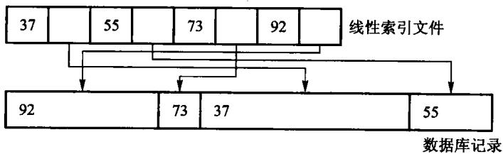
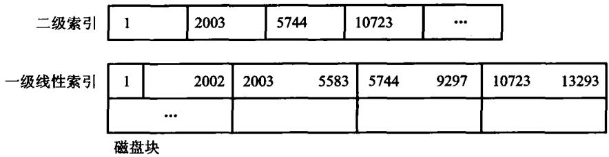
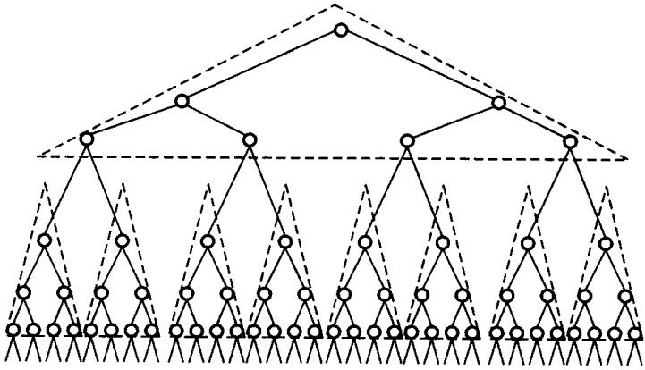
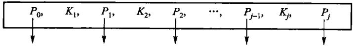
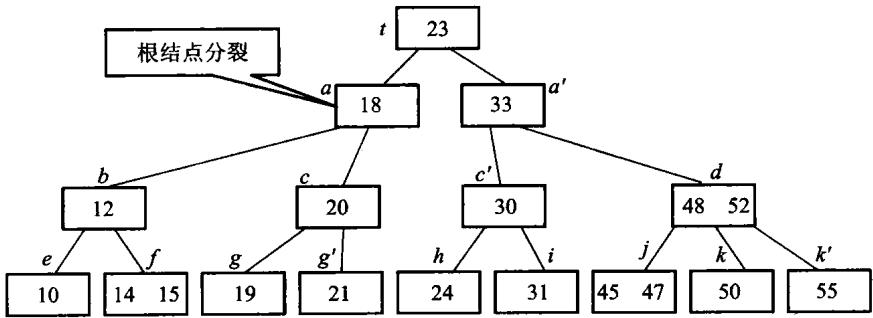
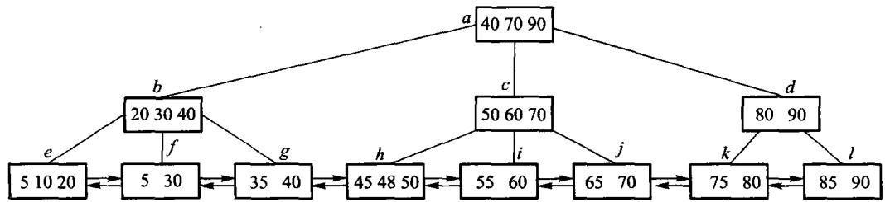
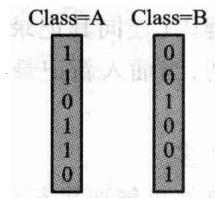

# 第11章 索引技术

**数据在磁盘上时，怎么快速定位。**

- 11.1 线性索引、二级索引
- 11.3 倒排索引
- 11.4 B 树与 B+ 树
- 11.5 位图与签名

一条主线：**每一种索引都在换同一件东西——用附加空间少读几次盘。**

<!-- 备注
第 9 章已经建立了「一次磁盘访问约等于十万次内存访问」这个量级感。
这一章所有设计的动机都是它，可以先回头指一下。
-->

---

# 11.1 线性索引



- **主文件**：记录物理无序、长度可以不等
- **索引**：按关键码**排好序**，每项是 (关键码, 存储位置)

索引小得多，可以整个读进内存二分；数据只在确定位置后读**一次**。

---

# 二级索引：索引本身也放不下怎么办



再给索引建一层索引。二级索引常驻内存，一级索引在盘上。

```text
稠密 2 层索引:
    查不到 -> 读 1 页  (只读了索引页)
    命中   -> 读 2 页  (索引页 + 数据页)
```

**多出来的那一页就是数据页——索引里没有就不必去读。**

<!-- 备注
本书的实现里埋了一个 page_reads() 计数器，把「读了几页」量出来，
上机题就用它。实现见 code/ch11/linear_index/modern.hpp。
-->

---

# 1000 条记录：索引为什么有四层

每个数据页 4 条记录、每个索引页 4 项：

| 层 | 项数/页数 | 算法 |
| --- | ---: | --- |
| 数据页 | 250 页 | $\lceil1000/4\rceil$ |
| 一级索引 | 63 页 | $\lceil250/4\rceil$ |
| 二级索引 | 16 页 | $\lceil63/4\rceil$ |
| 三级索引 | 4 页 | $\lceil16/4\rceil$ |
| 顶层 | 1 页 | $\lceil4/4\rceil$ |

一次查询沿“顶层 → 三级 → 二级 → 一级 → 数据页”下降。
层数由**页扇出**决定，不是由二叉树高度决定。

---

# 11.2 静态索引：多分树



磁盘按页读写，所以**一个索引结点就设计成恰好装满一页**。
二叉树每个结点只有两个孩子，同样多的 key 会把树撑得很高。

覆盖一百万个叶页：二叉树约 **20** 层，100 路树只要 **3** 层。
页内要多比较几个分界 key，但**整页已经在内存里**——比多读一次外存页便宜得多。

---

# 扇出是算出来的，不是拍的

页大小 4096 字节，一项「关键码 + 孩子页号」占 16 字节，扣掉页头 ——
大约放 250 项，**扇出约 251**。关键码变长或页头变大，扇出就掉。

**数据库索引偏爱短关键码，不只为省空间，更为压低树高。**

静态多分树**批量装入时按页填满，之后结构不再变**：

- 插入多出来的记录 → 进**溢出区**，查询多一次 I/O
- 删除 → 页变稀，利用率下降
- 攒够了 → **重组整棵树**

所以它适合「一次建好、很少改」的文件，不适合频繁更新的目录。

<!-- 备注
接下一节的话头：B+ 树把「重组」换成了「就地分裂与合并」。
批量装入这件事本身没被淘汰——`code/ch11/bplus_tree` 的 `bulk_load` 做的正是
「排好序、连续填叶页、用每个孩子的最小 key 建上一层」，
装出来的就是 11.4 那张图的形状。差别只在后续怎么维护。
-->

---

# 11.3 倒排索引

从「文档 → 它含哪些词」翻转成「词 → 它出现在哪些文档」。

```text
文档 1: the quick brown fox
文档 2: the lazy dog

倒排表:
  the    -> [1, 2]
  quick  -> [1]
  brown  -> [1]
  fox    -> [1]
  lazy   -> [2]
  dog    -> [2]
```

**这就是搜索引擎的基础数据结构。**

---

# 倒排表的交并

```cpp file=code/ch11/inverted_index/modern.hpp#fn:intersect
// >>> inverted-intersect
    /// 有序表求交。归并一遍，两个指针各走一趟，代价 O(n+m)。
    [[nodiscard]] static std::vector<int> intersect(const std::vector<int>& left,
                                                    const std::vector<int>& right) {
        std::vector<int> out;
        std::size_t i = 0;
        std::size_t j = 0;
        while (i < left.size() && j < right.size()) {
            if (left[i] < right[j]) {
                ++i;
            } else if (right[j] < left[i]) {
                ++j;
            } else {
                out.push_back(left[i]);
                ++i;
                ++j;
            }
        }
        return out;
    }
```

倒排表**保持有序**，所以求交是「双指针并行走一遍」，$O(n + m)$——
不是 $O(n \times m)$。

<!-- 备注
「AND 查询 = 求交，OR 查询 = 求并」，这就是布尔检索模型。

有序是关键：如果倒排表无序，每次求交都要 O(n*m) 或者先排序。
所以插入时就维持有序，代价摊到建索引的时候。
-->

---

# 倒排表求交：双指针只走一遍

```text
数据: [1, 3, 8, 10]
结构: [2, 3, 8, 11]
```

| 比较 | 动作 | 输出 |
| --- | --- | --- |
| 1 vs 2 | 左指针前进 | 空 |
| 3 vs 2 | 右指针前进 | 空 |
| 3 vs 3 | 两边前进 | 3 |
| 8 vs 8 | 两边前进 | 3,8 |
| 10 vs 11 | 左指针前进并结束 | 3,8 |

代价 $O(m+n)$，不会为每个文档从头重找另一张表。

---

# 短语查询要位置信息

光有「哪些文档含这个词」不够——`"quick brown"` 要求两个词**相邻**。

```cpp file=code/ch11/inverted_index/modern.hpp#fn:phrase_query
/// 短语查询：先求交把候选文档缩小，再用位置是否相邻过滤。
[[nodiscard]] std::vector<int> phrase_query(const std::vector<std::string>& phrase) const {
    if (phrase.empty()) {
        return {};
    }
    std::vector<int> candidates = and_query(phrase);
    std::vector<int> out;
    for (const int doc : candidates) {
        for (const int start : positions_of(phrase.front(), doc)) {
            bool adjacent = true;
            for (std::size_t step = 1; step < phrase.size() && adjacent; ++step) {
                adjacent = has_position(phrase[step], doc, start + static_cast<int>(step));
            }
            if (adjacent) {
                out.push_back(doc);
                break;
            }
        }
    }
    return out;
}
```

<!-- 备注
所以倒排表里每一项还要记这个词在文档里的**位置列表**。
短语查询 = 先求交拿到候选文档，再在候选里检查位置是否连续。

代价：位置信息让索引大好几倍。这又是一次空间换时间。
-->

---

# 11.4 B 树：为磁盘设计的树

第 5 章的二叉搜索树在磁盘上**很糟**：树高 $\log_2 n$，
每下降一层就是**一次磁盘访问**。

$n = 10^6$ 时 $\log_2 n \approx 20$ 次。

**B 树的想法**：把结点做大，让一个结点正好装满一页。

$m$ 阶 B 树的高度是 $\log_m n$——$m = 100$ 时只要 3 层。

---

# B 树的结构



$m$ 阶 B 树：

- 每个结点至多 $m$ 个孩子、$m-1$ 个关键码
- 除根外，每个结点至少 $\lceil m/2 \rceil$ 个孩子（**半满**）
- 所有叶子在**同一层**

「半满」和「叶子同层」这两条一起保证了树高是 $O(\log_m n)$。

---

# 插入导致分裂



结点满了就**从中间劈开**，中间那个关键码升到父结点。

父结点也满就继续往上劈——**根分裂时树才长高一层**。

**B 树是从叶子往上长的**，这是它始终平衡的原因。

---

# B+ 树：数据全在叶子



- 内部结点**只存关键码**（当路标），不存数据
- 数据全部在叶子，叶子之间用指针**串成一条链**

两个直接好处：

- 内部结点更小 → 一页能装更多路标 → 树更矮
- **范围查询**只需定位一次，然后顺着叶子链扫

---

# B+ 树插入 60：分裂传播到根

以 3 阶树为例，叶子装满后插入 60：

```text
1. 沿分隔键下降到目标叶
2. 叶中插入 60，发生溢出
3. 叶分成左右两页，复制右页首键到父页
4. 父页若也溢出，再分裂并把中间分隔键上推
5. 根溢出时新建根，树高增加 1
```

叶分裂保留全部记录并维护横向链；
内部页分裂搬的是导航键与孩子指针。

一次更新只沿根到叶的一条路径传播，不重建整棵树。

---

# 范围查询：B+ 树的看家本领

```cpp file=code/ch11/bplus_tree/modern.hpp#bplus-range
/// 范围扫描：找到下限所在的叶，然后沿叶链横着走，不再回到内部结点。
[[nodiscard]] std::vector<std::pair<int, std::string>> range(int low, int high) const {
    std::vector<std::pair<int, std::string>> out;
    if (low > high) {
        return out;
    }
    const Node* node = root_.get();
    while (!node->leaf) {
        ++reads_;
        node = node->children[child_slot(*node, low)].get();
    }
    while (node != nullptr) {
        ++reads_;
        for (std::size_t i = 0; i < node->keys.size(); ++i) {
            if (node->keys[i] > high) {
                return out;
            }
            if (node->keys[i] >= low) {
                out.emplace_back(node->keys[i], node->values[i]);
            }
        }
        node = node->next;
    }
    return out;
}
```

<!-- 备注
定位到起点 O(log n)，之后每个结果只花 O(1)。
B 树做同样的事要反复中序周游，跨结点时得回到父亲——这就是数据库
几乎一律用 B+ 树而不是 B 树的原因。

本书的实现里同样有 page_reads()/page_writes() 计数器。
-->

---

# 叶子分裂与内部分裂不一样

```text
叶子分裂:   中间那个关键码**复制**一份上去
            (叶子仍然保留它, 因为数据在叶子)

内部分裂:   中间那个关键码**移动**上去
            (内部结点只是路标, 不必留)
```

**这一处最容易写错**，而且写错的表现很隐蔽：
范围查询会漏掉边界上的键，单点查询却全对。

实现见 `code/ch11/bplus_tree/modern.hpp` 的 `split_leaf` 与 `split_internal`。

<!-- 备注
可以现场把「复制」改成「移动」，然后跑范围查询——单点查询依然全绿，
只有范围查询的断言会红。这正是「有牙的测试」该抓到的东西。
-->

---

# 11.4.4 静态索引还是动态索引

| 工作负载 | 更合适 | 原因 |
| --- | --- | --- |
| 几乎只读、可批量重建 | 静态索引 | 紧凑、读路径短 |
| 持续插入删除 | B/B+ 树 | 局部调整保持平衡 |
| 范围扫描多 | B+ 树 | 叶链顺序读取 |
| 物理地址必须稳定 | 静态索引 | 不因分裂搬动旧记录 |

- 静态索引把更新成本推迟到一次昂贵重组
- 动态索引把成本摊到每次分裂、借位与合并

选择的是**由谁、在什么时候支付更新成本**。

---

# 11.5 位图索引



对**取值很少**的字段（性别、州、类别），
给每个取值造一个位向量：第 i 位表示「第 i 条记录是不是这个值」。

```cpp file=code/ch11/bitmap_index/modern.hpp#fn:select_and
// >>> bitmap-ops
    /// 「与」：逐字 `&`。`word_ops()` 数的就是这里做了几次字运算。
    [[nodiscard]] std::vector<std::size_t> select_and(const std::string& a,
                                                      const std::string& b) const {
        return to_records(combine(bitmap(a), bitmap(b), Op::And));
    }
```

**多条件组合退化成按位与**——一次处理 64 条记录。

---

# 位图的代价与压缩

- 字段取值 **少** → 位图小，效率极高
- 字段取值 **多**（比如身份证号）→ 位图数量爆炸，完全不能用

位向量往往极其稀疏（大片的 0），所以要压缩：

```cpp file=code/ch11/bitmap_index/modern.hpp#fn:run_length_encode
// >>> bitmap-compression
/// 字级游程压缩：把连续相同的机器字压成「重复次数 + 字值」两项。
/// 低基数列的位图大片全 0，这样能压得很小；随机稠密位图反而会变大——如实呈现，不粉饰。
inline std::vector<std::uint64_t> run_length_encode(const std::vector<std::uint64_t>& bits) {
    std::vector<std::uint64_t> out;
    std::size_t i = 0;
    while (i < bits.size()) {
        std::size_t run = 1;
        while (i + run < bits.size() && bits[i + run] == bits[i]) {
            ++run;
        }
        out.push_back(static_cast<std::uint64_t>(run));
        out.push_back(bits[i]);
        i += run;
    }
    return out;
}
```

<!-- 备注
游程编码：连续的 0 或 1 记成「值 + 个数」。
真实系统里用的是 WAH / EWAH 这类「能直接在压缩态上做位运算」的编码，
不用解压就能求交——那才是位图索引真正的杀手锏。本书只做到游程编码。
-->

---

# 位图逐位查询与尾部掩码

```text
State=NY : 1 0 1 0 1 0
Class=A  : 1 1 0 1 1 0
AND      : 1 0 0 0 1 0
```

结果是第 1、5 条记录（程序下标 0、4）。

机器实际按 64 位字做 AND/OR/NOT，一次处理 64 条记录。
记录数不是 64 的倍数时，NOT 会把末尾不存在的位也翻成 1，
所以最后一个字必须用 `mask_tail` 清掉越界位。

位图适合低基数属性；学号这类高基数列会生成大量稀疏位图。

---

# 各种索引怎么选

| 场景 | 用什么 |
| --- | --- |
| 主文件无序、记录不等长 | 线性索引 |
| 索引本身也很大 | 二级 / 多级索引 |
| 全文检索、布尔查询 | **倒排索引** |
| 范围查询、有序遍历 | **B+ 树** |
| 低基数字段、多条件组合 | **位图** |
| 只问「在不在」、允许误判 | 签名 / 布隆过滤器 |

---

---

# 课堂讲解卡：索引是在空间与查询之间做交换

索引不保存“更多事实”，而是保存更适合定位的组织方式：线性索引、B/B+ 树解决范围与磁盘访问，倒排索引解决文本词项，位图索引解决低基数过滤。

---

# 课堂例题：一次范围查询的路径

在 B+ 树中先从根走到包含下界的叶子，再沿叶子链顺序扫描到上界；同一查询若用哈希索引，只能定位等值键，无法自然顺序扫描。

---

---

# 课堂例题答案：B+ 树范围查询

从根按分隔键走到包含下界的叶子，在叶子中定位下界后沿叶子链向右扫描到上界。哈希索引可快速等值定位，但不能自然给出连续范围。

---

# 课末自检

- B+ 树为什么把记录集中在叶子？
- 内部结点分裂与叶子分裂传播的内容有何不同？
- 倒排表求交为什么可以用双指针线性完成？
- 选择索引时是否同时考虑选择性、更新成本和存储空间？

---

---

# 课末自检参考答案

- B+ 树记录集中在叶子，内部结点只导航，叶子链支持范围扫描。
- 叶子分裂复制分隔键，内部结点分裂把中间键提升到父层。
- 排序倒排表可用双指针线性求交。
- 选择索引要同时考虑选择性、更新成本和空间。

---

# 本章小结

- 索引的本质：**用附加空间换更少的磁盘访问**
- 线性索引让主文件可以无序、变长；多级索引解决索引本身太大
- 倒排索引把「文档→词」翻转成「词→文档」，交并靠**有序**做到 $O(n+m)$
- B 树把结点做成一页大，树高从 $\log_2 n$ 降到 $\log_m n$
- **B+ 树数据全在叶子且串成链**，所以范围查询只定位一次
- 位图索引适合**低基数**字段，多条件组合退化成按位与

---

# 上机

```bash
python3 tools/check_code.py code/ch11/bplus_tree
python3 tools/check_code.py code/ch11/inverted_index
```

- 用 `page_reads()` 量一量：同样的查询，1 层索引和 2 层索引各读几页
- 在 B+ 树里做一次范围查询，数一数跨了几个叶结点
- 把叶子分裂的「复制」改成「移动」，看范围查询漏掉了什么

> B+ 树的测试里有一条 `validate()`：每次插入删除后都检查
> 「所有叶子同层、每个结点半满、叶子链有序」这三条不变量。
