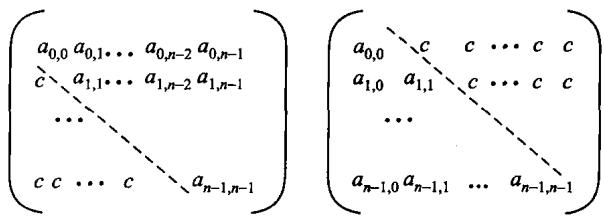
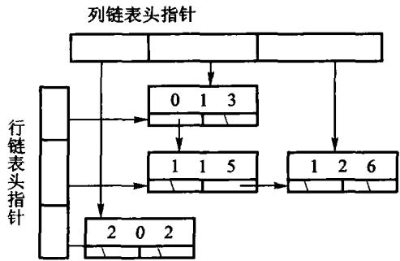

# 第12章 高级数据结构

- 12.1 多维数组：特殊矩阵、稀疏矩阵
- 12.2 广义表与**存储管理**
- 12.3 Trie 与 Patricia
- 12.4 改进的二叉搜索树：最佳 BST、AVL、伸展树

这一章的共同点：**都是在前面某个结构上，为一类特定需求做的改造。**

---

# 12.1.1 多维数组怎么存

二维数组要压成一维，两种次序：

```text
行优先:  a[i][j] 的偏移 = i * n + j        C/C++ 用这个
列优先:  a[i][j] 的偏移 = j * m + i        Fortran 用这个
```

**这不只是约定**：按行遍历一个行优先数组是顺序访存，
按列遍历就是每次跨 n 个元素——**缓存命中率天差地别**。

<!-- 备注
可以给个数量级：大矩阵上，按行遍历和按列遍历的耗时可以差几倍到十几倍，
而两者的渐进复杂度完全一样。这又是「渐进分析不是全部」的例子。
-->

---

# 三维数组地址：逐维算贡献

`int A[2][3][4]` 的 `A[1][2][3]`：

| 维 | 下标 | 后续维乘积 | 元素偏移贡献 |
| --- | ---: | ---: | ---: |
| 0 | 1 | $3\times4=12$ | 12 |
| 1 | 2 | 4 | 8 |
| 2 | 3 | 1 | 3 |
| 合计 | | | 23 |

若 `int` 占 4 字节，字节偏移是 $23\times4=92$。

霍纳写法：`((1 * 3 + 2) * 4 + 3) * 4`。
定位前仍要逐维检查边界；公式不会替程序发现越界。

---

# 12.1.2 特殊矩阵：只存有用的



对称矩阵、三角矩阵有大量重复或恒为常数的元素。
只存一半，用一个下标映射函数找回来：

```text
下三角 (i >= j):   偏移 = i*(i+1)/2 + j
```

空间从 $n^2$ 降到 $n(n+1)/2$，**代价是每次访问多算一次下标**。

---

# 12.1.3 稀疏矩阵：十字链表



非零元素极少时，只存非零元。每个结点同时挂在**行链**和**列链**上。

```cpp file=code/ch12/sparse_matrix/modern.hpp#fn:get
[[nodiscard]] int get(std::size_t row, std::size_t col) const {
    check(row, col);
    for (const Node* p = row_heads_[row]; p != nullptr && p->col <= col; p = p->right) {
        ++steps_;
        if (p->col == col) {
            return p->value;
        }
    }
    return 0;  // 没有存的位置就是零，不是错误
}
```

<!-- 备注
「十字」就是指每个结点有两根指针：右指针连同一行的下一个，
下指针连同一列的下一个。

代价：按行遍历和按列遍历都是 O(该行/列的非零数)，很快；
但随机访问 a[i][j] 要沿链走，不再是 O(1)。
-->

---

# 十字链表：一次更新维护两条链

非零元：`(0,1,8)`、`(0,4,2)`、`(2,1,5)`、`(3,3,7)`。

| 操作后 | 第 0 行链 | 第 2 行链 | 第 1 列链 | $t$ |
| --- | --- | --- | --- | ---: |
| 初始 | `(0,1,8)→(0,4,2)` | `(2,1,5)` | `(0,1,8)→(2,1,5)` | 4 |
| 覆盖 `(0,1,9)` | `(0,1,9)→(0,4,2)` | `(2,1,5)` | `(0,1,9)→(2,1,5)` | 4 |
| 删除 `(2,1)` | `(0,1,9)→(0,4,2)` | 空 | `(0,1,9)` | 3 |

覆盖不能增加非零元数；删除必须从行链、列链各摘一次。
只改一条链，两个方向看到的就不再是同一个矩阵。

---

# 12.2.1 广义表

表里的元素**可以是原子，也可以是另一张表**：

```text
A = ()              空表
B = (a, (b, c))     第二个元素是子表
C = (a, C)          递归表!
```

树是广义表的特例（子表不共享、不递归）。
**广义表允许共享和递归**——所以它不能用简单的递归析构。

---

# 12.2.2 共享带来的问题：什么时候能删

一张子表可能被多张表引用。**谁负责释放？**

```cpp file=code/ch12/gen_list/modern.hpp#fn:release
static void release(GenNode* node) noexcept {
    // 计数归零才真正删除；共享的子表因此只会被删一次。
    while (node != nullptr && --node->refs == 0) {
        GenNode* const head = node->head;
        GenNode* const tail = node->tail;
        delete node;
        // 表尾用循环走，长表不会把栈压穿；表头递归，深度由嵌套层数决定。
        release(head);
        node = tail;
    }
}
```

答案：**引用计数**。每被引用一次加一，释放一次减一，减到 0 才真删。

<!-- 备注
这就是 shared_ptr 的原理。但本书**手写**它，因为 12.2 的教学点正是
「共享的存储怎么管」——用 shared_ptr 就把这一节删掉了。

引用计数有个著名的软肋：**收不回环**。C = (a, C) 这种递归表，
引用计数永远不会归零。所以才有下一节的标记-清扫。
-->

---

# 12.2.3 可利用空间表

系统的 `new`/`delete` 太通用也太慢。**固定大小**的结点可以自己管：

```text
把释放的结点串成一条链  ->  「可利用空间表」
分配: 从链头摘一个       O(1), 不回到系统分配器
释放: 挂回链头           O(1)
链空了才向系统要一批
```

这就是**对象池**。代价：内存不还给系统。

实现见 `code/ch12/optimal_bst/modern.hpp` 的 `ReusableNodePool`。

<!-- 备注
适用前提是**结点大小固定**——这样任何一个空闲结点都能满足任何一次分配，
不需要挑，也不会产生碎片。下一页讲大小不定时怎么办。
-->

---

# 可利用空间表：句柄怎样复用

容量为 3 的槽池：

| 动作 | 槽 0 | 槽 1 | 槽 2 | 下一可用 |
| --- | --- | --- | --- | --- |
| 初始 | 空 | 空 | 空 | 0 |
| `acquire(A)` | A | 空 | 空 | 1 |
| `acquire(B)` | A | B | 空 | 2 |
| `release(0)` | 空 | B | 空 | 0 |
| `acquire(C)` | C | B | 空 | 2 |

旧句柄 0 在归还时已经失效；后来同值句柄代表新的占用期。

`release` 必须先检查槽位确实被占用，否则重复归还会让空闲栈出现两个 0。

---

# 变长块的分配策略

块大小不定时，从空闲块里挑哪一个？

| 策略 | 做法 | 特点 |
| --- | --- | --- |
| **首次适配** | 从头找第一个够大的 | 快；小碎片堆在前端 |
| **最佳适配** | 找最接近的 | 省空间；产生大量极小碎片 |
| **最差适配** | 找最大的 | 剩下的块还够用；大块很快耗尽 |

```cpp file=code/ch12/memory_allocator/modern.hpp#fit-strategies
/// 从空闲区里挑哪一块，原书 12.2.3 给了三种经典策略：
///
/// | 策略 | 挑哪块 | 后果 |
/// | --- | --- | --- |
/// | 首次适应 First | 从头扫，第一块够大的就用 | 最快；小碎片会在低地址堆积 |
/// | 最佳适应 Best | 刚好够用的**最小**块 | 省下的大块留着；剩下的碎片最碎 |
/// | 最坏适应 Worst | 当前**最大**的块 | 剩下的还大到能再用；大块很快被拆光 |
///
/// 三者只在「挑哪一块」这一步不同，分裂与合并完全一样。判断实现有没有写对，
/// 唯一的办法是造一组**大小不同的空闲块**，看三种策略是不是挑了不同的那一块——
/// 只在一块空闲区上测，三种策略的结果必然相同，那样的测试等于没写。
enum class Fit { First, Best, Worst };
```

---

# 释放：相邻空闲块要合并

```cpp file=code/ch12/memory_allocator/modern.hpp#fn:coalesce
/// 与左右两侧的空闲块合并。**先合右再合左**：先处理右边，左边的下标才不会失效。
/// 不合并的话，外部碎片只会越积越多——这是本节的正题。
void coalesce(std::size_t index) {
    if (index + 1 < blocks_.size() && blocks_[index + 1].free) {
        blocks_[index].size += blocks_[index + 1].size;
        blocks_.erase(blocks_.begin() + static_cast<std::ptrdiff_t>(index) + 1);
    }
    if (index > 0 && blocks_[index - 1].free) {
        blocks_[index - 1].size += blocks_[index].size;
        blocks_.erase(blocks_.begin() + static_cast<std::ptrdiff_t>(index));
    }
}
```

不合并的话，一段连续内存会被切成越来越多的小块，
最后「总空闲量很大，却分配不出一个中等块」——**外部碎片**。

<!-- 备注
边界标识法（boundary tag）：在每块的头尾各放一个标记，
这样释放时可以 O(1) 地看到左右邻居是不是空闲。
本书的 BoundaryAllocator 就是它。
-->

---

# 12.2.4 标记-清扫：收回环

引用计数收不回环。另一条路：**从根出发，能到达的都是活的，其余全收。**

```cpp file=code/ch12/storage_recovery/modern.hpp#fn:mark
/// 标记阶段用**显式栈**，不用递归——对象图可以很深，
/// 而 GC 恰恰是在内存吃紧时跑的，那时最不该再去吃调用栈（D-001 §2b 同一个判据）。
void mark(const std::vector<Node*>& roots) {
    std::vector<Node*> pending;
    for (Node* root : roots) {
        if (root != nullptr && !root->marked) {
            root->marked = true;
            pending.push_back(root);
        }
    }
    while (!pending.empty()) {
        Node* node = pending.back();
        pending.pop_back();
        for (Node* next : node->edges) {
            if (next != nullptr && !next->marked) {
                next->marked = true;   // 先标记再入栈：环不会让这里转不出来
                pending.push_back(next);
            }
        }
    }
}
```

<!-- 备注
两个阶段：
1. **标记**：从根集合出发做一次可达性遍历，把能到的都打上标记；
2. **清扫**：扫一遍全部结点，没标记的回收，标记的清掉标记等下一轮。

代价：清扫要扫全堆，而且通常要**停下程序**（stop-the-world）。
好处：环能被回收，因为环上的结点从根不可达。

这就是 Java/Go 垃圾回收的最基本形态。
-->

---

# 标记-清扫：无根环也能收回

根集只有 `R → A → B`，另有无根环 `C → D → C`：

| 阶段 | 待处理栈 | 已标记 | 动作 |
| --- | --- | --- | --- |
| 放入根 | A | A | 根先标记再入栈 |
| 弹出 A | B | A、B | 沿边发现 B |
| 弹出 B | 空 | A、B | 标记结束 |
| 清扫 | 空 | A、B | 保留 A、B；回收 C、D |

判生死的是**从根可达**，不是入度或引用数。

一定要先标记再入栈，环与菱形共享才不会反复压入同一结点。

---

# 12.3 Trie：按字符分层

不比较整个键，而是**一层一个字符**往下走。

```text
插入 do, dog, dozen:

        root
         |d
        (d)
         |o
        (o)*         <- do 到此结束
        /   \
      g/     \z
    (g)*     (z)
              |e
             (e)
              |n
             (n)*
```

查找代价只与**键的长度**有关，与集合大小无关。

---

# 最长前缀匹配

```cpp file=code/ch12/trie/modern.hpp#trie-longest-prefix
/// 最长前缀匹配：走到走不动为止，回退到最近的词尾。IP 路由查表就是这个动作。
[[nodiscard]] std::string longest_prefix_of(std::string_view text) const {
    const Node* node = &root_;
    std::size_t best = 0;
    for (std::size_t i = 0; i < text.size(); ++i) {
        if (!is_letter(text[i])) {
            break;
        }
        const Node* next = node->children[index_of(text[i])].get();
        if (next == nullptr) {
            break;
        }
        node = next;
        if (node->terminal) {
            best = i + 1;
        }
    }
    return std::string(text.substr(0, best));
}
```

**走不动就回退到最近一个词尾**——路由表的最长前缀匹配就是这个。

<!-- 备注
Trie 的代价：分支因子大时（比如 26 个字母）结点极其臃肿，
而且大量结点只有一个孩子（长的公共后缀）。

两条改进：
1. 只用 0/1 分支（二叉 Trie），把字符按位拆开；
2. 把「只有一个孩子」的链压成一个结点——这就是 PATRICIA。
-->

---

# Patricia：把单孩子链压掉

```cpp file=code/ch12/trie/modern.hpp#patricia-bits
static bool bit_of(std::string_view key, std::size_t index) noexcept {
    const std::size_t byte = index / 8;
    if (byte >= key.size()) {
        return false;  // 越过关键码长度，一律读 0
    }
    const auto value = static_cast<unsigned char>(key[byte]);
    return ((value >> (7 - index % 8)) & 1U) != 0;
}

static optional_bit first_differing_bit(std::string_view a, std::string_view b) {
    const std::size_t longest = a.size() > b.size() ? a.size() : b.size();
    const std::size_t bits = (longest + 1) * 8;  // +1 让「一个是另一个的前缀」也能分开
    for (std::size_t i = 0; i < bits; ++i) {
        if (bit_of(a, i) != bit_of(b, i)) {
            return {true, i};
        }
    }
    return {};
}
```

每个内部结点记「从第几位开始不同」，**直接跳过公共前缀**。

结点数从「键的总长度」降到「键的个数」。

---

# 12.4.1 最佳二叉搜索树

如果**预先知道**每个键的访问频率，可以让高频键离根更近。

这是一道典型的**动态规划**：

```text
c[i][j] = 键 i..j 构成的子树的最小代价

c[i][j] = min over k in [i,j] (  c[i][k-1] + c[k+1][j]  ) + w[i..j]
                                  左子树       右子树      这段的总频率
```

**最后那项 `w[i..j]` 最难想**：子树整体下沉一层，
里面每个键的深度都加 1，总代价就加上它们的频率之和。

代价 $O(n^3)$，可用四边形不等式优化到 $O(n^2)$。
实现见 `code/ch12/optimal_bst/modern.hpp`。

---

# 最佳 BST：最后一格怎样得到 57

教材权重表的关键区间：

| 区间 | 总权 $w$ | 最优代价 $c$ | 根 |
| --- | ---: | ---: | ---: |
| `[0,1]` | 10 | 10 | 1 |
| `[2,4]` | 13 | 19 | 3 |
| `[0,3]` | 24 | 43 | 2 |
| `[1,4]` | 22 | 40 | 3 |
| `[0,4]` | 28 | **57** | **2** |

整段选根 2：

$$c[0][1]+c[2][4]+w[0][4]=10+19+28=57$$

区间从短到长计算，`root` 表随后负责重建树形。

---

# 12.4.2 AVL 树：靠旋转维持平衡

BST 最坏会退化成一条链。**AVL 的约束**：任何结点左右子树高度差不超过 1。

```cpp file=code/ch12/balanced_trees/modern.hpp#fn:balance_factor
/// 平衡因子：右子树高 − 左子树高。绝对值超过 1 就要旋转。
static int balance_factor(const std::unique_ptr<Node>& node) {
    return node ? height_of(node->right) - height_of(node->left) : 0;
}
```

```cpp file=code/ch12/balanced_trees/modern.hpp#fn:rotate_left
static std::unique_ptr<Node> rotate_left(std::unique_ptr<Node> x) {
    auto y = std::move(x->right);
    x->right = std::move(y->left);
    refresh(x.get());
    y->left = std::move(x);
    refresh(y.get());
    return y;
}

static void rotate_left(std::unique_ptr<Node>& t) {
    auto r = std::move(t->right);
    t->right = std::move(r->left);
    r->left = std::move(t);
    t = std::move(r);
}
```

<!-- 备注
插入后若失衡，只需在**最低的失衡结点**上做一次旋转（单旋或双旋）即可修复，
O(1) 次旋转。删除可能需要一路旋转到根，O(log n) 次。

四种情形：LL 右单旋、RR 左单旋、LR 先左后右、RL 先右后左。
可以在黑板上画一遍 LL 和 LR，另外两种对称。
-->

---

# AVL 四种旋转：最小守门输入

| 插入序列 | 失衡 | 修复后根 | 中序 |
| --- | --- | ---: | --- |
| 3,2,1 | LL | 2 | 1,2,3 |
| 1,2,3 | RR | 2 | 1,2,3 |
| 3,1,2 | LR | 2 | 1,2,3 |
| 1,3,2 | RL | 2 | 1,2,3 |

只测中序不够：退化链的中序也正确。

还要检查根、高度与每个结点的平衡因子，
才能证明旋转真的发生、且树高恢复为 2。

---

# 12.4.3 伸展树：不存平衡信息

AVL 每个结点要存高度或平衡因子。**伸展树一个字节都不存。**

规则：**每次访问一个结点，就把它旋转到根**（splay）。

```text
zig       父亲就是根        -> 单旋一次
zig-zig   与父亲同向        -> 先转**父亲**, 再转自己
zig-zag   与父亲异向        -> 先转自己, 再转自己
```

**关键是 zig-zig 那一行**：先转父亲再转自己，而不是连着转两次自己。
正是这个「成对」让树的深度被摊还地压下来。

单次可能 $O(n)$，但**任意 m 次操作的摊还代价是 $O(m\log n)$**。

<!-- 备注
额外好处：刚访问过的元素在根附近，天然适合有局部性的访问模式——
这一点 AVL 给不了。
实现见 code/ch12/balanced_trees/modern.hpp 的 splay。
-->

---

# 伸展：一字形与之字形

- 一字形：目标、父、祖父连续同向，先转祖父再转父
- 之字形：方向相反，先转父再转祖父
- 只差一层到根：做一次单旋转

两种双旋都把目标提升两层，但重排其余结点的方式不同。

访问链 `10 → 20 → 30` 中的 30 是右–右一字形；
若 10 的右孩子是 30、30 的左孩子是 20，访问 20 是右–左之字形。

**均摊 $O(\log n)$ 不等于单次都快**：
一次访问仍可达 $O(n)$，保证的是一串操作的总成本。

---

# 三种改进的 BST 对照

| | 最佳 BST | AVL | 伸展树 |
| --- | --- | --- | --- |
| 需要什么 | **预知**访问频率 | 每结点存平衡信息 | 什么都不存 |
| 单次代价 | $O(\log n)$ | $O(\log n)$ | 最坏 $O(n)$ |
| 摊还代价 | — | $O(\log n)$ | $O(\log n)$ |
| 构造 | $O(n^3)$ 动态规划 | 边插边转 | 边访问边转 |
| 适合 | 静态、频率已知 | 通用 | 访问有**局部性** |

---

# 本章小结

- 多维数组的存储次序影响**缓存**，渐进复杂度看不出来
- 稀疏矩阵用十字链表：行列遍历快，随机访问变慢
- 广义表允许**共享和递归** → 引用计数管共享，标记-清扫收环
- 变长块分配要选**适配策略**，释放要**合并相邻空闲块**
- Trie 的代价只与**键长**有关；Patricia 压掉单孩子链
- 最佳 BST 用动态规划；AVL 靠旋转；**伸展树什么都不存，靠摊还**

---

# 上机

```bash
python3 tools/check_code.py code/ch12/trie
python3 tools/check_code.py code/ch12/balanced_trees
```

- 给同一组键分别建 Trie 和 Patricia，比一比结点数
- 往 AVL 里按**升序**插入 1..1000，量一下树高（对比普通 BST）
- 在伸展树上反复访问同一个键，看它是不是一直在根附近

> 平衡树的测试里有一条不变量检查：每次插入删除后都验证
> 「任何结点左右子树高度差不超过 1」。

---

# 树状数组：动态前缀和

普通数组在“单点修改”和“区间查询”之间只能二选一：

- 原数组：修改 `O(1)`，查询 `O(n)`
- 前缀和：查询 `O(1)`，修改 `O(n)`
- Fenwick：两者都是 `O(log n)`，空间 `O(n)`

树状数组仍是一块平坦数组；第 `i` 个内部位置管辖长度 `lowbit(i)` 的区间。

---

# 树状数组：两个 lowbit 方向

- 查询：`i -= lowbit(i)`，把前缀拆成互不重叠的块
- 更新：`i += lowbit(i)`，访问所有包含该位置的块
- `lowbit(i) = i & -i`，内部下标从 1 开始

```cpp file=code/ch12/fenwick/modern.hpp#fn:add
void add(std::size_t index, long long delta) {
    check_index(index);
    values_[index] += delta;
    for (std::size_t cursor = index + 1; cursor <= size(); cursor += lowbit(cursor)) {
        tree_[cursor] += delta;
    }
}
```

教材接口把外部下标改成 0 起始，区间统一为 `[left, right)`，避免把边界规则藏在调用方。
