# 原书插图

> 从只读底稿 `dsa_raw.md` 抽出的 292 张图。字节落在 `book/assets/`，
> alt 来自原书题注；少数图在底稿里没有独立题注，alt 会标明行号。
> 正文各章只引用教学需要的几张；其余集中在本图册，避免把教程拆碎。

## 前言

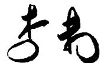

前言插图（底稿第 115 行，原书无独立题注）

## 第1章 概论

图1.1 经纪人间的消息传递图

图1.3 经纪人间消息传递的相邻矩阵

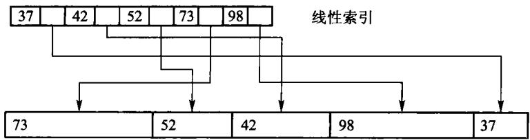

图 1.4 索引示例

图 1.5 常用函数的增长趋势

## 第2章 线性表

图 2.4 单链表示例

图2.5具有头、尾两指针的单链表

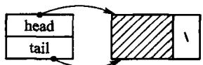

(a) 带有头结点的空表

(b) 典型的带有头结点的单链表；图 2.6 引人头结点的单链表

图 2.7 插入算法示意图

(a) 删除前指针情况；(b) 删除后指针情况；图 2.8 删除示意图

图2.9 加入表头结点的双链表；图2.9中变量head用于指向表首结点，变量tail用于指向表尾结点。图2.10给出了相应的

图 2.10 双链表的结点

图2.11 双链表的删除操作示意

图2.12 双链表插入操作示意

图2.13 循环链表示意图

图2.14 带头结点的循环链表示意图

图 2.15 循环双链表示意图

## 第3章 栈与队列

图 3.1 栈的示意图

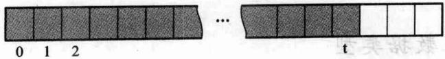

图3.2 栈的顺序存储结构示意

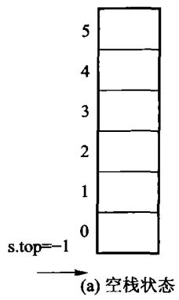

第3章插图（底稿第 1898 行，原书无独立题注）

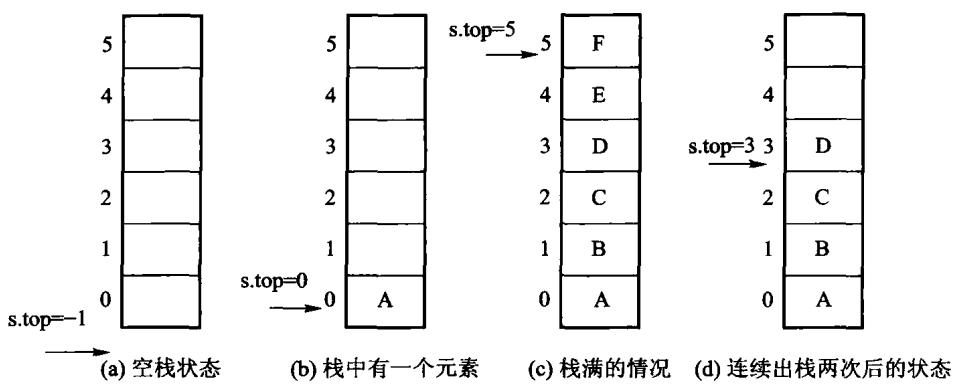

图 3.3 顺序栈的存储结构

图3.4 链式栈示意

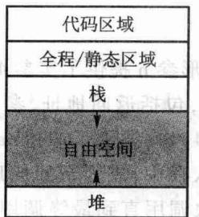

图3.6 运行时存储器的组织形式

图 3.7 活动记录的内容

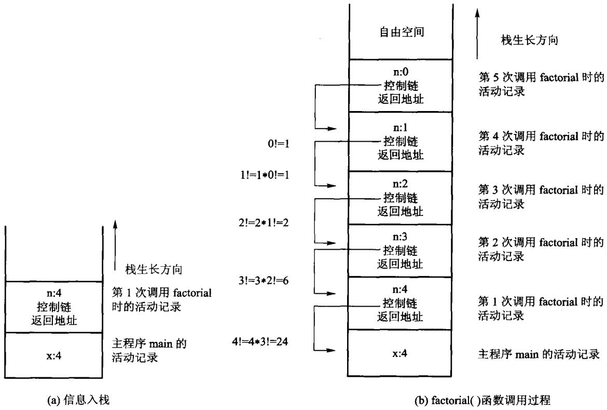

图3.8 递归计算factorial(4)时，内部栈的变化情况示意

图3.9 队列的示例

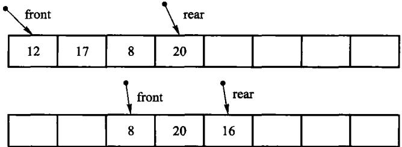

图 3.10 顺序队列的实现示意

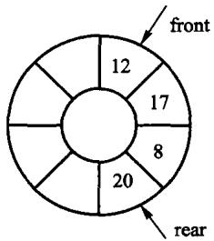

(a) 初始队列

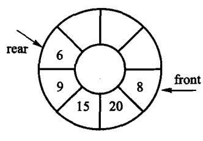

(b) 新队列；图 3.11 顺序队列的一种实现方式

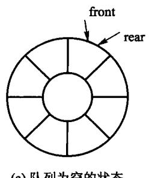

第3章插图（底稿第 2621 行，原书无独立题注）

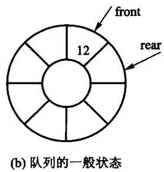

第3章插图（底稿第 2623 行，原书无独立题注）

图 3.12 循环队列的实现示例

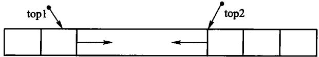

图3.13 存储在同一个数组中的两个迎面增长的栈

## 第4章 字符串

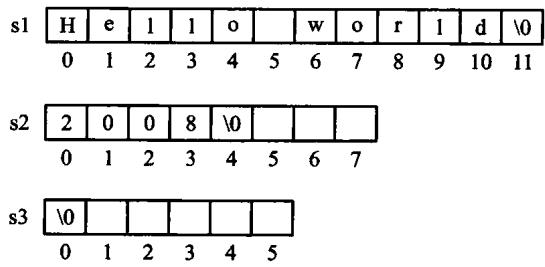

图 4.1 C + + 标准字符串的变量说明示意图

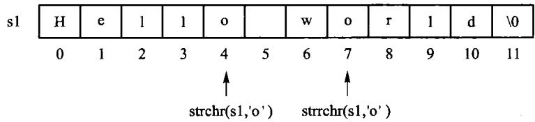

图4.2 在字符串 s1 中寻找并定位给定字符o'的位置

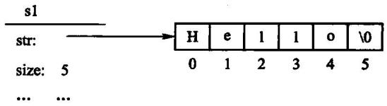

图4.3 创建字符串的示意图

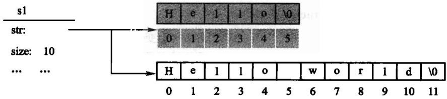

图4.4 赋值运算示意图

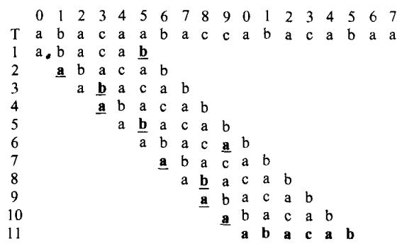

图 4.6 朴素匹配的示例

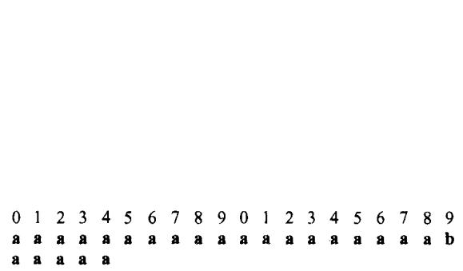

图4.7 朴素匹配的最佳情况示例

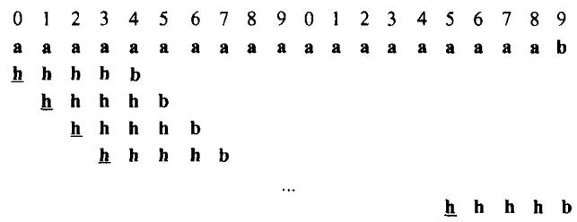

图4.8 匹配失败的最佳情况示例

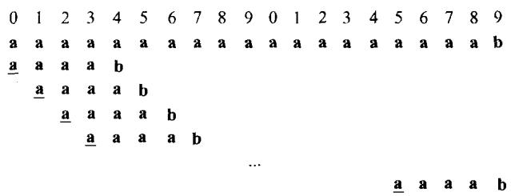

图4.9 朴素匹配最差情况示例

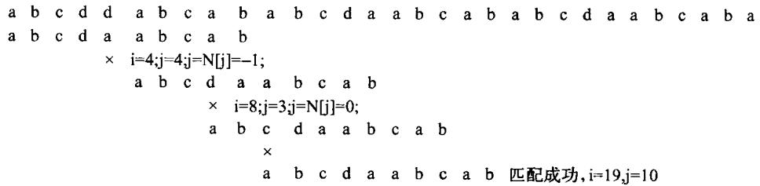

图 4.12 KMP 匹配示例

## 第5章 二叉树

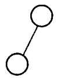

(c) 右子树为空 的二叉树

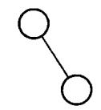

(d) 左子树为空 的二叉树

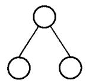

(e) 左、右子树均非空的二叉树；图 5.1 二叉树的 5 种基本形态

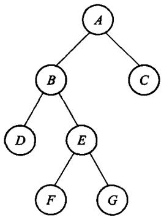

(a) 满二叉树

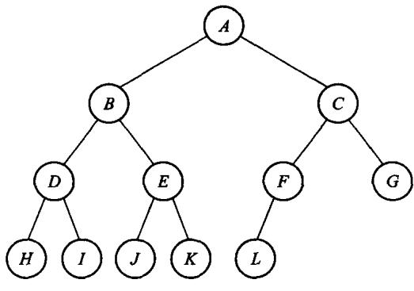

(b) 完全二叉树；图5.2 满二叉树和完全二叉树示例

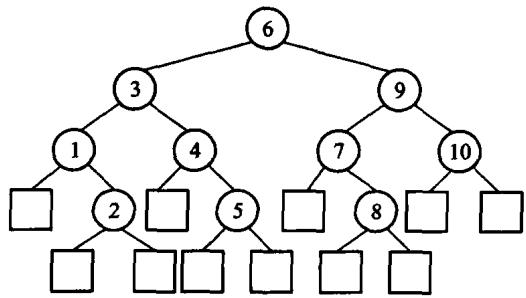

图 5.3 扩充二叉树

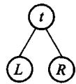

图 5.4 二叉树的基本结构

图 5.5 二叉树示例

图 5.6 表达式树

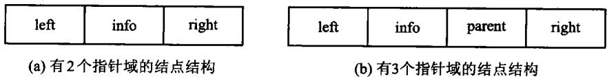

图 5.7 二叉树结点的存储结构

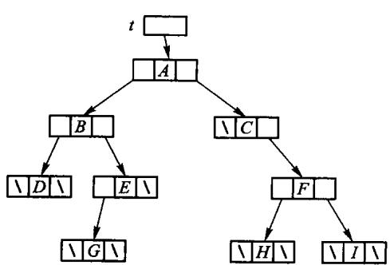

图 5.8 图 5.5 中二叉树的二叉链表存储结构

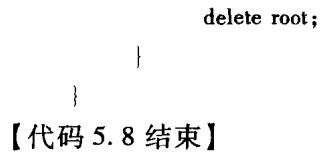

第5章插图（底稿第 4103 行，原书无独立题注）

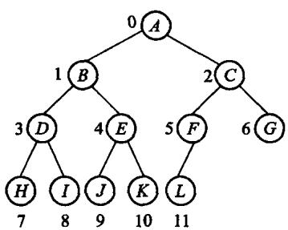

图 5.9 完全二叉树的结点编号

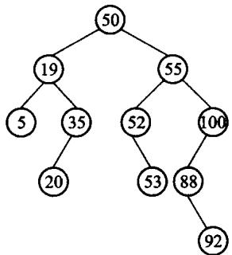

图 5.11 二叉搜索树

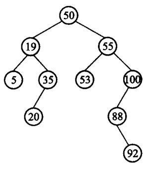

(a) 没有左子树的情况

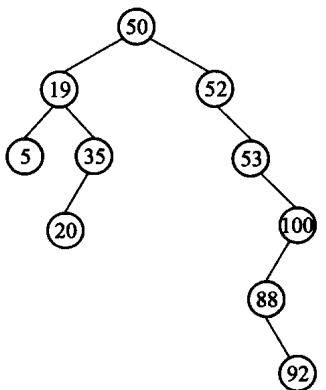

图 5.12 二叉搜索树的删除示例；(b) 有左子树的情况

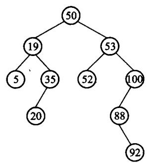

图 5.13 改进的二叉搜索树的删除

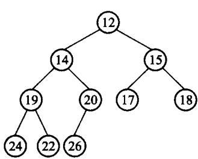

图 5.14 最小堆对应的完全二叉树

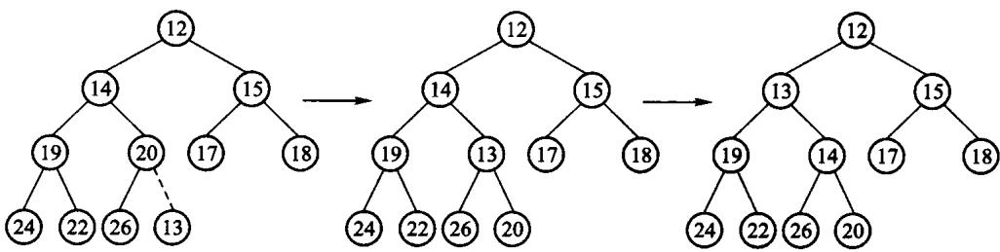

图 5.15 在最小堆 5.14 中插入元素 13

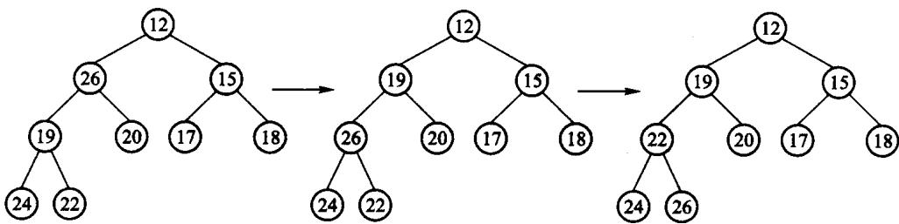

图 5.16 在最小堆 5.14 中删除元素 14

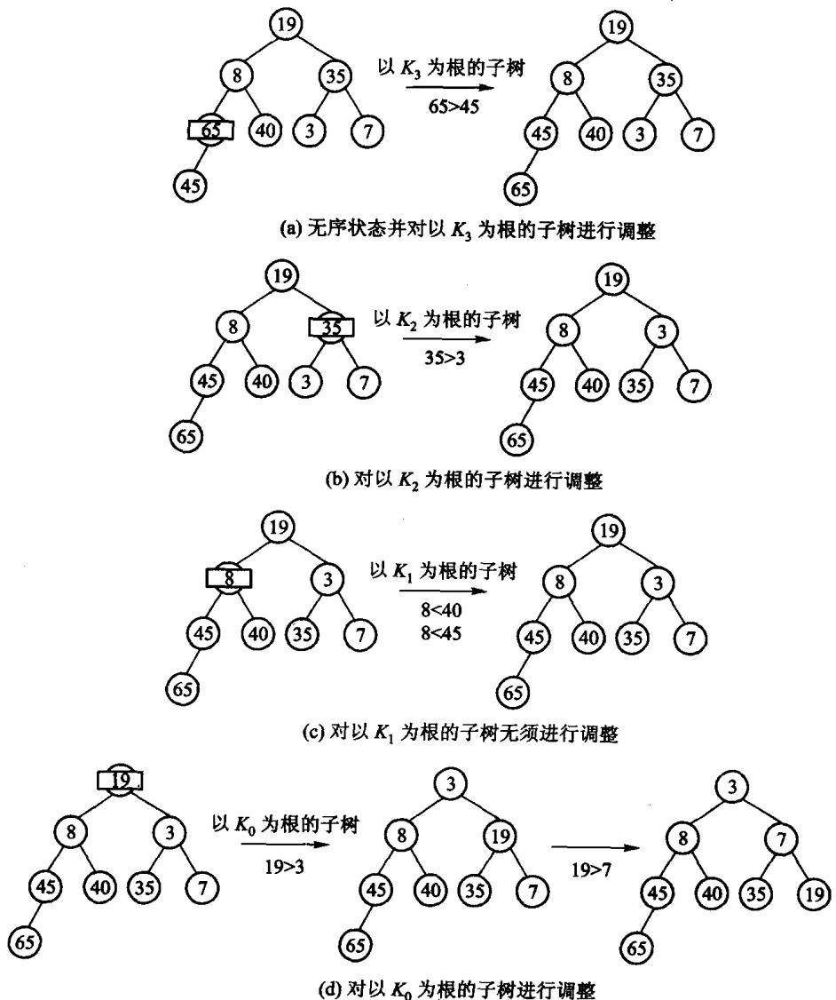

图 5.17 建堆过程示例

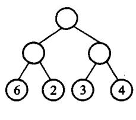

(a) 外部路径为30

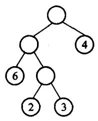

(b) 外部路径为31

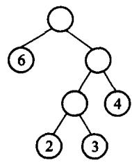

(c) 外部路径为29；图 5.18 具有不同带权外部路径长度的二叉树

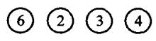

(a) 过程 1

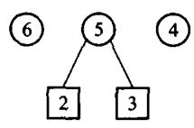

(b) 过程2

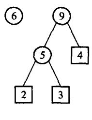

(c) 过程3；(d) 过程4

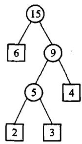

图 5.19 Huffman 树的构造过程

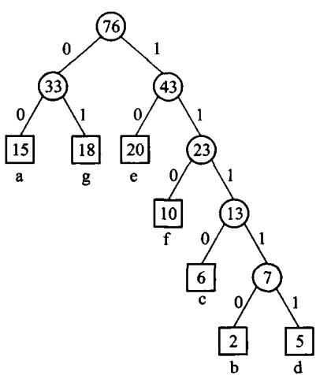

图 5.20 Huffman 编码示例

图 5.21 习题 2 的图例

(a) 原二叉树

(b) 镜面映射后的新二叉树；图 5.22 习题 7 的图例

图 5.23 中序穿线二叉树

## 第6章 树

图 6.1 树形表示法

第6章插图（底稿第 4808 行，原书无独立题注）

图 6.2 树形结构的各种表示法

(a) 由 $\textstyle { T _ { 1 } }$ $T _ { 2 }$ 构成的森林

(b)经连线、切线处理后的二叉树

(c) 进行旋转后的二叉树；图6.3 森林转换为二叉树

第6章插图（底稿第 4874 行，原书无独立题注）

图 6.4 二叉树转换为森林

(a) 森林

第6章插图（底稿第 4959 行，原书无独立题注）

(b) 森林对应的二叉树；图 6.5 森林和对应的二叉树

图6.6 以“子结点表”表示法实现图6.1中的树

图6.7“左子/右兄”表示两棵树

图6.8 使用静态“左子/右兄”实现对树的归并

(a) 树

(b) 树的实现；图6.9 树的动态表示法

图 6.10 父指针表示法

(a) 子集 $s _ { \mathrm { 1 } }$

(b) 子集 $s _ { 2 }$

(c) 并集 S3；图 6.11 集合的表示方法

(a) n 个集合

(b) 合并操作；图 6.12 合并操作的一个极端情况

第6章插图（底稿第 5345 行，原书无独立题注）

图 6.13 路径压缩示例

图6.14 带右链的先根次序表示法

图 6.16 带度数的后根次序表示法

图6.17 带双标记的层次次序表示法

(a) 满 3 叉树

(b) 完全 3 叉树；图 6.18 满 3 叉树与完全 3 叉树

图 6.19 习题 3 的图示

图 6.20 习题 10 的图示

图 6.21 上机题3 的图示

图 6.22 上机题4的图示

## 第7章 图

图 7.1 用图描述通信网络

(a) 无向图 $G _ { 1 }$

(b) 有向图 $G _ { 2 }$；图 7.2 图的示例

第7章插图（底稿第 5704 行，原书无独立题注）

(a) 无向完全图

第7章插图（底稿第 5709 行，原书无独立题注）

(b) 有向完全图；图 7.3 完全图

(a)无向图 $G _ { 1 }$ 的若干子图

(b)有向图 $\pmb { G } _ { 2 }$ 的若干子图；图 7.4 图 7.2 的若干子图

第7章插图（底稿第 5728 行，原书无独立题注）

(a) 非连通的无向图 $G _ { 3 }$

(b) 非连通无向图 $G _ { 3 }$ 的连通分量；图7.5 非连通无向图的连通分量示意图

图 7.6 有向图 $G _ { \imath }$ 的两个强连通分量

(a) 无向图 $G _ { 1 }$ 的生成树

(b) 有向图 $G _ { 2 }$ 的生成树；图7.7 图 7.2 中无向图和有向图的生成树示例

图 7.8 网络实例 $G _ { \mathfrak { a } }$

(a) 有向图

图7.9 有向图及其生成森林；(b)有向图的生成森林

第7章插图（底稿第 5978 行，原书无独立题注）

图 7.12 无向图 $G _ { \mathfrak { t } }$ 的邻接表表示；图 7.13(a)所示为有向图 $G _ { 2 }$ 的邻接表表示。对于有向图，一条弧在邻接表中只出现一次。顶点 $v _ { i }$ 的边表的表目个数是该顶点的出度，因此邻接表也称为出边表；要知道顶点 $\pmb { v } _ { i }$ 的入度，必须遍历整个邻接表，查看有多少个边表目中的顶点(即弧头顶点)为 $\pmb { v } _ { i \circ }$ 为了便于确定顶点结点的入度，可以建立有向图的逆邻接表，如图7.13(b)所示。在有向图的逆邻接表中，顶点 $v _ { i }$ 的边表中表示的是以该顶点为终点的边，因此逆邻接表也称为人边表。逆邻接表中顶点 $v _ { i }$ 的边表的表目个数是该顶点的入度。

图 7.13 有向图 $G _ { \imath }$ 的邻接表和逆邻接表表示

图 7.14 带权图 $G _ { 4 }$ 的邻接表表示

图 7.15 有向图的十字链表示例

图 7.16 有向图 G

第7章插图（底稿第 6191 行，原书无独立题注）

图 7.17 表示课程优先关系的有向无环图

图 7.18 最短路径的示例

图7.19 单源最短路径的示例

图7.20 每对顶点间的最短路径的示例

图 7.22 含(u,v)的回路

第7章插图（底稿第 6463 行，原书无独立题注）

(a) 步骤1

(b) 步骤2

(c) 步骤3

第7章插图（底稿第 6481 行，原书无独立题注）

第7章插图（底稿第 6483 行，原书无独立题注）

图7.24 Prim算法构造图 7.23中带权图的最小生成树的步骤

第7章插图（底稿第 6545 行，原书无独立题注）

第7章插图（底稿第 6547 行，原书无独立题注）

第7章插图（底稿第 6549 行，原书无独立题注）

第7章插图（底稿第 6551 行，原书无独立题注）

第7章插图（底稿第 6553 行，原书无独立题注）

图 7.25 Kruskal 算法构造图 7.23 中带权图的最小生成树的步骤

图 7.26 习题 1 的图例

图 7.27 习题2 的图例

图 7.28 习题 3 的图例

图 7.29 习题 4 的图例

图 7.30 上机题 2 的图例

## 第8章 内排序

图 8.1 插入排序

图 8.2 Shell 排序

第8章插图（底稿第 6971 行，原书无独立题注）

第8章插图（底稿第 6973 行，原书无独立题注）

(b)删除最大值78，用32替代；(c) 重新建堆后得到的序列

(d) 得到新的序列；图 8.4 堆排序

图 8.5 冒泡排序

图 8.6 快速排序图示

图 8.7 分割过程

图 8.8 归并排序

图8.9 桶式排序示意图

(b) 低位优先；图 8.10 基数排序

图 8.11 基于顺序存储和桶排序的基数排序

(b) 第一趟分配结果

(d) 第二趟分配结果

(a) 待排序记录及索引

(b) 排序后的记录；图8.13 索引排序示意图

图8.14 用判定树来模拟基于比较的排序

## 第9章 文件管理与外排序

图9.1 置换选择算法流程

图 9.3 二路归并过程

图9.4 含有5 个选手的赢者树

图 9.5 8 路归并的赢者树

图 9.6 图 9.5 重构后的 8 路归并赢者树

图9.7 8路归并的败者树示例

图 9.8 图 9.7 重构后的 8 路归并败者树

## 第10章 检索

图 10.1 二分检索 K = 18 的过程

图10.2 二分检索的决策树

图 10.3 分块检索的存储表示

图 10.5 例 10.2 中关键码对应的散列表

(a) 移位叠加；(b) 分界叠加；图 10.6 移位叠加和分界叠加

图 10.7 开散列方法的图示

图10.8 散列文件组织

图10.11 用几种不同方法解决碰撞时散列表的平均检索长度

图 10.12 双向有序表

图10.13 液晶七段数码管示意图

第10章插图（底稿第 9825 行，原书无独立题注）

图10.14 封锁方式的相容矩阵；图10.15 封锁管理子系统示意图

## 第11章 索引技术

图11.1 线性索引，图中的数据库记录不等长

图 11.2 二级索引文件

图 11.3 多分树

图 11.4 B 树结点的一般形式

(a) 3阶B树

(b) 画出外部空结点的 3阶 B 树

(c) B 树的隐含指针，其中 $a _ { 1 } \sim a _ { 1 6 }$ 代表关键码所在主文件中具体磁盘块的索引地址；图 11.5 3 阶 B 树

图11.6 在图 11.5的3阶 B 树中插入关键码14、55后的结果

图11.7 在图11.5的 3阶 B 树中插入关键码19后导致根分裂

(a) 5阶B 树

(b)删除120,先与后继交换，删后下溢出，向左邻借关键码

(c)继续删150,先交换，删后下溢出，合并操作传递到根；图11.8 5阶 B树，连续删除关键码120、150示意图6

图 11.9 3 阶 B +树

图 11.10 在图 11.9的 3阶 B +树中插入15后，树增高一层

图 11.11 从图 11.9的 3 阶 B + 树中删除 75 后

图11.12 混合型 B+树，内部结点阶为4,叶结点阶5

图 11.13 在图11.12混合型 B +树(内部结点阶为4,叶结点阶5)中，插入22后的结果

图11.14 在图11.13混合型 B +树(内部结点阶为4,叶结点阶5)中，删除40后的结果

(a)百货销售数据库记录以及 State=NY(纽约州)的位向量

(c) 数据域 Class的位向量集合；图11.15 百货销售数据库记录的位图索引示意

图 11.16 红黑树示意图

图11.17 父结点是红色，叔父结点是黑色的情况，旋转解决红红冲突

图11.18 叔父结点为黑色，进行重构调整每个结点的阶都保持原值，调整完成

图11.19 父结点、叔父结点均为红色，则父和祖换色，然后递归处理方法

图 11.20 红黑树插入示例

图 11.21 情况 1(a):

图11.22 情况1(b):双黑结点与红色侄子同边顺

图11.23 情况2双黑的兄弟结点为黑色，且兄弟结点有两个黑色子结点

图 11.24 情况3双黑的兄弟结点为红色

图11.25红黑树连续删除90、70、80,引起的双黑调整示例

图 11.26 习题 8. 的 3 阶 B 树图示

图 11.27 习题9. 的4阶 B树

图 11.28 习题 10. 的 3 阶 B 树

图 11.29 2 阶 $B ^ { \star }$ 树图示

图 11.30 混合型 $B ^ { + }$ 树，内部结点阶为4、叶结点阶为3

图 11.31 红黑树

## 第12章 高级数据结构

图 12.1 上三角矩阵和下三角矩阵，其中 c为常数

图 12.2 稀疏矩阵的十字链表

图 12.3 纯线性结构表

图 12.4 纯表的树表示

图12.5一个再入表的例子，其中没有标志箭头的边都是指向下方的

图12.6 循环表可以看到这是一个有环图；图12.6中.因为 $L _ { 1 }$ 和 $L _ { 4 }$ 调用自身，导致了回路。其他没有箭头的边，方向都是从上至下的。循环表也可以算作一种存在回路的特殊再入表。

图 12.7 没有头结点的广义表

图 12.8 带头结点的广义表

图12.9 带表头结点的循环广义表

(a) 初始状态的可利用空间表

(b) 系统运行一段时间后的可利用空间表；图12.10 结点等长的可利用空间表

(a) 空闲块的结构

(b) 已分配块的结构；图12.11 存储器看到的块结构

图 12.12 外部碎片和内部碎片

图 12.13 把块 M释放回可利用空间表

图 12.14 无用单元循环引用

图 12.15 BST 的平衡性示意图

图 12.16 一棵二叉 Trie 树

图 12.17 存储单词的 Trie 结构

图 12.18 对 Trie 树的改进

图 12.19 x表示那个位可以为 1 或者 0

图 12.20 最后得到的 PATRICIA Trie 结构

图 12.21 二叉搜索树

图 12.22 关键码与图 12.21 相同的是一棵 BST

图 12.23 扩充二叉树

图 12.24 最佳二叉搜索树

图12.25 退化为线性的二叉搜索树

图12.26 具有不等权结点的二叉搜索树

图 12.27 构造最佳二叉搜索树的过程

(a) 一棵 AVL 树

(b) 非 AVL 树的 BST；图 12.28 AVL 树与非 AVL 树

图 12.29 带平衡因子的 AVL 树

(a) 被破坏的AVL树

(b) 重新调整为AVL树；图 12.30 AVL 树的调整示意图

(a) LL不平衡

(b) LR不平衡

(c) RR不平衡

(d) RL不平衡；图12.31 AVL树的不平衡类型。圆圈表示结点；椭圆表示子树，内部符号表示其高度

图12.32 LL型不平衡经过单旋转后重新变成平衡结构，RR型单旋转类似

(b) 中间状态平衡因子无意义

(c) a的平衡因子为-1或0,b的平衡因子为0或+1；图 12.33 RL 型双旋转示意图，LR 型双旋转类似；图 12. 34 是从空 AVL 树开始，顺序插入单词 {cup, cop, copy, hit, hi, his, hia}后得到的 AVL树，单词之间按照字典顺序比较。

图 12.34 AVL 树的插入过程

图 12.35 AVL 树删除之后的平衡操作

(a)删除结点c,则需要使用其中序前驱m

(b) 删除结点g

图 12.36 AVL 树的删除过程

图 12.37 最接近于不平衡的 AVL 树

第12章插图（底稿第 11540 行，原书无独立题注）

(b) 旋转发生以后的树；图12.38 当被展开的结点是根结点的子结点时，才会发生伸展树的单旋转

(a)结点x、结点y、结点z为一字形的树结构

(b) 旋转发生之后的树结构；图12.39 伸展树的一字形旋转

(a)结点x、结点y、结点z为之字形的树结构(b)旋转发生之后的树结构；图 12.40 伸展树的之字形旋转

(d)f、a、g之字形旋转后；(e) a、h单旋转后，a最后成为根结点；图12.41 在伸展树中完成一次检索以后再展开的例子

图12.42 半伸展和全伸展的区别

图12.43 连续两次访问结点T，半伸展树的变化示例

图12.44 外部结点存储记录信息的半伸展树

图 12.45 对图 12.44 连续读 aabg 后，半伸展树的变化过程

图 12.46 习题 17 的 AVL 树

图 12.47 带路径压缩的后缀树

图 12.48 存储词频信息的半伸展树

图12.49 搜索引擎基本架构

图 12.50 Google的 Ajax 输入提示框
