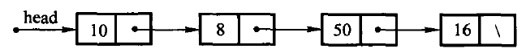
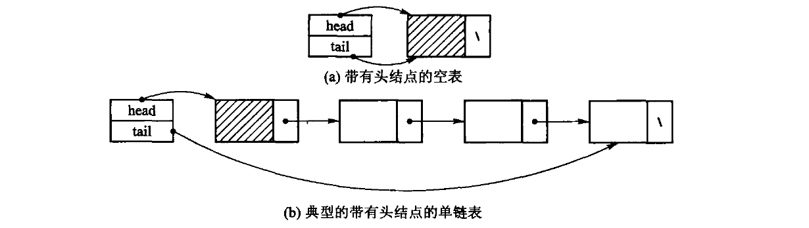

# 第2章　线性表

*Updated 2026-09-05 GMT+8*
 *Compiled by Hongfei Yan (2026 Fall)*
https://github.com/GMyhf/dsa-modernization

> **教材对应**：《数据结构与算法》（张铭、王腾蛟、赵海燕，高等教育出版社 2008）第 2 章
> **主题与学习重点**：线性表的两种存储方式 —— 顺序表与链表 —— 各自的代价来自哪里，
> 以及「自己管内存」的类必须遵守的三法则。

**知识点**：线性表的定义 $(K, r)$ 与结构特点；抽象数据类型与运算的五个类别；
顺序表的类定义、检索、插入、删除与翻倍扩容；**三法则**与二次释放；
单链表的结点、头结点、尾指针与循链定位；双链表；循环链表；两种实现的代价对比与取舍。

**配套材料**

| 类型 | 位置 |
| --- | --- |
| 课件（39 页，16:9） | [`DSA_CH02_Linear_List.pptx`](DSA_CH02_Linear_List.pptx) |
| 视频（720p 轻量版） | [`video/ch02-preview.mp4`](video/ch02-preview.mp4) |
| 书稿正文 | [`../book/ch02-linear-list.md`](../book/ch02-linear-list.md) |
| 顺序表代码 | [`../code/ch02/array_list/`](../code/ch02/array_list/) |
| 链表代码 | [`../code/ch02/linked_list/`](../code/ch02/linked_list/)、[`../code/ch02/doubly_linked_list/`](../code/ch02/doubly_linked_list/) |

本讲义里的每一段 C++ 都摘自上面的代码目录，都在
`-std=c++17 -Wall -Wextra -Werror` 下编译通过并真的跑过。

---

## 本章要回答三个问题

1. **一串同类型元素排成唯一的先后次序，怎么存？** —— 2.2 顺序表、2.3 链表。
2. **为什么同一个操作，在两种结构上代价差一个数量级？** ——
   关键是分清「按位置找元素」和「已知结点后改链接」这两类操作。
3. **自己管着 `new` 出来的内存，最少要写哪几个函数？** —— 三法则。

一句话概括：**顺序表按下标读是 $O(1)$，插删要搬 $O(n)$ 个元素；
链表已知前驱后插删是 $O(1)$，但找到那个前驱仍是 $O(n)$。**

---

## 2.1 线性表的概念

**线性表**（linear list）是由称为**元素**（element）的数据项组成的一种有限且有序的序列。
用第 1 章的二元组 $B = (K, R)$ 写出来就是

$$K = \{k_0, k_1, \cdots, k_{n-1}\}, \quad R = \{r\}, \quad r = \{\langle k_i, k_{i+1} \rangle,\ 0 \le i \le n-2\}$$

- 元素个数 $n$ 称为线性表的**长度**：$n = 0$ 时称空表；
- $k_0$ 称开始结点或**表首**，$k_{n-1}$ 称终止结点或**表尾**；
- 线性关系 $r$ 刻画前驱、后继关系，**具有反对称性和传递性**；
- 逻辑特征：**$K$ 中每个结点在关系 $r$ 上最多只有一个前驱和一个后继。**

线性结构有两个结构特点：

- **均匀性** —— 同一线性表中的各数据元素必定具有相同的数据类型和长度；
- **有序性** —— 各元素在表中都有自己的位置，元素之间的相对位置是线性的。

> 概念上并不反对元素类型不同（例如第 12 章的广义表），但那属于高级线性结构。

同一种线性结构在不同场合有不同称谓：**顺序表、链表、串、栈、顺序文件**；
其中的元素相应地叫表目、结点或记录。一般情况下可作同义词互通使用。

### 运算的五个类别

线性表上的运算按特性可细分为 5 类：

1. 创建线性表的一个实例；
2. 析构，消除实例并释放所占空间；
3. **获取信息**（由内容寻找位置、由位置读取元素内容）—— **不改变表的内容**；
4. **访问并改变**表的内容或结构：更新指定元素、添加、删除、清空；
5. 辅助管理操作，例如求表的当前长度。

本书把这组运算直接定义在 `ArrayList<T>` 上，不再另设一个基类 ——
理由与第 1 章相同：那样的空基类给不了多态，却会带来非虚析构的未定义行为。
要定下来的是**这张表**：

| 运算 | 含义 | 时间代价 |
| --- | --- | --- |
| `at(i)` / `set(i, x)` | 按下标取值、改值 | $O(1)$ |
| `find(x)` | 按内容查位置；找不到返回「没有」 | $O(n)$ |
| `insert(i, x)` | 在位置 i 插入 | $O(n)$ |
| `append(x)` | 在表尾追加 | 摊还 $O(1)$ |
| `remove(i)` | 删除位置 i 上的元素并把它带回来 | $O(n)$ |
| `size()` / `empty()` / `clear()` | 长度、判空、置空 | $O(1)$ |

### 原书【代码2.1】的两处硬伤

原书用一个类模板 `List<T>` 来写这组运算。那份清单有两处**今天必须改**：

1. 它声明了 `bool delete(const int p);` —— **`delete` 是 C++ 关键字**，不能作函数名。
   整章的删除操作都建立在这个编译不过的名字上。
2. 它写的是 `class List { void clear(); ... };`，**通篇没有 `public:`**。
   `class` 的默认访问权限是 private，于是这个抽象数据类型的**每一个运算都调不到**。
   （同一本书第 3 章的代码3.1 是写了 `public:` 的。）

> 第 2 点尤其值得停一下：抽象数据类型的意义就是**对外**给出一组运算。
> **一个所有运算都私有的 ADT，在语法上成立、在语义上是空的。**

原书在【代码2.1】之外还给出一组「当前位置（position）」运算：`setPos`、`setStart`、
`setEnd`、`prev`、`next`，配合 `getValue` 依次处理每个元素。
本书用**迭代器**（`begin()` / `end()` 加 range-for）达到同一目的，
好处是不必在容器里额外存一个「当前位置」状态 —— 理由见 2.2.1。

### 两类存储结构

线性表的存储结构本质上是**逻辑结构到存储空间的映射**：不仅要为结点集合到存储器单元
建立映射，同时还要为元素之间的线性关系到存储单元地址间的关系建立映射。

1. **定长的顺序存储结构**，简称**顺序表**。分配一块连续的存储空间，以「物理位置相邻」
   表示元素之间的关系。不足是限制了线性表的长度变化。见 2.2 节。
2. **变长的链接式存储结构**，简称**链表**。用指针表示元素之间的线性关系；对表长不加限制，
   需要新元素时可以方便地申请空间并链接到合适位置。见 2.3 节。

---

## 2.2 顺序表

### 先跑一遍

```cpp
ArrayList<int> values;
values.append(10);
values.append(30);
values.insert(1, 20);          // 要把 30 右移一位 —— 顺序表的固有代价

for (int value : values) {     // 有 begin()/end()，range-for 直接可用
    std::cout << ' ' << value;
}

if (auto pos = values.find(20)) {           // find 返回 optional
    std::cout << "\n查找 20 的下标: " << *pos << '\n';
}

std::cout << "删除位置 1 得到 " << values.remove(1);
```

```bash
c++ -std=c++17 -Wall -Wextra -Werror -Icode/ch02/array_list \
    code/ch02/array_list/demo.cpp -o /tmp/list-demo && /tmp/list-demo
```

```console
顺序表: 10 20 30
查找 20 的下标: 1
删除位置 1 得到 20，剩余: 10 30
```

### 2.2.1 顺序表的类定义

原书【代码2.2】用四个成员表示顺序表：`T* aList`、`int maxSize`、`int curLen`、`int position`。
前三个对应缓冲区、容量、当前长度，教学版一一对应（改用 `std::size_t`，
因为「负下标」不该在类型层面存在）。

```cpp
template <typename T>
class ArrayList {
public:
    explicit ArrayList(size_type initial_capacity = 8)
        : data_(new T[initial_capacity]), capacity_(initial_capacity), size_(0) {}

    ~ArrayList() { delete[] data_; }
    // ... 三法则的另外两个见下文

private:
    T* data_;             // 指向底层数组      —— 原书 T* aList
    size_type capacity_;  // 数组能放多少个    —— 原书 int maxSize
    size_type size_;      // 现在放了几个      —— 原书 int curLen
};
```

#### 第四个成员 `position` 为什么删掉

`position` 是个**当前处理位置游标**，配合 `setPos / setStart / next / prev`
用来「依次处理元素」。这个设计今天不能要 —— **遍历状态一旦住进容器**：

- `const` 对象就没法遍历（游标要改）；
- 两处代码不能同时遍历；
- **嵌套遍历直接互相踩**。

本书删掉这个成员，改为提供 `begin()` / `end()`，把遍历状态交回调用方，
range-for 因此可以直接用在顺序表上。

> 顺带一提：原书那个 `position`，在书中展示的所有算法里**一次都没被用到**。

#### 为什么用裸指针而不是 `unique_ptr`

缓冲区是**裸指针**，于是这个类自己管着资源，就必须遵守三法则（下一小节）。
这里不用 `std::unique_ptr<T[]>`，是因为**顺序表的存储管理正是本节的教学内容**：
用智能指针时这几个函数编译器生成的就够用，学生看不到它们为什么必须存在。

### 2.2.2 顺序表的运算实现

#### 按位置的检索：$O(1)$

```cpp
const T& at(size_type index) const {
    if (index >= size_) {
        throw std::out_of_range("ArrayList::at: 下标越界");
    }
    return data_[index];        // 直接算地址，没有循环
}

void set(size_type index, const T& value) {
    if (index >= size_) {
        throw std::out_of_range("ArrayList::set: 下标越界");
    }
    data_[index] = value;
}
```

原书的 `getValue` 用「出参 + bool」，越界时打印一行再返回 `false`。
教学版把越界当**错误**处理，抛 `std::out_of_range` ——
**下标非法是调用方的错误，不是可预期状态**，所以不用 `optional`。

#### 按内容的检索：$O(n)$，而且要说清「没找到」

```cpp
std::optional<size_type> find(const T& value) const {
    for (size_type i = 0; i < size_; ++i) {
        if (data_[i] == value) {
            return i;
        }
    }
    return std::nullopt;
}
```

原书【算法2.3】用 `bool getPos(int& p, const T value)`：结果和「有没有结果」
走两条通道，**忘了看返回值就会读到一个从没被写过的 `p`**，而编译器什么都不会说。
这里「找没找到」是返回值类型的一部分。

#### 插入：搬 $O(n)$ 个元素

```cpp
void insert(size_type pos, const T& value) {
    if (pos > size_) {                       // pos == size() 就是追加到表尾
        throw std::out_of_range("ArrayList::insert: 插入位置非法");
    }
    if (size_ == capacity_) {
        grow();
    }
    for (size_type i = size_; i > pos; --i) {
        data_[i] = data_[i - 1];             // 从后往前搬，否则会自己覆盖自己
    }
    data_[pos] = value;
    ++size_;
}

void append(const T& value) { insert(size_, value); }
```

> ⚠️ **「从后往前搬」不是风格问题。** 反过来写（从 `pos` 开始往后覆盖），
> 第一步就把后面的数据抹掉了，整段变成 `pos` 处那一个值的复制。

#### 删除与扩容

```cpp
T remove(size_type pos) {
    if (pos >= size_) { throw std::out_of_range("ArrayList::remove: 下标越界"); }
    T removed = data_[pos];
    for (size_type i = pos; i + 1 < size_; ++i) {
        data_[i] = data_[i + 1];             // 后面的元素左移一位
    }
    --size_;
    return removed;
}

void grow() {                                // 私有
    size_type next = (capacity_ == 0) ? 1 : capacity_ * 2;
    T* fresh = new T[next];
    for (size_type i = 0; i < size_; ++i) { fresh[i] = data_[i]; }
    delete[] data_;      // 先搬完再释放旧的，顺序反了就会读到已释放的内存
    data_ = fresh;
    capacity_ = next;
}
```

**翻倍而不是加一**，才能让 `append` 的摊还代价保持 $O(1)$：
从 0 增长到 $n$ 一共搬 $1 + 2 + 4 + \cdots + n < 2n$ 个元素，平摊到 $n$ 次追加上是常数。
若每次只加一，总搬运量是 $O(n^2)$。

### 三法则

> **三法则（Rule of Three）**：一个类只要写了**析构函数、拷贝构造、拷贝赋值**
> 中的任意一个，通常这三个都得写。

理由很直白：

- 你之所以要写**析构函数**，是因为你在**管资源**；
- 既然在管资源，编译器那份「逐成员照抄」的拷贝就**一定是错的**；
- 照抄一个指针成员的结果是**两个对象指向同一块内存**，
  各自析构时各释放一次 —— **同一块内存被释放两次**。

原书 `arrList` 正是如此：**有析构函数，却没有拷贝构造与拷贝赋值**。
一句普通的 `arrList<int> b = a;` 就会二次释放 ——
与第 3 章 `arrStack` 是同一个错误，同一份 ASan 报告可以复现。

```cpp
ArrayList(const ArrayList& other)
    : data_(new T[other.capacity_]), capacity_(other.capacity_), size_(other.size_) {
    for (size_type i = 0; i < size_; ++i) {
        data_[i] = other.data_[i];              // 深拷贝：各自一块内存
    }
}

ArrayList& operator=(const ArrayList& other) {
    if (this == &other) { return *this; }       // 自赋值：a = a
    T* fresh = new T[other.capacity_];          // 先申请新的
    for (size_type i = 0; i < other.size_; ++i) { fresh[i] = other.data_[i]; }
    delete[] data_;                             // 成功了再释放旧的
    data_ = fresh;
    capacity_ = other.capacity_;
    size_ = other.size_;
    return *this;
}
```

> ⚠️ 注意赋值的**顺序**：先申请、拷完、再释放旧的。
> 倒过来写（先 `delete[]` 再 `new`），`new` 抛异常就把原对象也毁掉了。

### 顺带看一眼原书的 `clear()`

原书写的是：

```text
void clear() { delete [] aList; curLen = position = 0; aList = new T[maxSize]; }
```

释放整块再重新分配。两个问题：

- **没必要** —— 把长度归零即可，容量留着复用；
- **不是异常安全的** —— 若 `new` 抛异常，对象就停在「指针已释放、长度已归零」的
  破碎状态，之后析构还会**再 `delete[]` 一次**。

教学版的 `clear()` 只有一行：`void clear() { size_ = 0; }`。

---

## 2.3 链表

顺序表用**物理相邻**表示逻辑相邻，所以按下标读取是 $O(1)$，
但中间插入和删除需要搬动后续元素。链表把逻辑相邻写进结点的**链接域**：
结点可以散落在内存中；**给定一个前驱结点后，插入或删除只改常数条指针。**

代价也必须如实保留：**要按位置找到那个前驱，仍须从表头循链**，
所以按位置访问、查找、插入和删除的总时间仍是 $O(n)$。



图 2.4　单链表示例。结点分成两部分：`data` 域存真正的数据，`next` 域存后继结点的地址。
终止结点没有后继，`next` 是空指针，图里用「\」表示。

从这张图能读出三件事：

- 访问**只能从表头开始顺着 `next` 走**：`head->next->data` 是 8，
  `head->next->next->data` 是 50；
- **结点在内存中不必两两相邻** —— 这正是链表能以常数条指针完成插入删除的原因；
- **表越长，这条链越长**。

为了让「在表尾追加」不必每次走到底，另设一个指向尾结点的变量 `tail`（图 2.5），
`append()` 因此是 $O(1)$。

### 先跑一遍

```cpp
LinkedList<int> values;
values.append(10);
values.append(30);        // 经尾指针 O(1) 接链，不必从头走到尾
values.insert(1, 20);     // 只改两条链接，但要先循链找到前驱

for (int value : values) { std::cout << ' ' << value; }

std::cout << "删除位置 0 得到 " << values.remove(0);
std::cout << "尾元素是 " << values.at(values.size() - 1);
```

```console
链表: 10 20 30
删除位置 0 得到 10，剩余: 20 30
append 之后尾元素是 30
```

### 2.3.1 单链表

#### 结点与头结点

```cpp
template <typename T>
class LinkedList {
private:
    struct Node {          // 原书【代码2.6】：一个数据域 + 一根指向后继的链接
        T value;
        Node* next;
    };                     // 放在 private：调用方拿不到指针，就改不坏链

public:
    LinkedList() : head_(new Node), tail_(head_), size_(0) {
        head_->next = nullptr;
    }
    // ...
private:
    Node* head_;           // 头结点：不存放数据的哨兵，等价于原书「第 -1 个结点」
    Node* tail_;           // 尾指针：空表时回指头结点
    size_type size_;
};
```



图 2.6　引入头结点的单链表：(a) 带头结点的空表，(b) 一个典型的带头结点的单链表。
带阴影的那个结点就是头结点，它的数据域不算表中元素。

**头结点**（head node）是一个不存放数据的哨兵，永远排在第一个真元素前面。
有了它，表头插入和删除都变成「修改某个前驱的 `next`」，空表也不必另写一套分支。

#### 循链定位

```cpp
Node* predecessor_at(size_type pos) const {
    if (pos > size_) {
        throw std::out_of_range("LinkedList: 下标越界");
    }
    Node* predecessor = head_;          // pos == 0 时前驱就是头结点
    for (size_type i = 0; i < pos; ++i) {
        predecessor = predecessor->next;
    }
    return predecessor;
}
```

**头结点的意义就在 `Node* predecessor = head_;` 这一行。**
没有它，就要为 `pos == 0` 单写一套分支，插入、删除各写一次。

#### 插入与删除

```cpp
void insert(size_type pos, const T& value) {
    Node* predecessor = predecessor_at(pos);      // ① 循链找前驱，O(n)
    Node* fresh = new Node;
    fresh->value = value;
    fresh->next = predecessor->next;              // ② 改两条链接，O(1)
    predecessor->next = fresh;
    if (predecessor == tail_) { tail_ = fresh; }  // 插在表尾，尾指针要跟上
    ++size_;
}

T remove(size_type pos) {
    if (pos >= size_) { throw std::out_of_range("LinkedList::remove: 下标越界"); }
    Node* predecessor = predecessor_at(pos);
    Node* dying = predecessor->next;
    T value = dying->value;
    predecessor->next = dying->next;              // 只改一条链接
    if (dying == tail_) { tail_ = predecessor; }  // 删的是最后一个
    delete dying;
    --size_;
    return value;
}
```

**链表的插入不搬元素，但定位要走。** 这就是链表与顺序表的全部分工。

#### 析构必须循环，不能递归

```cpp
void clear() {
    Node* current = head_->next;
    while (current != nullptr) {        // 沿 next 逐个释放
        Node* dying = current;
        current = current->next;        // 先记下后继，再 delete
        delete dying;
    }
    head_->next = nullptr;
    tail_ = head_;                      // 表空了，尾指针退回头结点
    size_ = 0;
}

~LinkedList() { clear(); delete head_; }
```

> ⚠️ 链长十万级时**递归释放会耗尽运行栈** —— 第 3 章 3.1.5 有实测数字。
> 另外注意 `current = current->next;` 必须写在 `delete dying;` 之前，
> 否则就是从已释放的内存里读指针。

### 2.3.2 双链表


图 2.10　双链表的结点：一个数据域，两根指针 —— `prev` 指前驱，`next` 指后继。

双链结点比单链结点多一根 `prev`。多出来的那个指针（64 位机上 8 字节）
只买到一件事，但这件事很值：**已知一个结点时，删除它是 $O(1)$**。

单链表要做同一件事，得先从头走到它的前驱，$O(n)$ ——
因为**单链表从一个结点走不回前一个**。

原书在此只给出结点定义（【代码2.12】），没有给出完整的双链表算法；
本书补了一份完整实现，见 `code/ch02/doubly_linked_list/`。

### 2.3.3 循环链表

循环链表把尾结点的 `next` 接回首结点，因而**没有 `nullptr` 作为终点**。
它适合轮转调度、循环缓冲区等「处理完最后一个又回到第一个」的场景。

原书举的例子是**进程轮转**：多个进程串成一个环，用一个 `current` 指针
指向下一个要激活的进程，指针往前走一步就轮到下一个。

只要把单链表最后一个结点的 `next` 指回表首，就得到循环链表；
**不多花任何存储**，却让「从任一结点都能访问到其余全部结点」成为可能。

只保存 `tail` 就够了：取首结点是 `tail->next`，尾插只需改两根链接，均为 $O(1)$。

> ⚠️ **代价是边界更容易写错**：空表、单结点表和多结点表的链接规则不同。
> - 遍历时必须保存起点，并在再次遇到起点时停止，**不能写成「走到 `nullptr` 为止」**；
> - 删除最后一个结点后要把 `tail` 清空；删除首结点则把 `tail->next` 跳过被删结点；
> - **测试至少应覆盖三种长度**，并验证从每个结点出发恰好走一整圈。

把双链表的首尾也接起来，就是循环双链表，反向遍历同样闭合。

---

## 2.4 线性表实现方法的比较

| 运算 | 顺序表 | 链表 |
| --- | --- | --- |
| 按下标读写 `at(i)` | **$O(1)$** 随机访问 | $O(n)$ 只能循链数过去 |
| 按内容查找 `find(x)` | $O(n)$ | $O(n)$ |
| **已知前驱**后插入 / 删除 | $O(n)$ 要搬后续元素 | **$O(1)$** 只改常数条链接 |
| 按位置插入 / 删除 | $O(n)$ | $O(n)$ 定位是瓶颈 |
| 表尾追加 `append(x)` | 摊还 $O(1)$ | **$O(1)$** 靠尾指针 |
| 额外空间 | 几乎没有（紧凑存储） | 每个结点一根指针 |

> 注意第三、第四行的差别 —— **链表的 $O(1)$ 前提是已经拿到了前驱结点**。
> 只给位置 `i` 的话，两种结构都是 $O(n)$，只是瓶颈不同：顺序表是搬，链表是走。

### 取舍时的两个因素

**1. 不要使用顺序表的场合。** 经常插入 / 删除**内部**元素时不宜使用顺序表 ——
平均情况下需要移动表中一半的元素。此外，无法确定线性表长度的最大值时也不宜采用。

**2. 不要使用链表的场合。** 经常按位置访问、而且按位读比插删频繁时不宜使用链表 ——
顺链扫描比按下标读元素费时。此外，**指针本身的存储开销也要考虑**：
如果与结点内容所占空间相比，指针所占比例较大（超过 1:1），应该慎重选择。

### 线性表在后面各章的位置

- **存储管理**本质上就是利用线性表管理可利用空间（第 12 章）；
- **散列方法**是把顺序表和链表结合起来的一种数据结构（第 10 章）；
- **栈、队列、串**都是限制了存取点的线性表（第 3、4 章）；
- 顺序表提供随机访问，因此适合**二分检索**（第 10 章）与**快速排序**（第 8 章）。

---

## 本章小结

- **线性结构是最简单且最常用的一种数据结构**，元素之间满足线性关系。
- 线性表通常有**顺序**和**链式**两种存储方式，各运算的实现效率各有千秋。
- **顺序表**是组织数据的最简单方法：易用、空间开销较小、支持随机访问，
  是存储**静态数据**的理想选择。
- **链表**不仅适用于频繁增删结点的应用，还适用于处理事先无法确定长度的线性表。
- **三法则**：写了析构函数，就得写拷贝构造和拷贝赋值 —— 否则是二次释放。
  原书 `arrList` 与 `arrStack` 都栽在这里。
- **头结点**是消特例的工具：表头插删不再需要单写一套分支。

---

## 习题与参考答案

**1.** 设顺序表 $a$ 中的数据元素递增有序，设计算法把 $x$ 插入适当位置以保持有序。

> **答**：先二分找到第一个大于 $x$ 的位置 $k$（$O(\log n)$），再把 $[k, n)$ 整体后移一格、
> 写入 $x$（$O(n)$）。总代价仍是 $O(n)$ ——
> **二分省的是比较，不是移动**，这一点在顺序表上必须说清楚。

**2.** 设 $A$、$B$ 均为顺序表，按字典序比较大小，写出算法。

> **答**：逐位比较 $a_i$ 与 $b_i$，遇到第一个不等的位置就定胜负；若走到某一表的末尾仍全等，
> 则**短者小**（$A$ 是 $B$ 的前缀时 $A < B$，长度相同则相等）。
> 时间 $O(\min(m, n))$、空间 $O(1)$。这正是字典序，与第 4 章字符串比较是同一套规则。

**3.** 递增单链表，删除所有值大于 $\min$ 且小于 $\max$ 的元素并释放空间，分析复杂度。

> **答**：一次遍历，用「前驱指针 + 当前指针」把落在区间内的结点摘下并 `delete`；
> 因为表是递增的，**一旦当前值 $\ge \max$ 就可以停**。时间 $O(n)$、空间 $O(1)$。
> ⚠️ 删除的是**开区间**，等于 $\min$ 或 $\max$ 的结点要留下。

**4.** 两个递增单链表 $A$、$B$ 归并成一个**递减**表 $C$，**要求利用原表的结点空间**。

> **答**：反复取两表当前较小者，用**头插法**接到结果表头。
> 头插会把顺序反过来，于是取出来是递增、接上去就成了递减；**一个新结点都不申请**。
> 时间 $O(m+n)$、额外空间 $O(1)$。

**5.** 把含字母、数字、其他三类字符的链表，分割为 3 个循环链表。

> **答**：遍历原表，按 `isalpha` / `isdigit` / 其它把结点**摘下来**尾插到对应的表；
> 每个表只保存尾指针 `tail`，尾插是 $O(1)$。最后每个表都要**闭合成环**，
> 空表以 `tail == nullptr` 表示。时间 $O(n)$、不新建结点。

**6.** 删除顺序表中从第 $i$ 个元素开始的 $k$ 个元素。

> **答**：先查合法性（$1 \le i$、$i+k-1 \le n$、$k \ge 0$），越界抛 `std::out_of_range`；
> 再把 $[i+k-1, n)$ 的元素**整体左移 $k$ 位**，最后长度减 $k$。时间 $O(n)$。
> ⚠️ **一次移动 $k$ 位，而不是调用 $k$ 次「删一个」** —— 后者是 $O(kn)$。

**7.** 递增单链表去重，释放被删结点空间。

> **答**：相邻比较，`cur->value == cur->next->value` 就摘掉后一个并 `delete`，否则前进。
> **因为有序，相等的一定相邻，一趟就够**，$O(n)$。

**8.** 两个递增无重复顺序表求交集，结果也递增。

> **答**：**双指针**，相等则写入 $C$ 并同时前进，否则前进较小的一方。
> 时间 $O(m+n)$、结果自然递增。
> 若改用「对 $A$ 的每个元素在 $B$ 里二分」，代价是 $O(m\log n)$ —— $m$ 与 $n$ 接近时不如双指针。

**9.** 同第 8 题，但 $A$、$B$、$C$ 都是单链表。

> **答**：同样是双指针，区别在于**不能随机访问**，只能顺着走一遍。
> 这恰恰说明双指针法为什么在链表上仍然适用，而二分法不再适用。时间 $O(m+n)$。

**10.** 表达式存在数组 $E[n]$ 中，`#` 为结束符，判断括号是否配对。

> **答**：从左往右扫，遇左括号入栈，遇右括号与栈顶比对 —— **类型要匹配**，
> 栈空则说明右括号多了；扫完时栈必须为空，否则左括号多了。
> 时间 $O(n)$、空间 $O(\text{嵌套深度})$。栈的实现见第 3 章。

---

## 上机题与参考实现

### 上机题 1　单链表原地逆置

> 设计非递归算法，在 $O(n)$ 时间内逆置含 $n$ 个元素的单链表，辅助空间为常量。

**三指针写法**：`prev = nullptr`、`cur = head`，每轮先记下 `next = cur->next`，
再把 `cur->next` 指向 `prev`，然后三个指针一起前移；结束时 `prev` 就是新表头。

**循环不变量**：`prev` 指向已经逆置好的那一段的头，`cur` 指向尚未处理的那一段的头，
两段合起来恰是原表的全部结点。

时间 $O(n)$、额外空间 $O(1)$（只有三个指针，与 $n$ 无关）。

> ⚠️ 容易错的两处：
> - 忘了**先保存 `next`** 就改指针，链表当场断成两截；
> - 结束后忘了把原头结点的 `next` 置空，逆置完的表尾会指回去**形成环**。
>
> 测试至少覆盖空表、单结点、两结点和一般情形。

### 上机题 2　倒数第 $m$ 个元素

> 给定单向链表，设计既省时间又省空间的算法找出倒数第 $m$ 个元素（$m=0$ 返回最后一个）。

**快慢指针**：先让快指针走 $m+1$ 步，然后两个指针同步前进，
快指针走到表尾时慢指针正好停在倒数第 $m$ 个。**一趟遍历，$O(n)$ 时间、$O(1)$ 空间。**

特殊情况要处理：表长不足 $m+1$ 时应报错而不是解引用空指针；空表要单独判。

### 上机题 3　Josephus 问题

> $n$ 个人围坐，从第 $s$ 个人开始报数，数到第 $m$ 的人出列，
> 然后从下一个人重新开始，直到全部出列。求出列次序。

**用循环链表模拟**最直观：建一个 $n$ 结点的循环链表，指针走到第 $s$ 个，
之后每走 $m-1$ 步删一个结点，记下它的编号。时间 $O(nm)$、空间 $O(n)$。

也可以用递推公式在 $O(n)$ 时间、$O(1)$ 空间求出**最后一个幸存者**，
但题目要的是**完整的出列序列**，那就必须逐个模拟。
这道题正是 2.3.3 循环链表的用武之地 —— 顺便验证边界：
删到只剩一个结点时，`tail` 的更新是最容易写错的一处。
