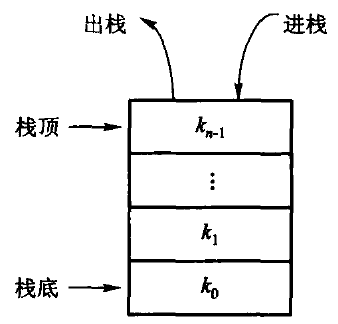
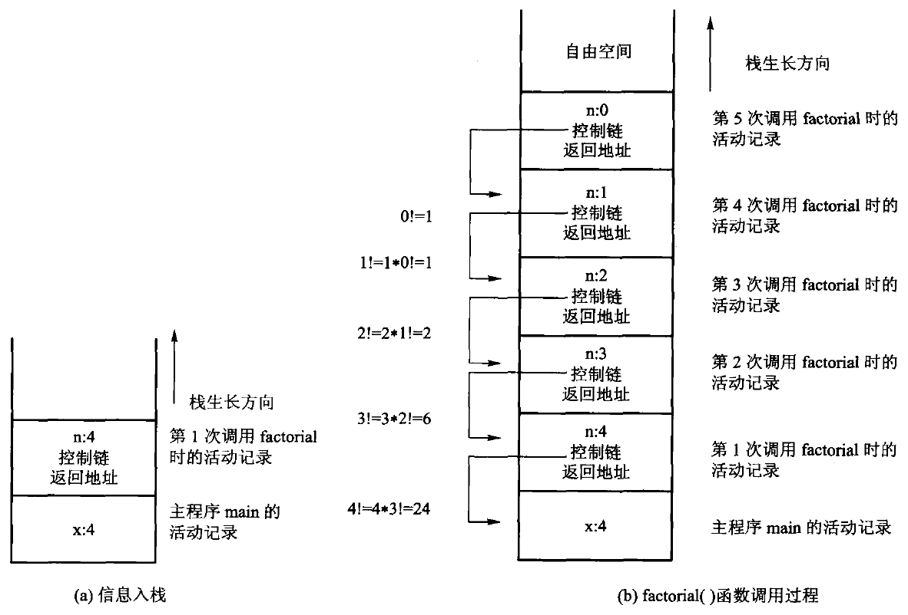
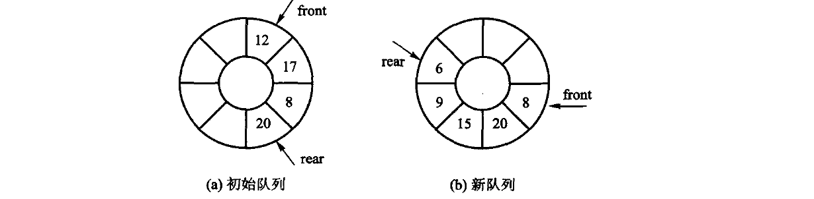
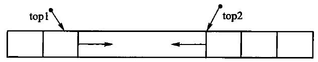

# 第3章　栈与队列

*Updated 2026-09-05 GMT+8*
 *Compiled by Hongfei Yan (2026 Fall)*
https://github.com/GMyhf/dsa-modernization

> **教材对应**：《数据结构与算法》（张铭、王腾蛟、赵海燕，高等教育出版社 2008）第 3 章
> **主题与学习重点**：在线性表上加一条存取限制，就得到栈与队列；
> 由此进入递归与运行栈，以及「可预期的空状态」该怎么表达。

**知识点**：栈的 ADT 与 LIFO；顺序栈、链式栈及其比较；后缀表达式求值；
运行栈、栈帧与递归深度的实测；显式栈改写；队列的 ADT 与 FIFO；
顺序队列的假溢出、循环队列与「牺牲一格」；链式队列；限制存取点的表。

**配套材料**

| 类型 | 位置 |
| --- | --- |
| 课件（40 页，16:9） | [`DSA_CH03_Stack_Queue.pptx`](DSA_CH03_Stack_Queue.pptx) |
| 视频（720p 轻量版） | [`video/ch03-preview.mp4`](video/ch03-preview.mp4) |
| 书稿正文 | [`../book/ch03-stack.md`](../book/ch03-stack.md) |
| 代码 | [`../code/ch03/`](../code/ch03/)：`array_stack`、`linked_stack`、`expression_eval`、`recursion_and_stack`、`knapsack`、`queue`、`monotonic_stack` |

> **讲义里的 ```cpp 块是摘录，不是可直接编译的完整文件。** 为了讲解，
> 它们删掉了文档注释、用 `// ...` 略去了与本处无关的部分。
> **未删减的原件在上面那些代码目录里**，由 `tools/check_code.py` 在
> `-Werror` + ASan/UBSan 与 `-O2` 两档下真编译、真运行。
> 引用**原书**代码的地方一律标成 ```text —— 那些清单编译不过，所以不在 `code/` 里
> （与 `book/` 的 R8 同一条口径）。
> `courseware/verify.py` 第 9 项会逐块核对：每个 ```cpp 块的有效代码行必须多数能在
> `code/` 或 `courseware/code/` 里找到，凭空写的代码会让闸门变红。

---

## 本章要回答三个问题

1. **在线性表上只加一条限制，能换来什么？** ——
   只在一端进出是**栈**（LIFO），一端进另一端出是**队列**（FIFO）。
2. **递归为什么会崩，崩在哪里？** —— 3.1.5 运行栈、栈帧，以及一组会推翻直觉的实测数字。
3. **「空栈弹出」是错误，还是一种正常状态？** ——
   这个判断决定了接口怎么写，本章给出全书统一的答案。

一句话概括：**栈和队列不是新的存储结构，是加了限制的线性表。
限制换来的是：每个操作都能做到 $O(1)$。**

---

## 3.1 栈

### 3.1.1 栈的抽象数据类型

**栈**（stack）是限定仅在**一端**进行插入和删除运算的线性表。该端称为**栈顶**（top），
另一端称为**栈底**（bottom）。元素按**后进先出**（LIFO，last in first out）的次序访问。



图 3.1　栈的示意图。进和出都在栈顶这一端，栈底不动。

原书【代码3.1】用一个空基类 `Stack<T>` 来表达这层抽象。那样的基类**给不了任何多态能力**：
成员函数既不是纯虚的、也没有定义，派生类「实现」它们并不构成覆盖；
反而埋下了「通过 `Stack<T>*` 删除派生对象」这一**未定义行为**。

> **抽象数据类型描述的是「一组运算」，不是「一个基类」。**
> 在 C++ 里，模板本身已经承担了这层抽象。

所以这一节要定下来的是**这张表**：

| 运算 | 含义 | 时间代价 |
| --- | --- | --- |
| `push(x)` | 把 x 压到栈顶 | 摊还 $O(1)$ |
| `pop()` | 弹出栈顶并把它带回来；**空栈返回「没有」** | $O(1)$ |
| `top()` | 只看栈顶，不弹出；**空栈返回「没有」** | $O(1)$ |
| `empty()` / `size()` / `clear()` | 判空、计数、清空 | $O(1)$ |

表里有两处「空栈返回『没有』」。这四个字在 C++17 里有一个精确的表达方式：`std::optional`。

### 3.1.2 顺序栈

采用顺序存储结构的栈称为**顺序栈**，需要一块连续的区域存储元素。
首先要确定：**数组的哪一端表示栈顶？**

- 把**第 0 个位置**当栈顶 —— 每次 `push` / `pop` 都要把所有元素后移或前移一位，$O(n)$；
- 把**最后一个元素的位置**当栈顶 —— 新元素加在表尾、出栈也删表尾，$O(1)$。

顺序栈一律选后者。这是本章第一个「选对了就没有代价」的例子。

```cpp
void push(const T& value) {
    if (size_ == capacity_) { grow(); }      // 满了就翻倍，没有「栈满溢出」这回事
    data_[size_] = value;
    ++size_;
}

std::optional<T> pop() {
    if (empty()) { return std::nullopt; }    // 空栈不是错误，也不打印任何东西
    --size_;
    return data_[size_];
}

std::optional<T> top() const {
    if (empty()) { return std::nullopt; }
    return data_[size_ - 1];
}
```

#### 空栈弹出：是错误，还是正常状态？

**是正常状态。** 循环「弹到空为止」是完全合理的写法，所以 `pop()` 返回 `optional`。
而 `at(i)` 下标越界是**调用方的错误**，抛 `std::out_of_range`。

> 这条分界线全书通用：**可预期的空状态返回 `optional`，调用方的错误抛异常。**
> 容器内部不做任何 I/O ——「打印一行提示然后继续」是最坏的一种：
> 调用方拿不到信号，程序带着错误状态继续跑。

#### 原书顺序栈的两处硬伤

这两条都不是「不够现代」，是**编译不过**和**跑起来崩**，都有工具输出为证：

1. **`int top` 撞上 `bool top(T&)`** —— 数据成员与成员函数同名。
   这是原书的**第一个编译错误**。同一个错误在【代码3.4】（链式栈）里**又犯了一次**。
2. **有析构函数，却没有拷贝构造与拷贝赋值** —— 违反三法则。
   `arrStack<int> b = a;` 二次释放，ASan 直接报 `double-free`。
   与第 2 章 `arrList` 是同一个错误。

#### 扩容

```cpp
void grow() {
    size_type next = (capacity_ == 0) ? 1 : capacity_ * 2;
    T* fresh = new T[next];
    for (size_type i = 0; i < size_; ++i) { fresh[i] = data_[i]; }
    delete[] data_;       // 先搬完再释放旧的，顺序反了就会读到已释放的内存
    data_ = fresh;
    capacity_ = next;
}
```

从 0 涨到 $n$ 一共搬 $1 + 2 + 4 + \cdots < 2n$ 个元素，平摊到 $n$ 次 `push` 上是常数 ——
这就是表里「摊还 $O(1)$」的来历。

### 3.1.3 链式栈

链式栈把栈顶放在**链头**：`push` 是头插，`pop` 是删头，都只改一根指针，$O(1)$。
**不需要尾指针** —— 栈只在一端进出，链尾从来用不到。

它**不会满**，代价是每个元素多一根指针（结构性开销）。

原书【代码3.4】的问题：

- **又是 `top` 重名** —— 同一本书的两个存储结构都犯了同一个错误；
- `defSize` 参数**从未使用**；
- 第五次遇到「有析构无拷贝构造」。

### 3.1.4 表达式求值

后缀（逆波兰）表达式**不需要括号，也不需要优先级规则**。求值规则只有两条：

- **遇操作数压栈**；
- **遇操作符弹出两个，算完再压回**。

读到末尾时，栈里剩下的唯一元素就是结果。

原书用 $23 + (34 \times 45) / (5 + 6 + 7)$ 举例，后缀式是 `23 34 45 * 5 6 + 7 + / +`：

| 步骤 | 待处理的后缀表达式 | 栈（底→顶） | 进行的运算 |
| ---: | --- | --- | --- |
| 4 | `* 5 6 + 7 + / +` | 23 34 45 | |
| 5 | `5 6 + 7 + / +` | 23 **1530** | 34 × 45 = 1530 入栈 |
| 8 | `7 + / +` | 23 1530 **11** | 5 + 6 = 11 入栈 |
| 10 | `/ +` | 23 1530 **18** | 11 + 7 = 18 入栈 |
| 11 | `+` | 23 **85** | **1530 / 18 = 85** |
| 12 | | **108** | 23 + 85 = 108 |

> ⚠️ 第 11 步是这道题的考点：**先弹出的 18 是右操作数**，后弹出的 1530 才是左操作数。
> 减法和除法都不可交换，弹出次序写反，结果就错。

```cpp
[[nodiscard]] inline double evaluate_postfix(std::string_view expression) {
    ArrayStack<double> operands;

    const auto pop_two = [&operands](double& left, double& right) {
        if (operands.size() < 2) {
            throw std::invalid_argument("后缀表达式：操作数不足");
        }
        right = *operands.pop();          // 先弹出的是右操作数
        left = *operands.pop();
    };
    // ... 逐个记号：是数就压栈，是操作符就 pop_two 算完再 push
}
```

#### 原书这段代码的三个问题

1. **算法与终端焊死** —— `Run()` 直接读 `cin`、写 `cout`：没法写测试、没法在库里复用。
2. **`GetTwoOperands` 在第二个操作数缺失时，已经把第一个弹掉了** ——
   返回 `false` 时栈已被破坏。
   > 但要说准确：真正让这个 bug **无害**的**不是**「先查够不够」这句预检查，
   > 而是**出错即抛出、整次求值随即作废** —— 栈根本没有机会被下一步用到。
   > 原书的 bug 之所以要命，是因为它 `cerr` 一行之后**继续跑**。
3. **出错时打一行提示然后 `clear()` 继续** —— 调用方拿不到任何信号。
   本书抛 `std::invalid_argument`（表达式不合法）或 `std::domain_error`（除零）。

#### 原书正文自己说的一句话

原书正文写着：判断除数是否为零，**写成 `operand1 == 0.0` 是错的**（浮点不该用 `==` 直接比）。
**然后印出来的代码照旧是 `operand1 == 0.0`。**

这类「正文说 A、代码写 B」的自相矛盾，本书统一收进 `book/勘误.md`。
收录标准只有三类：**编译不过、跑起来错、书内自相矛盾**。
「不够现代」不进表 —— 那不是错误，是年代。

### 3.1.5 栈与递归

#### 递归为什么非要有栈

被调函数的局部变量**不能静态地占一块固定单元** —— 每调用一次就得有一份，返回时随即释放。
这种「执行到调用时才分配」叫**动态分配**，它需要内存里有一块足够大的**运行栈**。

栈上一格一格压着的叫**栈帧**（stack frame，原书称「活动记录」），至少包含：
返回地址、参数、局部变量、必要的保存寄存器。

**递归深度就是它在运行栈里栈帧的个数** —— 同一个局部变量在不同层次被分到不同的存储空间。



图 3.8　(a) 逐层调用依次压栈；(b) 到达出口后按压栈的反序逐层弹出，把结果一层层交回去。

每深一层就多一格活动记录，**深度一旦超过栈区的大小，程序不是「变慢」，而是直接崩。**

#### 运行栈有多大：三个档位，三种结果

原书正文说递归「需要开辟一个**足够大**的运行栈」。多大算足够大？这是可以量的。
同一份递归源码（每层做一次加法后返回），在一台 Linux 机器上
（gcc 13.3，`ulimit -s` 为默认的 8 MB）逐档加深度：

| 构建档 | 20 万层 | 50 万层 | 100 万层 |
| --- | --- | --- | --- |
| `-O0`（不优化） | 通过 | **段错误** | 段错误 |
| `-O1` + ASan/UBSan | 通过 | **stack-overflow** | stack-overflow |
| `-O2` | 通过 | 通过 | **通过** |

把同样的计算改成**显式栈**（数据压进本章的 `ArrayStack`，也就是放到堆上）：
三个档位在 **1000 万层**都通过。

#### `-O2` 为什么不崩

**不是因为它栈更大，而是因为编译器把递归消掉了。** 查汇编可以确认：

```text
-O0: recursive_sum 函数体内调用自己的次数 = 2
-O2: recursive_sum 函数体内调用自己的次数 = 0     // 已经变成一个循环
```

> 这条实测的教训**不是**「用 `-O2` 就安全」：
> - 尾调用优化**不是标准保证的**，换个编译器、换个写法就没了；
> - 评测机用什么优化档、什么版本，**这两件事你都控制不了**。
>
> **唯一与版本、评测机都无关的做法是：改写成显式栈。**
> 递归吃的是**运行栈**（默认 8 MB 上限），显式栈吃的是**堆**（可以很大）。

#### 原书三个阶乘版本共同的问题：不查溢出

原书给了递归、循环、显式栈三个 `factorial` 版本，**三个都不查溢出**：

- `factorial(21)` 返回**负数**，`factorial(66)` 返回 **0**；
  UBSan 判定为**未定义行为**（有符号整数溢出）；
- 负数输入**静默返回 1**，而不是报错；
- 算法3.9 的 `s.pop(&tmp)` 与代码3.1 声明的 `pop(T&)` **对不上**。

> **递归的正确性讨论，不能只讨论递归出口 —— 值域也是出口的一部分。**

#### 一个有两条递归规则的例子：背包问题

阶乘只有一条递归规则，改写成循环几乎是显然的。原书接着给了一个有**两条**递归规则的例子 ——
背包问题（更准确说是子集和判定）：

```cpp
// 【算法3.10】
//   出口 1：承重恰为 0        -> 有解（什么都不再选）
//   出口 2：承重为负，或已无物品 -> 无解
//   规则 1：选第 n-1 件       -> 求解 knap(s - w[n-1], n-1)
//   规则 2：不选第 n-1 件     -> 求解 knap(s, n-1)
const auto solve = [&weights, &chosen](auto&& self, int s, std::size_t n) -> bool {
    if (s == 0) { return true; }              // 出口 1
    if (s < 0 || n == 0) { return false; }    // 出口 2
    if (self(self, s - weights[n - 1], n - 1)) {   // 规则 1：选它
        chosen.push_back(n - 1);
        return true;
    }
    return self(self, s, n - 1);              // 规则 2：不选它
};
```

原书的两处问题：直接 `cout << w[n-1]` 打印选中的物品（算法与终端焊死，调用方拿不到结果）；
`w[]` 是一个**从未声明的全局数组**。

---

## 3.2 队列

**队列**（queue）也是一种限制访问点的线性表：一端插入，另一端删除。

- 只允许删除的一端叫**队头**（front），删除叫**出队**（dequeue）；
- 只允许插入的一端叫**队尾**（rear），插入叫**入队**（enqueue）。

按到达顺序释放元素，所以叫**先进先出**（FIFO）表。

### 3.2.1 队列的抽象数据类型

| 原书的运算 | 含义 | 本书对应 |
| --- | --- | --- |
| `enQueue(item)` | 插入队尾，成功返回真 | `enqueue(item)` |
| `deQueue(item)` | 返回队头元素并删除 | `dequeue()` 返回 `std::optional` |
| `getFront(item)` | 返回队头元素但不删除 | `front()` 返回 `std::optional` |
| `isEmpty()` / `isFull()` | 判空 / 判满 | `empty()` / **顺序实现才有** `full()` |

> **可以根据应用适当增删运算** —— 例如链式队列并不需要判断是否满。
> 这不是偷懒，是接口应当只承诺它真能保证的事。

### 3.2.2 顺序队列：为什么两头都不能固定

队列**两头都要动**：入队动队尾，出队动队头。如果沿用顺序表的实现方法：

- **把队尾固定在位置 0** → 出队 $O(1)$，但入队必须把当前所有元素向后移一位，$O(n)$；
- **把队尾固定在位置 $n-1$** → 入队 $O(1)$，但出队要移动剩余 $n-1$ 个元素，$O(n)$。

**两头都别固定**：让 `front` 和 `rear` 都在数组里往后走，元素本身**一个都不搬**，
两个操作就都是 $O(1)$。

新问题来了：整个队列不断向数组尾部漂移，`rear` 一旦到了末尾，
即使数组前端还空着一大片，入队也会报满 —— 这叫**假溢出**。

解决办法是把数组在逻辑上看成一个**环**：下标 0 是下标 `mSize - 1` 的直接后继，
位置 `x` 的后继是 `(x + 1) % mSize`。这就是**循环队列**。



图 3.11　(a) 初始队列里有 12、17、8、20 四个元素；(b) 两次出队、三次入队之后的样子。
入队增加 `rear`，出队增加 `front`，两者都在环上顺时针走。

#### 绕回之后的麻烦：`front == rear` 既可能空、也可能满

数一数就明白：$n$ 个位置的数组，队列有「空、1 个、2 个……$n$ 个」共 $n+1$ 种状态，
而固定 `front` 后 `rear` 只有 $n$ 种取值 —— **必有两种状态撞在一起**。

一种办法是另记一个计数或布尔量；顺序队列更常用的是原书的办法 —— **牺牲一个槽位**：

```cpp
bool empty() const { return front_ == rear_; }

// 满的判据：rear 再往前走一格就撞上 front。那一格就是被牺牲掉的槽位。
bool full() const { return (rear_ + 1) % slots_ == front_; }

bool enqueue(const T& value) {
    if (full()) { return false; }        // 顺序队列容量固定，这是它与链式队列的核心差别
    data_[rear_] = value;
    rear_ = (rear_ + 1) % slots_;        // 走到末尾就绕回 0，取模不能漏
    return true;
}

std::optional<T> dequeue() {
    if (empty()) { return std::nullopt; }
    T value = data_[front_];
    front_ = (front_ + 1) % slots_;
    return value;
}
```

数组开 $n+1$ 格却只装 $n$ 个元素：`slots_ = 容量 + 1`。这就是「容量 3 时第 4 个入不进去」的原因。

### 3.2.3 链式队列

链式队列要**两个指针**：`front_` 指队头结点，`rear_` 指队尾结点。
入队在尾部接链，出队在头部摘链，都是 $O(1)$。

**不需要 `full()`** —— 这就是「根据应用增删运算」的具体例子。

> ⚠️ 边界要小心：**队列变空时 `rear_` 必须一起复位**，否则它指向已释放的结点。
> 教学版有一条具名断言专门盯这件事。

---

## 3.3 栈与队列的深入讨论

### 3.3.1 / 3.3.2 两组比较

| | 顺序实现 | 链式实现 |
| --- | --- | --- |
| `push` / `pop`、入队 / 出队 | $O(1)$ | $O(1)$ **时间上难分伯仲** |
| 空间 | 必须先定长度，不满时**浪费** | 按需增减，但每元素一根指针（**结构性开销**） |
| 访问**内部**元素 | 按与栈顶的相对位置**快速定位** | 只能沿指针链遍历 |
| 一个数组放两个（栈） | **可以**，两端迎面增长 | — |
| 一个数组放两个（队列） | **不行**，除非元素总从一个转入另一个 | — |

正因为「访问内部元素」这一条，**顺序栈在实际中更常用一些**。



图 3.13　两个栈的空间需求恰好相反（一个涨、另一个缩）时，这种做法很省空间；
两个同时涨，中间那点余量很快就没了。

### 3.3.3 限制存取点的表

1. **双端队列** —— 插入和删除都限制在两端进行。**栈和队列都是它的特例。**
2. **双栈** —— 两个底部相连的栈：从 `end1` 插入的只能从 `end1` 删除。
3. **超队列** —— 删除受限：删除只在一端，插入可在两端。
4. **超栈** —— 插入受限：插入只在一端，删除可在两端。

C++ 标准库有 `std::deque`，`std::stack` 与 `std::queue` 默认都由它实现 ——
**但那是使用者的视角**。本章手写这两种结构，
是因为「存储怎么落、边界怎么守」本身就是这一章的教学内容。

### 栈和队列在后面各章的位置

- **栈**：函数调用与递归实现、深度优先周游（第 5–7 章）、表达式转换与求值；
  第 8 章快速排序的非递归版本、第 12 章的伸展树也都要用。
- **队列**：作为消息或数据缓冲器 —— 硬件设备间的通信、操作系统的资源管理；
  **队列是广度优先搜索中采用的主要中间数据结构**（第 5、6、7 章）；
  按优先级组织成多个队列，就是**优先队列**的雏形（第 5.5 节）。

---

## 本章小结

- **栈和队列都是限制了存取点的线性表**，限制换来的是每个操作 $O(1)$。
- 两种存储各有代价：顺序实现省空间、能随机访问内部元素；链式实现不会满。
- **循环队列**用取模把数组看成环，解决假溢出；**牺牲一格**区分空与满。
- **递归 = 用运行栈。** 深度受 `ulimit -s` 限制，可靠的深递归写法只有显式栈。
  `-O2` 把递归消成循环这件事**不能依赖**。
- 接口口径（全书通用）：**可预期的空状态返回 `optional`，调用方的错误抛异常，
  容器内部零 I/O。**

---

## 习题与参考答案

> **本节是选讲，不是全集。** 这里收的是补充题、正文习题与上机题中挑出来讲的一部分；
> **原书全部 345 道习题与上机题的参考答案，在 [`../book/习题与参考答案.md`](../book/习题与参考答案.md)。**
> 那份文件由 `tools/check_doc.py` 的 R14 逐题守着 —— 每一道正文题都必须有同号答案，
> 否则闸门变红。（闸门只验「有没有同号答案」，不验答案内容是否正确。）

### 补充算法设计题

**补充 1.** 只用两个栈的 `push` / `pop` / `empty`，设计队列的三个运算，分析摊还复杂度。

> **答**：入队压入 `S1`；出队时**若 `S2` 空**则把 `S1` 全部转入 `S2`，再弹出 `S2`。
> 每个元素**至多转移一次**，所以单次最坏 $O(n)$、**摊还 $O(1)$**。
> ⚠️ 常见的错误说法是「`S1` 满时搬运」—— 那既不必要，也会破坏 FIFO。

**补充 2.** 编号 $1..n$ 依次进栈，求所有合法出栈序列的数量并证明其为 Catalan 数。

> **答**：设最后出栈的元素为 $k$，则它左右两侧独立产生 $C_{k-1}$ 与 $C_{n-k}$ 种，
> 于是 $C_n = \sum_k C_{k-1}C_{n-k}$，解为 $C_n = \frac{1}{n+1}\binom{2n}{n}$。

**补充 3.** 用两个栈设计编辑器的撤销和恢复。

> **答**：新操作**入撤销栈并清空恢复栈**；撤销执行逆操作并把原操作放入恢复栈；
> 恢复执行原操作并放回撤销栈。「清空恢复栈」这一步最容易漏 ——
> 漏了就会恢复出一条已经被新分支覆盖掉的历史。

### 正文习题

**1.** 循环队列两端都可插入删除：写类型定义，以及「从队尾删除」和「从队头插入」。

> **答**：用 `data[n]`、`front`（队头）和 `count` 表示，队尾下标为 `(front+count-1)%n`。
> 队尾删除取该下标后 `--count`；队头插入先令 `front=(front+n-1)%n`，再写入并 `++count`。
> 四种操作都先判空 / 满，时间均 $O(1)$。

**2.** 循环数组只设 `front` 与计数器 `count`，不设 `rear`，实现判空、入队、出队。

> **答**：判空即 `count==0`，队尾位置由 `(front+count)%n` 算出。
> 入队写该位置后 `++count`；出队取 `data[front]`，令 `front=(front+1)%n`、`--count`。
> **`count` 同时消除了 `front==rear` 无法区分空和满的问题** —— 这是「牺牲一格」之外的另一条路。

**3.** 逆置栈 $S$：(1) 用两个额外栈；(2) 用一个额外队列；(3) 一个额外栈加非数组变量。

> **答**：(1) 把 $S$ 依次倒入 $A$、再倒入 $B$、最后倒回 $S$ —— **三次逆置的净效果是逆置**。
> (2) 把 $S$ 全弹入队列，再依次出队压回 $S$。
> (3) 一个额外栈加若干标量时，**标量必须能暂存全部 $n$ 个元素**，否则做不到任意长栈的逆置。

**4.** 用栈定义队列。

> **答**：同补充 1。用输入栈 `in` 与输出栈 `out`，摊还 $O(1)$。

**5.** 带头结点的循环链表表示队列，**只设一个指向队尾的指针**（不设头指针）。

> **答**：令 `rear` 指尾结点，则 `rear->next` 是头结点，队头是 `rear->next->next`。
> 初始化让头结点自环且 `rear=head`；入队把新结点插在头结点前并更新 `rear`；
> 出队删 `head->next`，删掉唯一数据结点后恢复 `rear=head`。均为 $O(1)$。

**6.** 在长度为 $n$ 的数组中实现两个栈，元素总数到 $n$ 之前都不溢出，且操作 $O(1)$。

> **答**：栈 1 从左端向右长，栈 2 从右端向左长，栈顶下标初值分别为 `-1`、`n`。
> **仅当 `top1+1==top2` 才溢出**；空闲空间由两栈共享。这正是图 3.13。

**7.** 5 辆列车进栈式站台，开出车站的顺序有多少种？

> **答**：$C_5 = \frac{1}{6}\binom{10}{5} = 42$ 种。

**8.** 证明：能用一个栈从 $1..n$ 得到排列 $p$ 的**充要条件**是不存在 $i<j<k$ 使 $p_j < p_k < p_i$。

> **答**：**必要性** —— 若存在这样的 $i<j<k$，输出 $p_i$ 之后，较早入栈的 $p_j$
> 仍压在 $p_k$ 下面，不可能先于 $p_k$ 输出。
> **充分性** —— 按目标序列依次压到所需元素；若栈顶不是目标，栈内就恰好形成上述禁形。
> 不存在禁形时每一步都能弹出。

**9.** 用栈计算后缀 `12 8 9 * +`。

> **答**：栈变化 `[] → [12] → [12,8] → [12,8,9] → [12,72] → [84]`，结果 **84**。

**10.** 用栈把中缀 `a*(b*c-d)+e` 转成后缀。

> **答**：操作符栈依次经历 `[]`、`[*]`、`[*,(]`、`[*,(,*]`、`[*,(,-]`、`[]`、`[+]`、`[]`；
> 输出最终为 **`abc*d-*e+`**。

**11.** 按 $GCD(n,m)$ 的递归定义写算法。

> **答**：`gcd(n,m) = (m==0 ? abs(n) : gcd(m, n%m))`。
> 每次余数严格变小，最坏递归深度 $O(\log\min(|n|,|m|))$。

**12.** 递归与非递归求 $1 + 1/2 - 1/3 + 1/4 - \cdots$ 的前 $n$ 项和。

> **答**：令 $a_1 = 1$、$a_k = (-1)^k/k$（$k \ge 2$）。递归 `sum(n)=sum(n-1)+a_n`，
> 边界 `sum(1)=1`；非递归从 1 开始循环累加。
> 两者时间 $O(n)$，**递归额外栈 $O(n)$、迭代空间 $O(1)$** —— 这就是本节的主题。

---

## 上机题与参考实现

**1.** 用两个栈 $s_1$、$s_2$ 模拟队列。

> 采用补充 1 的方案。守门用例要覆盖：**空队列**、**交错入出**、
> 以及 **`out` 非空时继续入队**（最后这条最容易漏，漏了就会插错顺序）。

**2.** 数组实现 deque，四个操作均为常数时间。

> 用 `front`、`count` 和循环数组，四端操作都按模取下标。
> 至少测试**容量 1**、**满后拒绝**、**绕回**、以及**从两端删到空**。

**3.** 用辅助队列使队列有序：(1) 两个；(2) 一个。

> 一个辅助队列时，每插入 $x$ 先入队，再轮转原有元素，使**队头始终为最小值**。
> 插入最坏 $O(n)$、删除最小 $O(1)$。

**4.** 把栈 $s_1$ 的元素转到 $s_2$ 并**保持原顺序**：(1) 一个辅助栈；(2) 只用非数组变量。

> (1) 做 `s1 → aux → s2` 两次转移。
> (2) 若只许有限个标量而元素数无界，**则做不到** ——
> 需要递归调用栈或能容纳 $n$ 个值的外部存储。这道题的答案是「不能」，要说清为什么。

**5.** Fibonacci：写递归过程，并用栈模拟递归改写成非递归。

> 朴素递归 `fib(n)=fib(n-1)+fib(n-2)` 会重复计算，**时间指数级**。
> 显式栈帧保存 `(n, 阶段, 左结果)` 可以忠实模拟调用；
> 但更实用的非递归只保留前两项，时间 $O(n)$、空间 $O(1)$。
> 这道题要同时给出两种，并说清它们解决的是不同的问题。

**6.** Ackermann 函数：写出 $Ack(2,1)$ 的计算过程；写非递归算法。

> $Ack(2,1) = Ack(1, Ack(2,0)) = Ack(1, Ack(1,1)) = Ack(1,3) = 5$。
> 非递归算法用栈保存尚未完成的 $m$：`m==0` 时 `n++`；`n==0` 时转成 `(m-1,1)`；
> 否则压入 `m-1` 并先求 `(m, n-1)`。
> ⚠️ **数值增长极快，必须设溢出和资源上限** —— $Ack(4,2)$ 已有近 2 万位。
