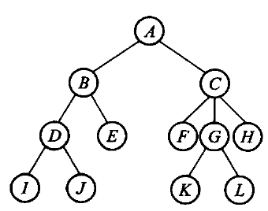
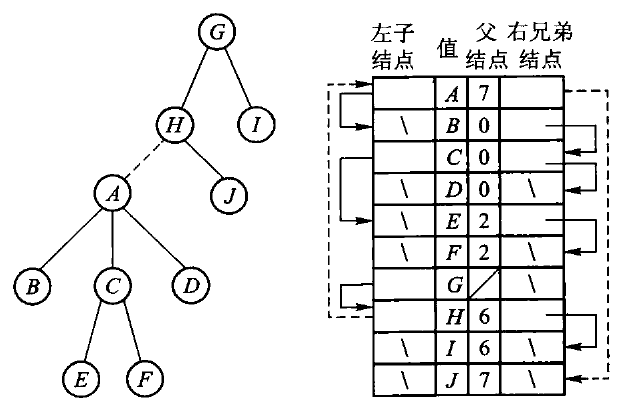

# 第6章　树

*Updated 2026-09-05 GMT+8*
 *Compiled by Hongfei Yan (2026 Fall)*
https://github.com/GMyhf/dsa-modernization

> **教材对应**：《数据结构与算法》（张铭、王腾蛟、赵海燕，高等教育出版社 2008）第 6 章
> **主题与学习重点**：一般树的度不固定，这是它全部的难处；
> 森林与二叉树的一一对应把这个难处消掉，父指针表示法则带出并查集。

**知识点**：树的递归定义与二元关系定义；有序树 / 无序树 / 森林；
度为 2 的有序树与二叉树的区别；森林 ⇄ 二叉树的等价转换（连线、切线、旋转）；
先根 / 后根 / 层次周游与二叉树周游的对应；四种链式存储；
父指针表示法、并查集、重量权衡合并与路径压缩；顺序存储；K 叉树。

**配套材料**

| 类型 | 位置 |
| --- | --- |
| 课件（24 页，16:9） | [`DSA_CH06_Tree.pptx`](DSA_CH06_Tree.pptx) |
| 视频（720p 轻量版） | [`video/ch06-preview.mp4`](video/ch06-preview.mp4) |
| 书稿正文 | [`../book/ch06-tree.md`](../book/ch06-tree.md) |
| 代码 | [`../code/ch06/general_tree/`](../code/ch06/general_tree/) |

---

## 本章要回答三个问题

1. **孩子个数不固定的树，怎么存？**
2. **为什么一般树没有「中序」？**
3. **「这两个元素在不在同一组」怎么问得快？**

一句话概括：**树与二叉树、森林与二叉树之间存在一一对应的关系。**
所以一般树的问题几乎都能搬到二叉树上去做。

---

## 6.1 树的定义和基本术语

### 6.1.1 树和森林

**递归定义。** 树（tree）是包括 $n$（$n \ge 1$）个结点的有限集合 $T$，使得：

1. 有且仅有一个特定的称为**根**（root）的结点；
2. 除根以外的其他结点被分成 $m$（$m \ge 0$）个**不相交**的有限集合
   $T_1, \cdots, T_m$，而每一个集合又都是树 —— 称做这个根的**子树**。

**二元关系定义。** 树是包含 $n$（$n > 0$）个结点的有穷集合 $K$，
及 $K$ 上的关系 $R = \{r\}$，满足：

1. 有且仅有一个结点 $k_0$ 对 $r$ 没有前驱（**根**）；
2. 除 $k_0$ 外每个结点对 $r$ **有且仅有一个前驱**；
3. 除 $k_0$ 外任何结点都存在一条从根到它的**路径**。

> **除了定义的角度不同外，以上两种描述是等价的。**

**术语**基本沿用二叉树：父结点、子结点、边、兄弟、树叶、祖先、子孙、路径、层数。

- **结点的度**是它的子树数目；**树的度**是各结点度的最大值（二叉树的度是 2）；
- 根为第 0 层，非根结点的层数是其父结点的层数加 1。

子结点次序不加区别的称为**无序树**；按从左到右编号的称为**有序树**。
计算机的存储是有序的，所以往往把树作为有序树看待。

> ⚠️ **度为 2 的有序树并不是二叉树。**
> 因为有序树中第一子结点被删除后，**第二子结点自然顶替成为第一子结点**；
> **度为 2 并且严格区分左右两个子结点的有序树才是二叉树** ——
> 二叉树必须能表示「左空、右不空」这种左右不对称。

**森林**（forest）是零棵或多棵不相交的树的集合（通常是有序集合）。
对树中的每个结点，其子树组成的集合就是森林；加入一个结点作为根，森林就转化成一棵树。

图 6.1　一般树的树形表示 —— 其实是根在上的倒挂树。

另有三种等价表示：**凹入表示法**（类似图书目录）、**文氏图表示法**（嵌套的圆）、
**嵌套括号表示法**（如 `A(B(D(I,J),E), C(F,G(K,L),H))`）。
表示法多样，说明树在建模里用得广。

### 6.1.2 森林与二叉树的等价转换

形象的做法是「连线、切线、旋转」三步：

1. **连线**：把兄弟结点用线连起来；
2. **切线**：只保留父结点到**第一个**孩子的连线，砍掉到其余孩子的连线；
3. **旋转**：以根为轴顺时针转一下，画面才像通常的二叉树。

转换后：

- **左孩子** = 它在原树（或森林）里的**第一个孩子** —— 左枝上是**父子**关系；
- **右孩子** = 原来的**下一个兄弟** —— 右枝上是**兄弟**关系。

> 单棵树的根没有兄弟，所以转成二叉树后**根的右孩子一定为空**。

形式地说：森林 $F = \{T_1, \cdots, T_n\}$ 转成二叉树 $B(F)$ ——
$F$ 空则 $B(F)$ 空；否则 $B(F)$ 的根是 $T_1$ 的根，
**左子树**是 $T_1$ 的子树森林转成的二叉树，
**右子树**是 $\{T_2, \cdots, T_n\}$ 转成的二叉树。

反过来是三步的逆。**这两种转换互逆**，所以树与二叉树、森林与二叉树是一一对应的。

### 6.1.4 树的周游

> **对于树或森林，一个结点可能具有多于两个子树，因此不能像二叉树的中序周游法那样
> 给出树的中根次序周游方式。**

「先左、访问根、再右」里的「中间」，在有 3 棵、4 棵子树时无从定义。
但仍然可以仿照前序、后序，定义**先根次序**和**后根次序**：

- **先根**：① 访问森林中第一棵树的根；② 先根周游第一棵树的子树森林；③ 先根周游其余的树。
- **后根**：① 后根周游第一棵树的子树森林；② 访问第一棵树的根；③ 后根周游其余的树。

**广度优先**（层次周游）：从第 0 层开始自上而下逐层周游，同层从左到右。

#### 一条值得单独记住的对应

> - 按**先根次序**周游森林的序列，正好等同于其对应二叉树的**前序**序列；
> - 按**后根次序**周游森林的序列，正好是对应二叉树的**中序**序列。

原因就在转换关系里：$T_1$ 的诸子树对应 $B(F)$ 的**左子树**，
其余的树 $T_2, \cdots, T_n$ 对应 $B(F)$ 的**右子树**；
森林的后根次序是「先周游 $T_1$ 的子树森林 → 访问 $T_1$ 的根 → 周游其余的树」，
翻译成二叉树就是「**左子树 → 根 → 右子树**」—— 这正是中序。

以图 6.5 的森林为例：先根 `A B C E F D G H J I`，后根 `B E F C D A J H I G`，
广度优先 `A G B C D H I E F J`。

> ⚠️ **森林的层次序列与其对应二叉树的层次次序不同** —— 这一条不能类推。
> 按广度方向周游森林对应的二叉树时，不是简单地按离根远近，
> 而是**沿着二叉树右链访问的过程，左指针起承上启下的作用**。

---

## 6.2 树的链式存储结构

> **无论采取何种方式，都要求树的存储结构不但能存储各结点本身的数据信息，
> 还要求能准确反映树中各结点之间的逻辑关系。**

一般树的存储比二叉树麻烦，**因为度不固定** —— 这是它全部的难处。

### 四种链式表示法

| 表示法 | 优点 | 代价 |
| --- | --- | --- |
| **① 子结点表** | 最左孩子可由链表第一项直接找到，顺链找到所有孩子 | 度不固定时数组要扩容；孩子序列中间插入要搬指针；度为 $d$ 的结点要留 $d$ 个槽 |
| **② 静态左子/右兄** | 每结点存储空间**大小固定**；访问右兄弟方便；空间效率高于① | 仍需一整块数组 |
| **③ 动态表示法** | 子结点数变化时只需重新分配该结点的空间，**更灵活** | 本质同①；结点分散 |
| **④ 动态左子/右兄二叉链表** | **只要两个指针域**，直接复用第 5 章二叉树的链式存储 | 取「第 $k$ 个孩子」要沿兄弟链走 $k$ 步 |

**「左子/右兄」二叉链表是采用得最多的表示法** —— 因为它把「度不固定」这件事彻底消掉了：
任意度的树只需两个指针域。

图 6.8　把以 A 为根的树变成 H 的最左子树：**只需调整 3 个链接** ——
H 的最左子结点指向 A，A 的父结点指向 H，A 的右侧兄弟指向 J。
其余结点的值和链接都不变。

### 6.2.5 父指针表示法和并查集

**并查集**（union/find）是一种由若干互不相交子集组成的集合抽象。两个基本操作：

- `find` 判断两个元素是否属于同一集合；
- `union` 把两个集合归并为一个集合。

集合 $S$ 上的关系 $R$ 是**等价关系**，当且仅当满足**自反性、对称性、传递性**。
元素 $x$ 的**等价类**是 $[x]_R = \{y \in S : (x,y) \in R\}$。

> **所有等价类互不相交，它们的并正好是 $S$** —— 因此等价关系就是对 $S$ 的一种划分。

用**父指针**表示时，把每个子集看成一棵树，森林中每棵树代表一个子集，
**树根就是该集合的标识符**。`find` 沿父链找到根；`union` 只需把一棵树的根指向另一棵树的根 ——
**因此不必搬动集合中的所有元素**。这是父指针表示法在这里的全部价值。

#### 两条改进：要防的是树退化成一条链

**改进一：重量权衡合并规则**（weighted union rule）。
合并时比较两个集合的**元素个数**，让**含元素少的子集的树根指向含元素多的子集的根**。

> 小树挂到大树下，能把整体深度限制在 $O(\log n)$ ——
> 理由是每次合并树高最多加 1，而元素个数至少翻倍，所以任何结点的深度最多增加 $\log n$ 次。

> ⚠️ **注意别和「按秩合并」混了。** 按秩比的是**树高**，按重量比的是**元素个数**。
> 两者复杂度同阶，但在同一组等价对上会长出**形状不同**的树。
> 本书按原书口径用重量 —— 课程第 6 章习题要求「使用重量权衡合并规则与路径压缩」并画出
> 父指针数组，换成按秩就对不上答案。

**改进二：路径压缩**（path compression）。
`find` 走过的路径上，把每个结点都直接挂到根下，下次再问就是一步。

两条一起用，均摊代价接近常数（严格说是反 Ackermann 函数，实践中可以当成常数）。

---

## 6.3 树的顺序存储结构

**链式存储**每个结点单独分配，指针占空间，也不利于整块读写。
**顺序存储**把结点按某一种周游次序排进数组，
再用**很少的附加信息**记下「谁是下一个兄弟」或「有几个孩子」，就能在连续空间里还原整棵树。

基础是先根序列的一条性质：

> **在先根序列中，任何结点的子树的所有结点都直接跟在该结点之后，
> 任何一个分支结点后面紧跟的是其第一个子结点。**

原书给了四种：**带右链的先根次序**、**带双标记的先根次序**、
**带度数的后根次序**、**带双标记的层次次序**。

以「带右链的先根次序」为例，结点形式是 `[ltag | info | rlink]`：
`rlink` 指向下一个兄弟（即对应二叉树里的右子结点），
`ltag` 是一位标记，记下这个结点在对应二叉树里有没有左子结点。
扫描一遍序列，配一个栈就能把树还原出来。

---

## 6.4 K 叉树

有些应用里每个结点的孩子数有**固定上限 $K$**：三子棋的博弈树、某些 B 树的内存模拟。
这时不必走「任意度 + 兄弟链」，可以规定每个结点至多 $K$ 个孩子，叫做 **$K$ 叉树**。

定义与二叉树平行：

- **满 $K$ 叉树**：每个结点要么是叶，要么恰好 $K$ 个孩子；
- **完全 $K$ 叉树**：只有最下两层的度可以小于 $K$，且最下层靠左对齐。

按层从 0 编号时，结点 $i$ 的孩子们是 $Ki+1, \cdots, Ki+K$，父结点是 $\lfloor(i-1)/K\rfloor$。
**$K = 2$ 就回到二叉树** —— 第 5 章那组公式是这组的特例。

完全 $K$ 叉树按编号存进数组，和完全二叉树是同一套办法。
计算机图形学里的 **4 叉树、8 叉树**就是常见的应用。

---

## 本章小结

- 树有两种等价定义：**递归**（根 + 子树）与**二元关系**（$K$ 和 $r$）。
- **树与二叉树、森林与二叉树之间存在一一对应的关系** —— 连线、切线、旋转，可逆。
- **按先根次序周游森林 = 对应二叉树的前序；按后根次序周游森林 = 对应二叉树的中序。**
  ⚠️ 层次序列**不**对应。
- 一般树没有中序，因为「多于两棵子树」时「中间」无从定义。
- 四种链式表示里，**左子/右兄二叉链表用得最多** —— 把任意度压成两个指针。
- **父指针表示法**方便实现并查集；**重量权衡合并 + 路径压缩**让大量操作接近常数。
- **顺序存储**靠周游次序加附加信息还原树形；**$K$ 叉树**是二叉树那组公式的推广。

---

## 习题与参考答案

### 补充证明与算法题

**补充 1.** 高度为 $h$ 的满 $k$ 叉树按层编号，推导第 $l$ 层结点数、结点 $i$ 的第 $m$ 个孩子编号
及右兄弟条件。

> **答**：第 $l$ 层有 $k^l$ 个结点（根为第 0 层），总结点数 $\frac{k^{h+1}-1}{k-1}$。
> 结点 $i$ 的第 $m$ 个孩子（$m$ 从 1 数）编号是 $ki + m$；父结点是 $\lfloor(i-1)/k\rfloor$。
> $i$ 有右兄弟 ⟺ $i \not\equiv 0 \pmod k$，此时右兄弟是 $i+1$。

**补充 2.** 用并查集判断方程组 `a==b`、`a!=b` 是否有解，分析三种优化下的复杂度。

> **答**：**两趟**。第一趟只处理所有 `==`，把相等的变量并进同一集合；
> 第二趟检查每个 `!=`：若两端已在同一集合，则无解；全部通过则有解。
> ⚠️ **顺序不能反** —— 先处理 `!=` 会漏掉后面才建立的相等关系。
>
> 复杂度：无优化最坏 $O(nm)$（树退化成链）；
> 按秩（或按重量）合并 $O(m\log n)$；再加路径压缩为 $O(m\,\alpha(n))$，实践中当作线性。

**补充 3.** 给定一棵树的左孩子 / 右兄弟表示，写出森林的先根序列和带度数后根序列。

> **答**：先根序列 = 对应二叉树的前序序列，直接按 `根 → 左 → 右` 走。
> 带度数的后根序列要在后根周游时同时输出每个结点的孩子数；
> 还原时用一个栈：读到度数为 $d$ 的结点就从栈里弹出 $d$ 个作为它的孩子，再把它压回去。

### 正文习题

**1.** 三棵树组成的森林 → 二叉树 → 再转回来，验证互逆。

> **答**：转过去时记住「左孩子 = 第一个孩子，右孩子 = 下一个兄弟」；
> 转回来时逆时针旋转，把每个结点**右链上的全部结点**都补连到它的父结点，再删掉到右孩子的边。
> 验证的要点是：**森林里有几棵树，对应二叉树根的右链上就有几个结点**（含根自己）。

**2.** 对树 `A(B(E,F),C(G),D(H,I,J))` 写出先根、后根、层次序列。

> **答**：
> 先根 `A B E F C G D H I J`；
> 后根 `E F B G C H I J D A`；
> 层次 `A B C D E F G H I J`。

**3.** 度为 2 的有序树和二叉树差在哪里？举一个「左空右不空」的例子。

> **答**：差在**能不能表示「左右不对称」**。
> 一个结点只有一个孩子时，二叉树能区分它是左孩子还是右孩子；
> 而度为 2 的有序树里，孩子按次序编号，**唯一的那个孩子必然是「第一个」**，
> 删掉第一个孩子后第二个会自动顶替。
> 例子：根 A 只有一个孩子 B。作为二叉树，「B 是 A 的右孩子」是一棵合法的、
> 与「B 是左孩子」不同的树；作为有序树，这两种情况无法区分。

**4.** 用带度数的后根次序表示一棵小树，说明扫描时栈如何弹出孩子。

> **答**：后根序列里，**一个结点的全部子树都排在它前面**。
> 所以从左到右扫描，维护一个栈：读到 `(结点, 度数 d)` 就从栈顶弹出 $d$ 个结点
> 作为它的孩子（**注意弹出顺序与孩子从左到右的顺序相反，要反转**），
> 把连好的这棵子树压回栈。扫完后栈里剩下的就是森林的各棵树。

**5.** 对 $0..6$ 依次 `unite(0,1)`、`unite(1,2)`、`unite(3,4)`，画父指针；再 `find(0)` 后画路径压缩结果。

> **答**（重量权衡，元素多的作根；并列时值小的作根）：
> `unite(0,1)` 后 1 的父是 0；`unite(1,2)` 时 {0,1} 有 2 个元素、{2} 有 1 个，
> 所以 2 的父是 0；`unite(3,4)` 后 4 的父是 3。
> 此时 0 已经是 1 和 2 的直接父结点，**`find(0)` 一步到根，路径压缩不改变任何指针**。
> —— 这道题的考点正是「压缩不总是有效果」：树本来就矮的时候，它什么也不做。

**6.** 完全 3 叉树按层编号，写出结点 4 的父和孩子们。

> **答**：父是 $\lfloor(4-1)/3\rfloor = 1$；孩子是 $3{\times}4+1 = 13$、$14$、$15$。
