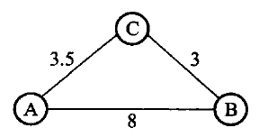

# 第7章　图

*Updated 2026-09-05 GMT+8*
 *Compiled by Hongfei Yan (2026 Fall)*
https://github.com/GMyhf/dsa-modernization

> **教材对应**：《数据结构与算法》（张铭、王腾蛟、赵海燕，高等教育出版社 2008）第 7 章
> **主题与学习重点**：图对前驱后继都不加限制，所以线性结构和树都是它的特例；
> 本章把「存储怎么选」和「算法要什么前提」这两件事一起说清楚。

**知识点**：图的定义与术语；连通性、生成树；邻接矩阵与邻接表；
DFS / BFS；拓扑排序与环检测；Dijkstra（贪心）与 Floyd（动态规划）；
MST 性质、Prim 与 Kruskal。

**配套材料**

| 类型 | 位置 |
| --- | --- |
| 课件（27 页，16:9） | [`DSA_CH07_Graph.pptx`](DSA_CH07_Graph.pptx) |
| 视频（720p 轻量版） | [`video/ch07-preview.mp4`](video/ch07-preview.mp4) |
| 书稿正文 | [`../book/ch07-graph.md`](../book/ch07-graph.md) |
| 代码 | [`../code/ch07/graph/`](../code/ch07/graph/)（邻接矩阵）、[`../code/ch07/adjacency_list/`](../code/ch07/adjacency_list/)（邻接表） |

---

## 本章要回答的问题

按第 1 章的分类：**线性结构唯一前驱、唯一后继；树唯一前驱、多个后继；
图对前驱和后继的个数都不加限制。** 线性和树都可以看成受限的图。

一句话概括：**换存储方式不该换答案，只该换代价。**
本章两套实现（邻接矩阵与邻接表）逐项对拍 —— 同一张图上 DFS/BFS 序列、
拓扑序、Dijkstra 距离向量必须完全相同，外加 30 轮随机图对拍。

---

## 7.1 图的定义和基本术语

图记作 $G = \langle V, E\rangle$。$V$ 是顶点的**有穷非空**集合，$E$ 是边的集合。

- **无向图**：边写成无序对 $(v_1, v_2)$，$(v_1,v_2)$ 与 $(v_2,v_1)$ 是同一条边；
- **有向图**：写成有序对 $\langle v_1, v_2\rangle$，也叫**弧**；
  $v_1$ 是**弧尾**（起点），$v_2$ 是**弧头**（终点）。
  $\langle v_1,v_2\rangle$ 与 $\langle v_2,v_1\rangle$ 是**两条不同的弧**。

边上可以附**权**（距离、时间、代价），每条边都带权的叫**带权图**（网络）。
本书不考虑**多重边**（同一对顶点之间多于一条边）和**自环**。

记 $n$ 为顶点数、$e$ 为边数：**无向图 $e \le n(n-1)/2$，有向图 $e \le n(n-1)$**。
边少的叫**稀疏图**，边多的叫**稠密图**；取到上限的叫**完全图**。

### 连通性

- **度** = 与顶点相关联的边数。有向图分**入度**与**出度**；度为 0 的是**孤立点**。
- **路径**：从 $u$ 沿边走到 $v$ 的顶点序列，边数是**路径长度**。有向图必须顺着弧走。
  起点终点相同且至少含一条边的叫**回路**；除端点外无重复顶点的叫**简单路径**。
- **连通**（无向图）：任意两点之间都有路径。极大的连通子图叫**连通分量**。
  > 「极大」是指再添任何一个顶点，子图就不连通了。
- **强连通**（有向图）：任意 $u$、$v$ 之间**双向**都存在有向路径。
  只把有向边看成无向边后连通的，叫**弱连通**。
- **生成树**：包含全部顶点、有 **$n-1$ 条边**、因而没有环的连通子图。
  > 生成树上再加一条边必成环；边数少于 $n-1$ 则必不连通。

### 选算法之前，先分清题目

| 题目 | 前提 | 结果 |
| --- | --- | --- |
| 从一个点能走到哪些点 | 任意图 | DFS 或 BFS 的访问序列 |
| 课程或任务的可行顺序 | **有向无环图** | 拓扑序；有环则无解 |
| 一个源点到各点的最短路 | **边权非负** | Dijkstra 的距离数组 |
| 任意两点最短路 | 顶点数较小 | Floyd 的距离矩阵 |
| 连通所有点且总权最小 | **无向连通图** | Prim 或 Kruskal 的边集 |

> 每一行的「前提」都不是装饰 —— **前提不满足，算法给出的就是错误答案**，
> 而且往往不报错。

---

## 7.3 图的存储结构

### 7.3.1 相邻矩阵（邻接矩阵）

一个 $V \times V$ 的二维数组：第 `from` 行、第 `to` 列保存弧 `from → to` 的权值。
构造时**对角线为 0**（到自己的距离是 0），其余位置为 `infinity` 表示没有边。
**无向边要同时写入 $(u,v)$ 和 $(v,u)$ 两格。**

> ⚠️ **不能用 0 表示「无边」，因为权为 0 的边是合法的。**
> 用 0 兼任「无边」会把零权边误判掉。本书用 `infinity`
> （`int` 最大值的四分之一，给加法留余量）。

- **无向图的矩阵一定对称**，顶点 $v_i$ 的度就是第 $i$ 行（或第 $i$ 列）之和；
- 有向图的矩阵不一定对称：第 $i$ **行**之和是**出度**，第 $i$ **列**之和是**入度**。

空间是 $O(V^2)$，**无论图中实际有多少条边**；查询两点是否相邻为 $O(1)$，
但扫描一个顶点的全部邻居要扫完整行，遍历全图通常为 $O(V^2)$。

### 7.3.2 邻接表

为每个顶点存一张出边表，**只存实际存在的边**。

- **无向图里一条边出现两次**（$(u,v)$ 在 $u$ 的表里，也在 $v$ 的表里），
  所以边表结点共 $2e$ 个；
- **有向图的一条弧只出现一次**，顶点 $v_i$ 的边表长度就是它的**出度** —— 所以也叫出边表。

想知道入度就得扫遍整张表，于是有了**逆邻接表**（入边表）：把每条弧记在弧头那一侧。
**7.4.3 节拓扑排序要的正是入度** —— 这就是逆邻接表的用处。

### 两种存法的取舍

| | 邻接矩阵 | 邻接表 |
| --- | --- | --- |
| 空间 | $O(V^2)$，与边数无关 | $O(V+E)$ |
| 问「两点之间有没有边」 | **$O(1)$** | 要扫一遍那个顶点的边表 |
| 扫一个顶点的全部邻居 | 扫完整行 $O(V)$ | **只走实际存在的边** |
| 遍历全图 | $O(V^2)$ | **$O(V+E)$** |
| 适合 | **稠密图**；Floyd、Prim | **稀疏图**；DFS、BFS、Dijkstra、拓扑 |

---

## 7.4 图的周游

### 7.4.1 深度优先周游（DFS）

DFS 是**树的先根次序周游的推广**：进入一个顶点就立刻**标记已访问**，
再沿编号从小到大的出边递归下去；某个顶点的所有邻接点都访问过了，
就**回退**到上一个顶点，换一条还没走过的边继续。

两点值得记住：

1. **图不连通时一次 DFS 走不完** —— 要在外层对每个未访问顶点再起一次；
2. **存储结构一旦定下、源点一旦定下，深度优先序列就是唯一的** ——
   **序列不同不是算法不同，是边表次序不同。**

> ⚠️ 与树不同，图可能有**环**，所以「访问过没有」的标记是必需的。
> 树的周游不需要它，因为树里回不到已访问过的结点。

**代价取决于存储结构，而不是取决于算法**：

- 用相邻矩阵表示图时，共需检查 $n^2$ 个矩阵元素，所需时间 $O(n^2)$；
- 用邻接表表示图时，把所有边结点检查一遍，时间 $O(n+e)$。

这正是 7.3 节那张取舍表在算法侧的直接后果。

### 7.4.2 广度优先周游（BFS）

从某个顶点 $v$ 出发，访问并标记 $v$ 之后**横向**搜索它的所有邻接点；
访问完这些邻接点之后，再从它们出发访问与它们邻接的、未曾访问过的顶点。

**BFS 与树的按层次周游是同一套骨架**，用 FIFO 队列实现：

```cpp
[[nodiscard]] std::vector<std::size_t> bfs(std::size_t source) const {
    check_vertex(source);
    std::vector<bool> seen(vertices());
    std::queue<std::size_t> queue;
    std::vector<std::size_t> result;
    queue.push(source);
    seen[source] = true;                    // 入队时就标记
    while (!queue.empty()) {
        const std::size_t from = queue.front();
        queue.pop();
        result.push_back(from);
        for (std::size_t to = 0; to < vertices(); ++to) {
            if (adjacency_[from][to] < infinity && !seen[to]) {
                seen[to] = true;
                queue.push(to);             // 每个顶点只入队一次
            }
        }
    }
    return result;
}
```

> ⚠️ **入队时立刻标记，不是出队时。** 出队时才标记，同一个顶点会被多次入队 ——
> 结果仍然「对」，但复杂度退化，而且很难从输出看出来。

**BFS 与 DFS 实质相同，只是访问顺序不同，二者的时间复杂度也相同。**

### 7.4.3 拓扑排序

**有向无环图**（DAG）常用来描述一个工程的进行过程：某些子工程完成之后另一些才能开始。

**拓扑序列**：若存在顶点 $v_i$ 到 $v_j$ 的路径，则序列中 $v_i$ 必在 $v_j$ 之前。

方法是两步的反复：

1. 从有向图中选出一个**没有前驱（入度为 0）**的顶点并输出；
2. 删除该顶点和所有以它为起点的弧。

不断重复，会出现两种情形：顶点全部输出（完成），或者当前图中不存在入度为 0 的顶点。

> **当图中还有顶点没有输出时，说明有向图中含有环** ——
> 可见**拓扑排序可以顺便检查有向图是否存在环**。

⚠️ **拓扑序不唯一。** 图 7.17 的课程先修图，
$(c_0,c_1,c_2,c_3,c_4,c_5,c_7,c_8,c_6)$ 和 $(c_0,c_7,c_8,c_1,c_4,c_2,c_3,c_6,c_5)$ 都合法。

**实现**：用邻接表，每个顶点加一个入度域。**为了减少查找入度为 0 的顶点的次数**，
把入度为 0 的顶点构造成一个**队列**，每次从队列取第一个即可；
删除后若某顶点入度减为 0，就把它插入队列。若最终取出的点数少于顶点数，图里有环。

---

## 7.5 最短路径



图 7.18　从 A 到 B 的最短路径是 A→C→B，**并不是边数最少的那条**。
「短」指的是边权总和最小。路径上的第一个顶点叫**源点**，最后一个叫**汇点**。

### 7.5.1 Dijkstra：单源最短路径

**前提是每条边的权都非负。** 它是一种**按路径长度递增的次序产生结果的贪心算法**。

把顶点集合划分成 $S$（最短距离已确定）和 $V-S$。初始 $S = \{s\}$。

**特殊路径**：从源点 $s$ 到顶点 $v$ 且**中间只经过 $S$ 中顶点**的路径。
数组 $D$ 记录当前找到的最短特殊路径长度：有弧则记权值，否则 $\infty$。

每一轮：从 $V-S$ 中取出 $D$ 值最小的顶点 $u$ 加入 $S$，然后**松弛** ——
若 $D[u] + W[u,v] < D[v]$，就令 $D[v] = D[u] + W[u,v]$。
重复到 $S$ 包含全部顶点。

> **要输出路径本身，还需要一个 `pre` 域**：记录从源点到 $v$ 的最短路径上
> $v$ 前面经过的那个顶点。只有距离数组的话，你知道多远，但不知道怎么走。

### 7.5.2 Floyd：所有顶点对之间的最短路径

跑 $n$ 次 Dijkstra 是 $O(n^3)$；Floyd 也是 $O(n^3)$，但**形式上简单得多**，
而且它是一个**典型的动态规划法**。

核心是这句话：

> **经过第 $k$ 次迭代，$adj^{(k)}[i,j]$ 的值等于从 $v_i$ 到 $v_j$
> 路径上所经过的顶点序号不大于 $k$ 的最短路径长度。**

推导只有两种情况：

- **中间不经过 $v_k$**：$adj^{(k)}[i,j] = adj^{(k-1)}[i,j]$；
- **中间经过 $v_k$**：这条路径由两段组成 —— $v_i$ 到 $v_k$、$v_k$ 到 $v_j$，
  各自中间顶点序号不大于 $k-1$。

合并：

$$adj^{(k)}[i,j] = \min\{adj^{(k-1)}[i,j],\; adj^{(k-1)}[i,k] + adj^{(k-1)}[k,j]\}$$

> **第 1 章那个股市传言问题用的就是它。** 现在你知道为什么最外层循环必须是中转点 $k$ 了：
> 递推式依赖的是「前 $k-1$ 个中转点都已考虑完」这个不变量，
> 把 $k$ 挪到内层，这个不变量就没了。

---

## 7.6 最小生成树

**目标不是任意两点最短，而是连通全部顶点且选中边的总权最小。**
连通 $n$ 个城市只需 $n-1$ 条线路，问题是选哪 $n-1$ 条。

### MST 性质

> 设 $U$ 是顶点集 $V$ 的**非空真子集**，若 $(u,v)$ 是所有一端在 $U$、
> 另一端在 $V-U$ 的边（**跨界边**）里权最小的一条，
> 则**一定存在一棵包含 $(u,v)$ 的最小生成树**。

**反证.** 假设某棵最小生成树 $T$ 不含 $(u,v)$。把 $(u,v)$ 加进 $T$ 必成一个回路，
回路上一定另有一条边 $(u',v')$ 同样跨在 $U$ 与 $V-U$ 之间。
删掉 $(u',v')$ 就消掉了回路，得到另一棵生成树 $T'$；
因为 $W(u,v) \le W(u',v')$，$T'$ 的代价不比 $T$ 大，
于是 $T'$ 也是最小生成树且含 $(u,v)$ —— 与假设矛盾。∎

这条性质就是两个算法「**每一步都可以放心地取当前最小的那条跨界边**」的依据。

### 两个算法

| | **Prim** | **Kruskal** |
| --- | --- | --- |
| 思路 | 从一个顶点出发**长大一棵树** | 从 $n$ 个孤立顶点**合并森林** |
| 每一步 | 取权最小的**跨界边**，把另一端并入 $U$ | 按权取最小边；两端已连通就丢弃 |
| 靠什么判断 | $U$ 集合 | **并查集** |
| 复杂度 | $O(n^2)$，只与**顶点数**有关 | $O(e\log e)$，只与**边数**有关 |
| 适合 | **稠密图**（配邻接矩阵） | **稀疏图** |

> **连通图上两者得到相同的总权、都是 $n-1$ 条边。**
> 但具体选中哪些边可能不同 —— 权有相同值时，最小生成树本来就可能不唯一。

### 第 6 章的并查集在这里兑现

Kruskal 的关键一步是：**这条边的两端已经连通了吗？**
连通就会成环，丢弃；不连通就加进去，并**合并**两个连通分量。
这正是并查集的 `find` 与 `union`。

- 没有并查集，判断「会不会成环」每条边都要做一次搜索，$O(n)$；
- 有了它（重量权衡 + 路径压缩），均摊接近常数。

于是**排序的 $O(e\log e)$ 成了瓶颈** —— 这就是 Kruskal 复杂度的来历。

> 一个数据结构决定了一个算法能不能用，本书第二次遇到 ——
> 第一次是第 5 章 Huffman 构造用堆把 $O(n^2)$ 降成 $O(n\log n)$。

---

## 本章小结

- 图对前驱后继都不加限制；**线性结构和树都可以看成受限的图**。
- **邻接矩阵** $O(V^2)$ 空间、$O(1)$ 判邻接，适合稠密图与 Floyd / Prim；
  **邻接表** $O(V+E)$ 空间、遍历 $O(V+E)$，适合稀疏图与 DFS / BFS / Dijkstra / 拓扑。
- **DFS 靠栈（递归），BFS 靠队列**；两者时间复杂度相同，只是访问顺序不同。
- **拓扑排序**用入度为 0 的队列实现，**顺便检测环**；拓扑序不唯一。
- **Dijkstra** 是贪心，要求边权非负；**Floyd** 是动态规划，形式简单。
- **Prim 与 Kruskal** 都靠 MST 性质；前者与顶点数有关，后者与边数有关，**互补**。

---

## 习题与参考答案

**1.** 同一张图写出邻接矩阵、邻接表与逆邻接表；分别读出各顶点的入度与出度。

> **答**：邻接矩阵里第 $i$ 行之和是出度、第 $i$ 列之和是入度（有向图）；
> 无向图的矩阵对称，行和列都是度。
> 邻接表里 $v_i$ 的边表长度是出度，逆邻接表里是入度。
> **无向图的邻接表边表结点共 $2e$ 个** —— 每条边记两次。

**2.** 给定邻接表，写出 DFS 与 BFS 序列；说明为什么序列由边表次序决定。

> **答**：两个算法都在「选下一个邻接点」这一步依赖边表的先后。
> 算法本身没有规定边表怎么排，所以**同一张图、不同的建表顺序会给出不同的序列**，
> 而两个序列都是正确的 DFS / BFS 序列。
> 要让结果可复现，就必须把边表次序也固定下来 —— 本书的对拍测试正是这么做的。

**3.** 对课程先修图给出两个不同的拓扑序；再加一条弧使其成环，说明算法怎么发现。

> **答**：两个合法答案见 7.4.3。
> 加一条从后修课指回先修课的弧之后，环上的每个顶点入度都至少为 1，
> **队列会在这些顶点全部还没输出时就空掉** ——
> 于是「已输出的顶点数 < 顶点总数」，算法据此报告有环。

**4.** 逐轮写出 Dijkstra 的 $S$ 集合与 $D$ 数组；举例说明边权为负时为什么失效。

> **答**：反例只要三个顶点。$s \to a$ 权 1，$s \to b$ 权 2，$b \to a$ 权 $-2$。
> Dijkstra 第一轮就把 $a$ 以距离 1 放进 $S$ 并**永不再改**；
> 而真正的最短路是 $s \to b \to a$，长度 0。
> **根因**：算法的正确性依赖「已进入 $S$ 的顶点距离不会再变小」，
> 这一点只有在**边权非负**时才成立。

**5.** 写出 Floyd 每一轮迭代后的矩阵；解释为什么最外层循环必须是中转点 $k$。

> **答**：递推式 $adj^{(k)}[i,j] = \min\{adj^{(k-1)}[i,j], adj^{(k-1)}[i,k]+adj^{(k-1)}[k,j]\}$
> 依赖的是「中间顶点序号不大于 $k-1$ 的结果**已经全部算完**」。
> 只有把 $k$ 放在最外层，进入第 $k$ 轮时这个不变量才成立。
> 把 $k$ 挪到内层，某些 $(i,j)$ 会用到尚未算好的中转结果，答案偏大。

**6.** 对同一张图分别跑 Prim 与 Kruskal，比较选中的边集与总权。

> **答**：总权必然相同、都是 $n-1$ 条边。
> 若图中存在**权相同**的边，两者选中的边集可能不同 —— 最小生成树不唯一。
> 若所有边权**两两不同**，则最小生成树唯一，两者结果完全一致。

**7.（上机）** 用并查集实现 Kruskal，并与 Prim 的结果对拍。

> 实现要点：边按权升序排序；对每条边做两次 `find`，不同才 `union` 并计入答案；
> 收满 $n-1$ 条边即可提前退出。
> **对拍时比较的应该是总权，不是边集** —— 边集在权有并列时本来就可能不同。
> 这一条如果搞错，会得到一个永远随机失败的测试。
