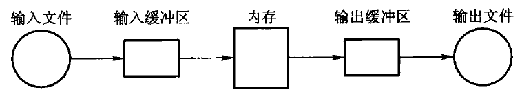

# 第9章　文件管理和外排序

*Updated 2026-09-05 GMT+8*
 *Compiled by Hongfei Yan (2026 Fall)*
https://github.com/GMyhf/dsa-modernization

> **教材对应**：《数据结构与算法》（张铭、王腾蛟、赵海燕，高等教育出版社 2008）第 9 章
> **主题与学习重点**：这一章换掉了成本模型 —— 从「数比较次数」变成「数页 I/O 次数」。
> 顺串生成与多路归并的每一处设计，都是围绕这一件事。

**知识点**：主存与外存的差别、页块与缓冲；文件的逻辑 / 物理组织；C++ 流文件的现代接口；
外排序的两个阶段与归并趟数；置换选择排序；二路与多路归并；赢者树与败者树。

**配套材料**

| 类型 | 位置 |
| --- | --- |
| 课件（23 页，16:9） | [`DSA_CH09_File_External_Sorting.pptx`](DSA_CH09_File_External_Sorting.pptx) |
| 视频（720p 轻量版） | [`video/ch09-preview.mp4`](video/ch09-preview.mp4) |
| 书稿正文 | [`../book/ch09-external-sort.md`](../book/ch09-external-sort.md) |
| 代码 | [`../code/ch09/external_sort/`](../code/ch09/external_sort/) |

---

## 本章换掉了一件事：成本模型

前八章数的是**比较次数**。这一章数的是**页 I/O 次数** ——
**一次磁盘 I/O 往往比一次比较贵几个数量级。**

两个目标贯穿全章，都是为了**减少归并趟数**：

1. **减少初始顺串个数 $m$** —— 9.3.1 置换选择排序；
2. **增加归并路数 $k$** —— 9.3.3 多路归并。

---

## 9.1 主存储器和外存储器

**主存**（RAM、cache）在主板上，按单元连续编址，CPU 直接访问，
一次存取可以看成很小的常数，单位是**纳秒**。它快、贵、容量小、断电就丢。

**外存**（硬盘、磁带、U 盘）便宜、容量大、断电不丢，
但**一次存取以毫秒甚至秒计，比内存慢几个数量级**。

外存慢的一个原因是**每次访问都要先定位再读写**：
磁盘要把磁头移到目标磁道，再等扇区转到磁头下，
**定位往往就要几毫秒到几十毫秒，远慢于真正把数据读出来。**

所以外存按固定大小的**页块**存取：一次定位读写一整页，减少定位次数。

### 先建立成本模型

**分析外排序时，不能再只数比较次数。**

设文件有 $N$ 个记录，每页可放 $B$ 个记录：

- 顺序扫描一遍至少要读 $\lceil N/B \rceil$ 页；
- 若这一遍还要把结果写回外存，I/O 量就是大约 $2\lceil N/B \rceil$ 页。

> **内存中多做几次比较，通常远比多一次整文件读写便宜。**

| 层次 | 访问单位 | 本章关心的性质 |
| --- | --- | --- |
| CPU cache / 主存 | 字或 cache line | 可随机访问，比较和交换在这里完成 |
| SSD / 磁盘 | 页块 | 定位与传输有固定成本，应**顺序、批量**读写 |
| 磁带等顺序介质 | 连续块 | 随机定位尤其昂贵，**归并比原地交换合适** |

**举个数**：1 亿条 16 字节记录约占 1.6 GB。若内存工作区只有 64 MB，
**任何「把全部记录放进数组再排序」的内部排序都不成立** ——
外排序必须让大部分记录始终留在外存，只在内存里保存少量缓冲页和当前候选。

图 9.1　输入缓冲、内存工作区和输出缓冲是分开的。
输入缓冲空了才整页补入，输出缓冲满了才整页写回 ——
**工作区处理的是记录，真正与设备交换的是页。**

---

## 9.2 文件的组织和管理

**文件**是外存上的数据结构，由大量性质相同的**记录**组成。

原书区分**逻辑文件**（应用看见的记录顺序与字段）与**物理文件**
（系统实际读写的页、块和地址）—— **这个区分仍然重要**。

| 组织方式 | 保留的核心取舍 | 当代说明 |
| --- | --- | --- |
| **顺序文件** | 连续扫描快，按中间位置更新贵 | 日志、列式批处理和外排序的顺串都利用这种顺序 I/O |
| **散列文件** | 按键定位快，范围扫描与有序输出差 | 冲突、页满都必须按页处理（第 10 章） |
| **索引文件** | 用较小目录把键映射到记录位置 | 现代数据库常用 B+ 树、LSM（第 11 章） |
| **倒排文件** | 用属性值反查记录集合 | 搜索系统的核心（第 11 章） |

### 一个必须澄清的说法

顺序文件的「物理顺序与逻辑顺序一致」**不能理解成文件一定连续占用磁盘扇区**。
现代文件系统可能重排块位置、使用写时复制或远端对象存储。

> 对本章而言真正要守的是：**读者可以顺序消费页，写者可以批量产生页。**
> 这正是归并比大量随机交换更适合外排序的原因。

定长记录能用「第 $i$ 条在第几页」直接定位；
变长记录通常需要**槽目录**，把稳定的槽号映射到会移动的页内偏移。

删除也有两种代价模型：**立即压紧**能保持扫描紧凑但可能搬动大量记录；
**留下墓碑**写入便宜但会积累空洞，积到一定程度仍要重组。

> 第 10 章闭散列里的墓碑解决的是同一种矛盾，只是那里的搬动单位是数组槽，这里是页块。

### 9.2.2 C++ 的流文件：原书接口已是历史写法

**概念仍然成立**：**文件**是持久化的数据对象，**流**是程序在某一时刻对它顺序读写的通道。

但接口变了 —— `<fstream.h>` **不是标准 C++17 头文件**：

| 原书操作 | 今天仍保留的意思 | 现代接口与边界 |
| --- | --- | --- |
| `open` / `close` | 取得或结束文件访问 | 构造时打开或调用 `open()`；**RAII 负责通常的关闭** |
| `read` / `write` | 在当前位置传输字节 | ⚠️ **不能把含指针、虚函数表或依赖字节序的 C++ 对象直接写入文件** |
| `seekg` / `seekp` | 移动读/写位置 | ⚠️ **只适用于支持随机访问的对象** —— 管道、终端、许多网络流不能任意定位 |

文件名应通过 `std::string` 或 `std::filesystem::path` 表达，
位置用 `std::streamoff` / `std::streampos`，而不是 `char*` 和 `int`。

> 本章的实现**故意以容器模拟输入与输出，不假装一段未测试的文件 I/O 就是外排序**。
> 它验证的是顺串、归并与选择树的算法不变量；真正连接文件时，
> 调用方还必须处理打开失败、短读短写、编码/字节序、临时文件原子替换和崩溃恢复。
> 这些是重要的工程课题，但**不是把原书算法换成错误 I/O 示例的理由**。

---

## 9.3 外排序

内存装不下时，**把外存数据划分成若干段，每段读进内存用内排序排好** ——
这些已排序的段称为**顺串**或**归并段**（run），写回外存等待归并。

**外排序的时间由三部分组成**：内部排序、外存信息读/写、内部归并。
**而外存的读/写速度比内存慢得多，因此减少外存读写次数是提高效率的关键。**

设有 $m$ 个初始顺串，每次归并 $k$ 个，**归并趟数为 $\lceil \log_k m \rceil$**。
于是减少趟数只有两条路：**减少 $m$**（9.3.1）或**增大 $k$**（9.3.3）。

> 若内存能放 $M$ 条记录，普通分批排序只能产生长度至多 $M$ 的初始顺串，
> 顺串数约 $r = \lceil N/M \rceil$。
> **每减少一趟，省下的是约 $2N/B$ 次页 I/O，而不是几个比较。**

### 9.3.1 置换选择排序

**置换选择排序是在堆排序的基础上演化而来的。**

朴素做法每批排成一条长为 $M$ 的顺串，顺串数 $\lceil N/M \rceil$，一个也少不了。

**置换选择的改进**：输出堆顶之后，若下一条记录**不小于**刚输出的值，
它还可以进入当前顺串；否则**冻结**到下一趟。

> **置换选择排序得到的顺串长度并不相等，但平均情况下可以形成长度为 $2M$ 的顺串** ——
> 顺串数因此大约减半，而每减少一半顺串数，归并趟数就可能少一趟，
> **省下的是一整轮完整的读写**。

原书图 9.2 的输入是 `50 49 35 45 30 25 15 60 16 27 1`，工作区 $M = 7$：

| 步 | 输出 | 输出后读入 | 去向 | 当前顺串 | 冻结 |
| ---: | ---: | ---: | --- | --- | --- |
| 初始 | — | 前 7 条 | 建堆 | — | — |
| 1 | 15 | 60 | $60 \ge 15$，**活跃** | 15 | — |
| 2 | 25 | 16 | $16 < 25$，**冻结** | 15 25 | 16 |
| 3 | 30 | 27 | $27 < 30$，冻结 | 15 25 30 | 16 27 |
| 4 | 35 | 1 | $1 < 35$，冻结 | 15 25 30 35 | 16 27 1 |
| 5–8 | 45,49,50,60 | 输入耗尽 | 排空活跃堆 | **15 25 30 35 45 49 50 60** | 16 27 1 |
| 新顺串 | 1,16,27 | — | 冻结区重新建堆 | **1 16 27** | — |

**第一条顺串长度 8，已经超过 $M = 7$** —— 这就是置换选择的收益。

#### 两个守门不变量

1. **每条顺串内部非递减** —— 保证归并可以工作；
2. **全部顺串拼在一起包含输入的每条记录，且恰好一次** —— 防止冻结时丢记录或重复输出。

#### 输入次序决定顺串长度

- **单调递增**输入会一直补进活跃堆 → 得到**一条**长顺串；
- **单调递减**输入几乎每次都冻结 → 顺串接近长度 $M$；
- 随机排列在常见独立分布假设下平均约为 $2M$ —— **但这是平均结论，不是最坏保证。**

> ⚠️ **若把整份输入推进一个堆再依次弹出，得到的是一条完全有序序列 ——
> 那是堆排序，不是置换选择。**
> 旧实现曾经这样做，而测试只断言 `{3,1,2} → {1,2,3}` ——**堆排序也能过**。
> 现在的接口返回**若干顺串**，并用原书这组数据守门。

### 9.3.2 二路外排序

对 $m$ 个顺串两两归并，趟数是 $\lceil\log_2 m\rceil$。

**归并两条顺串至少需要三个缓冲页**：两页分别保存两路尚未消费的记录，一页收集输出。
比较两个输入缓冲的队首，把较小者移入输出缓冲；
某个输入页耗尽就读该顺串下一页，输出页满则整页写回。
**这样每个输入页恰好读一次，每个输出页恰好写一次。**

原书图 9.3 的例子有 3000 条记录，初始得到 10 条、每条 300 条的顺串：

| 趟次 | 输入顺串数 | 合并方式 | 输出顺串数 |
| ---: | ---: | --- | ---: |
| 0 | 10 | 初始顺串 | 10 |
| 1 | 10 | 两两归并 | 5 |
| 2 | 5 | 两对归并，1 条轮空 | 3 |
| 3 | 3 | 一对归并，1 条轮空 | 2 |
| 4 | 2 | 最后归并 | 1 |

确实需要 $\lceil\log_2 10\rceil = 4$ 趟，归并阶段传输约 $4 \times 2N = 8N$ 条记录。
**置换选择若把初始顺串数从 10 降到 5，就只需 3 趟，直接省掉一次完整读写。**

> **「增加归并路数总会更快」也不成立。**
> $k$ 越大趟数越少，但**至少要为每一路留一个输入缓冲**，还要有输出缓冲；
> 内存固定时，每路缓冲变小、补页更频繁。
> **选择 $k$ 是「少趟数」和「每路有足够缓冲」之间的折中。**

### 9.3.3 多路归并 —— 选择树

**先算一笔账：为什么多路归并需要选择树。**

在 $k$ 路归并中，为在 $k$ 个队首里找出最小者，需要 $k-1$ 次两两比较。
对记录总数为 $n$ 的文件，内部归并的总比较次数是

$$\lceil \log_k m \rceil \cdot (k-1) \cdot (n-1) = \frac{\lceil \log_2 m \rceil}{\log_2 k} \cdot (k-1) \cdot (n-1)$$

**随着 $k$ 的增大，$(k-1)/\log_2 k$ 也将增大** ——
即内部归并的时间随之增大，**某种程度上削减了由于增大 $k$ 而减少归并趟数带来的好处**。

**选择树正是用来消掉这一项的。** 它从 $k$ 个关键码中找最小值只需树高
$\lceil\log_2 k\rceil$ 次比较，于是总比较次数变为

$$\lceil \log_k m \rceil \cdot \lceil \log_2 k \rceil \cdot (n-1) = \lceil \log_2 m \rceil \cdot (n-1)$$

> **此时内部比较次数与 $k$ 无关，不随 $k$ 的增加而增加 —— 这就是选择树存在的全部理由。**

#### 赢者树与败者树

选择树是**完全二叉树**，顺序存储；也称**竞赛树**，反映一系列「淘汰赛」的结果。

**赢者树**：$n$ 个外部结点（选手）、$n-1$ 个内部结点，
**每个内部结点记录其左右子结点相应赛局的赢家**，树根记录整个比赛的胜者。
用数组存储时，**数组 $B$ 中实际存放的是数组 $L$ 的索引**，不是值。

> **优点**：如果一个选手的分数值改变了，**只需要沿着从它到根结点的路径修改，
> 而不必改变其他比赛的结果**；而且**爬到某一场比赛结果没有改变时就可以停** ——
> 修改次数在 $0 \sim \log_2 n$ 之间。

**败者树**：内部结点记录的是**败者**的下标，另外加入 $B[0]$ 记录整个比赛的**冠军**。
重赛时，新进入的结点与父结点比赛，**败者的下标留在父结点，赢者再与上一级比较**。

> **这正是败者树比赢者树少一次「取兄弟」访问的原因，也是外排序实现里更常见的选择。**

#### 一句限定：选择树不是通用的「取最小」工具

赢者树和败者树统称**选择树**，是**外部排序多路归并中的专用优化**；
**内存内的一般「取最小」任务通常直接使用二叉堆或优先队列**，
只有需要反复从固定的多路输入中选冠军时才值得维护选择树。

> 差别在哪：堆的元素集合是变动的（任意插入删除）；
> 选择树的**选手位置是固定的 $k$ 个槽**，每次只是替换其中一个槽的值。
> **「位置固定、只换值」这个约束，正是它能只沿一条路径重赛的前提。**

---

## 本章小结

- **成本模型换了**：数的是页 I/O，不是比较次数。
- 外排序 = **顺串生成 + 归并**；归并趟数 $\lceil\log_k m\rceil$。
- **减少趟数的两条路**：减小 $m$（置换选择）、增大 $k$（多路归并）。
- **置换选择**在堆排序上加一条「不小于刚输出的值就还能进当前顺串」，平均顺串长 $2M$。
  顺串长度不等；单调递增输入得一条长顺串，单调递减输入接近 $M$。
- **选择树**把 $k$ 路选最小的代价从 $k-1$ 降到 $\log_2 k$，使内部比较次数**与 $k$ 无关**。
- **败者树**比赢者树少一次取兄弟访问，是外排序实现里更常见的选择。

---

## 习题与参考答案

**1.** $N$ 条记录、每页 $B$ 条、$k$ 路归并：写出总页 I/O 的表达式，并说明减少一趟省下多少。

> **答**：顺串生成阶段读写各一遍，约 $2\lceil N/B\rceil$ 页；
> 归并阶段每趟同样读写各一遍，共 $\lceil\log_k m\rceil$ 趟。
> 总计约 $2\lceil N/B\rceil(1 + \lceil\log_k m\rceil)$ 页。
> **减少一趟省下的正是 $2\lceil N/B\rceil$ 页 —— 一整轮完整的读写。**

**2.** 对给定输入手工走一遍置换选择，写出每一步的活跃堆与冻结区。

> **答**：见正文的表。要点是每一步都要问同一个问题：
> **刚读进来的记录，与刚输出的值比，是不是不小于？** 是就进活跃堆，否则冻结。

**3.** 构造使置换选择只得到**一条**顺串的输入；再构造使每条顺串都恰好为 $M$ 的输入。

> **答**：**单调递增**的输入只得到一条顺串 —— 每次读进来的都不小于刚输出的值，永远不冻结。
> **单调递减**的输入几乎每条记录都冻结，顺串长度接近 $M$。
> 这两个极端说明「平均 $2M$」确实只是平均结论。

**4.** 对 5 路输入画出赢者树与败者树；替换一名选手，写出重赛路径。

> **答**：赢者树的内部结点存赢家下标，重赛时每层要**取出兄弟**再比一次；
> 败者树的内部结点存败者下标，重赛时**直接与父结点里的败者比** —— 少一次访问。
> 两者的重赛路径都是「从被替换的叶到根」，长度 $\lceil\log_2 k\rceil$。

**5.** 为什么败者树比赢者树少一次访问？

> **答**：赢者树的内部结点存的是**赢家**，而新选手要跟**上一轮的对手**比 ——
> 那个对手不在父结点里（父结点存的是赢家，可能就是新选手自己那一支），
> 所以要先去兄弟结点取。
> 败者树的父结点里存的正是**上一轮的败者**，也就是这一轮该跟谁比 —— 直接读出来即可。

**6.（上机）** 实现置换选择并验证两条不变量。

> 断言应当是：**每条顺串内部非递减**；**把全部顺串拼起来，
> 排序后与输入排序后逐项相等**（即每条记录恰好出现一次）。
> ⚠️ 只断言 `{3,1,2} → {1,2,3}` 是不够的 —— **堆排序也能过这个断言。**
> 必须用原书那组数据检查**顺串的个数与分界**。
