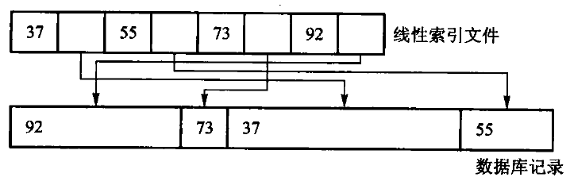

# 第11章　索引技术

*Updated 2026-09-05 GMT+8*
 *Compiled by Hongfei Yan (2026 Fall)*
https://github.com/GMyhf/dsa-modernization

> **教材对应**：《数据结构与算法》（张铭、王腾蛟、赵海燕，高等教育出版社 2008）第 11 章
> **主题与学习重点**：本章的关键指标不是 CPU 比较次数，而是**磁盘页访问次数**。
> 索引页装得多 → 层数少 → 访外少 —— 这一条推着结构从线性索引一直走到 B+ 树。

**知识点**：稠密索引与稀疏索引、多级索引；静态多分树、扇出与批量装入；
倒排索引与 posting list；B 树的定义、性质、插入与树高分析；B+ 树；
动态索引与静态索引的取舍；位图索引。

**配套材料**

| 类型 | 位置 |
| --- | --- |
| 课件（27 页，16:9） | [`DSA_CH11_Indexing.pptx`](DSA_CH11_Indexing.pptx) |
| 视频（720p 轻量版） | [`video/ch11-preview.mp4`](video/ch11-preview.mp4) |
| 书稿正文 | [`../book/ch11-index.md`](../book/ch11-index.md) |
| 代码 | [`../code/ch11/linear_index/`](../code/ch11/linear_index/)、[`../code/ch11/bplus_tree/`](../code/ch11/bplus_tree/) |

> ⚠️ 第 11 章在原书里**没有任何【算法】或【代码】清单** ——
> 它讲的是结构与取舍，不是某一段代码。本书为它补了两份可运行实现。

---

## 11.1 线性索引

第 1 章和第 9 章已经说过：**外存上逐条扫描主文件太贵，应该先查一张较小的表，
再按位置读记录。** 线性索引就是这张表：项是 `(key, location)`，按 key 排序，
**可以在内存里二分**。

- **稠密索引**为**每条记录**建一项。主文件可以无序，查到索引项就直接得到记录位置。
- **稀疏索引**只为**每个有序数据块**建一项，通常记下该块的最小 key；
  查到块之后还要**在块内再找一次**。更省空间，**但要求主文件按 key 分块有序**。



图 11.1　记录长度不同，**不能用「基地址 + 下标 × 固定长度」直接计算位置**。
索引项保存关键码和记录地址，**把逻辑顺序与物理布局分开**；
主文件移动后要更新地址，索引本身不保存完整记录。

### 多级索引

第一层索引太大、内存放不下时，**再为它建一层**，成为**多级索引**。
一次查询的路径是：**内存里的顶层 → 读一个索引页 → 读数据页**。

> **这时的关键指标不是 CPU 比较次数，而是磁盘页访问次数。**

本章的可运行实验（`code/ch11/linear_index`）把这件事量出来了：
同样 1000 条记录、每数据页 4 条，

- **每索引页 4 项** → 层数多，一次查询要读的页也多；
- **每索引页 64 项** → **层数立刻降下来，访外次数随之下降**。

> **索引页装得多，层数就少** —— 这就是 11.2 要做多分树的全部理由。

---

## 11.2 静态索引 —— 多分树

磁盘按页读写，**一个索引结点通常设计成恰好装满一页**。
二叉树每个结点只有两个孩子，同样多的 key 会把树撑得很高，查询就要读很多页。

**多分树降低的是高度。** 若每个结点最多有 $m$ 个孩子、树高为 $h$，
理想满树可导航约 $m^h$ 个叶页：

> **同样覆盖一百万个叶页，二叉树约需 20 层，100 路树只需 3 层。**

页内要比较更多分界 key，**但整页已经在内存里**，代价通常远小于多读一次外存页。

### 扇出不是随意选的

页大小 4096 字节，若每个「关键码 + 孩子页号」占 16 字节，
扣除页头后大约能放 250 项，**扇出约 251**。
**关键码变长或页头元数据增加，扇出就会下降。**

> **数据库索引喜欢短关键码，不只为省总空间，也为让一页容纳更多分支、压低树高。**

### 静态的代价

静态多分树在批量装入时按页填满，之后**结构不再变**。
插入、删除会破坏「一页正好满」的约定：多出来的记录只能进**溢出区**，
少了的页会变稀，最终往往要**重组整棵树**。

> **所以它适合「一次建好、很少改」的文件，不适合频繁更新的目录。**

**批量装入**本身就是「按页填满、自底向上建层」：
必须**先按 key 排好记录**，然后连续填叶页，再用每个孩子的最小 key 建上一层。
**这样叶页天然相邻，范围扫描接近顺序 I/O。**

> ⚠️ **一条条随机插入再指望得到相同布局是不行的** ——
> 结点会因分裂留下空隙，树形和页利用率都不同。

---

## 11.3 倒排索引

前面的检索是**由记录确定属性值**；倒排索引反过来 —— **由属性值确定记录的位置**。

原书的例子是教师登记表（主关键码是职工号，另有姓名、系、职称、专长）：

- 「列出职称为讲师的所有职工号」用普通检索要**顺序扫描所有记录**；
- 「列出计算机系擅长英语的教员」还要对每个记录先检查「系」域、再看「专长」域 ——
  **效率很低**。

**倒排表**（inverted list）：对每个感兴趣的属性值建一个线性表，
存放具有该属性值的所有关键码。

```text
计算机系 -> [0310, 0330, 0341]
英语专长 -> [0310, 0421]
```

「计算机系**且**擅长英语」就是两个有序列表的**交集**，结果是 `[0310]`。
**或查询是并集，差查询是差集。**

### 对正文文件的倒排

- **词索引**把正文看做符号和词的集合，抽取关键词组成结构。
  适合易解析成词的文本（英文），**但不适合生物学数据和一些东方语言书写的文本**，
  而且**查询词被限制在关键词范围内**。
- **全文索引**把正文看做一个长字符串，记录**子字符串**的开始位置。
  查询可以针对任何子串，代价是**通常需要更大的空间**。

**倒排文件是使用得最广泛的词索引**：一个排序关键词的列表，
每个关键词指向一个 **posting list** —— $\{(d, f, a), \ldots\}$，
其中 $d$ 是文档标号、$f$ 是出现次数、$a$ 是出现信息（位置、权重）。

> 为节省空间可以去掉频率、甚至去掉位置只保留文档编号；
> **但短语查询需要位置信息** —— 要用「位置是否相邻」来过滤。

---

## 11.4 动态索引

**动态索引结构在系统运行过程中插入或删除记录时，索引结构本身也可能发生改变**，
以保持较好的检索性能 —— 这与 11.2 节的静态索引形成对照。

### 为什么外存索引必须用多分树

**二叉搜索树不能保证平衡，有可能退化为线性表。**

> **外存索引结构的平衡性能非常重要，因为退化的树结构将导致树形索引的失败，
> 而面临巨大的访外开销。**

第 12 章的 AVL 树能使 BST 始终保持 $\Theta(\log n)$ 平衡，
**但其频繁的插入删除调整对于外存树索引来说也需要很大的 I/O 访问量**。

于是问题变成两条：

1. 怎样保持多分树高度上的平衡，不让它退化为线性？
2. 怎样使多分树结点中关键码尽可能多，而插入删除又不需要太多调整树结构的动作？

**1970 年 R. Bayer 和 E. McCreight 提出了 B 树**（balanced tree）。

> ⚠️ 那个「-」是英文的连字符，**不要说成「B 减树」**。

### $m$ 阶 B 树的定义：五条，缺一不可

1. 每个结点至多有 $m$ 个子结点；
2. 除根和叶外，其他每个结点至少有 $\lceil m/2\rceil$ 个子结点；
3. 根结点至少有两个子结点（例外：根可以为空，或者独根）；
4. **所有的叶结点在同一层**，可以有 $\lceil m/2\rceil - 1$ 到 $m-1$ 个关键码；
5. 有 $k$ 个子结点的分支结点**恰好包含 $k-1$ 个关键码**。

最底层叶结点的指针指向空（对应失败检索），
**空指针数目正好等于树中所包含的关键码数目加 1**。

> **阶为 3 的 B 树就是通常说的「2-3 树」。**

### B 树的四条性质

1. **总是树高平衡的**，所有叶结点都在同一层；
2. **更新和检索操作只影响一些磁盘块**，因此性能很好；
3. **把关键码接近的记录放在同一个磁盘块中** —— **利用了访问局部性原理**；
4. **保证树中至少有一定比例的结点是满的** ——
   既保证空间利用率，又使插入删除**不必像静态多分树那样频繁地修改结点**。

一个含 $r$ 个关键码的内部结点有 **$r+1$ 个孩子**：
最左孩子的键都小于第一个关键码，相邻两个关键码之间各管一个区间。

> ⚠️ **若孩子数与关键码数不满足「多一个」，结点结构已经损坏。**

### 检索要算访外次数

在含 $n$ 个关键码的 $m$ 阶 B 树上检索，路径上的结点数不超过 $h+1$，
**即最多 $h+1$ 次访外**，再加读主文件那一次。

以原书图 11.5 为例：检索关键码 31 要访问 3 个索引树结点，外加 1 次读数据盘，
**共 4 次访外**；检索 12 只要访问 2 个索引结点，**共 3 次访外**。

### 插入：可能朝着根的方向生长

先检索关键码是否在树中，在则拒绝；不在，则最后找到的叶结点即为插入位置。

插入后若关键码个数 $< m$，完成；**否则等于 $m$，产生上溢出**：

- 取这 $m$ 个关键码的**中位数**为分界码；
- 叶结点分裂为 $\lceil (m-1)/2\rceil$ 与 $\lfloor (m-1)/2\rfloor$ 两个结点；
- **分界码插入到父结点**；父结点若也溢出，**分裂继续往根传递，有可能一直分裂到根**。

**访外次数可以算出来**：向下找插入结点读盘 $h$ 次；每分裂一个非根结点写 2 个，
分裂根结点写 3 个，因此最坏情况下

$$\text{插入最多访外次数} = h + 2(h-1) + 3 = 3h + 1$$

### 根结点为什么可以只有 2 个子结点？

根允许 $2 \sim m$ 个子结点，而内部结点是 $\lceil m/2\rceil \sim m$ —— 这不是随意的例外：

> **因为插入算法分裂到根结点时会分为 2 个子结点并产生一个新根**；
> 如果要求根与其他内部结点具有同样的出度，就需要对 B 树进行比较大的调整，
> **这就违背了 B 树操作的局部调整原则。**

而且**实际运行时根结点往往在内存中保存**，不需要遵守下限约束；
大部分内部结点在外存，需要保证存储块**至少半满**以折衷存储效率和操作效率。

> **根也不可能只有一个子结点** —— 那样太浪费存储空间，还会相应增加检索时间。

### B 树的性能分析

**先算树高。** 设 B 树含 $N$ 个关键码，则失败检索的外部结点有 $N+1$ 个。
根至少两个子结点，此后每层至少乘 $\lceil m/2\rceil$，于是
$N+1 \ge 2\lceil m/2\rceil^{I-1}$，即

$$I \le 1 + \log_{\lceil m/2\rceil}\left(\frac{N+1}{2}\right)$$

> **代进数字：$N = 1999998$、$m = 199$ 时，$I$ 至多等于 4。**
> 因为一次检索至多进行 $I$ 次存取，这个公式保证了 B 树的检索效率相当高。

**再从磁盘块的角度估算 B+ 树的索引规模**（这段是全章最值得记住的一笔账）：

```text
假定：磁盘块 4096 字节，整数关键码 4 字节，指针 8 字节，不计块头

    满足  4m + 8(m+1) <= 4096  的最大整数 m   ->   m = 340   （阶）

平均充满度取最大与最小的中间，即平均 255 个指针，3 层 B+ 树：

    根                255 个子结点
    第二层            255^2  =     65 025 个叶结点
    叶层              255^3  ~= 16 600 000 个指向记录的指针
```

> **记录数小于等于约 1660 万的文件，都可以被 3 层的 B+ 树容纳，
> 3 次访外就可以获得关键码在主文件的地址。**
>
> **实际上还可以更少**：B+ 树树根通常处于内存中，
> 把第二层结点也完全保存在缓冲区中是合理的 —— **这样只需要读一次叶结点磁盘块**。
> 这一句解释了今天数据库索引的常见形态：**三层 B+ 树 + 常驻内存的上两层。**

**插入时平均分裂几个结点？** 可以推出

$$s = \frac{p-1}{N} \le \frac{1}{\lceil m/2\rceil - 1}$$

> **$m$ 越大这个数越小 —— 这正是「结点开大一点」在插入代价上的回报。**

### B 树与 B+ 树谁更矮？

**B 树的关键码在内部结点上也带着数据地址** —— 这正是它与 B+ 树的分水岭。
B+ 树的内部分支结点**不需要带这些隐含指针**，同一页能装更多分支。

> **在磁盘页块容量一致、页块指针大小相同的情况下索引同一个主文件，
> B 树比 B+ 树高，即 B+ 树索引效率更高。**

B+ 树最大充盈度 100%、最小 50%，取平均 75%，即平均每结点 $0.75m$ 个子结点，
**高度为 $\lceil\log_{0.75m} N\rceil$**。

还有一条 B 树没有的好处：**数据集中在叶层，叶链可顺序读** —— 范围扫描很快。

### 11.4.4 动态索引与静态索引的比较

| 工作负载 | 更合适的选择 | 原因 |
| --- | --- | --- |
| 数据几乎只读、可批量重建 | **静态索引** | 结构紧凑，读路径短 |
| 持续插入和删除 | **B / B+ 树** | 局部调整即可保持查询性能 |
| 范围扫描很多 | **B+ 树** | 数据集中在叶层，叶链可顺序读 |
| 记录物理地址必须长期稳定 | **静态索引** | 不因结点分裂搬动既有记录 |

> **选择的关键不是「哪一种总是更快」，而是更新成本由谁承担**：
> 静态索引把成本**推迟**到昂贵的批量重组，动态索引把成本**摊**到每次更新。
> 读多写少且有维护窗口时静态结构仍有价值；无法停机重组时动态索引更合适。

---

## 11.5 位索引技术

**位图索引适合取值很少的属性** —— 性别、省份、是否及格。
每个属性值对应一个位串，第 $i$ 位表示第 $i$ 条记录有没有这个值。

**AND、OR、NOT 查询变成机器字上的按位运算，一次可以处理几十上百条记录。**

> 这与 10.2 节的位向量是同一个思想，只是那里的「元素」换成了这里的「记录」。

⚠️ **属性取值一多，位图会变得很宽**，需要压缩（游程、字对齐混合等）。

**所以位图索引和 B+ 树是互补的**：
低基数属性（几十种取值）用位图；高基数属性（近乎唯一）用 B+ 树。

---

## 本章小结

- **成本模型是页访问次数**，不是比较次数。
- **线性索引**把逻辑顺序与物理布局分开；稠密 vs 稀疏是「空间 vs 块内再查一次」的取舍。
- **索引页装得多 → 层数少 → 访外少**，这是多分树的全部理由；
  **扇出由页大小与项大小定死**。
- **倒排索引**从属性值走到记录集合，「且 / 或 / 非」变成集合的交 / 并 / 差。
- **B 树**：五条定义、四条性质；插入靠**分裂**，可能一直传到根，最坏访外 $3h+1$；
  树高 $I \le 1 + \log_{\lceil m/2\rceil}((N+1)/2)$。
- **B+ 树**内部结点不带数据地址，因而更矮；叶层成链，**范围扫描接近顺序 I/O**。
- **位图索引**适合低基数属性，查询变成按位运算。

---

## 习题与参考答案

**1.** 同一份数据分别建稠密索引与稀疏索引，比较空间与一次查询的页读次数。

> **答**：稠密索引每条记录一项，索引本身可能就要好几页，但**查到索引项就直接得到位置**；
> 稀疏索引每块一项，索引小得多，但**查到块后还要在块内再扫一次**。
> 稠密索引不要求主文件有序，稀疏索引**要求主文件按 key 分块有序** —— 这是更硬的约束。

**2.** 页 8192 字节、关键码 8 字节、指针 8 字节时，B+ 树的阶是多少？树高变几层？

> **答**：解 $8m + 8(m+1) \le 8192$ 得 $m \le 511$，取 $m = 511$。
> 平均充满度按 75% 算，每结点约 383 个子结点；
> 3 层可容纳 $383^3 \approx 5.6\times10^7$ 条记录 ——
> **比 4096 字节页的 1660 万多了三倍多**。这就是「页大一倍，容量涨一个量级」的来历。

**3.** 对给定序列依次插入，画出每次分裂后的形状；标出访外次数。

> **答**：每次插入先向下走 $h$ 次找叶。溢出时取**中位数**上提，
> 分裂写 2 个结点；若一直传到根，最后那次写 3 个。**最坏总计 $3h+1$。**
> 画的时候要检查每一步：**孩子数是不是恰好等于关键码数加 1**，叶是不是还在同一层。

**4.** 推导树高上界，并说明为什么根允许只有 2 个子结点。

> **答**：推导见正文。根允许 2 个子结点，是因为**分裂到根时正好产生一个有 2 个孩子的新根**；
> 若强制根也满足 $\lceil m/2\rceil$ 的下限，每次根分裂都要做全局调整，
> **违背 B 树的局部调整原则**。而且根通常常驻内存，不受「至少半满」这条存储效率约束。

**5.** B 树与 B+ 树索引同一主文件，谁更矮？差别的来源是什么？

> **答**：**B+ 树更矮。** 来源是 B 树的内部结点也带着数据地址（隐含指针），
> 同一页里每一项更大，于是**扇出更小、层数更多**。
> B+ 树把数据地址全部下放到叶层，内部结点只留「关键码 + 孩子页号」。

**6.** 给定三条 posting list，求「A 且 B 非 C」；说明为什么短语查询需要位置信息。

> **答**：`(A ∩ B) − C`，三条有序表做归并式的交与差，$O(|A|+|B|+|C|)$。
> **短语查询要的是「两个词紧挨着」** —— 只知道两个词都在同一篇文档里，
> 不能断定它们相邻，所以必须保留每个词在文档中的**位置**并检查差值是否为 1。

**7.（上机）** 量出「每索引页项数 → 层数 → 页读次数」的关系曲线。

> 用 `code/ch11/linear_index`：固定记录数与数据页大小，只改索引页容量，
> 记录 `levels()` 与 `page_reads()`。
> **你会看到层数是阶梯式下降的**（因为它是取整的对数），
> 而页读次数跟着层数一起跳 —— 这正是「扇出决定一切」最直观的证据。
